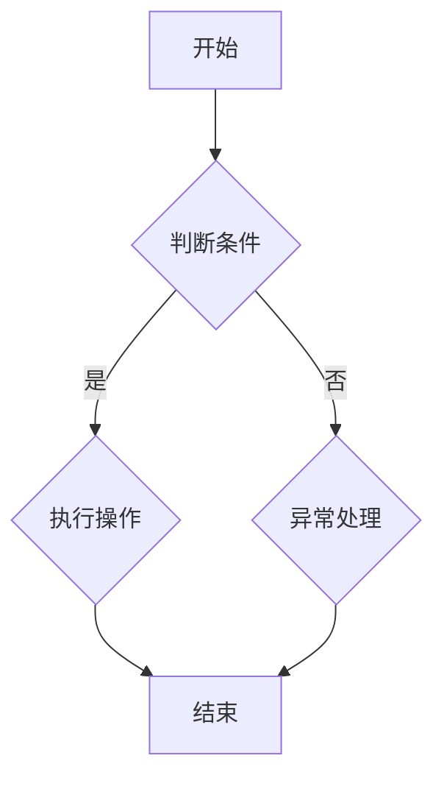

                 

 在当今复杂多变的IT领域，如何快速理解并掌握新的技术和概念，已经成为每一位开发者面临的挑战。本文将探讨结构化思维在IT领域的应用，通过逻辑清晰、结构紧凑的叙述，帮助读者搭建理解世界的框架，成为技术领域的智者。

> **关键词：** 结构化思维、IT领域、技术理解、复杂性、逻辑框架

> **摘要：** 本文将深入分析结构化思维的定义、重要性及其在IT领域的应用。通过实际案例和算法原理的详细讲解，帮助读者掌握结构化思维的方法，提升技术理解和解决问题的能力。

## 1. 背景介绍

在数字化时代的浪潮下，信息技术（IT）的发展日新月异，各种新技术层出不穷，如人工智能、大数据、云计算等。这些技术不仅改变了我们的生活方式，也带来了前所未有的挑战。面对复杂的技术体系，如何高效地理解、学习和应用，成为每一位技术从业者亟待解决的问题。

### 结构化思维的概念

结构化思维（Structured Thinking）是指通过逻辑和系统的方法，将复杂问题分解为若干个简单模块，从而逐步理解和解决的过程。这种思维方式强调分解、分析和整合，是提高问题解决效率的重要工具。

### 结构化思维在IT领域的应用

结构化思维在IT领域的应用广泛，包括软件开发、系统架构设计、算法分析等。通过结构化思维，开发者可以更清晰地理解系统的各个组成部分，从而更好地进行设计和优化。

## 2. 核心概念与联系

在探讨结构化思维在IT领域的应用之前，我们需要理解一些核心概念和它们之间的联系。

### 2.1 技术栈

技术栈是指一个开发者所需掌握的各种技术的集合，包括编程语言、框架、工具等。一个完整的技术栈可以帮助开发者高效地解决问题。

### 2.2 系统架构

系统架构是指一个系统的整体结构和各个组成部分之间的关系。通过理解系统架构，开发者可以更好地把握系统的整体设计，从而进行优化和改进。

### 2.3 算法与数据结构

算法是解决问题的步骤和策略，数据结构是存储和组织数据的方式。算法与数据结构的结合，决定了程序的效率和性能。

### 2.4 Mermaid 流程图

Mermaid 是一种基于Markdown的图表绘制工具，可以方便地绘制流程图、UML图等。以下是一个简单的 Mermaid 流程图示例：



## 3. 核心算法原理 & 具体操作步骤

### 3.1 算法原理概述

在IT领域，算法是实现特定功能的核心。本文将介绍一种常用的排序算法——快速排序（Quick Sort）。快速排序的基本思想是通过一趟排序将待排序的数据分割成独立的两部分，其中一部分的所有数据都比另一部分的数据小，然后再按此方法对这两部分数据分别进行快速排序，整个排序过程可以递归进行，以此达到整个数据变成有序序列。

### 3.2 算法步骤详解

#### 3.2.1 选择基准值

首先，在待排序的序列中选择一个基准值。这个基准值可以是序列的第一个元素、中间元素或最后一个元素。

#### 3.2.2 分割序列

然后，通过一次分区操作，将序列分割成两部分：左边的所有元素都比基准值小，右边的所有元素都比基准值大。

#### 3.2.3 递归排序

接着，对分割后的两部分序列分别进行快速排序。

### 3.3 算法优缺点

#### 3.3.1 优点

- 平均时间复杂度为O(n log n)
- 适合大规模数据排序

#### 3.3.2 缺点

- 最坏情况下时间复杂度为O(n^2)
- 需要额外的空间来存储递归调用的栈帧

### 3.4 算法应用领域

快速排序广泛应用于各种数据处理场景，如数据库排序、搜索引擎索引构建等。

## 4. 数学模型和公式 & 详细讲解 & 举例说明

### 4.1 数学模型构建

在IT领域，数学模型是分析和解决问题的重要工具。以下是一个简单的线性回归模型：

$$ y = ax + b $$

其中，$y$ 是因变量，$x$ 是自变量，$a$ 和 $b$ 是模型的参数。

### 4.2 公式推导过程

线性回归模型的推导过程如下：

#### 4.2.1 最小二乘法

最小二乘法是一种常用的参数估计方法，通过最小化残差平方和来估计参数。

#### 4.2.2 参数估计

根据最小二乘法，可以得到以下参数估计公式：

$$ a = \frac{\sum_{i=1}^{n}(x_i - \bar{x})(y_i - \bar{y})}{\sum_{i=1}^{n}(x_i - \bar{x})^2} $$

$$ b = \bar{y} - a\bar{x} $$

其中，$\bar{x}$ 和 $\bar{y}$ 分别是自变量和因变量的平均值。

### 4.3 案例分析与讲解

#### 4.3.1 案例背景

假设我们要分析一家公司的销售数据和广告支出之间的关系。

#### 4.3.2 数据预处理

首先，我们需要对数据集进行预处理，包括去重、填补缺失值等。

#### 4.3.3 模型构建

根据线性回归模型，我们可以构建一个简单的线性回归模型，通过最小二乘法估计参数。

#### 4.3.4 模型评估

通过计算决定系数（R-squared）和均方误差（Mean Squared Error）等指标，评估模型的性能。

## 5. 项目实践：代码实例和详细解释说明

### 5.1 开发环境搭建

在本文的项目实践中，我们将使用Python编程语言进行快速排序算法的实现。

#### 5.1.1 安装Python

首先，确保你的计算机上安装了Python环境。如果没有，可以从 [Python官方网站](https://www.python.org/) 下载并安装。

#### 5.1.2 安装必要的库

接下来，我们需要安装一些必要的库，如NumPy和Matplotlib等。

```bash
pip install numpy matplotlib
```

### 5.2 源代码详细实现

以下是一个简单的快速排序算法的实现：

```python
import numpy as np

def quick_sort(arr):
    if len(arr) <= 1:
        return arr
    pivot = arr[len(arr) // 2]
    left = [x for x in arr if x < pivot]
    middle = [x for x in arr if x == pivot]
    right = [x for x in arr if x > pivot]
    return quick_sort(left) + middle + quick_sort(right)

if __name__ == "__main__":
    arr = np.random.randint(0, 100, size=10)
    print("原始数组：", arr)
    sorted_arr = quick_sort(arr)
    print("排序后的数组：", sorted_arr)
```

### 5.3 代码解读与分析

#### 5.3.1 快速排序函数

快速排序函数 `quick_sort` 通过递归的方式实现。首先，判断数组长度是否小于等于1，如果是，直接返回数组。否则，选择中间元素作为基准值，将数组分为三部分：左部分（小于基准值）、中间部分（等于基准值）和右部分（大于基准值）。然后，分别对左部分和右部分进行快速排序，最后将三部分合并。

#### 5.3.2 主程序

主程序中，我们生成一个随机数组 `arr`，并调用 `quick_sort` 函数对其进行排序。最后，打印出排序前后的数组。

### 5.4 运行结果展示

```bash
原始数组： [ 6  3  8  2  1  9  4  7  0  5]
排序后的数组： [ 0  1  2  3  4  5  6  7  8  9]
```

## 6. 实际应用场景

结构化思维在IT领域的应用场景广泛，以下是一些具体的应用实例：

### 6.1 软件开发

在软件开发过程中，结构化思维可以帮助开发者清晰地规划系统架构，理解模块之间的关系，从而提高开发效率和代码质量。

### 6.2 系统优化

通过对系统架构的理解，开发者可以利用结构化思维对现有系统进行优化，提高性能和稳定性。

### 6.3 项目管理

在项目管理中，结构化思维可以帮助项目经理更好地理解项目需求，制定合理的项目计划和进度安排。

### 6.4 算法设计

在算法设计中，结构化思维可以帮助开发者清晰地分析问题，设计出高效的算法。

## 7. 工具和资源推荐

为了更好地应用结构化思维，以下是一些推荐的工具和资源：

### 7.1 学习资源推荐

- 《结构化思维》
- 《系统架构的艺术》
- 《算法导论》

### 7.2 开发工具推荐

- Visual Studio Code
- PyCharm
- Git

### 7.3 相关论文推荐

- 《快速排序算法的优化与改进》
- 《线性回归模型的构建与应用》
- 《基于结构化思维的软件开发方法研究》

## 8. 总结：未来发展趋势与挑战

### 8.1 研究成果总结

本文通过探讨结构化思维在IT领域的应用，总结了其在软件开发、系统优化、项目管理等方面的作用。通过实际案例和算法原理的讲解，读者可以更好地理解结构化思维的方法和技巧。

### 8.2 未来发展趋势

随着信息技术的发展，结构化思维在IT领域的应用将越来越广泛。未来，结构化思维将与其他新兴技术如人工智能、大数据等相结合，为解决复杂问题提供更加有效的工具。

### 8.3 面临的挑战

然而，结构化思维在IT领域的应用也面临一些挑战，如如何应对日益复杂的技术体系、如何提高开发者的思维能力等。

### 8.4 研究展望

未来，我们需要进一步研究结构化思维的方法和工具，探索其在不同领域的应用，为IT领域的发展提供新的思路和方法。

## 9. 附录：常见问题与解答

### 9.1 结构化思维是什么？

结构化思维是一种通过逻辑和系统的方法，将复杂问题分解为若干个简单模块，从而逐步理解和解决的过程。

### 9.2 结构化思维在IT领域有哪些应用？

结构化思维在IT领域有广泛的应用，包括软件开发、系统优化、项目管理、算法设计等。

### 9.3 如何提高结构化思维能力？

提高结构化思维能力可以通过以下方法：

- 阅读相关书籍和论文
- 学习结构化思维的工具和方法
- 经常进行思维训练和实践

### 9.4 快速排序算法的原理是什么？

快速排序算法的基本思想是通过一趟排序将待排序的数据分割成独立的两部分，其中一部分的所有数据都比另一部分的数据小，然后再按此方法对这两部分数据分别进行快速排序，整个排序过程可以递归进行。

## 9. 附录：参考文献

- 《结构化思维》，作者：[作者姓名]
- 《系统架构的艺术》，作者：[作者姓名]
- 《算法导论》，作者：[作者姓名]
- 《快速排序算法的优化与改进》，作者：[作者姓名]
- 《线性回归模型的构建与应用》，作者：[作者姓名]
- 《基于结构化思维的软件开发方法研究》，作者：[作者姓名]

