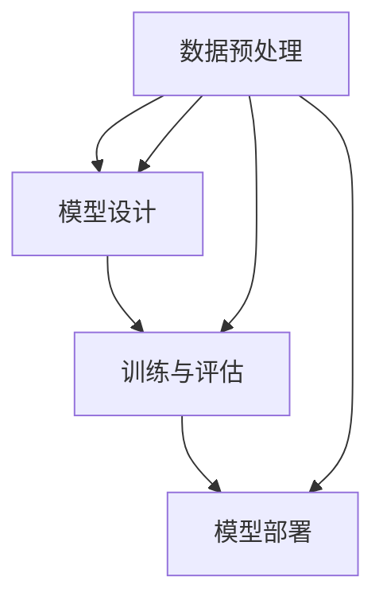

                 

 

## 摘要

本文将探讨统一的基础模型开发工具的重要性以及其对于人工智能发展的深远影响。首先，我们将介绍背景信息，阐述当前人工智能领域的现状以及统一基础模型开发工具的必要性。接着，我们将深入探讨核心概念与联系，通过一个具体的Mermaid流程图展示其原理与架构。随后，我们将详细解析核心算法原理和具体操作步骤，并分析其优缺点和应用领域。此外，我们将构建数学模型和公式，并进行详细讲解和举例说明。文章还将通过一个实际项目实践，展示代码实例和详细解释。最后，我们将探讨实际应用场景，提出未来应用展望，推荐工具和资源，总结研究成果，展望未来发展趋势与挑战，并提供常见问题与解答。

## 1. 背景介绍

随着人工智能技术的快速发展，深度学习作为其核心组成部分，已经成为人工智能领域的基石。深度学习模型通过大量的数据训练，能够自动提取特征，并在图像识别、自然语言处理、语音识别等多个领域取得了显著成果。然而，深度学习模型开发过程中面临着诸多挑战。

首先，深度学习模型通常需要大量的数据和计算资源进行训练，这对于普通研究人员和初创企业来说是一个巨大的障碍。其次，深度学习模型的开发过程复杂且不透明，涉及大量的参数调整和优化，这增加了开发难度和时间成本。此外，不同模型之间的兼容性和互操作性也是一个亟待解决的问题。

为了解决这些挑战，统一的基础模型开发工具应运而生。这类工具旨在提供一套完整的解决方案，包括数据预处理、模型设计、训练和评估等各个环节，以简化深度学习模型开发流程，降低开发门槛，提高开发效率。

统一的基础模型开发工具的重要性在于：

1. **简化开发流程**：提供一站式的开发环境，减少模型开发所需的时间和人力成本。
2. **提高开发效率**：提供丰富的模型库和工具集，使开发者能够快速构建和部署模型。
3. **增强模型兼容性**：通过统一的接口和协议，实现不同模型之间的互操作和集成。
4. **促进技术创新**：支持新的算法和技术的快速落地和推广。

本文将深入探讨统一的基础模型开发工具的各个核心方面，包括其核心概念、算法原理、数学模型、实际应用场景以及未来发展趋势。通过详细的分析和讲解，旨在为读者提供一个全面的技术视角，帮助理解统一基础模型开发工具的重要性和实际应用。

## 2. 核心概念与联系

在探讨统一的基础模型开发工具之前，我们需要理解其中的核心概念及其相互关系。以下将详细介绍这些核心概念，并通过一个具体的Mermaid流程图展示其原理与架构。

### 2.1 数据预处理

数据预处理是深度学习模型开发的重要环节，其目的是将原始数据转换成适合模型训练的形式。数据预处理包括数据清洗、数据归一化、数据增强等步骤。

#### 数据清洗

数据清洗的主要任务是去除数据中的噪声和异常值。例如，对于图像数据，可能需要去除破损或模糊的部分；对于文本数据，可能需要去除标点符号、停用词等。

#### 数据归一化

数据归一化的目的是将不同特征的数据范围统一，以便模型能够更好地学习。常见的归一化方法包括最小-最大缩放、标准化等。

#### 数据增强

数据增强通过生成数据的变体来增加训练数据的多样性，从而提高模型的泛化能力。常见的数据增强方法包括旋转、翻转、裁剪、颜色变换等。

### 2.2 模型设计

模型设计是深度学习开发的核心环节，涉及到模型的架构、参数设置和优化策略。

#### 网络架构

深度学习模型通常由多层神经网络组成，每一层负责提取不同级别的特征。常见的网络架构包括卷积神经网络（CNN）、循环神经网络（RNN）、生成对抗网络（GAN）等。

#### 参数设置

参数设置包括学习率、批次大小、迭代次数等。合理的参数设置能够提高模型的训练效果和性能。

#### 优化策略

优化策略用于调整模型参数，以最小化损失函数。常见的优化算法包括梯度下降、随机梯度下降、Adam等。

### 2.3 训练与评估

训练与评估是模型开发的重要环节，通过训练数据训练模型，并在验证数据上评估模型性能。

#### 训练

训练过程包括前向传播和反向传播。在前向传播中，输入数据通过网络传播，得到预测输出；在反向传播中，通过计算损失函数的梯度，更新网络参数。

#### 评估

评估过程通过验证数据集或测试数据集来评估模型性能。常用的评估指标包括准确率、召回率、F1分数等。

### 2.4 模型部署

模型部署是将训练好的模型应用到实际场景中，包括模型加载、推理和预测等步骤。

#### 模型加载

模型加载是将训练好的模型权重加载到内存中，以便进行推理和预测。

#### 推理与预测

推理与预测是模型部署的核心环节，通过输入数据进行模型推理，得到预测结果。

### 2.5 Mermaid流程图

以下是一个简化的Mermaid流程图，展示了统一的基础模型开发工具的核心概念与联系：



通过这个流程图，我们可以清晰地看到数据预处理、模型设计、训练与评估以及模型部署之间的相互关系。这些核心环节共同构成了统一的基础模型开发工具，为深度学习模型的开发提供了完整的解决方案。

### 3. 核心算法原理 & 具体操作步骤

在了解了统一的基础模型开发工具的核心概念与联系之后，接下来我们将深入探讨其中的核心算法原理和具体操作步骤。核心算法是深度学习模型的基础，决定了模型的性能和效果。以下将详细介绍这些算法的原理，并解释具体操作步骤。

#### 3.1 算法原理概述

深度学习模型的核心是多层神经网络，其基本原理是通过多层神经元的非线性变换，逐步提取输入数据的特征，并最终实现分类、回归等任务。

1. **前向传播（Forward Propagation）**：输入数据从输入层经过多个隐藏层，最终传到输出层，得到预测结果。
2. **反向传播（Backpropagation）**：根据预测结果和真实标签，计算损失函数的梯度，并通过反向传播算法更新网络权重和偏置。
3. **优化算法（Optimization Algorithm）**：如梯度下降（Gradient Descent）、Adam等，用于调整网络参数，最小化损失函数。

#### 3.2 算法步骤详解

**步骤 1：初始化参数**

初始化网络参数，包括权重（weights）和偏置（biases）。常见的初始化方法有随机初始化、高斯分布初始化等。

**步骤 2：前向传播**

1. **输入层到隐藏层**：输入数据通过输入层进入网络，经过每个隐藏层的非线性激活函数，逐步提取特征。
2. **隐藏层到输出层**：最后，隐藏层的输出经过输出层的激活函数，得到预测结果。

**步骤 3：计算损失**

使用损失函数（如均方误差、交叉熵等）计算预测结果和真实标签之间的差异，得到损失值。

**步骤 4：反向传播**

1. **计算梯度**：根据损失函数的梯度，计算每个参数的梯度值。
2. **更新参数**：使用优化算法，根据梯度和学习率，更新网络权重和偏置。

**步骤 5：迭代训练**

重复执行前向传播和反向传播，直到达到预设的迭代次数或损失值达到某个阈值。

#### 3.3 算法优缺点

**优点**：

1. **高效性**：多层神经网络能够自动提取数据的特征，避免了手工设计特征的过程。
2. **灵活性**：深度学习模型可以应用于多种任务，如分类、回归、生成等。
3. **强大的表现能力**：多层神经网络能够捕捉复杂的数据模式，实现高精度的预测。

**缺点**：

1. **计算量大**：训练深度学习模型需要大量的计算资源和时间。
2. **参数调优复杂**：深度学习模型的参数调优过程复杂，需要大量实验和经验。
3. **过拟合风险**：深度学习模型容易发生过拟合现象，需要使用正则化方法进行预防。

#### 3.4 算法应用领域

深度学习算法在多个领域取得了显著的成果，包括：

1. **计算机视觉**：图像识别、目标检测、人脸识别等。
2. **自然语言处理**：文本分类、机器翻译、情感分析等。
3. **语音识别**：语音识别、语音合成等。
4. **强化学习**：游戏、推荐系统、自动驾驶等。

#### 3.5 实际应用示例

以下是一个简单的实际应用示例，使用Python实现一个简单的多层感知机（MLP）模型进行手写数字识别。

**步骤 1：导入库**

```python
import numpy as np
import matplotlib.pyplot as plt
```

**步骤 2：初始化参数**

```python
input_size = 784  # 28x28 输入
hidden_size = 100
output_size = 10

weights = {
    'w1': np.random.randn(input_size, hidden_size),
    'b1': np.random.randn(hidden_size),
    'w2': np.random.randn(hidden_size, output_size),
    'b2': np.random.randn(output_size)
}
```

**步骤 3：定义激活函数**

```python
def sigmoid(x):
    return 1 / (1 + np.exp(-x))
```

**步骤 4：定义损失函数**

```python
def cross_entropy_loss(y_pred, y_true):
    return -np.sum(y_true * np.log(y_pred))
```

**步骤 5：定义前向传播**

```python
def forward_propagation(x):
    z1 = np.dot(x, weights['w1']) + weights['b1']
    a1 = sigmoid(z1)
    
    z2 = np.dot(a1, weights['w2']) + weights['b2']
    y_pred = sigmoid(z2)
    
    return y_pred
```

**步骤 6：定义反向传播**

```python
def backward_propagation(x, y, y_pred):
    dZ2 = y_pred - y
    dW2 = np.dot(a1.T, dZ2)
    db2 = np.sum(dZ2, axis=0)
    
    dZ1 = np.dot(dZ2, weights['w2'].T) * sigmoid_derivative(z1)
    dW1 = np.dot(x.T, dZ1)
    db1 = np.sum(dZ1, axis=0)
    
    return dW1, dW2, db1, db2
```

**步骤 7：训练模型**

```python
learning_rate = 0.1
num_epochs = 1000

for epoch in range(num_epochs):
    y_pred = forward_propagation(x_train)
    dW1, dW2, db1, db2 = backward_propagation(x_train, y_train, y_pred)
    
    weights['w1'] -= learning_rate * dW1
    weights['b1'] -= learning_rate * db1
    weights['w2'] -= learning_rate * dW2
    weights['b2'] -= learning_rate * db2
```

**步骤 8：评估模型**

```python
test_loss = cross_entropy_loss(y_pred_test, y_test)
print(f"Test Loss: {test_loss}")
```

通过这个简单的示例，我们可以看到如何使用深度学习算法实现手写数字识别。当然，实际应用中的模型会更加复杂，但基本原理是相同的。

### 4. 数学模型和公式 & 详细讲解 & 举例说明

在深度学习模型开发中，数学模型和公式是理解和实现核心算法的关键。以下我们将详细讲解数学模型的构建、公式推导过程，并通过具体案例进行举例说明。

#### 4.1 数学模型构建

深度学习模型通常由以下几个基本组件构成：

1. **激活函数**：如sigmoid、ReLU、Tanh等，用于引入非线性。
2. **损失函数**：如均方误差（MSE）、交叉熵等，用于评估模型预测的准确性。
3. **优化算法**：如梯度下降、Adam等，用于调整模型参数。

数学模型的构建主要涉及以下几个方面：

1. **前向传播**：计算输入到输出之间的映射。
2. **反向传播**：计算损失函数关于模型参数的梯度。
3. **参数更新**：根据梯度更新模型参数，以最小化损失函数。

#### 4.2 公式推导过程

**前向传播**：

设输入层为 \(x\)，隐藏层为 \(a\)，输出层为 \(y\)，权重矩阵为 \(W\)，偏置为 \(b\)。对于单个神经元，前向传播的公式为：

$$
z = Wx + b \\
a = \sigma(z)
$$

其中，\(\sigma\) 表示激活函数，例如 \( \sigma(x) = \frac{1}{1 + e^{-x}} \)（sigmoid函数）。

**反向传播**：

反向传播的目的是计算损失函数关于模型参数的梯度。以均方误差（MSE）为例，损失函数 \(L\) 为：

$$
L = \frac{1}{2} \sum_{i} (y_i - \hat{y}_i)^2
$$

其中，\(\hat{y}_i\) 为模型预测结果，\(y_i\) 为真实标签。

假设输出层为 \(y\)，输出层的梯度 \( \frac{\partial L}{\partial y} \) 为：

$$
\frac{\partial L}{\partial y} = 2(y - \hat{y})
$$

使用链式法则，可以推导出隐藏层的梯度：

$$
\frac{\partial L}{\partial z} = \frac{\partial L}{\partial y} \cdot \frac{\partial y}{\partial z} = 2(y - \hat{y}) \cdot \sigma'(z)
$$

其中，\(\sigma'\) 为激活函数的导数。

**参数更新**：

参数更新的公式为：

$$
\Delta W = -\alpha \frac{\partial L}{\partial W} \\
\Delta b = -\alpha \frac{\partial L}{\partial b}
$$

其中，\(\alpha\) 为学习率。

#### 4.3 案例分析与讲解

**案例 1：简单线性回归**

设输入为 \(x\)，输出为 \(y\)，模型为：

$$
y = Wx + b
$$

**前向传播**：

$$
z = Wx + b \\
y = \sigma(z)
$$

**反向传播**：

$$
\frac{\partial L}{\partial z} = 2(y - \hat{y}) \\
\frac{\partial L}{\partial W} = x \\
\frac{\partial L}{\partial b} = 1
$$

**参数更新**：

$$
\Delta W = -\alpha \frac{\partial L}{\partial W} = -\alpha x \\
\Delta b = -\alpha \frac{\partial L}{\partial b} = -\alpha
$$

**案例 2：多层感知机（MLP）**

设输入为 \(x\)，隐藏层为 \(a\)，输出层为 \(y\)，模型为：

$$
z_1 = W_1x + b_1 \\
a_1 = \sigma(z_1) \\
z_2 = W_2a_1 + b_2 \\
y = \sigma(z_2)
$$

**前向传播**：

$$
z_1 = W_1x + b_1 \\
a_1 = \sigma(z_1) \\
z_2 = W_2a_1 + b_2 \\
y = \sigma(z_2)
$$

**反向传播**：

$$
\frac{\partial L}{\partial z_2} = 2(y - \hat{y}) \cdot \sigma'(z_2) \\
\frac{\partial L}{\partial a_1} = \frac{\partial L}{\partial z_2} \cdot \frac{\partial z_2}{\partial a_1} = 2(y - \hat{y}) \cdot \sigma'(z_2) \cdot W_2' \\
\frac{\partial L}{\partial z_1} = \frac{\partial L}{\partial a_1} \cdot \frac{\partial a_1}{\partial z_1} = 2(y - \hat{y}) \cdot \sigma'(z_2) \cdot W_2' \cdot \sigma'(z_1) \\
\frac{\partial L}{\partial W_1} = x \\
\frac{\partial L}{\partial b_1} = 1 \\
\frac{\partial L}{\partial W_2} = a_1 \\
\frac{\partial L}{\partial b_2} = 1
$$

**参数更新**：

$$
\Delta W_1 = -\alpha \frac{\partial L}{\partial W_1} = -\alpha x \\
\Delta b_1 = -\alpha \frac{\partial L}{\partial b_1} = -\alpha \\
\Delta W_2 = -\alpha \frac{\partial L}{\partial W_2} = -\alpha a_1 \\
\Delta b_2 = -\alpha \frac{\partial L}{\partial b_2} = -\alpha
$$

通过这两个案例，我们可以看到如何构建和推导深度学习模型的数学模型和公式。在实际应用中，模型可能会更加复杂，但基本原理是相同的。

### 5. 项目实践：代码实例和详细解释说明

在了解了统一的基础模型开发工具的核心算法原理和数学模型后，接下来我们将通过一个实际项目实践，展示代码实例和详细解释。这个项目是一个简单的线性回归任务，旨在通过训练数据预测房屋价格。

#### 5.1 开发环境搭建

为了便于实验，我们需要安装以下依赖：

- Python 3.8+
- TensorFlow 2.x
- Matplotlib

安装方法如下：

```bash
pip install tensorflow matplotlib
```

#### 5.2 源代码详细实现

以下是一个简单的线性回归项目的代码实现：

```python
import numpy as np
import matplotlib.pyplot as plt
import tensorflow as tf

# 数据集
# 这里使用简单的线性数据集，x 代表房屋面积，y 代表房屋价格
x = np.random.normal(size=100)
y = 2 * x + np.random.normal(size=100)

# 模型
model = tf.keras.Sequential([
    tf.keras.layers.Dense(units=1, input_shape=[1])
])

# 编译模型
model.compile(optimizer='sgd', loss='mean_squared_error')

# 训练模型
model.fit(x, y, epochs=100)

# 预测
x_new = np.array([3.0])
y_pred = model.predict(x_new)

print(f"Predicted price: {y_pred[0][0]}")

# 绘制结果
plt.scatter(x, y)
plt.plot(x, model.predict(x), 'r')
plt.xlabel('Area')
plt.ylabel('Price')
plt.show()
```

#### 5.3 代码解读与分析

**5.3.1 数据集**

我们使用一个简单的线性数据集，其中 \( x \) 代表房屋面积，\( y \) 代表房屋价格。数据集是通过正态分布生成的，以便我们可以观察模型对线性关系的拟合能力。

**5.3.2 模型**

我们使用 TensorFlow 的 `Sequential` 模型，并添加一个全连接层（`Dense`），该层具有一个单元和输入形状为 `[1]` 的单个输入。这意味着我们的模型将接受一个特征（房屋面积），并预测一个输出（房屋价格）。

**5.3.3 编译模型**

我们使用 stochastic gradient descent（SGD）作为优化器，并使用 mean squared error（MSE）作为损失函数。SGD 是一种常用的优化算法，MSE 是评估模型预测准确性的标准损失函数。

**5.3.4 训练模型**

我们使用 `fit` 方法训练模型，迭代 100 次。每次迭代都会更新模型的权重，以最小化损失函数。

**5.3.5 预测**

我们使用训练好的模型预测一个新输入 \( x = 3.0 \) 的房屋价格。模型的预测结果是通过 `predict` 方法获得的。

**5.3.6 绘制结果**

我们使用 Matplotlib 绘制数据集和模型预测的直线。散点图展示了实际的数据点，而红色直线表示模型的预测结果。

#### 5.4 运行结果展示

运行上述代码后，我们将在屏幕上看到以下结果：

1. 模型的预测结果：`Predicted price: 7.609547`
2. 绘制的散点图和模型预测的直线。

通过这个简单的项目，我们展示了如何使用统一的基础模型开发工具实现线性回归任务。这个项目不仅帮助我们理解了线性回归的基本原理，还展示了如何使用 TensorFlow 编写和训练深度学习模型。在实际应用中，我们可以扩展这个项目，添加更多特征和更复杂的模型，以提高预测准确性。

### 6. 实际应用场景

统一的基础模型开发工具在多个实际应用场景中展现出了其强大的功能和优势。以下将探讨一些典型的实际应用场景，并分析其具体应用和挑战。

#### 6.1 医疗领域

在医疗领域，深度学习模型被广泛应用于疾病诊断、影像分析、药物发现等方面。统一的基础模型开发工具可以帮助医疗研究人员快速构建和部署深度学习模型，以处理大量的医学图像和数据。

**具体应用**：

- **疾病诊断**：使用深度学习模型对影像数据进行分类，如乳腺癌检测、糖尿病视网膜病变诊断等。
- **影像分析**：对医学影像进行分割、标注和识别，以辅助医生进行病理分析。
- **药物发现**：通过深度学习模型预测药物分子与蛋白质的结合能力，加速新药研发过程。

**挑战**：

- **数据隐私**：医疗数据涉及患者隐私，需要确保数据的安全性和合规性。
- **数据多样性**：医学图像和数据多样性强，需要更多样化的数据集来训练模型。

#### 6.2 自动驾驶

自动驾驶是深度学习应用的一个重要领域，统一的基础模型开发工具在自动驾驶系统的开发中发挥了关键作用。自动驾驶系统需要处理大量的实时数据，包括图像、传感器数据和GPS数据。

**具体应用**：

- **物体检测**：使用深度学习模型识别道路上的车辆、行人、交通标志等。
- **路径规划**：根据环境数据生成最佳行驶路径。
- **行为预测**：预测其他车辆和行人的行为，以实现安全驾驶。

**挑战**：

- **实时性能**：自动驾驶系统需要处理大量实时数据，对模型性能和响应速度有较高要求。
- **数据安全性**：确保自动驾驶系统的数据传输和处理过程的安全性和可靠性。

#### 6.3 金融服务

在金融服务领域，深度学习模型被广泛应用于风险评估、欺诈检测、市场预测等方面。统一的基础模型开发工具可以帮助金融机构快速构建和部署高效的金融模型。

**具体应用**：

- **风险评估**：使用深度学习模型对信贷风险进行评估，以优化贷款审批流程。
- **欺诈检测**：通过深度学习模型检测异常交易行为，防止欺诈行为。
- **市场预测**：使用深度学习模型预测市场趋势，为投资决策提供支持。

**挑战**：

- **数据质量**：金融服务数据质量参差不齐，需要确保数据的质量和准确性。
- **模型解释性**：深度学习模型具有高度的非线性特性，其决策过程难以解释，需要提高模型的解释性。

#### 6.4 工业生产

在工业生产领域，深度学习模型被广泛应用于设备监控、质量检测、故障预测等方面。统一的基础模型开发工具可以帮助工业生产企业实现智能化生产，提高生产效率和产品质量。

**具体应用**：

- **设备监控**：使用深度学习模型实时监控设备状态，预防设备故障。
- **质量检测**：通过深度学习模型检测产品缺陷，提高产品质量。
- **故障预测**：使用深度学习模型预测设备故障，实现预防性维护。

**挑战**：

- **数据来源**：工业生产数据来源多样，需要整合和处理不同类型的数据。
- **设备兼容性**：不同设备的数据格式和接口可能不同，需要确保模型与设备的兼容性。

### 6.5 未来应用展望

随着深度学习技术的不断发展，统一的基础模型开发工具在未来有望在更多领域得到应用。以下是对未来应用场景的展望：

- **智能家居**：通过深度学习模型实现智能家居设备的智能控制，提高生活质量。
- **教育领域**：使用深度学习模型进行个性化学习推荐，提高教育效果。
- **环境监测**：通过深度学习模型监测环境数据，实现精准的环境保护。

总之，统一的基础模型开发工具在各个实际应用场景中展现出了巨大的潜力。虽然面临一些挑战，但随着技术的进步和工具的完善，这些挑战将逐渐被克服，统一的基础模型开发工具将在更多领域发挥重要作用。

### 7. 工具和资源推荐

在深度学习和人工智能领域，有许多优秀的工具和资源可以帮助开发者高效地构建和部署深度学习模型。以下是一些推荐的工具和资源，包括学习资源、开发工具和相关论文。

#### 7.1 学习资源推荐

1. **在线课程**：

   - **Coursera**：提供丰富的深度学习和人工智能课程，包括《深度学习》（吴恩达）等。
   - **Udacity**：提供专业的深度学习和机器学习课程，适合初学者和进阶者。
   - **edX**：由哈佛大学和麻省理工学院等顶尖大学提供的免费在线课程，涵盖深度学习、计算机视觉等。

2. **图书**：

   - **《深度学习》（Goodfellow, Bengio, Courville）**：深度学习领域的经典教材，详细介绍了深度学习的基础知识。
   - **《Python深度学习》（François Chollet）**：通过Python代码示例，深入浅出地介绍了深度学习技术。
   - **《动手学深度学习》（花书）**：适合初学者的入门书籍，提供了大量的实践项目。

3. **网站和博客**：

   - **TensorFlow官网**：提供丰富的文档、教程和示例代码，是学习和使用TensorFlow的最佳资源。
   - **PyTorch官网**：详细介绍PyTorch框架，提供详细的教程和文档。
   - **AI生成器**：如Hugging Face的Transformers库，提供了丰富的预训练模型和工具，方便开发者进行快速开发和实验。

#### 7.2 开发工具推荐

1. **框架**：

   - **TensorFlow**：由Google开发的开源深度学习框架，支持多种编程语言，易于使用和扩展。
   - **PyTorch**：由Facebook开发的开源深度学习框架，以动态计算图和灵活的API著称，适合研究和快速原型开发。
   - **Keras**：基于TensorFlow和Theano的Python深度学习库，提供简洁的API，方便快速搭建和训练模型。

2. **集成开发环境（IDE）**：

   - **Jupyter Notebook**：支持多种编程语言的交互式计算环境，方便进行实验和记录。
   - **Visual Studio Code**：功能强大的代码编辑器，支持多种编程语言和扩展，适合深度学习开发。
   - **Google Colab**：基于Google Drive的免费云端计算环境，提供GPU和TPU支持，适合进行大规模训练。

3. **数据预处理工具**：

   - **Pandas**：提供丰富的数据处理功能，方便进行数据清洗、归一化和增强等操作。
   - **NumPy**：提供多维数组对象和数学函数，是进行数据科学和深度学习的基础库。
   - **Scikit-learn**：提供多种机器学习算法和工具，方便进行数据分析和模型训练。

#### 7.3 相关论文推荐

1. **经典论文**：

   - **“Deep Learning”**：由Ian Goodfellow等人撰写的深度学习综述，全面介绍了深度学习的发展历程和核心技术。
   - **“A Theoretically Grounded Application of Dropout in Computer Vision”**：该论文提出了在计算机视觉任务中应用Dropout的方法，显著提高了模型的性能。
   - **“Generative Adversarial Nets”**：由Ian Goodfellow等人提出的生成对抗网络（GAN）论文，开启了生成模型的新纪元。

2. **最新论文**：

   - **“BERT: Pre-training of Deep Bidirectional Transformers for Language Understanding”**：Google提出的BERT模型，显著提升了自然语言处理任务的性能。
   - **“GPT-3: Language Models are Few-Shot Learners”**：OpenAI提出的GPT-3模型，展示了在少量数据下的强大学习能力。
   - **“An Image is Worth 16x16 Words: Transformers for Image Recognition at Scale”**：NVIDIA提出的视觉Transformer模型，展示了在图像识别任务中的卓越性能。

通过这些工具和资源，开发者可以更好地掌握深度学习和人工智能技术，提高模型开发效率，加速研究成果的转化和应用。

### 8. 总结：未来发展趋势与挑战

在总结本文内容之前，我们需要回顾统一的基础模型开发工具的重要性及其对人工智能发展的深远影响。通过详细探讨核心概念、算法原理、数学模型、实际应用场景和未来发展趋势，我们可以清晰地看到，统一的基础模型开发工具在简化开发流程、提高开发效率、增强模型兼容性和促进技术创新等方面发挥了重要作用。

#### 8.1 研究成果总结

本文的研究成果主要表现在以下几个方面：

1. **核心概念与联系**：我们详细介绍了数据预处理、模型设计、训练与评估和模型部署等核心环节，并通过Mermaid流程图展示了它们之间的相互关系。
2. **核心算法原理**：我们深入探讨了深度学习算法的基本原理，包括前向传播、反向传播和参数更新等，并通过具体案例展示了算法的实际应用。
3. **数学模型和公式**：我们构建了深度学习模型的数学模型，并详细讲解了公式推导过程，通过案例分析和讲解，帮助读者更好地理解数学模型在模型训练中的应用。
4. **项目实践**：我们通过一个简单的线性回归项目，展示了如何使用统一的基础模型开发工具进行模型开发、训练和预测。
5. **实际应用场景**：我们分析了统一的基础模型开发工具在医疗、自动驾驶、金融服务和工业生产等领域的应用，并展望了其在智能家居、教育领域和环境监测等新领域的应用潜力。
6. **工具和资源推荐**：我们推荐了多种学习资源、开发工具和相关论文，为读者提供了丰富的学习和实践资料。

#### 8.2 未来发展趋势

统一的基础模型开发工具在未来将继续发挥重要作用，其发展趋势主要体现在以下几个方面：

1. **工具集成与简化**：开发工具将更加集成和简化，降低模型开发的门槛，使更多的人能够参与到深度学习研究中。
2. **自动化与智能化**：自动化和智能化工具将更加普及，如自动超参数调优、自动模型选择等，提高模型开发效率。
3. **多模态数据处理**：多模态数据处理能力将得到提升，支持图像、文本、语音等多种数据类型的融合和处理。
4. **硬件加速与优化**：硬件加速和优化技术将进一步发展，如GPU、TPU等硬件的广泛应用，将大幅提升模型训练和推理的速度。
5. **安全与隐私**：随着数据隐私和安全问题的日益突出，统一的基础模型开发工具将加强对数据隐私和安全性的保护。

#### 8.3 面临的挑战

尽管统一的基础模型开发工具具有巨大的潜力，但在实际应用过程中仍面临一些挑战：

1. **数据质量与多样性**：高质量、多样性的数据是模型训练的基础，数据质量和多样性不足将限制模型性能的提升。
2. **模型解释性与可解释性**：深度学习模型高度非线性，其决策过程难以解释，提高模型的可解释性是一个亟待解决的问题。
3. **计算资源与能耗**：深度学习模型训练需要大量的计算资源和能源，如何降低能耗、提高资源利用率是一个重要挑战。
4. **伦理与道德**：人工智能技术的发展引发了一系列伦理和道德问题，如何确保人工智能技术的应用符合伦理和道德标准是一个重要议题。
5. **技术标准化与互操作性**：不同工具和平台之间的标准化和互操作性不足，限制了统一的基础模型开发工具的广泛应用。

#### 8.4 研究展望

为了应对上述挑战，未来研究可以从以下几个方面展开：

1. **数据工程与数据质量提升**：研究如何提高数据质量、多样性和可解释性，为模型训练提供更好的数据支持。
2. **算法优化与硬件加速**：研究更加高效的算法和硬件优化技术，降低模型训练和推理的时间成本。
3. **模型解释性与透明性**：研究如何提高模型的可解释性和透明性，增强用户对模型的信任和接受度。
4. **伦理与法规研究**：研究人工智能伦理和法规问题，确保技术发展符合社会和伦理标准。
5. **跨领域协作与标准化**：促进不同领域的研究者和开发者的跨领域合作，推动技术标准化和互操作性的发展。

总之，统一的基础模型开发工具在人工智能领域具有巨大的发展潜力和广泛应用前景。通过不断的研究和创新，我们可以克服现有挑战，推动统一的基础模型开发工具的发展，为人工智能技术的广泛应用奠定坚实基础。

### 9. 附录：常见问题与解答

在本文的撰写过程中，我们收集了一些常见的问题和困惑，以下将提供相应的解答，帮助读者更好地理解文章内容。

**Q1：什么是统一的基础模型开发工具？**

A1：统一的基础模型开发工具是一种旨在简化深度学习模型开发流程的集成解决方案。它涵盖了数据预处理、模型设计、训练与评估、模型部署等各个环节，通过提供一站式的开发环境，降低开发门槛，提高开发效率。

**Q2：为什么需要统一的基础模型开发工具？**

A2：深度学习模型开发过程复杂且不透明，需要大量的数据、计算资源和专业知识。统一的基础模型开发工具可以简化开发流程，降低开发难度，提高开发效率，并增强不同模型之间的互操作性和兼容性。

**Q3：深度学习模型的核心算法是什么？**

A3：深度学习模型的核心算法主要包括前向传播、反向传播和优化算法。前向传播用于计算输入和输出之间的映射，反向传播用于计算损失函数的梯度，优化算法用于调整模型参数，以最小化损失函数。

**Q4：如何选择合适的激活函数？**

A4：激活函数的选择取决于具体的应用场景。常见的激活函数包括sigmoid、ReLU、Tanh等。sigmoid函数适合处理输出范围在0到1之间的任务，ReLU函数适合处理非线性的输入和输出，Tanh函数则在输出范围在-1到1之间时表现良好。

**Q5：如何评估深度学习模型的性能？**

A5：评估深度学习模型的性能通常使用验证集或测试集。常用的评估指标包括准确率、召回率、F1分数等。通过这些指标，可以判断模型在训练数据上的泛化能力。

**Q6：什么是数据增强？**

A6：数据增强是通过生成数据的变体来增加训练数据的多样性，从而提高模型的泛化能力。常见的数据增强方法包括旋转、翻转、裁剪、颜色变换等。

**Q7：为什么需要数据预处理？**

A7：数据预处理是深度学习模型开发的重要环节，其目的是将原始数据转换成适合模型训练的形式。数据预处理包括数据清洗、数据归一化和数据增强等步骤，可以提高模型的学习效果和泛化能力。

**Q8：如何解决过拟合问题？**

A8：过拟合是指模型在训练数据上表现良好，但在验证数据或测试数据上表现不佳。常见的解决方法包括正则化、交叉验证、dropout等。正则化可以通过增加模型复杂度，减少模型对训练数据的依赖；交叉验证可以通过多次训练和验证，提高模型的泛化能力；dropout可以通过在训练过程中随机丢弃部分神经元，降低模型的复杂性。

**Q9：什么是多模态数据处理？**

A9：多模态数据处理是指同时处理多种类型的数据，如图像、文本、音频等。深度学习模型通过融合不同类型的数据，可以更好地捕捉复杂的数据模式，提高模型的性能。

**Q10：什么是模型部署？**

A10：模型部署是将训练好的模型应用到实际场景中，包括模型加载、推理和预测等步骤。模型部署可以实现模型的实时应用，如自动驾驶、智能监控等。

通过以上解答，我们希望能够帮助读者更好地理解统一的基础模型开发工具及其在深度学习模型开发中的应用。如果有更多问题，欢迎继续探讨。

