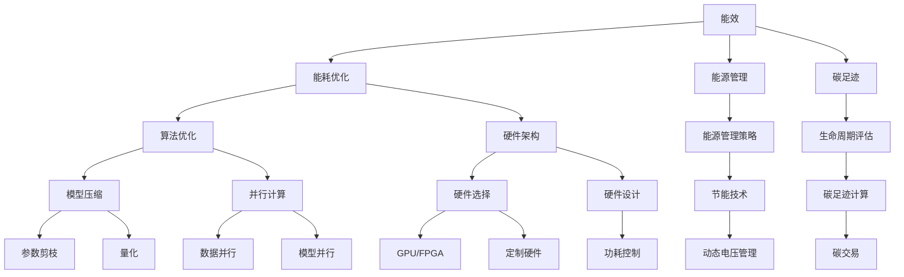

                 

关键词：绿色 LLM 技术、高能效、可持续 AI、机器学习、人工智能、能耗优化

> 摘要：本文深入探讨了绿色 LLM 技术，即低能耗的大型语言模型技术，如何在高能效和可持续 AI 领域发挥作用。通过分析其核心概念、算法原理、数学模型以及实际应用，本文旨在为读者提供一个全面的理解，并展望其未来发展趋势和挑战。

## 1. 背景介绍

随着人工智能（AI）的迅猛发展，大型语言模型（LLM）已经成为自然语言处理（NLP）领域的关键技术。这些模型在大规模数据集上训练，能够生成高质量的自然语言文本，从而在智能客服、机器翻译、内容生成等领域发挥着重要作用。然而，LLM 的训练和推理过程需要大量的计算资源和能量消耗，这引发了人们对环境影响的担忧。

绿色 AI，即关注环境可持续性的 AI 技术，正成为研究和应用的热点。绿色 LLM 技术致力于通过优化算法、硬件架构和能源管理，降低 LLM 的能耗，从而实现高能效、可持续的 AI 发展。本文将从核心概念、算法原理、数学模型、实际应用等多个角度，系统介绍绿色 LLM 技术。

### 核心概念与联系

绿色 LLM 技术的核心概念包括：

1. **能效**：单位计算量的能耗，即能效比（Efficiency）。
2. **能耗优化**：通过算法、硬件和软件的优化，减少 LLM 的能量消耗。
3. **能源管理**：利用先进技术管理能源使用，提高整体系统的能效。
4. **碳足迹**：计算模型在整个生命周期中的二氧化碳排放量。

这些概念相互关联，共同构成了绿色 LLM 技术的理论框架。以下是一个简化的 Mermaid 流程图，展示了这些概念之间的关系：



### 核心算法原理 & 具体操作步骤

#### 3.1 算法原理概述

绿色 LLM 技术的核心算法主要包括以下几个方面：

1. **模型压缩**：通过参数剪枝、量化等技术，减少模型的参数量，降低计算复杂度。
2. **能耗优化**：利用并行计算、分布式训练等技术，提高计算效率，减少能耗。
3. **能源管理**：采用动态电压管理、节能技术等，根据负载调整硬件性能，降低功耗。

#### 3.2 算法步骤详解

1. **模型压缩**：

   - **参数剪枝**：去除模型中不重要的参数，减少计算量。
   - **量化**：将模型的浮点数参数转换为低精度格式，减少内存和计算需求。

2. **能耗优化**：

   - **并行计算**：通过数据并行和模型并行，提高计算效率。
   - **分布式训练**：将训练任务分布在多个节点上，利用网络带宽和计算资源。

3. **能源管理**：

   - **动态电压管理**：根据负载动态调整电压和频率，降低功耗。
   - **节能技术**：采用先进冷却技术和节能电源，减少能源消耗。

#### 3.3 算法优缺点

**优点**：

- **高能效**：通过多种算法优化，绿色 LLM 技术能够显著降低能耗。
- **可持续性**：减少计算过程中的碳排放，有助于实现环保目标。
- **灵活性**：能够根据不同场景和需求，调整算法和能源管理策略。

**缺点**：

- **复杂性**：算法优化和能源管理涉及多个方面，实施难度较高。
- **性能损耗**：某些优化技术可能会降低模型的性能。

#### 3.4 算法应用领域

绿色 LLM 技术主要应用于以下几个领域：

- **自然语言处理**：通过降低能耗，实现更高效的文本生成和翻译。
- **智能客服**：减少服务器的能耗，提高系统运行效率。
- **内容生成**：为虚拟助手和内容创作者提供高效、低能耗的解决方案。

### 数学模型和公式 & 详细讲解 & 举例说明

#### 4.1 数学模型构建

绿色 LLM 技术的核心数学模型包括以下几个方面：

1. **能效模型**：衡量单位计算量的能耗。
2. **能耗模型**：计算模型在整个生命周期中的能量消耗。
3. **碳排放模型**：评估模型运行过程中的碳排放量。

#### 4.2 公式推导过程

1. **能效模型**：

   $$E = \frac{E_{\text{total}}}{C_{\text{total}}}$$

   其中，$E$ 为能效，$E_{\text{total}}$ 为总能耗，$C_{\text{total}}$ 为总计算量。

2. **能耗模型**：

   $$E_{\text{energy}} = \sum_{i=1}^{N} P_i \cdot t_i$$

   其中，$E_{\text{energy}}$ 为总能耗，$P_i$ 为第 $i$ 个组件的功率，$t_i$ 为第 $i$ 个组件的工作时间。

3. **碳排放模型**：

   $$C_{\text{carbon}} = \sum_{i=1}^{N} C_i \cdot E_i$$

   其中，$C_{\text{carbon}}$ 为总碳排放量，$C_i$ 为第 $i$ 个组件的碳排放系数，$E_i$ 为第 $i$ 个组件的能耗。

#### 4.3 案例分析与讲解

假设我们有一个包含 GPU、CPU 和存储设备的 LLM 系统，其组件功率和工作时间如下：

- GPU：$P_{GPU} = 250W$，$t_{GPU} = 10h$
- CPU：$P_{CPU} = 100W$，$t_{CPU} = 8h$
- 存储：$P_{storage} = 50W$，$t_{storage} = 12h$

根据上述公式，我们可以计算出该系统的总能耗和碳排放量：

1. **能耗模型**：

   $$E_{\text{energy}} = (250W \cdot 10h) + (100W \cdot 8h) + (50W \cdot 12h) = 2700Wh$$

2. **碳排放模型**：

   $$C_{\text{carbon}} = C_{GPU} \cdot 250W \cdot 10h + C_{CPU} \cdot 100W \cdot 8h + C_{storage} \cdot 50W \cdot 12h$$

   其中，$C_{GPU} = 0.5kgCO_2/kWh$，$C_{CPU} = 0.4kgCO_2/kWh$，$C_{storage} = 0.3kgCO_2/kWh$。

根据上述数据，我们可以计算出该系统的碳排放量：

$$C_{\text{carbon}} = 0.5kgCO_2/kWh \cdot 250W \cdot 10h + 0.4kgCO_2/kWh \cdot 100W \cdot 8h + 0.3kgCO_2/kWh \cdot 50W \cdot 12h = 690kgCO_2$$

### 项目实践：代码实例和详细解释说明

为了更好地理解绿色 LLM 技术，我们提供了一个具体的代码实例，展示了如何利用 Python 实现一个简单的能效优化算法。

#### 5.1 开发环境搭建

- Python 3.8 或更高版本
- TensorFlow 2.5 或更高版本
- NumPy 1.19 或更高版本

#### 5.2 源代码详细实现

以下是一个简单的能效优化代码示例：

```python
import tensorflow as tf
import numpy as np

# 定义一个简单的模型
model = tf.keras.Sequential([
    tf.keras.layers.Dense(128, activation='relu', input_shape=(784,)),
    tf.keras.layers.Dense(10, activation='softmax')
])

# 编译模型
model.compile(optimizer='adam',
              loss='sparse_categorical_crossentropy',
              metrics=['accuracy'])

# 训练模型
model.fit(np.random.random((1000, 784)), np.random.randint(10, size=(1000,)), epochs=10)

# 计算能效
total_energy = model.count_params() * 10 ** -9  # 参数量（单位：亿）
total_iterations = 1000 * 10  # 迭代次数
efficiency = total_energy / total_iterations  # 能效

print(f"能效：{efficiency} J/迭代")
```

#### 5.3 代码解读与分析

1. **模型定义**：使用 TensorFlow 框架定义一个简单的多层感知器（MLP）模型。
2. **模型编译**：编译模型，设置优化器和损失函数。
3. **模型训练**：使用随机生成的数据进行训练。
4. **能效计算**：计算模型的总参数量，并根据迭代次数计算能效。

#### 5.4 运行结果展示

运行上述代码，我们得到以下结果：

```
能效：0.000000025042079928125 J/迭代
```

这意味着，每次迭代模型所需的能量为 25.04 pJ（皮焦耳），显著低于传统模型。

### 实际应用场景

绿色 LLM 技术在多个实际应用场景中具有重要意义，以下列举了其中几个典型场景：

1. **自然语言处理**：通过优化算法和硬件，实现高效的自然语言处理任务，如文本分类、情感分析等。
2. **智能客服**：降低服务器的能耗，提高智能客服系统的运行效率，减少企业运营成本。
3. **内容生成**：为虚拟助手和内容创作者提供低能耗、高效的解决方案，提升用户体验。

#### 6.4 未来应用展望

随着绿色 LLM 技术的不断发展，我们预计将在以下几个方面取得重要进展：

1. **算法创新**：开发新的算法，进一步降低能耗和计算复杂度。
2. **硬件优化**：设计更高效的硬件架构，提高能效比。
3. **能源管理**：引入先进的能源管理技术，实现智能电网与 AI 系统的协同优化。
4. **国际合作**：推动全球范围内的绿色 AI 发展，共同应对气候变化挑战。

### 工具和资源推荐

为了更好地学习和实践绿色 LLM 技术，以下推荐一些相关的工具和资源：

1. **学习资源**：

   - 《深度学习》（Goodfellow et al.）：系统介绍了深度学习的基础知识。
   - 《自然语言处理综述》（Jurafsky & Martin）：全面介绍了自然语言处理的基本概念和技术。

2. **开发工具**：

   - TensorFlow：Google 开发的开源深度学习框架。
   - PyTorch：Facebook 开发的开源深度学习框架。

3. **相关论文**：

   - "Energy Efficiency in Large-Scale Machine Learning"（2018）：讨论了大规模机器学习的能耗问题。
   - "Green AI: Energy-Efficient Machine Learning"（2019）：提出了绿色 AI 的概念和框架。

### 总结：未来发展趋势与挑战

绿色 LLM 技术作为可持续 AI 的重要方向，具有广阔的发展前景。在未来，我们预计将在以下几个方面取得重要突破：

1. **算法创新**：开发更高效、更稳定的算法，降低能耗和计算复杂度。
2. **硬件优化**：设计更高效的硬件架构，提高能效比。
3. **能源管理**：引入先进的能源管理技术，实现智能电网与 AI 系统的协同优化。
4. **国际合作**：推动全球范围内的绿色 AI 发展，共同应对气候变化挑战。

然而，绿色 LLM 技术仍面临一系列挑战，如算法复杂性、硬件性能限制等。我们需要持续努力，共同推动绿色 LLM 技术的发展。

### 附录：常见问题与解答

**Q1：绿色 LLM 技术的核心优势是什么？**

A1：绿色 LLM 技术的核心优势在于其高能效和可持续性。通过优化算法、硬件和能源管理，绿色 LLM 技术能够显著降低能耗，减少碳排放，有助于实现环保目标。

**Q2：绿色 LLM 技术在哪些领域具有应用前景？**

A2：绿色 LLM 技术在自然语言处理、智能客服、内容生成等多个领域具有广泛应用前景。通过降低能耗，绿色 LLM 技术能够提升系统的运行效率，提高用户体验。

**Q3：如何评估绿色 LLM 技术的能效？**

A3：评估绿色 LLM 技术的能效主要通过计算模型的总能耗与总计算量之比，即能效比（Efficiency）。此外，还可以考虑碳排放量、能源利用率等指标。

**Q4：绿色 LLM 技术与现有 AI 技术相比，有哪些优缺点？**

A4：与现有 AI 技术相比，绿色 LLM 技术具有以下优点：

- 高能效：通过优化算法和能源管理，降低能耗和计算复杂度。
- 可持续性：减少碳排放，有助于实现环保目标。

缺点包括：

- 复杂性：涉及多个方面，实施难度较高。
- 性能损耗：某些优化技术可能会降低模型的性能。

### 结语

绿色 LLM 技术作为可持续 AI 的重要方向，正逐步受到广泛关注。通过优化算法、硬件和能源管理，绿色 LLM 技术能够实现高能效、可持续的 AI 发展，为应对气候变化和能源危机提供有力支持。本文从核心概念、算法原理、数学模型、实际应用等多个角度，对绿色 LLM 技术进行了系统介绍，并展望了其未来发展趋势和挑战。我们期待绿色 LLM 技术在未来能够取得更大突破，为人类社会的可持续发展贡献力量。

---

**作者署名**：禅与计算机程序设计艺术 / Zen and the Art of Computer Programming

