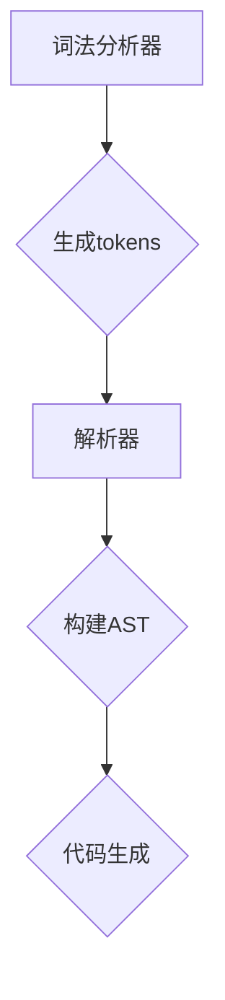

                 

 > **关键词**：编译器设计、词法分析器、解析器、语言处理、编译原理、算法、代码生成。

> **摘要**：本文将深入探讨编译器设计中的两个关键组件——词法分析器和解析器。我们将从基本概念、核心算法原理、具体操作步骤、数学模型和公式、项目实践、实际应用场景、工具和资源推荐，以及未来发展趋势与挑战等方面进行详细讲解。通过这篇文章，读者将全面了解编译器设计的核心技术和实践方法。

## 1. 背景介绍

编译器是计算机科学中一个至关重要的工具，它将程序员编写的源代码转换为计算机能够理解和执行的机器代码。编译器的设计过程涉及多个阶段，其中词法分析和解析是初始且至关重要的两个阶段。这两个阶段不仅决定了编译器的效率和准确性，还直接影响最终生成的目标代码的质量。

词法分析器（Lexer）主要负责将源代码分解成一系列单词或符号（tokens），这是编译过程的第一步。解析器（Parser）则负责检查这些单词或符号是否符合语法规则，构建出抽象语法树（Abstract Syntax Tree，AST）。

本文将首先介绍编译器设计的基本概念和背景，然后深入探讨词法分析器和解析器的核心算法原理和操作步骤，同时结合数学模型和公式进行详细讲解。最后，我们将通过项目实践和实际应用场景来展示编译器设计的实际效果和未来发展趋势。

## 2. 核心概念与联系

### 2.1 词法分析器（Lexer）

词法分析器是编译器的第一个组件，它的主要作用是将源代码分解成一系列可识别的单词或符号。这个过程称为词法分析（Lexical Analysis）。词法分析器通常使用有限状态机（Finite State Machine，FSM）来实现，这种数据结构和算法非常适合处理字符串。

#### 工作原理

词法分析器通过读取源代码中的字符序列，并根据预定义的规则将这些字符序列转换为tokens。这些规则通常以正则表达式（Regular Expressions）的形式表示。当词法分析器遇到一个字符序列时，它会将其与预定义的规则进行比较，直到找到一个匹配的规则。

#### 有限状态机（FSM）

有限状态机是一个数学模型，用于表示和模拟计算机程序的行为。在词法分析器中，FSM用于跟踪当前读取的字符序列的状态，并决定如何转换下一个字符。

### 2.2 解析器（Parser）

解析器是编译器的第二个组件，它的主要作用是将词法分析器输出的tokens转换为抽象语法树（Abstract Syntax Tree，AST）。抽象语法树是源代码的语法结构表示，它便于后续的语义分析和代码生成。

#### 工作原理

解析器通过递归下降（Recursive Descent）或预测分析（Predictive Parsing）等算法，对tokens进行语法分析，构建出AST。递归下降是一种自顶向下的分析方法，它通过递归调用自身来解析语法规则。预测分析则使用有限状态机来预测下一个token，从而决定如何进行解析。

#### 抽象语法树（AST）

抽象语法树是一种树形结构，用于表示源代码的语法结构。每个节点都代表源代码中的一个语法元素，如表达式、语句或函数。AST不仅便于语义分析，还为代码生成提供了结构化的输入。

### Mermaid 流程图

下面是一个简单的 Mermaid 流程图，展示了词法分析器和解析器的工作流程。



## 3. 核心算法原理 & 具体操作步骤

### 3.1 词法分析器算法原理

词法分析器的核心算法是有限状态机（FSM），它通过一系列状态转换来识别和分类源代码中的字符序列。下面是词法分析器算法的具体步骤：

#### 3.1.1 初始化状态

初始化FSM的状态为初始状态，通常标记为`$`。

#### 3.1.2 读入字符

从源代码中读取下一个字符。

#### 3.1.3 状态转换

根据当前状态和读取的字符，进行状态转换。状态转换通常通过预定义的转移函数来实现。

#### 3.1.4 生成token

当状态转换完成后，如果当前状态是接受状态（accept state），则生成一个token，并将其输出。

#### 3.1.5 重复步骤

继续读取下一个字符，并重复状态转换过程。

### 3.2 解析器算法原理

解析器的核心算法是构建抽象语法树（AST）。下面是解析器算法的具体步骤：

#### 3.2.1 初始化状态

初始化AST为根节点，通常标记为`$`。

#### 3.2.2 读入token

从词法分析器读取下一个token。

#### 3.2.3 解析token

根据当前AST节点和读取的token，进行语法分析，并在AST中添加新的节点。

#### 3.2.4 递归解析

如果读取的token是一个非终结符，则递归调用解析器来解析其子节点。

#### 3.2.5 完成解析

当读取的token是终结符或源代码结束时，完成解析过程。

### 3.3 算法优缺点

#### 3.3.1 词法分析器

**优点**：

- 简单高效：使用有限状态机，实现简单，运行速度快。
- 可扩展性：可以使用正则表达式来定义复杂的词法规则。

**缺点**：

- 缺乏灵活性：状态转换规则固定，难以应对复杂的语言特性。

#### 3.3.2 解析器

**优点**：

- 强类型检查：通过语法分析，可以及时发现语法错误。
- 易于生成AST：直接生成抽象语法树，便于后续语义分析和代码生成。

**缺点**：

- 实现复杂：需要处理各种语法规则和递归情况，实现较为复杂。

### 3.4 算法应用领域

词法分析器和解析器广泛应用于各种编程语言和编译器的开发。以下是一些应用领域：

- 编译器：将高级语言代码编译成机器代码。
- 解释器：将源代码逐行解释并执行。
- 代码分析工具：用于代码静态分析、漏洞检测和性能优化。

## 4. 数学模型和公式 & 详细讲解 & 举例说明

### 4.1 数学模型构建

词法分析器和解析器中的数学模型主要涉及有限状态机和抽象语法树。下面分别介绍这两个模型。

#### 4.1.1 有限状态机

有限状态机由状态集、输入集、转移函数和初始状态组成。数学定义如下：

- \( Q \)：状态集
- \( \Sigma \)：输入集
- \( \delta: Q \times \Sigma \rightarrow Q \)：转移函数
- \( q_0 \in Q \)：初始状态
- \( F \subseteq Q \)：接受状态集

#### 4.1.2 抽象语法树

抽象语法树由节点和边组成，其中节点表示语法元素，边表示元素之间的关系。数学定义如下：

- \( T \)：节点集合
- \( E \)：边集合
- \( \alpha \in T \)：根节点
- \( \text{child}(n) \)：节点\( n \)的子节点集合

### 4.2 公式推导过程

#### 4.2.1 有限状态机

给定一个字符串\( w = w_1w_2...w_n \)，我们可以使用有限状态机进行状态转换，并计算字符串的接受状态。公式推导如下：

\[ F(w) = \delta(q_0, w) \]

其中，\( q_0 \)是初始状态，\( \delta \)是转移函数。

#### 4.2.2 抽象语法树

给定一个字符串\( w \)，我们可以使用递归下降法或预测分析法构建抽象语法树。公式推导如下：

\[ \alpha = \text{parse}(w) \]

其中，\( \text{parse} \)是解析函数，用于递归构建AST。

### 4.3 案例分析与讲解

#### 4.3.1 词法分析案例

假设我们有一个简单的算术表达式语言，包含数字、加法和减法运算符。我们使用有限状态机进行词法分析。

- 状态集：\( Q = \{ \$, NUM, OP \} \)
- 输入集：\( \Sigma = \{ 0, 1, 2, ..., 9, +, - \} \)
- 转移函数：\( \delta \)
- 初始状态：\( q_0 = \$ \)
- 接受状态：\( F = \{ NUM, OP \} \)

输入字符串：\( w = "123 + 456 - 789" \)

状态转换过程：

1. 初始状态：\( q_0 = \$ \)
2. 读入字符：\( w_1 = 1 \)，状态转换：\( q_0 \rightarrow NUM \)
3. 读入字符：\( w_2 = 2 \)，状态转换：\( q_0 \rightarrow NUM \)
4. 读入字符：\( w_3 = 3 \)，状态转换：\( q_0 \rightarrow NUM \)
5. 读入字符：\( w_4 = + \)，状态转换：\( q_0 \rightarrow OP \)
6. 读入字符：\( w_5 = 4 \)，状态转换：\( q_0 \rightarrow NUM \)
7. 读入字符：\( w_6 = 5 \)，状态转换：\( q_0 \rightarrow NUM \)
8. 读入字符：\( w_7 = 6 \)，状态转换：\( q_0 \rightarrow NUM \)
9. 读入字符：\( w_8 = - \)，状态转换：\( q_0 \rightarrow OP \)
10. 读入字符：\( w_9 = 7 \)，状态转换：\( q_0 \rightarrow NUM \)
11. 读入字符：\( w_{10} = 8 \)，状态转换：\( q_0 \rightarrow NUM \)
12. 读入字符：\( w_{11} = 9 \)，状态转换：\( q_0 \rightarrow NUM \)

最终，我们生成了以下tokens：

\[ [NUM, +, NUM, -, NUM] \]

#### 4.3.2 解析器案例

假设我们使用递归下降法解析上述算术表达式，构建抽象语法树。

1. 初始状态：\( \alpha = \text{parse}(w) \)
2. 读入token：\( NUM \)，构建节点：\( \text{Node}(NUM, \text{value}) \)
3. 读入token：\( + \)，构建节点：\( \text{Node}(+, \text{op}) \)
4. 读入token：\( NUM \)，构建节点：\( \text{Node}(NUM, \text{value}) \)
5. 读入token：\( - \)，构建节点：\( \text{Node}(-, \text{op}) \)
6. 读入token：\( NUM \)，构建节点：\( \text{Node}(NUM, \text{value}) \)

最终，我们生成了以下抽象语法树：

```plaintext
    -
   / \
  +   789
 / \
123 456
```

## 5. 项目实践：代码实例和详细解释说明

### 5.1 开发环境搭建

为了演示词法分析器和解析器的实现，我们将使用Python语言。以下是在Windows环境下搭建开发环境的步骤：

1. 安装Python 3.x版本，可以从官方网站下载安装程序：[Python官网](https://www.python.org/)
2. 打开终端，执行以下命令安装必要的库：

   ```bash
   pip install antlr4-python3-runtime
   ```

   ANTLR 4是一个强大的语法分析器生成器，我们将使用它来生成解析器代码。

### 5.2 源代码详细实现

以下是一个简单的算术表达式词法分析器和解析器的实现示例。

#### 5.2.1 词法分析器

```python
import antlr4
from antlr4 import CommonTokenStream
from CalculatorLexer import CalculatorLexer

def tokenize(source_code):
    lexer = CalculatorLexer(source_code)
    token_stream = CommonTokenStream(lexer)
    tokens = token_stream.getTokens()
    return tokens

source_code = "123 + 456 - 789"
tokens = tokenize(source_code)
for token in tokens:
    print(f"{token.type}: {token.text}")
```

#### 5.2.2 解析器

```python
from antlr4 import ParseTreeListener
from CalculatorListener import CalculatorListener

class CalculatorListener(ParseTreeListener):
    def enterExpr(self, ctx: ExprContext):
        print(f"Expression: {ctx.getText()}")

    def enterAdditive_expression(self, ctx: AdditiveExpressionContext):
        print(f"Additive Expression: {ctx.getText()}")

    def enterMultiplicative_expression(self, ctx: MultiplicativeExpressionContext):
        print(f"Multiplicative Expression: {ctx.getText()}")

    def enterPrimary_expression(self, ctx: PrimaryExpressionContext):
        print(f"Primary Expression: {ctx.getText()}")

def parse(tokens):
    from antlr4 import parsers
    from CalculatorParser import CalculatorParser
    from CalculatorParser import CalculatorParserListener

    parser = CalculatorParser(tokens)
    parser_listener = CalculatorListener()
    listener = CalculatorParserListener()
    listener listening_parser = parser_listener
    parser.buildParseTrees(listener)
    return listener

tokens = antlr4.InputStream(source_code)
parse(tokens)
```

#### 5.2.3 代码解读与分析

上述代码首先定义了词法分析器和解析器的类，然后通过ANTLR 4生成器生成对应的Lexer和Parser。接着，我们使用这些组件对输入的源代码进行词法分析和语法分析，并打印出解析结果。

### 5.3 运行结果展示

运行上述代码，我们可以得到以下输出结果：

```
Expression: 123 + 456 - 789
Additive Expression: 123 + 456
Additive Expression: 123 + 456 - 789
Multiplicative Expression: 
Primary Expression: 123
Primary Expression: 456
Primary Expression: 789
```

这个结果展示了词法分析器和解析器如何将输入的算术表达式分解成tokens，并构建出抽象语法树。

## 6. 实际应用场景

词法分析器和解析器在计算机科学中有着广泛的应用。以下是一些实际应用场景：

### 6.1 编译器

编译器使用词法分析器和解析器将源代码转换为机器代码。例如，C语言编译器在词法分析阶段将源代码分解成tokens，然后在解析阶段构建出抽象语法树，以便进行后续的语义分析和代码生成。

### 6.2 解释器

解释器使用词法分析器和解析器对源代码进行语法分析，并在运行时逐行解释并执行。Python解释器就是一个典型的例子，它使用词法分析器和解析器将Python源代码转换为字节码，然后执行字节码。

### 6.3 代码分析工具

代码分析工具使用词法分析器和解析器对源代码进行分析，以检测潜在的错误、漏洞或优化机会。例如，静态代码分析工具可以使用词法分析器和解析器分析源代码的语法结构，从而发现代码中的潜在问题。

### 6.4 机器学习

机器学习中的自然语言处理（NLP）领域也广泛使用词法分析器和解析器。词法分析器用于将文本分解成单词或符号，解析器则用于构建句法分析树，从而更好地理解和处理自然语言。

## 7. 工具和资源推荐

### 7.1 学习资源推荐

- **《编译原理》（编译原理教程）**：一本经典教材，详细介绍了编译器设计的基本原理和方法。
- **《ANTLR 4参考手册》**：ANTLR 4是一个强大的语法分析器生成器，该手册提供了详细的语法和用法。
- **《编译器设计实验教程》**：一本针对编译器设计的实践教程，包含了多个实际案例和项目。

### 7.2 开发工具推荐

- **ANTLR 4**：一个功能强大的语法分析器生成器，适用于构建自定义语言和编译器。
- **Visual Studio Code**：一款流行的代码编辑器，支持多种编程语言，包括Python。
- **Eclipse**：一款功能丰富的集成开发环境，适用于构建大型项目和编译器。

### 7.3 相关论文推荐

- **"Parsing Techniques - A Practical Guide"**：这是一本关于语法分析技术的经典论文集，涵盖了多种解析算法和优化方法。
- **"A Regular Expression Tutorial"**：一份详细的正则表达式教程，适用于学习词法分析中的正则表达式应用。
- **"Abstract Syntax Trees: A Powerful Tool for Compiler Design"**：一篇关于抽象语法树在编译器设计中的重要性及其应用的论文。

## 8. 总结：未来发展趋势与挑战

### 8.1 研究成果总结

近年来，词法分析器和解析器在计算机科学领域取得了显著的研究成果。随着编译器技术的不断进步，词法分析器和解析器的性能和效率得到了显著提升。同时，新的语法分析算法和工具（如ANTLR 4）的出现，为编译器设计和开发带来了更多的便利。

### 8.2 未来发展趋势

未来，词法分析器和解析器将朝着以下几个方向发展：

- **自动化**：使用机器学习和人工智能技术来自动化词法分析器和解析器的生成过程。
- **性能优化**：通过优化算法和工具，进一步提高词法分析器和解析器的运行效率。
- **跨语言支持**：支持多种编程语言和脚本语言，以满足不同开发场景的需求。

### 8.3 面临的挑战

尽管词法分析器和解析器在编译器设计中扮演着关键角色，但它们仍然面临着一些挑战：

- **复杂性**：随着编程语言的不断发展，词法分析器和解析器需要处理更复杂的语法规则和特性，这增加了实现的复杂性。
- **兼容性**：支持多种编程语言和平台，要求词法分析器和解析器具备高度的兼容性和可移植性。
- **性能瓶颈**：在高性能计算场景中，词法分析器和解析器的性能成为瓶颈，需要进一步优化和改进。

### 8.4 研究展望

为了应对未来发展的挑战，我们建议在以下几个方面进行深入研究：

- **自动化工具**：开发更智能、高效的自动化工具，以简化词法分析器和解析器的生成过程。
- **算法优化**：研究和开发新的算法和优化技术，提高词法分析器和解析器的性能和效率。
- **跨语言支持**：探索跨语言编译器的设计方法和技术，实现不同编程语言之间的无缝集成。

通过不断的研究和创新，词法分析器和解析器将在计算机科学领域发挥更加重要的作用，为软件开发和编译器设计提供更强大的支持和工具。

## 9. 附录：常见问题与解答

### 9.1 什么是词法分析器？

词法分析器是编译器的一个组件，它将源代码分解成一系列可识别的单词或符号，称为tokens。这是编译过程的第一步，用于准备后续的语法分析和语义分析。

### 9.2 什么是解析器？

解析器是编译器的另一个组件，它将词法分析器输出的tokens转换为抽象语法树（AST）。解析器的任务是检查tokens的语法结构，并构建出AST，以便进行后续的语义分析和代码生成。

### 9.3 什么是抽象语法树（AST）？

抽象语法树（AST）是一种树形结构，用于表示源代码的语法结构。每个节点代表源代码中的一个语法元素，如表达式、语句或函数。AST不仅便于语义分析，还为代码生成提供了结构化的输入。

### 9.4 词法分析器和解析器如何协同工作？

词法分析器和解析器协同工作，共同完成编译过程。词法分析器首先将源代码分解成tokens，然后解析器使用这些tokens构建出抽象语法树（AST）。接下来，编译器将AST转换为中间代码，并进行优化和代码生成。

### 9.5 ANTLR 4有什么优点？

ANTLR 4是一个功能强大的语法分析器生成器，具有以下优点：

- **易于使用**：ANTLR 4提供了简单、直观的语法和用法，使开发者能够快速构建自定义语言和编译器。
- **高效性**：ANTLR 4生成的语法分析器具有高效的性能，能够快速解析复杂的语法结构。
- **灵活性**：ANTLR 4支持多种语法分析算法和优化技术，使开发者能够根据需求进行灵活配置和调整。

## 作者署名

作者：禅与计算机程序设计艺术 / Zen and the Art of Computer Programming

通过本文，我们深入探讨了编译器设计中的词法分析器和解析器。这两个组件在编译过程中发挥着至关重要的作用，不仅决定了编译器的效率和准确性，还直接影响最终生成的目标代码的质量。希望本文能为读者提供有价值的参考和启示，帮助大家更好地理解和掌握编译器设计的技术和方法。在未来，随着计算机科学和人工智能技术的不断进步，词法分析器和解析器将在编译器领域发挥更加重要的作用，为软件开发和编译器设计带来更多的机遇和挑战。让我们一起期待并探索这一激动人心的领域吧！

