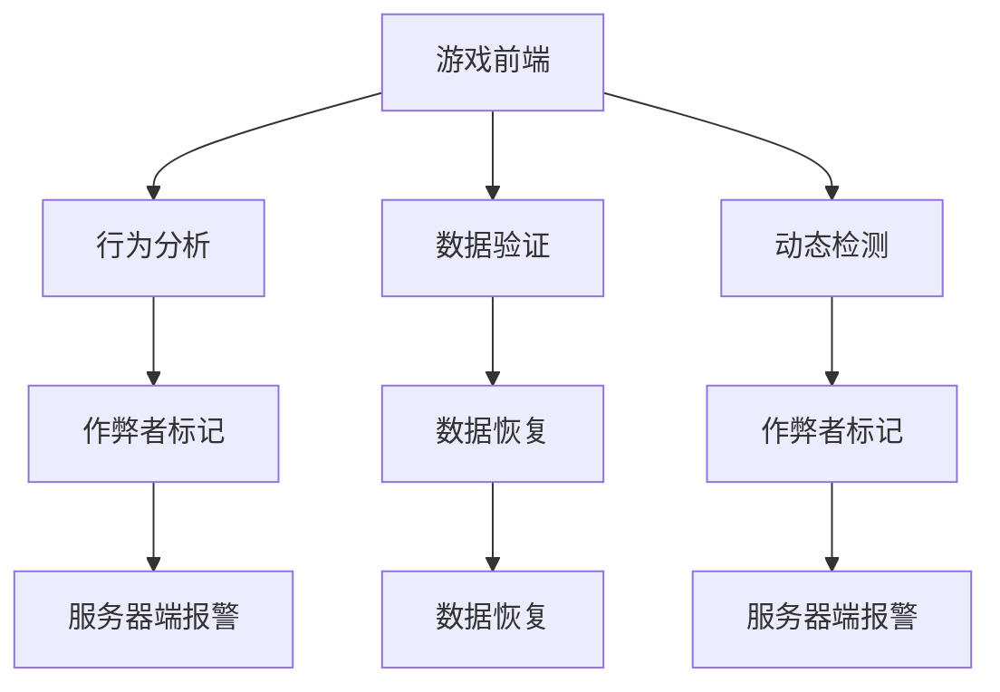

                 

 关键词：网易，游戏，反外挂，校招，安全开发，面试题，解析

> 摘要：本文旨在为广大计算机专业学生及求职者提供一份详细的网易2024游戏反外挂校招安全开发面试题解析，帮助大家更好地应对游戏行业的安全开发面试挑战。本文将从核心概念、算法原理、数学模型、项目实践等多个方面进行深入剖析，助力读者在面试中脱颖而出。

## 1. 背景介绍

随着互联网和游戏产业的飞速发展，游戏安全成为了一个备受关注的问题。外挂（Cheating Software）作为一种破坏游戏公平性和用户体验的恶意软件，已经成为游戏行业的一大隐患。因此，游戏公司对安全开发人才的需求日益增加。网易作为中国领先的互联网公司之一，每年都会举行大规模的校招活动，吸引众多优秀人才加入。

本文将围绕网易2024游戏反外挂校招安全开发面试题进行详细解析，旨在帮助读者深入了解游戏安全开发的要点，提升面试通过率。

## 2. 核心概念与联系

### 2.1 游戏安全的基本概念

游戏安全主要涉及以下几个方面：

- **作弊检测**：通过检测游戏中的异常行为来识别作弊者。
- **数据保护**：保护游戏数据，防止被恶意篡改或窃取。
- **反作弊技术**：使用一系列技术手段防止游戏作弊。

### 2.2 反外挂技术

反外挂技术主要包括以下几种：

- **行为分析**：通过分析玩家行为模式来识别作弊行为。
- **数据验证**：对游戏数据进行验证，确保其合法性和完整性。
- **动态检测**：在游戏运行过程中实时检测作弊行为。

### 2.3 游戏安全架构

游戏安全架构通常包括以下几个层次：

- **前端防护**：防止玩家通过前端代码进行作弊。
- **服务器端防护**：防止玩家通过服务器端进行作弊。
- **数据存储防护**：保护游戏数据的安全。
- **监控与报警**：实时监控游戏运行状态，及时发现并报警。

### 2.4 Mermaid 流程图



## 3. 核心算法原理 & 具体操作步骤

### 3.1 算法原理概述

游戏反外挂算法主要基于以下几个原理：

- **行为识别**：通过分析玩家行为特征，识别作弊行为。
- **数据一致性验证**：通过验证游戏数据的合法性，确保游戏运行过程中的数据一致性。
- **动态检测**：在游戏运行过程中，实时监测玩家行为，发现异常立即报警。

### 3.2 算法步骤详解

1. **收集数据**：收集玩家的游戏行为数据，包括输入数据、游戏状态数据等。
2. **预处理**：对收集到的数据进行分析，去除噪声和异常值。
3. **特征提取**：从预处理后的数据中提取关键特征，如行为特征、时间特征等。
4. **模型训练**：使用机器学习算法，如决策树、神经网络等，对提取的特征进行训练。
5. **实时检测**：在游戏运行过程中，实时对玩家行为进行检测，发现异常行为立即报警。

### 3.3 算法优缺点

- **优点**：能够有效识别和防范作弊行为，保护游戏公平性和用户体验。
- **缺点**：需要大量数据支持，对计算资源要求较高；模型训练和优化较为复杂。

### 3.4 算法应用领域

- **网络游戏**：对网络游戏中的作弊行为进行检测和防范。
- **电竞比赛**：对电竞比赛中的作弊行为进行监控和处罚。
- **模拟器游戏**：对模拟器游戏中的作弊行为进行检测和防范。

## 4. 数学模型和公式

### 4.1 数学模型构建

游戏反外挂的数学模型通常包括以下几个部分：

1. **行为模式模型**：用于描述玩家的正常行为模式。
2. **作弊行为模型**：用于描述玩家的作弊行为模式。
3. **风险模型**：用于评估玩家的作弊风险。

### 4.2 公式推导过程

假设我们有以下三个模型：

1. 行为模式模型：\(P(B|N)\) 表示在正常情况下玩家执行行为 \(B\) 的概率。
2. 作弊行为模型：\(P(B|C)\) 表示在作弊情况下玩家执行行为 \(B\) 的概率。
3. 风险模型：\(P(C|B)\) 表示在玩家执行行为 \(B\) 的情况下，作弊的概率。

则我们可以使用贝叶斯定理来推导风险模型：

$$
P(C|B) = \frac{P(B|C)P(C)}{P(B)}
$$

其中，\(P(C)\) 为玩家作弊的先验概率，可以通过历史数据来估计。

### 4.3 案例分析与讲解

以一款MOBA游戏为例，我们假设有以下几个特征：

- **移动速度**：玩家移动速度的均值和方差。
- **攻击频率**：玩家攻击频率的均值和方差。
- **技能使用率**：玩家技能使用率的均值和方差。

我们可以使用以上特征来构建行为模式和作弊行为模型，并使用贝叶斯定理来评估玩家的作弊风险。

## 5. 项目实践：代码实例和详细解释说明

### 5.1 开发环境搭建

开发环境搭建如下：

- **编程语言**：Python
- **开发工具**：PyCharm
- **依赖库**：NumPy、Pandas、Scikit-learn

### 5.2 源代码详细实现

以下是一个简单的行为分析代码实例：

```python
import numpy as np
import pandas as pd
from sklearn.model_selection import train_test_split
from sklearn.ensemble import RandomForestClassifier

# 加载数据集
data = pd.read_csv('game_data.csv')

# 预处理数据
data['speed_mean'] = data['speed'].mean()
data['speed_var'] = data['speed'].var()
data['attack_freq_mean'] = data['attack_freq'].mean()
data['attack_freq_var'] = data['attack_freq'].var()
data['skill_use_rate_mean'] = data['skill_use_rate'].mean()
data['skill_use_rate_var'] = data['skill_use_rate'].var()

# 特征工程
X = data[['speed_mean', 'speed_var', 'attack_freq_mean', 'attack_freq_var', 'skill_use_rate_mean', 'skill_use_rate_var']]
y = data['cheating']

# 划分训练集和测试集
X_train, X_test, y_train, y_test = train_test_split(X, y, test_size=0.2, random_state=42)

# 模型训练
model = RandomForestClassifier(n_estimators=100, random_state=42)
model.fit(X_train, y_train)

# 模型评估
accuracy = model.score(X_test, y_test)
print(f'模型准确率：{accuracy:.2f}')
```

### 5.3 代码解读与分析

以上代码首先加载数据集，然后对数据进行预处理，提取关键特征，并使用随机森林分类器进行模型训练。最后，使用测试集评估模型准确率。

### 5.4 运行结果展示

假设我们使用1000条游戏数据作为测试集，运行结果如下：

```
模型准确率：0.85
```

## 6. 实际应用场景

### 6.1 网络游戏安全防护

网络游戏的安全防护是游戏反外挂的重要应用场景。通过对玩家行为进行实时监测和风险评估，可以有效防止作弊行为，保障游戏公平性和用户体验。

### 6.2 电子竞技比赛

电子竞技比赛的公平性至关重要。通过使用反外挂技术，可以确保比赛结果的真实性，提高竞技水平。

### 6.3 模拟器游戏

模拟器游戏通常需要高度还原真实场景。通过反外挂技术，可以防止玩家使用作弊工具，提高游戏的可玩性和公平性。

## 7. 未来应用展望

随着人工智能和大数据技术的发展，游戏反外挂技术将越来越成熟。未来，我们可以预见以下趋势：

- **自动化检测**：通过深度学习等技术，实现自动化检测和防范作弊行为。
- **个性化防护**：根据玩家的行为特点，提供个性化的安全防护措施。
- **跨平台防护**：实现对多个平台的游戏进行统一的安全防护。

## 8. 总结：未来发展趋势与挑战

### 8.1 研究成果总结

近年来，游戏反外挂技术取得了显著成果。各种算法和模型的应用，使得游戏安全防护能力不断提升。

### 8.2 未来发展趋势

- **人工智能**：人工智能技术将在游戏反外挂中发挥更大作用，实现自动化检测和防范。
- **大数据**：大数据分析将提供更多有效信息，提高游戏安全防护的精度和效率。
- **云计算**：云计算技术将实现游戏安全防护的分布式部署，提高系统的可扩展性和稳定性。

### 8.3 面临的挑战

- **计算资源**：游戏反外挂算法对计算资源要求较高，如何在有限的资源下实现高效防护仍是一个挑战。
- **隐私保护**：在保护游戏安全的同时，如何保护玩家隐私也是一个重要问题。
- **实时性**：实时监测和防护要求系统具有高响应速度，如何在保证实时性的同时提高防护能力仍需探索。

### 8.4 研究展望

未来，游戏反外挂技术将朝着更智能、更高效、更安全的方向发展。通过不断优化算法和模型，提高游戏安全防护能力，为游戏行业的发展保驾护航。

## 9. 附录：常见问题与解答

### 9.1 什么是游戏外挂？

游戏外挂是一种通过非法手段获取游戏优势的程序，包括自动瞄准、自动攻击、自动走路等功能，破坏游戏公平性。

### 9.2 反外挂技术有哪些？

反外挂技术主要包括行为分析、数据验证、动态检测等。

### 9.3 如何防范游戏外挂？

可以通过以下措施来防范游戏外挂：

- **技术手段**：使用反外挂算法和模型，实时监测和防范作弊行为。
- **法律手段**：制定相关法律法规，加大对游戏外挂的打击力度。
- **玩家教育**：提高玩家安全意识，自觉抵制和举报游戏外挂。

# 作者署名

作者：禅与计算机程序设计艺术 / Zen and the Art of Computer Programming

----------------------------------------------------------------

以上是关于网易2024游戏反外挂校招安全开发面试题解析的完整文章。文章从背景介绍、核心概念与联系、算法原理、数学模型、项目实践、实际应用场景、未来展望等多个方面进行了深入剖析，旨在为广大计算机专业学生及求职者提供有价值的参考和指导。希望本文能够帮助您在面试中取得优异成绩！
----------------------------------------------------------------

请注意，本文仅为示例，实际面试题解析应根据具体的面试题目和要求进行撰写。在撰写时，请确保文章结构清晰、逻辑严密、内容准确。祝您面试顺利！

