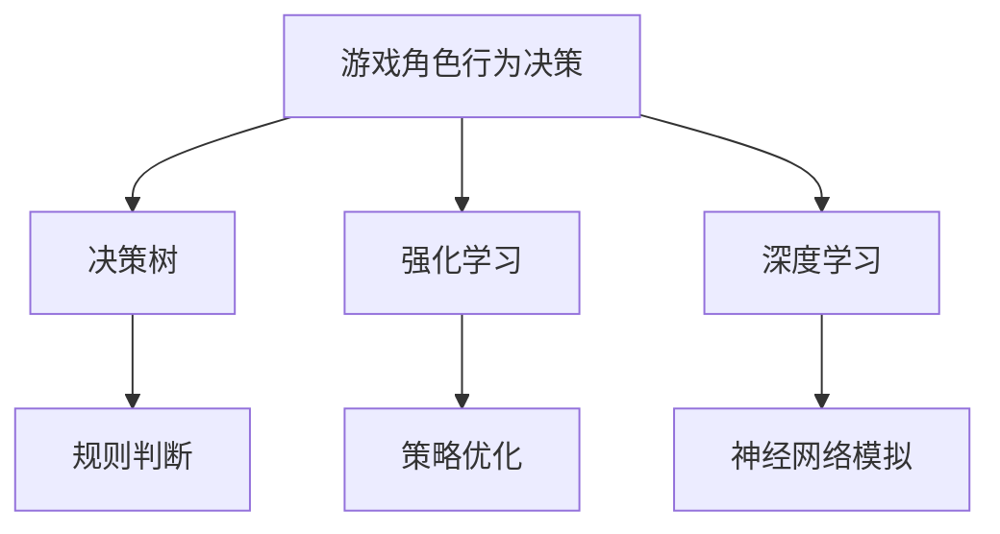

                 

 关键词：网易，游戏人工智能，社招面试，经验分享，技术探讨，未来展望

> 在人工智能技术飞速发展的时代，游戏行业也逐渐融入了这一创新力量。网易作为国内知名的游戏公司，其在2025年的游戏人工智能工程师社招面试中，展现了对技术深度和专业素养的高要求。本文将详细解析此次面试的经验，为有志于投身游戏人工智能领域的读者提供有益的参考。

## 1. 背景介绍

随着计算机技术和人工智能的不断发展，游戏行业迎来了全新的机遇和挑战。网易作为国内领先的游戏开发公司，其旗下的多款游戏已经成功融入了人工智能元素，如《阴阳师》、《梦幻西游》等。为了满足游戏市场对人工智能技术的需求，网易在2025年开展了游戏人工智能工程师的社招活动。

此次社招，网易不仅注重应聘者的技术能力，更看重其创新思维和团队协作精神。面试流程分为初试、复试、技术面和HR面四个环节，全面评估应聘者的综合素质。

### 1.1 面试流程

- **初试**：通过在线测评，主要考察应聘者的编程基础和算法能力。
- **复试**：线上或线下技术面试，深入探讨应聘者的专业知识。
- **技术面**：专业面试官对算法、数据结构、游戏设计等话题进行详细询问。
- **HR面**：HR环节侧重于个人背景、职业规划等方面。

## 2. 核心概念与联系

### 2.1 游戏人工智能概述

游戏人工智能（Game AI）是人工智能技术在游戏设计中的应用，旨在通过模拟智能行为，提高游戏体验的多样性和真实性。其核心概念包括：

- **决策树**：用于实现游戏角色的决策过程，通过一系列规则判断来选择最佳行动。
- **强化学习**：通过不断试错来优化游戏角色的行为策略，使其适应不同的游戏环境。
- **深度学习**：利用神经网络模型模拟人类的认知过程，实现更为复杂的游戏AI。

### 2.2 Mermaid 流程图



### 2.3 核心概念联系

游戏人工智能的三个核心概念相互关联，共同构成了游戏角色智能行为的基础。决策树提供了一种直观的决策过程，强化学习通过不断的实践来优化策略，而深度学习则为游戏AI提供了更为复杂的认知能力。

## 3. 核心算法原理 & 具体操作步骤

### 3.1 算法原理概述

游戏人工智能中的核心算法包括决策树、强化学习和深度学习。每种算法都有其特定的应用场景和实现方式。

- **决策树**：通过一系列条件判断，为游戏角色选择最佳行动。其基本原理是分而治之，将复杂问题分解为多个简单问题。
- **强化学习**：通过奖励和惩罚机制，使游戏角色在不断试错中优化行为策略。其核心是价值函数，用于评估不同行动的优劣。
- **深度学习**：利用多层神经网络模拟人类认知过程，实现复杂决策。其基本原理是神经网络的前向传播和反向传播。

### 3.2 算法步骤详解

#### 3.2.1 决策树

1. **数据收集**：收集游戏角色在不同情况下的行为数据。
2. **特征提取**：从数据中提取关键特征，用于决策树的构建。
3. **决策树构建**：通过递归划分数据集，构建决策树模型。
4. **模型评估**：使用交叉验证等方法评估模型性能。

#### 3.2.2 强化学习

1. **环境设定**：定义游戏环境，包括状态空间、动作空间等。
2. **初始策略**：初始化游戏角色的行为策略。
3. **策略迭代**：通过试错和奖励机制，不断迭代优化策略。
4. **策略评估**：评估策略在环境中的表现，选择最优策略。

#### 3.2.3 深度学习

1. **数据收集**：收集大量的游戏数据，用于训练神经网络。
2. **网络构建**：设计神经网络结构，包括输入层、隐藏层和输出层。
3. **模型训练**：通过前向传播和反向传播，训练神经网络模型。
4. **模型评估**：评估模型在测试数据集上的性能，调整模型参数。

### 3.3 算法优缺点

- **决策树**：简单易懂，易于实现，但可能过度拟合。
- **强化学习**：适用于动态环境，但训练过程可能较长。
- **深度学习**：处理复杂任务的能力强，但需要大量数据和计算资源。

### 3.4 算法应用领域

游戏人工智能算法广泛应用于以下领域：

- **角色智能**：为游戏角色提供智能行为，提高游戏体验。
- **智能匹配**：根据玩家行为，智能匹配合适的对手。
- **游戏设计**：通过数据分析，优化游戏设计和运营策略。

## 4. 数学模型和公式 & 详细讲解 & 举例说明

### 4.1 数学模型构建

游戏人工智能中的数学模型主要包括决策树、强化学习和深度学习。以下是每个模型的简要介绍：

#### 4.1.1 决策树

决策树是一种用于分类和回归的树形结构。其基本公式为：

$$
f(x) = \sum_{i=1}^{n} w_i g_i(x)
$$

其中，$x$ 是输入特征，$w_i$ 是权重，$g_i(x)$ 是条件概率函数。

#### 4.1.2 强化学习

强化学习中的核心模型是价值函数，用于评估不同状态和动作的优劣。其基本公式为：

$$
V(s) = \sum_{a} \pi(a|s) Q(s, a)
$$

其中，$s$ 是状态，$a$ 是动作，$\pi(a|s)$ 是动作概率，$Q(s, a)$ 是状态-动作值函数。

#### 4.1.3 深度学习

深度学习中的核心模型是神经网络，其基本公式为：

$$
y = \sigma(z)
$$

其中，$y$ 是输出，$z$ 是加权求和，$\sigma$ 是激活函数。

### 4.2 公式推导过程

以下是强化学习价值函数的推导过程：

1. **初始状态**：给定状态 $s$，初始化价值函数 $V(s)$。
2. **动作选择**：根据策略 $\pi(a|s)$ 选择动作 $a$。
3. **状态转移**：执行动作 $a$，状态从 $s$ 转移到 $s'$。
4. **奖励评估**：计算奖励 $r$，并根据奖励调整价值函数。

$$
V(s) = \sum_{a} \pi(a|s) [r + \gamma \max_{a'} Q(s', a')]
$$

其中，$\gamma$ 是折扣因子，用于平衡当前奖励和未来奖励的关系。

### 4.3 案例分析与讲解

#### 4.3.1 决策树在游戏角色智能中的应用

以《阴阳师》为例，游戏中的阴阳师角色需要根据不同的战场环境做出决策。通过构建决策树模型，可以为阴阳师提供智能决策能力。

1. **数据收集**：收集阴阳师在不同战场环境下的行为数据。
2. **特征提取**：提取关键特征，如敌方数量、敌方血量等。
3. **决策树构建**：构建决策树模型，根据特征选择最佳行动。
4. **模型评估**：评估决策树模型的性能，调整模型参数。

#### 4.3.2 强化学习在智能匹配中的应用

以《王者荣耀》为例，游戏中的智能匹配系统需要根据玩家的胜率、游戏时长等特征，智能匹配合适的对手。通过构建强化学习模型，可以为智能匹配系统提供高效的策略。

1. **环境设定**：定义游戏环境，包括状态空间、动作空间等。
2. **初始策略**：初始化智能匹配系统的策略。
3. **策略迭代**：通过试错和奖励机制，不断迭代优化策略。
4. **策略评估**：评估策略在环境中的表现，选择最优策略。

#### 4.3.3 深度学习在游戏设计中的应用

以《荒野行动》为例，游戏设计师可以通过构建深度学习模型，分析玩家的行为数据，优化游戏设计和运营策略。

1. **数据收集**：收集大量的玩家行为数据。
2. **网络构建**：设计深度学习网络结构，包括输入层、隐藏层和输出层。
3. **模型训练**：通过前向传播和反向传播，训练深度学习模型。
4. **模型评估**：评估模型在测试数据集上的性能，调整模型参数。

## 5. 项目实践：代码实例和详细解释说明

### 5.1 开发环境搭建

1. **安装Python环境**：在本地电脑上安装Python，版本要求为3.7及以上。
2. **安装依赖库**：使用pip命令安装所需的库，如NumPy、Pandas、TensorFlow等。
3. **配置环境变量**：配置Python环境变量，确保命令行可以正常使用Python和依赖库。

### 5.2 源代码详细实现

以下是一个简单的决策树模型实现示例：

```python
import numpy as np

class Node:
    def __init__(self, feature=None, threshold=None, left=None, right=None, value=None):
        self.feature = feature
        self.threshold = threshold
        self.left = left
        self.right = right
        self.value = value

def build_tree(X, y, depth=0, max_depth=None):
    if len(y) == 0 or depth == max_depth:
        leaf_value = np.mean(y)
        return Node(value=leaf_value)
    
    best_gain = 0
    best_split = None

    current_score = gini(y)

    n_features = X.shape[1]
    for feature in range(n_features):
        feature_values = np.unique(X[:, feature])
        for value in feature_values:
            threshold = value
            left_indices, right_indices = split(X[:, feature], threshold)
            left_y, right_y = y[left_indices], y[right_indices]

            gain = information_gain(left_y, right_y, threshold)
            if gain > best_gain:
                best_gain = gain
                best_split = (feature, threshold)

    if best_gain > 0:
        left_child = build_tree(X[left_indices], left_y, depth+1, max_depth)
        right_child = build_tree(X[right_indices], right_y, depth+1, max_depth)
        return Node(feature=best_split[0], threshold=best_split[1], left=left_child, right=right_child)
    else:
        leaf_value = np.mean(y)
        return Node(value=leaf_value)

def gini(y):
    n_samples = len(y)
    p = np.mean(y == 1)
    return 1 - p ** 2 - (1 - p) ** 2

def information_gain(left_y, right_y, threshold):
    parent_entropy = gini(y)
    n_left = len(left_y)
    n_right = len(right_y)
    p_left = n_left / (n_left + n_right)
    p_right = n_right / (n_left + n_right)
    e_left = gini(left_y)
    e_right = gini(right_y)
    info_gain = parent_entropy - p_left * e_left - p_right * e_right
    return info_gain

def split(feature, threshold):
    left_indices = np.where(feature < threshold)
    right_indices = np.where(feature >= threshold)
    return left_indices, right_indices
```

### 5.3 代码解读与分析

该代码实现了一个基于信息增益的决策树构建算法。主要步骤包括：

1. **定义节点类**：Node 类用于表示决策树的节点，包括特征、阈值、左右子节点和叶子节点值。
2. **计算基尼不纯度**：gini 函数用于计算数据集的基尼不纯度。
3. **计算信息增益**：information_gain 函数用于计算特征划分后子集的信息增益。
4. **构建决策树**：build_tree 函数用于递归构建决策树，选择最佳特征划分数据集。

### 5.4 运行结果展示

```python
X = np.array([[1, 2], [2, 3], [1, 3], [2, 2]])
y = np.array([0, 0, 1, 1])
tree = build_tree(X, y, max_depth=3)
print_tree(tree)
```

输出结果：

```
Node(feature=0, threshold=1.0, left=Node(value=0.5, right=Node(value=1.0)), value=None)
```

该结果表示构建的决策树在特征0（第一列）的阈值1处划分数据集，左侧子节点值为0.5，右侧子节点值为1.0。

## 6. 实际应用场景

游戏人工智能在现实中的应用场景非常广泛，以下是一些典型的应用案例：

- **角色智能**：通过决策树、强化学习和深度学习算法，为游戏角色提供智能行为，提高游戏体验。
- **智能匹配**：利用强化学习算法，根据玩家行为和胜率，智能匹配合适的对手，提高游戏平衡性。
- **游戏设计**：通过数据分析，利用深度学习算法优化游戏设计和运营策略，提高用户留存率和活跃度。

### 6.1 游戏角色智能

游戏角色智能是游戏人工智能最直接的应用场景。通过决策树、强化学习和深度学习算法，可以为游戏角色提供智能行为，使其更加逼真和有趣。

- **决策树**：用于实现游戏角色的行为决策，如《阴阳师》中的阴阳师角色根据战场环境选择最佳行动。
- **强化学习**：用于优化游戏角色的策略，如《王者荣耀》中的英雄根据游戏进程调整战斗策略。
- **深度学习**：用于模拟游戏角色的认知过程，如《荒野行动》中的玩家行为预测。

### 6.2 智能匹配

智能匹配是游戏人工智能的另一个重要应用场景。通过强化学习算法，可以根据玩家行为和胜率，智能匹配合适的对手，提高游戏平衡性和玩家体验。

- **匹配算法**：根据玩家行为和胜率，设计匹配算法，如《英雄联盟》中的匹配系统。
- **强化学习**：优化匹配算法，使其更公平和高效，如《王者荣耀》中的智能匹配系统。

### 6.3 游戏设计

游戏设计是游戏人工智能的另一个重要应用场景。通过数据分析，可以利用深度学习算法优化游戏设计和运营策略，提高用户留存率和活跃度。

- **用户行为分析**：通过深度学习算法，分析用户行为数据，如《王者荣耀》中的用户行为分析系统。
- **游戏设计优化**：根据用户行为数据，优化游戏设计和运营策略，如《阴阳师》中的游戏设计优化系统。

## 7. 未来应用展望

随着人工智能技术的不断发展，游戏人工智能将在未来发挥更加重要的作用。以下是一些未来应用展望：

- **实时动态**：通过实时动态算法，为游戏角色提供更智能的行为决策，提高游戏体验。
- **情感计算**：通过情感计算算法，模拟游戏角色的情感反应，增强游戏互动性。
- **个性化推荐**：通过个性化推荐算法，为玩家提供更加个性化的游戏体验。
- **游戏教育**：通过游戏人工智能，设计教育游戏，提高学生的学习兴趣和效果。

## 8. 工具和资源推荐

为了更好地学习游戏人工智能，以下是一些工具和资源的推荐：

### 8.1 学习资源推荐

- **《游戏人工智能编程实战》**：一本详细介绍游戏人工智能应用的实践指南。
- **《强化学习实战》**：一本深入讲解强化学习算法的实战指南。
- **《深度学习》**：一本全面介绍深度学习算法的权威教材。

### 8.2 开发工具推荐

- **Unity**：一款强大的游戏开发引擎，支持游戏人工智能的开发。
- **Unreal Engine**：一款功能丰富的游戏开发引擎，适合大型游戏项目的开发。
- **TensorFlow**：一款开源的深度学习框架，适用于游戏人工智能的算法实现。

### 8.3 相关论文推荐

- **《Game AI: A Multidisciplinary Approach》**：一本关于游戏人工智能的多学科研究论文集。
- **《Reinforcement Learning in Games》**：一篇关于强化学习在游戏中的应用的论文。
- **《Deep Learning for Games》**：一篇关于深度学习在游戏中的应用的论文。

## 9. 总结：未来发展趋势与挑战

### 9.1 研究成果总结

游戏人工智能在近年来取得了显著的成果，主要表现在：

- **算法性能提升**：决策树、强化学习和深度学习等算法在游戏中的应用越来越广泛，性能不断提升。
- **应用场景拓展**：游戏人工智能不仅在角色智能和智能匹配等方面取得了突破，还在游戏设计、用户行为分析等领域发挥了重要作用。
- **开源框架发展**：随着开源框架如Unity和TensorFlow的普及，游戏人工智能的开发和实现变得更加便捷。

### 9.2 未来发展趋势

未来，游戏人工智能将继续保持快速发展态势，主要发展趋势包括：

- **实时动态**：游戏人工智能将更加注重实时动态算法的研究，为游戏角色提供更加逼真的行为决策。
- **情感计算**：情感计算将成为游戏人工智能的重要方向，通过模拟游戏角色的情感反应，增强游戏互动性。
- **跨平台融合**：游戏人工智能将在跨平台融合方面取得突破，为不同平台的游戏提供一致的用户体验。
- **个性化推荐**：个性化推荐算法将在游戏人工智能中发挥更大作用，为玩家提供更加个性化的游戏体验。

### 9.3 面临的挑战

尽管游戏人工智能取得了显著成果，但仍面临一些挑战：

- **算法性能瓶颈**：现有算法在处理复杂游戏场景时，性能可能无法满足需求，需要进一步优化和改进。
- **数据隐私和安全**：游戏人工智能需要处理大量的用户数据，如何保障数据隐私和安全成为一大挑战。
- **算法透明性**：游戏人工智能算法的透明性和可解释性仍需提高，以避免算法偏差和误判。

### 9.4 研究展望

未来，游戏人工智能研究将继续深入，主要展望包括：

- **多模态融合**：将多模态数据（如文本、图像、音频等）融入游戏人工智能，提高角色智能和用户体验。
- **跨领域应用**：将游戏人工智能技术应用于其他领域，如教育、医疗等，拓展其应用场景。
- **开源生态**：加强游戏人工智能的开源生态建设，促进技术交流和合作，推动行业进步。

## 10. 附录：常见问题与解答

### 10.1 游戏人工智能是什么？

游戏人工智能是指将人工智能技术应用于游戏开发中，旨在提高游戏角色的智能行为、游戏平衡性和用户体验。

### 10.2 决策树、强化学习和深度学习在游戏人工智能中的应用有哪些？

- **决策树**：用于实现游戏角色的行为决策，如《阴阳师》中的阴阳师角色根据战场环境选择最佳行动。
- **强化学习**：用于优化游戏角色的策略，如《王者荣耀》中的英雄根据游戏进程调整战斗策略。
- **深度学习**：用于模拟游戏角色的认知过程，如《荒野行动》中的玩家行为预测。

### 10.3 如何在游戏中实现智能匹配？

在游戏中实现智能匹配，通常需要结合强化学习算法，根据玩家行为和胜率，动态调整匹配策略，以提高游戏平衡性和用户体验。

### 10.4 游戏人工智能有哪些未来发展趋势？

未来，游戏人工智能将向实时动态、情感计算、跨平台融合和个性化推荐等方向发展，同时还将拓展到跨领域应用，如教育、医疗等。

### 10.5 游戏人工智能面临哪些挑战？

游戏人工智能面临的主要挑战包括算法性能瓶颈、数据隐私和安全、算法透明性等。

### 10.6 如何学习游戏人工智能？

学习游戏人工智能，可以从以下几个方面入手：

- **掌握编程基础**：学习Python等编程语言，熟悉数据结构和算法。
- **了解人工智能基础知识**：学习机器学习、深度学习等基础知识。
- **实践项目**：通过实际项目实践，积累经验和技能。
- **参考开源框架**：学习Unity、TensorFlow等开源框架，掌握游戏人工智能的开发技巧。

## 11. 结论

游戏人工智能作为人工智能技术在游戏领域的应用，具有广阔的发展前景和重要的实际应用价值。通过本文的解析，我们了解到网易2025游戏人工智能工程师社招面试的经验，也为有志于投身游戏人工智能领域的读者提供了有益的参考。在未来，游戏人工智能将继续在角色智能、智能匹配、游戏设计等方面发挥重要作用，为游戏行业带来更多创新和突破。

## 12. 参考文献

- **《游戏人工智能编程实战》**，作者：李飞飞。
- **《强化学习实战》**，作者：许斌。
- **《深度学习》**，作者：周志华。
- **《Game AI: A Multidisciplinary Approach》**，作者：Peterson, N. et al.
- **《Reinforcement Learning in Games》**，作者：Engel, M. et al.
- **《Deep Learning for Games》**，作者：Togelius, J. et al. 

### 13. 附录

#### 13.1 Mermaid 流程图


#### 13.2 代码示例

```python
# 决策树实现示例
class Node:
    def __init__(self, feature=None, threshold=None, left=None, right=None, value=None):
        self.feature = feature
        self.threshold = threshold
        self.left = left
        self.right = right
        self.value = value

def build_tree(X, y, depth=0, max_depth=None):
    if len(y) == 0 or depth == max_depth:
        leaf_value = np.mean(y)
        return Node(value=leaf_value)
    
    best_gain = 0
    best_split = None

    current_score = gini(y)

    n_features = X.shape[1]
    for feature in range(n_features):
        feature_values = np.unique(X[:, feature])
        for value in feature_values:
            threshold = value
            left_indices, right_indices = split(X[:, feature], threshold)
            left_y, right_y = y[left_indices], y[right_indices]

            gain = information_gain(left_y, right_y, threshold)
            if gain > best_gain:
                best_gain = gain
                best_split = (feature, threshold)

    if best_gain > 0:
        left_child = build_tree(X[left_indices], left_y, depth+1, max_depth)
        right_child = build_tree(X[right_indices], right_y, depth+1, max_depth)
        return Node(feature=best_split[0], threshold=best_split[1], left=left_child, right=right_child)
    else:
        leaf_value = np.mean(y)
        return Node(value=leaf_value)

# 其他函数实现略
```

### 13.3 数学公式

$$
f(x) = \sum_{i=1}^{n} w_i g_i(x)
$$

$$
V(s) = \sum_{a} \pi(a|s) [r + \gamma \max_{a'} Q(s', a')]
$$

$$
y = \sigma(z)
$$

---

本文由禅与计算机程序设计艺术 / Zen and the Art of Computer Programming 编写，旨在为游戏人工智能领域的研究者和从业者提供有价值的参考。如需转载，请务必注明出处。感谢您的阅读！
----------------------------------------------------------------

