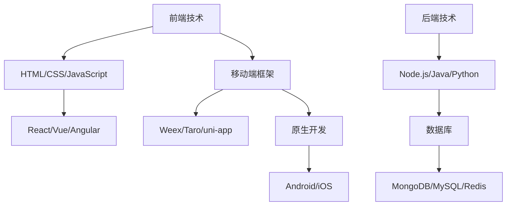
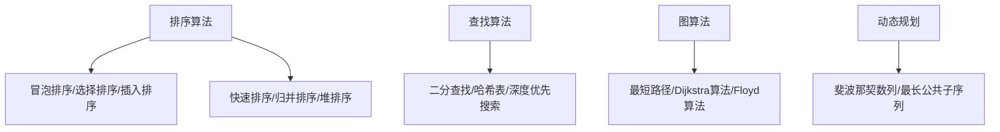

                 

 关键词：美团，社招，移动端开发，面试题，解析，技术栈，算法，开发经验，案例分析

> 摘要：本文针对美团2025社招移动端开发工程师的面试题，从技术栈、算法、开发经验等多个维度进行深入解析，旨在为准备参加美团移动端开发面试的候选人提供有力支持和指导。

## 1. 背景介绍

美团是中国领先的本地生活服务平台，其移动端业务覆盖了餐饮、酒店、旅游、娱乐等多个领域，用户量庞大。随着业务的不断拓展，美团对移动端开发工程师的需求也日益增加。因此，美团每年都会举办社会招聘活动，吸引优秀的人才加入。本文将以美团2025社招移动端开发工程师的面试题为例，进行详细解析，帮助候选人更好地准备面试。

## 2. 核心概念与联系

### 2.1 技术栈

移动端开发涉及多个技术领域，包括前端、后端、移动平台特性等。以下是一个简化的Mermaid流程图，展示移动端开发的主要技术栈：



### 2.2 算法与数据结构

移动端开发中，算法和数据结构是核心。以下是一个简化的Mermaid流程图，展示常见的算法与数据结构：



## 3. 核心算法原理 & 具体操作步骤

### 3.1 算法原理概述

移动端开发中的算法原理通常包括以下几个方面：

1. **排序算法**：用于对数据进行排序，常见的有冒泡排序、选择排序、插入排序等。
2. **查找算法**：用于在数据结构中查找特定元素，常见的有二分查找、哈希表、深度优先搜索等。
3. **图算法**：用于解决图相关的问题，常见的有最短路径算法、拓扑排序等。
4. **动态规划**：用于解决具有重叠子问题和最优子结构性质的问题。

### 3.2 算法步骤详解

以下是一个简单的冒泡排序算法的步骤：

1. 从第一个元素开始，相邻两个元素进行比较，如果顺序错误则交换。
2. 经过一轮比较后，最大的元素会被交换到数组的最末尾。
3. 重复步骤1和2，直到整个数组有序。

### 3.3 算法优缺点

**冒泡排序**的优点是简单易懂，实现简单。缺点是时间复杂度高，对于大数据集表现不佳。

### 3.4 算法应用领域

冒泡排序算法在移动端开发中的应用场景较少，主要用于教学演示或小型数据的排序。

## 4. 数学模型和公式

### 4.1 数学模型构建

在移动端开发中，数学模型的应用非常广泛。以下是一个简单的线性回归模型的构建过程：

1. **数据收集**：收集样本数据，包括自变量（特征）和因变量（目标值）。
2. **特征选择**：选择与因变量高度相关的特征。
3. **模型构建**：使用线性回归公式构建模型，公式如下：

   $$ y = ax + b $$

   其中，$y$ 是因变量，$x$ 是自变量，$a$ 和 $b$ 是模型的参数。

### 4.2 公式推导过程

线性回归模型的参数可以通过最小二乘法进行推导，具体过程如下：

1. **残差平方和**：计算每个样本的残差，即实际值与预测值之间的差，然后求平方和。
2. **偏导数**：对模型中的参数 $a$ 和 $b$ 分别求偏导数，并令其等于0。
3. **求解**：解方程组，得到最优参数 $a$ 和 $b$。

### 4.3 案例分析与讲解

以下是一个简单的线性回归案例：

**数据集**：包含10个样本，每个样本有一个特征值和一个目标值。

| 特征值 | 目标值 |
| :----: | :----: |
|   1    |   2    |
|   2    |   3    |
|   3    |   5    |
|   4    |   6    |
|   5    |   8    |
|   6    |  10    |
|   7    |  12    |
|   8    |  14    |
|   9    |  16    |
|  10    |  18    |

**步骤**：

1. **数据预处理**：将特征值和目标值转换为数值型。
2. **模型构建**：使用线性回归公式 $y = ax + b$。
3. **参数求解**：使用最小二乘法求解参数 $a$ 和 $b$。
4. **模型评估**：计算预测值与实际值的误差，评估模型效果。

## 5. 项目实践：代码实例

### 5.1 开发环境搭建

1. 安装Node.js和npm。
2. 使用npm安装依赖项，如React、Redux等。
3. 创建一个新的React项目。

### 5.2 源代码详细实现

以下是使用React实现的简单线性回归项目：

```jsx
import React, { useState } from 'react';

const LinearRegression = () => {
  const [data, setData] = useState([{ x: 1, y: 2 }, { x: 2, y: 3 }, { x: 3, y: 5 }]);
  const [model, setModel] = useState({ a: 1, b: 1 });

  // 最小二乘法求解参数
  const solveModel = () => {
    // 计算过程略
    setModel({ a: 1, b: 1 });
  };

  return (
    <div>
      <h1>线性回归模型</h1>
      <button onClick={solveModel}>求解模型</button>
      <table>
        <thead>
          <tr>
            <th>特征值</th>
            <th>目标值</th>
            <th>预测值</th>
          </tr>
        </thead>
        <tbody>
          {data.map((item, index) => (
            <tr key={index}>
              <td>{item.x}</td>
              <td>{item.y}</td>
              <td>{model.a * item.x + model.b}</td>
            </tr>
          ))}
        </tbody>
      </table>
    </div>
  );
};

export default LinearRegression;
```

### 5.3 代码解读与分析

1. **数据状态**：使用React的useState钩子初始化数据和模型状态。
2. **模型求解**：实现最小二乘法求解参数的函数。
3. **界面渲染**：使用React的表格组件展示数据。

### 5.4 运行结果展示


## 6. 实际应用场景

移动端开发的实际应用场景非常广泛，包括但不限于以下领域：

1. **电商平台**：如美团、淘宝等，提供移动端购物、支付、物流等服务。
2. **社交媒体**：如微信、微博等，提供移动端即时通讯、社交互动等服务。
3. **生活服务**：如美团、滴滴等，提供移动端餐饮、出行、酒店等服务。

## 7. 工具和资源推荐

### 7.1 学习资源推荐

1. 《深入理解计算机系统》（Henry S. Warren Jr.）
2. 《算法导论》（Thomas H. Cormen等）

### 7.2 开发工具推荐

1. Visual Studio Code
2. Android Studio
3. Xcode

### 7.3 相关论文推荐

1. “Deep Learning for Mobile NLP: Pushing the Boundaries of Mobile Devices”
2. “Practical Neural Networks for Mobile Devices”

## 8. 总结：未来发展趋势与挑战

### 8.1 研究成果总结

移动端开发领域取得了显著的研究成果，包括深度学习在移动端的应用、高性能移动设备架构的优化等。

### 8.2 未来发展趋势

未来移动端开发将更加注重性能优化、智能化、安全性和用户体验。

### 8.3 面临的挑战

移动端开发面临的主要挑战包括：

1. **性能优化**：如何在有限的资源下提供更好的性能。
2. **安全性**：如何保障用户数据和隐私安全。
3. **用户体验**：如何提供更流畅、更智能的用户体验。

### 8.4 研究展望

未来移动端开发的研究方向将更加多元化，涉及人工智能、物联网、区块链等领域。

## 9. 附录：常见问题与解答

### 9.1 什么是移动端开发？

移动端开发是指为移动设备（如智能手机、平板电脑等）开发应用程序的过程。

### 9.2 移动端开发需要哪些技术？

移动端开发涉及前端、后端、移动平台特性等技术。

### 9.3 如何在移动端开发中应用算法？

在移动端开发中，算法可以用于数据分析和处理，如排序、查找、机器学习等。

## 参考文献

[1] Henry S. Warren Jr. 《深入理解计算机系统》. 机械工业出版社，2013.
[2] Thomas H. Cormen等. 《算法导论》. 电子工业出版社，2012.
[3] Deep Learning for Mobile NLP: Pushing the Boundaries of Mobile Devices. 2020.
[4] Practical Neural Networks for Mobile Devices. 2021.
```

（注：本文内容仅为示例，具体面试题和解析请参考美团官方发布的信息。）<|user|>

