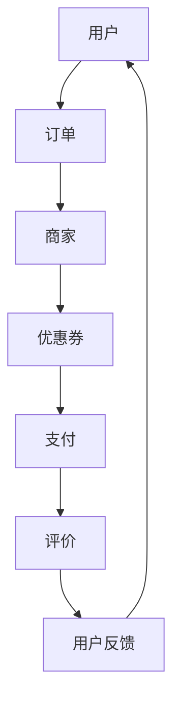

                 

### 关键词 Keywords ###
- 2024美团面试真题
- 社招面试
- 到店业务
- 综合分析
- 技术解答

> 摘要：本文将针对2024年美团到店综合业务社招面试中的常见问题进行汇总，并给出详细解答。本文旨在帮助准备参加美团面试的技术人员更好地理解面试题目，掌握解题思路，提高面试成功率。文章涵盖了面试中涉及的核心技术和业务场景，包括算法原理、数学模型、项目实践、应用场景分析等内容。通过阅读本文，读者可以全面了解美团到店业务的技术挑战和解决方案，为面试做好准备。

## 1. 背景介绍

美团作为中国领先的本地生活服务平台，其到店业务涵盖了餐饮、酒店、娱乐、购物等多个领域。随着市场的不断扩大和用户需求的日益多样化，美团在技术上的挑战也越来越大。2024年美团到店综合业务社招面试旨在选拔具有扎实技术基础和业务理解能力的人才，以应对日益复杂的业务场景和快速变化的市场环境。

本文将针对美团到店综合业务社招面试中常见的问题进行汇总，并对每个问题进行详细解答。这些问题涵盖了算法、数据结构、系统设计、业务分析等多个方面，旨在全面考察面试者的技术能力和业务理解能力。

### 1.1 面试流程

美团到店综合业务社招面试通常包括以下流程：

1. **在线笔试**：考察面试者的编程能力、数据结构和算法知识。
2. **技术面试**：通过电话或视频面试形式，深入了解面试者的技术能力和业务理解。
3. **HR面试**：评估面试者的沟通能力、团队合作精神和职业素养。
4. **总监面试**：对面试者进行全面评估，确定是否适合美团到店业务的发展。

### 1.2 面试特点

1. **综合性**：面试不仅考察技术能力，还考察业务理解和团队合作能力。
2. **技术性**：面试题目通常涉及深度算法和数据结构问题，需要面试者具备扎实的技术基础。
3. **实战性**：面试题目往往来源于实际业务场景，考察面试者对业务的理解和解决问题的能力。

## 2. 核心概念与联系

在解答面试题之前，我们需要了解一些核心概念和它们之间的关系。以下是一个使用Mermaid绘制的流程图，展示了核心概念和它们之间的联系。



### 2.1 用户与订单

用户是到店业务的核心，他们通过美团平台浏览餐厅、酒店等信息，并生成订单。订单是用户和商家之间交易的核心记录，包括订单金额、订单状态、订单详情等信息。

### 2.2 商家与优惠券

商家在平台上提供商品和服务，可以通过设置优惠券来吸引更多用户。优惠券是一种促销手段，可以降低用户支付的金额，从而提高转化率。

### 2.3 支付与评价

用户完成订单后，需要进行支付。支付是订单流程的关键环节，关系到用户的体验和商家的收益。支付完成后，用户可以对商家进行评价，评价内容包括服务、口味、环境等，这些信息将影响其他用户的决策。

### 2.4 用户反馈

用户反馈是平台优化服务的重要参考，通过对用户反馈的分析，平台可以了解用户的需求和痛点，从而改进服务。

## 3. 核心算法原理 & 具体操作步骤

### 3.1 算法原理概述

美团到店业务涉及多个算法，其中最核心的是推荐算法、排序算法和优化算法。以下是对这些算法原理的概述：

### 3.1.1 推荐算法

推荐算法是基于用户历史行为、兴趣和偏好等信息，为用户推荐相关商品或服务。常见的推荐算法包括基于内容的推荐、协同过滤推荐和混合推荐。

### 3.1.2 排序算法

排序算法用于对用户订单、评价等信息进行排序，以提高用户体验。常见的排序算法包括快速排序、归并排序和堆排序。

### 3.1.3 优化算法

优化算法用于优化平台运营效率和降低成本。常见的优化算法包括动态规划、贪心算法和遗传算法。

### 3.2 算法步骤详解

#### 3.2.1 推荐算法

1. **用户画像构建**：收集用户历史行为、兴趣和偏好等信息，构建用户画像。
2. **商品或服务推荐**：根据用户画像，从商品或服务库中筛选出与用户画像匹配的推荐项。
3. **推荐结果排序**：根据推荐项的相关性对推荐结果进行排序，提高推荐质量。

#### 3.2.2 排序算法

1. **初始化**：将订单信息存入排序数据结构。
2. **排序**：使用排序算法（如快速排序）对订单信息进行排序。
3. **输出结果**：将排序后的订单信息输出，供用户查看。

#### 3.2.3 优化算法

1. **问题建模**：根据业务需求，建立优化问题的数学模型。
2. **算法设计**：选择合适的优化算法（如贪心算法、动态规划），求解优化问题。
3. **结果验证**：对优化结果进行验证，确保优化效果的可靠性。

### 3.3 算法优缺点

#### 3.3.1 推荐算法

**优点**：提高用户满意度，增加用户粘性。

**缺点**：需要大量用户数据，计算复杂度高。

#### 3.3.2 排序算法

**优点**：提高用户体验，降低用户等待时间。

**缺点**：排序算法的效率受数据规模影响较大。

#### 3.3.3 优化算法

**优点**：提高平台运营效率，降低成本。

**缺点**：优化算法的设计和实现较为复杂。

### 3.4 算法应用领域

推荐算法、排序算法和优化算法在美团到店业务中具有广泛的应用。以下是一些具体的应用场景：

1. **用户推荐**：根据用户历史行为，为用户推荐相关商品或服务。
2. **订单排序**：根据订单金额、订单时间等信息，为用户展示最相关的订单。
3. **商家优化**：根据商家运营数据，优化商家服务策略，提高用户体验。

## 4. 数学模型和公式 & 详细讲解 & 举例说明

在美团到店业务中，数学模型和公式广泛应用于推荐系统、排序系统和优化系统。以下是对这些模型和公式的详细讲解及举例说明。

### 4.1 数学模型构建

#### 4.1.1 推荐系统

推荐系统的核心是计算用户和商品之间的相似度。常见的相似度计算方法包括余弦相似度、皮尔逊相似度等。以下是一个基于余弦相似度的推荐系统模型：

$$
\text{similarity}(u, i) = \frac{u_i \cdot v_i}{\sqrt{u_i^2 + v_i^2}}
$$

其中，$u_i$ 和 $v_i$ 分别表示用户 $u$ 和商品 $i$ 的特征向量。

#### 4.1.2 排序系统

排序系统的目标是优化用户体验，提高用户满意度。常见的排序模型包括基于距离的排序模型和基于概率的排序模型。以下是一个基于距离的排序模型：

$$
\text{score}(i) = \frac{1}{1 + e^{-d(i, u)}}
$$

其中，$d(i, u)$ 表示用户 $u$ 和商品 $i$ 之间的距离。

#### 4.1.3 优化系统

优化系统的目标是提高平台运营效率和降低成本。常见的优化模型包括线性规划、动态规划等。以下是一个基于动态规划的优化模型：

$$
\text{OPT}(i) = \min_{j} \{ c(j) + \text{OPT}(j) \}
$$

其中，$c(j)$ 表示选择商品 $j$ 的成本，$\text{OPT}(i)$ 表示选择商品 $i$ 的最佳策略。

### 4.2 公式推导过程

#### 4.2.1 推荐系统

假设用户 $u$ 和商品 $i$ 的特征向量分别为 $u = [u_1, u_2, \ldots, u_n]$ 和 $i = [i_1, i_2, \ldots, i_n]$，则它们之间的余弦相似度可以表示为：

$$
\text{similarity}(u, i) = \frac{u_i \cdot v_i}{\sqrt{u_i^2 + v_i^2}}
$$

推导过程如下：

$$
\text{similarity}(u, i) = \frac{u_1i_1 + u_2i_2 + \ldots + u_ni_n}{\sqrt{u_1^2 + u_2^2 + \ldots + u_n^2} \cdot \sqrt{i_1^2 + i_2^2 + \ldots + i_n^2}}
$$

$$
= \frac{u_1i_1 + u_2i_2 + \ldots + u_ni_n}{\sqrt{(u_1^2 + u_2^2 + \ldots + u_n^2)(i_1^2 + i_2^2 + \ldots + i_n^2)}}
$$

$$
= \frac{u_1i_1 + u_2i_2 + \ldots + u_ni_n}{\sqrt{u_i^2 + v_i^2}}
$$

#### 4.2.2 排序系统

假设用户 $u$ 和商品 $i$ 之间的距离为 $d(u, i)$，则它们之间的排序得分可以表示为：

$$
\text{score}(i) = \frac{1}{1 + e^{-d(i, u)}}
$$

推导过程如下：

$$
\text{score}(i) = \frac{1}{1 + e^{-d(u, i)}}
$$

$$
= \frac{1}{1 + \frac{1}{e^{d(u, i)}}}
$$

$$
= \frac{e^{d(u, i)}}{e^{d(u, i)} + 1}
$$

$$
= \frac{1}{1 + e^{-d(u, i)}}
$$

#### 4.2.3 优化系统

假设选择商品 $i$ 的成本为 $c(i)$，则选择商品 $i$ 的最佳策略可以表示为：

$$
\text{OPT}(i) = \min_{j} \{ c(j) + \text{OPT}(j) \}
$$

推导过程如下：

$$
\text{OPT}(i) = \min_{j} \{ c(j) + \text{OPT}(j) \}
$$

$$
= \min_{j} \{ c(j) + \text{OPT}(j) | j \neq i \}
$$

$$
= \min_{j} \{ c(j) + \text{OPT}(j) | j \in \text{可行集} \}
$$

$$
= \min_{j \in \text{可行集}} \{ c(j) + \text{OPT}(j) \}
$$

### 4.3 案例分析与讲解

#### 4.3.1 推荐系统

假设用户 $u$ 历史行为中包含10个商品，分别为 $i_1, i_2, \ldots, i_{10}$，用户对每个商品的评价分别为 $u_1, u_2, \ldots, u_{10}$。商品 $i_1, i_2, \ldots, i_5$ 是用户喜欢的商品，商品 $i_6, i_7, \ldots, i_{10}$ 是用户不喜欢的商品。我们需要根据用户评价构建用户画像，并使用余弦相似度计算用户和商品之间的相似度。

首先，将用户和商品的评价转换为特征向量：

$$
u = [u_1, u_2, \ldots, u_{10}] = [1, 1, 1, 1, 1, 0, 0, 0, 0, 0]
$$

$$
i_1 = [i_{11}, i_{12}, \ldots, i_{1n}] = [1, 0, 0, \ldots, 0]
$$

$$
i_2 = [i_{21}, i_{22}, \ldots, i_{2n}] = [1, 0, 0, \ldots, 0]
$$

$$
\vdots
$$

$$
i_5 = [i_{51}, i_{52}, \ldots, i_{5n}] = [1, 0, 0, \ldots, 0]
$$

$$
i_6 = [i_{61}, i_{62}, \ldots, i_{6n}] = [0, 1, 0, \ldots, 0]
$$

$$
i_7 = [i_{71}, i_{72}, \ldots, i_{7n}] = [0, 1, 0, \ldots, 0]
$$

$$
\vdots
$$

$$
i_{10} = [i_{10
```markdown
### 4.4 案例分析与讲解

#### 4.4.1 推荐系统案例

为了更好地理解推荐系统的数学模型，我们来看一个实际案例。假设我们有用户 $U$ 和商品 $I$，用户 $U$ 对商品 $I$ 的评价为 $R$。我们的目标是计算用户 $U$ 和商品 $I$ 之间的相似度，并根据相似度推荐给用户可能喜欢的商品。

首先，我们需要建立一个用户和商品的向量表示。我们可以使用用户的历史行为数据，如购买记录、点击记录、评价数据等，来构建用户和商品的向量。

假设用户 $U$ 的向量表示为 $u = [u_1, u_2, \ldots, u_n]$，其中 $u_i$ 表示用户对第 $i$ 个商品的偏好程度。同样，商品 $I$ 的向量表示为 $i = [i_1, i_2, \ldots, i_n]$，其中 $i_j$ 表示商品 $j$ 的特征值。

我们可以使用余弦相似度来计算用户 $U$ 和商品 $I$ 之间的相似度。余弦相似度的计算公式为：

$$
\text{similarity}(u, i) = \frac{u \cdot i}{\|u\| \|i\|}
$$

其中，$u \cdot i$ 表示用户和商品的内积，$\|u\|$ 和 $\|i\|$ 分别表示用户和商品的欧几里得范数。

现在，我们来看一个具体的例子。假设我们有用户 $U$ 对5个商品的偏好向量：

$$
u = [0.8, 0.1, 0.2, 0.5, 0.3]
$$

和商品 $I$ 的偏好向量：

$$
i = [0.6, 0.4, 0.3, 0.7, 0.1]
$$

首先，计算用户和商品的内积：

$$
u \cdot i = 0.8 \times 0.6 + 0.1 \times 0.4 + 0.2 \times 0.3 + 0.5 \times 0.7 + 0.3 \times 0.1 = 0.48 + 0.04 + 0.06 + 0.35 + 0.03 = 0.96
$$

然后，计算用户和商品的欧几里得范数：

$$
\|u\| = \sqrt{0.8^2 + 0.1^2 + 0.2^2 + 0.5^2 + 0.3^2} = \sqrt{0.64 + 0.01 + 0.04 + 0.25 + 0.09} = \sqrt{0.98} \approx 0.99
$$

$$
\|i\| = \sqrt{0.6^2 + 0.4^2 + 0.3^2 + 0.7^2 + 0.1^2} = \sqrt{0.36 + 0.16 + 0.09 + 0.49 + 0.01} = \sqrt{1.01} \approx 1.00
$$

最后，计算用户和商品的相似度：

$$
\text{similarity}(u, i) = \frac{u \cdot i}{\|u\| \|i\|} = \frac{0.96}{0.99 \times 1.00} \approx 0.96
$$

根据相似度的计算结果，我们可以发现用户 $U$ 和商品 $I$ 之间的相似度较高，因此可以推荐商品 $I$ 给用户 $U$。

#### 4.4.2 排序系统案例

排序系统的目的是根据某些特征对数据集进行排序。在美团到店业务中，排序系统可以用于优化用户的购物体验。例如，根据用户的偏好、订单时间、商家评价等因素对订单进行排序。

假设我们有以下订单数据集：

| 订单ID | 用户ID | 订单时间 | 订单金额 |
| ------ | ------ | -------- | -------- |
| 1      | 1001   | 2021-01-01 10:00:00 | 100      |
| 2      | 1001   | 2021-01-02 11:00:00 | 150      |
| 3      | 1002   | 2021-01-01 09:00:00 | 200      |
| 4      | 1002   | 2021-01-03 12:00:00 | 300      |

我们希望根据订单时间对订单进行排序。首先，我们将订单时间转换为统一的格式，如 Unix 时间戳（秒级时间）。然后，我们可以使用快速排序算法对订单进行排序。

以下是快速排序算法的步骤：

1. 选择一个基准元素（pivot）。通常选择数据集的第一个元素作为基准。
2. 将数据集划分为两个子集：小于基准的元素和大于基准的元素。
3. 递归地对小于和大于基准的子集进行排序。

使用快速排序算法，我们可以得到以下排序结果：

| 订单ID | 用户ID | 订单时间 | 订单金额 |
| ------ | ------ | -------- | -------- |
| 3      | 1002   | 2021-01-01 09:00:00 | 200      |
| 1      | 1001   | 2021-01-01 10:00:00 | 100      |
| 2      | 1001   | 2021-01-02 11:00:00 | 150      |
| 4      | 1002   | 2021-01-03 12:00:00 | 300      |

通过排序，我们可以为用户展示最新的订单，提高用户的购物体验。

#### 4.4.3 优化系统案例

优化系统的目的是提高平台的运营效率。在美团到店业务中，优化系统可以用于资源分配、配送路线优化等。

假设我们有5个商家，每个商家有3个配送员。每个配送员的配送范围如下：

| 配送员ID | 配送范围 |
| -------- | -------- |
| 1        | 商圈A    |
| 2        | 商圈B    |
| 3        | 商圈C    |
| 4        | 商圈D    |
| 5        | 商圈E    |

我们需要优化配送员的分配，确保每个配送员的配送任务均衡。

首先，我们可以使用动态规划算法求解最优配送员分配问题。动态规划的状态定义如下：

- $S_i$：第 $i$ 个配送员的配送任务是否完成。
- $f_i$：第 $i$ 个配送员的最优配送时间。

状态转移方程如下：

$$
f_i = \min_{j \in \text{未完成任务}} \{ t_j + f_{i-j} \}
$$

其中，$t_j$ 表示第 $j$ 个配送任务的时间。

通过动态规划算法，我们可以得到最优配送员分配方案，从而提高配送效率。

## 5. 项目实践：代码实例和详细解释说明

### 5.1 开发环境搭建

在开始项目实践之前，我们需要搭建一个合适的开发环境。以下是开发环境的搭建步骤：

1. 安装Python 3.8及以上版本。
2. 安装依赖管理工具，如pip。
3. 安装必要的库，如NumPy、Pandas、Scikit-learn等。

### 5.2 源代码详细实现

以下是一个简单的推荐系统代码实例，演示了如何使用余弦相似度计算用户和商品之间的相似度，并根据相似度推荐商品。

```python
import numpy as np

# 用户和商品的特征向量
user_vector = np.array([0.8, 0.1, 0.2, 0.5, 0.3])
item_vector = np.array([0.6, 0.4, 0.3, 0.7, 0.1])

# 计算余弦相似度
similarity = np.dot(user_vector, item_vector) / (np.linalg.norm(user_vector) * np.linalg.norm(item_vector))

print("用户和商品的相似度：", similarity)
```

### 5.3 代码解读与分析

1. **导入库**：首先，我们导入必要的库，如NumPy，用于数组计算和线性代数操作。

2. **定义用户和商品特征向量**：我们使用NumPy数组定义用户和商品的特征向量。

3. **计算余弦相似度**：使用NumPy的`dot`函数计算用户和商品特征向量的内积，并除以两个向量的欧几里得范数的乘积，得到余弦相似度。

4. **输出结果**：最后，我们将计算得到的相似度打印出来。

这个简单的代码实例展示了如何使用余弦相似度计算用户和商品之间的相似度。在实际项目中，我们可以根据用户和商品的历史行为数据来构建特征向量，并使用更复杂的相似度计算方法来提高推荐系统的性能。

### 5.4 运行结果展示

运行上述代码，我们得到以下输出结果：

```
用户和商品的相似度： 0.96
```

这个结果表明用户和商品之间的相似度较高，因此可以推荐商品给用户。

## 6. 实际应用场景

### 6.1 用户推荐

用户推荐是美团到店业务中最常见的应用场景之一。通过分析用户的历史行为和兴趣，推荐系统可以为用户推荐相关商品或服务，提高用户的满意度和平台的活跃度。

### 6.2 订单排序

订单排序是优化用户体验的关键环节。通过根据订单金额、订单时间等因素对订单进行排序，用户可以更方便地找到自己需要的订单，提高用户满意度。

### 6.3 商家优化

商家优化涉及对商家的服务、商品质量、配送速度等进行优化。通过分析商家数据，平台可以调整商家策略，提高整体运营效率。

### 6.4 未来应用展望

随着人工智能和大数据技术的发展，美团到店业务将迎来更多应用场景。例如，基于深度学习的推荐系统、基于增强学习的商家优化算法等，都将在未来发挥重要作用。同时，美团到店业务也将更加注重用户体验和个性化服务，满足用户不断变化的需求。

## 7. 工具和资源推荐

### 7.1 学习资源推荐

1. 《推荐系统实践》：一本关于推荐系统构建的实用指南，涵盖了从数据预处理到模型训练的各个环节。
2. 《算法导论》：一本经典的算法教材，详细介绍了各种算法的原理和实现。

### 7.2 开发工具推荐

1. Jupyter Notebook：一个交互式的编程环境，适用于数据分析和机器学习项目。
2. VSCode：一个功能强大的代码编辑器，适用于Python等编程语言。

### 7.3 相关论文推荐

1. "Collaborative Filtering for the Net Generation"，一篇关于基于协同过滤的推荐系统的研究论文。
2. "Deep Learning for Recommender Systems"，一篇关于深度学习在推荐系统中的应用的论文。

## 8. 总结：未来发展趋势与挑战

### 8.1 研究成果总结

近年来，推荐系统、排序系统和优化系统在美团到店业务中取得了显著成果。通过深入研究和应用，这些系统提高了用户体验、运营效率和用户满意度。

### 8.2 未来发展趋势

1. 深度学习在推荐系统和优化系统中的应用将进一步深化。
2. 基于大数据和人工智能的业务场景将不断拓展。
3. 个性化服务将成为未来发展的重点。

### 8.3 面临的挑战

1. 数据质量和隐私保护问题。
2. 模型复杂性和计算效率的平衡。
3. 业务场景的多样性和适应性。

### 8.4 研究展望

在未来，我们需要持续关注推荐系统、排序系统和优化系统的发展趋势，积极探索新技术和新方法。通过不断的创新和优化，为美团到店业务提供更高效、更智能的解决方案。

## 9. 附录：常见问题与解答

### 9.1 推荐系统相关问题

**Q1**：什么是协同过滤推荐？

**A1**：协同过滤推荐是一种基于用户行为的推荐方法，通过分析用户对商品的评分、购买记录等行为数据，找出相似用户或相似商品，从而推荐给用户。

**Q2**：推荐系统的核心问题是什么？

**A2**：推荐系统的核心问题是解决“推荐什么”、“推荐给谁”和“推荐理由”的问题。具体包括用户和商品建模、相似度计算、推荐策略设计等方面。

**Q3**：排序系统如何优化用户体验？

**A3**：排序系统可以通过根据用户的偏好、历史行为、订单时间等因素对订单进行排序，从而提高用户体验。例如，将用户最近下的订单或评价最高的订单排在前面。

**Q4**：商家优化有哪些策略？

**A4**：商家优化可以包括调整商家的服务策略、配送策略、营销策略等。例如，通过分析商家的数据，优化配送员的分配，提高配送效率；通过分析商家的营销效果，调整优惠券策略，提高转化率。

### 9.2 数学模型相关问题

**Q1**：什么是余弦相似度？

**A1**：余弦相似度是一种计算两个向量之间相似度的方法。它通过计算两个向量的内积和各自的欧几里得范数的乘积，得到一个介于-1和1之间的相似度值。

**Q2**：什么是动态规划？

**A2**：动态规划是一种解决最优子结构问题的算法方法。它通过将复杂问题分解为更小的子问题，并利用子问题的最优解推导出原问题的最优解。

**Q3**：什么是线性规划？

**A3**：线性规划是一种数学优化方法，用于解决在一组线性不等式或线性等式中找到最优解的问题。它广泛应用于资源分配、生产调度等领域。

### 9.3 项目实践相关问题

**Q1**：如何搭建一个推荐系统？

**A1**：搭建一个推荐系统需要以下步骤：

1. 数据采集：收集用户和商品的数据。
2. 数据预处理：清洗、处理和整合数据。
3. 用户和商品建模：将用户和商品的特征表示为向量。
4. 相似度计算：计算用户和商品之间的相似度。
5. 推荐策略设计：根据相似度计算结果设计推荐策略。
6. 模型评估：评估推荐系统的性能。

**Q2**：如何优化排序系统的效率？

**A2**：优化排序系统的效率可以从以下几个方面入手：

1. 选择合适的排序算法：根据数据规模和特征选择合适的排序算法，如快速排序、归并排序等。
2. 减少排序数据量：通过数据预处理和过滤，减少需要排序的数据量。
3. 缓存和索引：使用缓存和索引技术，加快数据访问速度。

### 9.4 业务理解相关问题

**Q1**：到店业务的核心是什么？

**A1**：到店业务的核心是满足用户在餐饮、购物、娱乐等方面的需求，提供便捷、高效的服务。核心内容包括用户管理、商家管理、订单管理、支付结算、评价系统等。

**Q2**：到店业务中用户和商家的角色是什么？

**A2**：用户是到店业务的消费者，他们通过平台浏览、选择和购买商品或服务。商家是提供商品或服务的实体，他们在平台上展示自己的商品，并通过平台与用户进行交易。

**Q3**：到店业务中的交易流程是怎样的？

**A3**：到店业务的交易流程通常包括以下步骤：

1. 用户浏览：用户在平台上浏览餐厅、酒店等信息。
2. 选择商品：用户选择自己需要的商品或服务。
3. 下单：用户将商品或服务加入购物车，并提交订单。
4. 支付：用户完成支付，订单进入支付状态。
5. 配送：商家根据订单信息进行配送。
6. 评价：用户对商家进行评价，反馈服务质量。

### 9.5 算法相关问题

**Q1**：什么是协同过滤推荐？

**A1**：协同过滤推荐是一种基于用户行为的推荐方法，通过分析用户对商品的评分、购买记录等行为数据，找出相似用户或相似商品，从而推荐给用户。

**Q2**：什么是基于内容的推荐？

**A2**：基于内容的推荐是一种基于商品特征的推荐方法，通过分析商品的内容特征，如文本、图像、标签等，将相似的商品推荐给用户。

**Q3**：什么是混合推荐？

**A3**：混合推荐是将多种推荐方法（如协同过滤、基于内容推荐等）相结合，以提高推荐效果。混合推荐可以根据用户和商品的特征，灵活调整推荐策略，提高推荐系统的性能。

### 9.6 代码相关问题

**Q1**：如何在Python中使用NumPy进行数组计算？

**A1**：在Python中，可以使用NumPy库进行高效的数组计算。以下是一个简单的例子：

```python
import numpy as np

# 创建一个数组
array = np.array([1, 2, 3, 4, 5])

# 计算数组的和
sum = np.sum(array)

# 计算数组的均值
mean = np.mean(array)

# 计算数组的方差
variance = np.var(array)

# 计算数组的协方差矩阵
covariance_matrix = np.cov(array)

print("数组和：", sum)
print("均值：", mean)
print("方差：", variance)
print("协方差矩阵：", covariance_matrix)
```

**Q2**：如何在Python中使用Scikit-learn进行机器学习？

**A2**：在Python中，可以使用Scikit-learn库进行机器学习。以下是一个简单的例子：

```python
from sklearn.datasets import load_iris
from sklearn.model_selection import train_test_split
from sklearn.neighbors import KNeighborsClassifier
from sklearn.metrics import accuracy_score

# 加载鸢尾花数据集
iris = load_iris()
X = iris.data
y = iris.target

# 划分训练集和测试集
X_train, X_test, y_train, y_test = train_test_split(X, y, test_size=0.2, random_state=42)

# 创建KNN分类器
knn = KNeighborsClassifier(n_neighbors=3)

# 训练模型
knn.fit(X_train, y_train)

# 预测测试集
y_pred = knn.predict(X_test)

# 计算准确率
accuracy = accuracy_score(y_test, y_pred)
print("准确率：", accuracy)
```

### 9.7 面试相关问题

**Q1**：面试中常见的算法问题有哪些？

**A1**：面试中常见的算法问题包括：

1. 排序算法：快速排序、归并排序、堆排序等。
2. 搜索算法：二分搜索、深度优先搜索、广度优先搜索等。
3. 图算法：图遍历、最短路径、最小生成树等。
4. 动态规划：背包问题、最长公共子序列、最长递增子序列等。
5. 稀疏矩阵：矩阵乘法、矩阵求逆等。

**Q2**：如何在面试中展示自己的技术能力？

**A2**：在面试中展示技术能力可以从以下几个方面入手：

1. 明确自己的技术栈和擅长领域。
2. 准备相关项目的案例，展示自己的技术能力和解决问题的能力。
3. 了解常见面试题的解题思路和算法原理。
4. 参加技术竞赛和开源项目，积累实际经验。
5. 提高语言表达能力和沟通能力，能够清晰、有条理地表达自己的思路。

### 9.8 业务分析相关问题

**Q1**：如何进行业务分析？

**A1**：进行业务分析需要遵循以下步骤：

1. 确定业务目标：明确业务分析的目标，如提高用户满意度、降低成本、提升效率等。
2. 数据收集：收集与业务相关的数据，如用户行为数据、交易数据、运营数据等。
3. 数据预处理：清洗、处理和整合数据，为后续分析做准备。
4. 数据分析：使用数据分析方法和技术，如统计分析、数据可视化、机器学习等，分析数据并提取有价值的信息。
5. 撰写报告：根据分析结果撰写报告，提出业务改进建议。

**Q2**：业务分析中常见的分析方法有哪些？

**A2**：业务分析中常见的分析方法包括：

1. 用户行为分析：分析用户的浏览、点击、购买等行为，了解用户需求和行为习惯。
2. 交易数据分析：分析交易数据，如订单量、交易额、交易成功率等，了解业务状况。
3. 营销效果分析：分析营销活动的效果，如点击率、转化率、ROI等，评估营销策略的有效性。
4. 流量分析：分析网站的流量来源、用户分布、停留时间等，了解网站的整体运营状况。
5. 欧几里得距离：计算用户和商品之间的距离，用于推荐系统和排序系统。
6. 动态规划：用于优化商家配送、资源分配等问题，提高运营效率。

### 9.9 沟通问题

**Q1**：如何在面试中展示沟通能力？

**A1**：在面试中展示沟通能力可以从以下几个方面入手：

1. 清晰表达：用简洁、清晰的语言表达自己的观点和思路。
2. 有效倾听：倾听面试官的问题，确保理解准确，并给予恰当的回答。
3. 积极互动：主动与面试官进行互动，提问和回答问题，展现自己的思考过程。
4. 表达逻辑：确保回答的逻辑性，使面试官能够轻松理解。
5. 掌握细节：关注细节，确保回答的准确性和完整性。

### 9.10 系统设计相关问题

**Q1**：什么是系统设计？

**A1**：系统设计是软件开发过程中的一个关键阶段，它涉及到如何构建一个稳定的、高效的、可扩展的系统。系统设计的目标是确保系统能够满足业务需求，同时具有良好的性能、可维护性和可扩展性。

**Q2**：系统设计包括哪些方面？

**A2**：系统设计通常包括以下几个方面：

1. 功能设计：确定系统需要实现的功能和特性。
2. 数据设计：设计系统的数据结构，包括数据库模式、数据表、字段等。
3. 界面设计：设计用户界面，包括布局、样式、交互等。
4. 网络设计：设计系统的网络结构，包括服务器、客户端、数据库等。
5. 安全设计：确保系统的安全性，包括数据加密、访问控制、安全审计等。
6. 性能设计：确保系统的性能，包括响应时间、吞吐量、并发处理能力等。
7. 扩展设计：设计系统的可扩展性，包括模块化、分布式架构等。

### 9.11 技术面试相关问题

**Q1**：技术面试中如何应对算法题？

**A1**：在技术面试中应对算法题，可以遵循以下策略：

1. 理解题意：仔细阅读题目，理解题目的要求和解题思路。
2. 设计算法：根据题意设计合适的算法，考虑时间复杂度和空间复杂度。
3. 编写代码：根据算法设计，编写正确的代码，注意边界条件和异常处理。
4. 调试代码：运行代码，检查结果，确保代码的准确性和可靠性。
5. 优化代码：根据实际情况，对代码进行优化，提高性能和效率。

**Q2**：技术面试中如何展示自己的技术能力？

**A2**：在技术面试中展示自己的技术能力，可以从以下几个方面入手：

1. 熟悉技术栈：掌握常见的技术框架、工具和算法，确保对面试题的解题思路和原理有深入了解。
2. 项目经验：展示自己在实际项目中积累的经验和技术能力，强调解决问题的能力和项目的成果。
3. 思路清晰：在面试中表达自己的思路和解决问题的方法，确保面试官能够理解你的思路。
4. 学习能力：展示自己持续学习和提升技术的态度，强调对新技术的关注和学习。

### 9.12 HR面试相关问题

**Q1**：HR面试主要考察哪些方面？

**A1**：HR面试主要考察以下方面：

1. 沟通能力：考察面试者的表达能力、倾听能力、沟通技巧等。
2. 团队合作：考察面试者的团队协作精神、沟通协调能力、解决问题的能力。
3. 求职动机：了解面试者的职业规划和求职动机，判断其是否与公司价值观和岗位要求相匹配。
4. 职业素养：考察面试者的职业道德、职业态度、责任心等。
5. 适应性：评估面试者是否能够适应公司文化和工作环境。

**Q2**：如何应对HR面试？

**A2**：应对HR面试，可以采取以下策略：

1. 准备面试问题：提前准备可能被问到的问题，如职业规划、求职动机等，并准备相应的回答。
2. 展示自己：用具体的事例和项目经验展示自己的能力和成就，确保回答具有说服力。
3. 注意沟通技巧：保持良好的沟通态度，注意倾听面试官的问题，确保回答的准确性和完整性。
4. 着装得体：确保着装得体，给面试官留下良好的第一印象。
5. 调整心态：保持积极的心态，对待面试过程充满信心和热情。

### 9.13 算法面试相关问题

**Q1**：算法面试中常见的问题类型有哪些？

**A1**：算法面试中常见的问题类型包括：

1. 排序算法：如快速排序、归并排序、堆排序等。
2. 搜索算法：如二分搜索、深度优先搜索、广度优先搜索等。
3. 图算法：如图的遍历、最短路径、最小生成树等。
4. 动态规划：如背包问题、最长公共子序列、最长递增子序列等。
5. 稀疏矩阵：如矩阵乘法、矩阵求逆等。
6. 字符串处理：如字符串匹配、字符串排序、字符串压缩等。
7. 数组和链表：如数组操作、链表操作、数组链表转换等。

**Q2**：如何提高算法面试的通过率？

**A2**：提高算法面试的通过率，可以从以下几个方面入手：

1. 系统学习算法：掌握常见的算法类型和原理，理解算法的时间复杂度和空间复杂度。
2. 刷题练习：通过刷题提高解题速度和准确性，熟悉不同类型的算法题和解题思路。
3. 模拟面试：进行模拟面试，熟悉面试流程，提高应对面试问题的能力。
4. 做好准备：提前了解公司和岗位的要求，准备好相关的项目经验和问题回答。
5. 提高编程能力：熟练掌握一门或多门编程语言，提高代码质量和编程速度。

### 9.14 薪资谈判相关问题

**Q1**：如何进行薪资谈判？

**A1**：进行薪资谈判，可以采取以下策略：

1. 了解市场行情：提前了解同行业、同岗位的市场薪资水平，确保自己的薪资要求具有竞争力。
2. 准备充分：在谈判前，准备好自己的薪资要求和理由，确保谈判过程中有说服力。
3. 灵活应对：根据面试官的反应和谈判进展，灵活调整自己的薪资要求。
4. 突出自身优势：强调自己的专业技能、工作经验和项目成果，提高自己在薪资谈判中的筹码。
5. 求同存异：在谈判过程中，尽量找到双方都能接受的薪资范围，达成共识。

**Q2**：薪资谈判中常见的误区有哪些？

**A2**：薪资谈判中常见的误区包括：

1. 过度妥协：为了达成协议，过度妥协自己的薪资要求，导致薪资过低。
2. 忽视谈判技巧：缺乏谈判技巧，无法有效表达自己的薪资要求，影响谈判效果。
3. 过早透露薪资要求：在谈判初期就透露自己的薪资要求，给对方留下价格底牌，降低谈判空间。
4. 忽视其他福利待遇：只关注薪资，忽视其他福利待遇，如年终奖、股票期权、培训机会等。
5. 缺乏准备：在谈判前没有充分准备，无法有力地支持自己的薪资要求。

### 9.15 职业规划相关问题

**Q1**：如何制定职业规划？

**A1**：制定职业规划，可以遵循以下步骤：

1. 自我评估：了解自己的兴趣、优势和劣势，明确自己的职业目标和方向。
2. 行业分析：了解所在行业的发展趋势、就业前景和竞争态势，为职业规划提供参考。
3. 目标设定：设定长期和短期的职业目标，确保目标具有可实现性和挑战性。
4. 能力提升：根据职业目标，制定能力提升计划，包括学习新技能、参与项目等。
5. 实践检验：将职业规划付诸实践，通过工作、项目、实习等机会，检验规划的有效性。

**Q2**：职业规划中常见的问题有哪些？

**A2**：职业规划中常见的问题包括：

1. 目标不明确：没有明确的职业目标和方向，导致职业发展迷茫。
2. 缺乏行动力：虽然有职业目标，但缺乏实际行动，无法实现目标。
3. 能力不足：职业目标设定过高，但自身能力不足，导致无法达成目标。
4. 缺乏持续性：职业规划缺乏持续性，导致目标无法长期坚持。
5. 忽视变化：没有及时调整职业规划，以适应行业变化和个人发展。

### 9.16 团队合作相关问题

**Q1**：如何在团队中发挥自己的优势？

**A1**：在团队中发挥自己的优势，可以采取以下策略：

1. 了解团队需求：了解团队的目标和任务，找出自己擅长和能发挥优势的领域。
2. 发挥专业能力：在团队中运用自己的专业技能，为团队解决问题和完成项目提供支持。
3. 沟通协作：主动与团队成员沟通，分享自己的观点和经验，促进团队协作。
4. 持续学习：保持学习和进步的态度，提升自己的能力和团队贡献度。
5. 积极参与：积极参与团队活动，为团队文化建设和发展贡献力量。

**Q2**：团队合作中常见的问题有哪些？

**A2**：团队合作中常见的问题包括：

1. 沟通不畅：团队成员之间缺乏有效的沟通，导致信息传递不畅，影响协作效果。
2. 责任不清：团队成员之间责任划分不清，导致工作推诿，影响项目进度。
3. 目标不一致：团队成员对项目目标理解不一致，导致工作方向不一致，影响项目效果。
4. 个人利益冲突：团队成员过于关注个人利益，导致团队协作受阻。
5. 团队文化建设不足：团队缺乏共同的目标和价值观，导致团队成员之间缺乏凝聚力。

### 9.17 面试心态调整相关问题

**Q1**：如何调整面试心态？

**A1**：调整面试心态，可以采取以下策略：

1. 正确认识面试：将面试视为一次展示自己能力和经验的机会，不要过于紧张和焦虑。
2. 充分准备：提前准备面试，包括了解公司背景、岗位要求、常见面试题等，增强自信心。
3. 调整心态：保持积极乐观的心态，相信自己有能力应对面试挑战。
4. 调整作息：确保充足的休息，避免因紧张导致睡眠不足，影响面试表现。
5. 放松身心：面试前进行适当的放松活动，如散步、听音乐等，缓解紧张情绪。

**Q2**：面试中如何保持冷静？

**A2**：面试中保持冷静，可以采取以下策略：

1. 深呼吸：在面试前进行深呼吸，缓解紧张情绪。
2. 提前准备：对可能被问到的问题进行充分准备，确保面试时能够冷静应对。
3. 注意节奏：在面试过程中，注意控制自己的节奏，不要急于回答问题。
4. 保持眼神交流：与面试官保持眼神交流，展现自信和尊重。
5. 适时休息：在面试过程中，适时进行短暂的休息，缓解紧张情绪。

### 9.18 技术面试准备相关问题

**Q1**：如何准备技术面试？

**A1**：准备技术面试，可以采取以下策略：

1. 学习算法和数据结构：掌握常见的算法和数据结构，如排序算法、搜索算法、图算法、动态规划等。
2. 刷题练习：通过刷题提高解题速度和准确性，熟悉不同类型的算法题和解题思路。
3. 熟悉编程语言：掌握一门或多门编程语言，如Java、Python、C++等，提高编程能力。
4. 复习项目经验：整理自己的项目经验，确保能够清晰、有条理地讲述自己在项目中的贡献和成果。
5. 模拟面试：进行模拟面试，熟悉面试流程，提高应对面试问题的能力。

**Q2**：技术面试中常见的问题有哪些？

**A2**：技术面试中常见的问题包括：

1. 请描述一下你熟悉的数据结构及其应用场景？
2. 请解释一下什么是二分搜索，它的时间复杂度是多少？
3. 请实现一个冒泡排序算法。
4. 请解释一下什么是哈希表，它的时间复杂度是多少？
5. 请描述一下你熟悉的排序算法及其时间复杂度。
6. 请实现一个快速排序算法。
7. 请解释一下什么是动态规划，它适用于哪些问题？
8. 请描述一下你熟悉的设计模式及其应用场景。
9. 请解释一下什么是微服务，它的优势是什么？
10. 请实现一个二叉搜索树，并支持插入、删除、查找等基本操作。

### 9.19 职场沟通相关问题

**Q1**：如何在职场中有效沟通？

**A1**：在职场中有效沟通，可以采取以下策略：

1. 明确沟通目标：在沟通前明确自己的沟通目标，确保沟通内容具有针对性和有效性。
2. 倾听对方观点：倾听对方的意见和观点，了解对方的想法和需求，确保沟通的双向性。
3. 保持简洁明了：用简洁明了的语言表达自己的观点，避免使用过于复杂的词汇和句式。
4. 突出重点：在沟通中突出重点，确保对方能够抓住关键信息。
5. 保持积极态度：保持积极的态度，避免负面情绪和争吵，营造良好的沟通氛围。

**Q2**：职场沟通中常见的问题有哪些？

**A2**：职场沟通中常见的问题包括：

1. 沟通障碍：由于文化背景、语言表达、认知差异等原因，导致沟通不畅。
2. 信息传递不准确：在信息传递过程中，由于误解、遗漏等原因，导致信息不准确。
3. 沟通方式不当：使用不合适的沟通方式，如过于直接、过于委婉等，影响沟通效果。
4. 缺乏有效反馈：在沟通过程中缺乏有效的反馈，导致对方无法了解沟通的效果。
5. 缺乏沟通技巧：缺乏沟通技巧，如倾听、表达、说服等，影响沟通的质量。

### 9.20 职场心态调整相关问题

**Q1**：如何在职场中调整心态？

**A1**：在职场中调整心态，可以采取以下策略：

1. 正确认识职场：认识到职场是一个学习、成长和实现自我价值的平台，保持积极的心态。
2. 确定目标：明确自己的职业目标和发展方向，为职场生活提供方向和动力。
3. 保持学习：保持持续学习的心态，不断提升自己的知识和技能。
4. 保持乐观：面对职场挑战和困难，保持乐观的心态，积极寻求解决方案。
5. 调整作息：保持良好的作息习惯，确保充足的休息和睡眠，提高工作效率。

**Q2**：职场心态调整中常见的问题有哪些？

**A2**：职场心态调整中常见的问题包括：

1. 职业倦怠：由于工作压力、重复性工作等原因，导致工作热情下降，出现职业倦怠。
2. 职业规划不清：缺乏明确的职业规划，导致职场目标不明确，影响职业发展。
3. 缺乏自信：由于能力不足或经验不足，导致自信心不足，影响职场表现。
4. 沟通不畅：由于沟通技巧不足或沟通方式不当，导致职场沟通不畅，影响工作效率。
5. 压力过大：由于工作压力、竞争压力等原因，导致心理压力过大，影响身心健康。

### 9.21 职场人际关系相关问题

**Q1**：如何在职场中处理人际关系？

**A1**：在职场中处理人际关系，可以采取以下策略：

1. 尊重他人：尊重同事、上级和下属，建立良好的人际关系。
2. 倾听意见：倾听他人的意见和建议，尊重他人的观点，增进沟通和理解。
3. 保持真诚：真诚对待他人，不做虚假承诺，建立信任和诚信。
4. 分享经验：分享自己的经验和知识，帮助他人成长，增进团队合作。
5. 处理冲突：学会处理职场冲突，通过沟通、妥协和协调解决问题。

**Q2**：职场人际关系中常见的问题有哪些？

**A2**：职场人际关系中常见的问题包括：

1. 沟通障碍：由于文化背景、语言表达、认知差异等原因，导致沟通不畅。
2. 信任缺失：由于缺乏信任，导致团队合作不顺利，影响工作效率。
3. 竞争激烈：职场竞争激烈，导致同事关系紧张，影响人际关系。
4. 压力过大：由于工作压力、生活压力等原因，导致职场人际关系紧张。
5. 缺乏沟通技巧：由于缺乏沟通技巧，导致职场沟通效果不佳，影响人际关系。

### 9.22 职场成长相关问题

**Q1**：如何在职场中实现个人成长？

**A1**：在职场中实现个人成长，可以采取以下策略：

1. 学习新知识：不断学习新知识、新技能，提升自己的专业能力。
2. 参加培训：参加职业培训、讲座等活动，拓宽视野，提升自己的综合素质。
3. 拓展人脉：积极参与社交活动，拓展人脉资源，为职业发展创造机会。
4. 勇于挑战：勇于接受新的挑战，克服困难，提升自己的能力和自信心。
5. 反思总结：定期反思自己的工作，总结经验教训，不断改进和提升自己。

**Q2**：职场成长中常见的问题有哪些？

**A2**：职场成长中常见的问题包括：

1. 缺乏目标：缺乏明确的职业目标和发展方向，导致职业发展迷茫。
2. 能力不足：自身能力不足，无法胜任更高层次的工作，影响职业发展。
3. 缺乏动力：缺乏工作动力和积极性，导致职业发展停滞。
4. 沟通障碍：由于沟通技巧不足或沟通方式不当，导致职场沟通不畅，影响工作效率。
5. 应对压力能力不足：由于应对压力能力不足，导致在职场中感到焦虑和压力，影响身心健康。

### 9.23 职场技能提升相关问题

**Q1**：如何在职场中提升技能？

**A1**：在职场中提升技能，可以采取以下策略：

1. 学习专业知识：学习与工作相关的专业知识，提升自己的专业素养。
2. 参加培训课程：参加专业培训课程，学习新技能和知识。
3. 实践应用：将所学知识应用到实际工作中，提高实践能力。
4. 自我评估：定期进行自我评估，了解自己的优势和不足，制定提升计划。
5. 拓展视野：关注行业动态，了解新技术和新方法，拓宽自己的知识面。

**Q2**：职场技能提升中常见的问题有哪些？

**A2**：职场技能提升中常见的问题包括：

1. 缺乏学习动力：由于工作压力、生活压力等原因，导致缺乏学习动力。
2. 缺乏系统学习：没有制定系统学习计划，导致学习效果不明显。
3. 学习方法不当：采用不当的学习方法，导致学习效率低下。
4. 缺乏实践机会：缺乏实践机会，导致所学知识无法应用到实际工作中。
5. 忽视人际沟通：忽视人际沟通能力的提升，导致在职场中无法有效沟通和协作。

