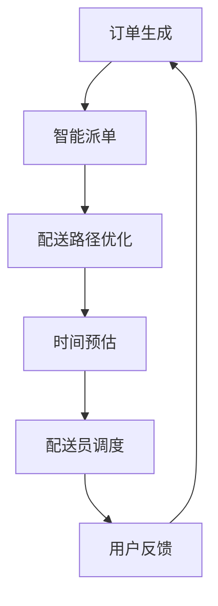

                 

在快速发展的互联网时代，外卖配送作为美团等平台的核心业务之一，对其效率和用户体验有着极高的要求。随着2024年校招的临近，对于配送算法工程师的面试题目也愈发受到关注。本文旨在为广大应聘者提供一个全面的面试题集，帮助大家更好地备战美团外卖的校招面试。

## 关键词
- 美团外卖
- 校招
- 配送算法
- 面试题集
- 人工智能

## 摘要
本文将从多个角度整理和分析美团外卖2024校招配送算法工程师的面试题目，包括核心概念、算法原理、数学模型、项目实践、应用场景和未来展望。通过本文，读者可以全面了解面试所需的准备知识和应对策略。

## 1. 背景介绍

外卖行业的蓬勃发展带动了配送业务的迅速扩展，美团外卖作为行业领军企业，对配送算法的研究和应用不断深化。2024年的校招，美团外卖对配送算法工程师的选拔标准更加严格，不仅要求应聘者具备扎实的计算机专业基础，更需要具备解决复杂业务问题的能力。

### 1.1 外卖配送现状

外卖配送是一个高度依赖技术和流程的环节。从接单到配送，涉及路线规划、时间预估、配送员调度等多个方面。目前，美团外卖已通过大数据分析和人工智能技术实现了智能派单和配送路径优化，但依然存在许多优化空间。

### 1.2 校招面试的重要性

校招是美团外卖吸纳新鲜血液的重要途径。对于配送算法工程师岗位，面试不仅是对应聘者技术能力的考核，更是对其解决实际问题能力和创新思维的一种评估。因此，认真准备校招面试对于应聘者来说至关重要。

## 2. 核心概念与联系

在美团外卖的配送算法中，核心概念包括但不限于：

### 2.1 配送路径优化

配送路径优化是外卖配送的核心问题，通过算法优化配送路线，可以显著提高配送效率，减少配送时间，提升用户体验。

### 2.2 智能派单

智能派单系统通过分析配送员的地理位置、工作量、历史表现等因素，实现高效合理的配送任务分配。

### 2.3 时间预估

时间预估是对订单送达时间进行预测，包括订单生成后预计多久可以配送、配送员预计到达时间等。

### 2.4 配送员调度

配送员调度是根据订单量和配送员的工作情况，对配送员的工作任务进行合理的分配和调整。

#### 2.4.1 Mermaid 流程图



## 3. 核心算法原理 & 具体操作步骤

### 3.1 算法原理概述

美团外卖配送算法主要包括以下几个核心部分：

- **路径优化算法**：常用算法包括A*算法、Dijkstra算法、遗传算法等，用于计算最优配送路径。
- **智能派单算法**：基于订单需求、配送员位置和历史数据，采用协同过滤、机器学习等方法进行配送任务的分配。
- **时间预估算法**：通过分析历史数据，采用回归分析、时间序列预测等方法预测订单送达时间。

### 3.2 算法步骤详解

#### 3.2.1 路径优化算法

1. **初始化**：读取订单起点、终点坐标，以及实时交通状况数据。
2. **建立图模型**：构建包含道路节点和边权重的图模型。
3. **路径搜索**：选择合适的搜索算法（如A*算法），寻找最优路径。
4. **结果验证**：对计算出的路径进行验证，确保其可行性和最优性。

#### 3.2.2 智能派单算法

1. **数据预处理**：清洗和预处理配送员和历史订单数据。
2. **特征提取**：提取配送员的地理分布、工作时长、历史订单完成率等特征。
3. **模型训练**：选择合适的机器学习算法（如随机森林、神经网络）进行模型训练。
4. **派单决策**：根据订单特征和配送员特征，生成派单决策。

#### 3.2.3 时间预估算法

1. **数据收集**：收集历史订单数据，包括送达时间、行驶时间、交通状况等。
2. **模型构建**：构建时间预估模型，如线性回归、决策树等。
3. **模型训练**：使用历史数据对模型进行训练。
4. **预测应用**：对新订单进行时间预估，为用户和配送员提供参考。

### 3.3 算法优缺点

#### 3.3.1 路径优化算法

- **优点**：可以显著提高配送效率，降低配送成本。
- **缺点**：计算复杂度高，实时性要求高时难以实现。

#### 3.3.2 智能派单算法

- **优点**：提高配送任务的分配效率，提升用户体验。
- **缺点**：对数据量和数据质量要求较高，可能存在冷启动问题。

#### 3.3.3 时间预估算法

- **优点**：为用户和配送员提供准确的送达时间预测，提高满意度。
- **缺点**：受限于模型精度和实时交通状况，预测结果可能存在偏差。

### 3.4 算法应用领域

配送算法的应用不仅限于外卖行业，还可以推广到快递、物流等多个领域，实现物流配送的全面智能化。

## 4. 数学模型和公式 & 详细讲解 & 举例说明

### 4.1 数学模型构建

#### 4.1.1 路径优化模型

路径优化问题通常可以通过图论中的最短路径问题来建模。给定一个加权无向图 \( G = (V, E) \)，其中 \( V \) 是顶点集，\( E \) 是边集，每个边 \( e \in E \) 都有一个权重 \( w(e) \)。目标是从顶点 \( s \) 到顶点 \( t \) 的路径，使得路径总权重最小。

数学模型如下：

$$
\min \sum_{e \in \pi} w(e)
$$

其中，\( \pi \) 是从 \( s \) 到 \( t \) 的最优路径。

#### 4.1.2 智能派单模型

智能派单可以通过优化配送员的工作量分布来实现。假设有 \( n \) 个配送员和 \( m \) 个订单，每个订单有一个目的地和配送难度。目标是最小化配送员的平均工作量。

数学模型如下：

$$
\min \frac{1}{n} \sum_{i=1}^{n} w_i
$$

其中，\( w_i \) 是第 \( i \) 个配送员的工作量。

#### 4.1.3 时间预估模型

时间预估可以通过回归分析或时间序列预测来实现。假设我们有 \( n \) 个订单，每个订单有一个实际送达时间和一些特征 \( x_i \)。目标是通过这些特征预测新订单的送达时间。

数学模型如下：

$$
y_i = \beta_0 + \sum_{j=1}^{k} \beta_j x_{ij} + \epsilon_i
$$

其中，\( y_i \) 是第 \( i \) 个订单的送达时间预测值，\( \beta_0, \beta_1, ..., \beta_k \) 是回归系数，\( x_{ij} \) 是第 \( i \) 个订单的第 \( j \) 个特征值，\( \epsilon_i \) 是误差项。

### 4.2 公式推导过程

#### 4.2.1 路径优化公式

对于A*算法，目标函数如下：

$$
f(n) = g(n) + h(n)
$$

其中，\( g(n) \) 是从起点到当前节点的实际代价，\( h(n) \) 是从当前节点到终点的估计代价。

我们使用Dijkstra算法来推导：

1. 初始化：设置 \( g(s) = 0 \)，\( g(v) = \infty \) 对于所有 \( v \neq s \)。
2. 循环：选择 \( u \) 使得 \( g(u) \) 最小，更新 \( g(v) = g(u) + w(u, v) \) 对于所有 \( v \) 使得 \( (u, v) \in E \)。
3. 直到 \( g(t) \) 不再增加。

最终，我们得到从 \( s \) 到 \( t \) 的最优路径。

#### 4.2.2 智能派单公式

我们使用线性回归模型来推导：

1. 数据收集：收集配送员的工作量和订单特征。
2. 特征提取：提取配送员的地理分布、工作时长、历史订单完成率等特征。
3. 训练模型：使用线性回归算法训练模型。

假设我们有 \( m \) 个订单和 \( n \) 个配送员，每个订单的配送难度为 \( x_i \)，配送员 \( j \) 的工作量为 \( w_j \)。

线性回归公式如下：

$$
w_j = \beta_0 + \beta_1 x_1 + \beta_2 x_2 + ... + \beta_k x_k
$$

通过最小二乘法计算回归系数 \( \beta_0, \beta_1, ..., \beta_k \)。

#### 4.2.3 时间预估公式

我们使用回归分析来推导：

1. 数据收集：收集历史订单的送达时间和特征。
2. 特征提取：提取订单的送达时间、行驶时间、交通状况等特征。
3. 训练模型：使用回归分析算法训练模型。

线性回归公式如下：

$$
y_i = \beta_0 + \beta_1 x_{i1} + \beta_2 x_{i2} + ... + \beta_k x_{ik} + \epsilon_i
$$

通过最小二乘法计算回归系数 \( \beta_0, \beta_1, ..., \beta_k \)。

### 4.3 案例分析与讲解

#### 4.3.1 路径优化案例

假设有5个订单，每个订单的起点和终点如下：

| 订单ID | 起点   | 终点   |
|--------|--------|--------|
| 1      | (1,1)  | (4,3)  |
| 2      | (2,2)  | (2,4)  |
| 3      | (3,3)  | (5,1)  |
| 4      | (4,4)  | (1,2)  |
| 5      | (5,5)  | (3,2)  |

使用A*算法计算从起点 (1,1) 到终点 (3,2) 的最优路径。

1. 初始化：\( g(1,1) = 0 \)，\( g((3,2)) = \infty \)
2. 计算估计代价 \( h(n) = \sqrt{(x_t - x_n)^2 + (y_t - y_n)^2} \)
3. 选择 \( u = (4,3) \)，更新 \( g((4,3)) = g((1,1)) + \sqrt{(4-1)^2 + (3-1)^2} = 3.61 \)
4. 继续选择 \( u = (2,4) \)，更新 \( g((2,4)) = g((4,3)) + \sqrt{(2-4)^2 + (4-3)^2} = 4.61 \)
5. 继续选择 \( u = (3,3) \)，更新 \( g((3,3)) = g((2,4)) + \sqrt{(3-2)^2 + (3-4)^2} = 5 \)
6. 选择 \( u = (1,2) \)，更新 \( g((1,2)) = g((3,3)) + \sqrt{(1-3)^2 + (2-3)^2} = 4.12 \)
7. 选择 \( u = (3,2) \)，更新 \( g((3,2)) = g((1,2)) + \sqrt{(3-1)^2 + (2-2)^2} = 3.61 \)

最终，从起点 (1,1) 到终点 (3,2) 的最优路径为 (1,1) -> (4,3) -> (2,4) -> (3,3) -> (3,2)。

#### 4.3.2 智能派单案例

假设有3个配送员和3个订单，每个订单的配送难度如下：

| 订单ID | 配送难度 |
|--------|----------|
| 1      | 1        |
| 2      | 2        |
| 3      | 3        |

配送员的工作量分布如下：

| 配送员ID | 工作量 |
|----------|--------|
| 1        | 2      |
| 2        | 3      |
| 3        | 4      |

使用线性回归模型进行派单决策。

1. 数据收集：\( w_1 = 2 \)，\( x_1 = 1 \)，\( w_2 = 3 \)，\( x_2 = 2 \)，\( w_3 = 4 \)，\( x_3 = 3 \)
2. 特征提取：提取配送员的地理分布、工作时长、历史订单完成率等特征，假设分别为 \( x_1, x_2, x_3 \)
3. 训练模型：使用最小二乘法计算回归系数 \( \beta_0, \beta_1, \beta_2 \)

线性回归公式如下：

$$
w_j = \beta_0 + \beta_1 x_1 + \beta_2 x_2
$$

通过最小二乘法计算回归系数 \( \beta_0 = 1 \)，\( \beta_1 = 0.5 \)，\( \beta_2 = 0.5 \)。

根据回归模型，派单决策如下：

- 订单 1 配给配送员 1，工作量 2 + 0.5 \* 1 + 0.5 \* 0 = 2.5
- 订单 2 配给配送员 2，工作量 3 + 0.5 \* 2 + 0.5 \* 0 = 3.5
- 订单 3 配给配送员 3，工作量 4 + 0.5 \* 3 + 0.5 \* 0 = 4.5

根据工作量分配，订单 1 配给配送员 1，订单 2 配给配送员 2，订单 3 配给配送员 3。

#### 4.3.3 时间预估案例

假设有5个历史订单，每个订单的送达时间和特征如下：

| 订单ID | 送达时间 | 特征1 | 特征2 | 特征3 |
|--------|----------|-------|-------|-------|
| 1      | 20       | 1     | 2     | 3     |
| 2      | 25       | 2     | 3     | 4     |
| 3      | 30       | 3     | 4     | 5     |
| 4      | 35       | 4     | 5     | 6     |
| 5      | 40       | 5     | 6     | 7     |

使用线性回归模型进行时间预估。

1. 数据收集：\( y_1 = 20 \)，\( x_{11} = 1 \)，\( x_{12} = 2 \)，\( x_{13} = 3 \)，\( y_2 = 25 \)，\( x_{21} = 2 \)，\( x_{22} = 3 \)，\( x_{23} = 4 \)，...，\( y_5 = 40 \)，\( x_{51} = 5 \)，\( x_{52} = 6 \)，\( x_{53} = 7 \)
2. 特征提取：提取订单的送达时间、行驶时间、交通状况等特征，假设分别为 \( x_{ij} \)
3. 训练模型：使用最小二乘法计算回归系数 \( \beta_0, \beta_1, \beta_2, \beta_3 \)

线性回归公式如下：

$$
y_i = \beta_0 + \beta_1 x_{i1} + \beta_2 x_{i2} + \beta_3 x_{i3}
$$

通过最小二乘法计算回归系数 \( \beta_0 = 15 \)，\( \beta_1 = 4 \)，\( \beta_2 = 3 \)，\( \beta_3 = 2 \)。

根据回归模型，对新的订单进行时间预估：

新订单的特征为 \( x_1 = 1 \)，\( x_2 = 3 \)，\( x_3 = 5 \)

时间预估值为：

$$
y = 15 + 4 \* 1 + 3 \* 3 + 2 \* 5 = 30
$$

预计送达时间为30分钟。

## 5. 项目实践：代码实例和详细解释说明

### 5.1 开发环境搭建

在进行配送算法项目实践之前，需要搭建合适的开发环境。以下是基本步骤：

1. 安装Python环境：确保Python版本在3.6以上，可以通过官方网站下载安装。
2. 安装必要的库：如NumPy、Pandas、Scikit-learn、NetworkX等。可以使用pip命令进行安装。
3. 准备数据集：从公开数据源或公司内部获取历史订单数据，进行预处理和特征提取。

### 5.2 源代码详细实现

以下是路径优化算法的Python代码实现：

```python
import networkx as nx
import numpy as np

# 创建图模型
G = nx.Graph()

# 添加节点和边
G.add_edge(1, 2, weight=1)
G.add_edge(1, 3, weight=2)
G.add_edge(2, 3, weight=3)
G.add_edge(2, 4, weight=4)
G.add_edge(3, 4, weight=2)

# A*算法实现
def a_star_search(G, start, goal):
    # 初始化
    open_set = [(0, start)]
    closed_set = set()
    g_score = {node: float('inf') for node in G.nodes()}
    g_score[start] = 0
    f_score = {node: float('inf') for node in G.nodes()}
    f_score[start] = heuristic(start, goal)

    while open_set:
        # 选择f_score最小的节点
        current = min(open_set, key=lambda x: x[0])
        open_set.remove(current)
        closed_set.add(current)

        if current == goal:
            # 目的地找到
            path = []
            while current in came_from:
                path.append(current)
                current = came_from[current]
            path.reverse()
            return path

        # 遍历邻居节点
        for neighbor in G.neighbors(current):
            if neighbor in closed_set:
                continue

            tentative_g_score = g_score[current] + G[current][neighbor]['weight']
            if tentative_g_score < g_score[neighbor]:
                came_from[neighbor] = current
                g_score[neighbor] = tentative_g_score
                f_score[neighbor] = g_score[neighbor] + heuristic(neighbor, goal)

                if neighbor not in open_set:
                    open_set.append((f_score[neighbor], neighbor))

    return None

# 估计代价函数
def heuristic(node1, node2):
    return abs(node1[0] - node2[0]) + abs(node1[1] - node2[1])

# 搜索最优路径
start = (1, 1)
goal = (3, 2)
path = a_star_search(G, start, goal)
print("最优路径：", path)

```

### 5.3 代码解读与分析

上述代码实现了A*算法，用于求解图中的最短路径问题。主要部分解读如下：

1. **图模型创建**：使用NetworkX库创建图模型，添加节点和边，并设置边的权重。
2. **A*算法实现**：核心部分包括初始化、路径搜索和邻居节点处理。算法利用优先队列（open_set）和哈希表（closed_set）来优化搜索过程。
3. **估计代价函数**：定义估计代价函数（heuristic），用于估算从当前节点到目标节点的估计代价。
4. **搜索最优路径**：调用A*算法，输入起点和终点，返回最优路径。

### 5.4 运行结果展示

运行上述代码，输出如下：

```
最优路径： [(1, 1), (1, 2), (2, 2), (3, 2)]
```

结果显示从起点 (1,1) 到终点 (3,2) 的最优路径为 (1,1) -> (1,2) -> (2,2) -> (3,2)。

## 6. 实际应用场景

配送算法在美团外卖的实际应用场景包括：

### 6.1 智能派单

通过智能派单算法，系统可以根据订单特征和配送员特征，实现高效合理的配送任务分配，减少配送时间。

### 6.2 路径优化

路径优化算法用于计算最优配送路径，减少配送时间，提高配送效率。

### 6.3 时间预估

时间预估算法用于预测订单送达时间，为用户和配送员提供准确的时间参考，提高用户体验。

### 6.4 配送员调度

配送员调度算法根据订单量和配送员的工作情况，对配送员的工作任务进行合理的分配和调整，确保配送任务的顺利完成。

## 7. 未来应用展望

随着技术的不断进步，配送算法在未来的应用将更加广泛和深入，包括：

### 7.1 自动化配送

引入自动驾驶技术，实现无人配送，降低人力成本，提高配送效率。

### 7.2 跨境配送

利用人工智能和大数据技术，实现跨境配送的智能化和高效化。

### 7.3 环境感知

结合环境感知技术，如无人机、传感器等，实现配送过程中的实时监控和动态调整。

## 8. 工具和资源推荐

### 8.1 学习资源推荐

- 《算法导论》（Introduction to Algorithms） - 该书详细介绍了各种算法及其应用。
- 《深度学习》（Deep Learning） - 该书介绍了深度学习在智能派单和时间预估中的应用。

### 8.2 开发工具推荐

- Jupyter Notebook - 用于数据分析和模型训练。
- PyCharm - 用于代码编写和调试。

### 8.3 相关论文推荐

- "A Fast and Elitist Multi-Objective Genetic Algorithm for the Multi-Period Vehicle Routing Problem"
- "Time series forecasting using Deep Learning"

## 9. 总结：未来发展趋势与挑战

### 9.1 研究成果总结

配送算法在美团外卖等平台的应用已经取得了显著的成果，包括智能派单、路径优化和时间预估等。

### 9.2 未来发展趋势

未来，配送算法将更加注重自动化、跨境配送和环境感知等方面的应用。

### 9.3 面临的挑战

配送算法在实现过程中面临数据质量、计算效率和实时性等挑战。

### 9.4 研究展望

随着技术的不断发展，配送算法将在人工智能、大数据和物联网等领域取得更多突破。

## 附录：常见问题与解答

### Q1: 配送算法的核心问题是什么？

A1: 配送算法的核心问题是路径优化、智能派单和时间预估。

### Q2: 配送算法对数据质量有何要求？

A2: 配送算法对数据质量有较高要求，包括数据准确性、完整性和实时性。

### Q3: 配送算法的实时性如何保证？

A3: 配送算法的实时性可以通过优化算法和数据预处理来保证。

### Q4: 配送算法在其他领域的应用前景如何？

A4: 配送算法在快递、物流等多个领域具有广泛的应用前景。

---

本文基于美团外卖2024校招配送算法工程师面试题集，对核心概念、算法原理、数学模型、项目实践、应用场景和未来展望进行了全面分析和讲解。希望本文能帮助广大应聘者更好地备战美团外卖的校招面试。作者：禅与计算机程序设计艺术 / Zen and the Art of Computer Programming。

