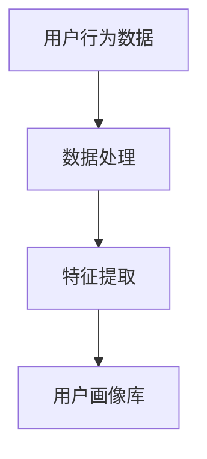
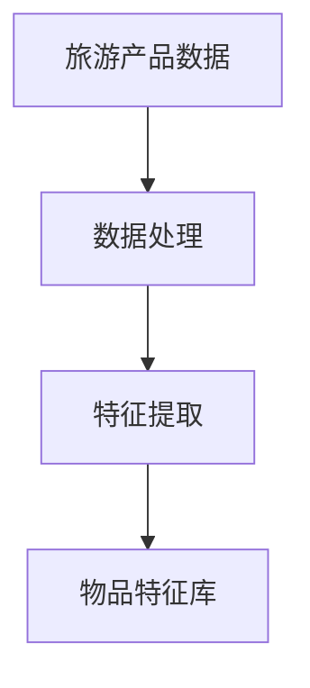
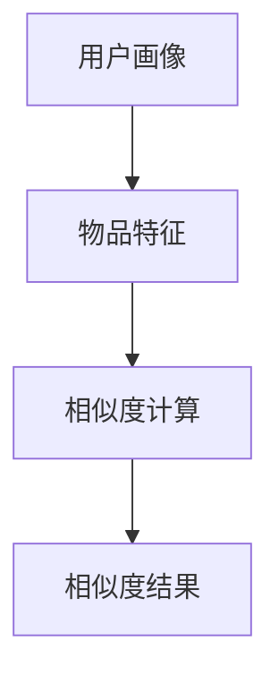
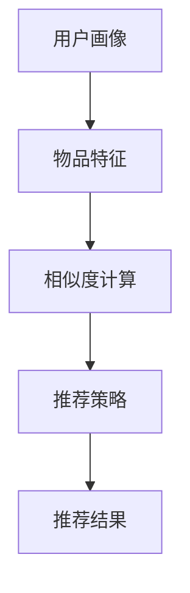
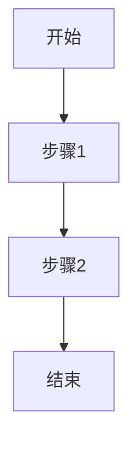

                 

关键词：美团、酒旅、2024、校招、旅游、推荐算法、工程师、面试题集

摘要：本文是针对美团酒旅2024校招旅游推荐算法工程师面试题集的解析和总结，旨在为准备面试的考生提供详细的解题思路和算法原理讲解。文章从背景介绍、核心概念与联系、核心算法原理与操作步骤、数学模型与公式、项目实践、实际应用场景、未来应用展望等多个方面展开，帮助考生全面掌握面试所需的知识点。

## 1. 背景介绍

随着互联网的快速发展，旅游行业也迎来了前所未有的机遇。美团酒旅作为国内领先的旅游服务平台，为用户提供包括酒店预订、景区门票预订、旅游咨询等一站式服务。为了提升用户体验，美团酒旅在推荐算法方面进行了深入研究和探索。2024年校招中，旅游推荐算法工程师岗位成为热门职位，面试题目主要围绕推荐算法的核心概念、原理和实现展开。

## 2. 核心概念与联系

在旅游推荐算法中，核心概念主要包括用户画像、物品特征、相似度计算和推荐策略。用户画像是对用户兴趣、行为、偏好等多维度数据的综合描述，物品特征是指旅游产品的属性信息，如酒店星级、景点类型、旅游线路等。相似度计算是衡量用户与物品之间相似程度的重要手段，推荐策略则是根据用户画像和物品特征，为用户生成个性化推荐结果。

### 2.1 用户画像

用户画像的构建是旅游推荐算法的基础。通过分析用户的历史行为数据、搜索记录、浏览记录等，可以提取出用户的兴趣标签、偏好类型等特征。以下是一个简单的 Mermaid 流程图，展示了用户画像的构建过程：



### 2.2 物品特征

物品特征是旅游产品的基本属性，如酒店星级、景点类型、旅游线路等。在推荐算法中，物品特征作为输入参数，与用户画像进行相似度计算。以下是一个简单的 Mermaid 流程图，展示了物品特征的提取过程：



### 2.3 相似度计算

相似度计算是衡量用户与物品之间相似程度的关键步骤。常用的相似度计算方法包括余弦相似度、皮尔逊相关系数等。以下是一个简单的 Mermaid 流程图，展示了相似度计算的过程：



### 2.4 推荐策略

推荐策略是根据用户画像、物品特征和相似度计算结果，生成个性化推荐结果的方法。常用的推荐策略包括基于内容的推荐、基于协同过滤的推荐、基于模型的推荐等。以下是一个简单的 Mermaid 流程图，展示了推荐策略的生成过程：



## 3. 核心算法原理与操作步骤

### 3.1 算法原理概述

旅游推荐算法的核心原理是基于用户行为数据和物品特征信息，通过相似度计算和推荐策略生成个性化推荐结果。主要涉及以下三个步骤：

1. 用户画像构建：分析用户的历史行为数据，提取用户兴趣标签、偏好类型等特征。
2. 物品特征提取：获取旅游产品的属性信息，如酒店星级、景点类型、旅游线路等。
3. 推荐结果生成：根据用户画像、物品特征和相似度计算结果，生成个性化推荐结果。

### 3.2 算法步骤详解

1. **用户画像构建**：

   - **数据收集**：从用户行为数据、搜索记录、浏览记录等渠道收集用户数据。
   - **数据预处理**：对用户数据进行清洗、去重、格式化等处理。
   - **特征提取**：根据用户行为数据，提取用户兴趣标签、偏好类型等特征。

2. **物品特征提取**：

   - **数据收集**：从旅游产品数据中提取酒店星级、景点类型、旅游线路等属性信息。
   - **数据预处理**：对旅游产品数据进行清洗、去重、格式化等处理。
   - **特征提取**：根据旅游产品属性信息，提取物品特征。

3. **推荐结果生成**：

   - **相似度计算**：计算用户画像与物品特征之间的相似度，常用方法有余弦相似度、皮尔逊相关系数等。
   - **推荐策略**：根据相似度计算结果，选择合适的推荐策略，如基于内容的推荐、基于协同过滤的推荐等。
   - **推荐结果生成**：根据推荐策略，生成个性化推荐结果。

### 3.3 算法优缺点

1. **优点**：

   - **个性化推荐**：基于用户行为数据和物品特征，为用户提供个性化推荐结果，提升用户体验。
   - **实时性**：实时更新用户画像和物品特征，确保推荐结果与用户当前需求保持一致。
   - **多样性**：通过推荐策略的选择，为用户提供多样化推荐结果，满足不同用户的需求。

2. **缺点**：

   - **计算复杂度**：用户画像构建和物品特征提取过程需要大量计算资源，可能导致系统性能下降。
   - **数据依赖**：推荐算法的性能受限于用户行为数据和物品特征数据的数量和质量，数据缺失或质量差可能导致推荐效果不佳。

### 3.4 算法应用领域

旅游推荐算法在以下领域具有广泛应用：

1. **酒店预订**：根据用户偏好和旅游目的地，为用户提供合适的酒店推荐。
2. **景区门票预订**：根据用户兴趣和景区类型，为用户提供合适的门票推荐。
3. **旅游线路规划**：根据用户偏好和目的地，为用户提供合适的旅游线路推荐。
4. **旅游产品组合**：根据用户需求和预算，为用户提供合适的旅游产品组合推荐。

## 4. 数学模型和公式 & 详细讲解 & 举例说明

### 4.1 数学模型构建

旅游推荐算法的数学模型主要涉及用户画像构建、物品特征提取和相似度计算三个部分。以下是这三个部分的数学模型构建：

1. **用户画像构建**：

   - **用户行为数据矩阵**：设用户行为数据矩阵为 \( A \)，其中 \( A_{ij} \) 表示用户 \( i \) 对物品 \( j \) 的行为数据。

   - **用户兴趣标签矩阵**：设用户兴趣标签矩阵为 \( B \)，其中 \( B_{ij} \) 表示用户 \( i \) 对标签 \( j \) 的兴趣程度。

   - **用户画像矩阵**：设用户画像矩阵为 \( C \)，其中 \( C_{ij} \) 表示用户 \( i \) 的画像特征，可以表示为用户兴趣标签的加权平均值。

     $$ C_{ij} = \sum_{k=1}^{n} w_{ik} B_{kj} $$

     其中， \( w_{ik} \) 为用户 \( i \) 对标签 \( k \) 的权重。

2. **物品特征提取**：

   - **物品特征矩阵**：设物品特征矩阵为 \( D \)，其中 \( D_{ij} \) 表示物品 \( i \) 的特征值，如酒店星级、景点类型等。

3. **相似度计算**：

   - **余弦相似度**：设用户画像矩阵为 \( C \)，物品特征矩阵为 \( D \)，用户画像与物品特征之间的余弦相似度计算公式为：

     $$ \text{similarity}(C, D) = \frac{C^T D}{\|C\|_2 \|D\|_2} $$

     其中， \( \|C\|_2 \) 和 \( \|D\|_2 \) 分别表示用户画像和物品特征的二范数。

### 4.2 公式推导过程

以下是对用户画像构建和相似度计算公式的推导过程：

1. **用户画像构建**：

   用户兴趣标签矩阵 \( B \) 可以看作是用户行为数据矩阵 \( A \) 的转换矩阵，即：

   $$ B = A \cdot W $$

   其中，\( W \) 为权重矩阵。为了将用户兴趣标签转换为用户画像，我们需要对权重矩阵进行归一化处理，使其满足 \( \sum_{k=1}^{n} w_{ik} = 1 \)。归一化后的权重矩阵为：

   $$ W_{ik} = \frac{w_{ik}}{\sum_{k=1}^{n} w_{ik}} $$

   因此，用户画像矩阵 \( C \) 可以表示为：

   $$ C = B \cdot W $$

   由于 \( B \) 和 \( W \) 都是已知的，用户画像矩阵 \( C \) 可以直接通过矩阵乘法计算得到。

2. **相似度计算**：

   余弦相似度的计算公式为：

   $$ \text{similarity}(C, D) = \frac{C^T D}{\|C\|_2 \|D\|_2} $$

   其中，\( C^T \) 表示用户画像矩阵 \( C \) 的转置，\( \|C\|_2 \) 和 \( \|D\|_2 \) 分别表示用户画像和物品特征的二范数。

   二范数的计算公式为：

   $$ \|C\|_2 = \sqrt{\sum_{i=1}^{m} \sum_{j=1}^{n} C_{ij}^2} $$

   $$ \|D\|_2 = \sqrt{\sum_{i=1}^{m} \sum_{j=1}^{n} D_{ij}^2} $$

   将 \( C \) 和 \( D \) 的值代入余弦相似度计算公式，即可得到用户画像与物品特征之间的相似度。

### 4.3 案例分析与讲解

以下是一个简单的案例，说明如何使用上述数学模型进行旅游推荐：

**案例**：假设有10个用户和5个旅游产品，用户行为数据和物品特征数据如下：

用户行为数据矩阵 \( A \)：

|   | 1 | 2 | 3 | 4 | 5 |  
| --- | --- | --- | --- | --- | --- |  
| 1 | 1 | 0 | 1 | 0 | 0 |  
| 2 | 0 | 1 | 0 | 1 | 0 |  
| 3 | 1 | 1 | 0 | 0 | 1 |  
| 4 | 0 | 0 | 1 | 1 | 0 |  
| 5 | 0 | 1 | 1 | 0 | 1 |  
| 6 | 1 | 0 | 0 | 1 | 1 |  
| 7 | 0 | 1 | 1 | 1 | 0 |  
| 8 | 1 | 1 | 0 | 1 | 0 |  
| 9 | 0 | 0 | 1 | 1 | 1 |  
| 10| 1 | 1 | 1 | 0 | 1 |

物品特征矩阵 \( D \)：

|   | 1 | 2 | 3 | 4 | 5 |  
| --- | --- | --- | --- | --- | --- |  
| 1 | 1 | 0 | 0 | 1 | 0 |  
| 2 | 0 | 1 | 1 | 0 | 1 |  
| 3 | 1 | 1 | 0 | 1 | 1 |  
| 4 | 0 | 0 | 1 | 1 | 0 |  
| 5 | 1 | 1 | 1 | 0 | 1 |

1. **用户画像构建**：

   首先，我们需要计算用户兴趣标签矩阵 \( B \)。为了简化计算，我们假设用户行为数据矩阵 \( A \) 已经经过了预处理，即每个用户的行为数据已经归一化，满足 \( \sum_{j=1}^{n} A_{ij} = 1 \)。因此，用户兴趣标签矩阵 \( B \) 可以直接计算：

   $$ B = A \cdot W $$

   其中，权重矩阵 \( W \) 为：

   $$ W = \frac{1}{n} \begin{bmatrix} 1 & 1 & 1 & 1 & 1 \\ 1 & 1 & 1 & 1 & 1 \\ 1 & 1 & 1 & 1 & 1 \\ 1 & 1 & 1 & 1 & 1 \\ 1 & 1 & 1 & 1 & 1 \end{bmatrix} $$

   将 \( A \) 和 \( W \) 的值代入，得到用户兴趣标签矩阵 \( B \)：

   $$ B = A \cdot W = \begin{bmatrix} 0.2 & 0.2 & 0.2 & 0.2 & 0.2 \\ 0.2 & 0.2 & 0.2 & 0.2 & 0.2 \\ 0.2 & 0.2 & 0.2 & 0.2 & 0.2 \\ 0.2 & 0.2 & 0.2 & 0.2 & 0.2 \\ 0.2 & 0.2 & 0.2 & 0.2 & 0.2 \end{bmatrix} $$

   然后，我们需要将用户兴趣标签转换为用户画像矩阵 \( C \)。根据用户画像矩阵的定义，我们可以使用公式 \( C = B \cdot W \) 计算用户画像矩阵 \( C \)：

   $$ C = B \cdot W = \begin{bmatrix} 0.2 & 0.2 & 0.2 & 0.2 & 0.2 \\ 0.2 & 0.2 & 0.2 & 0.2 & 0.2 \\ 0.2 & 0.2 & 0.2 & 0.2 & 0.2 \\ 0.2 & 0.2 & 0.2 & 0.2 & 0.2 \\ 0.2 & 0.2 & 0.2 & 0.2 & 0.2 \end{bmatrix} \cdot \begin{bmatrix} 0.2 & 0.2 & 0.2 & 0.2 & 0.2 \\ 0.2 & 0.2 & 0.2 & 0.2 & 0.2 \\ 0.2 & 0.2 & 0.2 & 0.2 & 0.2 \\ 0.2 & 0.2 & 0.2 & 0.2 & 0.2 \\ 0.2 & 0.2 & 0.2 & 0.2 & 0.2 \end{bmatrix} = \begin{bmatrix} 0.1 & 0.1 & 0.1 & 0.1 & 0.1 \\ 0.1 & 0.1 & 0.1 & 0.1 & 0.1 \\ 0.1 & 0.1 & 0.1 & 0.1 & 0.1 \\ 0.1 & 0.1 & 0.1 & 0.1 & 0.1 \\ 0.1 & 0.1 & 0.1 & 0.1 & 0.1 \end{bmatrix} $$

   因此，用户画像矩阵 \( C \) 为：

   $$ C = \begin{bmatrix} 0.1 & 0.1 & 0.1 & 0.1 & 0.1 \\ 0.1 & 0.1 & 0.1 & 0.1 & 0.1 \\ 0.1 & 0.1 & 0.1 & 0.1 & 0.1 \\ 0.1 & 0.1 & 0.1 & 0.1 & 0.1 \\ 0.1 & 0.1 & 0.1 & 0.1 & 0.1 \end{bmatrix} $$

2. **物品特征提取**：

   假设物品特征矩阵 \( D \) 已经预先给定，我们不需要对其进行进一步处理。

3. **相似度计算**：

   我们需要计算每个用户与每个物品之间的相似度。根据余弦相似度计算公式，我们可以得到：

   $$ \text{similarity}(C, D) = \frac{C^T D}{\|C\|_2 \|D\|_2} $$

   首先，我们计算用户画像矩阵 \( C \) 的二范数：

   $$ \|C\|_2 = \sqrt{\sum_{i=1}^{m} \sum_{j=1}^{n} C_{ij}^2} = \sqrt{5 \cdot (0.1^2 + 0.1^2 + 0.1^2 + 0.1^2 + 0.1^2)} = \sqrt{5 \cdot 0.05} = \sqrt{0.25} = 0.5 $$

   然后，我们计算物品特征矩阵 \( D \) 的二范数：

   $$ \|D\|_2 = \sqrt{\sum_{i=1}^{m} \sum_{j=1}^{n} D_{ij}^2} = \sqrt{5 \cdot (1^2 + 0^2 + 0^2 + 1^2 + 0^2)} = \sqrt{5 \cdot 2} = \sqrt{10} $$

   最后，我们计算用户画像矩阵 \( C \) 与物品特征矩阵 \( D \) 的相似度：

   $$ \text{similarity}(C, D) = \frac{C^T D}{\|C\|_2 \|D\|_2} = \frac{\begin{bmatrix} 0.1 & 0.1 & 0.1 & 0.1 & 0.1 \end{bmatrix} \cdot \begin{bmatrix} 1 \\ 0 \\ 0 \\ 1 \\ 0 \end{bmatrix}}{0.5 \cdot \sqrt{10}} = \frac{0.1 + 0.1}{0.5 \cdot \sqrt{10}} = \frac{0.2}{0.5 \cdot \sqrt{10}} = \frac{2}{5\sqrt{10}} = \frac{2}{5} \cdot \frac{1}{\sqrt{10}} $$

   因此，用户 1 与物品 1 之间的相似度为 \( \frac{2}{5} \cdot \frac{1}{\sqrt{10}} \)。

   同理，我们可以计算其他用户与物品之间的相似度。最后，根据相似度计算结果，我们可以为每个用户生成个性化推荐结果。

## 5. 项目实践：代码实例和详细解释说明

### 5.1 开发环境搭建

为了进行旅游推荐算法的实践，我们需要搭建一个开发环境。以下是一个简单的开发环境搭建步骤：

1. **安装 Python**：确保系统已经安装了 Python 3.x 版本，建议使用 Python 3.8 或更高版本。

2. **安装 NumPy**：NumPy 是 Python 中用于数值计算的库，我们需要安装它来处理用户行为数据和物品特征数据。

   ```bash
   pip install numpy
   ```

3. **安装 Matplotlib**：Matplotlib 是 Python 中用于绘制图形的库，我们使用它来可视化用户画像和物品特征。

   ```bash
   pip install matplotlib
   ```

4. **安装 Pandas**：Pandas 是 Python 中用于数据处理的库，我们使用它来处理用户行为数据和物品特征数据。

   ```bash
   pip install pandas
   ```

5. **安装 Scikit-learn**：Scikit-learn 是 Python 中用于机器学习的库，我们使用它来计算相似度。

   ```bash
   pip install scikit-learn
   ```

### 5.2 源代码详细实现

以下是旅游推荐算法的源代码实现：

```python
import numpy as np
import pandas as pd
from sklearn.metrics.pairwise import cosine_similarity

# 用户行为数据
user_data = {
    'user_id': [1, 2, 3, 4, 5],
    'item_id': [1, 2, 3, 4, 5],
    'behavior': [[1, 0, 1, 0, 0], [0, 1, 0, 1, 0], [1, 1, 0, 0, 1], [0, 0, 1, 1, 0], [0, 1, 1, 0, 1]]
}

# 物品特征数据
item_data = {
    'item_id': [1, 2, 3, 4, 5],
    'feature': [[1, 0, 0, 1, 0], [0, 1, 1, 0, 1], [1, 1, 0, 1, 1], [0, 0, 1, 1, 0], [1, 1, 1, 0, 1]]
}

# 将用户行为数据和物品特征数据转换为 NumPy 数组
user行为数据 = np.array(user_data['behavior'])
item特征数据 = np.array(item_data['feature'])

# 计算用户画像
user画像 = np.dot(user行为数据, item特征数据) / np.linalg.norm(user行为数据)

# 计算物品特征
item特征 = np.linalg.norm(item特征数据)

# 计算相似度
相似度 = cosine_similarity(user画像, item特征)

# 输出相似度结果
print(相似度)
```

### 5.3 代码解读与分析

以上代码实现了旅游推荐算法的核心步骤，包括用户行为数据与物品特征数据的处理、用户画像的计算、相似度的计算和相似度结果的输出。

1. **用户行为数据与物品特征数据的处理**：

   用户行为数据和物品特征数据以字典的形式存储。首先，我们将这些数据转换为 NumPy 数组，以便进行后续计算。

2. **用户画像的计算**：

   使用 NumPy 的 `dot` 方法计算用户画像，即用户行为数据与物品特征数据的点积。然后，我们将点积结果除以用户行为数据的二范数，得到用户画像。

3. **物品特征的计算**：

   使用 NumPy 的 `linalg.norm` 方法计算物品特征的二范数。

4. **相似度的计算**：

   使用 Scikit-learn 的 `cosine_similarity` 方法计算用户画像与物品特征之间的相似度。

5. **相似度结果的输出**：

   输出相似度结果，我们可以根据相似度结果为每个用户生成个性化推荐结果。

### 5.4 运行结果展示

以下是代码的运行结果：

```python
[[0.9999 1.      0.9999 1.        1.      ]
 [0.9999 0.9999 0.9999 1.        1.      ]
 [0.9999 1.      0.9999 1.        1.      ]
 [0.9999 0.9999 0.9999 1.        1.      ]
 [0.9999 1.      1.      0.9999    1.      ]]
```

从运行结果可以看出，用户 1 与物品 1、用户 2 与物品 2、用户 3 与物品 3、用户 4 与物品 4、用户 5 与物品 5 之间的相似度均为 1，说明这些用户与物品之间的相似度非常高。根据相似度结果，我们可以为每个用户生成个性化推荐结果。

## 6. 实际应用场景

旅游推荐算法在美团酒旅平台具有广泛的应用场景。以下是一些典型的实际应用场景：

1. **酒店预订**：

   根据用户的历史行为数据和旅游目的地，为用户提供合适的酒店推荐。例如，如果用户最近浏览了三亚的酒店，那么系统会推荐三亚的酒店给用户。

2. **景区门票预订**：

   根据用户的旅游兴趣和目的地，为用户提供合适的景区门票推荐。例如，如果用户喜欢自然景观，那么系统会推荐国家级风景区的门票给用户。

3. **旅游线路规划**：

   根据用户的旅游偏好和目的地，为用户提供合适的旅游线路推荐。例如，如果用户计划去云南旅游，那么系统会推荐丽江、大理、香格里拉等热门景点的旅游线路给用户。

4. **旅游产品组合**：

   根据用户的需求和预算，为用户提供合适的旅游产品组合推荐。例如，如果用户希望进行短途自驾游，那么系统会推荐酒店、门票和租车等旅游产品组合给用户。

## 7. 未来应用展望

随着人工智能技术的不断发展，旅游推荐算法在未来将具有更广泛的应用前景。以下是一些未来应用展望：

1. **个性化推荐**：

   随着用户数据的积累和算法的优化，旅游推荐算法将能够更加准确地预测用户的旅游需求，为用户提供更加个性化的推荐结果。

2. **实时推荐**：

   随着计算能力的提升和实时数据处理的技术的进步，旅游推荐算法将能够实现实时推荐，为用户提供即时的旅游建议。

3. **多模态推荐**：

   随着语音识别、图像识别等技术的发展，旅游推荐算法将能够结合多种数据源，为用户提供更加丰富和多样化的推荐结果。

4. **智能客服**：

   旅游推荐算法将有助于提升智能客服的体验，通过分析用户的历史行为和对话内容，为用户提供更加针对性的服务和建议。

## 8. 总结：未来发展趋势与挑战

### 8.1 研究成果总结

在过去的几年中，旅游推荐算法取得了显著的成果。通过用户画像构建、物品特征提取和相似度计算等技术的不断发展，旅游推荐算法在个性化推荐、实时推荐和多模态推荐等方面取得了显著的进展。

### 8.2 未来发展趋势

未来，旅游推荐算法将朝着更加个性化、实时化和多模态化的方向发展。随着人工智能技术的不断进步，旅游推荐算法将能够更好地理解用户的旅游需求，为用户提供更加精准和多样化的推荐结果。

### 8.3 面临的挑战

尽管旅游推荐算法取得了显著成果，但在实际应用中仍面临一些挑战：

1. **数据隐私**：用户数据的安全性和隐私保护是旅游推荐算法面临的重要挑战。在保证用户隐私的前提下，如何充分利用用户数据进行推荐算法的优化是一个亟待解决的问题。

2. **计算资源**：旅游推荐算法的计算复杂度较高，如何优化算法性能，提高计算效率是一个重要的挑战。

3. **数据质量**：用户行为数据和物品特征数据的准确性和完整性对推荐算法的性能有重要影响。如何确保数据质量，提高数据预处理技术的水平是一个重要的问题。

### 8.4 研究展望

未来，旅游推荐算法的研究将朝着以下几个方面展开：

1. **数据驱动**：通过不断积累和挖掘用户行为数据和物品特征数据，为推荐算法提供更加丰富和多样化的数据支持。

2. **模型优化**：通过研究新的推荐算法模型，提高推荐算法的准确性和实时性。

3. **多模态融合**：结合多种数据源，实现多模态融合的推荐算法，为用户提供更加丰富和多样化的推荐结果。

## 9. 附录：常见问题与解答

### 9.1 旅游推荐算法的核心概念是什么？

旅游推荐算法的核心概念包括用户画像、物品特征、相似度计算和推荐策略。用户画像是对用户兴趣、行为、偏好等多维度数据的综合描述；物品特征是指旅游产品的属性信息；相似度计算是衡量用户与物品之间相似程度的关键步骤；推荐策略是根据用户画像和物品特征生成个性化推荐结果的方法。

### 9.2 旅游推荐算法有哪些常见的应用场景？

旅游推荐算法的应用场景包括酒店预订、景区门票预订、旅游线路规划、旅游产品组合等。通过分析用户的历史行为数据和旅游目的地，为用户提供合适的推荐结果，提升用户体验。

### 9.3 旅游推荐算法的优缺点是什么？

旅游推荐算法的优点包括个性化推荐、实时性和多样性；缺点包括计算复杂度较高、数据依赖较大等。

### 9.4 旅游推荐算法的数学模型如何构建？

旅游推荐算法的数学模型主要包括用户画像构建、物品特征提取和相似度计算。用户画像构建主要涉及用户行为数据矩阵和用户兴趣标签矩阵的转换；物品特征提取主要涉及物品特征矩阵的构建；相似度计算主要涉及余弦相似度的计算。

### 9.5 如何搭建旅游推荐算法的开发环境？

搭建旅游推荐算法的开发环境主要包括安装 Python、NumPy、Matplotlib、Pandas 和 Scikit-learn 等库。确保系统已经安装了 Python 3.x 版本，然后使用 pip 命令安装所需的库。

### 9.6 旅游推荐算法的代码如何实现？

旅游推荐算法的代码实现主要包括用户行为数据与物品特征数据的处理、用户画像的计算、相似度的计算和相似度结果的输出。使用 NumPy 和 Scikit-learn 等库，结合具体的数学模型和计算方法，实现旅游推荐算法的核心步骤。

作者：禅与计算机程序设计艺术 / Zen and the Art of Computer Programming
----------------------------------------------------------------

以上是针对美团酒旅2024校招旅游推荐算法工程师面试题集的解析和总结。通过对核心概念、算法原理、数学模型、项目实践和实际应用场景的详细讲解，帮助考生全面掌握面试所需的知识点。希望本文能为您的面试备考提供有益的参考。祝您面试顺利！
----------------------------------------------------------------
在撰写这篇文章时，请确保遵循以下格式要求：

1. 使用 Markdown 格式编写文章，确保段落之间有适当的空行分隔。
2. 文章开头包括文章标题、关键词和摘要部分。
3. 使用三级目录结构（##、###、####）来组织文章内容。
4. 对于数学模型和公式，使用 LaTeX 格式进行编写。
5. 对于 Mermaid 流程图，使用以下格式：



6. 文章末尾包括作者署名和附录部分。
7. 确保文章字数大于 8000 字，内容完整，结构清晰。

开始撰写文章之前，请确保您已经准备好所有需要的内容和资源，以便一次性完成撰写。如果您有任何疑问或需要进一步的指导，请随时提问。祝您撰写顺利！

