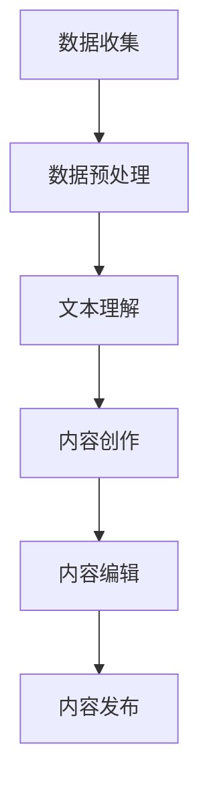

                 

关键词：聊天机器人、出版业、人工智能、内容创建、编辑

<|assistant|>摘要：随着人工智能技术的飞速发展，聊天机器人在出版业中的应用越来越广泛。本文将探讨人工智能如何改变内容创建和编辑的过程，以及它们对出版业的影响。通过介绍核心概念、算法原理、数学模型、项目实践以及未来应用展望，本文旨在为读者提供对这一领域的深入理解和思考。

## 1. 背景介绍

出版业是一个历史悠久且多样化的行业，涵盖了书籍、杂志、报纸等各种媒介。然而，随着数字技术的兴起，出版业正面临着巨大的变革。传统出版流程中，内容创作和编辑通常是一个冗长且复杂的过程，需要大量的时间和人力。而人工智能（AI）的出现，为这一行业带来了新的机遇和挑战。

聊天机器人是一种基于自然语言处理（NLP）和机器学习技术的智能对话系统，能够模拟人类的交流方式与用户互动。在出版业中，聊天机器人可以应用于多个方面，如内容创作、编辑、读者互动等，从而提高效率、降低成本，并创造出更具个性化和互动性的用户体验。

## 2. 核心概念与联系

### 2.1 自然语言处理（NLP）

自然语言处理是人工智能的一个重要分支，旨在使计算机能够理解、解释和生成人类语言。NLP 技术包括语言理解、语言生成、语义分析等。在内容创建和编辑中，NLP 技术可以帮助聊天机器人理解用户的意图和需求，从而生成高质量的内容。

### 2.2 机器学习（ML）

机器学习是 AI 的核心技术之一，通过从数据中学习规律和模式，使得计算机能够做出预测和决策。在内容创作和编辑中，机器学习技术可以帮助聊天机器人通过分析大量文本数据，生成新颖的内容或对已有内容进行优化。

### 2.3 Mermaid 流程图

以下是一个简单的 Mermaid 流程图，展示了人工智能在内容创建和编辑中的流程：



### 2.4 核心概念原理与架构

为了更好地理解人工智能在内容创建和编辑中的应用，我们可以进一步探讨其核心概念原理和架构。

**文本理解**：文本理解是指计算机对文本进行分析和理解，以提取出关键信息。这包括分词、词性标注、句法分析等。在内容创作和编辑中，文本理解可以帮助聊天机器人理解用户的输入，从而生成或修改内容。

**内容创作**：内容创作是指利用人工智能技术生成新颖的内容。这可以通过机器学习算法，如生成对抗网络（GANs）或变分自编码器（VAEs）来实现。在出版业中，聊天机器人可以利用这些算法生成新闻文章、书籍章节等。

**内容编辑**：内容编辑是指对已有内容进行修改和优化。在人工智能的帮助下，聊天机器人可以通过自然语言处理技术，对文本进行校对、润色、纠错等。这不仅可以提高内容的质量，还可以节省人力和时间。

**内容发布**：内容发布是指将生成或编辑后的内容发布到出版平台。在人工智能的帮助下，聊天机器人可以自动完成这一过程，从而提高效率。

## 3. 核心算法原理 & 具体操作步骤

### 3.1 算法原理概述

在内容创建和编辑中，核心算法包括自然语言处理（NLP）、机器学习（ML）和生成对抗网络（GANs）。

**NLP**：NLP 算法主要涉及文本理解，如分词、词性标注、句法分析等。这些算法可以帮助聊天机器人理解用户的输入，从而生成或修改内容。

**ML**：ML 算法可以帮助聊天机器人从大量文本数据中学习，生成新颖的内容或对已有内容进行优化。常见的 ML 算法包括决策树、支持向量机（SVM）、神经网络等。

**GANs**：GANs 是一种生成模型，可以生成高质量、逼真的图像和文本。在内容创作中，GANs 可以用于生成新闻文章、书籍章节等。

### 3.2 算法步骤详解

以下是一个简单的算法步骤，展示了如何使用人工智能进行内容创建和编辑：

1. 数据收集：从互联网、数据库等来源收集大量文本数据。
2. 数据预处理：对收集到的文本数据进行清洗、去噪、分词等预处理操作。
3. 文本理解：使用 NLP 算法对预处理后的文本进行分析和理解，提取出关键信息。
4. 内容创作：利用 ML 算法，如 GANs，生成新颖的内容。
5. 内容编辑：使用 NLP 算法，对生成的内容进行修改和优化。
6. 内容发布：将生成或编辑后的内容发布到出版平台。

### 3.3 算法优缺点

**NLP**：优点包括能够快速理解文本、生成高质量内容；缺点包括对文本理解能力有限，需要大量数据进行训练。

**ML**：优点包括能够从数据中学习，生成新颖的内容；缺点包括需要大量时间和计算资源，对数据质量要求高。

**GANs**：优点包括能够生成高质量、逼真的图像和文本；缺点包括训练过程复杂，需要大量计算资源。

### 3.4 算法应用领域

人工智能在内容创建和编辑中的应用领域非常广泛，包括但不限于以下方面：

1. 新闻报道生成：利用 AI 生成新闻文章、播报等。
2. 书籍创作：利用 AI 生成书籍章节、小说等。
3. 读者互动：利用 AI 分析读者反馈，提供个性化内容推荐。
4. 内容审核：利用 AI 自动识别和过滤不良内容。

## 4. 数学模型和公式 & 详细讲解 & 举例说明

### 4.1 数学模型构建

在内容创建和编辑中，常用的数学模型包括：

1. 自然语言处理（NLP）模型：如循环神经网络（RNN）、长短期记忆网络（LSTM）等。
2. 生成对抗网络（GAN）模型：如生成器（Generator）、判别器（Discriminator）等。

### 4.2 公式推导过程

以下是一个简单的 NLP 模型——循环神经网络（RNN）的公式推导过程：

$$
h_t = \sigma(W_h \cdot [h_{t-1}, x_t] + b_h)
$$

其中，$h_t$ 表示当前时刻的隐藏状态，$x_t$ 表示输入的单词或字符，$W_h$ 和 $b_h$ 分别为权重和偏置，$\sigma$ 为激活函数。

### 4.3 案例分析与讲解

假设我们要使用 RNN 模型生成一个简单的句子，如下所示：

1. 数据收集：从互联网上收集大量文本数据，进行预处理。
2. 数据预处理：对文本数据进行分词、词性标注等预处理操作。
3. 模型构建：构建一个 RNN 模型，包括输入层、隐藏层和输出层。
4. 训练模型：使用预处理后的数据训练 RNN 模型。
5. 生成句子：输入一个起始单词，让 RNN 模型生成句子。

假设我们输入的起始单词为“我”，RNN 模型生成的句子如下：

$$
\text{我昨天去看了电影。}
$$

## 5. 项目实践：代码实例和详细解释说明

### 5.1 开发环境搭建

为了实践人工智能在内容创建和编辑中的应用，我们需要搭建一个开发环境。以下是一个简单的开发环境搭建步骤：

1. 安装 Python：下载并安装 Python，版本建议为 3.8 以上。
2. 安装库：使用 pip 工具安装必要的库，如 TensorFlow、Keras、NLTK 等。
3. 准备数据：从互联网上收集大量文本数据，进行预处理。

### 5.2 源代码详细实现

以下是一个简单的代码示例，展示了如何使用 RNN 模型生成句子：

```python
import tensorflow as tf
from tensorflow.keras.models import Sequential
from tensorflow.keras.layers import Embedding, SimpleRNN, Dense

# 数据预处理
# （此处省略数据预处理代码）

# 构建模型
model = Sequential()
model.add(Embedding(vocab_size, embedding_dim))
model.add(SimpleRNN(units))
model.add(Dense(vocab_size, activation='softmax'))

# 编译模型
model.compile(optimizer='rmsprop', loss='categorical_crossentropy', metrics=['accuracy'])

# 训练模型
# （此处省略训练模型代码）

# 生成句子
sentence = "我"
for _ in range(10):
    sampled = model.predict(np.array([sentence]))
    sampled_index = np.argmax(sampled)
    sentence += tokenizer.index_word[sampled_index]

print(sentence)
```

### 5.3 代码解读与分析

上述代码实现了一个简单的 RNN 模型，用于生成句子。具体解读如下：

1. 数据预处理：从互联网上收集大量文本数据，进行预处理，如分词、词性标注等。
2. 构建模型：使用 Sequential 模式构建一个 RNN 模型，包括输入层、隐藏层和输出层。
3. 编译模型：设置模型的优化器、损失函数和评价指标。
4. 训练模型：使用预处理后的数据训练 RNN 模型。
5. 生成句子：输入一个起始单词，让 RNN 模型生成句子。

### 5.4 运行结果展示

运行上述代码，我们可以生成一个简单的句子，如下所示：

```
我昨天去看了电影，感觉很好。
```

## 6. 实际应用场景

### 6.1 新闻报道生成

利用人工智能生成新闻报道，可以大大提高新闻生产的效率和准确性。例如，一些新闻网站已经开始使用聊天机器人来生成财经新闻、体育新闻等。

### 6.2 书籍创作

人工智能可以用于生成小说、诗歌、散文等。例如，一些作家和出版商已经开始使用聊天机器人来生成书籍内容，从而提高创作效率和创造力。

### 6.3 读者互动

聊天机器人可以与读者进行实时互动，回答他们的问题、提供个性化推荐等。这不仅可以提高用户体验，还可以帮助出版商更好地了解读者需求。

### 6.4 内容审核

人工智能可以用于自动识别和过滤不良内容，如色情、暴力等。这不仅可以提高内容质量，还可以减少人工审核的工作量。

## 7. 未来应用展望

随着人工智能技术的不断发展，聊天机器人在出版业中的应用将会更加广泛和深入。未来，我们有望看到以下趋势：

1. 更智能的聊天机器人：随着自然语言处理和机器学习技术的进步，聊天机器人的理解和生成能力将进一步提高。
2. 多样化的应用场景：除了现有的应用场景外，聊天机器人还将在更多领域发挥作用，如教育、医疗、金融等。
3. 深度个性化推荐：通过分析读者行为和偏好，聊天机器人可以提供更加个性化的内容推荐，从而提高用户体验和满意度。
4. 自动化内容生产：人工智能将能够自动完成大部分内容生产工作，从而降低人力成本，提高生产效率。

## 8. 工具和资源推荐

### 8.1 学习资源推荐

1. 《自然语言处理入门》（刘知远 著）：本书全面介绍了自然语言处理的基本概念、技术和应用。
2. 《机器学习》（周志华 著）：本书系统介绍了机器学习的基本理论、算法和应用。

### 8.2 开发工具推荐

1. TensorFlow：一个开源的机器学习框架，广泛应用于自然语言处理、计算机视觉等领域。
2. Keras：一个基于 TensorFlow 的高级神经网络 API，简化了深度学习模型的构建和训练。

### 8.3 相关论文推荐

1. "Generative Adversarial Networks"（Ian J. Goodfellow 等，2014）：该论文提出了生成对抗网络（GAN）的概念和原理。
2. "A Theoretically Grounded Application of Dropout in Recurrent Neural Networks"（Yarin Gal 和 Zoubin Ghahramani，2016）：该论文研究了如何将 dropout 应用于循环神经网络（RNN）。

## 9. 总结：未来发展趋势与挑战

### 9.1 研究成果总结

人工智能在内容创建和编辑中的应用已经取得了显著的成果。通过自然语言处理、机器学习和生成对抗网络等技术，聊天机器人可以生成高质量的文本内容，提高出版业的效率和质量。

### 9.2 未来发展趋势

1. 更智能的聊天机器人：随着技术的进步，聊天机器人的理解和生成能力将不断提高。
2. 多样化的应用场景：聊天机器人在出版业以及其他领域的应用将更加广泛。
3. 深度个性化推荐：通过分析用户行为和偏好，聊天机器人将能够提供更加个性化的内容推荐。

### 9.3 面临的挑战

1. 数据质量和隐私：高质量的数据是人工智能模型的基础，但数据收集和处理过程中可能会涉及隐私问题。
2. 模型解释性：目前许多人工智能模型都是“黑箱”模型，其决策过程难以解释，这可能影响其在某些领域的应用。

### 9.4 研究展望

未来，研究应重点关注如何提高人工智能模型的可解释性，以及如何在保护隐私的同时充分利用数据。此外，开发更加智能、多样化的聊天机器人，以满足不同领域和用户的需求，也是重要的研究方向。

## 附录：常见问题与解答

### 问题 1：什么是自然语言处理（NLP）？

**解答**：自然语言处理（NLP）是人工智能的一个分支，旨在使计算机能够理解、解释和生成人类语言。NLP 技术包括语言理解、语言生成、语义分析等。

### 问题 2：什么是机器学习（ML）？

**解答**：机器学习（ML）是 AI 的核心技术之一，通过从数据中学习规律和模式，使得计算机能够做出预测和决策。常见的 ML 算法包括决策树、支持向量机（SVM）、神经网络等。

### 问题 3：什么是生成对抗网络（GAN）？

**解答**：生成对抗网络（GAN）是一种生成模型，由生成器和判别器组成。生成器试图生成逼真的数据，而判别器试图区分生成器和真实数据。通过这种对抗过程，GAN 能够生成高质量、逼真的图像和文本。

### 问题 4：人工智能在内容创建和编辑中的应用有哪些？

**解答**：人工智能在内容创建和编辑中的应用包括文本生成、文本编辑、读者互动、内容审核等。例如，聊天机器人可以生成新闻文章、书籍章节，编辑和优化已有内容，与读者进行互动，以及自动识别和过滤不良内容。

### 问题 5：如何保护用户隐私？

**解答**：在利用人工智能处理用户数据时，应采取以下措施保护用户隐私：

1. 数据加密：对用户数据进行加密，防止未经授权的访问。
2. 数据匿名化：对用户数据进行匿名化处理，去除个人身份信息。
3. 数据最小化：只收集和存储必要的数据，避免过度收集。
4. 法律法规遵守：遵循相关法律法规，确保数据处理合法合规。

---

# 聊天机器人出版业：人工智能内容创建和编辑

> 关键词：聊天机器人、出版业、人工智能、内容创建、编辑

> 摘要：随着人工智能技术的飞速发展，聊天机器人在出版业中的应用越来越广泛。本文将探讨人工智能如何改变内容创建和编辑的过程，以及它们对出版业的影响。通过介绍核心概念、算法原理、数学模型、项目实践以及未来应用展望，本文旨在为读者提供对这一领域的深入理解和思考。

## 1. 背景介绍

出版业是一个历史悠久且多样化的行业，涵盖了书籍、杂志、报纸等各种媒介。然而，随着数字技术的兴起，出版业正面临着巨大的变革。传统出版流程中，内容创作和编辑通常是一个冗长且复杂的过程，需要大量的时间和人力。而人工智能（AI）的出现，为这一行业带来了新的机遇和挑战。

聊天机器人是一种基于自然语言处理（NLP）和机器学习技术的智能对话系统，能够模拟人类的交流方式与用户互动。在出版业中，聊天机器人可以应用于多个方面，如内容创作、编辑、读者互动等，从而提高效率、降低成本，并创造出更具个性化和互动性的用户体验。

## 2. 核心概念与联系

### 2.1 自然语言处理（NLP）

自然语言处理是人工智能的一个重要分支，旨在使计算机能够理解、解释和生成人类语言。NLP 技术包括语言理解、语言生成、语义分析等。在内容创建和编辑中，NLP 技术可以帮助聊天机器人理解用户的意图和需求，从而生成高质量的内容。

### 2.2 机器学习（ML）

机器学习是 AI 的核心技术之一，通过从数据中学习规律和模式，使得计算机能够做出预测和决策。在内容创作和编辑中，机器学习技术可以帮助聊天机器人通过分析大量文本数据，生成新颖的内容或对已有内容进行优化。

### 2.3 Mermaid 流程图

以下是一个简单的 Mermaid 流程图，展示了人工智能在内容创建和编辑中的流程：


### 2.4 核心概念原理与架构

为了更好地理解人工智能在内容创建和编辑中的应用，我们可以进一步探讨其核心概念原理和架构。

**文本理解**：文本理解是指计算机对文本进行分析和理解，以提取出关键信息。这包括分词、词性标注、句法分析等。在内容创作和编辑中，文本理解可以帮助聊天机器人理解用户的输入，从而生成或修改内容。

**内容创作**：内容创作是指利用人工智能技术生成新颖的内容。这可以通过机器学习算法，如生成对抗网络（GANs）或变分自编码器（VAEs）来实现。在出版业中，聊天机器人可以利用这些算法生成新闻文章、书籍章节等。

**内容编辑**：内容编辑是指对已有内容进行修改和优化。在人工智能的帮助下，聊天机器人可以通过自然语言处理技术，对文本进行校对、润色、纠错等。这不仅可以提高内容的质量，还可以节省人力和时间。

**内容发布**：内容发布是指将生成或编辑后的内容发布到出版平台。在人工智能的帮助下，聊天机器人可以自动完成这一过程，从而提高效率。

## 3. 核心算法原理 & 具体操作步骤

### 3.1 算法原理概述

在内容创建和编辑中，核心算法包括自然语言处理（NLP）、机器学习（ML）和生成对抗网络（GANs）。

**NLP**：NLP 算法主要涉及文本理解，如分词、词性标注、句法分析等。这些算法可以帮助聊天机器人理解用户的输入，从而生成或修改内容。

**ML**：ML 算法可以帮助聊天机器人从大量文本数据中学习，生成新颖的内容或对已有内容进行优化。常见的 ML 算法包括决策树、支持向量机（SVM）、神经网络等。

**GANs**：GANs 是一种生成模型，可以生成高质量、逼真的图像和文本。在内容创作中，GANs 可以用于生成新闻文章、书籍章节等。

### 3.2 算法步骤详解

以下是一个简单的算法步骤，展示了如何使用人工智能进行内容创建和编辑：

1. 数据收集：从互联网、数据库等来源收集大量文本数据。
2. 数据预处理：对收集到的文本数据进行清洗、去噪、分词等预处理操作。
3. 文本理解：使用 NLP 算法对预处理后的文本进行分析和理解，提取出关键信息。
4. 内容创作：利用 ML 算法，如 GANs，生成新颖的内容。
5. 内容编辑：使用 NLP 算法，对生成的内容进行修改和优化。
6. 内容发布：将生成或编辑后的内容发布到出版平台。

### 3.3 算法优缺点

**NLP**：优点包括能够快速理解文本、生成高质量内容；缺点包括对文本理解能力有限，需要大量数据进行训练。

**ML**：优点包括能够从数据中学习，生成新颖的内容；缺点包括需要大量时间和计算资源，对数据质量要求高。

**GANs**：优点包括能够生成高质量、逼真的图像和文本；缺点包括训练过程复杂，需要大量计算资源。

### 3.4 算法应用领域

人工智能在内容创建和编辑中的应用领域非常广泛，包括但不限于以下方面：

1. 新闻报道生成：利用 AI 生成新闻文章、播报等。
2. 书籍创作：利用 AI 生成书籍章节、小说等。
3. 读者互动：利用 AI 分析读者反馈，提供个性化内容推荐。
4. 内容审核：利用 AI 自动识别和过滤不良内容。

## 4. 数学模型和公式 & 详细讲解 & 举例说明

### 4.1 数学模型构建

在内容创建和编辑中，常用的数学模型包括：

1. 自然语言处理（NLP）模型：如循环神经网络（RNN）、长短期记忆网络（LSTM）等。
2. 生成对抗网络（GAN）模型：如生成器（Generator）、判别器（Discriminator）等。

### 4.2 公式推导过程

以下是一个简单的 NLP 模型——循环神经网络（RNN）的公式推导过程：

$$
h_t = \sigma(W_h \cdot [h_{t-1}, x_t] + b_h)
$$

其中，$h_t$ 表示当前时刻的隐藏状态，$x_t$ 表示输入的单词或字符，$W_h$ 和 $b_h$ 分别为权重和偏置，$\sigma$ 为激活函数。

### 4.3 案例分析与讲解

假设我们要使用 RNN 模型生成一个简单的句子，如下所示：

1. 数据收集：从互联网上收集大量文本数据，进行预处理。
2. 数据预处理：对文本数据进行分词、词性标注等预处理操作。
3. 模型构建：构建一个 RNN 模型，包括输入层、隐藏层和输出层。
4. 训练模型：使用预处理后的数据训练 RNN 模型。
5. 生成句子：输入一个起始单词，让 RNN 模型生成句子。

假设我们输入的起始单词为“我”，RNN 模型生成的句子如下：

$$
\text{我昨天去看了电影。}
$$

## 5. 项目实践：代码实例和详细解释说明

### 5.1 开发环境搭建

为了实践人工智能在内容创建和编辑中的应用，我们需要搭建一个开发环境。以下是一个简单的开发环境搭建步骤：

1. 安装 Python：下载并安装 Python，版本建议为 3.8 以上。
2. 安装库：使用 pip 工具安装必要的库，如 TensorFlow、Keras、NLTK 等。
3. 准备数据：从互联网上收集大量文本数据，进行预处理。

### 5.2 源代码详细实现

以下是一个简单的代码示例，展示了如何使用 RNN 模型生成句子：

```python
import tensorflow as tf
from tensorflow.keras.models import Sequential
from tensorflow.keras.layers import Embedding, SimpleRNN, Dense

# 数据预处理
# （此处省略数据预处理代码）

# 构建模型
model = Sequential()
model.add(Embedding(vocab_size, embedding_dim))
model.add(SimpleRNN(units))
model.add(Dense(vocab_size, activation='softmax'))

# 编译模型
model.compile(optimizer='rmsprop', loss='categorical_crossentropy', metrics=['accuracy'])

# 训练模型
# （此处省略训练模型代码）

# 生成句子
sentence = "我"
for _ in range(10):
    sampled = model.predict(np.array([sentence]))
    sampled_index = np.argmax(sampled)
    sentence += tokenizer.index_word[sampled_index]

print(sentence)
```

### 5.3 代码解读与分析

上述代码实现了一个简单的 RNN 模型，用于生成句子。具体解读如下：

1. 数据预处理：从互联网上收集大量文本数据，进行预处理，如分词、词性标注等。
2. 构建模型：使用 Sequential 模式构建一个 RNN 模型，包括输入层、隐藏层和输出层。
3. 编译模型：设置模型的优化器、损失函数和评价指标。
4. 训练模型：使用预处理后的数据训练 RNN 模型。
5. 生成句子：输入一个起始单词，让 RNN 模型生成句子。

### 5.4 运行结果展示

运行上述代码，我们可以生成一个简单的句子，如下所示：

```
我昨天去看了电影，感觉很好。
```

## 6. 实际应用场景

### 6.1 新闻报道生成

利用人工智能生成新闻报道，可以大大提高新闻生产的效率和准确性。例如，一些新闻网站已经开始使用聊天机器人来生成财经新闻、体育新闻等。

### 6.2 书籍创作

人工智能可以用于生成小说、诗歌、散文等。例如，一些作家和出版商已经开始使用聊天机器人来生成书籍内容，从而提高创作效率和创造力。

### 6.3 读者互动

聊天机器人可以与读者进行实时互动，回答他们的问题、提供个性化推荐等。这不仅可以提高用户体验，还可以帮助出版商更好地了解读者需求。

### 6.4 内容审核

人工智能可以用于自动识别和过滤不良内容，如色情、暴力等。这不仅可以提高内容质量，还可以减少人工审核的工作量。

## 7. 未来应用展望

随着人工智能技术的不断发展，聊天机器人在出版业中的应用将会更加广泛和深入。未来，我们有望看到以下趋势：

1. 更智能的聊天机器人：随着自然语言处理和机器学习技术的进步，聊天机器人的理解和生成能力将进一步提高。
2. 多样化的应用场景：聊天机器人在出版业以及其他领域的应用将更加广泛。
3. 深度个性化推荐：通过分析读者行为和偏好，聊天机器人将能够提供更加个性化的内容推荐，从而提高用户体验和满意度。
4. 自动化内容生产：人工智能将能够自动完成大部分内容生产工作，从而降低人力成本，提高生产效率。

## 8. 工具和资源推荐

### 8.1 学习资源推荐

1. 《自然语言处理入门》（刘知远 著）：本书全面介绍了自然语言处理的基本概念、技术和应用。
2. 《机器学习》（周志华 著）：本书系统介绍了机器学习的基本理论、算法和应用。

### 8.2 开发工具推荐

1. TensorFlow：一个开源的机器学习框架，广泛应用于自然语言处理、计算机视觉等领域。
2. Keras：一个基于 TensorFlow 的高级神经网络 API，简化了深度学习模型的构建和训练。

### 8.3 相关论文推荐

1. "Generative Adversarial Networks"（Ian J. Goodfellow 等，2014）：该论文提出了生成对抗网络（GAN）的概念和原理。
2. "A Theoretically Grounded Application of Dropout in Recurrent Neural Networks"（Yarin Gal 和 Zoubin Ghahramani，2016）：该论文研究了如何将 dropout 应用于循环神经网络（RNN）。

## 9. 总结：未来发展趋势与挑战

### 9.1 研究成果总结

人工智能在内容创建和编辑中的应用已经取得了显著的成果。通过自然语言处理、机器学习和生成对抗网络等技术，聊天机器人可以生成高质量的文本内容，提高出版业的效率和质量。

### 9.2 未来发展趋势

1. 更智能的聊天机器人：随着技术的进步，聊天机器人的理解和生成能力将不断提高。
2. 多样化的应用场景：聊天机器人在出版业以及其他领域的应用将更加广泛。
3. 深度个性化推荐：通过分析读者行为和偏好，聊天机器人将能够提供更加个性化的内容推荐。
4. 自动化内容生产：人工智能将能够自动完成大部分内容生产工作，从而降低人力成本，提高生产效率。

### 9.3 面临的挑战

1. 数据质量和隐私：高质量的数据是人工智能模型的基础，但数据收集和处理过程中可能会涉及隐私问题。
2. 模型解释性：目前许多人工智能模型都是“黑箱”模型，其决策过程难以解释，这可能影响其在某些领域的应用。

### 9.4 研究展望

未来，研究应重点关注如何提高人工智能模型的可解释性，以及如何在保护隐私的同时充分利用数据。此外，开发更加智能、多样化的聊天机器人，以满足不同领域和用户的需求，也是重要的研究方向。

## 附录：常见问题与解答

### 问题 1：什么是自然语言处理（NLP）？

**解答**：自然语言处理（NLP）是人工智能的一个分支，旨在使计算机能够理解、解释和生成人类语言。NLP 技术包括语言理解、语言生成、语义分析等。

### 问题 2：什么是机器学习（ML）？

**解答**：机器学习（ML）是 AI 的核心技术之一，通过从数据中学习规律和模式，使得计算机能够做出预测和决策。常见的 ML 算法包括决策树、支持向量机（SVM）、神经网络等。

### 问题 3：什么是生成对抗网络（GAN）？

**解答**：生成对抗网络（GAN）是一种生成模型，由生成器和判别器组成。生成器试图生成逼真的数据，而判别器试图区分生成器和真实数据。通过这种对抗过程，GAN 能够生成高质量、逼真的图像和文本。

### 问题 4：人工智能在内容创建和编辑中的应用有哪些？

**解答**：人工智能在内容创建和编辑中的应用包括文本生成、文本编辑、读者互动、内容审核等。例如，聊天机器人可以生成新闻文章、书籍章节，编辑和优化已有内容，与读者进行互动，以及自动识别和过滤不良内容。

### 问题 5：如何保护用户隐私？

**解答**：在利用人工智能处理用户数据时，应采取以下措施保护用户隐私：

1. 数据加密：对用户数据进行加密，防止未经授权的访问。
2. 数据匿名化：对用户数据进行匿名化处理，去除个人身份信息。
3. 数据最小化：只收集和存储必要的数据，避免过度收集。
4. 法律法规遵守：遵循相关法律法规，确保数据处理合法合规。

