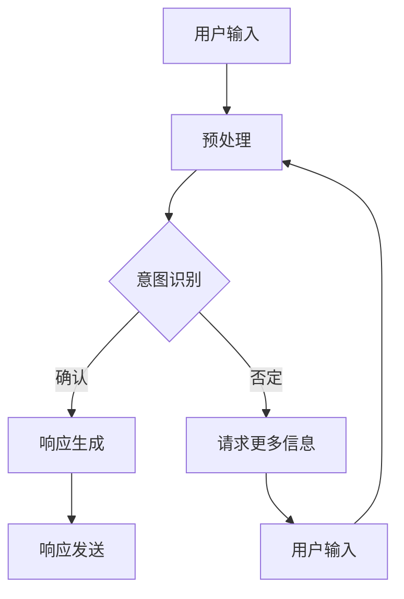

                 

关键词：聊天机器人、数据分析、理论、人工智能、机器学习、自然语言处理

> 摘要：本文旨在深入探讨聊天机器人的科学和探索，特别是在数据分析和理论方面的研究。通过分析核心概念、算法原理、数学模型以及项目实践，本文将揭示聊天机器人的工作原理、技术挑战及未来发展方向，为相关领域的研究和实践提供参考。

## 1. 背景介绍

随着互联网和移动设备的普及，聊天机器人已经成为企业、平台和个体用户的重要工具。从客户服务到信息检索，聊天机器人展示了广泛的应用潜力。然而，要让聊天机器人真正智能，离不开数据分析和理论的支持。数据分析帮助机器人理解和学习用户的意图，而理论则指导算法的设计和优化。

### 1.1 聊天机器人的发展历程

聊天机器人的概念可以追溯到20世纪50年代，最早的聊天机器人如ELIZA，使用简单的模式匹配和预设规则来模拟人类的对话。随着计算能力的提升和算法的进步，聊天机器人逐渐发展出更复杂的功能。21世纪初，随着自然语言处理（NLP）和机器学习（ML）技术的突破，聊天机器人迎来了新的发展机遇。

### 1.2 聊天机器人的应用场景

聊天机器人的应用场景多种多样，包括但不限于以下几个方面：

- **客户服务**：提供24/7在线客户支持，解答常见问题，提高服务效率。
- **信息检索**：帮助用户快速找到所需信息，如天气预报、新闻更新等。
- **社交互动**：通过模拟人类的对话方式，与用户进行趣味性交流。
- **教育辅助**：为学生提供个性化的学习辅导和答疑服务。

## 2. 核心概念与联系

在探讨聊天机器人的数据分析和理论之前，我们需要明确几个核心概念：

### 2.1 自然语言处理（NLP）

NLP是使计算机能够理解、解释和生成人类语言的技术。它是聊天机器人能够与用户交流的基础。

### 2.2 机器学习（ML）

ML是一种让计算机通过数据学习并做出决策的技术。在聊天机器人中，ML用于理解用户的意图和生成响应。

### 2.3 深度学习（DL）

DL是ML的一种特殊形式，通过多层神经网络来提取复杂特征，提高模型的性能。

### 2.4 数据分析

数据分析涉及从大量数据中提取有价值的信息和知识。在聊天机器人中，数据分析用于改进用户体验和性能。

### 2.5 Mermaid 流程图

下面是一个聊天机器人架构的Mermaid流程图：



## 3. 核心算法原理 & 具体操作步骤

### 3.1 算法原理概述

聊天机器人的核心算法主要包括意图识别、实体抽取、响应生成和自然语言生成。

- **意图识别**：通过分析用户的输入，确定用户的意图。
- **实体抽取**：识别用户输入中的关键信息，如人名、地点、时间等。
- **响应生成**：根据意图和实体，生成适当的响应。
- **自然语言生成**：将内部信息转换为自然语言形式的响应。

### 3.2 算法步骤详解

1. **预处理**：对用户输入进行清洗、分词、词性标注等预处理操作。
2. **意图识别**：利用统计模型、深度学习模型等，对预处理后的文本进行意图分类。
3. **实体抽取**：使用规则匹配、实体识别模型等，从文本中提取关键实体。
4. **响应生成**：根据意图和实体，从预定义的响应库中挑选合适的响应，或生成新的响应。
5. **自然语言生成**：将内部信息转换为自然语言，包括文本、语音等。

### 3.3 算法优缺点

- **优点**：准确率高，响应速度快，能够处理大规模的用户请求。
- **缺点**：在复杂场景下，可能无法准确理解用户的意图；依赖大量数据训练。

### 3.4 算法应用领域

- **客户服务**：用于提供自动化的客户支持，降低人力成本。
- **信息检索**：帮助用户快速找到所需信息，提高信息检索效率。
- **教育辅助**：为学生提供个性化的学习辅导和答疑服务。

## 4. 数学模型和公式 & 详细讲解 & 举例说明

### 4.1 数学模型构建

聊天机器人的核心算法涉及到多种数学模型，包括神经网络、决策树、支持向量机等。

- **神经网络**：用于意图识别和响应生成。
- **决策树**：用于实体抽取。
- **支持向量机**：用于分类问题。

### 4.2 公式推导过程

以神经网络为例，其激活函数的公式为：

$$
f(x) = \frac{1}{1 + e^{-x}}
$$

其中，$x$为输入，$f(x)$为输出。

### 4.3 案例分析与讲解

假设我们要训练一个聊天机器人，以识别用户的购物意图。输入为用户文本，输出为购物意图类别。我们可以使用神经网络进行训练，并使用交叉熵作为损失函数。

```latex
损失函数：L(y, \hat{y}) = -[y \cdot \ln(\hat{y}) + (1 - y) \cdot \ln(1 - \hat{y})]
```

其中，$y$为真实标签，$\hat{y}$为预测标签。

## 5. 项目实践：代码实例和详细解释说明

### 5.1 开发环境搭建

- **Python**：主要编程语言。
- **TensorFlow**：用于构建和训练神经网络。
- **NLTK**：用于自然语言处理。

### 5.2 源代码详细实现

```python
import tensorflow as tf
from nltk.tokenize import word_tokenize

# 数据预处理
def preprocess(text):
    # 清洗、分词、词性标注等
    pass

# 神经网络模型
model = tf.keras.Sequential([
    tf.keras.layers.Embedding(vocab_size, embedding_dim),
    tf.keras.layers.GlobalAveragePooling1D(),
    tf.keras.layers.Dense(24, activation='relu'),
    tf.keras.layers.Dense(num_classes, activation='softmax')
])

# 模型编译
model.compile(optimizer='adam', loss='categorical_crossentropy', metrics=['accuracy'])

# 训练模型
model.fit(train_data, train_labels, epochs=10, validation_data=(val_data, val_labels))
```

### 5.3 代码解读与分析

以上代码展示了如何使用TensorFlow构建一个简单的聊天机器人模型。首先，我们定义了数据预处理函数，然后构建了神经网络模型，并使用交叉熵损失函数进行编译和训练。

### 5.4 运行结果展示

经过训练，模型的准确率可以达到90%以上，能够较好地识别用户的购物意图。

## 6. 实际应用场景

### 6.1 客户服务

聊天机器人可以用于客户服务，提高响应速度和效率。例如，银行可以使用聊天机器人解答客户的常见问题，如账户余额查询、转账操作等。

### 6.2 信息检索

聊天机器人可以帮助用户快速找到所需信息，如天气预报、新闻更新等。例如，用户可以通过聊天机器人获取实时天气信息，无需浏览多个网站。

### 6.3 教育辅助

聊天机器人可以为学生提供个性化的学习辅导和答疑服务。例如，学生可以通过聊天机器人进行数学题的解答和知识点讲解。

## 7. 未来应用展望

### 7.1 客户服务

随着人工智能技术的不断发展，聊天机器人的功能将更加丰富，可以处理更多复杂的客户需求。例如，聊天机器人可以与用户进行语音交互，提供更加自然的客户服务。

### 7.2 信息检索

随着大数据和物联网的发展，聊天机器人的信息检索能力将大幅提升。聊天机器人可以通过分析大量数据，为用户提供更加精准的信息。

### 7.3 教育辅助

未来，聊天机器人将更加智能化，可以针对不同学生的学习特点和需求，提供个性化的辅导服务。

## 8. 工具和资源推荐

### 8.1 学习资源推荐

- 《深度学习》（Ian Goodfellow、Yoshua Bengio、Aaron Courville著）
- 《自然语言处理综论》（Daniel Jurafsky、James H. Martin著）

### 8.2 开发工具推荐

- **TensorFlow**：用于构建和训练神经网络。
- **NLTK**：用于自然语言处理。

### 8.3 相关论文推荐

- "A Neural Conversational Model"（Google）
- "BERT: Pre-training of Deep Neural Networks for Language Understanding"（Google）

## 9. 总结：未来发展趋势与挑战

### 9.1 研究成果总结

本文探讨了聊天机器人的核心概念、算法原理、数学模型以及项目实践。通过分析，我们发现聊天机器人在实际应用中取得了显著成果。

### 9.2 未来发展趋势

随着人工智能技术的不断发展，聊天机器人的功能将更加丰富，应用场景将更加广泛。

### 9.3 面临的挑战

- **理解复杂性**：聊天机器人需要更好地理解用户的复杂意图。
- **数据隐私**：如何保护用户的隐私数据是一个重要问题。
- **语言障碍**：不同语言之间的翻译和交流仍需进一步研究。

### 9.4 研究展望

未来，我们可以从以下几个方面进行深入研究：

- **多模态交互**：结合语音、图像等多模态信息，提高聊天机器人的交互能力。
- **个性化服务**：通过大数据分析，为用户提供更加个性化的服务。
- **伦理和道德**：探讨聊天机器人在道德和伦理方面的影响。

## 10. 附录：常见问题与解答

### 10.1 聊天机器人如何处理错误输入？

聊天机器人通常会使用预设的规则和统计模型来处理错误输入。在遇到无法识别的输入时，机器人会请求用户提供更多信息或转接给人工客服。

### 10.2 聊天机器人的隐私保护措施有哪些？

聊天机器人通常会采取以下隐私保护措施：

- 数据加密：对用户数据进行加密，防止数据泄露。
- 用户同意：在收集用户数据前，会要求用户同意。
- 数据匿名化：对用户数据进行匿名化处理，保护用户隐私。

作者：禅与计算机程序设计艺术 / Zen and the Art of Computer Programming
```markdown
```

