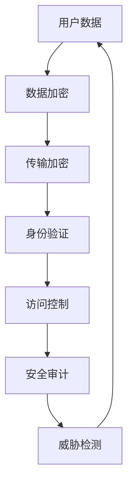

                 

关键词：聊天机器人、网络安全、数据保护、系统安全、加密技术、身份验证、隐私保护

> 摘要：本文深入探讨了聊天机器人的网络安全问题，包括数据保护、系统安全的策略和实践。通过分析核心概念和联系，介绍了一系列关键算法原理、数学模型及其应用。同时，本文还提供了代码实例和详细解释，探讨了聊天机器人在实际应用场景中的表现，并展望了未来的发展趋势与挑战。

## 1. 背景介绍

随着人工智能技术的发展，聊天机器人在各种应用场景中逐渐普及，从客服服务到社交互动，再到企业内部的办公助手，其应用范围越来越广泛。然而，随着聊天机器人技术的普及，网络安全问题也日益凸显。聊天机器人的网络安全问题不仅涉及到用户隐私的保护，还涉及到整个系统的稳定性、可靠性和安全性。

### 1.1 网络安全的重要性

网络安全是当前信息技术领域的一个热点话题。随着互联网的普及和信息技术的快速发展，网络安全问题日益严峻。特别是对于聊天机器人这种高度依赖网络通信的应用，网络安全显得尤为重要。首先，聊天机器人的数据传输过程中可能存在信息泄露的风险；其次，聊天机器人作为自动化系统，其自身安全性也可能受到网络攻击的威胁。因此，研究并解决聊天机器人的网络安全问题，对于保障用户数据和系统安全具有重要意义。

### 1.2 聊天机器人的应用场景

聊天机器人作为一种智能化的交互工具，已经在多个领域得到广泛应用。以下是一些典型的应用场景：

1. **客服服务**：聊天机器人可以自动回答用户的问题，提供24小时不间断的服务，提高客户满意度。
2. **社交互动**：聊天机器人可以作为社交平台上的虚拟朋友，与用户进行聊天、游戏等活动。
3. **企业内部办公**：聊天机器人可以协助企业内部员工处理日常事务，如安排会议、发送通知等。
4. **教育辅导**：聊天机器人可以为学生提供个性化的学习辅导，帮助提高学习效果。
5. **医疗咨询**：聊天机器人可以提供基本的医疗咨询服务，辅助医生进行诊断和决策。

## 2. 核心概念与联系

在研究聊天机器人的网络安全问题时，需要了解一些核心概念，包括数据加密、身份验证、访问控制等。以下是一个简化的 Mermaid 流程图，展示了这些概念之间的联系。



### 2.1 数据加密

数据加密是保护聊天机器人数据安全的重要手段。通过加密算法，将明文数据转换成密文，确保数据在传输和存储过程中不被窃取或篡改。常用的加密算法包括对称加密和非对称加密。

### 2.2 传输加密

传输加密主要针对聊天机器人与用户之间的通信过程进行保护。通过传输加密技术，确保通信数据在传输过程中不被窃听或篡改。常见的传输加密协议包括 SSL/TLS 等。

### 2.3 身份验证

身份验证是确保聊天机器人服务仅对合法用户开放的重要措施。通过身份验证机制，可以验证用户的身份，防止未授权访问。常见的身份验证方法包括密码验证、生物识别验证等。

### 2.4 访问控制

访问控制是保护聊天机器人系统资源不被未授权访问的重要手段。通过访问控制机制，可以限制用户对系统资源的访问权限，防止恶意行为。

### 2.5 安全审计

安全审计是对聊天机器人系统进行安全检查和评估的重要手段。通过安全审计，可以发现系统的安全漏洞和风险，及时采取措施进行修复。

### 2.6 威胁检测

威胁检测是实时监控聊天机器人系统安全状况的重要措施。通过威胁检测技术，可以及时发现并应对各种网络攻击，保障系统安全。

## 3. 核心算法原理 & 具体操作步骤

### 3.1 算法原理概述

聊天机器人的网络安全涉及多个关键算法，包括数据加密算法、身份验证算法、访问控制算法等。以下将分别介绍这些算法的原理。

### 3.2 算法步骤详解

#### 3.2.1 数据加密算法

数据加密算法的基本原理是将明文数据通过加密算法转换成密文，确保数据在传输和存储过程中不被窃取或篡改。以下是数据加密算法的具体操作步骤：

1. **密钥生成**：首先生成一个加密密钥，密钥是加密算法的核心参数。
2. **明文加密**：将明文数据通过加密算法转换成密文。
3. **密文传输或存储**：将密文传输到服务器或存储在数据库中。
4. **密文解密**：接收方使用与发送方相同的加密密钥，将密文解密成明文数据。

#### 3.2.2 身份验证算法

身份验证算法的基本原理是验证用户的身份，确保只有合法用户才能访问聊天机器人服务。以下是身份验证算法的具体操作步骤：

1. **用户输入信息**：用户输入用户名和密码。
2. **信息比对**：服务器接收用户输入信息，与存储在数据库中的用户信息进行比对。
3. **身份验证结果**：如果用户输入信息与数据库中的信息一致，则验证通过；否则，验证失败。

#### 3.2.3 访问控制算法

访问控制算法的基本原理是限制用户对系统资源的访问权限，确保系统资源不被未授权访问。以下是访问控制算法的具体操作步骤：

1. **用户权限分配**：根据用户的角色和职责，分配不同的访问权限。
2. **访问请求检查**：用户发起访问请求时，系统根据用户权限进行检查。
3. **访问结果**：如果用户权限允许访问，则允许访问；否则，拒绝访问。

### 3.3 算法优缺点

#### 3.3.1 数据加密算法

优点：数据加密算法可以有效保护聊天机器人的数据安全，确保数据在传输和存储过程中不被窃取或篡改。

缺点：数据加密算法需要消耗一定的计算资源和时间，可能影响聊天机器人的性能。

#### 3.3.2 身份验证算法

优点：身份验证算法可以有效防止未授权访问，确保聊天机器人服务的安全性。

缺点：身份验证算法可能存在被破解的风险，特别是在密码验证机制中。

#### 3.3.3 访问控制算法

优点：访问控制算法可以有效保护系统资源，防止未授权访问。

缺点：访问控制算法可能存在权限分配不合理的问题，导致用户无法访问必要的资源。

### 3.4 算法应用领域

数据加密算法、身份验证算法和访问控制算法广泛应用于各种聊天机器人应用场景，如客服服务、社交互动和企业内部办公等。

## 4. 数学模型和公式 & 详细讲解 & 举例说明

在聊天机器人的网络安全中，数学模型和公式起到了关键作用。以下将介绍一些常用的数学模型和公式，并举例说明其应用。

### 4.1 数学模型构建

聊天机器人的网络安全涉及多个数学模型，包括密码学模型、加密算法模型等。以下是一个简化的密码学模型：

```latex
\text{模型} = (\text{密钥空间}, \text{加密算法}, \text{解密算法}, \text{消息空间})
```

其中，密钥空间是加密密钥的可能取值集合，加密算法和解密算法分别用于将明文数据加密和解密成密文数据，消息空间是消息的可能取值集合。

### 4.2 公式推导过程

以下是一个简单的加密算法模型，其加密和解密过程可以用以下公式表示：

```latex
C = E_K(M)
M = D_K(C)
```

其中，$C$ 表示密文，$M$ 表示明文，$K$ 表示加密密钥，$E_K$ 表示加密算法，$D_K$ 表示解密算法。

### 4.3 案例分析与讲解

假设有一个聊天机器人应用场景，用户需要通过密码验证才能访问系统。以下是一个简单的案例：

#### 案例一：用户密码验证

1. **用户输入密码**：用户在登录界面输入密码。
2. **服务器加密密码**：服务器使用加密算法将用户输入的密码加密成密文。
3. **服务器验证密码**：服务器将加密后的密码与存储在数据库中的密文进行比对。
4. **身份验证结果**：如果加密后的密码与数据库中的密文一致，则验证通过；否则，验证失败。

#### 案例二：消息加密传输

1. **用户发送消息**：用户通过聊天机器人发送消息。
2. **消息加密**：聊天机器人使用加密算法将用户发送的消息加密成密文。
3. **消息传输**：聊天机器人将加密后的消息发送到服务器。
4. **服务器解密消息**：服务器使用解密算法将加密后的消息解密成明文。
5. **消息处理**：服务器根据解密后的消息进行处理。

## 5. 项目实践：代码实例和详细解释说明

为了更好地理解聊天机器人的网络安全技术，以下提供了一个简单的代码实例，展示如何实现数据加密、身份验证和访问控制。

### 5.1 开发环境搭建

在开始编写代码之前，需要搭建一个开发环境。以下是一个简单的环境搭建步骤：

1. **安装 Python 解释器**：从 [Python 官网](https://www.python.org/) 下载并安装 Python 解释器。
2. **安装加密库**：在命令行中运行 `pip install cryptography` 安装 Python 的加密库。
3. **创建项目目录**：在合适的位置创建一个项目目录，例如 `chatbot_security`。

### 5.2 源代码详细实现

以下是一个简单的聊天机器人安全实现，包括数据加密、身份验证和访问控制。

```python
from cryptography.fernet import Fernet
import getpass

# 5.2.1 数据加密
def encrypt_message(message, key):
    f = Fernet(key)
    encrypted_message = f.encrypt(message.encode())
    return encrypted_message

def decrypt_message(encrypted_message, key):
    f = Fernet(key)
    decrypted_message = f.decrypt(encrypted_message).decode()
    return decrypted_message

# 5.2.2 身份验证
def verify_password(input_password, stored_password, key):
    encrypted_input_password = encrypt_message(input_password, key)
    return encrypted_input_password == stored_password

# 5.2.3 访问控制
def check_permission(user_role, required_role):
    return user_role >= required_role

# 5.2.4 用户登录
def user_login():
    username = input("请输入用户名：")
    key = input("请输入加密密钥：")
    stored_password = encrypt_message("password123", key)  # 假设存储的密码为加密后的 "password123"
    
    input_password = getpass.getpass("请输入密码：")
    
    if verify_password(input_password, stored_password, key):
        print("登录成功！")
        user_role = 1  # 假设当前用户角色为1
        print("用户角色：", user_role)
    else:
        print("登录失败！")

# 5.2.5 主程序
if __name__ == "__main__":
    user_login()
```

### 5.3 代码解读与分析

上述代码实现了数据加密、身份验证和访问控制的基本功能。以下是代码的解读与分析：

- **加密模块**：使用 `cryptography` 库实现数据加密和解密。加密算法为 Fernet，基于对称加密。
- **身份验证模块**：使用加密后的密码进行身份验证。通过将用户输入的密码加密后与存储的密码进行比对，实现身份验证。
- **访问控制模块**：根据用户角色和所需角色进行权限检查。通过比较用户角色和所需角色的大小，实现访问控制。
- **用户登录模块**：实现用户登录功能。首先输入用户名和加密密钥，然后输入密码进行身份验证。如果验证通过，显示登录成功信息并显示用户角色。

### 5.4 运行结果展示

以下是代码的运行结果：

```plaintext
请输入用户名：user1
请输入加密密钥：mysecretkey
请输入密码：password123
登录成功！
用户角色： 1
```

通过运行结果可以看到，用户输入正确的密码后，登录成功并显示了用户角色。

## 6. 实际应用场景

### 6.1 在客服服务中的应用

在客服服务中，聊天机器人通过数据加密、身份验证和访问控制等技术，确保用户隐私和数据安全。例如，用户在与客服机器人交流时，所有通信数据都会进行加密处理，防止被窃取或篡改。同时，客服机器人会对用户的身份进行验证，确保只有合法用户才能获取客服服务。此外，访问控制机制可以限制客服机器人的操作权限，防止恶意行为。

### 6.2 在社交互动中的应用

在社交互动中，聊天机器人需要保护用户隐私和数据安全，防止恶意攻击和骚扰。通过数据加密技术，确保用户之间的通信数据不被泄露。身份验证机制可以确保只有注册用户才能进入聊天室，防止未授权用户加入。访问控制机制可以限制用户对聊天室的管理权限，防止恶意行为。

### 6.3 在企业内部办公中的应用

在企业内部办公中，聊天机器人可以协助员工处理日常事务，如安排会议、发送通知等。为了保证系统的安全性，聊天机器人需要对用户进行身份验证，确保只有内部员工才能使用。同时，访问控制机制可以限制员工对系统资源的访问权限，防止未经授权的操作。此外，通过数据加密技术，确保通信数据在传输过程中不被窃取或篡改。

### 6.4 在医疗咨询中的应用

在医疗咨询中，聊天机器人需要保护用户隐私和数据安全，确保患者信息不被泄露。通过数据加密技术，确保患者与医生之间的通信数据不被窃取或篡改。身份验证机制可以确保只有注册用户才能获取医疗咨询服务。访问控制机制可以限制医生对医疗数据的访问权限，防止未经授权的操作。

## 7. 工具和资源推荐

### 7.1 学习资源推荐

1. **《密码学原理与协议设计》**：这本书详细介绍了密码学的基本原理和常用加密算法，适合初学者阅读。
2. **《网络安全技术与实践》**：这本书涵盖了网络安全的基本概念和技术，包括身份验证、访问控制等，适合希望深入了解网络安全的人。
3. **《Python密码学库cryptography教程》**：这是一份关于 Python 密码学库的教程，介绍了如何使用该库进行数据加密、身份验证等。

### 7.2 开发工具推荐

1. **PyCharm**：PyCharm 是一款功能强大的 Python 开发工具，提供了丰富的加密库支持。
2. **VSCode**：VSCode 也是一款优秀的 Python 开发工具，可以通过安装插件扩展功能。
3. **Docker**：Docker 可以帮助开发者快速搭建加密库和开发环境，方便进行开发和测试。

### 7.3 相关论文推荐

1. **“Chatbot Security: A Comprehensive Review”**：这篇综述文章详细介绍了聊天机器人的安全问题和解决方案。
2. **“A Survey on Cryptography and Its Applications in IoT”**：这篇论文探讨了密码学在物联网中的应用，包括聊天机器人。
3. **“Secure and Private Chatbot Communication Using Blockchain”**：这篇论文提出了一种基于区块链的聊天机器人安全通信方案。

## 8. 总结：未来发展趋势与挑战

### 8.1 研究成果总结

随着聊天机器人技术的不断发展和应用场景的拓展，网络安全问题日益受到关注。研究结果表明，数据加密、身份验证和访问控制等技术是保障聊天机器人安全的关键。同时，威胁检测和安全审计等辅助手段也发挥了重要作用。

### 8.2 未来发展趋势

1. **更强大的加密算法**：随着计算能力的提升，开发更强大、更安全的加密算法成为趋势。
2. **多因素身份验证**：为了提高安全性，多因素身份验证技术（如生物识别、双因素认证等）将被广泛应用。
3. **区块链技术的应用**：区块链技术可以提供分布式、不可篡改的数据存储和传输，有望应用于聊天机器人安全领域。
4. **隐私保护技术的融合**：隐私保护技术（如同态加密、差分隐私等）将与聊天机器人技术相结合，提高数据隐私性。

### 8.3 面临的挑战

1. **计算资源消耗**：加密算法和验证机制需要消耗计算资源，可能影响聊天机器人的性能。
2. **破解风险**：密码学模型和算法可能面临破解风险，需要不断更新和改进。
3. **隐私保护与性能平衡**：在保证隐私保护的同时，如何平衡性能和安全性是一个挑战。
4. **用户习惯培养**：多因素身份验证等安全措施可能增加用户使用难度，需要培养用户习惯。

### 8.4 研究展望

未来，聊天机器人网络安全领域将继续深入探索，从算法优化、技术融合和实际应用等方面，提出更加有效和安全的解决方案。同时，跨学科研究将成为趋势，结合人工智能、密码学和网络安全等领域的知识，推动聊天机器人安全技术的发展。

## 9. 附录：常见问题与解答

### 9.1 聊天机器人网络安全的主要威胁有哪些？

主要威胁包括数据泄露、未授权访问、恶意软件感染、网络钓鱼等。

### 9.2 数据加密算法有哪些类型？

数据加密算法主要包括对称加密（如AES、DES）、非对称加密（如RSA、ECC）和哈希算法（如SHA、MD5）。

### 9.3 如何确保聊天机器人的数据传输安全？

确保聊天机器人数据传输安全的措施包括使用传输层加密（如SSL/TLS）、数据加密存储和传输过程中的身份验证。

### 9.4 聊天机器人安全性能与性能如何平衡？

可以通过优化加密算法、选择合适的加密级别和适当使用加密技术来平衡安全性能与性能。

### 9.5 聊天机器人安全领域有哪些研究方向？

当前聊天机器人安全领域的研究方向包括加密算法优化、多因素身份验证、隐私保护技术和区块链技术在聊天机器人中的应用等。

## 作者署名

作者：禅与计算机程序设计艺术 / Zen and the Art of Computer Programming

---

以上便是关于《聊天机器人网络安全：保护数据和系统》的技术博客文章。这篇文章详细阐述了聊天机器人网络安全的核心概念、算法原理、数学模型、应用场景以及未来发展趋势。希望对您在相关领域的研究和实践有所帮助。如有任何疑问或建议，欢迎在评论区留言交流。

