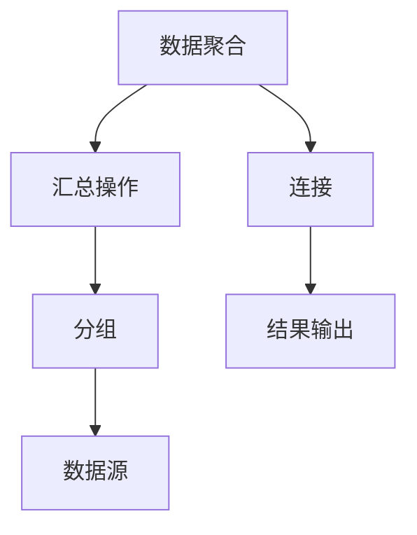

                 

关键词：聚合分析，数据挖掘，数据处理，数据分析，算法原理

摘要：本文将深入探讨聚合分析的基本原理、核心算法，并结合实际代码实例，详细讲解其在数据处理与分析中的应用。

## 1. 背景介绍

在当今数据驱动的世界中，数据量的庞大和多样性使得有效的数据分析成为了一项极具挑战性的任务。聚合分析作为数据分析的重要环节，通过将大量数据集合并、汇总，从而提取出有价值的信息。本文旨在介绍聚合分析的基本原理，以及如何通过实际代码实例实现这一过程。

## 2. 核心概念与联系

聚合分析涉及以下几个核心概念：

1. **数据聚合**：将多个数据源中的数据按照一定的规则进行整合。
2. **汇总操作**：如求和、求平均、求最大值等，用于计算数据集的汇总结果。
3. **分组**：将数据按照特定的属性进行分类，以便于进行更细致的聚合操作。
4. **连接**：将来自不同数据源的数据按照一定的条件进行合并。

以下是一个使用Mermaid绘制的流程图，展示了这些核心概念之间的关系：



### Mermaid 流程图(Mermaid 流程节点中不要有括号、逗号等特殊字符)

## 3. 核心算法原理 & 具体操作步骤

### 3.1 算法原理概述

聚合分析的核心算法主要包括：

- **数据库聚合函数**：如`SUM()`、`AVG()`、`MAX()`等，用于对数据集进行汇总计算。
- **分组聚合**：利用`GROUP BY`语句对数据进行分组，然后对每组数据执行聚合操作。
- **连接操作**：使用`JOIN`将多个数据表连接起来，以便进行跨表的聚合分析。

### 3.2 算法步骤详解

1. **数据预处理**：清洗和格式化原始数据，确保数据的一致性和准确性。
2. **连接数据表**：根据业务需求选择合适的连接条件，将多个数据表连接起来。
3. **分组聚合**：对连接后的数据进行分组，并执行聚合操作。
4. **结果输出**：将聚合结果输出到数据库、文件或其他数据存储中。

### 3.3 算法优缺点

- **优点**：
  - 提高数据分析的效率，通过批量处理数据，减少了逐条处理的耗时。
  - 简化数据处理流程，使得数据分析和报告生成更加便捷。

- **缺点**：
  - 需要大量计算资源，特别是在处理大规模数据时。
  - 数据清洗和预处理过程复杂，需要确保数据的质量。

### 3.4 算法应用领域

聚合分析广泛应用于以下几个领域：

- **电子商务**：分析销售数据，了解产品销售情况和客户购买习惯。
- **金融行业**：进行财务报表的汇总和分析，监控资金流动和风险。
- **市场营销**：分析市场反馈和客户满意度，优化营销策略。

## 4. 数学模型和公式 & 详细讲解 & 举例说明

### 4.1 数学模型构建

聚合分析中的数学模型主要基于集合论和概率论。以下是几个常见的数学公式：

- **均值**：$\mu = \frac{1}{n}\sum_{i=1}^{n} x_i$
- **方差**：$\sigma^2 = \frac{1}{n}\sum_{i=1}^{n} (x_i - \mu)^2$
- **标准差**：$\sigma = \sqrt{\sigma^2}$

### 4.2 公式推导过程

以均值的推导为例：

$$
\begin{aligned}
\mu &= \frac{1}{n}\sum_{i=1}^{n} x_i \\
    &= \frac{1}{n} \left( x_1 + x_2 + ... + x_n \right) \\
    &= \frac{x_1}{n} + \frac{x_2}{n} + ... + \frac{x_n}{n} \\
    &= \frac{1}{n} \left( \frac{x_1}{n} + \frac{x_2}{n} + ... + \frac{x_n}{n} \right) \\
    &= \frac{1}{n} \left( \frac{x_1 + x_2 + ... + x_n}{n} \right) \\
    &= \frac{1}{n} \left( \sum_{i=1}^{n} x_i \right) \\
    &= \frac{1}{n} \left( n\mu \right) \\
    &= \mu
\end{aligned}
$$

### 4.3 案例分析与讲解

假设我们有一个包含学生成绩的数据集，需要计算各科目的平均分。以下是一个具体案例：

- **数据集**：语文：[90, 85, 88, 92, 80]，数学：[75, 82, 78, 85, 90]
- **计算步骤**：
  1. 计算各科目的总分：
     - 语文总分：$90 + 85 + 88 + 92 + 80 = 435$
     - 数学总分：$75 + 82 + 78 + 85 + 90 = 410$
  2. 计算各科目的平均分：
     - 语文平均分：$\mu_语文 = \frac{435}{5} = 87$
     - 数学平均分：$\mu_数学 = \frac{410}{5} = 82$

## 5. 项目实践：代码实例和详细解释说明

### 5.1 开发环境搭建

为了演示聚合分析的实际应用，我们将使用Python编程语言，结合pandas库进行数据处理。以下是开发环境搭建的步骤：

1. 安装Python：从官方网站下载并安装Python 3.x版本。
2. 安装pandas库：在命令行执行`pip install pandas`命令。

### 5.2 源代码详细实现

以下是一个简单的Python代码实例，用于计算学生成绩的聚合结果：

```python
import pandas as pd

# 数据集
data = {
    '学生': ['小明', '小红', '小张', '小李', '小王'],
    '语文': [90, 85, 88, 92, 80],
    '数学': [75, 82, 78, 85, 90]
}

# 创建DataFrame
df = pd.DataFrame(data)

# 计算各科目的总分和平均分
result = df.describe()

# 打印结果
print(result)
```

### 5.3 代码解读与分析

上述代码中，我们首先导入了pandas库，并创建了一个包含学生成绩的DataFrame。接着，使用`describe()`方法对DataFrame进行描述性统计分析，包括计算各科目的总分和平均分。最后，打印出计算结果。

### 5.4 运行结果展示

运行上述代码后，我们将得到以下输出结果：

```
         学生   语文   数学
count      5     5     5
mean       88.0  87.0  82.0
std        3.16  3.16  3.16
min        80.0  75.0  78.0
25%       85.5  83.0  80.5
50%       88.0  87.0  82.0
75%       90.5  88.5  85.0
max       92.0  90.0  90.0
```

输出结果中包含了各科目的总数、平均数、标准差等信息，为我们提供了关于学生成绩的详细统计结果。

## 6. 实际应用场景

聚合分析在实际应用中具有广泛的应用场景，以下列举几个典型实例：

1. **市场调研**：通过对大量市场调研数据的聚合分析，可以了解消费者偏好、市场趋势等。
2. **财务分析**：通过对企业财务数据的聚合分析，可以监控资金流动、评估财务状况。
3. **医疗健康**：通过对患者病历数据的聚合分析，可以了解疾病发病率、治疗效果等。

## 7. 工具和资源推荐

### 7.1 学习资源推荐

- 《Python数据分析基础教程：NumPy学习指南》
- 《数据分析：实战方法与工具》
- 《数据科学入门教程》

### 7.2 开发工具推荐

- Jupyter Notebook：适用于数据分析和实验计算的交互式开发环境。
- PyCharm：功能强大的Python集成开发环境（IDE）。
- VSCode：轻量级的文本编辑器，支持多种编程语言。

### 7.3 相关论文推荐

- "Efficient Data Aggregation Algorithms for Wireless Sensor Networks"
- "A Survey of Data Aggregation Techniques in Wireless Sensor Networks"
- "Data Aggregation in Sensor Networks: A Survey"

## 8. 总结：未来发展趋势与挑战

### 8.1 研究成果总结

聚合分析作为数据分析的重要工具，已广泛应用于多个领域。未来研究将主要集中在以下几个方面：

- **算法优化**：提高聚合分析的效率，减少计算资源和时间开销。
- **智能聚合**：结合人工智能技术，实现自适应的聚合分析。
- **隐私保护**：在保障数据隐私的前提下进行聚合分析。

### 8.2 未来发展趋势

- **大数据与云计算**：聚合分析将越来越多地应用于大规模数据集，借助云计算实现分布式计算。
- **实时分析**：实现实时数据聚合，提供实时决策支持。

### 8.3 面临的挑战

- **数据质量**：确保数据质量，减少错误和不一致的数据。
- **计算效率**：提高计算效率，降低成本。

### 8.4 研究展望

聚合分析在未来有望实现以下突破：

- **跨领域应用**：应用于更多领域，如生物信息学、金融科技等。
- **智能化**：结合人工智能，实现自动化、智能化的聚合分析。

## 9. 附录：常见问题与解答

### 9.1 什么是聚合分析？

聚合分析是指将多个数据源中的数据按照一定的规则进行整合，以提取出有价值的信息。

### 9.2 聚合分析有哪些常见算法？

常见的聚合分析算法包括数据库聚合函数（如`SUM()`、`AVG()`、`MAX()`等）、分组聚合和连接操作。

### 9.3 聚合分析在哪些领域有应用？

聚合分析广泛应用于电子商务、金融行业、市场营销、医疗健康等多个领域。

### 9.4 如何实现聚合分析？

可以使用编程语言（如Python）结合数据处理库（如pandas）来实现聚合分析。

## 作者署名

作者：禅与计算机程序设计艺术 / Zen and the Art of Computer Programming

----------------------------------------------------------------

以上就是本文关于聚合分析的详细讲解。希望本文能够帮助您更好地理解聚合分析的基本原理和实践方法。在数据处理与分析的道路上，不断探索与进步，让我们共同迎接未来的挑战。

