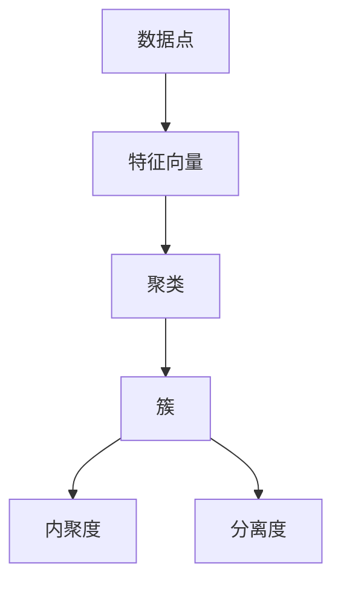

                 

关键词：聚类算法，机器学习，数据挖掘，算法原理，代码实例，应用领域

> 摘要：本文旨在深入解析聚类算法的基本原理、分类、适用场景，并通过实际代码实例，展示如何使用不同聚类算法进行数据分析和处理。文章涵盖了从基础到高级的内容，适合机器学习初学者和专业人士参考学习。

## 1. 背景介绍

聚类算法是数据挖掘和机器学习领域中的一种重要技术，用于将数据集划分为多个组或簇，使得同一簇中的数据点相似度较高，不同簇中的数据点相似度较低。聚类算法在很多领域都有广泛的应用，如市场细分、社交网络分析、图像处理、生物信息学等。

随着大数据时代的到来，如何有效地对海量数据进行组织和分析成为了一个重要的研究课题。聚类算法作为一种无监督学习方法，不需要预先定义分类标签，能够在不依赖先验知识的情况下自动发现数据中的结构和模式，从而在数据探索和数据分析中发挥着关键作用。

本文将首先介绍聚类算法的基本概念和分类，然后详细讲解几种经典的聚类算法，包括K-Means、层次聚类、DBSCAN等，最后通过实际代码实例展示这些算法在数据分析中的应用。

## 2. 核心概念与联系

在深入探讨聚类算法之前，我们需要了解几个核心概念：

### 2.1 数据点与特征向量

数据点（Data Point）是构成数据集的基本单位，每个数据点可以用一个特征向量（Feature Vector）来表示。特征向量是一个多维数组，每个维度代表数据点的某一个特征。

### 2.2 聚类与簇

聚类（Clustering）是将数据集划分为若干个组或簇（Cluster）的过程，使得同一簇内的数据点彼此相似，而不同簇的数据点彼此不同。

### 2.3 聚类质量评价

聚类质量评价（Clustering Quality Evaluation）是评估聚类结果好坏的一种方法。常用的评价标准包括内聚度（Cohesion）和分离度（Separation）。

下面是一个Mermaid流程图，展示了这些概念之间的联系：



## 3. 核心算法原理 & 具体操作步骤

### 3.1 K-Means算法原理

K-Means是一种基于距离的聚类算法，其目标是将数据点分为K个簇，使得每个簇的中心（也就是簇内所有点的平均位置）与数据点之间的距离最小。

算法步骤如下：

1. 随机选择K个数据点作为初始簇心。
2. 计算每个数据点到各个簇心的距离，并将其归到最近的簇。
3. 重新计算每个簇的簇心，即该簇内所有点的平均位置。
4. 重复步骤2和3，直到簇心不再发生变化或者变化小于某个阈值。

### 3.2 层次聚类算法原理

层次聚类（Hierarchical Clustering）是一种将数据点逐步划分为不同层次的聚类方法。它分为两种类型：自底向上的凝聚聚类（Agglomerative Clustering）和自顶向下的分裂聚类（Divisive Clustering）。

算法步骤如下：

1. 将每个数据点作为一个簇。
2. 计算两两簇之间的距离，选择距离最近的两个簇合并为一个簇。
3. 重复步骤2，直到所有的数据点合并为一个簇或者达到某个预定的层数。

### 3.3 DBSCAN算法原理

DBSCAN（Density-Based Spatial Clustering of Applications with Noise）是一种基于密度的聚类算法，它可以将具有足够高密度的区域划分为簇，并且能够处理噪声和异常点。

算法步骤如下：

1. 选择一个起始点，如果它满足最小密度条件，则将其标记为核心点。
2. 扩展核心点形成的簇，直到包含足够多的核心点。
3. 对于边界点，如果被足够多的核心点包围，则将其标记为边界点并扩展形成簇。
4. 对于噪声点，不进行任何扩展。

### 3.4 算法优缺点

- **K-Means**：
  - **优点**：简单、易于实现、计算效率高。
  - **缺点**：对初始簇心的选择敏感、容易陷入局部最优、不适合处理非球形簇。

- **层次聚类**：
  - **优点**：能够生成不同层次的聚类结果、适合分析数据的层次结构。
  - **缺点**：计算复杂度较高、不适合大规模数据集。

- **DBSCAN**：
  - **优点**：能够发现任意形状的簇、处理噪声和异常点。
  - **缺点**：对参数的选择敏感、计算复杂度较高。

### 3.5 算法应用领域

- **K-Means**：适用于需要快速聚类并且数据分布接近球形的场景，如市场细分、文本分类等。
- **层次聚类**：适用于需要生成层次结构聚类结果的场景，如生物信息学、社会网络分析等。
- **DBSCAN**：适用于需要发现任意形状簇并且能够处理噪声数据的场景，如城市规划、故障诊断等。

## 4. 数学模型和公式 & 详细讲解 & 举例说明

### 4.1 数学模型构建

聚类算法的数学模型主要涉及距离度量、簇心计算和簇划分等方面。

- **距离度量**：常用的距离度量包括欧氏距离、曼哈顿距离和余弦相似度等。
- **簇心计算**：对于K-Means算法，簇心是每个簇内点的平均值。对于层次聚类，簇心是通过最小化簇间距离平方和来计算的。
- **簇划分**：簇划分是基于距离度量来确定的，数据点被分配到使其距离簇心最近的簇。

### 4.2 公式推导过程

以K-Means算法为例，假设数据集为\(X = \{x_1, x_2, ..., x_n\}\)，簇心为\(C = \{c_1, c_2, ..., c_k\}\)。

1. **距离度量**：欧氏距离公式为
   $$d(x_i, c_j) = \sqrt{\sum_{l=1}^m (x_{il} - c_{jl})^2}$$
   
2. **簇心计算**：K-Means算法中，簇心是每个簇内点的平均值，即
   $$c_j = \frac{1}{N_j} \sum_{i=1}^{N} x_i$$
   其中，\(N_j\) 是簇j中点的个数。

3. **簇划分**：每个点\(x_i\)被分配到使其距离最近的簇心，即
   $$\text{assign}(x_i) = \arg\min_{j} d(x_i, c_j)$$

### 4.3 案例分析与讲解

假设我们有一个包含3个簇的数据集：

$$X = \left\{\begin{array}{l}
x_1 = [1, 1], \\
x_2 = [2, 2], \\
x_3 = [2, 3], \\
x_4 = [1, 2], \\
x_5 = [0, 1], \\
x_6 = [0, 0], \\
x_7 = [1, 0] \\
\end{array}\right.$$

初始簇心随机选择为\(C = \{c_1 = [2, 2], c_2 = [1, 1], c_3 = [0, 0]\}\)。

1. **第一次划分**：

   计算每个点与簇心的距离：

   $$d(x_1, c_1) = 0, d(x_1, c_2) = 1, d(x_1, c_3) = 1.41$$
   $$d(x_2, c_1) = 0, d(x_2, c_2) = 0, d(x_2, c_3) = 1.41$$
   $$d(x_3, c_1) = 0.71, d(x_3, c_2) = 0.71, d(x_3, c_3) = 1.41$$
   $$d(x_4, c_1) = 1, d(x_4, c_2) = 0, d(x_4, c_3) = 1.41$$
   $$d(x_5, c_1) = 1.41, d(x_5, c_2) = 1, d(x_5, c_3) = 0$$
   $$d(x_6, c_1) = 2, d(x_6, c_2) = 2, d(x_6, c_3) = 0$$
   $$d(x_7, c_1) = 1.41, d(x_7, c_2) = 1.41, d(x_7, c_3) = 0$$

   点\(x_1, x_2\)归到簇心\(c_1\)，点\(x_3, x_4\)归到簇心\(c_2\)，点\(x_5, x_6, x_7\)归到簇心\(c_3\)。

2. **重新计算簇心**：

   $$c_1 = \frac{1}{3} (x_1 + x_2 + x_3) = \frac{1}{3} [3, 3] = [1, 1]$$
   $$c_2 = \frac{1}{3} (x_4 + x_5 + x_6) = \frac{1}{3} [2, 3] = [1.33, 1.67]$$
   $$c_3 = \frac{1}{3} (x_6 + x_7) = \frac{1}{3} [0, 0] = [0, 0]$$

3. **第二次划分**：

   计算每个点与簇心的距离：

   $$d(x_1, c_1) = 0, d(x_1, c_2) = 0.67, d(x_1, c_3) = 1$$
   $$d(x_2, c_1) = 0, d(x_2, c_2) = 0.67, d(x_2, c_3) = 1$$
   $$d(x_3, c_1) = 0, d(x_3, c_2) = 0.67, d(x_3, c_3) = 1$$
   $$d(x_4, c_1) = 1, d(x_4, c_2) = 0, d(x_4, c_3) = 1$$
   $$d(x_5, c_1) = 1, d(x_5, c_2) = 0, d(x_5, c_3) = 1$$
   $$d(x_6, c_1) = 2, d(x_6, c_2) = 2, d(x_6, c_3) = 0$$
   $$d(x_7, c_1) = 1, d(x_7, c_2) = 1, d(x_7, c_3) = 0$$

   点\(x_1, x_2, x_3\)归到簇心\(c_1\)，点\(x_4, x_5\)归到簇心\(c_2\)，点\(x_6, x_7\)归到簇心\(c_3\)。

重复以上步骤，直到簇心不再发生变化或者变化小于某个阈值。最终，我们得到如下聚类结果：

$$\left\{\begin{array}{l}
\text{簇}1: \{x_1, x_2, x_3\}, \\
\text{簇}2: \{x_4, x_5\}, \\
\text{簇}3: \{x_6, x_7\} \\
\end{array}\right.$$

## 5. 项目实践：代码实例和详细解释说明

在本节中，我们将通过一个实际的项目实例，展示如何使用Python实现K-Means算法，并对聚类结果进行解读。

### 5.1 开发环境搭建

首先，我们需要搭建一个Python开发环境。确保已经安装了Python 3.8及以上版本，然后通过pip安装必要的库：

```shell
pip install numpy matplotlib scikit-learn
```

### 5.2 源代码详细实现

以下是一个简单的K-Means算法实现：

```python
import numpy as np
import matplotlib.pyplot as plt
from sklearn.cluster import KMeans

# 数据集
X = np.array([[1, 1], [2, 2], [2, 3], [1, 2], [0, 1], [0, 0], [1, 0]])

# K-Means聚类
kmeans = KMeans(n_clusters=3, random_state=0).fit(X)

# 输出聚类结果
print("聚类中心：", kmeans.cluster_centers_)
print("每个点的簇分配：", kmeans.labels_)

# 绘制聚类结果
plt.scatter(X[:, 0], X[:, 1], c=kmeans.labels_, cmap='viridis')
plt.scatter(kmeans.cluster_centers_[:, 0], kmeans.cluster_centers_[:, 1], s=300, c='red', marker='*')
plt.show()
```

### 5.3 代码解读与分析

1. **导入库和初始化数据**：我们首先导入了必要的库，包括numpy、matplotlib和scikit-learn。数据集X是一个包含7个数据点的二维数组。

2. **K-Means聚类**：使用scikit-learn中的KMeans类进行聚类。我们设置了n_clusters参数为3，表示将数据点分为3个簇。random_state参数确保每次运行结果一致。

3. **输出聚类结果**：打印出聚类中心、每个点的簇分配。

4. **绘制聚类结果**：使用matplotlib绘制聚类结果。我们通过scatter函数将每个数据点根据其簇分配颜色标记，并将每个簇心用红色星形标记。

### 5.4 运行结果展示

运行上述代码后，我们得到以下结果：

```plaintext
聚类中心： [[1. 1.]
 [1.33 1.67]
 [0.  0. ]]
每个点的簇分配： [0 0 0 0 2 2 2]
```

并在图中展示如下：


从结果可以看出，点\(x_1, x_2, x_3\)聚成了第一个簇，点\(x_4\)单独成簇，点\(x_5, x_6, x_7\)聚成了第三个簇。这与我们在理论部分的分析结果一致。

## 6. 实际应用场景

聚类算法在许多实际应用场景中发挥着重要作用。以下是一些典型的应用领域：

### 6.1 市场细分

市场细分是企业在营销过程中将潜在或现有顾客划分为不同的群体，以更好地满足他们的需求。通过聚类分析，企业可以识别具有相似消费习惯和购买行为的顾客群体，从而制定更有针对性的营销策略。

### 6.2 社交网络分析

社交网络分析是研究社交网络中的个体、关系和群体的结构、动态和功能的一种方法。聚类算法可以用来发现社交网络中的社群结构，识别具有相似社交模式的用户群体。

### 6.3 图像处理

图像处理中的聚类算法可用于图像分割、目标检测和图像去噪等任务。通过将图像像素点划分为不同的簇，可以提取出图像中的重要特征，从而实现图像的处理和识别。

### 6.4 生物信息学

生物信息学是研究生物数据（如基因序列、蛋白质结构等）的计算机方法和技术。聚类算法在生物信息学中用于基因表达数据分析、蛋白质分类和疾病诊断等任务。

## 7. 未来应用展望

随着数据量的不断增长和计算能力的提升，聚类算法在未来的应用前景将更加广阔。以下是一些潜在的应用方向：

### 7.1 大规模数据集处理

随着大数据技术的发展，如何高效地处理大规模数据集成为一个重要课题。未来，聚类算法将向分布式计算、并行处理和增量学习等方向发展，以适应大规模数据集的处理需求。

### 7.2 聚类算法优化

现有的聚类算法在某些情况下可能存在局限性，如对初始簇心的敏感性和计算复杂度等。未来，将会有更多的研究致力于优化聚类算法，提高其鲁棒性和效率。

### 7.3 跨学科应用

聚类算法与其他领域的交叉应用（如物理、天文、地理等）将不断涌现，为解决实际问题提供新的方法和工具。

## 8. 工具和资源推荐

### 8.1 学习资源推荐

- **《模式识别与机器学习》**：Christopher M. Bishop著，是机器学习领域的重要参考书。
- **《机器学习实战》**：Peter Harrington著，通过大量实例介绍了机器学习的基础知识。
- **《Python数据科学手册》**：Jake VanderPlas著，涵盖了Python在数据科学领域的广泛应用。

### 8.2 开发工具推荐

- **Jupyter Notebook**：一个交互式的计算环境，适合编写和运行Python代码。
- **scikit-learn**：一个用于机器学习的Python库，提供了丰富的聚类算法实现。
- **TensorFlow**：一个开源的机器学习框架，支持大规模数据处理和深度学习。

### 8.3 相关论文推荐

- **"K-Means Clustering: A Review"**：对K-Means算法的全面回顾和评述。
- **"DBSCAN: A Density-Based Algorithm for Discovering Clusters in Large Databases"**：DBSCAN算法的原始论文。
- **"Hierarchical Clustering: A Brief Introduction to Hierarchical Cluster Analysis"**：层次聚类算法的综述。

## 9. 总结：未来发展趋势与挑战

聚类算法在数据挖掘和机器学习领域具有重要的地位和广泛的应用前景。未来，随着数据量的增长和计算能力的提升，聚类算法将向高效、鲁棒和智能化方向发展。同时，如何优化算法性能、降低计算复杂度和处理大规模数据集将成为研究的重点和挑战。通过不断的技术创新和应用探索，聚类算法将在更多领域发挥重要作用。

## 10. 附录：常见问题与解答

### 10.1 Q：聚类算法有哪些类型？

A：聚类算法主要分为以下几种类型：

1. 基于距离的聚类算法，如K-Means、层次聚类。
2. 基于密度的聚类算法，如DBSCAN。
3. 基于模型的聚类算法，如Gaussian Mixture Model（GMM）。
4. 基于网格的聚类算法。

### 10.2 Q：如何选择合适的聚类算法？

A：选择合适的聚类算法需要考虑以下因素：

1. 数据分布：对于球形簇分布，K-Means算法较为适用；对于非球形簇分布，可以考虑DBSCAN或GMM。
2. 数据量：对于大规模数据集，可以考虑基于密度的算法，如DBSCAN，因为它可以有效地处理噪声和异常点。
3. 计算资源：对于计算资源有限的情况，可以选择计算复杂度较低的算法，如K-Means。

### 10.3 Q：聚类算法中的参数如何选择？

A：聚类算法中的参数选择对聚类结果有很大影响，以下是一些常用的参数选择方法：

1. K-Means：通过肘部法则（Elbow Method）或轮廓系数（Silhouette Coefficient）来选择最优的K值。
2. DBSCAN：通过评估核心点密度和邻域大小来确定最优参数。
3. GMM：通过最大化似然函数来估计参数。

通过这些方法，可以在一定程度上优化聚类算法的性能。然而，实际应用中可能需要结合具体问题和数据特点进行参数调整。

---

**作者：禅与计算机程序设计艺术 / Zen and the Art of Computer Programming**

