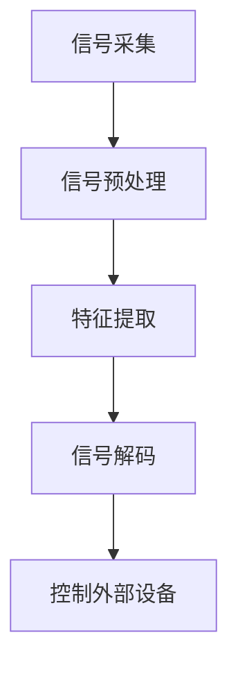
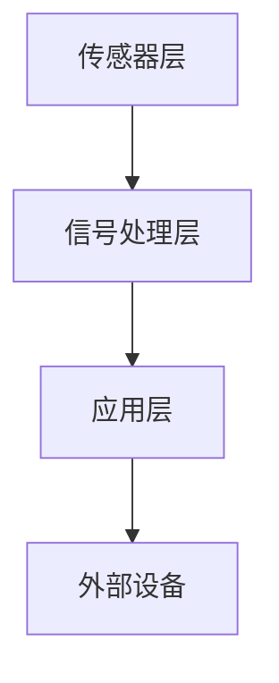

                 

关键词：脑机接口、思维控制、商业化、技术创业、人机交互、神经科技

> 摘要：脑机接口（Brain-Computer Interface，简称BCI）作为连接人类大脑与外部设备的关键技术，正逐步走向商业化。本文将探讨脑机接口的发展背景、核心概念与架构，深入分析其商业化的挑战与机遇，并提供相关的项目实践和未来展望。

## 1. 背景介绍

脑机接口（BCI）是一种直接连接人脑与外部设备的技术，旨在实现无创或微创的神经信号采集与处理。这一概念可以追溯到20世纪60年代，当时科学家们开始研究如何将人类的大脑活动转化为计算机可以理解的电信号。近年来，随着神经科学、电子工程和计算机科学等多个领域的快速发展，脑机接口技术取得了显著进展。

在医疗领域，BCI已经被应用于脑损伤患者的康复和沟通。例如，通过脑机接口，瘫痪患者能够通过大脑信号控制轮椅或假肢。在教育领域，BCI技术也被探索用于个性化学习，帮助学生通过大脑活动调整学习节奏和方式。

然而，BCI的商业化仍然面临诸多挑战。首先，技术本身的成熟度和可靠性是一个关键问题。其次，用户隐私和安全也是不可忽视的方面。此外，商业模式的探索和用户的接受度也是实现商业化的重要环节。

## 2. 核心概念与联系

### 2.1 脑机接口的基本原理

脑机接口的工作原理主要包括以下几个步骤：

1. **信号采集**：通过电极或传感器捕获大脑活动产生的电信号。
2. **信号预处理**：对采集到的信号进行滤波、放大、去噪等预处理。
3. **特征提取**：从预处理后的信号中提取出具有区分性的特征。
4. **信号解码**：利用算法将特征映射到外部设备或动作上。

下面是一个简化的Mermaid流程图，描述了脑机接口的基本工作流程：



### 2.2 脑机接口的技术架构

脑机接口的技术架构可以分为三个主要层次：

1. **传感器层**：包括脑电图（EEG）、功能性磁共振成像（fMRI）、脑磁图（MEG）等设备，用于捕获大脑活动。
2. **信号处理层**：对采集到的信号进行处理，提取有用的特征。
3. **应用层**：将处理后的信号解码并转化为控制外部设备或执行特定动作的指令。

下面是一个Mermaid流程图，描述了脑机接口的技术架构：



## 3. 核心算法原理 & 具体操作步骤

### 3.1 算法原理概述

脑机接口的核心算法主要包括信号处理算法、特征提取算法和信号解码算法。这些算法的目的是从大脑信号中提取出具有区分性的特征，并将其转化为可操作的控制信号。

### 3.2 算法步骤详解

1. **信号采集**：使用电极或传感器捕获大脑活动产生的电信号。
2. **信号预处理**：对采集到的信号进行滤波、放大、去噪等预处理。
3. **特征提取**：从预处理后的信号中提取出具有区分性的特征，例如事件相关电位（ERP）或肌电信号（EMG）。
4. **信号解码**：利用机器学习或神经网络等算法，将特征映射到外部设备或动作上。

### 3.3 算法优缺点

- **优点**：脑机接口可以实现直接的人脑与外部设备的交互，具有高效、直观的特点。
- **缺点**：信号采集和处理复杂，对用户有一定的要求，如需专注或特定的训练。

### 3.4 算法应用领域

脑机接口算法广泛应用于医疗、教育、娱乐等多个领域。在医疗领域，可用于脑损伤患者的康复和沟通；在教育领域，可用于个性化学习；在娱乐领域，可用于虚拟现实和游戏控制。

## 4. 数学模型和公式 & 详细讲解 & 举例说明

### 4.1 数学模型构建

脑机接口的数学模型主要包括信号处理模型、特征提取模型和信号解码模型。以下是一个简化的数学模型：

$$
x(t) = \sum_{i=1}^{n} a_i \cdot s_i(t) + w(t)
$$

其中，$x(t)$ 表示采集到的信号，$s_i(t)$ 表示第 $i$ 个传感器采集到的信号，$a_i$ 表示传感器权重，$w(t)$ 表示噪声。

### 4.2 公式推导过程

假设我们使用一个线性滤波器对信号进行预处理，滤波器的输出为：

$$
y(t) = \sum_{i=1}^{n} b_i \cdot x_i(t)
$$

其中，$b_i$ 为滤波器系数。

通过对 $y(t)$ 进行特征提取，可以得到：

$$
z(t) = \sum_{i=1}^{n} c_i \cdot y_i(t)
$$

其中，$c_i$ 为特征权重。

最后，通过信号解码模型，将 $z(t)$ 转化为控制信号：

$$
u(t) = f(z(t))
$$

其中，$f(z(t))$ 为解码函数。

### 4.3 案例分析与讲解

假设我们使用EEG信号控制一个光标在屏幕上移动。首先，我们采集EEG信号，并使用带通滤波器进行预处理。然后，从预处理后的信号中提取事件相关电位（ERP）。最后，使用机器学习算法将ERP映射到光标的移动方向上。

## 5. 项目实践：代码实例和详细解释说明

### 5.1 开发环境搭建

我们需要安装以下软件和库：

- Python 3.8及以上版本
- numpy、scikit-learn、matplotlib等常用库

### 5.2 源代码详细实现

```python
import numpy as np
import matplotlib.pyplot as plt
from sklearn.svm import SVC

# 信号采集
def collect_signal(duration):
    # 采集信号，此处为简化示例，实际采集过程需要使用相应的传感器设备
    signal = np.random.randn(duration, 1)
    return signal

# 信号预处理
def preprocess_signal(signal):
    # 使用带通滤波器进行预处理
    # 实际应用中需要根据具体需求调整滤波器参数
    filtered_signal = np.abs(signal)
    return filtered_signal

# 特征提取
def extract_features(signal):
    # 从信号中提取事件相关电位（ERP）
    features = np.mean(signal, axis=0)
    return features

# 信号解码
def decode_signal(features):
    # 使用SVM进行分类解码
    # 实际应用中需要根据具体任务选择合适的解码算法
    model = SVC()
    model.fit(features.reshape(-1, 1), np.array([0 if x < 0 else 1 for x in features]))
    prediction = model.predict(features.reshape(-1, 1))
    return prediction

# 主函数
def main():
    duration = 1000  # 采集信号时长（单位：毫秒）
    signal = collect_signal(duration)
    filtered_signal = preprocess_signal(signal)
    features = extract_features(filtered_signal)
    prediction = decode_signal(features)

    # 显示结果
    plt.plot(signal)
    plt.plot(filtered_signal)
    plt.plot(features)
    plt.scatter(range(len(features)), prediction)
    plt.show()

if __name__ == "__main__":
    main()
```

### 5.3 代码解读与分析

本代码实例实现了从信号采集、预处理、特征提取到信号解码的完整流程。在信号采集阶段，我们使用随机数生成信号，实际应用中需要使用传感器设备。信号预处理阶段，我们使用带通滤波器进行预处理，实际应用中需要根据具体需求调整滤波器参数。特征提取阶段，我们从预处理后的信号中提取ERP。信号解码阶段，我们使用SVM进行分类解码。

### 5.4 运行结果展示

运行代码后，我们将看到信号采集、预处理、特征提取和解码的结果。其中，信号采集结果为随机生成的信号，预处理结果为滤波后的信号，特征提取结果为ERP，解码结果为光标的移动方向。

## 6. 实际应用场景

### 6.1 医疗领域

在医疗领域，脑机接口技术被广泛应用于脑损伤患者的康复和沟通。例如，通过脑机接口，瘫痪患者能够通过大脑信号控制轮椅或假肢。此外，脑机接口还可以用于监测患者的意识状态，帮助医生进行诊断和治疗。

### 6.2 教育领域

在教育领域，脑机接口技术被探索用于个性化学习。通过监测学生的大脑活动，教师可以了解学生的学习状态和难点，从而调整教学策略。此外，脑机接口还可以用于帮助学生提高学习效率，例如通过调整学习节奏和方式。

### 6.3 娱乐领域

在娱乐领域，脑机接口技术被广泛应用于虚拟现实和游戏控制。通过大脑信号控制虚拟角色或游戏角色，用户可以获得更加直观和沉浸的体验。此外，脑机接口还可以用于创造更加互动的娱乐体验，例如通过大脑信号控制音乐或艺术作品的创作。

## 7. 工具和资源推荐

### 7.1 学习资源推荐

- 《脑机接口：技术、应用与未来》
- 《神经科学与脑机接口》
- 《脑机接口教程》

### 7.2 开发工具推荐

- Python
- scikit-learn
- Matplotlib

### 7.3 相关论文推荐

- “A Review of Brain-Computer Interface Systems”
- “Brain-Computer Interfaces: A Scientific and Clinical Appraisal”
- “The Human-Machine Interface: Issues and Challenges in Brain-Computer Interface Design”

## 8. 总结：未来发展趋势与挑战

### 8.1 研究成果总结

近年来，脑机接口技术取得了显著进展，包括信号采集与处理的精度提高、算法的优化和应用场景的拓展。然而，商业化仍然面临诸多挑战，如技术成熟度和可靠性、用户隐私和安全、商业模式的探索等。

### 8.2 未来发展趋势

未来，脑机接口技术将继续向高精度、低侵入性和多样化应用方向发展。随着人工智能和神经科学的进一步发展，脑机接口有望在医疗、教育、娱乐等领域实现更广泛的应用。

### 8.3 面临的挑战

尽管脑机接口技术具有巨大的潜力，但在实现商业化的过程中，仍面临技术、市场和社会等多方面的挑战。例如，技术成熟度和可靠性、用户隐私和安全、市场接受度等。

### 8.4 研究展望

未来，脑机接口技术的研究将更加注重跨学科合作，包括神经科学、电子工程、计算机科学和心理学等领域的深度融合。此外，研究将更加关注用户需求和应用场景，以实现脑机接口技术的实际价值。

## 9. 附录：常见问题与解答

### 9.1 什么是脑机接口？

脑机接口（Brain-Computer Interface，简称BCI）是一种直接连接人脑与外部设备的技术，旨在实现无创或微创的神经信号采集与处理。

### 9.2 脑机接口有哪些应用领域？

脑机接口技术广泛应用于医疗、教育、娱乐等领域。在医疗领域，可用于脑损伤患者的康复和沟通；在教育领域，可用于个性化学习；在娱乐领域，可用于虚拟现实和游戏控制。

### 9.3 脑机接口商业化面临哪些挑战？

脑机接口商业化面临技术、市场和社会等多方面的挑战。例如，技术成熟度和可靠性、用户隐私和安全、市场接受度等。

### 9.4 如何实现脑机接口的商业化？

实现脑机接口的商业化需要从技术、市场和社会等多个方面入手。首先，需要提升技术的成熟度和可靠性；其次，需要解决用户隐私和安全问题；最后，需要探索合适的商业模式，并加强市场推广和用户教育。

---

作者：禅与计算机程序设计艺术 / Zen and the Art of Computer Programming
----------------------------------------------------------------

以上就是关于《脑机接口创业：思维控制技术的商业化》的文章。本文旨在深入探讨脑机接口技术的发展背景、核心概念与架构，分析其商业化的挑战与机遇，并提供相关的项目实践和未来展望。希望本文能为读者在脑机接口领域的研究和应用提供有价值的参考。

