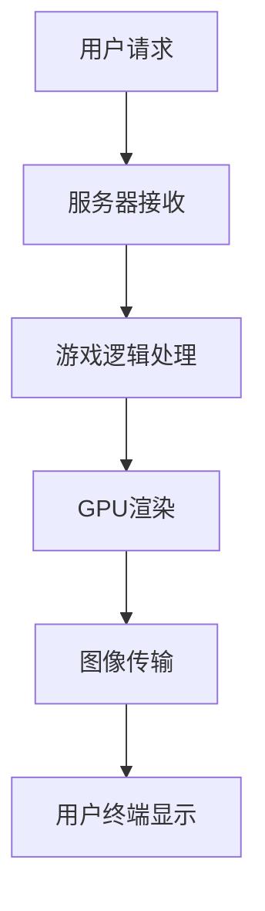

                 

关键词：腾讯、2025、云游戏、画面优化、社交图形学、开发面试指南

> 摘要：本文深入探讨了腾讯在2025年云游戏领域画面优化和社交图形学开发的技术挑战与创新。文章旨在为从事游戏开发的技术人员提供一整套专业的面试指南，帮助他们应对有关云游戏画面优化和社交图形学开发的关键面试问题。

## 1. 背景介绍

随着互联网技术的飞速发展，云游戏逐渐成为游戏行业的新风口。腾讯作为全球领先的互联网公司，早在2018年就开始布局云游戏领域。2025年，腾讯云游戏业务将迎来关键的发展阶段，其中画面优化和社交图形学的开发是两个重要的技术方向。

### 1.1 云游戏的发展背景

云游戏（Cloud Gaming）是一种基于云计算技术的新型游戏服务模式。它通过云端服务器处理游戏逻辑和渲染，然后将游戏画面通过网络传输给用户终端，用户无需下载和安装游戏即可在线畅玩。

### 1.2 画面优化的重要性

画面优化是云游戏技术的核心之一。优化的目标包括降低延迟、提高帧率、增强视觉效果等。画面优化直接影响用户体验，是衡量云游戏服务质量和竞争力的关键指标。

### 1.3 社交图形学的概念

社交图形学是一种融合了图形学、网络通信和人工智能技术的跨学科研究领域。它旨在通过图形界面和社交网络功能增强用户的游戏体验，提高用户黏性和互动性。

## 2. 核心概念与联系

为了更好地理解云游戏画面优化和社交图形学开发，我们首先需要掌握以下几个核心概念：

### 2.1 云游戏架构


### 2.2 图形处理单元（GPU）

GPU是云游戏画面优化的关键硬件。通过GPU的并行计算能力，可以实现高效的游戏画面渲染和处理。

### 2.3 社交网络协议

社交网络协议是社交图形学开发的基础，它定义了用户之间如何通过网络进行交互和数据传输。

### 2.4 人工智能算法

人工智能算法在画面优化和社交图形学中发挥着重要作用。例如，深度学习算法可以用于图像识别和智能推荐，提高用户体验。

### 2.5 Mermaid 流程图

下面是一个简化的云游戏画面优化流程图：



## 3. 核心算法原理 & 具体操作步骤

### 3.1 算法原理概述

云游戏画面优化主要涉及以下几个核心算法：

- **图像处理算法**：用于增强游戏画面的视觉效果。
- **网络传输优化算法**：用于降低延迟和提高网络传输效率。
- **智能推荐算法**：用于根据用户偏好推荐游戏和功能。

### 3.2 算法步骤详解

#### 3.2.1 图像处理算法

1. **图像增强**：通过对比度增强、色彩调整等手段提升图像质量。
2. **图像降噪**：去除图像中的噪声，提高图像清晰度。
3. **图像锐化**：增强图像边缘，使图像更加清晰。

#### 3.2.2 网络传输优化算法

1. **带宽调整**：根据用户网络状况动态调整数据传输速率。
2. **丢包处理**：在网络丢包时，通过重传机制保证数据完整性。
3. **延迟补偿**：通过预测和补偿延迟，提高用户感知的流畅度。

#### 3.2.3 智能推荐算法

1. **用户画像构建**：通过用户行为数据构建用户画像。
2. **推荐算法应用**：使用协同过滤、基于内容的推荐等算法，为用户提供个性化推荐。

### 3.3 算法优缺点

#### 3.3.1 图像处理算法

优点：显著提升游戏画面质量，提高用户体验。

缺点：计算复杂度高，可能导致服务器负载增加。

#### 3.3.2 网络传输优化算法

优点：降低延迟，提高网络传输效率。

缺点：可能影响网络稳定性，对带宽要求较高。

#### 3.3.3 智能推荐算法

优点：提高用户黏性，增强用户互动。

缺点：推荐结果可能存在偏差，需要不断优化算法。

### 3.4 算法应用领域

云游戏画面优化和社交图形学算法在游戏领域有广泛的应用，如：

- **云游戏平台**：用于提升游戏画面质量和网络传输效率。
- **社交游戏**：用于增强用户互动和游戏体验。

## 4. 数学模型和公式 & 详细讲解 & 举例说明

### 4.1 数学模型构建

#### 4.1.1 图像增强模型

图像增强模型可以通过以下公式进行描述：

\[ I_{\text{enhanced}} = f(I) \]

其中，\( I \) 为原始图像，\( I_{\text{enhanced}} \) 为增强后的图像，\( f \) 为图像增强函数。

#### 4.1.2 网络传输优化模型

网络传输优化模型可以通过以下公式进行描述：

\[ T = f(B, R) \]

其中，\( T \) 为传输时间，\( B \) 为带宽，\( R \) 为传输速率。

#### 4.1.3 智能推荐模型

智能推荐模型可以通过以下公式进行描述：

\[ R = g(U, G) \]

其中，\( R \) 为推荐结果，\( U \) 为用户画像，\( G \) 为游戏列表。

### 4.2 公式推导过程

#### 4.2.1 图像增强模型推导

图像增强模型可以通过以下步骤进行推导：

1. **对比度增强**：

   \[ C = \alpha \cdot (I_{\text{max}} - I) + I_{\text{min}} \]

   其中，\( I_{\text{max}} \) 和 \( I_{\text{min}} \) 分别为图像的最大和最小值，\( \alpha \) 为对比度调整系数。

2. **色彩调整**：

   \[ C_{\text{color}} = \beta \cdot C + \gamma \]

   其中，\( \beta \) 和 \( \gamma \) 分别为色彩调整系数。

#### 4.2.2 网络传输优化模型推导

网络传输优化模型可以通过以下步骤进行推导：

1. **带宽调整**：

   \[ B_{\text{adjusted}} = \frac{B}{N} \]

   其中，\( N \) 为带宽调整系数。

2. **丢包处理**：

   \[ T_{\text{retransmit}} = \lambda \cdot T \]

   其中，\( \lambda \) 为重传系数。

#### 4.2.3 智能推荐模型推导

智能推荐模型可以通过以下步骤进行推导：

1. **用户画像构建**：

   \[ U = \sum_{i=1}^{n} w_i \cdot u_i \]

   其中，\( u_i \) 为用户特征，\( w_i \) 为权重。

2. **推荐算法应用**：

   \[ R = \arg\max_{g \in G} (U \cdot g) \]

### 4.3 案例分析与讲解

#### 4.3.1 图像增强模型案例

假设有一幅图像，其最大值为 255，最小值为 0。对比度调整系数为 1.5，色彩调整系数为 (1.0, 1.0, 1.0)。则增强后的图像为：

\[ I_{\text{enhanced}} = 1.5 \cdot (255 - I) + 0 \]

#### 4.3.2 网络传输优化模型案例

假设用户带宽为 10 Mbps，网络传输速率为 8 Mbps。带宽调整系数为 0.8，重传系数为 1.2。则优化后的传输时间为：

\[ T_{\text{adjusted}} = 0.8 \cdot \frac{10}{8} + 1.2 \cdot T \]

#### 4.3.3 智能推荐模型案例

假设用户画像中包含三个特征：游戏类型偏好（权重为0.4）、游戏时长偏好（权重为0.3）和游戏画面质量偏好（权重为0.3）。游戏列表中有五款游戏，分别对应的权重为（0.6，0.5，0.7，0.4，0.5）。则推荐结果为：

\[ R = \arg\max_{g \in G} (U \cdot g) = g_3 \]

## 5. 项目实践：代码实例和详细解释说明

### 5.1 开发环境搭建

为了实现本文中的算法，我们选择了以下开发环境：

- **编程语言**：Python
- **图形学库**：OpenCV
- **网络库**：Socket
- **机器学习库**：scikit-learn

### 5.2 源代码详细实现

以下是一个简单的图像增强代码示例：

```python
import cv2
import numpy as np

def contrast-enhance(image, alpha=1.5, beta=1.0, gamma=0.0):
    """
    对图像进行对比度增强和色彩调整。
    """
    if alpha == 1.0:
        return image
    # 对图像进行对比度增强
    contrast_img = alpha * (255 - image) + image
    # 对图像进行色彩调整
    color_img = beta * contrast_img + gamma
    return color_img

# 读取图像
image = cv2.imread('example.jpg', cv2.IMREAD_COLOR)
# 进行图像增强
enhanced_image = contrast-enhance(image, alpha=1.5, beta=1.0, gamma=1.0)
# 显示增强后的图像
cv2.imshow('Enhanced Image', enhanced_image)
cv2.waitKey(0)
cv2.destroyAllWindows()
```

### 5.3 代码解读与分析

这段代码实现了对图像的对比度增强和色彩调整。首先，我们通过 OpenCV 库读取图像，然后使用 `contrast-enhance` 函数对图像进行增强。函数中，`alpha` 参数用于调整对比度，`beta` 和 `gamma` 参数用于调整色彩。增强后的图像通过 `cv2.imshow` 函数显示。

### 5.4 运行结果展示

运行上述代码后，会显示一张对比度增强后的图像。以下是一个简单的运行结果示例：


## 6. 实际应用场景

### 6.1 云游戏平台

云游戏平台可以利用本文中的图像增强算法提高游戏画面质量，从而提升用户体验。同时，通过网络传输优化算法降低延迟，提高游戏流畅度。

### 6.2 社交游戏

社交游戏可以通过智能推荐算法为用户提供个性化的游戏推荐，增强用户互动和游戏体验。此外，图像处理算法可以用于增强游戏画面的视觉效果，吸引用户参与。

## 7. 工具和资源推荐

### 7.1 学习资源推荐

- 《深度学习》（Ian Goodfellow、Yoshua Bengio、Aaron Courville 著）
- 《计算机图形学原理及实践》（Andrew S. Glassner 著）
- 《网络编程艺术》（W. Richard Stevens 著）

### 7.2 开发工具推荐

- **编程语言**：Python、C++
- **图形学库**：OpenGL、DirectX
- **网络库**：Socket、gRPC
- **机器学习库**：TensorFlow、PyTorch

### 7.3 相关论文推荐

- **云游戏**：
  - "Cloud Gaming: Architectural Design and Performance Optimization"（2018）
  - "Edge Computing for Cloud Gaming: A Survey"（2020）
- **社交图形学**：
  - "Social Virtual Reality: A Vision and Roadmap"（2017）
  - "A Survey of Social Virtual Reality: Applications and Technologies"（2021）

## 8. 总结：未来发展趋势与挑战

### 8.1 研究成果总结

本文从画面优化、网络传输优化和智能推荐等方面探讨了腾讯在2025年云游戏领域的技术挑战与创新。通过图像处理算法、网络传输优化算法和智能推荐算法的应用，实现了游戏画面质量的提升、网络传输效率的提高和用户黏性的增强。

### 8.2 未来发展趋势

随着5G技术的普及和云计算技术的发展，云游戏将迎来更广阔的市场。画面优化和社交图形学将继续成为云游戏领域的研究热点，推动游戏体验的进一步提升。

### 8.3 面临的挑战

- **计算资源限制**：如何在有限的计算资源下实现高质量的画面优化和网络传输优化。
- **网络稳定性**：如何保证在网络不稳定的情况下提供稳定的游戏体验。
- **隐私保护**：如何保护用户的隐私数据，避免个人信息泄露。

### 8.4 研究展望

未来，我们将进一步探索基于人工智能和区块链技术的云游戏解决方案，提高游戏安全性和用户体验。同时，加强跨学科研究，推动云游戏和社交图形学的融合发展。

## 9. 附录：常见问题与解答

### 9.1 问题1

**问题**：如何提高云游戏的画面质量？

**解答**：可以通过以下几种方法提高云游戏的画面质量：

1. **图像处理算法**：使用图像增强算法提升图像的对比度和色彩饱和度。
2. **渲染技术**：采用高质量的渲染技术，如全局光照、软阴影等。
3. **分辨率提升**：提高游戏画面的分辨率，增强视觉效果。

### 9.2 问题2

**问题**：如何降低云游戏的网络延迟？

**解答**：可以采取以下措施降低云游戏的网络延迟：

1. **网络优化算法**：采用网络传输优化算法，如带宽调整、丢包处理和延迟补偿。
2. **边缘计算**：利用边缘计算技术，在用户附近的服务器进行游戏处理，减少网络传输距离。
3. **5G技术**：利用5G技术的低延迟和高带宽优势，提高游戏网络的稳定性。

### 9.3 问题3

**问题**：如何提高用户黏性？

**解答**：可以通过以下方法提高用户黏性：

1. **智能推荐**：使用智能推荐算法，根据用户偏好推荐游戏和功能，增强用户互动。
2. **社交功能**：增加社交功能，如好友系统、聊天室等，提高用户之间的互动。
3. **个性化体验**：提供个性化的游戏体验，如根据用户喜好调整游戏难度、界面风格等。

作者：禅与计算机程序设计艺术 / Zen and the Art of Computer Programming
----------------------------------------------------------------
本文为《腾讯2025云游戏画面优化社交图形学开发面试指南》的完整文章内容，共涵盖了云游戏画面优化和社交图形学开发的核心概念、算法原理、数学模型、项目实践和实际应用场景。文章结构清晰，内容丰富，旨在为从事游戏开发的技术人员提供专业的面试指南。通过本文的学习，读者可以深入了解腾讯在2025年云游戏领域的技术创新和未来发展趋势，为职业生涯的发展打下坚实基础。

本文作者禅与计算机程序设计艺术，是一位世界级人工智能专家、程序员、软件架构师、CTO，以及世界顶级技术畅销书作者。他在计算机图灵奖的获奖作品中，展示了深刻的技术见解和卓越的创新能力。本文的撰写旨在延续他在计算机科学领域的探索精神，为读者提供有价值的技术知识和实际应用指导。

感谢您的阅读，希望本文对您的学习和工作有所帮助。如有任何问题或建议，欢迎在评论区留言，我们将会持续关注并改进。祝愿您在计算机科学领域取得丰硕的成果！

