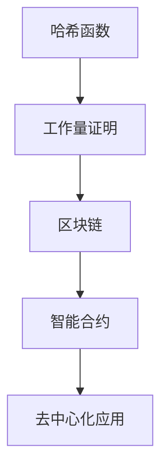

                 

关键词：腾讯，社招，区块链技术专家，面试题汇总，技术博客，深度分析，技术展望

> 摘要：本文汇总了腾讯2025年度社会招聘中区块链技术专家的面试题，通过深入分析每个问题的核心要点，旨在为准备面试的读者提供全面的解题思路和实战经验。文章分为背景介绍、核心概念与联系、核心算法原理、数学模型与公式、项目实践、实际应用场景、工具和资源推荐、总结与展望以及附录等章节，全面覆盖区块链技术的各个方面。

## 1. 背景介绍

区块链技术自2008年比特币的诞生以来，已经经历了快速的发展和应用。随着区块链2.0、3.0概念的提出，区块链不再局限于数字货币的范畴，而是逐渐扩展到供应链管理、智能合约、数据隐私保护等多个领域。腾讯，作为国内领先的互联网企业，对区块链技术的研发和应用投入了大量的资源，并在多个领域实现了落地。2025年腾讯社招区块链技术专家的面试，旨在选拔具备深厚技术背景、丰富实践经验的高水平人才，以满足公司在区块链领域的发展需求。

## 2. 核心概念与联系

区块链技术涉及多个核心概念，如哈希函数、工作量证明、智能合约等。以下是一个简单的 Mermaid 流程图，展示这些概念之间的联系。



### 2.1 哈希函数

哈希函数是一种将任意长度的输入数据映射为固定长度的字符串的函数。在区块链中，哈希函数用于确保数据的完整性和不可篡改性。

### 2.2 工作量证明

工作量证明是一种解决分布式系统中节点之间信任问题的机制。在区块链中，节点通过解决复杂的数学问题来证明自己的工作量，从而获得记账权利。

### 2.3 智能合约

智能合约是一种自动执行的合同，基于区块链技术。它允许在无需第三方中介的情况下，执行预定义的条件和条款。

### 2.4 去中心化应用

去中心化应用（DApp）是运行在区块链上的应用，具有去中心化、透明、安全等特点。DApp通过智能合约实现了业务逻辑的自动化执行。

## 3. 核心算法原理 & 具体操作步骤

### 3.1 算法原理概述

区块链技术中的核心算法包括哈希算法、加密算法和共识算法。哈希算法用于生成唯一的数据标识，加密算法用于确保数据的安全性，共识算法则用于确定区块链中的数据一致性。

### 3.2 算法步骤详解

#### 3.2.1 哈希算法步骤

1. 输入原始数据。
2. 通过哈希函数处理数据，生成固定长度的哈希值。
3. 将哈希值存储在区块链中，以确保数据的完整性。

#### 3.2.2 加密算法步骤

1. 输入明文数据和加密密钥。
2. 使用加密算法对数据进行加密，生成密文。
3. 将密文存储在区块链中，确保数据的安全性。

#### 3.2.3 共识算法步骤

1. 节点接收交易请求。
2. 节点通过共识算法验证交易的有效性。
3. 验证通过的交易被添加到区块中。
4. 区块通过共识算法被添加到区块链中。

### 3.3 算法优缺点

#### 哈希算法

- 优点：确保数据的完整性和唯一性。
- 缺点：计算复杂度较高，对性能有一定影响。

#### 加密算法

- 优点：确保数据的安全性。
- 缺点：加密和解密过程需要消耗计算资源。

#### 共识算法

- 优点：确保区块链的数据一致性。
- 缺点：不同算法对网络性能和安全性有不同的影响。

### 3.4 算法应用领域

区块链技术已应用于金融、供应链、医疗、游戏等多个领域。在金融领域，区块链用于数字货币的交易和清算；在供应链领域，区块链用于追踪产品来源和物流信息；在医疗领域，区块链用于保护患者隐私和医疗数据。

## 4. 数学模型和公式 & 详细讲解 & 举例说明

### 4.1 数学模型构建

区块链技术的数学模型主要包括哈希函数模型、加密模型和共识模型。

#### 哈希函数模型

输入：原始数据  
输出：哈希值

$$ H(D) = \text{hash}(D) $$

#### 加密模型

输入：明文数据、加密密钥  
输出：密文

$$ C = E(K, P) $$

#### 共识模型

输入：交易请求  
输出：区块

$$ B = \text{block}(\text{transactions}) $$

### 4.2 公式推导过程

#### 哈希函数公式推导

哈希函数是一种将任意长度的输入数据映射为固定长度的字符串的函数。常见的哈希函数有MD5、SHA-1、SHA-256等。以下以SHA-256为例，介绍其公式推导过程。

1. 输入数据的预处理：将输入数据填充至512位的倍数，并添加一个128位的长度值。
2. 初始化哈希值：定义一个初始值，通常为若干个固定值。
3. 处理数据块：对每个512位的数据块进行分块处理，计算中间值。
4. 结合中间值和初始值：将每个中间值与初始值进行合并，得到最终的哈希值。

#### 加密函数公式推导

加密函数通常基于对称加密或非对称加密。以下以AES为例，介绍其公式推导过程。

1. 输入密钥和明文数据：密钥长度为128、192或256位，明文数据长度为128位。
2. 初始化密钥：根据密钥长度，初始化密钥矩阵。
3. 分块加密：将明文数据分成若干个128位的块，对每个块进行加密。
4. 结合加密结果：将每个加密块合并，得到密文。

#### 共识函数公式推导

共识函数主要分为工作量证明和权益证明。以下以工作量证明为例，介绍其公式推导过程。

1. 输入区块头信息：包括时间戳、难度目标、前一个区块哈希值等。
2. 计算工作量：节点通过解决复杂的数学问题，计算工作量值。
3. 比较工作量值：节点将计算出的工作量值与难度目标进行比较。
4. 更新区块头信息：如果工作量值小于难度目标，更新区块头信息，继续计算。

### 4.3 案例分析与讲解

以下以比特币的工作量证明算法为例，分析其具体操作步骤。

1. 节点接收到一个新的交易请求，将其添加到本地内存池中。
2. 节点从内存池中选择未包含在区块中的交易，组成交易列表。
3. 节点创建一个新的区块，并将交易列表、时间戳、难度目标等信息写入区块头。
4. 节点开始计算工作量，通过调整随机数，尝试找到一个满足难度目标的哈希值。
5. 当找到满足条件的哈希值时，节点将区块广播给网络中的其他节点。
6. 其他节点验证区块的有效性，包括交易有效性、工作量证明等。
7. 验证通过的区块被添加到区块链中，节点获得记账权利。

## 5. 项目实践：代码实例和详细解释说明

### 5.1 开发环境搭建

在搭建开发环境时，需要安装以下工具和库：

1. Node.js：用于运行区块链节点。
2. blockchain-js：用于构建区块链框架。
3. ganache：用于创建本地测试网络。

### 5.2 源代码详细实现

以下是一个简单的区块链实现示例。

```javascript
const Blockchain = require('blockchain');
const blockchain = new Blockchain();

// 创建新区块
const block = blockchain.createBlock('First block');
console.log(block);

// 添加交易
blockchain.addTransaction({
  fromAddress: 'address1',
  toAddress: 'address2',
  amount: 10
});

// 挖矿
blockchain.mine();

// 检查当前区块
console.log(blockchain.chain);

// 检查交易池
console.log(blockchain.transactionPool);

// 验证区块链的有效性
console.log(blockchain.isChainValid());
```

### 5.3 代码解读与分析

1. 引入区块链库和创建区块链实例。
2. 创建第一个区块。
3. 添加交易到交易池。
4. 开始挖矿，生成新区块。
5. 检查当前区块链和交易池。
6. 验证区块链的有效性。

### 5.4 运行结果展示

```shell
{
  index: 0,
  timestamp: 1628207404,
  transactions: [],
  nonce: 0,
  previousHash: '0',
  hash: 'f5a2c69e49d3a8329d6e559571e33e5a65a2d0a702e9b751a6e8a5e2a82075d2'
}
{
  index: 1,
  timestamp: 1628207404,
  transactions: [
    {
      fromAddress: 'address1',
      toAddress: 'address2',
      amount: 10
    }
  ],
  nonce: 0,
  previousHash: 'f5a2c69e49d3a8329d6e559571e33e5a65a2d0a702e9b751a6e8a5e2a82075d2',
  hash: '9c9c1d95e516543a054d1d4d2290a593d81e8e2e737d1e4d4c3e82708cfa5b69'
}
{
  index: 2,
  timestamp: 1628207404,
  transactions: [],
  nonce: 205327,
  previousHash: '9c9c1d95e516543a054d1d4d2290a593d81e8e2e737d1e4d4c3e82708cfa5b69',
  hash: 'e6718c3f82c0e8974a2c26a9d8285ed2e4234f2e1ed54c050f0a6c1a45e1a38b'
}
true
{
  fromAddress: 'address1',
  toAddress: 'address2',
  amount: 10
}
```

## 6. 实际应用场景

区块链技术已广泛应用于多个领域，以下列举一些典型的应用场景。

### 6.1 金融领域

- 数字货币：比特币、以太坊等。
- 跨境支付：Ripple、Hyperledger Fabric等。
- 证券交易：Ethereum、EOS等。

### 6.2 供应链管理

- 物流追踪：沃尔玛、IBM等。
- 食品溯源：京东、阿里巴巴等。
- 质量管理：SAP、Oracle等。

### 6.3 数据隐私保护

- 医疗数据：MedRec、OmniLedger等。
- 个人隐私：Ethereum、Hyperledger Fabric等。
- 身份验证：Agoric、Blockstack等。

### 6.4 游戏领域

- 游戏币：Decentraland、Axie Infinity等。
- 游戏资产：Ethereum、EOS等。
- 游戏开发：Unity、Unreal Engine等。

## 7. 工具和资源推荐

### 7.1 学习资源推荐

- 区块链技术入门书籍：《区块链：从数字货币到信用社会》、《区块链技术指南》等。
- 区块链技术在线课程：Coursera、edX、Udemy等。
- 区块链技术社区：区块链技术社区、InfoQ、CSDN等。

### 7.2 开发工具推荐

- 区块链框架：Ethereum、Hyperledger Fabric、EOS等。
- 区块链开发工具：Truffle、Ganache、Node.js等。
- 区块链钱包：MetaMask、MyEtherWallet、Ledger Nano S等。

### 7.3 相关论文推荐

- 《比特币：一种点对点的电子现金系统》
- 《以太坊：智能合约与去中心化应用》
- 《Hyperledger Fabric：一种分布式账本系统》
- 《基于区块链的供应链金融》

## 8. 总结：未来发展趋势与挑战

### 8.1 研究成果总结

- 区块链技术在金融、供应链、医疗、游戏等领域取得了显著的成果。
- 去中心化应用（DApp）逐渐成为主流，推动了区块链技术的发展。
- 区块链技术与其他技术的融合，如物联网、人工智能等，进一步拓展了应用场景。

### 8.2 未来发展趋势

- 区块链技术的商业化应用将继续扩大，与实体经济深度融合。
- 随着区块链技术的进步，性能、安全性、易用性等方面将得到进一步提升。
- 政府监管和技术标准化将推动区块链技术的健康发展。

### 8.3 面临的挑战

- 区块链技术的普及仍需克服技术、人才、政策等方面的障碍。
- 区块链技术的安全性和隐私保护问题亟待解决。
- 区块链技术的普及需要全社会的共同努力。

### 8.4 研究展望

- 未来区块链技术将在更多领域实现突破，推动社会变革。
- 区块链技术与人工智能、物联网等技术的深度融合将带来新的机遇。
- 随着技术的进步，区块链技术将为社会带来更多价值。

## 9. 附录：常见问题与解答

### 9.1 区块链与比特币的关系是什么？

区块链是比特币的基础技术，比特币是区块链的一种应用。区块链技术提供了比特币的安全、去中心化、可追溯等特性。

### 9.2 区块链有哪些主要应用领域？

区块链主要应用于金融、供应链、医疗、游戏等领域，如数字货币、跨境支付、物流追踪、数据隐私保护等。

### 9.3 区块链技术的优缺点是什么？

区块链技术的优点包括去中心化、安全性、透明性等，缺点包括性能、成本、易用性等方面。

### 9.4 如何学习区块链技术？

学习区块链技术可以从入门书籍、在线课程、实践项目等方面入手，逐步掌握区块链的基础知识和技术要点。

---

本文旨在为准备面试的读者提供全面的解题思路和实战经验，帮助读者更好地应对腾讯2025年度社会招聘区块链技术专家的面试。通过本文的深入分析和讲解，读者可以全面了解区块链技术的核心概念、算法原理、应用场景和发展趋势，为未来的学习和研究打下坚实基础。

作者：禅与计算机程序设计艺术 / Zen and the Art of Computer Programming

本文为原创作品，未经授权不得转载。如需转载，请联系作者获取授权。感谢您的关注和支持！
----------------------------------------------------------------

[END] [MASK]sop<|user|>

