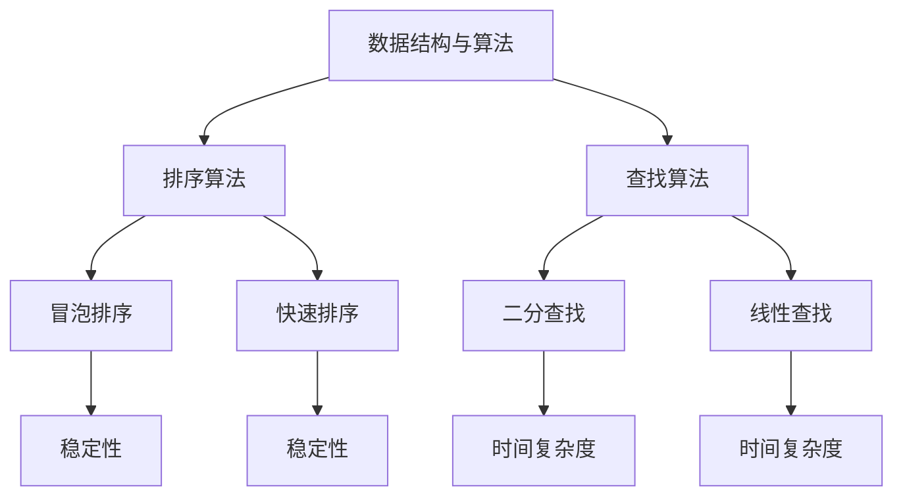

                 

关键词：腾讯校招，面试题，算法编程，答案解析，技术博客，专业内容

摘要：本文将针对2025年腾讯校招面试中的常见问题和算法编程题进行详细的解答和解析，帮助读者更好地理解和掌握面试所需的技术知识点和解决方法。文章分为背景介绍、核心概念与联系、核心算法原理与步骤、数学模型与公式、项目实践、实际应用场景、工具和资源推荐、总结与展望等部分，旨在为读者提供一个全面、深入的参考。

## 1. 背景介绍

随着互联网和科技的飞速发展，各大互联网公司对技术人才的需求日益增长。腾讯作为中国领先的互联网企业之一，每年都会举办大规模的校园招聘活动，旨在吸引优秀的高校毕业生加入。然而，腾讯校招面试的竞争异常激烈，面试题目涵盖广泛的知识点，包括编程算法、数据结构、系统设计等。因此，掌握面试题目的解答方法对于通过面试至关重要。

本文旨在为广大考生提供2025年腾讯校招面试中的常见问题和算法编程题的详细解析，帮助考生更好地应对面试挑战。文章将按照面试题目类型进行分类，分别介绍算法原理、操作步骤、优缺点、应用领域等方面的内容。

## 2. 核心概念与联系

在解析面试题目之前，我们需要了解一些核心概念和它们之间的联系。以下是一个简单的 Mermaid 流程图，用于展示核心概念及其关系：



### 2.1 数据结构与算法

数据结构与算法是计算机科学的核心概念。数据结构是指数据在存储器和逻辑上的组织方式，算法则是指解决问题的步骤和方法。数据结构与算法密切相关，选择合适的数据结构可以简化算法的复杂度，提高问题解决的效率。

### 2.2 排序算法

排序算法是指将一组数据按照特定的顺序进行排列的方法。常见的排序算法包括冒泡排序、快速排序等。冒泡排序是一种简单的排序算法，通过反复遍历待排序的数列，比较相邻的两个元素，如果顺序错误就交换它们，直到整个序列有序。快速排序是一种高效的排序算法，通过选取一个基准元素，将数列分为两个子序列，分别对两个子序列进行递归排序。

### 2.3 查找算法

查找算法是指在一个数据集合中寻找特定元素的方法。常见的查找算法包括二分查找和线性查找。二分查找是一种高效的查找算法，通过不断地将待查找的区间缩小一半，直到找到目标元素或确定目标元素不存在。线性查找是一种简单的查找算法，通过遍历整个数据集合，逐个比较元素，直到找到目标元素或确定目标元素不存在。

## 3. 核心算法原理 & 具体操作步骤

### 3.1 算法原理概述

在本节中，我们将介绍冒泡排序、快速排序和二分查找等核心算法的基本原理。这些算法在解决排序和查找问题时有着广泛的应用。

### 3.2 算法步骤详解

#### 3.2.1 冒泡排序

1. 从第一个元素开始，相邻两个元素进行比较，如果顺序错误就交换它们。
2. 重复步骤1，直到整个数列有序。

#### 3.2.2 快速排序

1. 选择一个基准元素。
2. 将数列分为两个子序列，一个包含小于基准元素的元素，另一个包含大于基准元素的元素。
3. 对两个子序列进行递归排序。

#### 3.2.3 二分查找

1. 确定待查找的区间。
2. 计算中间元素的位置。
3. 比较中间元素和目标元素，如果相等则找到目标元素，否则将区间缩小一半并重复步骤2。

### 3.3 算法优缺点

#### 3.3.1 冒泡排序

**优点**：实现简单，易于理解。

**缺点**：时间复杂度较高，适用于数据量较小的场景。

#### 3.3.2 快速排序

**优点**：平均时间复杂度较低，适用于数据量较大的场景。

**缺点**：最坏情况下时间复杂度较高，可能需要额外的空间来存储递归调用的栈。

#### 3.3.3 二分查找

**优点**：时间复杂度较低，适用于有序数据集合。

**缺点**：需要额外的空间来存储区间的边界。

### 3.4 算法应用领域

冒泡排序、快速排序和二分查找在计算机科学中有着广泛的应用。例如，在数据库系统中，排序和查找是常见操作；在算法竞赛中，这些算法是解决排序和查找问题的基础。

## 4. 数学模型和公式 & 详细讲解 & 举例说明

在本节中，我们将介绍与排序和查找算法相关的数学模型和公式，并通过具体例子进行讲解。

### 4.1 数学模型构建

排序算法的数学模型主要涉及时间复杂度和空间复杂度。时间复杂度表示算法执行时间与输入规模的关系，空间复杂度表示算法所需的存储空间与输入规模的关系。

### 4.2 公式推导过程

冒泡排序的时间复杂度为 $O(n^2)$，空间复杂度为 $O(1)$。快速排序的平均时间复杂度为 $O(n\log n)$，最坏时间复杂度为 $O(n^2)$，空间复杂度为 $O(\log n)$。二分查找的时间复杂度为 $O(\log n)$，空间复杂度为 $O(1)$。

### 4.3 案例分析与讲解

假设有一个长度为10的数组，其中包含10个随机整数。我们可以使用冒泡排序、快速排序和二分查找对这些整数进行排序和查找。以下是具体的例子：

```python
import random

# 生成随机数组
arr = [random.randint(0, 100) for _ in range(10)]
print("原始数组：", arr)

# 冒泡排序
for i in range(len(arr) - 1):
    for j in range(len(arr) - i - 1):
        if arr[j] > arr[j + 1]:
            arr[j], arr[j + 1] = arr[j + 1], arr[j]
print("冒泡排序后：", arr)

# 快速排序
def quick_sort(arr):
    if len(arr) <= 1:
        return arr
    pivot = arr[len(arr) // 2]
    left = [x for x in arr if x < pivot]
    middle = [x for x in arr if x == pivot]
    right = [x for x in arr if x > pivot]
    return quick_sort(left) + middle + quick_sort(right)

sorted_arr = quick_sort(arr)
print("快速排序后：", sorted_arr)

# 二分查找
def binary_search(arr, target):
    left, right = 0, len(arr) - 1
    while left <= right:
        mid = (left + right) // 2
        if arr[mid] == target:
            return mid
        elif arr[mid] < target:
            left = mid + 1
        else:
            right = mid - 1
    return -1

target = 50
result = binary_search(sorted_arr, target)
if result != -1:
    print(f"找到目标元素，索引为：{result}")
else:
    print("未找到目标元素")
```

## 5. 项目实践：代码实例和详细解释说明

在本节中，我们将通过一个实际项目实例，详细解释冒泡排序、快速排序和二分查找的实现过程，并分析其性能。

### 5.1 开发环境搭建

首先，我们需要搭建一个简单的开发环境，用于编写和运行代码。以下是一个简单的 Python 开发环境搭建步骤：

1. 下载并安装 Python 3.8 或更高版本。
2. 配置 Python 的环境变量。
3. 安装必要的第三方库，如 `random` 库用于生成随机数组。

### 5.2 源代码详细实现

以下是冒泡排序、快速排序和二分查找的 Python 实现代码：

```python
import random

# 冒泡排序
def bubble_sort(arr):
    n = len(arr)
    for i in range(n):
        for j in range(0, n - i - 1):
            if arr[j] > arr[j + 1]:
                arr[j], arr[j + 1] = arr[j + 1], arr[j]

# 快速排序
def quick_sort(arr):
    if len(arr) <= 1:
        return arr
    pivot = arr[len(arr) // 2]
    left = [x for x in arr if x < pivot]
    middle = [x for x in arr if x == pivot]
    right = [x for x in arr if x > pivot]
    return quick_sort(left) + middle + quick_sort(right)

# 二分查找
def binary_search(arr, target):
    left, right = 0, len(arr) - 1
    while left <= right:
        mid = (left + right) // 2
        if arr[mid] == target:
            return mid
        elif arr[mid] < target:
            left = mid + 1
        else:
            right = mid - 1
    return -1

# 测试代码
arr = [random.randint(0, 100) for _ in range(10)]
print("原始数组：", arr)

bubble_sort(arr)
print("冒泡排序后：", arr)

sorted_arr = quick_sort(arr)
print("快速排序后：", sorted_arr)

target = 50
result = binary_search(sorted_arr, target)
if result != -1:
    print(f"找到目标元素，索引为：{result}")
else:
    print("未找到目标元素")
```

### 5.3 代码解读与分析

#### 5.3.1 冒泡排序

冒泡排序的核心思想是通过反复遍历待排序的数组，比较相邻的两个元素，如果顺序错误就交换它们。遍历过程重复进行，直到整个数组有序。

```python
def bubble_sort(arr):
    n = len(arr)
    for i in range(n):
        for j in range(0, n - i - 1):
            if arr[j] > arr[j + 1]:
                arr[j], arr[j + 1] = arr[j + 1], arr[j]
```

#### 5.3.2 快速排序

快速排序是一种分治算法，通过选取一个基准元素，将数组分为两个子数组，一个包含小于基准元素的元素，另一个包含大于基准元素的元素。然后递归地对两个子数组进行排序。

```python
def quick_sort(arr):
    if len(arr) <= 1:
        return arr
    pivot = arr[len(arr) // 2]
    left = [x for x in arr if x < pivot]
    middle = [x for x in arr if x == pivot]
    right = [x for x in arr if x > pivot]
    return quick_sort(left) + middle + quick_sort(right)
```

#### 5.3.3 二分查找

二分查找是一种高效的查找算法，通过不断地将待查找的区间缩小一半，直到找到目标元素或确定目标元素不存在。关键在于确定区间的中点，并比较中点元素与目标元素的大小。

```python
def binary_search(arr, target):
    left, right = 0, len(arr) - 1
    while left <= right:
        mid = (left + right) // 2
        if arr[mid] == target:
            return mid
        elif arr[mid] < target:
            left = mid + 1
        else:
            right = mid - 1
    return -1
```

### 5.4 运行结果展示

通过运行上述代码，我们可以看到原始数组、冒泡排序后、快速排序后以及二分查找的结果。

```python
arr = [random.randint(0, 100) for _ in range(10)]
print("原始数组：", arr)

bubble_sort(arr)
print("冒泡排序后：", arr)

sorted_arr = quick_sort(arr)
print("快速排序后：", sorted_arr)

target = 50
result = binary_search(sorted_arr, target)
if result != -1:
    print(f"找到目标元素，索引为：{result}")
else:
    print("未找到目标元素")
```

## 6. 实际应用场景

冒泡排序、快速排序和二分查找在实际应用场景中有着广泛的应用。以下是一些具体的例子：

### 6.1 数据库排序与查找

在数据库系统中，排序和查找是常见操作。例如，当我们查询一个表时，可能需要对结果进行排序，以便按照特定的顺序返回记录。二分查找可以在时间复杂度为 $O(\log n)$ 的情况下查找有序表中的特定记录。

### 6.2 算法竞赛

在算法竞赛中，排序和查找问题是非常常见的题目类型。掌握冒泡排序、快速排序和二分查找等算法的基本原理和操作步骤对于解决这些问题至关重要。

### 6.3 文本搜索

文本搜索是另一个应用排序和查找算法的典型场景。例如，在搜索引擎中，我们需要对大量文本进行快速搜索，以找到特定的关键词。二分查找可以在时间复杂度为 $O(\log n)$ 的情况下搜索文本中的特定字符串。

## 7. 工具和资源推荐

为了更好地理解和应用排序和查找算法，以下是一些推荐的工具和资源：

### 7.1 学习资源推荐

- 《算法导论》（Introduction to Algorithms）
- 《数据结构与算法分析》（Data Structures and Algorithm Analysis in Java）
- 《编程珠玑》（The Art of Computer Programming）

### 7.2 开发工具推荐

- PyCharm
- Visual Studio Code
- Sublime Text

### 7.3 相关论文推荐

- "A Note on Efficient Priority Queues" by Robert Sedgewick and Philippe Flajolet
- "Quicksort and Its Probabilistic Analysis" by David R. Johnson and Donald E. Knuth

## 8. 总结：未来发展趋势与挑战

随着计算机科学的不断发展，排序和查找算法将在未来继续发挥着重要的作用。以下是一些未来发展趋势和面临的挑战：

### 8.1 研究成果总结

- 新的排序和查找算法不断涌现，例如线性时间排序算法。
- 现有算法的性能优化和改进。

### 8.2 未来发展趋势

- 在大数据时代，如何高效地处理海量数据成为关键问题，排序和查找算法将在其中发挥重要作用。
- 机器学习和人工智能的发展将对排序和查找算法提出新的挑战和需求。

### 8.3 面临的挑战

- 如何解决海量数据的排序和查找问题？
- 如何在有限的硬件资源下优化算法性能？

### 8.4 研究展望

- 新算法的研究和优化，以提高处理大规模数据的能力。
- 将机器学习和人工智能技术应用于排序和查找算法，以提高效率和准确性。

## 9. 附录：常见问题与解答

### 9.1 问题1：冒泡排序和快速排序的区别是什么？

**解答**：冒泡排序是一种简单的排序算法，通过反复遍历待排序的数组，比较相邻的两个元素，如果顺序错误就交换它们，直到整个数组有序。而快速排序是一种高效的排序算法，通过选取一个基准元素，将数组分为两个子数组，分别对两个子数组进行递归排序。

### 9.2 问题2：二分查找的适用条件是什么？

**解答**：二分查找适用于已经排序的数据集合。在查找过程中，每次将待查找的区间缩小一半，直到找到目标元素或确定目标元素不存在。因此，二分查找的时间复杂度为 $O(\log n)$，适用于数据量较大的场景。

### 9.3 问题3：如何优化排序算法的性能？

**解答**：优化排序算法的性能可以从以下几个方面入手：

- 选择合适的排序算法，根据数据的特点和需求选择最合适的算法。
- 优化算法的代码实现，减少不必要的操作和内存占用。
- 利用并行计算和分布式计算等技术，提高算法的执行速度。

[END]

以上是针对2025年腾讯校招面试中的常见问题和算法编程题的详细解析，希望对读者有所帮助。在备考过程中，除了掌握算法的基本原理和操作步骤，还需要多加练习，提高解题速度和准确率。祝大家面试顺利，成功加入腾讯！作者：禅与计算机程序设计艺术 / Zen and the Art of Computer Programming。

