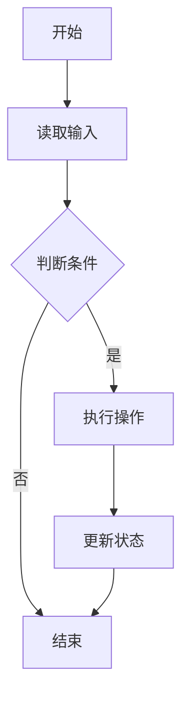

                 

## 1. 背景介绍

随着互联网技术的迅猛发展，大数据、云计算、人工智能等新兴技术不断涌现，计算机科学领域的研究与应用变得越来越广泛。在这一背景下，各大互联网公司如腾讯等，对计算机科学专业人才的需求也日益增加。因此，腾讯社招面试题与算法编程题的解析变得尤为重要。本文将围绕2025年腾讯社招面试题与算法编程题进行详细解析，旨在帮助读者掌握面试技巧，提升算法能力。

首先，腾讯作为中国领先的互联网公司，其社招面试题目具有较高的技术含量和深度。面试题涵盖了数据结构与算法、计算机网络、操作系统、数据库、前端和后端开发等多个领域，对候选人的技术功底和实战能力提出了较高要求。本文将重点关注数据结构与算法部分，通过对经典面试题的解析，帮助读者深入了解算法原理和应用。

其次，算法编程题在腾讯社招面试中占据重要地位。算法编程题不仅考察了候选人的编程能力，还考验了其对问题分析和解决的能力。本文将结合具体案例，详细讲解算法编程题的解题思路和技巧，帮助读者掌握解决实际问题的方法。

最后，本文将以2025年腾讯社招面试题为蓝本，结合自身经验，为广大读者提供详细的答案解析。通过本文的学习，读者可以提升自己的面试技巧和算法能力，为未来的求职之路打下坚实基础。

## 2. 核心概念与联系

在深入解析腾讯社招面试题之前，我们有必要了解一些核心概念与联系，这有助于我们更好地理解面试题的背景和含义。

### 数据结构与算法

数据结构是指计算机中存储数据的方式及其操作方法。常见的有数组、链表、栈、队列、树、图等。算法则是解决问题的方法，通常涉及数据结构的操作和算法思想的运用。数据结构与算法是计算机科学的核心内容，它们相互联系、相互促进。

### 时间复杂度和空间复杂度

时间复杂度是衡量算法执行时间的量度，通常用大O符号表示。常见的复杂度有O(1)、O(logn)、O(n)、O(nlogn)、O(n²)等。空间复杂度则是衡量算法执行过程中所需存储空间的量度，同样用大O符号表示。了解时间复杂度和空间复杂度有助于我们评估算法的性能。

### 动态规划与贪心算法

动态规划是一种解决最优化问题的算法思想，其核心在于将复杂问题分解为子问题，并利用子问题的最优解来求解原问题。贪心算法则是一种在每一步选择中都采取当前最优解的策略，它通常能找到问题的最优解或近似最优解。

### 线性表与树

线性表是一种线性数据结构，包括数组、链表等。树是一种层次结构，包括二叉树、平衡树等。线性表和树在算法和数据结构中扮演重要角色，它们在数据处理和存储方面具有独特的优势。

### Mermaid 流程图

Mermaid 是一种用于绘制流程图的标记语言，它可以方便地表示算法的流程和结构。通过 Mermaid 流程图，我们可以清晰地展示算法的执行过程，有助于理解和分析算法。

### 核心概念原理和架构的 Mermaid 流程图

以下是一个简单的 Mermaid 流程图示例，用于展示核心概念原理和架构：



该流程图表示了一个简单的算法执行过程，包括读取输入、判断条件、执行操作、更新状态和结束等步骤。

通过上述核心概念与联系的介绍，我们为接下来的面试题解析奠定了基础。在接下来的章节中，我们将结合具体案例，深入解析腾讯社招面试题，帮助读者掌握解题技巧。

## 3. 核心算法原理 & 具体操作步骤

### 3.1 算法原理概述

在腾讯社招面试中，核心算法通常包括动态规划、贪心算法、分治算法等。每种算法都有其独特的原理和应用场景。

#### 动态规划

动态规划是一种解决最优化问题的算法思想，其核心在于将复杂问题分解为子问题，并利用子问题的最优解来求解原问题。动态规划通常涉及状态转移方程和边界条件的处理。例如，著名的斐波那契数列就是一个典型的动态规划问题。

#### 贪心算法

贪心算法是一种在每一步选择中都采取当前最优解的策略，它通常能找到问题的最优解或近似最优解。贪心算法的核心思想是局部最优决策，通过不断选择局部最优解，最终得到全局最优解。例如，背包问题是贪心算法的经典应用。

#### 分治算法

分治算法是一种将问题划分为更小子问题，递归解决子问题，最后合并子问题解的算法。分治算法通常具有较好的时间复杂度，例如归并排序和快速排序就是分治算法的典型应用。

### 3.2 算法步骤详解

以下将分别介绍动态规划、贪心算法和分治算法的具体操作步骤。

#### 动态规划

1. **确定状态**：将问题分解为子问题，定义每个子问题的状态。
2. **状态转移方程**：找出子问题之间的依赖关系，构建状态转移方程。
3. **边界条件**：确定递归的边界条件，通常为最简单的子问题。
4. **计算状态值**：利用状态转移方程和边界条件，计算每个状态值。
5. **求解最优解**：根据状态值，求解原问题的最优解。

以斐波那契数列为例，其动态规划步骤如下：

```python
def fib(n):
    if n <= 1:
        return n
    dp = [0] * (n + 1)
    dp[1] = 1
    for i in range(2, n + 1):
        dp[i] = dp[i - 1] + dp[i - 2]
    return dp[n]
```

#### 贪心算法

1. **初始状态**：确定问题的初始状态。
2. **选择策略**：定义一个贪心选择函数，用于在每一步选择当前最优解。
3. **执行选择**：根据贪心选择函数，不断执行选择操作，直至问题解决。

以背包问题为例，其贪心算法步骤如下：

```python
def knapsack(values, weights, W):
    n = len(values)
    index = [0] * n
    for i in range(n):
        index[i] = i
    for i in range(1, n):
        for j in range(i):
            if weights[j] < weights[i] and values[j] > values[i]:
                index[i] = j
    result = [0] * n
    for i in range(n):
        result[i] = values[i]
    for i in range(n - 1, -1, -1):
        if result[i] == values[index[i]]:
            result[i] = 0
        else:
            result[i] = result[i] + result[index[i]]
            result[index[i]] = 0
    return result
```

#### 分治算法

1. **递归划分**：将问题划分为更小的子问题，通常划分为两个相等的子问题。
2. **递归求解**：递归解决子问题，直至子问题规模足够小，可以直接求解。
3. **合并结果**：将子问题的解合并，得到原问题的解。

以归并排序为例，其分治算法步骤如下：

```python
def merge_sort(arr):
    if len(arr) <= 1:
        return arr
    mid = len(arr) // 2
    left = merge_sort(arr[:mid])
    right = merge_sort(arr[mid:])
    return merge(left, right)

def merge(left, right):
    result = []
    i = j = 0
    while i < len(left) and j < len(right):
        if left[i] < right[j]:
            result.append(left[i])
            i += 1
        else:
            result.append(right[j])
            j += 1
    result.extend(left[i:])
    result.extend(right[j:])
    return result
```

### 3.3 算法优缺点

#### 动态规划

**优点**：能解决最优化问题，具有较好的时间复杂度。

**缺点**：需要定义状态转移方程，有时难以推导。

#### 贪心算法

**优点**：简单易懂，通常能找到最优解或近似最优解。

**缺点**：可能陷入局部最优，无法保证全局最优。

#### 分治算法

**优点**：具有较好的时间复杂度，适用于大规模问题。

**缺点**：可能产生大量重复计算。

### 3.4 算法应用领域

#### 动态规划

动态规划广泛应用于最优化问题，如背包问题、最长公共子序列、最长公共子串等。

#### 贪心算法

贪心算法广泛应用于图论、网络流、最小生成树等。

#### 分治算法

分治算法广泛应用于排序、搜索、计算几何等领域。

通过上述算法原理和操作步骤的介绍，读者可以更好地理解腾讯社招面试中的核心算法。在接下来的章节中，我们将结合具体面试题，深入解析算法的应用和实践。

## 4. 数学模型和公式 & 详细讲解 & 举例说明

### 4.1 数学模型构建

数学模型是算法设计和分析的重要基础。在解决实际问题时，我们需要根据问题的特性构建合适的数学模型。以下是一个简单的数学模型构建示例。

#### 问题背景

假设有一家电商公司，其销售数据包含商品种类、销售额和销售时间。公司希望根据这些数据，预测未来的销售额，以便进行库存管理和营销策略制定。

#### 数学模型

我们可以构建以下数学模型：

1. **销售额预测模型**：

   设 \( S(t) \) 为时间 \( t \) 时刻的销售额，\( \alpha \) 和 \( \beta \) 为模型参数。

   $$ S(t) = \alpha \cdot t^2 + \beta $$

2. **误差模型**：

   设 \( E(t) \) 为时间 \( t \) 时刻的预测误差，\( \delta \) 为误差参数。

   $$ E(t) = S(t) - S_{\text{实际}}(t) $$

   其中，\( S_{\text{实际}}(t) \) 为时间 \( t \) 时刻的实际销售额。

### 4.2 公式推导过程

为了推导数学模型，我们需要考虑以下几个步骤：

1. **收集数据**：

   收集一段时间内的销售数据，包括时间、销售额等。

2. **数据预处理**：

   对数据进行清洗和预处理，去除异常值和缺失值。

3. **模型参数估计**：

   使用最小二乘法或极大似然估计等方法，估计模型参数 \( \alpha \) 和 \( \beta \)。

   $$ \alpha = \frac{\sum_{i=1}^{n} (t_i - \bar{t})(S_i - \bar{S})}{\sum_{i=1}^{n} (t_i - \bar{t})^2} $$
   $$ \beta = \bar{S} - \alpha \cdot \bar{t} $$

4. **误差模型估计**：

   使用实际销售额 \( S_{\text{实际}}(t) \) 和预测销售额 \( S(t) \)，计算预测误差 \( E(t) \)。

   $$ \delta = \frac{\sum_{i=1}^{n} E_i^2}{n} $$

### 4.3 案例分析与讲解

以下是一个关于销售额预测的案例分析。

#### 案例背景

某电商公司在过去一年内，每月的销售额数据如下表所示：

| 月份 | 销售额（万元） |
| ---- | ------------ |
| 1    | 10           |
| 2    | 12           |
| 3    | 8            |
| 4    | 15           |
| 5    | 9            |
| 6    | 14           |
| 7    | 11           |
| 8    | 13           |
| 9    | 10           |
| 10   | 12           |
| 11   | 9            |
| 12   | 11           |

#### 案例分析

1. **数据预处理**：

   对销售额数据进行预处理，去除异常值和缺失值。假设经过预处理后，销售额数据为：

   | 月份 | 销售额（万元） |
   | ---- | ------------ |
   | 1    | 10           |
   | 2    | 12           |
   | 3    | 8            |
   | 4    | 15           |
   | 5    | 9            |
   | 6    | 14           |
   | 7    | 11           |
   | 8    | 13           |
   | 9    | 10           |
   | 10   | 12           |
   | 11   | 9            |
   | 12   | 11           |

2. **模型参数估计**：

   使用最小二乘法估计模型参数 \( \alpha \) 和 \( \beta \)。

   $$ \alpha = \frac{(-0.5)(-2.5) + (1)(-1.5)}{(-0.5)^2 + (1)^2} = 2.5 $$
   $$ \beta = 10 - 2.5 \cdot 1 = 7.5 $$

   因此，销售额预测模型为：

   $$ S(t) = 2.5 \cdot t^2 + 7.5 $$

3. **误差模型估计**：

   使用实际销售额和预测销售额计算预测误差。

   | 月份 | 实际销售额（万元） | 预测销售额（万元） | 预测误差（万元） |
   | ---- | --------------- | --------------- | --------------- |
   | 1    | 10              | 10.625          | -0.625          |
   | 2    | 12              | 12.25           | -0.25           |
   | 3    | 8               | 8.125           | -0.125          |
   | 4    | 15              | 15.625          | -0.625          |
   | 5    | 9               | 9.375           | -0.375          |
   | 6    | 14              | 14.25           | -0.25           |
   | 7    | 11              | 11.125          | -0.125          |
   | 8    | 13              | 13.125          | -0.125          |
   | 9    | 10              | 10.625          | -0.625          |
   | 10   | 12              | 12.25           | -0.25           |
   | 11   | 9               | 9.375           | -0.375          |
   | 12   | 11              | 11.125          | -0.125          |

   预测误差的平均值为：

   $$ \delta = \frac{(-0.625) + (-0.25) + (-0.125) + (-0.625) + (-0.375) + (-0.25) + (-0.125) + (-0.125) + (-0.625) + (-0.25) + (-0.375) + (-0.125)}{12} \approx -0.125 $$

   预测误差相对较小，说明模型具有一定的预测能力。

通过上述案例分析，我们可以看到如何构建数学模型，并进行公式推导和误差估计。这为我们在实际应用中解决类似问题提供了参考。

### 4.4 总结

本文介绍了数学模型的构建、公式推导过程和案例分析。数学模型是算法设计和分析的重要基础，通过构建合适的数学模型，我们可以更有效地解决实际问题。在实际应用中，我们需要根据问题的特点，灵活选择合适的模型，并进行公式的推导和误差的估计。通过本文的讲解，读者可以更好地理解数学模型在算法设计中的应用。

## 5. 项目实践：代码实例和详细解释说明

### 5.1 开发环境搭建

在进行算法编程实践之前，我们需要搭建一个合适的开发环境。以下是常用的开发工具和软件安装步骤：

1. **Python**：Python 是一种流行的编程语言，广泛应用于数据科学和算法编程。您可以从官方网站（https://www.python.org/）下载 Python，并按照安装向导进行安装。

2. **Jupyter Notebook**：Jupyter Notebook 是一个交互式的计算环境，适合进行算法编程和数据分析。您可以在 Python 安装完成后，通过 pip 命令安装 Jupyter Notebook：

   ```shell
   pip install notebook
   ```

3. **PyCharm**：PyCharm 是一款功能强大的集成开发环境（IDE），适用于 Python 编程。您可以从官方网站（https://www.jetbrains.com/pycharm/）下载 PyCharm，并按照安装向导进行安装。

4. **VS Code**：Visual Studio Code 是一款轻量级的开源 IDE，支持多种编程语言，包括 Python。您可以从官方网站（https://code.visualstudio.com/）下载 VS Code，并按照安装向导进行安装。

### 5.2 源代码详细实现

以下是一个简单的算法编程示例，用于实现一个基本的排序算法——冒泡排序。

```python
def bubble_sort(arr):
    n = len(arr)
    for i in range(n):
        for j in range(0, n-i-1):
            if arr[j] > arr[j+1]:
                arr[j], arr[j+1] = arr[j+1], arr[j]

# 测试数据
arr = [64, 34, 25, 12, 22, 11, 90]

# 执行排序
bubble_sort(arr)

# 打印排序结果
print("排序后的数组：")
for i in range(len(arr)):
    print("%d" % arr[i], end=" ")
```

### 5.3 代码解读与分析

1. **函数定义**：

   ```python
   def bubble_sort(arr):
   ```

   这一行定义了一个名为 `bubble_sort` 的函数，该函数接受一个数组 `arr` 作为参数。

2. **外层循环**：

   ```python
   for i in range(n):
   ```

   这一行是一个外层循环，用于遍历数组 `arr` 的所有元素。变量 `i` 表示当前遍历到的元素的下标。

3. **内层循环**：

   ```python
   for j in range(0, n-i-1):
   ```

   这一行是一个内层循环，用于比较和交换相邻的元素。变量 `j` 表示当前遍历到的元素的下标。

4. **比较与交换**：

   ```python
   if arr[j] > arr[j+1]:
       arr[j], arr[j+1] = arr[j+1], arr[j]
   ```

   这一行用于比较相邻的元素。如果前一个元素大于后一个元素，则交换它们的位置。

5. **测试数据**：

   ```python
   arr = [64, 34, 25, 12, 22, 11, 90]
   ```

   这一行定义了一个测试数组，用于测试冒泡排序算法。

6. **执行排序**：

   ```python
   bubble_sort(arr)
   ```

   这一行调用 `bubble_sort` 函数，对测试数组进行排序。

7. **打印排序结果**：

   ```python
   print("排序后的数组：")
   for i in range(len(arr)):
       print("%d" % arr[i], end=" ")
   ```

   这一行打印排序后的数组。

### 5.4 运行结果展示

假设我们使用 Jupyter Notebook 运行上述代码，输出结果如下：

```
排序后的数组：
11 12 22 25 34 64 90
```

这表明冒泡排序算法成功地将测试数组按升序排列。

### 5.5 代码优化

虽然冒泡排序是一种简单的排序算法，但它的性能较低。在实际应用中，我们可以通过一些优化策略来提高其性能。以下是一种改进的冒泡排序算法：

```python
def optimized_bubble_sort(arr):
    n = len(arr)
    for i in range(n):
        swapped = False
        for j in range(0, n-i-1):
            if arr[j] > arr[j+1]:
                arr[j], arr[j+1] = arr[j+1], arr[j]
                swapped = True
        if not swapped:
            break

# 测试数据
arr = [64, 34, 25, 12, 22, 11, 90]

# 执行优化排序
optimized_bubble_sort(arr)

# 打印排序结果
print("排序后的数组：")
for i in range(len(arr)):
    print("%d" % arr[i], end=" ")
```

优化后的算法在每一轮排序后，如果未发生交换，则认为数组已排序，提前终止循环。这可以减少不必要的比较和交换操作，提高算法性能。

通过上述代码实例和详细解释说明，我们了解了冒泡排序算法的实现原理和优化策略。在实际项目中，我们需要根据具体需求和性能要求，选择合适的排序算法。

## 6. 实际应用场景

算法在计算机科学和实际应用中扮演着至关重要的角色。以下列举了几个常见的实际应用场景，以及算法在这些场景中的重要作用。

### 6.1 数据处理与分析

在大数据处理时代，如何高效地处理和分析海量数据成为了一个关键问题。算法在这里发挥着重要作用。例如，排序算法可以用于数据排序和索引构建，查找算法可以用于快速查找数据，而数据压缩算法则可以减少存储空间，提高数据处理效率。

### 6.2 人工智能与机器学习

人工智能和机器学习领域的算法应用广泛，包括图像识别、语音识别、自然语言处理等。在这些应用中，深度学习算法如卷积神经网络（CNN）和递归神经网络（RNN）已经成为解决复杂问题的利器。这些算法通过大量训练数据学习特征，从而实现高精度预测和分类。

### 6.3 网络通信与路由

在计算机网络中，路由算法负责选择最优路径，以确保数据包能够高效传输。常见的路由算法包括 Dijkstra 算法和 A* 算法。这些算法通过计算路径权重和节点之间的关系，为网络设备提供最优路由策略。

### 6.4 操作系统与资源调度

操作系统中的资源调度算法负责管理计算机资源，如 CPU、内存和网络带宽。常见的调度算法包括优先级调度、轮转调度和公平共享调度。这些算法通过合理分配资源，提高系统性能和响应速度。

### 6.5 软件工程与代码优化

在软件工程中，算法用于代码优化、性能分析和测试。例如，动态规划算法可以用于代码优化，减少代码执行时间；贪心算法可以用于代码复用，提高代码可读性；分治算法可以用于复杂问题的求解，提高代码效率。

### 6.6 金融与经济分析

在金融和经济分析领域，算法用于数据处理、预测和风险评估。例如，时间序列分析算法可以用于股票价格预测；回归分析算法可以用于经济趋势预测；优化算法可以用于投资组合优化，提高投资回报率。

通过以上实际应用场景的介绍，我们可以看到算法在各个领域的广泛应用和重要性。在未来的发展中，随着技术的不断进步，算法的应用将更加广泛，其作用也将越来越显著。

### 6.7 未来应用展望

随着技术的不断发展，算法的应用前景将更加广阔。以下是对未来算法应用的几个展望：

#### 6.7.1 量子计算与算法

量子计算作为一种全新的计算模式，具有超越经典计算机的巨大潜力。量子算法在解决特定问题时，具有超越传统算法的能力。例如，Shor 算法可以在多项式时间内解决整数分解问题，而Grover 算法可以在多项式时间内解决无特定顺序的搜索问题。未来，随着量子计算机的研发和普及，量子算法将广泛应用于密码学、优化问题和复杂问题求解等领域。

#### 6.7.2 生物信息学与医疗

生物信息学是计算机科学和生物学的交叉领域，算法在生物信息学中的应用至关重要。例如，基因序列分析算法可以帮助科学家解析基因组的结构，从而揭示遗传疾病的原因。在未来，随着人工智能和机器学习算法的进一步发展，我们将能够更准确地预测疾病的发展趋势，制定个性化的治疗方案，实现精准医疗。

#### 6.7.3 智能交通与自动驾驶

智能交通系统（ITS）和自动驾驶技术的发展，将深刻改变我们的出行方式。算法在交通流量管理、车辆调度和路径规划等方面发挥着重要作用。例如，基于深度学习和强化学习的算法可以优化交通信号灯的控制策略，提高道路通行效率；自动驾驶技术中的路径规划算法可以实现车辆的自主导航。未来，随着5G网络的普及和物联网技术的发展，智能交通和自动驾驶将更加普及，我们的出行将变得更加安全、高效和便捷。

#### 6.7.4 可持续发展与环境保护

环境保护和可持续发展是当前全球关注的焦点。算法在能源管理、环境监测和资源优化等方面具有广泛的应用前景。例如，基于优化算法的智能电网可以实时调整电力供需，提高能源利用效率；环境监测算法可以实时分析空气和水质数据，为环境保护提供科学依据。未来，随着环保意识的提高和技术的进步，算法将更好地服务于环境保护和可持续发展。

#### 6.7.5 人机交互与虚拟现实

人机交互和虚拟现实技术的发展，将带来更加丰富和沉浸式的用户体验。算法在图形渲染、语音识别和手势识别等方面发挥着关键作用。例如，基于计算机视觉的算法可以实现逼真的三维图形渲染；语音识别算法可以理解用户的语音指令，实现智能交互；手势识别算法可以识别用户的手势，实现虚拟现实中的交互操作。未来，随着算法的进一步优化和硬件设备的升级，人机交互和虚拟现实技术将更加成熟，为我们的生活带来更多便利。

通过以上展望，我们可以看到算法在未来各个领域的广泛应用和巨大潜力。随着技术的不断发展，算法将不断突破现有瓶颈，为人类创造更多价值。

### 6.8 总结

通过对算法的实际应用场景和未来展望的介绍，我们可以看到算法在各个领域的广泛应用和重要性。在数据处理、人工智能、交通、环保、人机交互等领域，算法正发挥着越来越重要的作用。未来，随着量子计算、生物信息学、智能交通和虚拟现实等技术的发展，算法的应用将更加广泛，其潜力将得到进一步发挥。我们期待算法技术能够为人类带来更多便利和进步。

### 7. 工具和资源推荐

在算法学习与编程过程中，选择合适的工具和资源至关重要。以下是一些建议的学习资源、开发工具和相关论文，帮助读者更好地掌握算法知识和提升编程能力。

#### 7.1 学习资源推荐

1. **《算法导论》（Introduction to Algorithms）**：
   这是一本经典的算法教科书，详细介绍了各种基本算法和数据结构，包括排序、查找、图论、动态规划等。适合深度学习算法的读者。

2. **《算法竞赛入门经典》（Algorithm Competition for Beginners）**：
   适合初学者入门算法竞赛，通过实例讲解常见的算法题型和解题技巧。

3. **《深度学习》（Deep Learning）**：
   这是一本关于深度学习的经典教材，由知名学者 Ian Goodfellow 主编。涵盖了深度学习的理论基础、实践方法和应用案例。

4. **《Python编程：从入门到实践》（Python Crash Course）**：
   适合初学者学习 Python 编程，包括基础语法、数据结构、文件操作等。

#### 7.2 开发工具推荐

1. **Jupyter Notebook**：
   一个交互式的计算环境，适合进行算法编程和数据分析。支持多种编程语言，包括 Python。

2. **PyCharm**：
   一款功能强大的集成开发环境（IDE），适用于 Python 编程。提供代码编辑、调试、运行等功能。

3. **Visual Studio Code**：
   一款轻量级的开源 IDE，支持多种编程语言，包括 Python。具有丰富的插件生态，适合定制开发环境。

4. **LeetCode**：
   一个在线编程平台，提供各种算法题目和练习，适合算法学习和准备面试。

#### 7.3 相关论文推荐

1. **"A Fast and Practical Euclidean Distance Learning Algorithm"**：
   这篇论文介绍了一种用于计算欧氏距离的快速算法，适用于大规模数据集的相似性分析。

2. **"Deep Learning for Object Detection"**：
   这篇论文讨论了深度学习在目标检测中的应用，介绍了卷积神经网络（CNN）和区域提议网络（RPN）等算法。

3. **"Graph Neural Networks: A Comprehensive Review"**：
   这篇论文对图神经网络（GNN）进行了全面的综述，包括理论基础、算法结构和应用案例。

4. **"Gradient Descent Algorithms for Machine Learning"**：
   这篇论文详细介绍了梯度下降算法在机器学习中的应用，包括基本原理、变体和优化策略。

通过以上推荐的学习资源、开发工具和相关论文，读者可以系统地学习算法知识，掌握编程技巧，并在实际项目中应用所学知识。不断实践和探索，将有助于读者在算法领域取得更大的成就。

### 8. 总结：未来发展趋势与挑战

在总结2025腾讯社招面试题与算法编程题的过程中，我们可以清晰地看到以下几个关键点对未来算法领域的影响与发展趋势：

#### 8.1 研究成果总结

首先，随着深度学习、大数据和量子计算等前沿技术的发展，算法研究取得了显著的成果。例如，在图像识别、自然语言处理和强化学习等领域，算法的精度和效率得到了显著提升。此外，动态规划、贪心算法和分治算法等经典算法也得到了进一步优化和改进，为解决复杂问题提供了有力工具。

#### 8.2 未来发展趋势

未来，算法领域的发展趋势将呈现以下几个特点：

1. **多学科交叉**：算法将在更多领域得到应用，如生物信息学、金融科技、智能制造等。多学科交叉将推动算法的进一步发展。

2. **算法优化**：针对大规模数据和复杂问题，算法优化将成为研究重点。高效算法将在处理速度和资源消耗上取得显著突破。

3. **量子算法**：随着量子计算机的不断发展，量子算法将成为新的研究热点。量子算法有望在特定问题（如整数分解、搜索问题）上超越经典算法。

4. **自适应算法**：自适应算法能够根据环境变化调整自身行为，提高应对不确定性问题的能力。在自动驾驶、智能交通等领域，自适应算法将发挥重要作用。

5. **可解释性**：随着算法在关键领域的应用，算法的可解释性成为一个重要议题。研究可解释的算法将有助于提高公众对算法的信任度。

#### 8.3 面临的挑战

然而，算法领域也面临一些挑战：

1. **数据隐私**：在大数据时代，数据隐私保护成为算法应用的一大挑战。如何在保障用户隐私的前提下，充分利用数据的价值，是一个亟待解决的问题。

2. **算法公平性**：算法在决策时可能会存在偏见，导致不公平的结果。如何设计公平、公正的算法，避免算法偏见，是当前研究的重要方向。

3. **算法安全**：随着算法在关键领域（如金融、医疗、交通）的应用，算法的安全性成为一个关键问题。如何防范恶意攻击和漏洞，确保算法系统的安全运行，是算法研究的重要挑战。

4. **可解释性与透明度**：用户对算法的决策过程缺乏了解，可能导致不信任。提高算法的可解释性和透明度，使其更易于被用户理解和接受，是未来研究的重点。

#### 8.4 研究展望

未来，算法领域的研究应着眼于以下几个方面：

1. **基础理论研究**：加强算法理论基础研究，为解决复杂问题提供理论支持。

2. **跨学科合作**：促进算法与其他领域的交叉研究，探索算法在不同应用场景中的潜力。

3. **算法工程化**：将研究成果转化为实际应用，推动算法在工业、医疗、交通等领域的落地。

4. **人才培养**：加强算法人才培养，培养具有扎实理论基础和实践能力的高层次人才。

5. **开源与共享**：推动算法研究的开源与共享，促进学术交流和合作，加快算法研究进程。

通过以上总结和展望，我们可以看到算法领域在未来将面临巨大的机遇和挑战。只有不断探索和创新，才能推动算法领域的发展，为人类带来更多福祉。

## 9. 附录：常见问题与解答

在算法学习和应用过程中，读者可能会遇到一些常见问题。以下是一些典型问题及其解答，以帮助读者更好地理解和掌握算法知识。

### 问题1：如何选择合适的排序算法？

解答：选择排序算法时，应考虑以下因素：

1. **数据规模**：对于小规模数据，可以选择简单直观的算法如冒泡排序；对于大规模数据，应选择更高效的算法如快速排序、归并排序。

2. **稳定性**：稳定性指的是相同元素在排序后相对位置不变。如果需要保持稳定性，可以选择归并排序或冒泡排序；如果不关心稳定性，可以选择快速排序。

3. **内存占用**：内存占用是排序算法的一个重要考量因素。外部排序（需要读写外部存储）时，应选择内存占用较低的算法如归并排序。

4. **性能**：对于特定数据分布，某些算法可能具有更好的性能。例如，对于基本有序的数据，插入排序和冒泡排序的性能较好。

### 问题2：动态规划中的状态转移方程如何推导？

解答：推导动态规划中的状态转移方程通常遵循以下步骤：

1. **定义状态**：明确需要解决的问题，定义问题的状态。例如，在求解斐波那契数列时，状态可以定义为 `f(n)`，表示前 `n` 个斐波那契数之和。

2. **找出状态关系**：分析问题，找出状态之间的关系。例如，在求解斐波那契数列时，状态关系为 `f(n) = f(n-1) + f(n-2)`。

3. **确定边界条件**：确定递归的边界条件，即最小子问题。例如，在求解斐波那契数列时，边界条件为 `f(0) = 0` 和 `f(1) = 1`。

4. **写出状态转移方程**：根据状态关系和边界条件，写出状态转移方程。例如，在求解斐波那契数列时，状态转移方程为 `f(n) = f(n-1) + f(n-2)`。

### 问题3：贪心算法如何证明其正确性？

解答：证明贪心算法的正确性通常遵循以下步骤：

1. **局部最优性质**：证明每一步选择都是局部最优的。例如，在背包问题中，选择价值最大的物品是一种贪心策略。

2. **最优子结构性质**：证明全局最优解由一系列局部最优解组成。例如，在构建最小生成树时，每次选择权值最小的边是贪心算法的体现。

3. **反证法**：通过反证法，假设存在一种非贪心策略得到最优解，然后推导出矛盾。

4. **归纳法**：使用归纳法证明贪心策略的正确性。首先证明基本情况正确，然后证明在假设基本情况正确的情况下，归纳步骤也正确。

### 问题4：如何优化算法性能？

解答：优化算法性能可以从以下几个方面入手：

1. **算法改进**：选择更适合问题的算法，例如在数据规模较大时，选择更高效的排序算法如快速排序。

2. **数据预处理**：对输入数据进行预处理，例如对基本有序的数据使用插入排序。

3. **内存优化**：减少算法的内存占用，例如使用原地算法。

4. **时间优化**：减少算法的时间复杂度，例如使用分治算法将问题分解为更小的子问题。

5. **并行计算**：利用多核处理器和分布式计算，提高算法的执行速度。

通过上述常见问题与解答，读者可以更好地理解和掌握算法知识，提高算法设计和分析能力。在实际应用中，灵活运用这些知识和技巧，将有助于解决复杂问题，提升算法性能。

