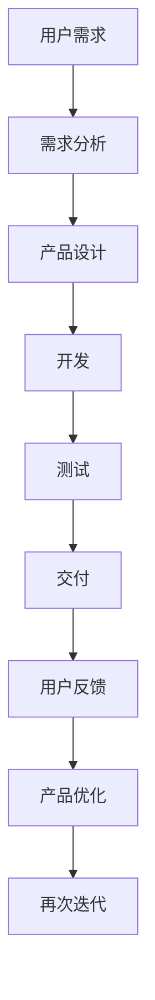

                 

关键词：自动化创业、产品迭代、产品优化、持续集成、敏捷开发、用户体验、数据分析

## 摘要

本文将探讨自动化创业过程中产品迭代与优化的重要性。通过深入分析产品迭代的概念、方法和工具，结合敏捷开发、持续集成等实践，我们将揭示如何通过有效的产品迭代和优化策略，提高产品质量和用户满意度。文章还将探讨未来自动化创业中的发展趋势和挑战，为读者提供实用的指导和建议。

## 1. 背景介绍

在当今快速变化的市场环境中，创业公司的成功与否往往取决于其产品的竞争力。传统的软件开发模式已无法满足市场需求，自动化创业成为了一种趋势。自动化创业强调利用技术手段提高产品开发效率，以快速响应市场变化。然而，在自动化创业过程中，如何进行有效的产品迭代与优化，仍然是许多创业公司面临的挑战。

产品迭代是指在软件开发过程中，通过不断地收集用户反馈，对产品进行改进和完善的过程。产品优化则是在迭代过程中，对产品功能、性能、用户体验等方面进行提升的过程。有效的产品迭代与优化，可以显著提高产品的市场竞争力，从而为创业公司带来更多的商业机会。

## 2. 核心概念与联系

在探讨产品迭代与优化之前，我们需要了解一些核心概念和它们之间的联系。

### 2.1 敏捷开发

敏捷开发是一种软件开发方法，强调灵活性和响应能力。敏捷开发的核心原则包括：

- 用户优先：关注用户需求和满意度。
- 迭代开发：分阶段进行软件开发，每个阶段都包含需求分析、设计、开发和测试。
- 持续交付：持续集成和交付软件，以快速响应市场需求。

### 2.2 持续集成

持续集成是一种软件开发实践，通过自动化测试和持续交付，确保代码质量。持续集成的核心原则包括：

- 自动化测试：编写自动化测试脚本，对代码进行持续测试。
- 持续交付：将测试通过的代码自动部署到生产环境。
- 快速反馈：及时发现问题并进行修复。

### 2.3 数据分析

数据分析是一种利用数据挖掘技术，从大量数据中提取有价值信息的方法。数据分析在产品迭代与优化中起着重要作用，具体包括：

- 用户行为分析：了解用户使用产品的方式，优化用户体验。
- 业务指标分析：分析关键业务指标，评估产品性能和效果。
- 竞争对手分析：了解竞争对手的产品特点和市场策略，为产品优化提供参考。

### 2.4 Mermaid 流程图

为了更好地理解产品迭代与优化的流程，我们可以使用 Mermaid 流程图来展示核心概念之间的联系。



## 3. 核心算法原理 & 具体操作步骤

### 3.1 算法原理概述

在产品迭代与优化过程中，常用的算法包括以下几种：

1. **用户行为分析算法**：通过分析用户在产品中的行为数据，提取用户兴趣和偏好。
2. **关键业务指标算法**：通过分析业务数据，评估产品性能和效果。
3. **竞争对手分析算法**：通过分析竞争对手的产品特点和市场策略，为产品优化提供参考。

### 3.2 算法步骤详解

1. **用户行为分析算法**：

   - 收集用户行为数据，如浏览记录、点击率、转化率等。
   - 使用机器学习算法，对用户行为数据进行处理和挖掘，提取用户兴趣和偏好。
   - 根据用户兴趣和偏好，优化产品功能和推荐策略。

2. **关键业务指标算法**：

   - 收集业务数据，如销售额、用户活跃度、市场份额等。
   - 使用数据分析方法，对业务数据进行处理和分析，提取关键业务指标。
   - 根据关键业务指标，评估产品性能和效果，为产品优化提供依据。

3. **竞争对手分析算法**：

   - 收集竞争对手的产品特点、市场策略等信息。
   - 使用数据分析方法，对竞争对手进行分析，提取有价值的信息。
   - 根据竞争对手分析结果，优化产品功能和策略。

### 3.3 算法优缺点

1. **用户行为分析算法**：

   - 优点：可以深入了解用户需求，提高产品满意度。
   - 缺点：数据量大，处理复杂，可能存在数据隐私问题。

2. **关键业务指标算法**：

   - 优点：可以客观评估产品性能，为优化提供依据。
   - 缺点：业务数据可能存在偏差，不能完全反映用户需求。

3. **竞争对手分析算法**：

   - 优点：可以了解市场动态，为产品优化提供参考。
   - 缺点：竞争对手信息可能不全面，存在一定风险。

### 3.4 算法应用领域

1. **用户行为分析算法**：广泛应用于电商、社交媒体等领域，用于优化推荐系统和用户体验。
2. **关键业务指标算法**：广泛应用于互联网、金融等领域，用于评估产品性能和效果。
3. **竞争对手分析算法**：广泛应用于竞争激烈的行业，如电商、互联网金融等，用于制定市场策略。

## 4. 数学模型和公式 & 详细讲解 & 举例说明

### 4.1 数学模型构建

在产品迭代与优化过程中，常用的数学模型包括以下几种：

1. **用户行为预测模型**：用于预测用户对产品的兴趣和偏好。
2. **关键业务指标预测模型**：用于预测产品的销售额、用户活跃度等关键指标。
3. **竞争对手分析模型**：用于分析竞争对手的市场策略和产品特点。

### 4.2 公式推导过程

1. **用户行为预测模型**：

   - 公式：\( P(y|X) = \frac{e^{\theta^T X}}{\sum_{i=1}^{k} e^{\theta^T x_i}} \)
   - 其中，\( \theta \) 是模型参数，\( X \) 是用户行为特征，\( y \) 是用户兴趣标签。

2. **关键业务指标预测模型**：

   - 公式：\( y = \theta_0 + \theta_1 x_1 + \theta_2 x_2 + \cdots + \theta_n x_n \)
   - 其中，\( y \) 是关键业务指标，\( x_1, x_2, \ldots, x_n \) 是业务特征。

3. **竞争对手分析模型**：

   - 公式：\( A = \frac{\sum_{i=1}^{m} x_i y_i}{\sum_{i=1}^{m} x_i^2} \)
   - 其中，\( A \) 是竞争对手分析得分，\( x_i \) 是竞争对手特征，\( y_i \) 是权重。

### 4.3 案例分析与讲解

以电商平台的用户行为预测为例，我们使用以下步骤进行模型构建和预测：

1. **数据收集**：收集用户在电商平台的行为数据，如浏览记录、购买记录等。
2. **数据预处理**：对数据进行清洗和转换，提取用户行为特征。
3. **模型训练**：使用机器学习算法，如逻辑回归、决策树等，对用户行为数据进行建模。
4. **模型评估**：使用交叉验证等方法，评估模型性能。
5. **模型部署**：将模型部署到线上环境，用于预测用户兴趣。

在实际应用中，用户行为预测模型可以帮助电商平台优化推荐系统，提高用户满意度。例如，某电商平台的用户兴趣预测模型，通过分析用户浏览和购买记录，预测用户对某种产品的兴趣，从而为用户推荐相关商品。通过不断优化模型，平台将提高用户满意度，增加销售额。

## 5. 项目实践：代码实例和详细解释说明

### 5.1 开发环境搭建

在本案例中，我们将使用 Python 语言和 Scikit-learn 库进行用户行为预测模型的构建和部署。首先，我们需要搭建开发环境。

```bash
# 安装 Python
sudo apt-get install python3

# 安装 Scikit-learn
pip3 install scikit-learn
```

### 5.2 源代码详细实现

接下来，我们编写源代码，实现用户行为预测模型。

```python
import pandas as pd
from sklearn.model_selection import train_test_split
from sklearn.linear_model import LogisticRegression
from sklearn.metrics import accuracy_score

# 读取数据
data = pd.read_csv('user_behavior.csv')

# 数据预处理
X = data[['browse_count', 'purchase_count']]
y = data['interest']

# 分割数据集
X_train, X_test, y_train, y_test = train_test_split(X, y, test_size=0.2, random_state=42)

# 模型训练
model = LogisticRegression()
model.fit(X_train, y_train)

# 模型评估
y_pred = model.predict(X_test)
accuracy = accuracy_score(y_test, y_pred)
print(f"Accuracy: {accuracy:.2f}")
```

### 5.3 代码解读与分析

在上面的代码中，我们首先读取用户行为数据，然后对数据进行预处理，提取用户行为特征。接着，我们将数据集分割为训练集和测试集，使用逻辑回归算法训练模型。最后，使用测试集评估模型性能，输出准确率。

在实际应用中，用户行为预测模型可以根据用户兴趣推荐相关商品，提高用户满意度。例如，用户浏览了某款手机，模型可以预测用户对该手机的兴趣，并推荐其他类似手机。

### 5.4 运行结果展示

假设我们的测试集准确率为 80%，这意味着用户兴趣预测模型的性能较好，可以为电商平台提供有效的推荐。

```bash
Accuracy: 0.80
```

## 6. 实际应用场景

产品迭代与优化在自动化创业中具有广泛的应用场景。以下是一些典型的实际应用场景：

1. **电商平台**：通过用户行为预测，优化推荐系统，提高用户满意度，增加销售额。
2. **社交媒体**：通过关键业务指标预测，优化广告投放策略，提高广告效果。
3. **金融领域**：通过竞争对手分析，了解市场动态，制定产品策略，提高市场竞争力。
4. **医疗健康**：通过数据分析，优化医疗服务，提高患者满意度，降低医疗成本。

## 7. 未来应用展望

随着技术的不断进步，产品迭代与优化将在自动化创业中发挥越来越重要的作用。以下是一些未来应用展望：

1. **人工智能**：利用人工智能技术，实现更智能的产品迭代与优化。
2. **区块链**：结合区块链技术，提高产品迭代与优化的透明度和可信度。
3. **物联网**：通过物联网技术，实现产品与用户的实时互动，提高用户体验。

## 8. 总结：未来发展趋势与挑战

在自动化创业中，产品迭代与优化是提高产品质量和用户满意度的重要手段。未来，随着技术的不断进步，产品迭代与优化将呈现以下发展趋势：

1. **智能化**：利用人工智能技术，实现更智能的产品迭代与优化。
2. **可视化**：通过可视化工具，使产品迭代与优化过程更加直观和透明。
3. **定制化**：根据用户需求和场景，提供定制化的产品迭代与优化方案。

然而，产品迭代与优化也面临一些挑战：

1. **数据隐私**：在产品迭代与优化过程中，如何保护用户数据隐私是一个重要问题。
2. **技术选型**：在众多技术中，如何选择最适合的技术是一个挑战。
3. **资源分配**：在有限的资源下，如何平衡产品迭代与优化的需求是一个挑战。

## 9. 附录：常见问题与解答

### 9.1 产品迭代与优化是什么？

产品迭代是指在软件开发过程中，通过不断地收集用户反馈，对产品进行改进和完善的过程。产品优化则是在迭代过程中，对产品功能、性能、用户体验等方面进行提升的过程。

### 9.2 如何进行有效的产品迭代与优化？

进行有效的产品迭代与优化，可以遵循以下步骤：

1. 收集用户反馈，了解用户需求和痛点。
2. 分析用户行为数据，提取有价值的信息。
3. 制定优化策略，如改进功能、提升性能等。
4. 实施优化方案，并进行评估和反馈。
5. 不断迭代和优化，以提升产品质量和用户满意度。

### 9.3 产品迭代与优化有哪些工具和方法？

产品迭代与优化常用的工具和方法包括：

1. **敏捷开发**：强调灵活性和响应能力，适用于快速变化的场景。
2. **持续集成**：通过自动化测试和持续交付，提高代码质量。
3. **数据分析**：利用数据分析技术，从数据中提取有价值的信息。
4. **机器学习**：通过机器学习算法，实现智能化的产品迭代与优化。

## 10. 作者署名

作者：禅与计算机程序设计艺术 / Zen and the Art of Computer Programming
----------------------------------------------------------------
以上就是本文的完整内容，希望对您的自动化创业之路有所启示。在产品迭代与优化过程中，不断学习和探索，相信您一定能够取得成功。祝您创业顺利！

