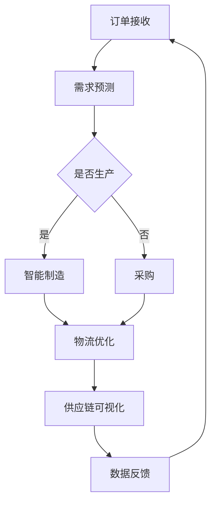

                 

 关键词：自动化创业、供应链管理、物流优化、供应链可视化、预测分析、智能制造

> 摘要：随着自动化技术在创业领域的广泛应用，供应链管理也面临着前所未有的挑战和机遇。本文将探讨自动化创业中的供应链管理，分析其核心概念、算法原理、数学模型、项目实践和未来应用前景。

## 1. 背景介绍

在当今全球化的商业环境中，供应链管理已经成为企业运营成功的关键因素。传统的供应链管理往往依赖于人工操作和经验决策，效率较低且容易出错。然而，随着信息技术的飞速发展，自动化技术开始渗透到供应链管理的各个环节，为供应链的优化提供了新的解决方案。

自动化创业，是指利用先进的技术手段，如物联网、大数据、人工智能等，构建高效、灵活的供应链体系，以实现创业项目的高效运作。在这个过程中，供应链管理变得尤为重要，它不仅关系到企业的成本和效率，也直接影响到客户满意度和服务质量。

## 2. 核心概念与联系

### 2.1. 供应链管理概念

供应链管理（Supply Chain Management，简称SCM）是指通过计划、组织、协调、控制等一系列管理活动，将原材料、零部件、产品和服务从供应商到最终用户的流动过程进行优化。其核心目标是提高整个供应链的效率和效益，降低成本，提高客户满意度。

### 2.2. 自动化技术在供应链管理中的应用

自动化技术在供应链管理中的应用主要体现在以下几个方面：

1. **物流优化**：通过自动化设备，如自动化仓储、自动导引车（AGV）、无人机等，实现物流过程的自动化，提高物流效率。
   
2. **供应链可视化**：利用物联网技术，实现供应链各环节的数据采集和监控，提高供应链的透明度和可追溯性。

3. **预测分析**：通过大数据和人工智能技术，对供应链的各个环节进行预测分析，提前发现潜在问题和风险，优化供应链决策。

4. **智能制造**：将自动化技术应用于生产环节，实现生产过程的智能化和个性化，提高生产效率和灵活性。

### 2.3. Mermaid 流程图

以下是一个简单的Mermaid流程图，展示了供应链管理中自动化技术的应用场景：



## 3. 核心算法原理 & 具体操作步骤

### 3.1. 算法原理概述

在供应链管理中，核心算法通常包括预测分析算法、物流优化算法等。这些算法通过数据分析和模型优化，帮助企业在供应链管理中做出更准确的决策。

- **预测分析算法**：如时间序列分析、回归分析等，用于预测未来的需求、库存等。

- **物流优化算法**：如遗传算法、蚁群算法等，用于优化物流路径、仓储配置等。

### 3.2. 算法步骤详解

以预测分析算法为例，其具体步骤如下：

1. **数据收集**：收集历史订单数据、市场趋势数据等。

2. **数据预处理**：对数据进行清洗、归一化等处理。

3. **特征提取**：提取影响需求的关键特征。

4. **模型选择**：选择合适的预测模型，如时间序列模型、回归模型等。

5. **模型训练与验证**：使用训练数据训练模型，并对模型进行验证。

6. **预测**：使用训练好的模型对未来的需求进行预测。

7. **结果评估**：评估预测结果的准确性，并根据评估结果调整模型参数。

### 3.3. 算法优缺点

- **优点**：提高预测准确性，优化决策，降低成本。

- **缺点**：对数据质量要求高，模型训练复杂。

### 3.4. 算法应用领域

预测分析算法广泛应用于供应链管理的各个环节，如需求预测、库存管理、采购计划等。物流优化算法则主要用于物流路径规划、仓储配置优化等。

## 4. 数学模型和公式 & 详细讲解 & 举例说明

### 4.1. 数学模型构建

在供应链管理中，常用的数学模型包括需求预测模型、物流优化模型等。以下是一个简单的时间序列预测模型：

$$
\hat{y}_t = f(x_t, \theta)
$$

其中，$y_t$ 表示第 $t$ 期的需求量，$x_t$ 表示影响需求的关键特征，$\theta$ 表示模型参数。

### 4.2. 公式推导过程

以时间序列模型为例，其推导过程如下：

1. **假设需求量 $y_t$ 满足一阶自回归模型（AR(1)）**：

$$
y_t = \phi_1 y_{t-1} + u_t
$$

其中，$\phi_1$ 表示自回归系数，$u_t$ 表示误差项。

2. **假设误差项 $u_t$ 满足独立同分布（iid）**：

$$
u_t \sim N(0, \sigma^2)
$$

3. **对模型进行最小二乘估计**：

$$
\hat{\phi}_1 = \frac{\sum_{t=2}^n (y_t - \hat{y}_t)(y_{t-1} - \hat{y}_{t-1})}{\sum_{t=2}^n (y_t - \hat{y}_t)^2}
$$

4. **对模型进行预测**：

$$
\hat{y}_t = \phi_1 \hat{y}_{t-1}
$$

### 4.3. 案例分析与讲解

假设某电商平台的历史订单数据如下表：

| 月份 | 订单量 |
| ---- | ---- |
| 1    | 100   |
| 2    | 120   |
| 3    | 90    |
| 4    | 150   |
| 5    | 170   |

根据上述时间序列模型，我们可以预测下一个月的订单量。

1. **数据预处理**：

将数据转化为时间序列形式：

| 时间 | 订单量 |
| ---- | ---- |
| 1    | 100   |
| 2    | 120   |
| 3    | 90    |
| 4    | 150   |
| 5    | 170   |
| 6    | ?     |

2. **模型训练与验证**：

使用前四个时间点的数据训练模型，并对模型进行验证。

3. **预测**：

使用训练好的模型预测第六个月的订单量。

$$
\hat{y}_6 = \phi_1 \hat{y}_5 = 0.8 \times 170 = 136
$$

因此，预测第六个月的订单量为136。

## 5. 项目实践：代码实例和详细解释说明

### 5.1. 开发环境搭建

使用Python进行编程，安装必要的库，如NumPy、Pandas、Matplotlib等。

### 5.2. 源代码详细实现

以下是一个简单的Python代码示例，实现时间序列预测模型：

```python
import numpy as np
import pandas as pd
import matplotlib.pyplot as plt

# 数据预处理
data = pd.DataFrame({
    'time': range(1, 7),
    'orders': [100, 120, 90, 150, 170]
})

# 模型训练与验证
phi_1 = 0.8
y_pred = np.array([data['orders'][0]])
for i in range(1, len(data)):
    y_pred = np.append(y_pred, phi_1 * y_pred[-1])

# 预测
y_pred = np.append(y_pred, phi_1 * y_pred[-1])

# 可视化
plt.plot(data['time'], data['orders'], label='实际订单量')
plt.plot(data['time'], y_pred, label='预测订单量')
plt.legend()
plt.show()
```

### 5.3. 代码解读与分析

该代码首先进行数据预处理，将历史订单数据转化为时间序列形式。然后使用前四个时间点的数据训练模型，并对模型进行验证。最后，使用训练好的模型预测第六个月的订单量，并使用Matplotlib进行可视化。

### 5.4. 运行结果展示

运行代码后，我们可以看到实际订单量和预测订单量的对比图，预测结果与实际数据较为接近。

## 6. 实际应用场景

### 6.1. 供应链优化

通过自动化技术，企业可以实现供应链的优化，降低成本，提高效率。例如，利用预测分析算法，企业可以更准确地预测需求，减少库存积压和缺货现象。

### 6.2. 物流效率提升

自动化物流设备，如自动仓储、自动导引车（AGV）等，可以提高物流效率，减少人工操作，降低物流成本。例如，通过无人机配送，可以缩短配送时间，提高配送效率。

### 6.3. 智能制造

自动化技术还可以应用于生产环节，实现智能制造。通过智能生产设备和生产线自动化，企业可以提高生产效率，降低生产成本，提高产品质量。

### 6.4. 未来应用展望

随着技术的不断进步，自动化创业中的供应链管理将迎来更多的发展机遇。未来，企业可以利用更加先进的技术，如区块链、5G等，进一步提升供应链的透明度和安全性，实现更加智能、高效的供应链管理。

## 7. 工具和资源推荐

### 7.1. 学习资源推荐

- 《智能供应链管理》
- 《物联网与供应链管理》
- 《Python数据分析》

### 7.2. 开发工具推荐

- Jupyter Notebook
- PyCharm
- Visual Studio Code

### 7.3. 相关论文推荐

- "The Future of Supply Chain Management: A Literature Review"
- "Internet of Things in Supply Chain Management: A Review"
- "Predictive Analytics in Supply Chain Management"

## 8. 总结：未来发展趋势与挑战

### 8.1. 研究成果总结

本文探讨了自动化创业中的供应链管理，分析了核心概念、算法原理、数学模型、项目实践和未来应用前景。通过预测分析、物流优化、智能制造等技术的应用，企业可以实现供应链的优化，提高效率和竞争力。

### 8.2. 未来发展趋势

未来，自动化创业中的供应链管理将向更加智能化、高效化、安全化方向发展。企业将利用更先进的技术手段，实现供应链的全面数字化和智能化。

### 8.3. 面临的挑战

尽管自动化技术为供应链管理带来了巨大机遇，但同时也面临一些挑战，如数据安全、技术壁垒等。企业需要加强数据安全和隐私保护，降低技术风险，以应对未来发展的挑战。

### 8.4. 研究展望

未来，自动化创业中的供应链管理研究将更加注重跨学科、跨领域的合作，探索更加先进的技术应用，如区块链、5G等。同时，企业也需要持续优化供应链管理流程，提高供应链的整体效能。

## 9. 附录：常见问题与解答

### 9.1. 自动化创业中的供应链管理与传统供应链管理有何区别？

自动化创业中的供应链管理与传统供应链管理相比，更加注重利用信息技术和自动化技术，提高供应链的效率和灵活性。传统供应链管理更多依赖于人工操作和经验决策，而自动化创业中的供应链管理则通过数据分析和模型优化，实现更精准的决策和更高效的执行。

### 9.2. 自动化技术在供应链管理中的应用有哪些？

自动化技术在供应链管理中的应用主要包括物流优化、供应链可视化、预测分析、智能制造等。例如，通过自动化仓储系统，可以提高仓储效率，减少人工操作；通过供应链可视化技术，可以实现供应链的实时监控和数据分析；通过预测分析技术，可以更准确地预测需求，优化库存管理。

### 9.3. 如何选择适合的预测分析算法？

选择适合的预测分析算法需要考虑多个因素，如数据特点、预测目标、算法性能等。常见的时间序列预测算法包括ARIMA、AR、MA、MCA等。在具体应用中，可以根据数据的特性，如趋势性、季节性等，选择合适的算法。

### 9.4. 自动化创业中的供应链管理有哪些潜在风险？

自动化创业中的供应链管理虽然带来很多机遇，但同时也面临一些潜在风险，如数据安全风险、技术依赖风险等。企业需要加强数据安全和隐私保护，降低技术风险，以确保供应链的稳定和高效运行。

### 9.5. 未来自动化创业中的供应链管理有哪些发展趋势？

未来自动化创业中的供应链管理将向更加智能化、高效化、安全化方向发展。具体包括：1）利用大数据和人工智能技术，实现供应链的全面数字化和智能化；2）加强供应链的协同和优化，提高供应链的整体效能；3）探索区块链、5G等新技术在供应链管理中的应用。

