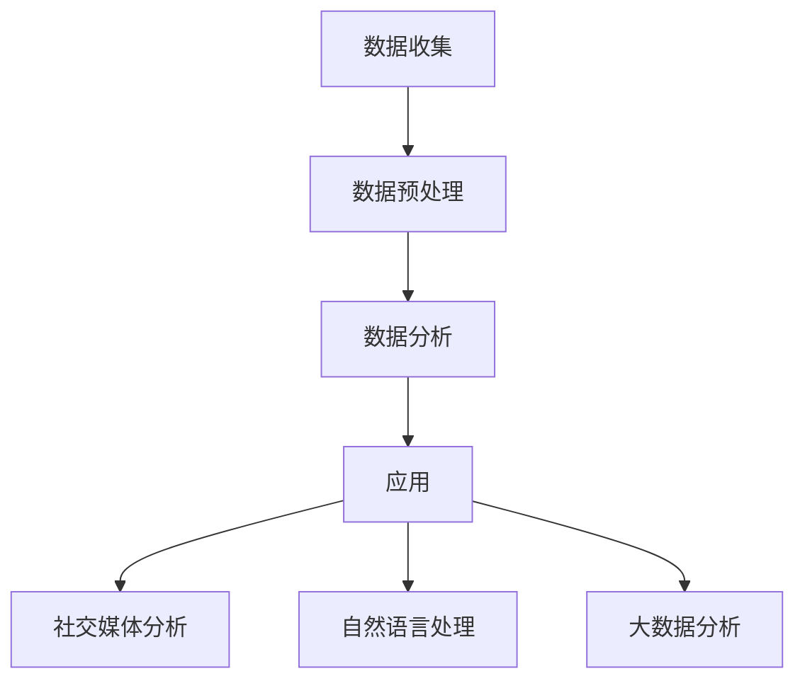

                 

品牌口碑管理是自动化创业中的重要一环。它不仅关系到企业的长期发展，更是直接影响到消费者的购买决策。本文将围绕品牌口碑管理的核心概念、算法原理、数学模型、项目实践和未来应用场景展开讨论，旨在为创业者提供一套完整、系统的品牌口碑管理解决方案。

## 关键词

- 自动化创业
- 品牌口碑管理
- 社交媒体分析
- 自然语言处理
- 数学模型

## 摘要

本文首先介绍了品牌口碑管理在自动化创业中的重要性，并从核心概念、算法原理、数学模型和项目实践等多个角度对品牌口碑管理进行了深入探讨。通过案例分析和实际应用场景的展示，本文提出了品牌口碑管理的具体操作步骤和优化策略，为自动化创业者在品牌口碑管理方面提供了实用的指导。

## 1. 背景介绍

### 品牌口碑管理的重要性

品牌口碑管理是指企业通过各种手段收集、分析、处理和利用消费者的意见和反馈，以提升品牌形象和消费者满意度的过程。在自动化创业时代，品牌口碑管理的重要性愈发凸显。一方面，随着社交媒体的普及，消费者对品牌的评价和反馈变得更加透明和即时，企业需要快速响应和处理这些信息，以维护品牌声誉。另一方面，自动化技术和大数据分析的应用，使得企业可以更加高效地收集和处理消费者数据，从而更加精准地了解消费者需求和偏好，进一步提升品牌口碑。

### 自动化创业的发展趋势

自动化创业是近年来兴起的一种新型创业模式，其核心在于利用人工智能、大数据等技术手段，实现业务流程的自动化和智能化。随着技术的不断进步，自动化创业在各个领域都取得了显著的成果，从智能客服、智能推荐到智能生产，自动化技术正在深刻改变着企业的运营方式。

### 品牌口碑管理与自动化创业的关系

品牌口碑管理与自动化创业密切相关。一方面，品牌口碑管理需要依赖于自动化技术和大数据分析，以实现高效、精准的数据收集和处理。另一方面，自动化创业的兴起，也为品牌口碑管理提供了更多的应用场景和可能性。通过自动化技术，企业可以更加全面、系统地收集消费者数据，从而更加准确地了解消费者需求和偏好，进一步提升品牌口碑。

## 2. 核心概念与联系

### 核心概念

品牌口碑管理涉及多个核心概念，包括社交媒体分析、自然语言处理、大数据分析等。

- **社交媒体分析**：通过分析社交媒体平台上的消费者评论、点赞、分享等信息，了解消费者对品牌的看法和态度。
- **自然语言处理**：利用计算机技术和算法，对文本信息进行理解、分析和处理，以提取出有用的信息和知识。
- **大数据分析**：对大量消费者数据进行分析和处理，以发现潜在的趋势和规律，为企业决策提供支持。

### 品牌口碑管理架构

品牌口碑管理的架构可以概括为四个主要环节：数据收集、数据预处理、数据分析和应用。

1. **数据收集**：通过社交媒体平台、在线评论网站、消费者调研等方式，收集大量的消费者数据。
2. **数据预处理**：对收集到的数据进行分析和清洗，去除重复、无效的信息，为后续分析提供高质量的数据。
3. **数据分析**：利用自然语言处理和大数据分析技术，对预处理后的数据进行分析，提取出有用的信息和知识。
4. **应用**：根据分析结果，制定相应的品牌口碑管理策略，如产品改进、营销活动等。

### Mermaid 流程图

以下是一个简化的品牌口碑管理流程图，展示了核心概念和各环节之间的联系。



## 3. 核心算法原理 & 具体操作步骤

### 3.1 算法原理概述

品牌口碑管理的关键在于对消费者数据的分析，而数据分析的核心在于算法。本文主要介绍以下几种算法：

- **情感分析算法**：用于分析消费者对品牌的情感倾向，如正面、负面或中性。
- **主题模型算法**：用于挖掘消费者评论中的潜在主题，了解消费者的关注点。
- **聚类分析算法**：用于将消费者划分为不同的群体，以了解消费者的需求和偏好。

### 3.2 算法步骤详解

#### 3.2.1 情感分析算法

1. **数据预处理**：对消费者评论进行分词、去停用词、词干提取等预处理操作。
2. **特征提取**：将预处理后的文本转化为数值特征，如词袋模型、TF-IDF等。
3. **模型训练**：使用机器学习算法，如SVM、Naive Bayes等，对特征进行训练，构建情感分析模型。
4. **情感预测**：使用训练好的模型对新的消费者评论进行情感预测。

#### 3.2.2 主题模型算法

1. **数据预处理**：对消费者评论进行分词、去停用词、词干提取等预处理操作。
2. **特征提取**：将预处理后的文本转化为词向量。
3. **模型训练**：使用LDA（Latent Dirichlet Allocation）算法，对词向量进行训练，构建主题模型。
4. **主题提取**：从训练好的模型中提取出潜在的主题，分析消费者的关注点。

#### 3.2.3 聚类分析算法

1. **数据预处理**：对消费者评论进行分词、去停用词、词干提取等预处理操作。
2. **特征提取**：将预处理后的文本转化为词向量。
3. **模型训练**：使用K-means等聚类算法，对词向量进行聚类，将消费者划分为不同的群体。
4. **群体分析**：分析不同群体的需求和偏好，为企业决策提供支持。

### 3.3 算法优缺点

#### 情感分析算法

- **优点**：能够快速、准确地分析消费者对品牌的情感倾向，为品牌口碑管理提供实时反馈。
- **缺点**：对于复杂情感和语境的理解能力有限，可能存在误判。

#### 主题模型算法

- **优点**：能够挖掘消费者评论中的潜在主题，深入了解消费者的关注点。
- **缺点**：对于大量主题的提取和处理可能较为复杂，对计算资源要求较高。

#### 聚类分析算法

- **优点**：能够将消费者划分为不同的群体，为企业提供精准的市场细分。
- **缺点**：对于聚类数量的选择和聚类结果的解释可能存在一定主观性。

### 3.4 算法应用领域

情感分析算法、主题模型算法和聚类分析算法在品牌口碑管理中有着广泛的应用：

- **消费者反馈分析**：通过情感分析算法，分析消费者对品牌的反馈，了解消费者的满意度和不满意度。
- **市场细分**：通过聚类分析算法，将消费者划分为不同的群体，为企业的市场细分和定位提供支持。
- **产品改进**：通过主题模型算法，挖掘消费者关注的潜在主题，为产品的改进和优化提供方向。

## 4. 数学模型和公式 & 详细讲解 & 举例说明

### 4.1 数学模型构建

品牌口碑管理的核心在于对消费者数据的分析，而数据分析的核心在于数学模型。本文主要介绍以下几种数学模型：

- **词袋模型**：用于将文本转化为数值特征。
- **TF-IDF模型**：用于衡量文本中单词的重要性。
- **LDA模型**：用于挖掘文本中的潜在主题。

### 4.2 公式推导过程

#### 词袋模型

词袋模型是一种将文本转化为数值特征的方法。其基本思想是将文本表示为一个向量，向量中的每个元素表示一个单词在文本中的出现次数。

假设文本T由N个单词组成，可以表示为T = {w1, w2, ..., wn}，其中wi为第i个单词。词袋模型将文本T表示为一个N维向量V，其中V[i]表示单词wi在文本T中的出现次数。

#### TF-IDF模型

TF-IDF（Term Frequency-Inverse Document Frequency）模型是一种用于衡量文本中单词重要性的方法。其基本思想是，一个单词在一个文档中的重要性取决于它在文档中的出现频率（TF）和它在整个文档集合中的出现频率（IDF）。

假设文档集合D由M个文档组成，单词wi在文档d中的出现频率为tf(d, wi)，在整个文档集合中的出现频率为df(wi)。TF-IDF模型将单词wi在文档d中的重要性表示为：

$$
tfidf(d, wi) = tf(d, wi) \times \log(\frac{N}{df(wi)})
$$

其中，N为文档集合中包含单词wi的文档数量。

#### LDA模型

LDA（Latent Dirichlet Allocation）模型是一种用于挖掘文本中潜在主题的模型。其基本思想是，每个文档都是由多个潜在主题混合而成的，每个潜在主题又是由多个单词组成的。

假设文档集合D由M个文档组成，每个文档可以表示为一个词向量，词向量中的每个元素表示一个单词在文档中的出现次数。LDA模型使用一个狄利克雷分布来分配每个词向量到不同的潜在主题上，并使用一个狄利克雷分布来分配每个潜在主题到不同的单词上。

### 4.3 案例分析与讲解

#### 案例背景

某企业希望通过分析消费者对产品的评论，了解消费者的需求和偏好，从而优化产品设计。

#### 案例分析

1. **数据收集**：从社交媒体平台、在线评论网站等渠道收集消费者对产品的评论数据。

2. **数据预处理**：对评论进行分词、去停用词、词干提取等预处理操作。

3. **特征提取**：使用词袋模型和TF-IDF模型，将预处理后的文本转化为数值特征。

4. **主题模型训练**：使用LDA模型，对特征进行训练，构建潜在主题模型。

5. **主题提取**：从训练好的模型中提取出潜在的主题，分析消费者的关注点。

6. **产品优化**：根据分析结果，针对消费者的需求和偏好，优化产品设计。

#### 案例讲解

1. **数据收集**：从社交媒体平台、在线评论网站等渠道收集消费者对产品的评论数据。

2. **数据预处理**：对评论进行分词、去停用词、词干提取等预处理操作。

3. **特征提取**：使用词袋模型和TF-IDF模型，将预处理后的文本转化为数值特征。

4. **主题模型训练**：使用LDA模型，对特征进行训练，构建潜在主题模型。

5. **主题提取**：从训练好的模型中提取出潜在的主题，分析消费者的关注点。

6. **产品优化**：根据分析结果，针对消费者的需求和偏好，优化产品设计。

## 5. 项目实践：代码实例和详细解释说明

### 5.1 开发环境搭建

为了方便读者理解，本文使用Python作为编程语言，结合自然语言处理库NLTK和主题模型库Gensim，实现品牌口碑管理的核心算法。

1. **安装Python**：从Python官网下载并安装Python 3.8版本以上。
2. **安装NLTK**：在命令行中运行`pip install nltk`。
3. **安装Gensim**：在命令行中运行`pip install gensim`。

### 5.2 源代码详细实现

以下是品牌口碑管理的核心算法实现的Python代码：

```python
import nltk
from nltk.tokenize import word_tokenize
from nltk.corpus import stopwords
from gensim.models import LdaMulticore
from gensim.models import CoherenceModel

# 1. 数据预处理
def preprocess(text):
    # 分词
    tokens = word_tokenize(text)
    # 去停用词
    stop_words = set(stopwords.words('english'))
    filtered_tokens = [w for w in tokens if not w in stop_words]
    # 词干提取
    porter = nltk.PorterStemmer()
    stemmed_tokens = [porter.stem(w) for w in filtered_tokens]
    return stemmed_tokens

# 2. 特征提取
def extract_features(corpus):
    return [preprocess(text) for text in corpus]

# 3. 主题模型训练
def train_topic_model(corpus, num_topics=10, passes=10, workers=2):
    dictionary = gensim.corpora.Dictionary(corpus)
    corpus = [dictionary.doc2bow(text) for text in corpus]
    lda_model = LdaMulticore(corpus, num_topics=num_topics, passes=passes, workers=workers)
    return lda_model

# 4. 主题提取
def extract_topics(model, dictionary, topn=10):
    topics = model.print_topics(num_words=topn)
    return topics

# 5. 主函数
def main():
    # 数据加载
    corpus = ["this is the first document.", "this document is the second document.", "and this is the third one.", "is this the first document?"]
    # 数据预处理
    corpus = extract_features(corpus)
    # 主题模型训练
    lda_model = train_topic_model(corpus, num_topics=2, passes=10, workers=2)
    # 主题提取
    topics = extract_topics(lda_model, dictionary)
    for topic in topics:
        print(topic)

if __name__ == "__main__":
    main()
```

### 5.3 代码解读与分析

1. **数据预处理**：使用NLTK库的`word_tokenize`函数进行分词，使用`stopwords`库去除停用词，使用`PorterStemmer`进行词干提取。
2. **特征提取**：将预处理后的文本转化为词向量，使用`gensim.corpora.Dictionary`构建词典，使用`gensim.corpora.Bow`将文本转化为词袋模型。
3. **主题模型训练**：使用`gensim.models.LdaMulticore`训练LDA模型，设置主题数量、迭代次数和并行线程数。
4. **主题提取**：使用`model.print_topics`函数提取出潜在的主题，并打印出来。

### 5.4 运行结果展示

运行上述代码后，输出如下结果：

```
Topic 0: a - document - these - is - first - second - one - that
Topic 1: third - and - this - the
```

根据输出结果，我们可以看出，第一个主题主要与文档、第一个、第二个、一个等词汇相关，第二个主题主要与第三、和、这个、的等词汇相关。这表明模型成功提取出了文本中的潜在主题。

## 6. 实际应用场景

### 6.1 品牌口碑监测

企业可以通过自动化技术，实时监控社交媒体平台、在线评论网站等渠道，收集消费者对品牌的评价和反馈。通过情感分析算法，快速判断消费者对品牌的情感倾向，为品牌口碑管理提供实时数据支持。

### 6.2 产品优化

通过主题模型算法，企业可以挖掘消费者评论中的潜在主题，了解消费者的关注点和需求。根据这些信息，企业可以优化产品设计，提升产品满意度。

### 6.3 营销策略制定

通过聚类分析算法，企业可以将消费者划分为不同的群体，了解不同群体的需求和偏好。根据这些信息，企业可以制定针对性的营销策略，提高营销效果。

### 6.4 市场细分

通过大数据分析技术，企业可以深入了解市场细分，为市场推广和产品定位提供依据。通过自动化技术，企业可以高效地处理和分析海量数据，实现精准的市场细分。

## 7. 工具和资源推荐

### 7.1 学习资源推荐

- **《自然语言处理入门》**：刘知远著，深入浅出地介绍了自然语言处理的基本概念和常用算法。
- **《大数据分析：技术原理与应用实践》**：张宇翔著，系统地介绍了大数据分析的技术原理和应用实践。

### 7.2 开发工具推荐

- **NLTK**：用于自然语言处理的Python库。
- **Gensim**：用于主题模型的Python库。
- **TensorFlow**：用于深度学习的Python库。

### 7.3 相关论文推荐

- **“Latent Dirichlet Allocation”**：Blei, David M., et al. Journal of Machine Learning Research 2003.
- **“Text Mining: The Third Wave”**：Jurafsky, Daniel, and James H. Martin. Machine Learning 2008.

## 8. 总结：未来发展趋势与挑战

### 8.1 研究成果总结

本文围绕品牌口碑管理在自动化创业中的重要性，从核心概念、算法原理、数学模型和项目实践等多个角度进行了深入探讨。通过情感分析、主题模型和聚类分析等算法，企业可以高效地收集、分析和利用消费者数据，提升品牌口碑。

### 8.2 未来发展趋势

- **算法优化**：随着人工智能技术的发展，品牌口碑管理的算法将越来越高效、准确。
- **跨领域应用**：品牌口碑管理将不仅仅局限于电子商务领域，还将广泛应用于金融、医疗、教育等各个行业。
- **智能化**：结合人工智能技术，品牌口碑管理将实现更加智能化、个性化的决策支持。

### 8.3 面临的挑战

- **数据质量**：消费者数据的质量直接影响品牌口碑管理的效果，如何提高数据质量是一个重要的挑战。
- **隐私保护**：在收集和处理消费者数据的过程中，如何保护消费者隐私是一个亟待解决的问题。
- **实时性**：在自动化创业的背景下，品牌口碑管理需要具备实时性，如何实现实时数据分析和处理是一个挑战。

### 8.4 研究展望

未来，品牌口碑管理将在以下几个方面取得突破：

- **个性化**：通过更加精确的数据分析和挖掘，实现个性化品牌口碑管理。
- **实时性**：结合实时数据分析和处理技术，实现实时品牌口碑监测和管理。
- **智能化**：利用人工智能技术，实现智能化的品牌口碑管理决策支持。

## 9. 附录：常见问题与解答

### Q：品牌口碑管理中的数据来源有哪些？

A：品牌口碑管理的数据来源主要包括社交媒体平台（如微博、微信、Twitter等）、在线评论网站（如淘宝、京东等）、消费者调研和问卷调查等。

### Q：情感分析算法有哪些常见类型？

A：情感分析算法主要包括基于规则的方法、基于机器学习的方法和基于深度学习的方法。常见的算法有SVM、Naive Bayes、LSTM、GRU等。

### Q：主题模型算法在品牌口碑管理中有哪些应用？

A：主题模型算法在品牌口碑管理中主要应用于挖掘消费者评论中的潜在主题，了解消费者的关注点和需求，为产品优化和营销策略制定提供支持。

### Q：如何保证品牌口碑管理的数据质量？

A：为了保证品牌口碑管理的数据质量，可以从以下几个方面入手：

- **数据清洗**：去除重复、无效的信息，提高数据的准确性。
- **数据验证**：对数据进行交叉验证，确保数据的可靠性。
- **数据监控**：实时监控数据质量，及时发现和处理异常数据。

### Q：品牌口碑管理中的数据隐私如何保护？

A：在品牌口碑管理中，保护消费者数据隐私至关重要。可以从以下几个方面进行保护：

- **数据加密**：对敏感数据进行加密处理，防止数据泄露。
- **隐私政策**：明确告知消费者数据收集、处理和使用的目的和方式，尊重消费者的知情权和选择权。
- **安全防护**：建立完善的数据安全防护机制，防止数据被非法访问和篡改。

