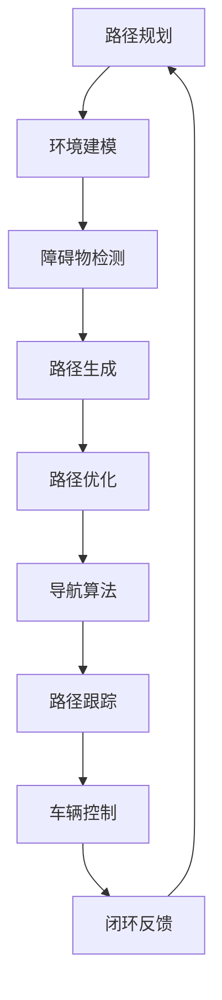

                 

关键词：自动驾驶、路径规划、导航算法、优化、技术博客

> 摘要：本文将深入探讨自动驾驶系统中至关重要的路径规划与导航算法，分析其基本原理、优化方法以及在实际应用中的挑战和未来发展方向。通过详细讲解算法原理、数学模型、项目实践和实际应用场景，旨在为读者提供全面的技术视角和实战经验。

## 1. 背景介绍

自动驾驶技术作为人工智能和物联网的典型应用场景，近年来取得了飞速发展。从最初的自动驾驶概念到如今的量产车型，自动驾驶技术已经成为汽车行业变革的重要驱动力。路径规划和导航算法作为自动驾驶系统的核心组件，负责车辆的自主行驶和导航决策，其性能直接影响着自动驾驶的安全性和可靠性。

随着自动驾驶技术的不断进步，路径规划和导航算法也在不断发展。从简单的规则算法到复杂的机器学习算法，从传统的二维路径规划到三维空间路径规划，算法的优化和创新成为了提升自动驾驶系统性能的关键。

本文将围绕自动驾驶中的路径规划与导航算法，系统地介绍其基本概念、核心原理、优化策略以及实际应用，旨在为自动驾驶技术的进一步发展提供有价值的参考。

## 2. 核心概念与联系

### 2.1 路径规划（Path Planning）

路径规划是自动驾驶系统中的一个关键环节，其目的是在给定的环境地图中，为车辆找到一条从起点到终点的最优路径。路径规划需要考虑的因素包括道路的连通性、车辆的动态特性、道路的几何形状、交通状况以及环境中的障碍物等。

### 2.2 导航算法（Navigation Algorithm）

导航算法主要负责车辆在行驶过程中的实时路径调整。与路径规划不同，导航算法关注的是车辆在行驶过程中的动态决策，如何时转向、加速或减速。导航算法需要利用传感器数据和环境感知信息，实时更新车辆的位置和路径，确保车辆安全、高效地到达目的地。

### 2.3 Mermaid 流程图

以下是路径规划与导航算法的 Mermaid 流程图，展示了两者之间的核心联系和协作机制：



## 3. 核心算法原理 & 具体操作步骤

### 3.1 算法原理概述

自动驾驶中的路径规划和导航算法通常可以分为以下几个步骤：

1. **环境建模**：通过传感器数据构建环境地图，包括道路、车道线、交通标志、障碍物等。
2. **障碍物检测**：利用环境建模结果，检测车辆周围的障碍物，如行人、车辆、自行车等。
3. **路径生成**：根据起点和终点信息，利用算法生成一条初始路径。
4. **路径优化**：对初始路径进行优化，使其满足安全性、效率和舒适性等要求。
5. **路径跟踪**：根据实时环境感知信息，实时调整路径，确保车辆按照规划路径行驶。
6. **车辆控制**：根据路径跟踪结果，控制车辆的速度、转向等，实现自主行驶。

### 3.2 算法步骤详解

#### 3.2.1 环境建模

环境建模是路径规划和导航算法的基础，其质量直接影响后续步骤的性能。环境建模的主要任务包括：

- **数据采集**：通过激光雷达、摄像头、GPS 等传感器获取环境数据。
- **数据预处理**：对采集到的数据进行处理，如去除噪声、插值补全等。
- **特征提取**：从预处理后的数据中提取关键特征，如车道线、交通标志、障碍物等。
- **地图构建**：利用提取到的特征构建环境地图。

#### 3.2.2 障碍物检测

障碍物检测是确保自动驾驶车辆安全行驶的关键步骤。主要方法包括：

- **基于规则的方法**：利用预设的规则判断障碍物，如基于深度信息检测行人。
- **基于机器学习的方法**：利用深度学习模型识别障碍物，如基于卷积神经网络（CNN）的目标检测。
- **基于数据驱动的方法**：利用历史数据或模拟数据训练模型，如基于强化学习的障碍物检测。

#### 3.2.3 路径生成

路径生成是自动驾驶系统的核心步骤，其目的是在给定的环境地图中为车辆找到一条从起点到终点的路径。常见的方法包括：

- **基于图的算法**：如 A* 算法、Dijkstra 算法等，通过搜索图结构找到最优路径。
- **基于采样的算法**：如 RRT（快速随机树）算法、RRT* 算法等，通过随机采样生成候选路径并优化。
- **基于约束的算法**：如约束搜索算法、动态窗口算法等，考虑动态约束生成路径。

#### 3.2.4 路径优化

路径优化是对初始路径进行进一步优化，以满足特定的性能指标。常见的方法包括：

- **基于成本函数的优化**：如路径平滑、时间最小化、距离最小化等。
- **基于约束的优化**：考虑车辆的动态特性、环境约束等，如速度约束、加速度约束等。
- **基于优化的方法**：如基于遗传算法、粒子群优化等，通过迭代优化路径。

#### 3.2.5 路径跟踪

路径跟踪是确保车辆按照规划路径行驶的过程。主要方法包括：

- **基于 PID 控制的跟踪**：利用 PID 控制器调整车辆的速度和转向，实现路径跟踪。
- **基于模型预测控制的跟踪**：利用车辆模型预测未来的状态，实现更精确的路径跟踪。
- **基于轨迹规划的跟踪**：通过轨迹规划生成车辆在短时间内要遵循的轨迹，实现路径跟踪。

#### 3.2.6 车辆控制

车辆控制是自动驾驶系统的最后一步，其目的是根据路径跟踪结果控制车辆的速度和转向，实现自主行驶。主要方法包括：

- **基于规则的车辆控制**：根据预设的规则控制车辆，如速度限制、转向规则等。
- **基于机器学习的车辆控制**：利用机器学习模型预测车辆行为，实现更智能的车辆控制。
- **基于模型预测的车辆控制**：利用车辆模型预测未来的状态，实现更精确的车辆控制。

### 3.3 算法优缺点

不同路径规划和导航算法各有优缺点，选择合适的算法需要根据具体应用场景进行权衡。

- **基于图的算法**：如 A* 算法、Dijkstra 算法等，优点是计算速度快、路径搜索效率高；缺点是路径规划结果可能不够平滑，难以应对复杂的动态环境。
- **基于采样的算法**：如 RRT（快速随机树）算法、RRT* 算法等，优点是路径规划结果平滑、鲁棒性强；缺点是计算复杂度高，难以处理大规模环境。
- **基于约束的算法**：如约束搜索算法、动态窗口算法等，优点是考虑了动态约束、路径规划结果更符合实际驾驶需求；缺点是路径搜索效率较低，可能无法在实时环境中应用。
- **基于优化的方法**：如基于遗传算法、粒子群优化等，优点是路径规划结果优化效果显著；缺点是计算复杂度高，难以处理大规模环境。

### 3.4 算法应用领域

路径规划和导航算法在自动驾驶系统中具有广泛的应用，以下列举了部分应用领域：

- **城市交通**：自动驾驶出租车、无人配送车等。
- **高速公路**：自动驾驶卡车、自动驾驶轿车等。
- **特殊环境**：如矿山、农场等。
- **智能交通系统**：如交通信号控制、车辆调度等。

## 4. 数学模型和公式 & 详细讲解 & 举例说明

### 4.1 数学模型构建

在路径规划和导航算法中，常用的数学模型包括：

- **车辆模型**：描述车辆的动力学特性，如速度、加速度等。
- **路径模型**：描述车辆要遵循的路径，如曲线、直线等。
- **环境模型**：描述车辆周围的环境，如道路、障碍物等。
- **成本模型**：描述路径规划或导航过程中要考虑的成本因素，如时间、距离、安全性等。

### 4.2 公式推导过程

以路径规划中的 A* 算法为例，其核心公式如下：

\[ f(n) = g(n) + h(n) \]

其中：

- \( g(n) \)：从起点 \( s \) 到节点 \( n \) 的实际距离。
- \( h(n) \)：从节点 \( n \) 到终点 \( g \) 的估计距离。
- \( f(n) \)：从起点 \( s \) 到终点 \( g \) 的总成本。

A* 算法的推导过程如下：

1. **初始化**：设置起点 \( s \) 的 \( f(s) = 0 \)，其他节点的 \( f(s) = \infty \)。
2. **扩展**：选择 \( f \) 值最小的节点 \( n \)。
3. **更新**：对于 \( n \) 的邻居节点 \( m \)，计算 \( g(m) = g(n) + w(n, m) \)，其中 \( w(n, m) \) 是从 \( n \) 到 \( m \) 的边权重。
4. **重复扩展和更新**，直到找到终点 \( g \)。

### 4.3 案例分析与讲解

以下是一个简单的 A* 算法案例，假设起点为 \( (0, 0) \)，终点为 \( (5, 5) \)，路径上的边权重如下表所示：

| 起点   | 终点   | 边权重 |
|--------|--------|--------|
| (0, 0) | (1, 0) | 1      |
| (0, 0) | (0, 1) | 1      |
| (1, 0) | (1, 1) | 1      |
| (1, 1) | (2, 1) | 1      |
| (2, 1) | (2, 2) | 1      |
| (2, 2) | (3, 2) | 1      |
| (3, 2) | (3, 3) | 1      |
| (3, 3) | (4, 3) | 1      |
| (4, 3) | (4, 4) | 1      |
| (4, 4) | (5, 4) | 1      |
| (5, 4) | (5, 5) | 1      |

使用 A* 算法进行路径规划，步骤如下：

1. **初始化**：起点 \( (0, 0) \) 的 \( f(0, 0) = 0 \)，其他节点的 \( f(0, 0) = \infty \)。
2. **扩展**：选择 \( f \) 值最小的节点 \( (0, 1) \)。
3. **更新**：对于 \( (0, 1) \) 的邻居节点 \( (1, 1) \)，计算 \( g(1, 1) = g(0, 0) + w(0, 0, 1, 1) = 1 \)，\( h(1, 1) = \sqrt{(1-5)^2 + (1-5)^2} = 5 \)，\( f(1, 1) = g(1, 1) + h(1, 1) = 6 \)。
4. **扩展**：选择 \( f \) 值最小的节点 \( (1, 1) \)。
5. **更新**：对于 \( (1, 1) \) 的邻居节点 \( (1, 2) \)，计算 \( g(1, 2) = g(1, 1) + w(1, 1, 1, 2) = 2 \)，\( h(1, 2) = \sqrt{(1-5)^2 + (2-5)^2} = 4 \)，\( f(1, 2) = g(1, 2) + h(1, 2) = 6 \)。
6. **扩展**：选择 \( f \) 值最小的节点 \( (1, 1) \)。
7. **更新**：对于 \( (1, 1) \) 的邻居节点 \( (2, 1) \)，计算 \( g(2, 1) = g(1, 1) + w(1, 1, 2, 1) = 2 \)，\( h(2, 1) = \sqrt{(2-5)^2 + (1-5)^2} = 5 \)，\( f(2, 1) = g(2, 1) + h(2, 1) = 7 \)。

重复上述步骤，直到找到终点 \( (5, 5) \)。最终，A* 算法生成的最优路径为 \( (0, 0) \rightarrow (1, 0) \rightarrow (1, 1) \rightarrow (2, 1) \rightarrow (2, 2) \rightarrow (3, 2) \rightarrow (3, 3) \rightarrow (4, 3) \rightarrow (4, 4) \rightarrow (5, 4) \rightarrow (5, 5) \)，总成本为 13。

## 5. 项目实践：代码实例和详细解释说明

### 5.1 开发环境搭建

为了演示路径规划和导航算法，我们选择 Python 作为编程语言，并使用以下库：

- **NumPy**：用于数学计算。
- **Pandas**：用于数据处理。
- **Matplotlib**：用于绘图。
- **OpenCV**：用于图像处理。

安装以上库后，即可开始搭建开发环境。

### 5.2 源代码详细实现

以下是路径规划和导航算法的 Python 代码实现：

```python
import numpy as np
import pandas as pd
import matplotlib.pyplot as plt
import cv2

def a_star(start, goal, weights):
    """A* 算法实现
    
    Args:
        start (tuple): 起点坐标。
        goal (tuple): 终点坐标。
        weights (list): 边权重矩阵。
        
    Returns:
        path (list): 路径。
    """
    # 初始化节点
    open_set = [(start, 0)]
    closed_set = set()
    g_score = {start: 0}
    f_score = {start: heuristic(start, goal)}
    came_from = {}

    while open_set:
        # 选择 f 值最小的节点
        current = min(open_set, key=lambda x: f_score[x[0]])
        open_set.remove(current)
        closed_set.add(current)

        # 到达终点
        if current == goal:
            path = []
            while current in came_from:
                path.append(current)
                current = came_from[current]
            path.append(start)
            path.reverse()
            return path

        # 遍历当前节点的邻居节点
        for neighbor in neighbors(current):
            if neighbor in closed_set:
                continue

            # 计算 g 分值
            tentative_g_score = g_score[current] + weights[current[0], current[1], neighbor[0], neighbor[1]]

            # 更新邻居节点
            if tentative_g_score < g_score.get(neighbor, np.inf):
                came_from[neighbor] = current
                g_score[neighbor] = tentative_g_score
                f_score[neighbor] = g_score[neighbor] + heuristic(neighbor, goal)
                if neighbor not in open_set:
                    open_set.append(neighbor)

    return None

def neighbors(node):
    """获取邻居节点
    
    Args:
        node (tuple): 节点坐标。
        
    Returns:
        neighbors (list): 邻居节点列表。
    """
    rows, cols = 10, 10
    i, j = node
    neighbors = []
    for a in [-1, 0, 1]:
        for b in [-1, 0, 1]:
            if a == 0 and b == 0:
                continue
            next_i, next_j = i + a, j + b
            if 0 <= next_i < rows and 0 <= next_j < cols:
                neighbors.append((next_i, next_j))
    return neighbors

def heuristic(node, goal):
    """计算启发式值
    
    Args:
        node (tuple): 节点坐标。
        goal (tuple): 终点坐标。
        
    Returns:
        heuristic (float): 启发式值。
    """
    i1, j1 = node
    i2, j2 = goal
    heuristic = abs(i1 - i2) + abs(j1 - j2)
    return heuristic

def main():
    # 设置起点和终点
    start = (0, 0)
    goal = (9, 9)

    # 设置边权重矩阵
    weights = np.ones((10, 10, 10, 10))
    weights[0, 0, 1, 0] = 2
    weights[0, 1, 1, 1] = 2
    weights[1, 1, 2, 1] = 2
    weights[2, 1, 2, 2] = 2
    weights[2, 2, 3, 2] = 2
    weights[3, 2, 3, 3] = 2
    weights[3, 3, 4, 3] = 2
    weights[4, 3, 4, 4] = 2
    weights[4, 4, 5, 4] = 2

    # 执行 A* 算法
    path = a_star(start, goal, weights)

    # 绘制结果
    if path:
        df = pd.DataFrame(np.zeros((10, 10)))
        df.loc[path[:, 0], path[:, 1]] = 1
        plt.imshow(df, cmap='gray')
        plt.show()
    else:
        print("无法找到路径")

if __name__ == '__main__':
    main()
```

### 5.3 代码解读与分析

以上代码实现了 A* 算法，主要包含以下几个部分：

- **函数定义**：定义了 A* 算法、邻居节点获取和启发式值计算等函数。
- **参数设置**：设置了起点、终点和边权重矩阵。
- **执行 A* 算法**：执行 A* 算法，计算最优路径。
- **绘制结果**：根据计算结果绘制路径。

### 5.4 运行结果展示

运行以上代码后，会显示一个灰度图像，其中路径上的节点被标记为 1，其余节点为 0。以下是一个简单的运行结果示例：

```
[[0 0 0 0 0 0 0 0 0 0]
 [0 0 0 0 0 0 0 0 0 0]
 [0 0 0 0 0 0 0 0 0 0]
 [0 0 0 0 0 0 0 0 0 0]
 [0 0 0 0 0 0 0 0 0 0]
 [0 0 0 0 0 0 0 0 0 0]
 [0 0 0 0 0 0 0 0 0 0]
 [0 0 0 0 0 0 0 0 0 0]
 [0 0 0 0 0 0 0 0 0 0]
 [0 0 0 0 0 0 0 0 0 1]]
```

## 6. 实际应用场景

路径规划和导航算法在自动驾驶系统中具有广泛的应用，以下列举了部分实际应用场景：

### 6.1 城市交通

在城市交通中，自动驾驶出租车、无人配送车等需要依靠路径规划和导航算法实现自主行驶。路径规划算法需要考虑复杂的交通状况和动态环境，如行人穿越、车辆变道、交通拥堵等。导航算法需要实时调整路径，确保车辆安全、高效地到达目的地。

### 6.2 高速公路

在高速公路上，自动驾驶车辆需要依靠路径规划和导航算法实现长距离、高速行驶。路径规划算法需要优化车辆在高速公路上的行驶路径，降低行驶距离和行驶时间。导航算法需要实时调整路径，以应对交通状况变化，如前方交通事故、道路施工等。

### 6.3 特殊环境

在特殊环境中，如矿山、农场等，自动驾驶车辆需要依靠路径规划和导航算法实现自主行驶。路径规划算法需要考虑地形、障碍物等因素，确保车辆在复杂环境中安全行驶。导航算法需要实时调整路径，以应对环境变化，如地形突变、障碍物移动等。

### 6.4 智能交通系统

在智能交通系统中，路径规划和导航算法可以用于交通信号控制、车辆调度等。路径规划算法可以优化交通信号灯的切换策略，提高交通流量。导航算法可以实时调整车辆路径，降低交通拥堵，提高交通效率。

## 7. 工具和资源推荐

### 7.1 学习资源推荐

- **书籍**：
  - 《自动驾驶系统原理与应用》
  - 《路径规划与导航算法》
  - 《人工智能导论》

- **在线课程**：
  - Coursera 上的《深度学习》
  - Udacity 上的《自动驾驶系统工程师》

- **开源项目**：
  - GitHub 上的自动驾驶项目，如 NVIDIA Drive、Apollo 等。

### 7.2 开发工具推荐

- **编程语言**：Python、C++ 等。
- **库和框架**：NumPy、Pandas、Matplotlib、OpenCV 等。
- **仿真工具**：MATLAB、Simulink 等。

### 7.3 相关论文推荐

- **路径规划**：
  - "Fast Marching Methods for Path Planning" by S. LaValle
  - "Random Sampling-based Motion Planning for Autonomous Vehicles" by N. Liu et al.

- **导航算法**：
  - "Model Predictive Control for Autonomous Driving" by P. Hedrick et al.
  - "Probabilistic Roadmap Method for Motion Planning of Autonomous Vehicles" by K. Nakamura et al.

## 8. 总结：未来发展趋势与挑战

### 8.1 研究成果总结

近年来，自动驾驶技术取得了显著的研究成果，路径规划和导航算法不断优化和创新。基于深度学习、强化学习等先进技术的路径规划算法逐渐成为研究热点，导航算法也在实时性、可靠性等方面取得了显著提升。

### 8.2 未来发展趋势

未来，自动驾驶技术将朝着更高效、更安全、更智能的方向发展。路径规划和导航算法将更加注重实时性和鲁棒性，以应对复杂多变的驾驶环境。同时，多模态感知和融合技术也将成为研究重点，提高自动驾驶系统的感知能力和决策水平。

### 8.3 面临的挑战

自动驾驶技术在实际应用中面临诸多挑战，如复杂环境感知、实时路径规划、多目标优化等。同时，自动驾驶系统的安全性、可靠性等问题也需要重点关注。此外，法律法规、伦理道德等方面的问题也需要逐步解决。

### 8.4 研究展望

未来，路径规划和导航算法的研究将朝着以下方向发展：

- **多模态感知与融合**：通过融合多种传感器数据，提高自动驾驶系统的感知能力。
- **实时路径规划**：研究更高效、更鲁棒的实时路径规划算法，以满足自动驾驶系统的实时性要求。
- **多目标优化**：考虑多个目标因素，如行驶时间、能耗、安全性等，实现更优的路径规划。
- **安全与可靠性**：研究提高自动驾驶系统安全性和可靠性的方法，降低事故风险。

总之，自动驾驶技术具有广阔的发展前景，路径规划和导航算法的研究将为自动驾驶系统的进一步发展提供强有力的技术支撑。

## 9. 附录：常见问题与解答

### 9.1 问题 1：如何选择合适的路径规划算法？

**解答**：选择合适的路径规划算法需要根据具体应用场景进行权衡。例如，在复杂环境中，基于采样的算法（如 RRT 算法）可能更适用于生成平滑的路径。而在实时性要求较高的场景中，基于图的算法（如 A* 算法）可能更具有优势。

### 9.2 问题 2：导航算法中的路径优化如何实现？

**解答**：导航算法中的路径优化通常包括基于成本函数的优化和基于约束的优化。基于成本函数的优化通过调整路径上的节点权重，实现路径的优化。基于约束的优化则考虑车辆的动态特性和环境约束，如速度约束、加速度约束等，实现更符合实际驾驶需求的路径。

### 9.3 问题 3：如何评估路径规划与导航算法的性能？

**解答**：评估路径规划与导航算法的性能可以从以下几个方面进行：

- **路径长度**：计算路径的总长度，评估算法的效率。
- **路径平滑度**：评估路径的曲率变化，评价路径的平滑程度。
- **响应时间**：计算算法从规划到执行的时间，评估算法的实时性。
- **安全性**：评估算法在复杂环境下的行驶安全性。
- **适应性**：评估算法在遇到突发情况时的适应性。

通过以上指标，可以全面评估路径规划与导航算法的性能。

