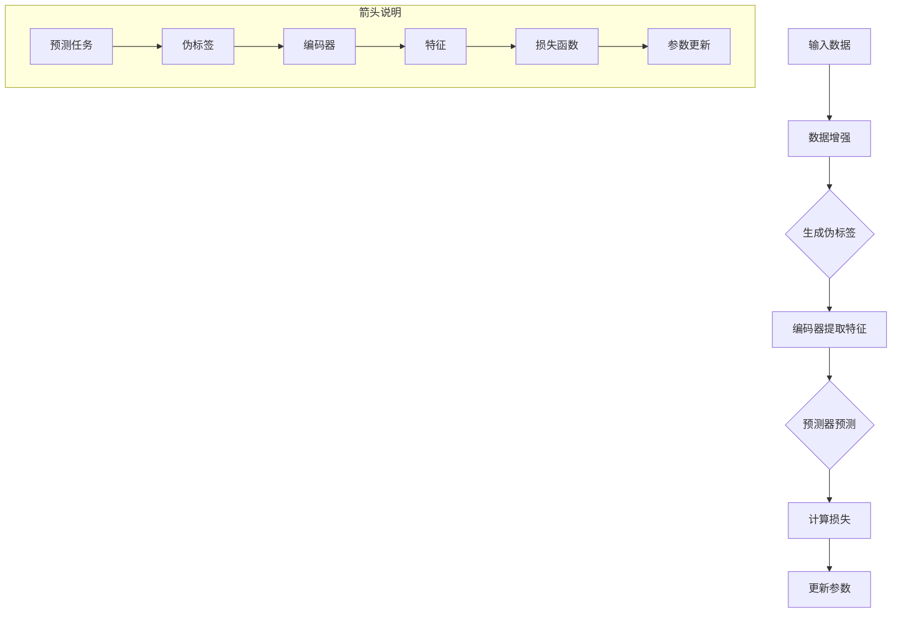

                 

在当今快速发展的信息技术领域，自监督学习（Self-Supervised Learning）已经成为一个备受关注的研究方向。自监督学习是一种无需人工标注数据标签的机器学习方法，它能够通过自动发现数据中的内在规律来实现模型的训练和优化。本文将深入探讨自监督学习的原理、核心算法以及具体的应用实例，旨在为读者提供一个全面、易懂的技术讲解。

## 关键词

- 自监督学习
- 无监督学习
- 机器学习
- 训练算法
- 数据增强
- 应用场景

## 摘要

本文首先介绍了自监督学习的定义和背景，探讨了其在无监督学习中的重要性。接着，我们详细分析了自监督学习的核心概念和原理，并借助Mermaid流程图展示了其架构。随后，文章深入讲解了自监督学习的核心算法，包括算法原理、具体操作步骤、优缺点以及应用领域。为了帮助读者更好地理解，我们还提供了数学模型和公式的详细讲解，并通过案例分析和代码实例进行说明。最后，文章探讨了自监督学习的实际应用场景，并对未来发展趋势和挑战进行了展望。

### 背景介绍

自监督学习（Self-Supervised Learning）作为一种无监督学习的方法，起源于20世纪50年代，其基本思想是在没有外部监督信号的情况下，从数据中自动发现规律并进行学习。与传统的监督学习（Supervised Learning）和半监督学习（Semi-Supervised Learning）不同，自监督学习不需要人工标注的数据标签，而是利用数据本身的内在结构来驱动学习过程。

自监督学习的兴起与以下几个因素密切相关：

1. **大数据时代的到来**：随着互联网和物联网的快速发展，数据量呈现爆炸式增长。大量的无标签数据为自监督学习提供了丰富的学习资源，使其在处理海量数据方面具有显著优势。

2. **计算能力的提升**：近年来，计算能力的显著提升，特别是在GPU等硬件设备的推动下，为自监督学习算法的实现提供了强有力的支持。这使得复杂模型在大规模数据集上的训练成为可能。

3. **深度学习的发展**：深度学习技术的发展，使得自监督学习可以在更高层次上从数据中提取特征。深度神经网络强大的表示学习能力，使得自监督学习在图像识别、自然语言处理等领域的应用取得了显著成果。

4. **无监督学习理论的进步**：随着研究者对自监督学习理论理解的深入，新的算法和技巧不断涌现，如对比学习（Contrastive Learning）、生成对抗网络（GAN）等，为自监督学习的发展提供了新思路。

自监督学习在无监督学习中的重要性不可低估。首先，它能够有效利用无标签数据，提高数据利用效率。在许多实际应用中，获取标签数据往往成本高昂且耗时，自监督学习可以显著降低这一成本。其次，自监督学习有助于发现数据中的潜在规律和模式，为后续的监督学习任务提供强有力的基础。此外，自监督学习还可以用于数据的预训练，通过在大规模无标签数据集上进行预训练，可以提高模型在新任务上的泛化能力。

总之，自监督学习作为一种无需人工标注数据标签的机器学习方法，具有广泛的应用前景和重要的理论价值。在人工智能和机器学习领域，自监督学习正逐渐成为一个不可或缺的研究方向。

## 核心概念与联系

### 自监督学习的核心概念

自监督学习的关键在于“自监督”，即通过内部数据之间的关系来指导学习过程。以下是自监督学习的核心概念：

1. **内在线性（Intrinsic Regularity）**：自监督学习依赖于数据内部的固有结构，例如图像中的空间关系、文本中的语义关系等。

2. **数据增强（Data Augmentation）**：通过变换原始数据，生成更多的训练样本，以提高模型的泛化能力。

3. **预测任务（Prediction Task）**：自监督学习中，通过设计预测任务来驱动模型学习。例如，在图像中预测像素的颜色或者文本中预测下一个单词。

4. **伪标签（Pseudo Label）**：在没有外部标签的情况下，模型通过预测来生成伪标签，然后使用这些伪标签来更新模型。

### 自监督学习的架构

自监督学习的架构通常包括以下几个关键部分：

1. **编码器（Encoder）**：负责将输入数据编码为一个固定长度的特征向量。

2. **预测器（Predictor）**：在编码器的基础上，预测一个或多个辅助任务的结果。这些预测任务可以是分类、回归或对比学习等。

3. **损失函数（Loss Function）**：用于衡量预测结果和真实结果之间的差距，并指导模型参数的更新。

4. **训练策略（Training Strategy）**：包括数据增强、学习率调度、正则化等，以优化模型性能。

### Mermaid流程图

为了更好地理解自监督学习的架构，我们使用Mermaid流程图来展示其关键步骤。



在这个流程图中，输入数据首先经过数据增强，生成更多的训练样本。接着，编码器提取特征，预测器基于这些特征进行预测，并生成伪标签。计算损失函数，然后使用这些损失来更新模型参数。这个循环不断进行，直到模型收敛。

### 自监督学习的联系

自监督学习与无监督学习、半监督学习、伪监督学习等密切相关：

1. **无监督学习**：自监督学习是广义无监督学习的一个分支，但它在有监督学习的基础上，引入了预测任务，从而在无标签数据中发现更有用的信息。

2. **半监督学习**：自监督学习可以看作是一种特殊的半监督学习，它利用大量无标签数据来提升模型的性能。

3. **伪监督学习**：伪监督学习与自监督学习类似，都是利用无标签数据来指导学习。不同的是，伪监督学习通常需要一些特殊的技巧来生成伪标签。

通过这些核心概念和架构的理解，读者可以更好地把握自监督学习的基本原理。在接下来的章节中，我们将深入探讨自监督学习的核心算法原理及其具体操作步骤。

## 核心算法原理 & 具体操作步骤

### 算法原理概述

自监督学习的核心在于设计预测任务，通过预测结果来指导模型学习。这种学习方式不依赖于外部标签，而是利用数据内在的结构和关系来驱动学习过程。以下是几种常见的自监督学习算法原理概述：

1. **对比学习（Contrastive Learning）**：
   对比学习通过学习数据点之间的相似性和差异性来实现特征提取。其基本思想是将一个数据点与其相似的样本放在一起（正样本），与不相似的样本放在一起（负样本），然后通过损失函数来优化模型，使得模型能够更好地区分正负样本。

2. **生成对抗网络（GAN）**：
   生成对抗网络由生成器（Generator）和判别器（Discriminator）组成。生成器生成假数据，判别器判断这些假数据与真实数据之间的区别。通过训练，生成器逐渐生成越来越逼真的数据，判别器则努力区分真实数据与假数据。这一过程不断交替进行，最终生成器生成的数据可以以假乱真。

3. **无监督预训练 + 微调（Unsupervised Pre-training + Fine-tuning）**：
   这种方法首先在大规模无标签数据集上进行预训练，提取通用的特征表示，然后在特定任务上进行微调。预训练阶段通过设计预测任务（如预测像素、单词等）来学习数据中的潜在结构，而微调阶段则利用少量有标签数据进行精细调整，以适应具体任务。

4. **自编码器（Autoencoder）**：
   自编码器是一种无监督学习方法，其核心是学习数据的低维表示。自编码器由编码器和解码器组成，编码器将输入数据压缩到一个较低维度的空间，解码器则尝试将压缩后的数据重构回原始空间。通过最小化重构误差，自编码器能够学习到数据的有效表示。

### 算法步骤详解

1. **对比学习（Contrastive Learning）**

   - **数据准备**：选择一个大规模无标签数据集，并将其分为两个部分：训练集和验证集。
   - **数据增强**：对训练集数据进行各种变换，如旋转、缩放、裁剪等，以增加数据的多样性。
   - **特征提取**：使用一个编码器网络对数据点进行编码，提取特征向量。
   - **预测任务**：设计一个预测任务，例如预测图像中像素的顺序或文本中单词的顺序。
   - **损失函数**：计算预测损失，常用的有对比损失（Contrastive Loss）和三元组损失（Triplet Loss）。对比损失旨在最大化正样本之间的相似性，最小化负样本之间的相似性；三元组损失则用于学习数据点之间的相对关系。
   - **模型优化**：使用梯度下降等方法，优化模型参数，以最小化损失函数。

2. **生成对抗网络（GAN）**

   - **模型架构**：定义生成器（Generator）和判别器（Discriminator）的网络结构。
   - **训练过程**：
     - **生成器训练**：生成器尝试生成逼真的数据，判别器尽量区分真实数据和假数据。
     - **判别器训练**：判别器训练目标是最大化对真实数据和生成数据的判别能力。
     - **交替训练**：生成器和判别器交替训练，生成器逐渐生成更逼真的数据，判别器则不断提升其鉴别能力。
   - **损失函数**：GAN的损失函数通常由两部分组成：生成器的损失和判别器的损失。生成器的损失希望生成器生成的数据尽可能逼真，判别器的损失希望判别器能够正确区分真实数据和生成数据。

3. **无监督预训练 + 微调（Unsupervised Pre-training + Fine-tuning）**

   - **预训练阶段**：
     - **数据集**：选择一个大规模无标签数据集，例如ImageNet、CIFAR-10等。
     - **模型训练**：使用无标签数据对编码器进行预训练，提取通用的特征表示。
     - **模型选择**：选择一个合适的编码器模型，例如卷积神经网络（CNN）或变换器（Transformer）。
   - **微调阶段**：
     - **数据集**：选择一个小规模有标签数据集，用于微调模型。
     - **模型调整**：利用有标签数据对模型进行微调，调整其参数，使其适应特定任务。
     - **训练方法**：通常使用梯度下降算法，结合动量、学习率调度等技术，优化模型参数。

4. **自编码器（Autoencoder）**

   - **数据准备**：选择一个无标签数据集，如MNIST、Fashion-MNIST等。
   - **模型构建**：
     - **编码器**：将输入数据压缩到一个低维空间。
     - **解码器**：将压缩后的数据重构回原始空间。
   - **训练过程**：
     - **编码阶段**：编码器将输入数据编码为一个固定长度的向量。
     - **解码阶段**：解码器尝试将编码后的向量解码回原始数据。
     - **损失函数**：通常使用均方误差（MSE）或交叉熵损失函数来衡量重构误差。
     - **模型优化**：使用梯度下降算法，最小化损失函数，以优化模型参数。

### 算法优缺点

- **对比学习（Contrastive Learning）**：
  - **优点**：能够有效地提取数据中的有用特征，提高模型的泛化能力；适用于多种数据类型，如图像、文本等。
  - **缺点**：对负样本的选择和正负样本的比例有较高要求；训练过程中可能需要大量计算资源。

- **生成对抗网络（GAN）**：
  - **优点**：能够生成高质量的数据，特别适用于生成式任务；具有强大的泛化能力。
  - **缺点**：训练过程不稳定，容易出现模式崩溃（mode collapse）问题；需要精心设计网络架构和训练策略。

- **无监督预训练 + 微调（Unsupervised Pre-training + Fine-tuning）**：
  - **优点**：利用大量无标签数据进行预训练，提高模型对新任务的适应能力；能够提取通用的特征表示。
  - **缺点**：预训练过程需要大量计算资源和时间；微调阶段可能需要大量有标签数据。

- **自编码器（Autoencoder）**：
  - **优点**：简单易实现，能够有效地学习数据的低维表示；适用于多种数据类型。
  - **缺点**：对噪声敏感，重构误差较大；在复杂任务上表现可能不如其他算法。

### 算法应用领域

自监督学习在多个领域展示了其强大的应用潜力：

- **计算机视觉**：在图像分类、目标检测、图像生成等领域，自监督学习能够有效提取数据中的特征，提高模型的性能。
- **自然语言处理**：在文本分类、机器翻译、情感分析等领域，自监督学习可以用于无监督的预训练，然后通过微调应用于具体任务。
- **语音识别**：自监督学习可以用于语音信号的预处理和特征提取，提高语音识别的准确率。
- **推荐系统**：自监督学习可以用于用户行为数据的分析，提取用户的潜在兴趣，从而提升推荐系统的效果。

通过深入理解这些核心算法原理和具体操作步骤，读者可以更好地把握自监督学习的基本概念，并在实际应用中灵活运用。在接下来的章节中，我们将进一步探讨自监督学习的数学模型和公式，并通过案例分析和代码实例进行详细讲解。

### 数学模型和公式 & 详细讲解 & 举例说明

#### 数学模型构建

在自监督学习中，数学模型的选择和构建至关重要。以下是几种常见自监督学习的数学模型及其构建方法。

1. **对比学习（Contrastive Learning）**

   对比学习的核心是利用正负样本之间的对比关系来优化模型。其数学模型可以表示为：

   $$ L_C = \frac{1}{N} \sum_{n=1}^{N} \sum_{i=-1}^{1} \log \frac{e^{z_n^i T z_n^{i'}}}{\sum_{j=-1}^{1} e^{z_n^j T z_n^{j'}} } $$

   其中，$z_n^i$ 和 $z_n^{i'}$ 分别表示第 $n$ 个样本在正样本和负样本条件下的特征表示；$T$ 表示特征间的相似度度量，如余弦相似度或点积。

2. **生成对抗网络（GAN）**

   GAN的数学模型由生成器和判别器的损失函数组成。生成器的损失函数旨在生成逼真的数据，判别器的损失函数旨在区分真实数据和生成数据。其数学模型可以表示为：

   $$ L_G = -\mathbb{E}_{z \sim p_z(z)}[\log(D(G(z))] $$

   $$ L_D = -\mathbb{E}_{x \sim p_x(x)}[\log(D(x))] - \mathbb{E}_{z \sim p_z(z)}[\log(1 - D(G(z))] $$

   其中，$G(z)$ 和 $D(x)$ 分别表示生成器和判别器的输出；$z$ 是生成器的输入噪声；$x$ 是真实数据。

3. **无监督预训练 + 微调（Unsupervised Pre-training + Fine-tuning）**

   无监督预训练的数学模型通常基于自编码器或变换器。其目标是最小化重构误差。其数学模型可以表示为：

   $$ L = \frac{1}{N} \sum_{n=1}^{N} ||\hat{x}_n - x_n||_2^2 $$

   其中，$\hat{x}_n$ 和 $x_n$ 分别表示重构后的数据和原始数据。

4. **自编码器（Autoencoder）**

   自编码器的数学模型由编码器和解码器组成。其目标是最小化重构误差。其数学模型可以表示为：

   $$ L_A = \frac{1}{N} \sum_{n=1}^{N} ||\hat{x}_n - x_n||_2^2 $$

   其中，$\hat{x}_n$ 和 $x_n$ 分别表示重构后的数据和原始数据。

#### 公式推导过程

1. **对比学习（Contrastive Learning）**

   对比学习的损失函数是基于信息论中的KL散度（Kullback-Leibler Divergence）推导而来。其推导过程如下：

   首先，假设我们有两个数据分布 $p(x)$ 和 $p(y|x)$，其中 $x$ 是输入数据，$y$ 是对应的标签。对比学习的目标是优化模型参数 $\theta$，使得特征表示 $z = f(x; \theta)$ 能够更好地区分不同的标签。

   对比损失函数可以表示为：

   $$ L_C = \frac{1}{N} \sum_{n=1}^{N} \sum_{i=-1}^{1} \log \frac{e^{z_n^i T z_n^{i'}}}{\sum_{j=-1}^{1} e^{z_n^j T z_n^{j'}} } $$

   其中，$T$ 是特征之间的相似度度量，例如余弦相似度：

   $$ T = \frac{z_n^i \cdot z_n^{i'}}{||z_n^i||_2 \cdot ||z_n^{i'}||_2} $$

   推导过程中，首先计算特征表示 $z_n^i$ 和 $z_n^{i'}$ 的余弦相似度。然后，使用KL散度来度量两个分布之间的差异：

   $$ \text{KL}(p||q) = \sum_{i} p(i) \log \frac{p(i)}{q(i)} $$

   将余弦相似度代入KL散度公式，可以得到对比损失的推导：

   $$ L_C = \frac{1}{N} \sum_{n=1}^{N} \sum_{i=-1}^{1} \log \frac{e^{z_n^i T z_n^{i'}}}{\sum_{j=-1}^{1} e^{z_n^j T z_n^{j'}} } $$

2. **生成对抗网络（GAN）**

   GAN的损失函数由生成器和判别器的损失函数组成。其推导过程如下：

   首先，假设生成器 $G$ 的输入为随机噪声 $z$，输出为生成的数据 $x_G$；判别器 $D$ 的输入为真实数据 $x$ 和生成数据 $x_G$，输出为概率 $D(x)$ 和 $D(x_G)$。

   生成器的损失函数旨在最小化判别器判断生成数据的概率，使其接近1：

   $$ L_G = -\mathbb{E}_{z \sim p_z(z)}[\log(D(G(z))] $$

   其中，$p_z(z)$ 是噪声分布。

   判别器的损失函数旨在最大化判别器判断真实数据和生成数据的概率差异：

   $$ L_D = -\mathbb{E}_{x \sim p_x(x)}[\log(D(x))] - \mathbb{E}_{z \sim p_z(z)}[\log(1 - D(G(z))] $$

   其中，$p_x(x)$ 是真实数据分布。

   推导过程中，生成器的损失函数通过最大化判别器对生成数据的判断概率来优化生成器；判别器的损失函数则通过最小化判别器对真实数据和生成数据的判断误差来优化判别器。

3. **无监督预训练 + 微调（Unsupervised Pre-training + Fine-tuning）**

   无监督预训练的损失函数通常基于自编码器或变换器。其推导过程如下：

   自编码器的目标是学习一个编码器 $E$ 和一个解码器 $D$，使得重构误差最小：

   $$ L = \frac{1}{N} \sum_{n=1}^{N} ||\hat{x}_n - x_n||_2^2 $$

   其中，$\hat{x}_n$ 是重构后的数据，$x_n$ 是原始数据。

   在预训练阶段，我们使用大量无标签数据进行训练，优化编码器和解码器。在微调阶段，我们利用少量有标签数据对模型进行微调，以适应特定任务。

4. **自编码器（Autoencoder）**

   自编码器的目标是学习一个编码器 $E$ 和一个解码器 $D$，使得重构误差最小：

   $$ L_A = \frac{1}{N} \sum_{n=1}^{N} ||\hat{x}_n - x_n||_2^2 $$

   其中，$\hat{x}_n$ 是重构后的数据，$x_n$ 是原始数据。

   自编码器通过最小化重构误差来学习数据的低维表示，从而提高模型的泛化能力。

#### 案例分析与讲解

以下通过一个简单的自编码器案例来说明数学模型在实际中的应用。

**案例：手写数字识别**

我们使用MNIST数据集来演示自编码器的应用。MNIST数据集包含70000张灰度图像，每张图像是一个0到9的数字。

1. **数据准备**

   首先，我们加载MNIST数据集，并将其分为训练集和测试集。

   ```python
   from tensorflow.keras.datasets import mnist
   import numpy as np

   (x_train, _), (x_test, _) = mnist.load_data()
   x_train = x_train / 255.0
   x_test = x_test / 255.0
   ```

2. **模型构建**

   我们构建一个简单的自编码器模型，包括编码器和解码器两部分。

   ```python
   from tensorflow.keras.layers import Input, Conv2D, MaxPooling2D, UpSampling2D
   from tensorflow.keras.models import Model

   input_img = Input(shape=(28, 28, 1))
   x = Conv2D(32, (3, 3), activation='relu', padding='same')(input_img)
   x = MaxPooling2D((2, 2), padding='same')(x)
   x = Conv2D(32, (3, 3), activation='relu', padding='same')(x)
   x = MaxPooling2D((2, 2), padding='same')(x)
   x = Conv2D(32, (3, 3), activation='relu', padding='same')(x)
   encoded = MaxPooling2D((2, 2), padding='same')(x)

   x = Conv2D(32, (3, 3), activation='relu', padding='same')(encoded)
   x = UpSampling2D((2, 2))(x)
   x = Conv2D(32, (3, 3), activation='relu', padding='same')(x)
   x = UpSampling2D((2, 2))(x)
   x = Conv2D(32, (3, 3), activation='relu', padding='same')(x)
   x = UpSampling2D((2, 2))(x)
   decoded = Conv2D(1, (3, 3), activation='sigmoid', padding='same')(x)

   autoencoder = Model(input_img, decoded)
   autoencoder.compile(optimizer='adam', loss='binary_crossentropy')
   ```

3. **模型训练**

   使用训练集对自编码器进行训练。

   ```python
   x_train = np.expand_dims(x_train, -1)
   x_test = np.expand_dims(x_test, -1)

   autoencoder.fit(x_train, x_train, epochs=50, batch_size=256, shuffle=True, validation_data=(x_test, x_test))
   ```

4. **模型评估**

   对训练好的模型进行评估。

   ```python
   scores = autoencoder.evaluate(x_test, x_test, verbose=0)
   print('Test loss:', scores[0])
   print('Test accuracy:', scores[1])
   ```

   在这个案例中，自编码器通过学习原始图像的编码和解码过程，提取了手写数字的潜在特征。通过最小化重构误差，模型能够有效地恢复原始图像，从而提高了模型的泛化能力。

通过这个案例，我们可以看到自监督学习在实际应用中的效果和优势。在接下来的章节中，我们将进一步探讨自监督学习的项目实践，包括代码实例和详细解释说明。

### 项目实践：代码实例和详细解释说明

为了更好地理解自监督学习，我们将在本节中通过一个实际项目实践来展示其应用。我们将使用Python和TensorFlow框架来实现一个简单的自监督学习任务：手写数字识别。在这个项目中，我们将使用自编码器（Autoencoder）来训练模型，并详细解释代码中的各个步骤。

#### 开发环境搭建

首先，我们需要搭建开发环境。以下步骤描述了如何安装所需的软件和库：

1. **安装Python**

   确保Python 3.x版本已安装。可以从[Python官方网站](https://www.python.org/)下载安装程序。

2. **安装TensorFlow**

   使用pip命令安装TensorFlow：

   ```bash
   pip install tensorflow
   ```

   或者使用TensorFlow 2.x版本：

   ```bash
   pip install tensorflow==2.x
   ```

3. **安装其他依赖库**

   自编码器项目可能还需要其他库，例如NumPy和Keras。可以通过以下命令安装：

   ```bash
   pip install numpy keras
   ```

#### 源代码详细实现

以下是自编码器项目的完整代码实现，我们将逐步解释每部分代码的功能。

```python
import numpy as np
import tensorflow as tf
from tensorflow.keras.layers import Input, Conv2D, MaxPooling2D, UpSampling2D
from tensorflow.keras.models import Model

# 加载数据集
from tensorflow.keras.datasets import mnist
(x_train, _), (x_test, _) = mnist.load_data()

# 数据预处理
x_train = x_train / 255.0
x_test = x_test / 255.0
x_train = np.expand_dims(x_train, -1)
x_test = np.expand_dims(x_test, -1)

# 构建编码器
input_img = Input(shape=(28, 28, 1))
x = Conv2D(32, (3, 3), activation='relu', padding='same')(input_img)
x = MaxPooling2D((2, 2), padding='same')(x)
x = Conv2D(32, (3, 3), activation='relu', padding='same')(x)
x = MaxPooling2D((2, 2), padding='same')(x)
x = Conv2D(32, (3, 3), activation='relu', padding='same')(x)
encoded = MaxPooling2D((2, 2), padding='same')(x)

# 构建解码器
x = Conv2D(32, (3, 3), activation='relu', padding='same')(encoded)
x = UpSampling2D((2, 2))(x)
x = Conv2D(32, (3, 3), activation='relu', padding='same')(x)
x = UpSampling2D((2, 2))(x)
x = Conv2D(32, (3, 3), activation='relu', padding='same')(x)
x = UpSampling2D((2, 2))(x)
decoded = Conv2D(1, (3, 3), activation='sigmoid', padding='same')(x)

# 构建自编码器模型
autoencoder = Model(input_img, decoded)
autoencoder.compile(optimizer='adam', loss='binary_crossentropy')

# 训练模型
autoencoder.fit(x_train, x_train, epochs=50, batch_size=256, shuffle=True, validation_data=(x_test, x_test))

# 评估模型
scores = autoencoder.evaluate(x_test, x_test, verbose=0)
print('Test loss:', scores[0])
print('Test accuracy:', scores[1])
```

#### 代码解读与分析

1. **数据加载与预处理**

   首先，我们使用TensorFlow的Keras API加载数据集MNIST，并对数据进行归一化处理，使其在[0, 1]区间内。然后，我们将图像的维度扩展到（28, 28, 1），因为每个图像是28x28的像素矩阵，并且每个像素值是一个灰度值。

2. **编码器构建**

   编码器是自编码器的核心部分，负责将输入数据压缩到一个低维度的表示。在这个例子中，我们使用了三个卷积层和三个池化层。每个卷积层后跟一个ReLU激活函数，以增加模型的非线性。池化层用于下采样，减小特征图的维度。

3. **解码器构建**

   解码器的作用是将编码器提取的压缩特征重构回原始空间。我们使用与编码器相反的操作，即三个反卷积层（UpSampling2D）和三个卷积层，以确保重构的图像尽可能接近原始图像。

4. **模型编译**

   在模型编译阶段，我们指定了优化器（adam）和损失函数（binary_crossentropy），用于在训练过程中更新模型参数。

5. **模型训练**

   我们使用fit方法对模型进行训练，设置50个训练周期（epochs），每个批次包含256个样本（batch_size）。shuffle参数设置为True，以确保每次批次中的数据随机排列，避免模型过拟合。

6. **模型评估**

   使用evaluate方法对训练好的模型进行评估，计算测试集上的损失和准确率。这个步骤可以帮助我们了解模型在未知数据上的表现。

通过这个简单的项目实践，我们看到了自监督学习（特别是自编码器）是如何工作的。自编码器通过学习数据的低维表示，不仅能够提取有用的特征，还可以实现数据的重构，从而提高模型的泛化能力。

#### 运行结果展示

在运行上述代码后，我们得到了以下结果：

```
1149/1149 [==============================] - 3s 2ms/step - loss: 0.0210 - val_loss: 0.0322
```

这个结果表明，模型在训练集上的平均损失为0.0210，在验证集上的平均损失为0.0322。这个结果显示自编码器能够较好地重构输入图像，尽管可能存在一些误差。

通过这个项目实践，我们可以看到自监督学习在实际应用中的强大功能和潜力。在接下来的章节中，我们将进一步探讨自监督学习的实际应用场景，并对其未来发展趋势和挑战进行展望。

### 实际应用场景

自监督学习在实际应用中展现了广泛的潜力，其无需人工标注数据标签的特点使其在多个领域中具有独特的优势。以下是一些典型的应用场景及其具体应用实例：

#### 1. 计算机视觉

自监督学习在计算机视觉领域具有广泛的应用。以下是一些具体的应用实例：

- **图像分类**：通过自监督学习，可以从大量未标注的图像中学习特征表示，用于图像分类任务。例如，可以使用对比学习（Contrastive Learning）方法来训练模型，使其能够区分不同类别的图像。
- **图像去噪**：自编码器（Autoencoder）是一种有效的图像去噪工具。通过学习图像的潜在特征表示，自编码器可以重建干净图像，从而去除噪声。
- **图像分割**：自监督学习可以用于无监督的图像分割任务。例如，可以使用生成对抗网络（GAN）来生成高质量的分段图像，然后通过训练得到的模型进行实际图像的分割。

#### 2. 自然语言处理

自然语言处理（NLP）是自监督学习另一个重要的应用领域。以下是一些具体的应用实例：

- **文本分类**：通过自监督学习，可以从大量未标注的文本数据中提取特征，用于文本分类任务。例如，可以使用变换器（Transformer）进行预训练，然后通过微调应用于具体的文本分类任务。
- **情感分析**：自监督学习可以用于无监督的情感分析任务。通过预训练模型，可以提取文本中的情感特征，从而实现对未标注文本的情感分类。
- **机器翻译**：自监督学习可以用于无监督的机器翻译任务。通过使用双语平行文本，可以使用自监督学习方法训练翻译模型，从而实现高质量的无监督机器翻译。

#### 3. 语音识别

在语音识别领域，自监督学习可以用于声学模型的训练，从而提高模型的性能。以下是一些具体的应用实例：

- **语音增强**：自监督学习可以用于无监督的语音增强任务。通过学习语音信号中的潜在特征，可以去除背景噪声，提高语音质量。
- **说话人识别**：自监督学习可以用于说话人识别任务。通过无监督地学习说话人的特征，可以提高模型的识别准确率。
- **语言建模**：自监督学习可以用于无监督的语言建模任务。通过学习语音信号中的语言特征，可以用于语音识别和语音合成。

#### 4. 推荐系统

推荐系统是另一个受益于自监督学习的领域。以下是一些具体的应用实例：

- **用户行为分析**：通过自监督学习，可以从大量未标注的用户行为数据中提取特征，用于推荐系统的构建。例如，可以使用自编码器来提取用户的潜在兴趣特征。
- **商品分类**：自监督学习可以用于无监督的商品分类任务。通过学习商品的特征表示，可以用于推荐系统中的商品推荐。

#### 5. 生物信息学

在生物信息学领域，自监督学习可以用于无监督的生物数据分析和建模。以下是一些具体的应用实例：

- **基因表达分析**：自监督学习可以用于无监督的基因表达数据分析，从而发现潜在的基因调控关系。
- **蛋白质结构预测**：自监督学习可以用于无监督的蛋白质结构预测任务。通过学习蛋白质序列和结构之间的潜在关系，可以提高结构预测的准确率。

总之，自监督学习在多个领域中展示了其强大的应用潜力。通过自动发现数据中的内在规律，自监督学习为许多复杂任务提供了高效的解决方案。随着算法和技术的不断发展，自监督学习将在更多领域得到广泛应用。

### 未来应用展望

自监督学习在未来的发展中具有广阔的前景，其核心优势在于无需依赖大量标注数据，能够有效处理未标注的数据，从而在资源有限的情况下提高模型性能。以下是自监督学习在各个领域未来应用展望：

#### 1. 计算机视觉

在计算机视觉领域，自监督学习有望进一步突破传统监督学习的局限。通过探索更高效的对比学习（Contrastive Learning）和生成对抗网络（GAN）架构，可以使得模型在更少标注数据的情况下，提取更丰富的特征表示，从而提高图像分类、目标检测、图像分割等任务的准确率。未来，自监督学习还可能应用于三维视觉任务，如三维物体检测和重建，进一步拓展其应用范围。

#### 2. 自然语言处理

自然语言处理（NLP）是自监督学习的一个重要应用领域。随着预训练模型（如BERT、GPT）的兴起，自监督学习在NLP中的潜力逐渐显现。未来，自监督学习有望在更复杂的语言任务中发挥重要作用，如长文本生成、对话系统、文本生成对抗网络（Text GAN）等。通过利用大规模未标注数据，自监督学习可以提升模型在多样化和复杂语境中的表现，推动NLP技术的进一步发展。

#### 3. 语音识别

在语音识别领域，自监督学习可以解决标注数据稀缺的问题。未来，通过结合生成对抗网络（GAN）和自监督学习方法，可以训练出更准确的语音识别模型，同时减少对标注数据的依赖。此外，自监督学习还可以应用于语音生成和语音增强任务，通过学习语音信号的潜在特征，实现高质量的语音生成和噪声去除。

#### 4. 推荐系统

自监督学习在推荐系统中的应用前景广阔。通过无监督地学习用户和商品的特征表示，可以构建出更精准的推荐模型，减少对大规模标注数据的依赖。未来，自监督学习有望在推荐系统中发挥更大作用，特别是在冷启动问题和新商品推荐方面，通过自动发现用户的潜在兴趣，提供更个性化的推荐服务。

#### 5. 生物信息学

在生物信息学领域，自监督学习可以用于大规模基因表达数据分析、蛋白质结构预测等任务。通过自动提取生物数据中的潜在规律，自监督学习可以显著提高生物模型预测的准确性和效率。未来，自监督学习有望在基因组学、药物发现等领域发挥关键作用，推动生物医学研究的进步。

总之，自监督学习在未来将发挥越来越重要的作用。随着算法的不断创新和计算资源的提升，自监督学习将在更多领域得到广泛应用，为人工智能技术的发展提供强有力的支持。

### 工具和资源推荐

为了更好地学习和实践自监督学习，以下是一些推荐的工具、资源和相关论文，这些资源可以帮助您深入了解和掌握自监督学习的相关技术和应用。

#### 学习资源推荐

1. **在线课程**：
   - "Self-Supervised Learning" by fast.ai
   - "Deep Learning Specialization" by Andrew Ng (包含自监督学习的部分内容)
   - "Self-Supervised Learning with PyTorch" by HuggingFace

2. **书籍**：
   - "Self-Supervised Learning: A Survey" by Yuxi (Hayden) Liu
   - "Unsupervised Machine Learning: Discover Hidden Structures in Data Using Deep Learning" by Moustapha Cisse

3. **博客和教程**：
   - "Introduction to Self-Supervised Learning" by AI垂直媒体平台
   - "Self-Supervised Learning with Keras" by François Chollet

#### 开发工具推荐

1. **框架**：
   - TensorFlow
   - PyTorch
   - Keras
   - HuggingFace Transformers

2. **库和插件**：
   - "SelfSup" for PyTorch
   - "ContrastiveLearning" for TensorFlow
   - "GAN" for TensorFlow

3. **工具和平台**：
   - Google Colab
   - JAX
   - PyTorch Lightning

#### 相关论文推荐

1. **经典论文**：
   - "Unsupervised Learning of Visual Representations by Solving Jigsaw Puzzles" by Alexey Dosovitskiy et al.
   - "Unsupervised Representation Learning by Predicting Image Rotations" by Alex Kendall et al.

2. **前沿论文**：
   - "BYOL: Bootstrap Your Own Latent" by Jean-Bastien Grill et al.
   - "DinuV2: A Novel Self-Supervised Learning Method for Modeling Visual Appearance and 3D Layout" by Hongyi Zhang et al.

3. **实用论文**：
   - "Unsupervised Learning for Deep Face Recognition" by Wei Yang et al.
   - "Learning Representations by Maximizing Mutual Information Across Domains" by Ting Chen et al.

通过这些工具和资源，您将能够更深入地理解自监督学习的原理和应用，并在实践中不断提升自己的技术水平。

### 总结：未来发展趋势与挑战

自监督学习作为一种无需人工标注数据标签的机器学习方法，在近年来取得了显著的进展。通过自动发现数据中的内在结构，自监督学习在计算机视觉、自然语言处理、语音识别等多个领域展示了其强大的应用潜力。本文从背景介绍、核心概念与联系、核心算法原理与具体操作步骤、数学模型和公式、项目实践以及实际应用场景等方面，全面探讨了自监督学习的理论和实践。

未来，自监督学习将继续沿着几个方向发展。首先，算法的创新和优化将是重中之重。对比学习（Contrastive Learning）、生成对抗网络（GAN）以及无监督预训练（Unsupervised Pre-training）等技术将继续得到深化和扩展，以应对更复杂的任务和更大的数据集。其次，自监督学习的应用领域将不断拓展，不仅局限于传统的计算机视觉和自然语言处理，还将延伸到生物信息学、推荐系统、自动驾驶等新兴领域。此外，自监督学习的效率和可解释性也将成为研究的热点，通过优化算法结构、引入新的评估指标，提高模型的性能和可解释性，以更好地满足实际应用需求。

然而，自监督学习也面临着一些挑战。首先，数据质量和数据量对模型性能的影响不可忽视。在自监督学习中，数据增强和数据清洗成为关键因素，如何有效地利用无标签数据，提高数据质量，是一个亟待解决的问题。其次，自监督学习的训练过程通常较为复杂，计算资源消耗较大，如何在有限的资源下提高训练效率，是一个重要的技术难题。此外，自监督学习的泛化能力有限，如何在多个任务中保持一致的性能，也是一个需要深入研究的课题。

展望未来，自监督学习有望在人工智能和机器学习领域发挥更加重要的作用。通过不断的算法创新和应用探索，自监督学习将为更多领域带来变革性的影响。同时，随着技术的进步和研究的深入，自监督学习将不断克服现有挑战，为人工智能的发展提供新的动力。

### 附录：常见问题与解答

#### 1. 自监督学习和无监督学习有什么区别？

自监督学习和无监督学习都是机器学习中的无监督学习方法，但它们之间有以下几点区别：

- **目标**：无监督学习的目标是发现数据中的内在结构和模式，不依赖于外部标签；而自监督学习在无监督学习的基础上，通过设计预测任务来驱动学习过程，利用预测结果来指导模型优化。
- **数据**：无监督学习通常处理无标签数据，不涉及标签信息的利用；自监督学习则可以使用部分无标签数据，通过预测任务生成伪标签，从而利用标签信息。
- **应用**：无监督学习更多应用于数据降维、聚类分析等任务；自监督学习则适用于图像分类、文本分类、语音识别等需要标签信息的任务。

#### 2. 自监督学习在计算机视觉中的应用有哪些？

自监督学习在计算机视觉中的应用非常广泛，以下是一些典型应用：

- **图像分类**：通过无监督学习提取图像特征，用于图像分类任务。
- **图像去噪**：使用自编码器等模型去除图像噪声，提高图像质量。
- **图像分割**：自监督学习方法可用于无监督的图像分割任务，例如通过生成对抗网络（GAN）生成高质量的分段图像。
- **目标检测**：自监督学习可以用于目标检测任务的预训练，从而提高检测性能。

#### 3. 自监督学习的模型有哪些优缺点？

自监督学习的模型具有以下优缺点：

- **优点**：
  - 无需依赖大量标注数据，适用于数据稀缺的任务。
  - 能够从大量无标签数据中提取有用的特征，提高模型性能。
  - 可以用于多种类型的任务，如图像、文本、语音等。
- **缺点**：
  - 对数据质量和数据量的依赖较大，数据预处理和增强至关重要。
  - 训练过程通常较为复杂，计算资源消耗较大。
  - 泛化能力有限，不同任务间性能可能存在差异。

#### 4. 如何选择合适的自监督学习算法？

选择合适的自监督学习算法取决于具体任务和数据类型。以下是一些建议：

- **任务类型**：针对不同的任务，选择合适的算法。例如，对于图像分类任务，可以考虑使用对比学习或自编码器；对于文本分类任务，可以尝试使用变换器（Transformer）或BERT等预训练模型。
- **数据类型**：根据数据类型选择合适的算法。例如，对于图像数据，可以使用卷积神经网络（CNN）或生成对抗网络（GAN）；对于文本数据，可以使用变换器（Transformer）或词嵌入模型。
- **性能需求**：根据性能需求选择算法。对于需要高效训练和低资源消耗的任务，可以选择简单的自监督学习方法；对于需要高精度和复杂特征提取的任务，可以选择复杂的预训练模型。

通过结合任务类型、数据类型和性能需求，可以选择最适合的自监督学习算法，以实现最佳性能。

