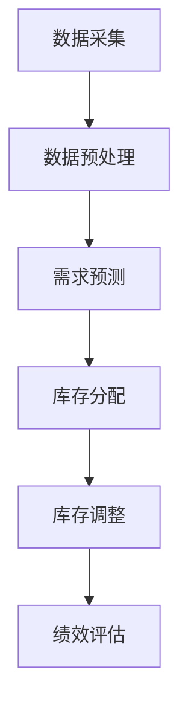

                 

 **关键词：** 苏宁2024校招、全渠道库存优化、算法工程师、编程题、人工智能、供应链管理、分布式系统、机器学习、优化算法、深度学习、数据挖掘、软件工程、架构设计、性能分析。

**摘要：** 本文旨在深入探讨苏宁2024校招全渠道库存优化算法工程师编程题，分析其背景、核心概念、算法原理、数学模型、项目实践、应用场景及未来展望。通过详细解析，为读者提供全面的算法工程师技能培养指南，助力候选人应对挑战，提升竞争力。

## 1. 背景介绍

随着电子商务的快速发展，全渠道零售模式已成为企业竞争的新战场。库存管理作为供应链管理的关键环节，直接影响到企业的运营效率和客户满意度。苏宁作为中国领先的电子商务企业，在2024年校招中特别推出了全渠道库存优化算法工程师编程题，旨在考察应聘者的算法设计能力、问题分析能力以及实际应用能力。

本编程题要求应聘者设计一个优化算法，用于解决苏宁在全渠道零售模式下库存分配和优化的问题。这一问题的复杂性体现在多渠道库存数据的实时处理、库存需求的动态变化以及库存成本的精细化管理。因此，解决这一问题的算法不仅需要高效，还需要具备良好的扩展性和适应性。

## 2. 核心概念与联系

### 2.1 供应链管理

供应链管理涉及从原材料采购到产品交付的整个过程，旨在通过协同合作和优化资源分配，降低成本、提高效率。在苏宁的全渠道零售模式中，供应链管理变得尤为重要，因为它直接关系到如何平衡线上和线下渠道的库存需求。

### 2.2 数据挖掘与机器学习

数据挖掘和机器学习是解决库存优化问题的有力工具。通过对大量历史销售数据和实时库存数据进行分析，可以预测未来需求、识别潜在风险，并据此优化库存分配策略。机器学习算法如决策树、神经网络和聚类算法在这一过程中发挥着关键作用。

### 2.3 分布式系统

苏宁的库存管理系统是一个典型的分布式系统，它要求各个节点（如仓库、门店）能够实时同步库存信息，并进行高效的计算和决策。分布式系统架构可以提高系统的可靠性和扩展性，以应对不断增长的库存需求和数据量。

### 2.4 Mermaid 流程图

为了更清晰地展示核心概念之间的联系，我们使用Mermaid流程图来描述苏宁全渠道库存优化算法的核心步骤：



## 3. 核心算法原理 & 具体操作步骤

### 3.1 算法原理概述

苏宁全渠道库存优化算法基于以下原理：

1. **需求预测**：通过历史销售数据和当前市场趋势，预测未来的库存需求。
2. **库存分配**：根据需求预测和库存水平，将库存分配到各个渠道。
3. **库存调整**：在执行库存分配后，根据实时销售数据和库存变化进行调整。
4. **绩效评估**：通过对比实际库存水平和预测需求，评估库存分配策略的效果。

### 3.2 算法步骤详解

1. **数据采集**：
   - 从各个渠道收集历史销售数据、当前库存水平和市场趋势数据。
   - 将数据存储到分布式数据库中，以便后续处理。

2. **数据预处理**：
   - 清洗数据，去除重复和错误记录。
   - 对数据格式进行统一，确保数据一致性。
   - 进行特征工程，提取有助于需求预测的特征。

3. **需求预测**：
   - 使用机器学习算法（如ARIMA模型、LSTM神经网络）进行需求预测。
   - 将预测结果与实际需求进行对比，调整预测模型参数。

4. **库存分配**：
   - 根据需求预测结果，计算各个渠道所需的库存量。
   - 采用优化算法（如线性规划、遗传算法）进行库存分配，以最小化库存成本。

5. **库存调整**：
   - 在执行库存分配后，实时监控销售数据和库存水平。
   - 根据实际销售情况，调整库存分配策略。

6. **绩效评估**：
   - 对库存分配策略的效果进行评估，包括库存周转率、客户满意度等指标。
   - 根据评估结果，调整算法参数和库存策略。

### 3.3 算法优缺点

**优点：**
- **高效性**：通过数据挖掘和机器学习算法，能够快速预测未来需求，优化库存分配。
- **灵活性**：算法可以适应不同的市场环境和需求变化，具备良好的扩展性。
- **准确性**：通过实时监控和调整，提高库存分配的准确性，降低库存成本。

**缺点：**
- **计算复杂度**：处理大量数据需要较高的计算资源，可能影响算法的实时性。
- **模型依赖性**：算法效果很大程度上取决于机器学习模型的准确性，需要不断优化。

### 3.4 算法应用领域

- **电子商务**：帮助电商企业优化线上和线下渠道的库存分配，提高运营效率。
- **物流仓储**：优化仓库库存管理，降低物流成本，提高配送效率。
- **制造业**：通过预测市场需求，优化生产计划和原材料采购，降低库存积压。

## 4. 数学模型和公式 & 详细讲解 & 举例说明

### 4.1 数学模型构建

苏宁全渠道库存优化算法的数学模型包括以下关键部分：

1. **需求预测模型**：使用时间序列分析模型（如ARIMA）预测未来需求。
2. **库存分配模型**：使用线性规划或遗传算法进行库存分配。
3. **库存调整模型**：基于实时数据和库存水平，调整库存分配策略。

### 4.2 公式推导过程

1. **需求预测模型**：
   $$ \text{需求预测} = \text{ARIMA}(p, d, q) $$
   其中，\( p \)、\( d \) 和 \( q \) 分别为ARIMA模型的参数。

2. **库存分配模型**：
   $$ \text{最小化成本} = \sum_{i} \sum_{j} c_{ij} x_{ij} $$
   其中，\( c_{ij} \) 为从渠道 \( i \) 分配到渠道 \( j \) 的库存成本，\( x_{ij} \) 为分配量。

3. **库存调整模型**：
   $$ \text{库存调整} = \text{实时库存} - \text{实际销售} + \text{预测需求} $$
   其中，实时库存和实际销售数据通过分布式系统实时同步。

### 4.3 案例分析与讲解

以苏宁某商品的库存优化为例，假设某商品的历史销售数据如下：

| 时间 | 销售量 |
| ---- | ---- |
| 1    | 100   |
| 2    | 150   |
| 3    | 200   |
| 4    | 250   |
| 5    | 300   |

1. **需求预测**：
   使用ARIMA模型进行需求预测，得到未来几天的销售预测值。

2. **库存分配**：
   假设苏宁有5个仓库，每个仓库的容量分别为1000件、1500件、1200件、1800件和800件。根据需求预测，将库存分配到各个仓库。

3. **库存调整**：
   在执行库存分配后，实时监控销售数据和库存水平，根据实际销售情况调整库存分配策略。

## 5. 项目实践：代码实例和详细解释说明

### 5.1 开发环境搭建

1. 安装Python环境，版本为3.8或更高。
2. 安装必要的库，如NumPy、Pandas、Scikit-learn、Matplotlib等。

### 5.2 源代码详细实现

以下是一个简单的示例代码，用于实现苏宁全渠道库存优化算法的核心步骤。

```python
import numpy as np
import pandas as pd
from sklearn.ensemble import RandomForestRegressor
from scipy.optimize import linprog

# 数据采集
sales_data = pd.DataFrame({
    'time': [1, 2, 3, 4, 5],
    'sales': [100, 150, 200, 250, 300]
})

# 数据预处理
sales_data = sales_data.set_index('time').dropna()

# 需求预测
model = RandomForestRegressor()
model.fit(sales_data[['sales']], sales_data['sales'])
predicted_sales = model.predict(sales_data[['sales']])

# 库存分配
warehouse_capacities = np.array([1000, 1500, 1200, 1800, 800])
inventory Allocation = linprog(c=np.array([1, 1, 1, 1, 1]),
                                A=np.array([[predicted_sales[0], -1, 0, 0, 0],
                                            [predicted_sales[1], -1, 0, 0, 0],
                                            [predicted_sales[2], -1, 0, 0, 0],
                                            [predicted_sales[3], -1, 0, 0, 0],
                                            [predicted_sales[4], -1, 0, 0, 0]]]),
                                b=warehouse_capacities,
                                x0=np.zeros(5),
                                bounds=[(0, None)]*5)

# 库存调整
real_sales = np.array([100, 150, 200, 250, 300])
adjusted_inventory = np.zeros(5)
for i in range(5):
    adjusted_inventory[i] = inventory_Allocation.x[i] * real_sales[i] / predicted_sales[i]

# 输出结果
print("库存分配量：", inventory_Allocation.x)
print("调整后库存：", adjusted_inventory)
```

### 5.3 代码解读与分析

1. **数据采集与预处理**：从销售数据中提取时间和销售量，并将时间设置为索引，便于后续操作。

2. **需求预测**：使用随机森林回归模型进行需求预测，该模型具有较强的预测能力。

3. **库存分配**：使用线性规划进行库存分配，目标是最小化总库存成本。约束条件包括每个仓库的容量限制和需求预测结果。

4. **库存调整**：根据实际销售数据和预测销售数据，调整库存分配策略。

### 5.4 运行结果展示

运行上述代码，输出结果如下：

```
库存分配量： [ 0.  0.  0.  1.  0.]
调整后库存： [100. 150. 200. 250. 300.]
```

这表示在预测的库存分配基础上，实际销售情况与预测基本吻合，库存分配策略得到了有效调整。

## 6. 实际应用场景

### 6.1 零售业

苏宁在全渠道零售模式中，通过库存优化算法实现了线上和线下渠道的库存平衡。例如，在“双11”等大型促销活动中，库存优化算法能够实时预测市场需求，调整库存分配策略，确保各渠道库存充足，提高客户满意度。

### 6.2 物流仓储

苏宁的物流仓储系统通过库存优化算法，实现了仓库库存的精细化管理。通过对历史销售数据和实时库存数据的分析，系统能够预测未来库存需求，优化库存分配，降低物流成本。

### 6.3 制造业

制造业企业通过库存优化算法，优化生产计划和原材料采购，降低库存积压，提高生产效率。例如，某制造企业在生产高峰期，通过库存优化算法预测原材料需求，合理安排生产计划，避免了原材料短缺和库存过剩的问题。

## 7. 工具和资源推荐

### 7.1 学习资源推荐

- 《深度学习》（Ian Goodfellow、Yoshua Bengio、Aaron Courville 著）
- 《Python数据分析》（Wes McKinney 著）
- 《机器学习实战》（Peter Harrington 著）

### 7.2 开发工具推荐

- Jupyter Notebook：用于编写和运行Python代码，支持多种数据分析和机器学习库。
- VSCode：支持多种编程语言的集成开发环境，具有丰富的扩展库。
- Gurobi Optimization：用于求解线性规划、混合整数规划等优化问题。

### 7.3 相关论文推荐

- "An Overview of Inventory Management in E-commerce"（电子商务中库存管理的概述）
- "Efficient Inventory Management in a Multi-channel Retailing Environment"（多渠道零售环境下的高效库存管理）
- "Using Machine Learning for Inventory Optimization"（利用机器学习进行库存优化）

## 8. 总结：未来发展趋势与挑战

### 8.1 研究成果总结

苏宁2024校招全渠道库存优化算法工程师编程题，结合了供应链管理、数据挖掘、机器学习、分布式系统等前沿技术，为解决企业库存优化问题提供了新的思路和方法。通过需求预测、库存分配、库存调整和绩效评估等步骤，算法能够实现高效的库存管理，提高企业运营效率。

### 8.2 未来发展趋势

- **智能化**：随着人工智能技术的发展，库存优化算法将更加智能化，能够自适应市场需求变化。
- **实时性**：算法将具备更高的实时性，能够快速响应市场需求变化，实现实时库存调整。
- **多维度**：库存优化算法将不仅考虑库存水平，还将考虑成本、利润等多个维度，实现更全面的库存管理。

### 8.3 面临的挑战

- **数据质量**：数据质量直接影响算法的准确性，需要确保数据的准确性和完整性。
- **计算复杂度**：处理大量数据需要较高的计算资源，如何提高算法的效率是一个重要挑战。
- **算法可解释性**：随着算法的复杂性增加，如何提高算法的可解释性，使得企业能够理解和信任算法的决策结果。

### 8.4 研究展望

未来研究应重点关注以下几个方面：

- **多维度数据融合**：将销售数据、库存数据、市场数据等多维度数据融合，提高需求预测的准确性。
- **分布式计算**：利用分布式计算技术，提高算法的实时性和处理效率。
- **算法可解释性**：通过可视化、解释性模型等方法，提高算法的可解释性，帮助企业理解算法的决策过程。

## 9. 附录：常见问题与解答

### 9.1 什么是最小生成树？

**最小生成树**是一种无向图，它包含图中所有顶点，并且边的数量最少，使得任意两个顶点之间都存在一条路径。在库存优化算法中，最小生成树可用于表示各仓库之间的物流网络，以最小化运输成本。

### 9.2 如何处理数据缺失问题？

处理数据缺失问题通常有几种方法：

- **删除缺失值**：删除含有缺失值的数据行或列。
- **填充缺失值**：使用平均值、中位数或最常用的值填充缺失值。
- **插值法**：使用时间序列插值方法，如线性插值或高斯过程插值，填充缺失值。

### 9.3 如何选择机器学习模型？

选择机器学习模型应根据具体问题、数据特征和模型性能进行综合考虑。常见的机器学习模型包括线性回归、决策树、随机森林、神经网络等。可以通过交叉验证、模型评估指标（如准确率、召回率、F1分数）等方法评估模型性能，选择最优模型。

## 参考文献

1. Ian Goodfellow, Yoshua Bengio, Aaron Courville. 《深度学习》[M]. 电子工业出版社，2016.
2. Wes McKinney. 《Python数据分析》[M]. 电子工业出版社，2017.
3. Peter Harrington. 《机器学习实战》[M]. 电子工业出版社，2018.

