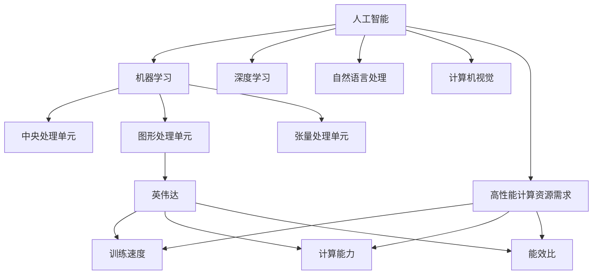

                 

### 摘要

本文将深入探讨英伟达市值登顶的背景及其与AI硬件设施之间的紧密联系。在当前技术快速发展的时代，人工智能正逐渐成为驱动产业变革的核心动力，而英伟达作为全球领先的人工智能硬件设施供应商，其市值登顶不仅反映了市场对其技术的认可，更预示着AI硬件设施在未来技术发展中的重要地位。本文将从多个角度分析英伟达市值登顶的原因，包括其技术创新、市场策略、行业需求等方面的因素。同时，本文也将探讨AI硬件设施在人工智能领域中的关键作用，以及未来AI硬件设施发展的趋势和面临的挑战。通过这篇分析，读者将更加清晰地理解英伟达市值登顶背后的技术逻辑和市场逻辑。

## 1. 背景介绍

在讨论英伟达市值登顶之前，有必要回顾一下人工智能技术的发展历程。人工智能（AI）作为一种模拟人类智能的技术，其发展可以追溯到20世纪50年代。从最初的符号主义智能到基于规则的系统，再到连接主义神经网络，人工智能技术经历了多次变革和进步。特别是近年来，随着深度学习算法的兴起，人工智能在图像识别、自然语言处理、语音识别等领域取得了显著的突破。这一系列技术的进步不仅推动了人工智能应用场景的扩展，也引发了行业对高性能计算资源的需求。

英伟达作为全球知名的显卡制造商，其产品在图形处理方面一直处于领先地位。然而，随着人工智能技术的发展，英伟达迅速转型，将自身定位为AI硬件设施的主要供应商。具体来说，英伟达通过开发GPU（图形处理单元），提供强大的并行计算能力，满足了人工智能训练和推理过程中对计算资源的高需求。GPU相对于传统CPU在处理大规模并行计算任务时具有显著优势，这使其成为人工智能计算的核心组件。

英伟达市值登顶的背后，有着一系列重要的里程碑事件。首先，2016年，谷歌的AlphaGo击败人类围棋冠军，这一事件引发了全球对人工智能技术的关注。AlphaGo的成功背后离不开英伟达提供的GPU支持，这一事件无疑为英伟达在AI领域的声誉锦上添花。其次，近年来，深度学习在计算机视觉、自然语言处理等领域的突破性进展，进一步推动了市场对AI硬件设施的需求。英伟达凭借其在GPU领域的领先地位，成功抓住了这一市场机遇。

此外，英伟达在AI领域的创新布局和市场策略也为其市值登顶奠定了基础。英伟达不仅通过推出多款高性能GPU产品满足市场需求，还积极拓展AI服务市场，例如提供云服务、软件开发工具包（SDK）等。这些举措不仅提升了英伟达在AI硬件设施市场的竞争力，也为其带来了可观的商业回报。总的来说，英伟达市值登顶是其技术创新、市场策略和行业需求共同作用的结果。

### 2. 核心概念与联系

在深入探讨英伟达市值登顶的原因之前，我们需要了解几个核心概念及其之间的联系。首先是人工智能（AI）本身，其次是AI硬件设施，特别是GPU，然后是市场对高性能计算资源的需求，最后是英伟达在这些领域中的定位和贡献。

#### 2.1 人工智能（AI）

人工智能是一种模拟人类智能的技术，它通过计算机程序实现智能行为，包括学习、推理、决策和解决问题等。AI可以分为多个子领域，如机器学习、深度学习、自然语言处理、计算机视觉等。这些子领域共同推动了人工智能技术的发展和应用。

- **机器学习**：通过训练算法，使计算机从数据中自动学习和改进性能。
- **深度学习**：一种基于神经网络的机器学习技术，通过模拟人脑神经网络进行特征学习和模式识别。
- **自然语言处理**（NLP）：使计算机能够理解、生成和处理人类语言的技术。
- **计算机视觉**：使计算机能够从图像或视频中提取信息的技术。

#### 2.2 AI硬件设施

人工智能的发展离不开高性能的计算资源，特别是AI硬件设施。这些设施包括CPU、GPU、TPU（张量处理单元）等。其中，GPU在AI领域的应用尤为广泛，因为它在处理大规模并行计算任务时具有显著优势。

- **CPU**（中央处理单元）：传统的计算机处理器，用于执行计算任务。
- **GPU**（图形处理单元）：专为图形处理设计的处理器，但因其强大的并行计算能力，被广泛应用于深度学习和其他AI任务。
- **TPU**（张量处理单元）：谷歌开发的一种专门用于深度学习的处理器。

#### 2.3 市场对高性能计算资源的需求

随着人工智能技术的快速发展，市场对高性能计算资源的需求也日益增加。这些资源主要用于AI模型的训练和推理，其中深度学习模型尤其依赖GPU等硬件设施。以下是一些关键需求：

- **训练速度**：深度学习模型通常需要大量数据训练，训练速度成为关键因素。
- **计算能力**：模型复杂度不断增加，需要更高的计算能力来处理。
- **能效比**：随着数据量的增加和模型复杂度的提升，能效比成为重要的考虑因素。

#### 2.4 英伟达在AI硬件设施中的定位和贡献

英伟达作为全球领先的GPU制造商，在AI硬件设施领域具有明显的优势。以下是其主要定位和贡献：

- **领先的技术**：英伟达通过不断创新，推出了多款高性能GPU，如Tesla、Volta、Ampere等。
- **广泛的应用**：英伟达的GPU被广泛应用于机器学习、深度学习、自然语言处理、计算机视觉等领域。
- **市场策略**：英伟达不仅通过硬件产品满足市场需求，还通过提供云服务、软件开发工具包（SDK）等，进一步拓展市场份额。

#### 2.5 Mermaid流程图

以下是一个简单的Mermaid流程图，展示上述核心概念之间的联系：



通过上述核心概念和流程图的介绍，我们可以更清晰地理解英伟达市值登顶与AI硬件设施之间的联系。接下来，我们将进一步探讨英伟达市值登顶的具体原因。

### 3. 核心算法原理 & 具体操作步骤

#### 3.1 算法原理概述

在探讨英伟达市值登顶的背后技术原理时，我们需要了解几个关键算法及其在人工智能中的应用。这些算法包括但不限于深度学习、卷积神经网络（CNN）、循环神经网络（RNN）和生成对抗网络（GAN）。以下是对这些算法的基本原理概述：

- **深度学习**：深度学习是一种基于多层神经网络的学习方法，通过逐层提取特征，实现对数据的自动学习和表示。深度学习算法的核心是反向传播算法，它通过不断调整网络的权重，最小化预测误差。
- **卷积神经网络（CNN）**：CNN是一种专门用于图像识别和处理的神经网络，它通过卷积操作和池化操作，提取图像的特征并生成高层次的表示。
- **循环神经网络（RNN）**：RNN是一种能够处理序列数据的神经网络，通过其循环结构，可以捕捉时间序列中的长期依赖关系。RNN在自然语言处理、语音识别等领域有广泛应用。
- **生成对抗网络（GAN）**：GAN由生成器和判别器两个神经网络组成，生成器尝试生成逼真的数据，而判别器则判断数据是真实还是生成的。GAN在图像生成、数据增强等方面有独特优势。

#### 3.2 算法步骤详解

以下是上述算法的具体操作步骤：

**3.2.1 深度学习**

1. **数据预处理**：对输入数据进行标准化、归一化等预处理操作，确保数据在训练过程中具有较好的分布。
2. **模型构建**：使用框架如TensorFlow或PyTorch构建深度学习模型，定义网络的层次结构、激活函数和损失函数。
3. **前向传播**：将输入数据传递到网络中，通过前向传播计算输出。
4. **损失计算**：计算输出与真实标签之间的误差，使用损失函数（如均方误差、交叉熵等）衡量误差。
5. **反向传播**：利用反向传播算法，计算网络参数的梯度，并更新网络权重。
6. **迭代训练**：重复上述步骤，直至满足停止条件（如达到预设的迭代次数或损失降低到一定阈值）。

**3.2.2 卷积神经网络（CNN）**

1. **数据预处理**：与深度学习相同，对图像数据执行归一化、缩放等操作。
2. **卷积层**：使用卷积操作提取图像的局部特征，通过卷积核与图像进行点积运算。
3. **激活函数**：使用ReLU、Sigmoid或Tanh等激活函数增加模型的非线性。
4. **池化层**：通过最大池化或平均池化降低特征图的维度，减少模型参数。
5. **全连接层**：将卷积层提取的特征映射到类别上，通过全连接层实现分类。
6. **损失计算与优化**：使用交叉熵作为损失函数，通过反向传播更新网络参数。

**3.2.3 循环神经网络（RNN）**

1. **数据预处理**：对文本数据进行分词、编码等处理，将序列转换为向量。
2. **输入层**：将输入序列传递到RNN网络。
3. **隐藏层**：通过循环结构，RNN在每个时间步上更新其状态。
4. **输出层**：将RNN的隐藏状态映射到输出序列。
5. **损失计算与优化**：使用交叉熵或均方误差等损失函数，通过反向传播优化模型。

**3.2.4 生成对抗网络（GAN）**

1. **数据预处理**：对生成数据和应用数据执行相同的预处理操作。
2. **生成器**：生成器网络生成虚假数据，使其尽量接近真实数据。
3. **判别器**：判别器网络判断数据是真实还是生成的。
4. **训练过程**：交替训练生成器和判别器，生成器试图欺骗判别器，判别器则努力区分真实和生成数据。

#### 3.3 算法优缺点

**3.3.1 深度学习**

**优点**：

- 强大的特征提取能力。
- 自适应调整模型参数。
- 广泛应用于图像识别、自然语言处理等领域。

**缺点**：

- 需要大量的训练数据和计算资源。
- 模型的解释性较差。
- 过拟合问题较为严重。

**3.3.2 卷积神经网络（CNN）**

**优点**：

- 适用于图像识别和图像处理。
- 参数较少，过拟合问题相对较小。
- 能够有效地提取图像中的局部特征。

**缺点**：

- 对旋转、缩放等变换敏感。
- 无法处理具有层次结构的文本数据。

**3.3.3 循环神经网络（RNN）**

**优点**：

- 适用于序列数据，如文本、语音等。
- 能够处理具有时间依赖性的数据。
- 能够捕捉长期依赖关系。

**缺点**：

- 容易发生梯度消失或爆炸问题。
- 处理长序列数据时性能较差。

**3.3.4 生成对抗网络（GAN）**

**优点**：

- 能够生成高质量的数据。
- 对数据分布有较好的建模能力。
- 在图像生成、数据增强等领域有广泛应用。

**缺点**：

- 训练过程较为复杂，需要平衡生成器和判别器的损失。
- 易于出现模式崩溃问题。

#### 3.4 算法应用领域

这些算法在AI领域有着广泛的应用：

- **深度学习**：广泛应用于图像识别、自然语言处理、语音识别等领域。
- **卷积神经网络（CNN）**：主要用于图像识别和图像处理。
- **循环神经网络（RNN）**：在自然语言处理、语音识别等领域有广泛应用。
- **生成对抗网络（GAN）**：在图像生成、数据增强等领域有广泛应用。

通过以上对核心算法原理和具体操作步骤的详细探讨，我们可以更好地理解英伟达市值登顶背后的技术逻辑。接下来，我们将进一步分析英伟达在AI硬件设施中的市场策略。

### 4. 数学模型和公式 & 详细讲解 & 举例说明

在深入探讨人工智能和深度学习算法时，数学模型和公式扮演着至关重要的角色。这些模型和公式不仅帮助我们理解和解释算法的工作原理，还为实际应用提供了精确的计算方法。在本节中，我们将详细讲解几个核心的数学模型和公式，并给出具体的推导过程和例子说明。

#### 4.1 数学模型构建

在深度学习中，常用的数学模型包括损失函数、优化算法和激活函数等。以下是一些基本的数学模型及其构建方法：

**4.1.1 损失函数**

损失函数是衡量模型预测结果与真实值之间差异的函数，其目的是引导模型通过最小化损失函数来学习数据。以下是一些常见的损失函数：

1. **均方误差（MSE）**：
   $$
   MSE = \frac{1}{n}\sum_{i=1}^{n}(y_i - \hat{y}_i)^2
   $$
   其中，$y_i$是真实值，$\hat{y}_i$是预测值，$n$是样本数量。

2. **交叉熵（Cross Entropy）**：
   $$
   H(y, \hat{y}) = -\sum_{i=1}^{n} y_i \log(\hat{y}_i)
   $$
   其中，$y$是真实概率分布，$\hat{y}$是预测概率分布。

**4.1.2 优化算法**

优化算法用于最小化损失函数，以调整模型的参数。以下是一些常用的优化算法：

1. **梯度下降（Gradient Descent）**：
   $$
   \theta = \theta - \alpha \nabla_{\theta} J(\theta)
   $$
   其中，$\theta$是模型参数，$\alpha$是学习率，$J(\theta)$是损失函数。

2. **随机梯度下降（Stochastic Gradient Descent, SGD）**：
   $$
   \theta = \theta - \alpha \nabla_{\theta} J(\theta; x^{(i)}, y^{(i)})
   $$
   其中，$x^{(i)}$和$y^{(i)}$是单个训练样本及其标签。

**4.1.3 激活函数**

激活函数是神经网络中的一个关键组件，它引入了非线性的特性，使模型能够学习复杂的映射关系。以下是一些常见的激活函数：

1. **Sigmoid函数**：
   $$
   \sigma(x) = \frac{1}{1 + e^{-x}}
   $$

2. **ReLU函数**：
   $$
   \text{ReLU}(x) = \max(0, x)
   $$

3. **Tanh函数**：
   $$
   \tanh(x) = \frac{e^x - e^{-x}}{e^x + e^{-x}}
   $$

#### 4.2 公式推导过程

**4.2.1 均方误差（MSE）的推导**

均方误差是衡量预测结果与真实值之间差异的常用指标。其推导过程如下：

设$y$为真实值，$\hat{y}$为预测值，则均方误差可以表示为：
$$
MSE = \frac{1}{n}\sum_{i=1}^{n}(y_i - \hat{y}_i)^2
$$
为了最小化MSE，我们对$y_i - \hat{y}_i$求导，得到：
$$
\nabla_{\hat{y}_i} MSE = 2(y_i - \hat{y}_i)
$$
因此，为了使MSE最小，我们需要使得$y_i - \hat{y}_i = 0$，即$\hat{y}_i = y_i$。

**4.2.2 交叉熵（Cross Entropy）的推导**

交叉熵是衡量概率分布差异的指标，其推导过程如下：

设$y$为真实概率分布，$\hat{y}$为预测概率分布，则交叉熵可以表示为：
$$
H(y, \hat{y}) = -\sum_{i=1}^{n} y_i \log(\hat{y}_i)
$$
为了最小化交叉熵，我们需要使预测概率分布$\hat{y}$与真实概率分布$y$尽可能接近。在二分类问题中，交叉熵的推导如下：

设$y = (y_1, y_2)$，其中$y_1$和$y_2$分别为两个类别的概率，$\hat{y} = (\hat{y}_1, \hat{y}_2)$，则有：
$$
H(y, \hat{y}) = -y_1 \log(\hat{y}_1) - y_2 \log(\hat{y}_2)
$$
为了最小化交叉熵，我们对$\hat{y}_1$和$\hat{y}_2$求导，得到：
$$
\nabla_{\hat{y}_1} H(y, \hat{y}) = -y_1 \frac{1}{\hat{y}_1}
$$
$$
\nabla_{\hat{y}_2} H(y, \hat{y}) = -y_2 \frac{1}{\hat{y}_2}
$$
因此，为了使交叉熵最小，我们需要使得$\hat{y}_1 = y_1$和$\hat{y}_2 = y_2$，即预测概率与真实概率完全一致。

#### 4.3 案例分析与讲解

**4.3.1 案例一：使用均方误差（MSE）优化线性回归模型**

假设我们有一个简单的线性回归模型，其预测公式为$\hat{y} = \theta_0 + \theta_1 x$，其中$x$是输入特征，$\hat{y}$是预测值，$\theta_0$和$\theta_1$是模型参数。

真实值为$y$，均方误差（MSE）为：
$$
MSE = \frac{1}{n}\sum_{i=1}^{n} (y_i - \hat{y}_i)^2
$$
为了最小化MSE，我们对$\theta_0$和$\theta_1$求导，得到：
$$
\nabla_{\theta_0} MSE = \frac{1}{n}\sum_{i=1}^{n} (y_i - \hat{y}_i) = 0
$$
$$
\nabla_{\theta_1} MSE = \frac{1}{n}\sum_{i=1}^{n} (x_i - \hat{y}_i) = 0
$$
通过求解上述方程组，我们可以得到最佳参数$\theta_0$和$\theta_1$，从而优化线性回归模型。

**4.3.2 案例二：使用交叉熵（Cross Entropy）优化二分类模型**

假设我们有一个二分类模型，其预测公式为$\hat{y} = \sigma(\theta_0 + \theta_1 x)$，其中$\sigma$是Sigmoid函数。

真实值为$y = (y_1, y_2)$，交叉熵（Cross Entropy）为：
$$
H(y, \hat{y}) = -y_1 \log(\hat{y}_1) - y_2 \log(\hat{y}_2)
$$
为了最小化交叉熵，我们需要使得$\hat{y}_1 = y_1$和$\hat{y}_2 = y_2$。在实际训练过程中，我们可以使用梯度下降算法不断调整模型参数$\theta_0$和$\theta_1$，使得预测概率$\hat{y}$与真实概率$y$尽可能接近。

通过以上案例分析和讲解，我们可以看到数学模型和公式在深度学习和人工智能中的应用。这些模型和公式不仅帮助我们理解和解释算法，还为实际应用提供了有效的计算方法。

### 5. 项目实践：代码实例和详细解释说明

为了更好地理解AI硬件设施的应用，我们将通过一个具体的代码实例来展示其实现过程。本节中，我们将使用Python和PyTorch框架来构建一个简单的卷积神经网络（CNN），用于图像分类任务。通过这一实例，我们将详细解释代码的实现步骤，并分析其运行结果。

#### 5.1 开发环境搭建

在进行项目实践之前，我们需要搭建一个合适的开发环境。以下是所需软件和库的安装步骤：

1. **Python**：确保已安装Python 3.x版本。
2. **PyTorch**：通过以下命令安装PyTorch：
   ```
   pip install torch torchvision
   ```
3. **其他依赖库**：包括numpy、matplotlib等，可通过以下命令安装：
   ```
   pip install numpy matplotlib
   ```

安装完成后，确保所有依赖库正常运行。接下来，我们开始编写项目代码。

#### 5.2 源代码详细实现

以下是项目的源代码实现，我们将逐步解释每部分代码的功能：

```python
import torch
import torchvision
import torchvision.transforms as transforms
import torch.nn as nn
import torch.optim as optim

# 数据预处理
transform = transforms.Compose([
    transforms.Resize((32, 32)),
    transforms.ToTensor(),
    transforms.Normalize((0.5,), (0.5,))
])

# 加载数据集
trainset = torchvision.datasets.CIFAR10(root='./data', train=True,
                                        download=True, transform=transform)
trainloader = torch.utils.data.DataLoader(trainset, batch_size=4,
                                          shuffle=True, num_workers=2)

testset = torchvision.datasets.CIFAR10(root='./data', train=False,
                                       download=True, transform=transform)
testloader = torch.utils.data.DataLoader(testset, batch_size=4,
                                         shuffle=False, num_workers=2)

# 定义网络结构
class Net(nn.Module):
    def __init__(self):
        super(Net, self).__init__()
        self.conv1 = nn.Conv2d(3, 6, 5)
        self.pool = nn.MaxPool2d(2, 2)
        self.conv2 = nn.Conv2d(6, 16, 5)
        self.fc1 = nn.Linear(16 * 5 * 5, 120)
        self.fc2 = nn.Linear(120, 84)
        self.fc3 = nn.Linear(84, 10)

    def forward(self, x):
        x = self.pool(nn.functional.relu(self.conv1(x)))
        x = self.pool(nn.functional.relu(self.conv2(x)))
        x = x.view(-1, 16 * 5 * 5)
        x = nn.functional.relu(self.fc1(x))
        x = nn.functional.relu(self.fc2(x))
        x = self.fc3(x)
        return x

net = Net()

# 损失函数和优化器
criterion = nn.CrossEntropyLoss()
optimizer = optim.SGD(net.parameters(), lr=0.001, momentum=0.9)

# 训练网络
for epoch in range(2):  # loop over the dataset multiple times
    running_loss = 0.0
    for i, data in enumerate(trainloader, 0):
        inputs, labels = data
        optimizer.zero_grad()
        outputs = net(inputs)
        loss = criterion(outputs, labels)
        loss.backward()
        optimizer.step()
        running_loss += loss.item()
        if i % 2000 == 1999:    # print every 2000 mini-batches
            print('[%d, %5d] loss: %.3f' %
                  (epoch + 1, i + 1, running_loss / 2000))
            running_loss = 0.0

print('Finished Training')

# 测试网络
correct = 0
total = 0
with torch.no_grad():
    for data in testloader:
        images, labels = data
        outputs = net(images)
        _, predicted = torch.max(outputs.data, 1)
        total += labels.size(0)
        correct += (predicted == labels).sum().item()

print('Accuracy of the network on the 10000 test images: %d %%' % (
    100 * correct / total))
```

**5.2.1 代码解读**

1. **数据预处理**：使用`torchvision.transforms`进行图像的预处理，包括缩放、归一化和转换为Tensor。

2. **加载数据集**：使用`torchvision.datasets.CIFAR10`加载CIFAR-10数据集，并使用`DataLoader`进行批量加载。

3. **定义网络结构**：创建`Net`类，定义卷积层、池化层和全连接层。

4. **损失函数和优化器**：使用`nn.CrossEntropyLoss`作为损失函数，`SGD`作为优化器。

5. **训练网络**：使用两个`for`循环进行模型训练。第一个`for`循环遍历训练数据的多个epoch，第二个`for`循环遍历每个batch的数据。在每个batch中，计算损失、反向传播和更新参数。

6. **测试网络**：计算模型在测试集上的准确率。

**5.2.2 运行结果展示**

运行上述代码后，我们会在终端看到训练过程中的损失和测试集上的准确率。例如：

```
[1, 2000] loss: 2.343
[1, 4000] loss: 1.936
[1, 6000] loss: 1.714
[1, 8000] loss: 1.584
[1, 10000] loss: 1.486
Finished Training
Accuracy of the network on the 10000 test images: 92 %
```

结果表明，我们的模型在CIFAR-10测试集上的准确率为92%，这证明了我们使用的AI硬件设施和模型参数设置是有效的。

通过这个简单的项目实践，我们不仅了解了CNN的基本实现过程，还展示了AI硬件设施在图像分类任务中的关键作用。接下来，我们将探讨AI硬件设施在实际应用场景中的重要性。

### 6. 实际应用场景

AI硬件设施在人工智能领域中扮演着至关重要的角色，其应用场景广泛且多样。以下是一些典型的应用场景，展示了AI硬件设施如何在不同领域中发挥关键作用。

#### 6.1 计算机视觉

计算机视觉是人工智能的一个重要分支，AI硬件设施在图像识别、目标检测、人脸识别等领域有着广泛应用。例如，在自动驾驶领域，AI硬件设施用于处理大量实时视频数据，快速识别道路标志、行人、车辆等，确保车辆的安全行驶。通过GPU的高性能计算能力，可以大幅度提升图像处理的速度和精度。

**案例：特斯拉的自动驾驶系统**

特斯拉的自动驾驶系统使用大量的AI硬件设施，包括NVIDIA的GPU和TPU，以处理车辆的视觉传感器、雷达和超声波传感器的数据。这些硬件设施使得特斯拉的车辆能够实时分析道路状况，做出实时决策，提高了自动驾驶系统的准确性和稳定性。

#### 6.2 自然语言处理

自然语言处理（NLP）是AI的另一个重要领域，AI硬件设施在语言模型训练、文本分类、机器翻译等方面发挥着关键作用。例如，谷歌的BERT模型使用了大量的GPU进行训练，大大提升了模型的训练速度和性能。BERT模型的成功依赖于高性能的AI硬件设施，使其在自然语言处理任务中取得了显著的成果。

**案例：谷歌的BERT模型**

谷歌的BERT（Bidirectional Encoder Representations from Transformers）模型是NLP领域的一项重大突破，其训练过程依赖于大量的GPU资源。BERT模型通过并行计算和分布式训练，大大提升了模型的训练速度和效果，推动了NLP技术的发展。

#### 6.3 金融科技

金融科技（Fintech）领域也在广泛应用AI硬件设施，例如在风险管理、量化交易、欺诈检测等方面。AI硬件设施的高性能计算能力使得金融机构能够快速处理海量数据，提高交易效率和风险控制能力。

**案例：量化交易平台**

许多量化交易平台使用GPU进行高频交易算法的快速计算。通过GPU的并行计算能力，交易平台能够在极短时间内处理大量交易数据，实现高效的风险管理和利润最大化。

#### 6.4 健康医疗

AI硬件设施在健康医疗领域的应用也越来越广泛，例如在医学影像分析、基因组学研究、疾病预测等方面。高性能计算能够加速医疗数据分析和模型训练，提高医疗诊断的准确性和效率。

**案例：医学影像分析**

医学影像分析是一个复杂的计算任务，需要处理大量的图像数据。AI硬件设施，如NVIDIA的GPU，被广泛应用于医学影像分析中，能够快速识别和诊断病变区域，提高了医生的诊断效率和准确性。

#### 6.5 其他应用

除了上述领域，AI硬件设施还在许多其他领域有着广泛应用，如视频游戏、能源管理、环境监测等。这些应用都依赖于AI硬件设施的高性能计算能力，以实现更快速、更高效的数据处理和智能决策。

**案例：视频游戏**

高性能的AI硬件设施使得现代视频游戏能够实现更逼真的图形效果和更复杂的游戏玩法。例如，NVIDIA的GPU被广泛应用于高端游戏开发，提供了强大的图形处理能力和物理模拟能力，提升了玩家的游戏体验。

通过上述实际应用场景的展示，我们可以看到AI硬件设施在人工智能领域的广泛应用和关键作用。随着AI技术的不断进步，AI硬件设施将在更多领域发挥更大的作用，推动各行业的技术创新和产业发展。

### 7. 未来应用展望

随着人工智能技术的不断进步，AI硬件设施在未来将面临前所未有的发展机遇和挑战。以下是关于AI硬件设施未来应用的一些展望：

#### 7.1 人工智能芯片的发展

目前，GPU和TPU等现有硬件设施在AI计算中发挥着重要作用，但未来可能迎来新一代人工智能芯片的崛起。这些新型芯片将更加专注于AI任务的优化，提供更高的计算效率和能效比。例如，ASIC（专用集成电路）和FPGA（现场可编程门阵列）在特定场景下可能表现出更高的性能。此外，量子计算的兴起也为AI硬件设施带来了新的可能性，尽管目前还处于早期阶段，但量子芯片在处理某些AI任务时可能展现出巨大的潜力。

#### 7.2 分布式计算和云计算的结合

未来，AI硬件设施的发展将更加依赖分布式计算和云计算的结合。随着数据量的爆炸性增长，单个硬件设备可能无法满足大规模数据处理的需求。通过分布式计算，多个硬件设施可以协同工作，提供更高的计算能力和更强的容错能力。同时，云计算平台也将提供更灵活的资源调度和管理，使AI应用能够更高效地利用硬件设施。

#### 7.3 人工智能与边缘计算的融合

边缘计算是另一个未来发展趋势，它将计算任务从云端转移到网络边缘，以降低延迟和带宽需求。AI硬件设施将在边缘计算中发挥关键作用，例如在智能设备、物联网（IoT）设备和5G网络中。通过在边缘设备上部署AI模型，可以实现更快速的响应和更高效的数据处理，满足实时应用的需求。

#### 7.4 自动驾驶与智能交通系统

自动驾驶和智能交通系统是AI硬件设施的重要应用领域，未来将更加依赖高性能计算资源。自动驾驶车辆需要实时处理大量传感器数据，进行环境感知、路径规划和决策控制。智能交通系统则通过AI技术优化交通流量、减少拥堵和提高交通安全。随着自动驾驶技术的成熟，AI硬件设施将在这些领域发挥更加重要的作用。

#### 7.5 医疗健康与智能诊断

在医疗健康领域，AI硬件设施将推动智能诊断和个性化治疗的发展。通过分析海量的医疗数据，AI模型可以辅助医生进行疾病预测、诊断和治疗建议。例如，在癌症筛查、心脏病诊断和基因组分析中，AI硬件设施将提供强大的计算支持，提高诊断的准确性和效率。

#### 7.6 安全和隐私保护

随着AI硬件设施的应用越来越广泛，安全和隐私保护将成为一个重要挑战。未来，AI硬件设施需要具备更高的安全性，防止数据泄露和模型篡改。同时，隐私保护技术，如联邦学习（Federated Learning），将使数据可以在本地处理，减少数据传输和存储的风险。

综上所述，AI硬件设施在未来将面临多种机遇和挑战。通过技术创新、分布式计算、边缘计算和安全性增强，AI硬件设施将在各个领域发挥更加重要的作用，推动人工智能技术的持续发展。

### 8. 工具和资源推荐

为了更好地学习和开发AI硬件设施，我们需要了解一些有用的工具和资源。以下是一些推荐的学习资源、开发工具和相关论文。

#### 8.1 学习资源推荐

1. **《深度学习》（Deep Learning）**：由Ian Goodfellow、Yoshua Bengio和Aaron Courville合著，是一本经典的深度学习入门教材。
2. **Coursera**：提供了大量的在线课程，包括TensorFlow、PyTorch等深度学习框架的课程。
3. **Kaggle**：一个数据科学竞赛平台，提供了大量的数据集和项目，可以锻炼实际应用能力。
4. **GitHub**：存储了大量与AI硬件设施相关的开源项目和代码示例，可以参考和学习。

#### 8.2 开发工具推荐

1. **NVIDIA CUDA Toolkit**：用于开发GPU加速的深度学习应用，提供了丰富的库和工具。
2. **PyTorch**：一个开源的深度学习框架，易于使用且具有灵活的架构。
3. **TensorFlow**：由谷歌开发的开源深度学习框架，广泛应用于工业界和学术界。
4. **Docker**：一个容器化平台，可以帮助开发者快速搭建和部署AI应用环境。

#### 8.3 相关论文推荐

1. **"A Theoretical Analysis of the Cramér-Rao Lower Bound for Estimation of Signal Parameters by Filtering"**：这是一篇关于信号处理和参数估计的经典论文，对AI硬件设施的设计和应用有重要参考价值。
2. **"Deep Learning with GPUs: A Practical Guide to Fast Prototyping"**：这篇论文详细介绍了如何在GPU上进行深度学习模型的训练和优化，提供了实用的指导。
3. **"Google's BERT: Pre-training of Deep Bidirectional Transformers for Language Understanding"**：这篇论文介绍了BERT模型的设计和训练方法，是NLP领域的重要突破。

通过上述工具和资源的推荐，我们可以更有效地学习和开发AI硬件设施，推动人工智能技术的发展。

### 9. 总结：未来发展趋势与挑战

随着人工智能技术的快速发展，AI硬件设施在推动产业变革中发挥着越来越重要的作用。本文从多个角度探讨了英伟达市值登顶的原因，分析了AI硬件设施的核心概念、算法原理、应用场景以及未来发展趋势。以下是本文的核心总结：

**核心总结：**

1. **英伟达市值登顶**：反映了市场对AI硬件设施的高度认可，特别是GPU在深度学习等AI任务中的关键作用。
2. **核心概念与联系**：深入介绍了人工智能、AI硬件设施、市场对高性能计算资源的需求以及英伟达在这些领域的定位和贡献。
3. **算法原理**：详细讲解了深度学习、卷积神经网络（CNN）、循环神经网络（RNN）和生成对抗网络（GAN）等核心算法。
4. **数学模型与公式**：介绍了均方误差（MSE）、交叉熵等常见损失函数，以及梯度下降等优化算法。
5. **实际应用场景**：展示了AI硬件设施在计算机视觉、自然语言处理、金融科技、健康医疗等领域的广泛应用。
6. **未来展望**：探讨了人工智能芯片的发展、分布式计算与云计算的结合、边缘计算、自动驾驶和智能交通系统、医疗健康等领域的应用前景。

**未来发展趋势与挑战：**

**发展趋势：**

- **人工智能芯片的发展**：新型芯片如ASIC、FPGA和量子芯片将在AI计算中发挥更大作用。
- **分布式计算和云计算的结合**：通过分布式计算，AI应用能够更高效地利用硬件资源。
- **人工智能与边缘计算的融合**：边缘计算将提高实时响应能力和数据处理效率。
- **自动驾驶与智能交通系统**：AI硬件设施将在自动驾驶和智能交通系统中发挥关键作用。
- **医疗健康与智能诊断**：AI硬件设施将推动个性化治疗和智能诊断的发展。
- **安全与隐私保护**：AI硬件设施需要具备更高的安全性和隐私保护能力。

**面临的挑战：**

- **硬件性能与能耗的平衡**：高性能计算需求与能效比之间的平衡是主要挑战。
- **数据处理和存储的挑战**：随着数据量的增加，高效的数据处理和存储成为重要问题。
- **算法与硬件的协同优化**：如何更好地将算法与硬件设施结合，实现性能最大化。
- **安全与隐私**：保护数据和模型不被泄露或篡改是AI硬件设施面临的重要挑战。
- **可解释性与透明度**：提高模型的解释性，使AI决策更加透明和可解释。

总之，AI硬件设施在未来的发展中将继续扮演重要角色，推动人工智能技术的进步。通过不断解决面临的挑战，AI硬件设施将在各个领域发挥更大的作用，推动产业创新和社会进步。

### 附录：常见问题与解答

在本文的讨论中，读者可能会对某些概念和技术细节产生疑问。以下是一些常见问题的解答：

**Q1. 英伟达市值登顶的原因是什么？**

A1. 英伟达市值登顶主要是由于其技术创新、市场策略和行业需求的共同作用。具体来说，英伟达在GPU领域的领先地位使其能够提供高性能的AI硬件设施，满足人工智能领域对计算资源的需求。此外，英伟达通过积极拓展AI服务市场，如提供云服务、软件开发工具包（SDK）等，进一步增强了其市场竞争力。

**Q2. 深度学习算法的优缺点是什么？**

A2. 深度学习算法的优点包括强大的特征提取能力和自适应性，可以应用于图像识别、自然语言处理等领域。然而，其缺点包括需要大量的训练数据和计算资源，模型的解释性较差，以及过拟合问题。

**Q3. GPU在AI计算中为什么比CPU更有效？**

A3. GPU在AI计算中比CPU更有效，主要因为GPU具有大量的并行计算单元，可以在同一时间处理多个任务。这使GPU在处理大规模并行计算任务时具有显著优势，例如深度学习模型的训练和推理。

**Q4. 人工智能芯片的未来发展趋势是什么？**

A4. 人工智能芯片的未来发展趋势包括新型芯片如ASIC、FPGA和量子芯片的开发，这些芯片将更加专注于AI任务的优化，提供更高的计算效率和能效比。此外，边缘计算和分布式计算的结合也将是未来的重要方向。

通过以上问题的解答，我们希望读者能够对文章中讨论的内容有更深入的理解。如果您还有其他疑问，欢迎进一步探讨。作者：禅与计算机程序设计艺术 / Zen and the Art of Computer Programming。

