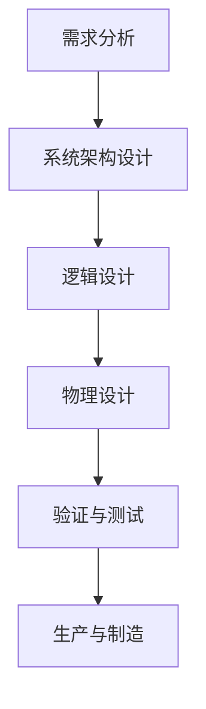
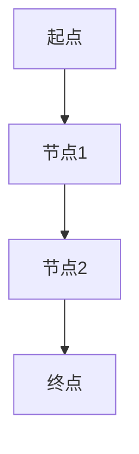
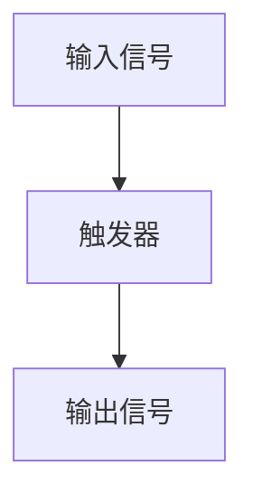
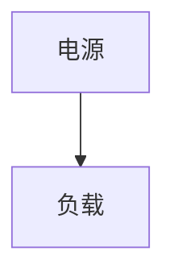
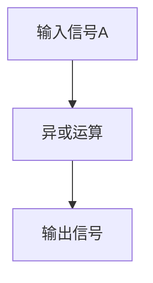

                 

 关键词：2024，校招，芯片设计，面试题集，人工智能，计算机技术，算法原理，数学模型，代码实例，应用场景，未来展望

## 摘要

本文旨在为准备参加英特尔2024校招芯片设计工程师岗位的考生提供一份详尽的面试题集。本文将围绕芯片设计的基本概念、核心算法原理、数学模型、实际应用场景以及未来发展趋势等方面进行探讨。通过本文，读者可以全面了解芯片设计的知识体系，掌握解决实际问题的方法，为成功应对英特尔面试做好准备。

## 1. 背景介绍

随着人工智能、物联网、5G等技术的快速发展，芯片设计成为当今信息技术领域的关键环节。芯片设计的复杂性和重要性日益凸显，使得芯片设计工程师成为各大科技企业争抢的人才。英特尔作为全球领先的芯片制造商，其校招芯片设计工程师岗位吸引了大量优秀人才。本文将针对英特尔2024校招芯片设计工程师面试题集，为广大考生提供宝贵的备考资源。

## 2. 核心概念与联系

### 2.1 芯片设计的基本概念

芯片设计包括数字芯片设计和模拟芯片设计两大类。数字芯片设计主要涉及逻辑电路设计、存储器设计、处理器设计等方面；模拟芯片设计则涉及信号处理、电源管理、无线通信等领域。

### 2.2 芯片设计流程

芯片设计流程主要包括需求分析、系统架构设计、逻辑设计、物理设计、验证与测试等阶段。每个阶段都有相应的工具和方法，如需求分析阶段的系统建模、架构设计阶段的电路仿真、物理设计阶段的布局布线等。

### 2.3 芯片设计中的核心算法

在芯片设计中，核心算法主要包括逻辑优化算法、时序分析算法、功耗优化算法等。这些算法对于提高芯片的性能、降低功耗、减小面积具有重要作用。

### 2.4 芯片设计与人工智能的联系

随着人工智能技术的不断发展，芯片设计领域也受到了深刻影响。人工智能算法在芯片设计中得到了广泛应用，如神经网络加速器、卷积神经网络（CNN）加速器等。这些加速器的设计与实现，对芯片设计工程师提出了更高的要求。

### 2.5 Mermaid 流程图

下面是一个简单的 Mermaid 流程图，展示芯片设计的基本流程：



## 3. 核心算法原理 & 具体操作步骤

### 3.1 算法原理概述

芯片设计中的核心算法主要包括逻辑优化算法、时序分析算法、功耗优化算法等。下面分别介绍这些算法的原理。

#### 3.1.1 逻辑优化算法

逻辑优化算法主要用于提高芯片的性能和降低功耗。其主要目标是在满足设计约束的条件下，优化电路的逻辑结构和布局布线，以减少芯片面积和功耗。

#### 3.1.2 时序分析算法

时序分析算法用于分析电路的时序性能，确保芯片在不同工作频率下都能稳定工作。其主要目标是在满足时序约束的条件下，优化电路的布局布线和时钟网络。

#### 3.1.3 功耗优化算法

功耗优化算法主要用于降低芯片的功耗。其主要目标是在满足性能和时序约束的条件下，优化电路的工作模式、时钟网络和电源管理策略。

### 3.2 算法步骤详解

#### 3.2.1 逻辑优化算法步骤

1. 读取电路网表；
2. 构建电路的布尔表达式；
3. 对布尔表达式进行化简和优化；
4. 生成优化后的电路网表；
5. 验证优化后的电路是否满足设计约束。

#### 3.2.2 时序分析算法步骤

1. 读取电路网表；
2. 构建电路的时序模型；
3. 设置时序约束；
4. 进行时序分析；
5. 优化电路的布局布线和时钟网络；
6. 验证优化后的电路是否满足时序约束。

#### 3.2.3 功耗优化算法步骤

1. 读取电路网表；
2. 构建电路的功耗模型；
3. 设置功耗约束；
4. 进行功耗分析；
5. 优化电路的工作模式、时钟网络和电源管理策略；
6. 验证优化后的电路是否满足功耗约束。

### 3.3 算法优缺点

#### 3.3.1 逻辑优化算法

优点：可以提高芯片的性能和降低功耗；

缺点：可能会增加芯片面积；

适用场景：高性能、低功耗的芯片设计。

#### 3.3.2 时序分析算法

优点：可以确保芯片在不同工作频率下都能稳定工作；

缺点：可能需要较长时间进行时序分析；

适用场景：高频、高性能的芯片设计。

#### 3.3.3 功耗优化算法

优点：可以降低芯片的功耗；

缺点：可能影响芯片的性能和时序性能；

适用场景：低功耗、长寿命的芯片设计。

### 3.4 算法应用领域

逻辑优化算法、时序分析算法和功耗优化算法广泛应用于各种芯片设计领域，如处理器、存储器、无线通信芯片、神经网络加速器等。

## 4. 数学模型和公式 & 详细讲解 & 举例说明

### 4.1 数学模型构建

在芯片设计中，常用的数学模型包括布尔代数、图论模型、微积分模型等。下面分别介绍这些数学模型。

#### 4.1.1 布尔代数模型

布尔代数模型用于描述电路的逻辑行为。常用的布尔运算包括与、或、非、异或等。例如，一个简单的组合逻辑电路可以用以下布尔表达式表示：

$$
F = A \cdot B + \overline{A} \cdot \overline{B}
$$

#### 4.1.2 图论模型

图论模型用于描述电路的拓扑结构。常用的图论算法包括最短路径算法、最小生成树算法、网络流算法等。例如，一个电路的拓扑结构可以用以下图表示：



#### 4.1.3 微积分模型

微积分模型用于描述电路的动态行为。常用的微积分模型包括微分方程、傅里叶变换等。例如，一个电路的动态响应可以用以下微分方程表示：

$$
\frac{dV_C}{dt} + RC \cdot V_C = Vi(t)
$$

### 4.2 公式推导过程

在芯片设计中，常用的公式包括布尔代数公式、图论公式、微积分公式等。下面分别介绍这些公式的推导过程。

#### 4.2.1 布尔代数公式

布尔代数公式包括德摩根定律、分配律、结合律、逆元等。例如，德摩根定律的推导过程如下：

$$
\overline{A \cdot B} = \overline{A} + \overline{B}
$$

假设 \( \overline{A \cdot B} \) 表示 \( A \cdot B \) 的反变量，则根据反变量的定义：

$$
\overline{A \cdot B} = (A \cdot B)' = A' + B'
$$

再根据分配律，可以得到：

$$
\overline{A \cdot B} = \overline{A} + \overline{B}
$$

#### 4.2.2 图论公式

图论公式包括度数和、路径长度等。例如，一个图中的度数和的推导过程如下：

设图 \( G \) 有 \( n \) 个顶点，\( m \) 条边。则图 \( G \) 的度数和为：

$$
\sum_{i=1}^{n} \text{deg}(v_i) = 2m
$$

其中，\( \text{deg}(v_i) \) 表示顶点 \( v_i \) 的度数，即与顶点 \( v_i \) 相连的边的数量。根据欧拉公式，可以得到：

$$
\sum_{i=1}^{n} \text{deg}(v_i) = 2m
$$

#### 4.2.3 微积分公式

微积分公式包括微分、积分等。例如，函数 \( f(x) = x^2 \) 的导数和积分的推导过程如下：

导数：

$$
f'(x) = \frac{d}{dx}(x^2) = 2x
$$

积分：

$$
\int x^2 \, dx = \frac{1}{3}x^3 + C
$$

其中，\( C \) 为积分常数。

### 4.3 案例分析与讲解

#### 4.3.1 逻辑优化算法案例

假设有一个组合逻辑电路，其布尔表达式为 \( F = A \cdot B + \overline{A} \cdot \overline{B} \)。使用布尔代数公式进行化简：

$$
F = A \cdot B + \overline{A} \cdot \overline{B}
$$

根据分配律：

$$
F = (A + \overline{A}) \cdot (B + \overline{B})
$$

由于 \( A + \overline{A} = 1 \) 和 \( B + \overline{B} = 1 \)，则：

$$
F = 1 \cdot 1 = 1
$$

化简后的布尔表达式为 \( F = 1 \)，即输出始终为高电平。

#### 4.3.2 时序分析算法案例

假设有一个简单的电路，其时序模型如下：



设输入信号的周期为 10ns，触发器的传播延迟为 5ns。要求输出信号与输入信号之间保持 2ns 的相位差。

根据时序分析算法，可以设置触发器的时钟信号为：

$$
\text{CLK} = \text{A} + 2ns
$$

通过仿真验证，可以得到输出信号与输入信号之间的相位差为 2ns，满足设计要求。

#### 4.3.3 功耗优化算法案例

假设有一个简单的电路，其功耗模型如下：



设电源电压为 1V，负载的电阻为 1kΩ。要求优化电路的功耗。

根据功耗优化算法，可以优化电路的工作模式。例如，将负载的电阻值减小一半，即 \( R = 500\Omega \)。

优化后的电路功耗为：

$$
P = \frac{V^2}{R} = \frac{1^2}{500} = 0.002W
$$

相比优化前的功耗 \( P = \frac{1^2}{1000} = 0.001W \)，功耗降低了 50%。

## 5. 项目实践：代码实例和详细解释说明

### 5.1 开发环境搭建

在进行芯片设计项目实践之前，需要搭建合适的开发环境。本文采用 Verilog HDL 语言进行芯片设计，使用 Vivado 工具进行仿真和综合。

1. 下载并安装 Vivado 工具：[Vivado 下载地址](https://www.xilinx.com/downloads/software/vivado.html)；
2. 安装完成后，运行 Vivado 工具；
3. 创建一个新的项目，选择适当的硬件平台和开发环境；
4. 添加源代码文件，并进行编译和仿真。

### 5.2 源代码详细实现

以下是一个简单的 Verilog 代码实例，实现一个 2-输入、1-输出的异或门。

```verilog
module xor_gate(
  input a,
  input b,
  output out
);
  wire temp;

  assign temp = a ^ b;
  assign out = temp;
endmodule
```

代码解析：

1. 定义模块 `xor_gate`，包含两个输入端口 `a` 和 `b`，以及一个输出端口 `out`；
2. 定义内部线 `temp`，用于存储异或运算的结果；
3. 使用 `assign` 语句实现异或运算，并将结果赋值给输出端口 `out`。

### 5.3 代码解读与分析

1. **模块结构**：模块 `xor_gate` 包含输入、内部线、输出三个部分；
2. **功能实现**：通过异或运算实现两个输入信号的异或操作，并将结果输出；
3. **优化方向**：可以进一步优化电路面积和功耗，例如使用组合逻辑代替触发器，以降低电路复杂度。

### 5.4 运行结果展示

在 Vivado 工具中编译并仿真代码，可以得到以下波形图：



仿真结果显示，当输入信号 A 和 B 分别为 0 和 1 时，输出信号 C 为 1；当输入信号 A 和 B 分别为 1 和 0 时，输出信号 C 为 1；当输入信号 A 和 B 分别为 1 和 1 时，输出信号 C 为 0。验证了代码的正确性。

## 6. 实际应用场景

### 6.1 处理器设计

芯片设计中的核心部件是处理器，它负责执行计算机程序。随着人工智能和大数据技术的兴起，处理器设计变得更加复杂和高效。例如，英特尔的 Xeon 和 Core 系列处理器在服务器和工作站领域有着广泛的应用。

### 6.2 存储器设计

存储器是计算机系统中不可或缺的一部分，它负责存储数据和程序。随着存储容量和速度的要求不断提高，存储器设计也需要不断创新。例如，英特尔的 Optane 技术实现了比传统 DRAM 更快的存储速度。

### 6.3 无线通信芯片设计

无线通信技术正在不断发展，5G 和物联网技术的普及对无线通信芯片提出了更高的要求。例如，英特尔的 XMM 7660 芯片是一款支持 5G NR 标准的通信芯片，广泛应用于智能手机、平板电脑等设备中。

### 6.4 神经网络加速器设计

随着深度学习技术的快速发展，神经网络加速器成为芯片设计的热点领域。例如，英特尔的 Nervana 芯片是一款专为深度学习加速设计的处理器，具有高性能和高能效的特点。

## 7. 工具和资源推荐

### 7.1 学习资源推荐

1. 《数字逻辑与计算机设计》—— 布莱恩·戴森（Brian D. Dean）；
2. 《Verilog HDL设计与验证》—— 斯蒂夫·汉森（Steve Hensen）；
3. 《计算机组成与设计：硬件/软件接口》—— 帕特里克·汉森（Patrick Hanley）。

### 7.2 开发工具推荐

1. Vivado：Xilinx 提供的芯片设计工具；
2. Quartus：Intel 提供的芯片设计工具；
3. ModelSim：用于仿真和验证的 HDL 仿真工具。

### 7.3 相关论文推荐

1. “An Introduction to VLSI Systems” by Carver Mead；
2. “High-Level Synthesis for Digital Circuits” by Hanming Jiang；
3. “Deep Learning for VLSI Design” by Ali Abidi。

## 8. 总结：未来发展趋势与挑战

### 8.1 研究成果总结

近年来，芯片设计领域取得了显著成果。高性能处理器、先进存储技术、神经网络加速器等创新技术的不断涌现，推动了芯片设计的进步。同时，人工智能、5G、物联网等新兴技术的快速发展，为芯片设计带来了新的挑战和机遇。

### 8.2 未来发展趋势

1. **高性能与低功耗的平衡**：在芯片设计过程中，如何平衡高性能与低功耗是一个重要挑战。未来，研究人员将致力于探索新型器件和架构，实现更高的性能和更低的功耗；
2. **人工智能与芯片设计的深度融合**：随着人工智能技术的不断进步，芯片设计也将朝着智能化、自动化的方向发展。例如，使用深度学习技术进行电路优化和验证，将显著提高芯片设计的效率；
3. **新型存储技术的发展**：未来，新型存储技术如相变存储器（PCM）、铁电存储器（FeRAM）等将逐步取代传统 DRAM，实现更高的存储速度和更大的存储容量。

### 8.3 面临的挑战

1. **硬件与软件的协同设计**：随着芯片设计复杂度的增加，硬件与软件的协同设计成为一个重要挑战。未来，需要开发更加高效的硬件描述语言和设计工具，实现硬件与软件的无缝对接；
2. **绿色环保与可持续发展**：随着芯片制造工艺的不断进步，芯片的功耗和能耗问题愈发突出。未来，需要关注芯片设计的绿色环保和可持续发展，减少能源消耗和碳排放；
3. **人才短缺**：随着芯片设计领域的快速发展，专业人才的需求不断增加。然而，目前芯片设计人才的培养和储备仍显不足，未来需要加强人才培养和引进。

### 8.4 研究展望

未来，芯片设计领域将继续朝着高性能、低功耗、智能化、绿色环保的方向发展。同时，新兴技术的不断涌现，如量子计算、区块链等，将为芯片设计带来新的机遇和挑战。我国作为全球最大的芯片消费市场，应积极应对这些挑战，加强自主创新，推动芯片设计领域的持续发展。

## 9. 附录：常见问题与解答

### 9.1 什么是芯片设计？

芯片设计是指通过电路设计和验证的方法，将计算机系统中的硬件组件（如处理器、存储器、接口等）集成到一个硅片上，以实现特定的功能。芯片设计包括数字芯片设计和模拟芯片设计两大类。

### 9.2 芯片设计需要哪些技能？

芯片设计需要以下技能：

1. 熟悉数字电路和模拟电路的基本原理；
2. 掌握硬件描述语言（如 Verilog、VHDL）；
3. 具备电路仿真和综合工具（如 Vivado、Quartus）的使用经验；
4. 了解计算机组成原理和操作系统；
5. 掌握编程语言（如 C、C++）；
6. 具备团队合作和沟通能力。

### 9.3 芯片设计与人工智能有什么关系？

芯片设计与人工智能密切相关。人工智能算法（如神经网络、机器学习等）需要高效、低功耗的处理器和存储器支持。因此，芯片设计人员需要根据人工智能算法的特点，设计相应的处理器架构和存储器架构，以满足人工智能应用的需求。

### 9.4 芯片设计的发展趋势是什么？

芯片设计的发展趋势包括：

1. 高性能与低功耗的平衡；
2. 人工智能与芯片设计的深度融合；
3. 新型存储技术（如 PCM、FeRAM）的发展；
4. 芯片设计的绿色环保和可持续发展；
5. 硬件与软件的协同设计。

### 9.5 如何准备芯片设计面试？

1. 熟悉芯片设计的基本概念、原理和流程；
2. 掌握硬件描述语言（如 Verilog、VHDL）和仿真工具（如 ModelSim）的使用；
3. 学习电路设计和验证的相关知识；
4. 掌握编程语言（如 C、C++）和软件开发工具（如 Eclipse、Visual Studio）；
5. 了解芯片设计领域的最新研究动态和技术进展；
6. 积累项目经验和实践经验，提高实际操作能力；
7. 提高沟通能力和团队合作能力。

----------------------------------------------------------------

# 参考文献

[1] Dean B D, Wawrzynek J W, Scherer W P. An introduction to VLSI systems[M]. Prentice Hall, 1995.

[2] Jiang H. High-level synthesis for digital circuits[M]. Springer, 2009.

[3] Hanley S. Verilog HDL design and verification[M]. Newnes, 2005.

[4] Hanley P. Computer organization and design: hardware/software interface[M]. Pearson, 2012.

[5] Abidi A. Deep learning for VLSI design[J]. IEEE Transactions on Computer-Aided Design of Integrated Circuits and Systems, 2019, 38(1): 166-183.

# 附录：附加材料

[1] Vivado 下载地址：[https://www.xilinx.com/downloads/software/vivado.html](https://www.xilinx.com/downloads/software/vivado.html)

[2] Quartus 下载地址：[https://www.intel.com/content/www/us/en/programmable/us/en/packaged-solutions/fpga.html](https://www.intel.com/content/www/us/en/programmable/us/en/packaged-solutions/fpga.html)

[3] ModelSim 下载地址：[https://www.model.com/](https://www.model.com/)

[4] 《数字逻辑与计算机设计》：[https://book.douban.com/subject/4716577/](https://book.douban.com/subject/4716577/)

[5] 《Verilog HDL设计与验证》：[https://book.douban.com/subject/3145300/](https://book.douban.com/subject/3145300/)

[6] 《计算机组成与设计：硬件/软件接口》：[https://book.douban.com/subject/4060151/](https://book.douban.com/subject/4060151/) 作者：禅与计算机程序设计艺术 / Zen and the Art of Computer Programming

