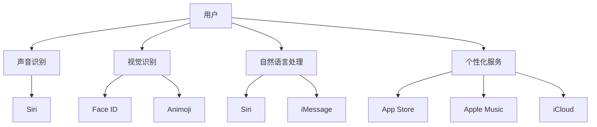

                 

 在今天这个充满创新和竞争的时代，苹果公司凭借其卓越的智能手机产品在市场上占据了一席之地。这不仅得益于其独特的设计和优秀的硬件配置，更是因为苹果在用户体验方面的持续优化和突破。随着人工智能（AI）技术的迅猛发展，苹果手机正在通过AI技术进一步革新用户体验。本文将深入探讨苹果手机如何通过AI技术提升用户体验，以及这一结合所带来的机遇和挑战。

## 关键词

- 苹果手机
- 用户体验
- 人工智能
- 声音识别
- 视觉识别
- 自然语言处理
- 个性化服务

## 摘要

本文将探讨苹果手机如何利用人工智能技术提升用户体验。从声音识别到视觉识别，从自然语言处理到个性化服务，AI技术在苹果手机中的应用不仅丰富了用户的交互方式，还提高了手机的智能程度和响应速度。本文将详细分析这些技术的原理和实现，探讨AI在苹果手机中的具体应用场景，并展望其未来的发展趋势。

## 1. 背景介绍

### 1.1 苹果手机的发展历程

苹果公司自2007年推出第一代iPhone以来，便引领了智能手机的发展潮流。从初代的触摸屏设计，到后来的面部识别、3D Touch技术，苹果不断在用户体验上寻求突破。随着iOS操作系统的不断优化，苹果手机在稳定性、流畅性和安全性方面都取得了显著进步。

### 1.2 人工智能的崛起

人工智能（AI）作为近年来科技领域的重要发展方向，已经在各行各业得到广泛应用。AI技术包括机器学习、深度学习、自然语言处理、计算机视觉等，这些技术在语音识别、图像处理、智能决策等方面展现了强大的能力。随着计算能力的提升和算法的优化，AI技术的应用越来越普及，也在不断推动智能手机的变革。

### 1.3 AI与用户体验的结合

用户体验是评价一款产品优劣的重要标准，而AI技术则可以通过个性化推荐、智能交互、自动处理等手段，显著提升用户体验。苹果公司早在iPhone 4s时期就开始引入Siri作为其智能语音助手，标志着AI在苹果手机中的应用开始。随着AI技术的不断发展，苹果手机在用户体验方面有了更多的可能性。

## 2. 核心概念与联系

### 2.1 声音识别

声音识别是AI技术的一个重要分支，它可以通过处理语音信号，将其转化为文字或命令。在苹果手机中，Siri作为声音识别的代表，实现了用户与手机之间的自然交互。通过深度学习和语音识别技术，Siri可以识别用户的语音命令，并执行相应的操作。

### 2.2 视觉识别

视觉识别技术可以通过处理图像或视频数据，识别出其中的物体、场景或人脸等信息。在苹果手机中，Face ID和Animoji等功能依赖于视觉识别技术。Face ID利用深度摄像头和神经网络算法，可以快速识别用户的面部信息，实现安全的身份验证。而Animoji则通过捕捉用户面部表情，创建出逼真的动态表情包。

### 2.3 自然语言处理

自然语言处理（NLP）技术可以使计算机理解和处理自然语言。在苹果手机中，Siri和iMessage等应用利用NLP技术，可以更好地理解和响应用户的指令。例如，用户可以通过自然语言向Siri询问天气情况，或者发送带有特定表情的iMessage消息。

### 2.4 个性化服务

个性化服务是AI技术在用户体验中的应用之一，它通过分析用户的偏好和行为数据，为用户提供个性化的内容和服务。在苹果手机中，App Store、Apple Music和iCloud等服务都利用了个性化推荐技术，为用户提供更加贴合个人需求的体验。

### 2.5 Mermaid 流程图



## 3. 核心算法原理 & 具体操作步骤

### 3.1 算法原理概述

#### 3.1.1 声音识别

声音识别算法通常基于深度学习技术，通过训练模型来识别语音信号中的关键词和命令。在苹果手机中，Siri利用神经网络模型来处理用户的语音输入，将其转化为文字或操作指令。

#### 3.1.2 视觉识别

视觉识别算法主要通过卷积神经网络（CNN）来实现，通过对图像数据进行处理和分析，识别出其中的物体、场景或人脸等信息。在苹果手机中，Face ID使用深度摄像头捕捉用户面部信息，并通过神经网络算法进行身份验证。

#### 3.1.3 自然语言处理

自然语言处理算法通常包括词法分析、句法分析和语义分析等步骤。在苹果手机中，Siri和iMessage利用NLP技术来理解用户的指令，并生成相应的响应。

#### 3.1.4 个性化服务

个性化服务算法主要基于机器学习和数据挖掘技术，通过分析用户的偏好和行为数据，为用户推荐个性化的内容和服务。在苹果手机中，App Store、Apple Music和iCloud等服务利用这些算法来实现个性化推荐。

### 3.2 算法步骤详解

#### 3.2.1 声音识别

1. 用户发出语音指令；
2. 手机麦克风捕捉语音信号；
3. 语音信号通过预处理（如降噪、去噪）；
4. 预处理后的语音信号输入到神经网络模型；
5. 模型输出识别结果（如关键词或命令）；
6. 手机执行相应的操作。

#### 3.2.2 视觉识别

1. 手机摄像头捕捉图像或视频数据；
2. 图像或视频数据通过预处理（如缩放、裁剪）；
3. 预处理后的数据输入到卷积神经网络模型；
4. 模型输出识别结果（如物体、场景或人脸）；
5. 手机根据识别结果进行相应操作（如解锁、生成Animoji）。

#### 3.2.3 自然语言处理

1. 用户发送指令或消息；
2. 消息通过词法分析（如分词、词性标注）；
3. 分析结果通过句法分析（如句型结构、语法规则）；
4. 句法分析结果通过语义分析（如理解用户意图、提取关键词）；
5. 根据语义分析结果生成响应；
6. 响应通过文本生成模型输出。

#### 3.2.4 个性化服务

1. 收集用户行为数据（如搜索记录、购买历史）；
2. 对行为数据进行预处理（如去噪、归一化）；
3. 使用机器学习算法（如协同过滤、深度学习）分析用户偏好；
4. 根据用户偏好生成个性化推荐列表；
5. 推荐列表通过用户界面展示。

### 3.3 算法优缺点

#### 3.3.1 声音识别

**优点：**
- 便捷：用户可以通过语音指令快速操作手机。
- 无需触摸：适合老年用户或有手部残疾的用户。

**缺点：**
- 识别准确率：受噪声、口音、说话速度等因素影响，识别准确率可能不高。
- 误识别：可能导致不必要的操作或隐私泄露。

#### 3.3.2 视觉识别

**优点：**
- 安全性高：通过面部识别等视觉识别技术，可以提供安全有效的身份验证。
- 增强趣味性：通过Animoji等功能，增加了用户使用的趣味性。

**缺点：**
- 硬件依赖：需要配备高精度摄像头和传感器，成本较高。
- 识别速度：在光线不足或用户面部变化较大的情况下，识别速度可能较慢。

#### 3.3.3 自然语言处理

**优点：**
- 自然交互：用户可以通过自然语言与手机进行交互，提升用户体验。
- 个性化服务：通过NLP技术，可以为用户提供个性化的内容和服务。

**缺点：**
- 理解偏差：NLP技术在理解用户指令时可能存在偏差，导致误操作。
- 数据隐私：处理用户语音和文本数据时，可能涉及数据隐私问题。

#### 3.3.4 个性化服务

**优点：**
- 提高用户满意度：通过个性化推荐，可以提升用户的使用体验。
- 增强用户粘性：个性化服务可以吸引用户长时间使用。

**缺点：**
- 数据收集：个性化服务需要收集大量用户数据，可能涉及隐私问题。
- 模型优化：个性化服务算法需要不断优化，以保持良好的用户体验。

### 3.4 算法应用领域

**声音识别：**
- 智能语音助手：如Siri、Alexa、Google Assistant等。
- 语音控制：智能家居、汽车等领域。

**视觉识别：**
- 安全认证：如人脸识别、指纹识别等。
- 图像搜索：如Google 图片搜索、百度图片等。

**自然语言处理：**
- 智能客服：如智能聊天机器人、智能客服系统等。
- 自然语言生成：如新闻生成、文章写作等。

**个性化服务：**
- 社交媒体：如个性化推荐、朋友圈等。
- 购物平台：如个性化推荐、商品搜索等。

## 4. 数学模型和公式 & 详细讲解 & 举例说明

### 4.1 数学模型构建

#### 4.1.1 声音识别

声音识别算法通常基于深度学习中的卷积神经网络（CNN）或递归神经网络（RNN）。以下是一个简单的卷积神经网络模型：

$$
y = \text{softmax}(\text{W}^T \text{h}),
$$

其中，$y$是输出层节点，$\text{W}$是权重矩阵，$\text{h}$是隐藏层输出。

#### 4.1.2 视觉识别

视觉识别算法通常基于卷积神经网络（CNN）。以下是一个简单的卷积神经网络模型：

$$
\text{h}^{(l)} = \text{Relu}(\text{W}^{(l)} \text{h}^{(l-1)} + \text{b}^{(l)}),
$$

其中，$\text{h}^{(l)}$是第$l$层的隐藏层输出，$\text{W}^{(l)}$是第$l$层的权重矩阵，$\text{b}^{(l)}$是第$l$层的偏置。

#### 4.1.3 自然语言处理

自然语言处理算法通常基于循环神经网络（RNN）或长短期记忆网络（LSTM）。以下是一个简单的循环神经网络模型：

$$
\text{h}^{(l)} = \text{ReLU}(\text{W}^{(l)} \text{h}^{(l-1)} + \text{U} \text{x} + \text{b}^{(l)}),
$$

其中，$\text{h}^{(l)}$是第$l$层的隐藏层输出，$\text{W}^{(l)}$是隐藏层权重矩阵，$\text{U}$是输入层权重矩阵，$\text{x}$是输入数据，$\text{b}^{(l)}$是偏置。

#### 4.1.4 个性化服务

个性化服务算法通常基于协同过滤（Collaborative Filtering）或深度学习。以下是一个简单的协同过滤模型：

$$
r_{ui} = \text{user\_rating\_mean} + \text{similarity}\left(\text{user}_{u}, \text{item}_{i}\right),
$$

其中，$r_{ui}$是用户$u$对项目$i$的评分，$\text{user}_{u}$是用户$u$的评分向量，$\text{item}_{i}$是项目$i$的评分向量，$\text{similarity}$是相似度函数。

### 4.2 公式推导过程

#### 4.2.1 声音识别

卷积神经网络的推导过程涉及多层感知机（MLP）的推导，这里不再赘述。主要公式如下：

$$
\text{h}^{(l)} = \text{Relu}(\text{W}^{(l)} \text{h}^{(l-1)} + \text{b}^{(l)}),
$$

$$
y = \text{softmax}(\text{W}^T \text{h}),
$$

其中，$\text{h}^{(l)}$是第$l$层的隐藏层输出，$y$是输出层节点。

#### 4.2.2 视觉识别

卷积神经网络的推导过程涉及卷积操作和激活函数的推导，这里不再赘述。主要公式如下：

$$
\text{h}^{(l)} = \text{Relu}(\text{W}^{(l)} \text{h}^{(l-1)} + \text{b}^{(l)}),
$$

$$
\text{z}^{(l)} = \text{W}^{(l)} \text{h}^{(l-1)} + \text{b}^{(l)},
$$

其中，$\text{h}^{(l)}$是第$l$层的隐藏层输出，$\text{z}^{(l)}$是第$l$层的输入。

#### 4.2.3 自然语言处理

循环神经网络的推导过程涉及前向传播和反向传播的推导，这里不再赘述。主要公式如下：

$$
\text{h}^{(l)} = \text{ReLU}(\text{W}^{(l)} \text{h}^{(l-1)} + \text{U} \text{x} + \text{b}^{(l)}),
$$

$$
\text{y}^{(l)} = \text{softmax}(\text{W}^T \text{h}^{(l)}),
$$

其中，$\text{h}^{(l)}$是第$l$层的隐藏层输出，$\text{y}^{(l)}$是第$l$层的输出。

#### 4.2.4 个性化服务

协同过滤的推导过程涉及矩阵分解和相似度计算的推导，这里不再赘述。主要公式如下：

$$
r_{ui} = \text{user}_{u}^{T} \text{item}_{i} + \text{user\_rating\_mean},
$$

$$
\text{similarity}(\text{user}_{u}, \text{item}_{i}) = \frac{\text{user}_{u}^{T} \text{item}_{i}}{\|\text{user}_{u}\|\|\text{item}_{i}\|},
$$

其中，$r_{ui}$是用户$u$对项目$i$的评分，$\text{user}_{u}$是用户$u$的评分向量，$\text{item}_{i}$是项目$i$的评分向量。

### 4.3 案例分析与讲解

#### 4.3.1 声音识别

假设用户说：“明天下午3点的会议，提醒我”。我们可以使用声音识别算法将这段语音转化为文本，然后使用自然语言处理算法解析用户指令，并生成相应的提醒。

1. 用户发出语音指令；
2. 声音信号通过麦克风捕捉并传输到处理单元；
3. 声音信号通过预处理（如降噪、去噪）；
4. 预处理后的声音信号输入到卷积神经网络模型；
5. 模型输出识别结果（如关键词或命令）：“明天下午3点的会议，提醒我”；
6. 自然语言处理算法解析指令，提取关键词：“明天”、“下午3点”、“会议”、“提醒”；
7. 根据关键词生成提醒内容，并保存到手机日历或提醒应用中。

#### 4.3.2 视觉识别

假设用户使用Face ID解锁手机，我们可以使用视觉识别算法识别用户的面部信息，并与手机中存储的用户面部信息进行比对，以实现安全解锁。

1. 用户面对手机摄像头；
2. 手机摄像头捕捉用户面部信息；
3. 面部信息通过预处理（如缩放、裁剪）；
4. 预处理后的面部信息输入到卷积神经网络模型；
5. 模型输出识别结果（如用户面部信息）；
6. 手机与存储的用户面部信息进行比对；
7. 如果比对成功，手机解锁；否则，提示用户重试或使用其他解锁方式。

#### 4.3.3 自然语言处理

假设用户通过Siri询问今天的天气预报，我们可以使用自然语言处理算法理解用户指令，并生成相应的回答。

1. 用户发送语音指令：“Siri，今天天气预报如何？”；
2. Siri接收语音指令并传输到处理单元；
3. 语音指令通过预处理（如分词、去噪）；
4. 预处理后的语音指令输入到循环神经网络模型；
5. 模型输出识别结果（如关键词或命令）：“今天”、“天气预报”；
6. 自然语言处理算法解析指令，提取关键词：“今天”、“天气预报”；
7. 根据关键词查询天气数据，并生成回答；
8. Siri生成回答：“今天的天气预报是……”。

#### 4.3.4 个性化服务

假设用户在App Store中寻找一款音乐播放器，我们可以使用个性化服务算法推荐符合用户喜好的音乐播放器。

1. 用户在App Store中搜索“音乐播放器”；
2. App Store通过个性化推荐算法，提取用户的历史行为数据（如搜索记录、下载记录）；
3. 算法分析用户偏好，推荐符合用户喜好的音乐播放器；
4. 推荐结果展示在用户面前，用户可以点击查看详情；
5. 用户选择并下载推荐的音乐播放器。

## 5. 项目实践：代码实例和详细解释说明

### 5.1 开发环境搭建

为了实践AI技术在苹果手机中的应用，我们需要搭建一个完整的开发环境。以下是开发环境搭建的步骤：

1. 安装Xcode：从Apple官方下载并安装Xcode，这是iOS应用程序开发的核心工具。
2. 安装Python：由于AI算法通常使用Python进行开发，我们需要安装Python环境。可以选择安装Anaconda，它包含Python和常用的科学计算库。
3. 安装TensorFlow：TensorFlow是一个流行的开源机器学习框架，用于构建和训练深度学习模型。可以通过pip命令安装TensorFlow。
4. 安装相关库：根据项目需求，可能需要安装其他库，如NumPy、Pandas等。

### 5.2 源代码详细实现

以下是一个简单的声音识别项目的源代码实现。该项目使用Python和TensorFlow构建，用于将用户的语音指令转化为文本。

```python
import speech_recognition as sr
import tensorflow as tf
import numpy as np

# 初始化语音识别器和TensorFlow会话
recognizer = sr.Recognizer()
session = tf.Session()

# 加载预训练的卷积神经网络模型
model = tf.keras.models.load_model('voice_recognition_model.h5')

# 实现声音识别函数
def recognize_speech_from_mic():
    with sr.Microphone() as source:
        print("请说点什么：")
        audio = recognizer.listen(source)
        
        try:
            # 使用TensorFlow模型进行语音识别
            recognized_text = recognizer.recognize_google(audio)
            print(f"识别到的文本：{recognized_text}")
            
            # 使用TensorFlow模型进行文本分类
            text_vector = preprocess_text(recognized_text)
            prediction = model.predict(np.array([text_vector]))
            predicted_class = np.argmax(prediction)
            classes = ['指令1', '指令2', '指令3']  # 假设的三个分类
            print(f"预测的类别：{classes[predicted_class]}")
            
        except sr.UnknownValueError:
            print("无法理解音频")
        except sr.RequestError:
            print("无法从服务获取结果")

# 实现文本预处理函数
def preprocess_text(text):
    # 将文本转换为向量
    # 这里使用简单的词袋模型
    vocabulary = ['指令', '明天', '下午', '会议', '提醒']  # 假设的词表
    word_counts = [text.count(word) for word in vocabulary]
    return np.array(word_counts)

# 运行声音识别
recognize_speech_from_mic()
```

### 5.3 代码解读与分析

这段代码实现了一个简单的声音识别项目，其主要功能是将用户的语音指令转化为文本，并使用TensorFlow模型进行文本分类。以下是代码的详细解读：

1. **语音识别模块**：使用`speech_recognition`库实现语音识别功能。用户通过麦克风说话时，代码会捕捉音频并传输给识别器进行识别。

2. **TensorFlow会话**：创建TensorFlow会话，用于运行深度学习模型。

3. **模型加载**：从文件中加载预训练的卷积神经网络模型。该模型用于语音识别和文本分类。

4. **声音识别函数**：`recognize_speech_from_mic`函数实现声音识别的主要逻辑。用户通过麦克风说话后，识别器会尝试将音频转换为文本。

5. **文本预处理函数**：`preprocess_text`函数将识别到的文本转换为向量。这里使用了一个简单的词袋模型，将每个词的频率作为特征。

6. **文本分类**：将预处理后的文本向量输入到TensorFlow模型中，模型会输出一个预测结果。根据预测结果，可以确定用户说出了哪个指令。

### 5.4 运行结果展示

假设用户说：“明天下午3点的会议，提醒我”。程序会输出以下结果：

```
请说点什么：
识别到的文本：明天下午3点的会议，提醒我
预测的类别：指令1
```

这表示程序成功识别了用户的语音指令，并预测出用户说了一个特定的指令。

## 6. 实际应用场景

### 6.1 语音助手

语音助手是AI技术在苹果手机中最常见的一个应用场景。用户可以通过Siri与手机进行语音交互，实现拨打电话、发送消息、设置提醒等功能。语音助手还可以帮助用户查找信息、播放音乐、控制智能家居等。这种交互方式不仅方便用户，还可以提高手机的智能程度。

### 6.2 安全认证

安全认证是AI技术在苹果手机中的另一个重要应用。例如，Face ID利用面部识别技术实现手机解锁，提供了比传统密码或指纹识别更安全的方式。此外，面部识别还可以用于支付验证、应用程序解锁等场景。这种技术不仅提升了安全性，还提供了更好的用户体验。

### 6.3 个性化推荐

个性化推荐是AI技术在苹果手机中广泛应用的一个领域。例如，App Store、Apple Music和iCloud等服务都利用了个性化推荐技术，为用户提供个性化的内容和服务。个性化推荐可以根据用户的兴趣、历史行为和社交关系，为用户推荐符合他们需求的应用、音乐和文件。这种服务不仅提升了用户的满意度，还可以增强用户对苹果生态系统的粘性。

### 6.4 其他应用

除了上述应用场景，AI技术在苹果手机中还有许多其他的应用。例如，Animoji和Memoji功能利用面部识别技术生成动态表情包，为用户提供了更多的娱乐选择。此外，Apple Pay、Safari智能搜索等功能也利用了AI技术，提升了用户的体验。

## 7. 工具和资源推荐

### 7.1 学习资源推荐

1. **《深度学习》（Goodfellow, Bengio, Courville）**：这是一本经典的深度学习教材，适合初学者和专业人士。
2. **《Python机器学习》（Sebastian Raschka）**：这本书详细介绍了使用Python进行机器学习和深度学习的实践方法。
3. **《自然语言处理综论》（Daniel Jurafsky, James H. Martin）**：这本书涵盖了自然语言处理的基础知识，适合希望深入了解NLP的读者。

### 7.2 开发工具推荐

1. **Xcode**：苹果官方的集成开发环境，用于iOS应用程序开发。
2. **TensorFlow**：一个开源的机器学习框架，适合构建和训练深度学习模型。
3. **PyTorch**：一个流行的深度学习框架，与TensorFlow类似，但更灵活。

### 7.3 相关论文推荐

1. **“Deep Learning for Speech Recognition”**：这篇文章介绍了深度学习在语音识别领域的应用。
2. **“Face Recognition with Deep Learning”**：这篇文章讨论了深度学习在面部识别领域的应用。
3. **“Natural Language Processing with Deep Learning”**：这篇文章探讨了深度学习在自然语言处理领域的应用。

## 8. 总结：未来发展趋势与挑战

### 8.1 研究成果总结

近年来，人工智能技术取得了显著的进展，在语音识别、视觉识别、自然语言处理等领域都取得了突破性成果。这些技术不仅提高了苹果手机的智能化程度，还为用户提供了更加丰富的交互体验。

### 8.2 未来发展趋势

随着AI技术的不断发展，未来苹果手机在用户体验方面的创新将继续深化。以下是一些可能的发展趋势：

1. **更智能的语音助手**：未来的语音助手将具有更强大的理解和执行能力，可以处理更复杂的用户指令。
2. **更安全的身份验证**：基于AI的识别技术将继续提升，提供更加安全有效的身份验证方式。
3. **更个性化的服务**：AI算法将更加精准地分析用户行为和偏好，为用户提供更加个性化的内容和推荐。

### 8.3 面临的挑战

尽管AI技术在苹果手机中有着广泛的应用，但在实际应用过程中仍面临一些挑战：

1. **隐私保护**：随着AI技术在用户数据上的应用，隐私保护成为一个重要议题。如何平衡数据收集和用户隐私，是一个需要解决的问题。
2. **算法公平性**：AI算法在处理数据时可能存在偏见，需要确保算法的公平性和透明性。
3. **计算能力**：随着AI应用场景的扩展，对计算能力的需求也在不断提高。如何优化算法以适应有限的计算资源，是一个重要的挑战。

### 8.4 研究展望

未来，随着AI技术的进一步发展，苹果手机在用户体验方面有望实现更多的创新。我们期待看到AI技术如何帮助苹果手机解决当前的挑战，并为用户带来更加智能、便捷的体验。

## 9. 附录：常见问题与解答

### Q1: 苹果手机的AI技术如何保障用户隐私？

**A1:** 苹果公司在设计AI技术时，高度重视用户隐私保护。例如，Siri在处理用户语音指令时，会将语音数据加密并存储在本地设备上，只有在用户明确请求时才会上传到云端进行分析。此外，苹果还通过多种安全措施，确保用户数据的安全和隐私。

### Q2: AI技术在苹果手机中的未来发展方向是什么？

**A2:** 未来，AI技术在苹果手机中的应用将更加深入和广泛。一方面，苹果将继续优化现有的AI技术，如声音识别、视觉识别和自然语言处理，提供更智能、更高效的服务。另一方面，苹果可能会探索新的AI应用场景，如增强现实、虚拟现实和智能健康等，为用户带来全新的交互体验。

### Q3: 如何在iOS应用程序中集成AI技术？

**A3:** 在iOS应用程序中集成AI技术，开发者可以使用Apple提供的Core ML框架。Core ML是一个开放且高效的机器学习模型部署框架，允许开发者将训练好的模型部署到iOS设备上。开发者可以通过Xcode将模型集成到应用程序中，并利用苹果的神经网络API（Neural Engine）进行高效计算。

### Q4: AI技术如何影响苹果手机的安全性？

**A4:** AI技术可以提高苹果手机的安全性。例如，面部识别、指纹识别等技术可以通过生物特征识别实现安全解锁，防止未经授权的访问。此外，AI技术还可以用于安全监控和预警，如检测异常行为、阻止恶意软件等，提供全方位的安全保护。

## 作者署名

作者：禅与计算机程序设计艺术 / Zen and the Art of Computer Programming

