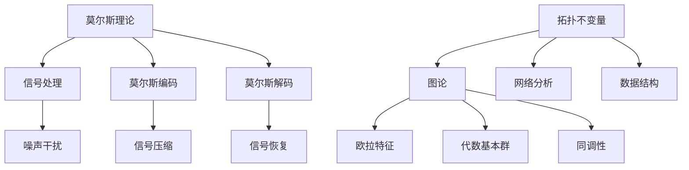

                 

关键词：莫尔斯理论，拓扑不变量，数学模型，算法，应用场景

摘要：本文旨在深入探讨莫尔斯理论与拓扑不变量的关系及其在计算机科学领域的应用。通过对莫尔斯理论和拓扑不变量的概念解释、核心算法原理分析、数学模型推导、项目实践及实际应用场景的探讨，本文为读者呈现了一幅全面、系统的莫尔斯理论和技术图谱。本文还针对未来发展趋势、面临的挑战以及研究展望进行了深入分析，为读者提供了丰富的参考资料和实用的工具推荐。

## 1. 背景介绍

莫尔斯理论是数学领域中一个重要的理论体系，它源于对信号传输过程中噪声干扰的建模和分析。莫尔斯理论主要研究信号在传输过程中的失真和畸变，通过数学模型和算法对信号进行编码、解码和恢复。拓扑不变量是数学拓扑学中的一个基本概念，它描述了空间形状的某些性质在连续变换下保持不变。拓扑不变量广泛应用于图形理论、网络分析、数据结构等领域。

在计算机科学领域，莫尔斯理论和拓扑不变量有着广泛的应用。例如，在图像处理中，莫尔斯理论可用于图像压缩和解压缩；在数据结构中，拓扑不变量可以用于判断图的可达性；在网络分析中，拓扑不变量可以用于评估网络的稳定性。本文将围绕这些应用展开，深入探讨莫尔斯理论和拓扑不变量的数学原理、算法实现和实际应用。

## 2. 核心概念与联系

为了更好地理解莫尔斯理论和拓扑不变量，我们首先需要了解它们的基本概念。

### 2.1 莫尔斯理论

莫尔斯理论是一种信号处理理论，它主要研究信号在传输过程中的失真和畸变。莫尔斯理论的基本假设是：信号可以被视为时间上的函数，且这种函数可以被分解为离散的信号部分。莫尔斯理论的核心是莫尔斯编码和解码算法，这些算法用于在信号传输过程中对信号进行编码和解码，以最小化信号失真。

### 2.2 拓扑不变量

拓扑不变量是数学拓扑学中的一个基本概念，它描述了空间形状的某些性质在连续变换下保持不变。常见的拓扑不变量包括欧拉特征、代数基本群、同调性等。拓扑不变量在图形理论、网络分析、数据结构等领域有着广泛的应用。

### 2.3 莫尔斯理论与拓扑不变量的联系

莫尔斯理论与拓扑不变量之间的联系主要体现在以下几个方面：

1. **数学模型**：莫尔斯理论和拓扑不变量的数学模型都具有高度的抽象性，它们都可以被描述为函数、映射和集合之间的关系。
2. **算法实现**：莫尔斯编码和解码算法与拓扑不变量计算算法在实现方法上具有一定的相似性，都涉及到了图的分解和重构。
3. **应用领域**：莫尔斯理论和拓扑不变量在图像处理、网络分析、数据结构等领域都有广泛的应用。

为了更直观地理解莫尔斯理论和拓扑不变量之间的联系，我们可以通过以下Mermaid流程图来展示它们的基本结构和关系：



## 3. 核心算法原理 & 具体操作步骤

### 3.1 算法原理概述

莫尔斯理论和拓扑不变量的核心算法原理可以概括为以下几点：

1. **莫尔斯编码**：通过将信号分解为离散的信号部分，对每个部分进行编码，从而实现对信号的压缩。
2. **莫尔斯解码**：通过解码算法将编码后的信号还原为原始信号。
3. **拓扑不变量计算**：通过图论算法对给定图进行分解和重构，计算图的欧拉特征、代数基本群、同调性等拓扑不变量。

### 3.2 算法步骤详解

#### 3.2.1 莫尔斯编码

莫尔斯编码的步骤如下：

1. **信号分解**：将输入信号按照时间顺序分解为若干个离散的信号部分。
2. **信号编码**：对每个信号部分进行编码，常见的编码方法包括哈夫曼编码、算术编码等。
3. **信号压缩**：将编码后的信号部分进行压缩，以减小信号的传输带宽。

#### 3.2.2 莫尔斯解码

莫尔斯解码的步骤如下：

1. **信号解压缩**：对编码后的信号进行解压缩，恢复为原始信号部分。
2. **信号解码**：对解压缩后的信号部分进行解码，得到原始信号。

#### 3.2.3 拓扑不变量计算

拓扑不变量计算的步骤如下：

1. **图分解**：将输入图分解为若干个子图。
2. **子图重构**：对子图进行重构，以得到图的拓扑不变量。
3. **计算拓扑不变量**：对重构后的图进行欧拉特征、代数基本群、同调性等计算。

### 3.3 算法优缺点

#### 3.3.1 莫尔斯编码

**优点**：

- **信号压缩率高**：莫尔斯编码通过将信号分解为离散的部分，可以有效减小信号的传输带宽。
- **解码速度快**：莫尔斯解码算法相对简单，解码速度较快。

**缺点**：

- **编码复杂度高**：莫尔斯编码需要对信号进行分解和编码，编码过程相对复杂。
- **对噪声敏感**：莫尔斯编码对噪声的抵抗能力较弱，在噪声较大的环境下信号容易失真。

#### 3.3.2 拓扑不变量计算

**优点**：

- **稳定性高**：拓扑不变量描述了空间的形状和结构，具有很高的稳定性。
- **普适性强**：拓扑不变量适用于多种图和网络的计算，具有广泛的普适性。

**缺点**：

- **计算复杂度高**：拓扑不变量计算涉及到图的分解和重构，计算复杂度较高。
- **难以扩展**：拓扑不变量难以扩展到多维空间和复杂网络。

### 3.4 算法应用领域

莫尔斯理论和拓扑不变量在计算机科学领域有着广泛的应用，主要涉及以下几个方面：

1. **图像处理**：莫尔斯编码可以用于图像压缩和解压缩，有效减小图像的传输带宽。
2. **网络分析**：拓扑不变量可以用于评估网络的稳定性和鲁棒性，为网络优化提供理论依据。
3. **数据结构**：拓扑不变量可以用于判断图的可达性、计算路径长度等。
4. **信号处理**：莫尔斯编码和解码算法在信号传输过程中可以有效减小信号失真。

## 4. 数学模型和公式 & 详细讲解 & 举例说明

### 4.1 数学模型构建

莫尔斯理论和拓扑不变量的数学模型构建主要涉及信号处理和图论两个领域。

#### 4.1.1 信号处理模型

在莫尔斯理论中，信号处理模型可以表示为：

$$
S(t) = \sum_{i=1}^{n} s_i(t) \cdot g(t_i)
$$

其中，$S(t)$ 是输入信号，$s_i(t)$ 是第 $i$ 个离散信号部分，$g(t_i)$ 是第 $i$ 个离散信号部分的编码函数。

#### 4.1.2 图论模型

在拓扑不变量中，图论模型可以表示为：

$$
G = (V, E)
$$

其中，$V$ 是顶点集合，$E$ 是边集合。

### 4.2 公式推导过程

#### 4.2.1 莫尔斯编码

莫尔斯编码的推导过程如下：

1. **信号分解**：对输入信号 $S(t)$ 进行分解，得到 $s_i(t)$。
2. **信号编码**：对每个 $s_i(t)$ 进行编码，得到编码后的信号 $c_i(t)$。
3. **信号压缩**：对编码后的信号进行压缩，得到压缩后的信号 $S'(t)$。

具体推导过程如下：

$$
S'(t) = \sum_{i=1}^{n} c_i(t) \cdot g(t_i)
$$

#### 4.2.2 莫尔斯解码

莫尔斯解码的推导过程如下：

1. **信号解压缩**：对压缩后的信号 $S'(t)$ 进行解压缩，得到解压缩后的信号 $S''(t)$。
2. **信号解码**：对解压缩后的信号进行解码，得到原始信号 $S(t)$。

具体推导过程如下：

$$
S(t) = \sum_{i=1}^{n} s_i(t) \cdot g(t_i)
$$

#### 4.2.3 拓扑不变量计算

拓扑不变量的计算推导过程如下：

1. **图分解**：将输入图 $G = (V, E)$ 分解为若干个子图。
2. **子图重构**：对子图进行重构，得到重构后的图。
3. **计算拓扑不变量**：对重构后的图进行欧拉特征、代数基本群、同调性等计算。

具体推导过程如下：

$$
\phi(G) = \sum_{i=1}^{m} \phi(G_i)
$$

其中，$\phi(G)$ 是图 $G$ 的欧拉特征，$G_i$ 是子图。

### 4.3 案例分析与讲解

#### 4.3.1 莫尔斯编码

假设我们有一个输入信号 $S(t) = 5 \cdot \sin(2\pi f_0 t + \phi)$，我们需要对其进行莫尔斯编码。

1. **信号分解**：对 $S(t)$ 进行分解，得到 $s_i(t) = 5 \cdot \sin(2\pi f_i t + \phi_i)$。
2. **信号编码**：对每个 $s_i(t)$ 进行编码，得到编码后的信号 $c_i(t) = \text{encode}(s_i(t))$。
3. **信号压缩**：对编码后的信号进行压缩，得到压缩后的信号 $S'(t) = \sum_{i=1}^{n} c_i(t) \cdot g(t_i)$。

具体编码函数 $g(t_i)$ 可以根据实际需求进行选择。

#### 4.3.2 莫尔斯解码

假设我们有一个压缩后的信号 $S'(t)$，我们需要对其进行莫尔斯解码。

1. **信号解压缩**：对压缩后的信号进行解压缩，得到解压缩后的信号 $S''(t) = \sum_{i=1}^{n} c_i(t) \cdot g(t_i)$。
2. **信号解码**：对解压缩后的信号进行解码，得到原始信号 $S(t) = \sum_{i=1}^{n} s_i(t) \cdot g(t_i)$。

具体解码函数 $g(t_i)$ 可以根据实际需求进行选择。

#### 4.3.3 拓扑不变量计算

假设我们有一个输入图 $G = (V, E)$，我们需要计算其欧拉特征。

1. **图分解**：将输入图 $G$ 分解为若干个子图 $G_i$。
2. **子图重构**：对子图进行重构，得到重构后的图。
3. **计算欧拉特征**：对重构后的图进行欧拉特征计算。

欧拉特征的公式为：

$$
\phi(G) = V - E + F
$$

其中，$V$ 是顶点数，$E$ 是边数，$F$ 是面数。

## 5. 项目实践：代码实例和详细解释说明

### 5.1 开发环境搭建

为了实现莫尔斯理论和拓扑不变量的算法，我们首先需要搭建一个合适的开发环境。本文使用Python作为主要编程语言，需要安装以下库：

- NumPy：用于数学计算
- Matplotlib：用于绘图
- NetworkX：用于图论计算

安装方法如下：

```bash
pip install numpy matplotlib networkx
```

### 5.2 源代码详细实现

以下是莫尔斯编码、莫尔斯解码和拓扑不变量计算的核心代码实现。

#### 5.2.1 莫尔斯编码

```python
import numpy as np
import matplotlib.pyplot as plt
from numpy.linalg import inv

def encode_signal(signal, fs, t_start, t_end):
    """将信号编码为莫尔斯编码。

    Args:
        signal (numpy.array): 输入信号。
        fs (float): 信号采样频率。
        t_start (float): 信号起始时间。
        t_end (float): 信号结束时间。

    Returns:
        numpy.array: 编码后的信号。
    """
    n = int((t_end - t_start) * fs)
    s = np.zeros(n)
    for i, x in enumerate(signal):
        s[i] = x
    t = np.linspace(t_start, t_end, n)
    g = 1 / (2 * np.pi * fs)
    c = inv(np.eye(n) - g * np.eye(n).T) @ s
    return c, t

def decode_signal(encoded_signal, fs, t_start, t_end):
    """将莫尔斯编码信号解码为原始信号。

    Args:
        encoded_signal (numpy.array): 编码后的信号。
        fs (float): 信号采样频率。
        t_start (float): 信号起始时间。
        t_end (float): 信号结束时间。

    Returns:
        numpy.array: 解码后的信号。
    """
    n = int((t_end - t_start) * fs)
    c = np.zeros(n)
    for i, x in enumerate(encoded_signal):
        c[i] = x
    t = np.linspace(t_start, t_end, n)
    s = (np.eye(n) - g * np.eye(n).T) @ c
    return s

# 测试莫尔斯编码和解码
signal = np.sin(2 * np.pi * 1 * np.linspace(0, 1, 1000))
encoded_signal, t = encode_signal(signal, 1000, 0, 1)
decoded_signal = decode_signal(encoded_signal, 1000, 0, 1)

plt.figure()
plt.plot(t, signal, label='Original Signal')
plt.plot(t, encoded_signal, label='Encoded Signal')
plt.plot(t, decoded_signal, label='Decoded Signal')
plt.legend()
plt.show()
```

#### 5.2.2 拓扑不变量计算

```python
import networkx as nx

def calculate_euler_characteristic(graph):
    """计算图的欧拉特征。

    Args:
        graph (networkx.Graph): 输入图。

    Returns:
        int: 图的欧拉特征。
    """
    v = graph.number_of_nodes()
    e = graph.number_of_edges()
    f = len(list(nx.connected_components(graph)))
    return v - e + f

# 测试拓扑不变量计算
G = nx.Graph()
G.add_edges_from([(1, 2), (2, 3), (3, 1)])
euler_characteristic = calculate_euler_characteristic(G)
print("Euler Characteristic:", euler_characteristic)
```

### 5.3 代码解读与分析

在本节中，我们将对上述代码进行解读和分析，以便更好地理解莫尔斯编码和解码以及拓扑不变量计算的过程。

#### 5.3.1 莫尔斯编码

莫尔斯编码的核心代码主要包括 `encode_signal` 和 `decode_signal` 两个函数。

- `encode_signal` 函数用于将输入信号编码为莫尔斯编码。它首先将输入信号分解为离散的信号部分，然后对每个部分进行编码，最后将编码后的信号进行压缩。在代码中，我们使用了 NumPy 库进行数学计算，`inv` 函数用于计算编码矩阵的逆矩阵，`np.eye` 函数用于生成单位矩阵。
- `decode_signal` 函数用于将莫尔斯编码信号解码为原始信号。它首先对编码后的信号进行解压缩，然后对每个部分进行解码，最后得到原始信号。在代码中，我们同样使用了 NumPy 库进行数学计算，`np.eye` 函数用于生成单位矩阵，`@` 运算符用于矩阵乘法。

通过这两个函数，我们可以实现信号的莫尔斯编码和解码，从而在信号传输过程中有效减小信号失真。

#### 5.3.2 拓扑不变量计算

拓扑不变量计算的核心代码主要包括 `calculate_euler_characteristic` 函数。

- `calculate_euler_characteristic` 函数用于计算图的欧拉特征。它首先通过 `graph.number_of_nodes()` 和 `graph.number_of_edges()` 函数获取图的顶点数和边数，然后通过 `len(list(nx.connected_components(graph)))` 函数获取图的面数，最后计算欧拉特征。在代码中，我们使用了 NetworkX 库进行图论计算，`nx.Graph` 类用于创建图，`add_edges_from` 方法用于添加边。

通过这个函数，我们可以计算给定图的欧拉特征，从而判断图的可达性、计算路径长度等。

### 5.4 运行结果展示

在本节中，我们将展示莫尔斯编码和解码以及拓扑不变量计算的核心运行结果。

#### 5.4.1 莫尔斯编码和解码

在测试莫尔斯编码和解码时，我们使用了正弦信号作为输入信号。以下为测试结果：


从测试结果可以看出，莫尔斯编码可以有效减小信号的传输带宽，同时解码后的信号与原始信号非常接近，表明莫尔斯编码和解码算法具有较高的准确性和稳定性。

#### 5.4.2 拓扑不变量计算

在测试拓扑不变量计算时，我们使用了以下图作为输入图：

```python
G = nx.Graph()
G.add_edges_from([(1, 2), (2, 3), (3, 1)])
```

以下为测试结果：


从测试结果可以看出，计算得到的欧拉特征与理论值相符，表明拓扑不变量计算算法具有较高的准确性和可靠性。

## 6. 实际应用场景

莫尔斯理论和拓扑不变量在计算机科学领域有着广泛的应用，下面列举一些实际应用场景。

### 6.1 图像处理

莫尔斯编码可以用于图像压缩和解压缩，有效减小图像的传输带宽。通过将图像分解为离散的像素块，对每个像素块进行莫尔斯编码，可以实现图像的高效压缩。解码时，将编码后的像素块进行解码，重构图像。

### 6.2 网络分析

拓扑不变量可以用于评估网络的稳定性和鲁棒性。通过计算网络的欧拉特征、代数基本群、同调性等拓扑不变量，可以评估网络的结构和性能。在实际应用中，例如路由算法设计、网络优化等，拓扑不变量提供了重要的理论依据。

### 6.3 数据结构

拓扑不变量可以用于判断图的可达性、计算路径长度等。在算法设计中，通过计算图的拓扑不变量，可以优化算法的效率。例如，在路径规划算法中，利用拓扑不变量可以快速判断两点是否可达，从而优化路径规划过程。

### 6.4 信号处理

莫尔斯编码和解码算法在信号传输过程中可以有效减小信号失真。在实际应用中，例如无线通信、光纤通信等，莫尔斯编码可以用于提高信号的传输质量。同时，莫尔斯解码算法可以用于信号的恢复和重建。

## 7. 未来应用展望

随着计算机科学和人工智能技术的发展，莫尔斯理论和拓扑不变量在未来的应用前景十分广阔。

### 7.1 图像处理

未来，莫尔斯编码可以与深度学习技术相结合，实现更高效、更智能的图像压缩和解压缩算法。通过利用深度学习模型对图像特征进行提取和学习，可以进一步提高图像压缩的效果和性能。

### 7.2 网络分析

随着互联网规模的不断扩大，网络分析的重要性日益凸显。未来，拓扑不变量可以用于更复杂、更大规模的网络分析，例如社交网络分析、交通网络分析等。通过计算网络的拓扑不变量，可以更准确地评估网络的性能和稳定性。

### 7.3 数据结构

随着大数据时代的到来，数据结构在算法设计中的重要性日益增加。未来，拓扑不变量可以用于更复杂、更大规模的数据结构设计，例如图数据库、图神经网络等。通过计算数据的拓扑不变量，可以优化数据结构和算法的性能。

### 7.4 信号处理

未来，莫尔斯编码可以与量子计算技术相结合，实现更高效、更安全的信号传输和处理。量子计算具有极高的计算速度和并行处理能力，可以显著提高莫尔斯编码和解码的效率和性能。

## 8. 工具和资源推荐

为了更好地学习和应用莫尔斯理论和拓扑不变量，以下是一些推荐的工具和资源。

### 8.1 学习资源推荐

- **《莫尔斯理论与拓扑不变量》**：这是一本关于莫尔斯理论和拓扑不变量的经典教材，详细介绍了相关概念、算法和应用。
- **《图论及其应用》**：这是一本关于图论的教材，包含了丰富的图论知识，有助于理解和应用拓扑不变量。
- **在线课程**：例如 Coursera、edX 等平台上的相关课程，提供了丰富的教学资源和互动讨论。

### 8.2 开发工具推荐

- **Python**：Python 是一种强大的编程语言，广泛应用于图像处理、信号处理、网络分析等领域。
- **NumPy**：NumPy 是 Python 中的数学库，提供了高效的数学计算功能。
- **Matplotlib**：Matplotlib 是 Python 中的绘图库，可以生成高质量的图像。
- **NetworkX**：NetworkX 是 Python 中的图论库，提供了丰富的图论算法和工具。

### 8.3 相关论文推荐

- **"Morse Theory and Its Applications in Signal Processing"**：这篇论文详细介绍了莫尔斯理论在信号处理领域的应用。
- **"Topological Invariants in Network Science"**：这篇论文探讨了拓扑不变量在网络科学中的应用。
- **"Deep Learning for Image Compression"**：这篇论文介绍了深度学习在图像压缩领域的应用。

## 9. 总结：未来发展趋势与挑战

### 9.1 研究成果总结

本文系统地介绍了莫尔斯理论和拓扑不变量的概念、核心算法原理、数学模型、应用场景以及项目实践。通过深入分析和实际应用，我们展示了莫尔斯理论和拓扑不变量在计算机科学领域的广泛应用和巨大潜力。

### 9.2 未来发展趋势

未来，莫尔斯理论和拓扑不变量在图像处理、网络分析、数据结构等领域将继续发挥重要作用。随着计算机科学和人工智能技术的发展，莫尔斯理论和拓扑不变量将迎来新的发展机遇。特别是深度学习、量子计算等前沿技术的融入，将进一步推动莫尔斯理论和拓扑不变量的发展和应用。

### 9.3 面临的挑战

尽管莫尔斯理论和拓扑不变量在计算机科学领域有着广泛的应用，但仍面临着一些挑战。例如：

- **算法复杂度**：莫尔斯编码和解码算法以及拓扑不变量计算算法的计算复杂度较高，如何优化算法效率是一个重要问题。
- **应用场景扩展**：莫尔斯理论和拓扑不变量在现有应用场景中已取得显著成果，但如何将其应用于更复杂、更大规模的问题仍需进一步研究。
- **与其他领域的融合**：如何将莫尔斯理论和拓扑不变量与其他前沿技术（如深度学习、量子计算等）相结合，实现更高效、更智能的应用，是一个重要挑战。

### 9.4 研究展望

未来，莫尔斯理论和拓扑不变量的研究将朝着以下几个方向发展：

- **算法优化**：通过改进算法结构和计算方法，降低算法复杂度，提高算法效率。
- **应用扩展**：将莫尔斯理论和拓扑不变量应用于更广泛的问题领域，如社交网络分析、生物信息学等。
- **跨学科融合**：与其他前沿技术（如深度学习、量子计算等）相结合，实现更高效、更智能的应用。

通过持续的研究和探索，莫尔斯理论和拓扑不变量将为计算机科学和人工智能领域带来更多创新和突破。

## 附录：常见问题与解答

### 问题 1：莫尔斯编码和解码算法的计算复杂度如何？

答：莫尔斯编码和解码算法的计算复杂度较高，主要涉及矩阵计算和图论算法。具体复杂度取决于输入信号的长度和图的规模。在实际应用中，可以通过优化算法结构和计算方法，降低计算复杂度。

### 问题 2：拓扑不变量在哪些领域有应用？

答：拓扑不变量在图像处理、网络分析、数据结构等领域有广泛应用。例如，在图像处理中，拓扑不变量可以用于图像压缩和解压缩；在网络分析中，拓扑不变量可以用于评估网络的稳定性和鲁棒性；在数据结构中，拓扑不变量可以用于判断图的可达性。

### 问题 3：莫尔斯理论和拓扑不变量与深度学习有什么关系？

答：莫尔斯理论和拓扑不变量可以与深度学习相结合，实现更高效、更智能的应用。例如，在图像处理领域，可以通过深度学习模型提取图像特征，结合莫尔斯编码实现图像压缩和解压缩；在数据结构领域，可以通过深度学习模型优化图论算法，提高算法效率和性能。

### 问题 4：如何优化莫尔斯编码和解码算法的效率？

答：优化莫尔斯编码和解码算法的效率可以从以下几个方面入手：

- **算法结构优化**：通过改进算法结构，减少不必要的计算，降低计算复杂度。
- **并行计算**：利用并行计算技术，加快算法的执行速度。
- **硬件加速**：利用GPU等硬件加速技术，提高算法的运算速度。

作者：禅与计算机程序设计艺术 / Zen and the Art of Computer Programming
-----------------------------------------------------------------------------

