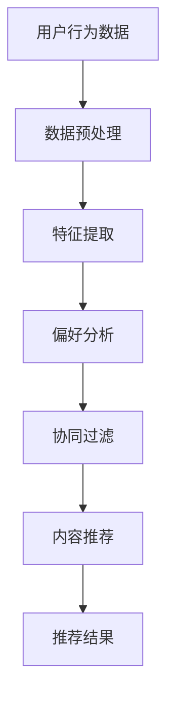

                 

### 摘要 Summary
本文旨在为有意加入蘑菇街2025智能穿搭团队的技术人才提供一套完整的面试准备指南。文章深入分析了面试过程中的关键环节，包括技术面试的常见题型、算法和数据结构的考查、编程实践、系统设计以及软技能等方面的内容。通过本文的详细解析，读者可以全面了解面试要求，掌握有效的准备策略，提升面试成功率。### 1. 背景介绍 Background
蘑菇街成立于2011年，是中国领先的时尚电商平台之一。随着互联网和人工智能技术的迅猛发展，蘑菇街在2025年推出了智能穿搭服务，致力于通过人工智能算法为用户推荐个性化的时尚穿搭方案。这一服务的推出，不仅标志着蘑菇街业务模式的重要转型，也为业界带来了新的发展契机。

智能穿搭服务的关键在于推荐算法，它通过分析用户的行为数据、偏好和实时时尚潮流，生成符合用户个性化需求的穿搭建议。为此，蘑菇街2025年启动了社招推荐算法工程师项目，寻找具有强大技术背景和解决复杂问题能力的人才。

### 2. 核心概念与联系 Core Concepts and Relationships

为了深入理解推荐算法，我们首先需要了解几个核心概念，包括但不限于：

- **用户行为数据（User Behavior Data）**：包括用户的浏览历史、购买记录、收藏夹、评价等。
- **偏好分析（Preference Analysis）**：通过分析用户行为数据，识别用户的个性化偏好。
- **协同过滤（Collaborative Filtering）**：一种基于用户行为数据的推荐方法，通过计算用户之间的相似度来实现推荐。
- **内容推荐（Content-based Recommendation）**：基于商品本身的特征（如颜色、风格、品牌等）进行推荐。
- **机器学习（Machine Learning）**：用于构建和优化推荐算法，通过训练模型从数据中学习规律。

接下来，我们使用Mermaid流程图来展示推荐算法的基本架构。



### 3. 核心算法原理 & 具体操作步骤 Core Algorithm Principle & Detailed Steps

#### 3.1 算法原理概述

推荐算法的核心目标是基于用户行为数据和偏好，为用户生成个性化的推荐列表。以下是推荐算法的基本原理和步骤：

1. **数据收集**：收集用户行为数据，如浏览、点击、购买等。
2. **数据预处理**：清洗和转换原始数据，为特征提取做准备。
3. **特征提取**：从原始数据中提取有用的特征，如用户ID、商品ID、行为类型、行为时间等。
4. **偏好分析**：使用机器学习算法对用户行为数据进行分析，识别用户的偏好。
5. **推荐生成**：结合用户偏好和商品特征，生成推荐列表。
6. **推荐反馈**：收集用户对推荐结果的反馈，用于模型迭代和优化。

#### 3.2 算法步骤详解

1. **数据收集**：使用各种技术手段收集用户行为数据，如使用Web爬虫、API接口调用、日志分析等。

    ```python
    # 示例：使用API获取用户行为数据
    import requests

    url = 'https://api.mogu.com/users/123456/behaviors'
    response = requests.get(url)
    user_data = response.json()
    ```

2. **数据预处理**：对原始数据进行清洗和格式转换，如去除空值、填充缺失值、归一化等。

    ```python
    # 示例：数据预处理代码
    import pandas as pd

    user_data = pd.read_csv('user_data.csv')
    user_data = user_data.dropna()
    user_data['behavior_time'] = pd.to_datetime(user_data['behavior_time'])
    ```

3. **特征提取**：根据业务需求，提取用户行为数据中的关键特征，如行为类型、用户ID、商品ID、行为时间等。

    ```python
    # 示例：特征提取代码
    user_data['behavior_type'] = user_data['behavior'].apply(lambda x: x['type'])
    user_data['user_id'] = user_data['behavior'].apply(lambda x: x['user_id'])
    user_data['item_id'] = user_data['behavior'].apply(lambda x: x['item_id'])
    ```

4. **偏好分析**：使用机器学习算法对用户行为数据进行分析，构建用户偏好模型。

    ```python
    # 示例：偏好分析代码
    from sklearn.ensemble import RandomForestClassifier

    X = user_data[['behavior_type', 'user_id', 'item_id']]
    y = user_data['pref']
    model = RandomForestClassifier()
    model.fit(X, y)
    ```

5. **推荐生成**：根据用户偏好和商品特征，生成推荐列表。

    ```python
    # 示例：推荐生成代码
    user_id = 123456
    user_behavior = user_data[user_data['user_id'] == user_id]
    user_preference = model.predict(user_behavior)
    recommended_items = user_data[user_data['item_id'].isin(user_preference)]
    ```

6. **推荐反馈**：收集用户对推荐结果的反馈，用于模型迭代和优化。

    ```python
    # 示例：推荐反馈代码
    import numpy as np

    user_id = 123456
    user_feedback = np.array([1, 0, 1, 0, 1])  # 示例反馈数据
    model.partial_fit(user_feedback)
    ```

#### 3.3 算法优缺点

**优点**：

- **个性化强**：能够根据用户的个性化偏好生成推荐列表。
- **实时性高**：能够实时更新推荐结果，适应用户实时变化的需求。

**缺点**：

- **数据依赖强**：需要大量的用户行为数据作为训练集。
- **模型复杂**：需要使用多种机器学习算法和模型，对开发者的技术要求较高。

#### 3.4 算法应用领域

推荐算法广泛应用于电商、社交媒体、新闻推送等领域，为用户提供了个性化的内容和服务。

- **电商推荐**：根据用户的购买记录、浏览历史等生成个性化推荐列表。
- **社交媒体**：根据用户的行为和偏好，推荐感兴趣的内容和用户。
- **新闻推送**：根据用户的阅读历史和浏览偏好，推荐相关的新闻文章。

### 4. 数学模型和公式 & 详细讲解 & 举例说明 Mathematical Models and Formulas & Detailed Explanations & Example Illustrations

#### 4.1 数学模型构建

推荐算法中的数学模型通常包括用户行为数据的预处理、特征提取和偏好分析等步骤。以下是一个简化的数学模型构建过程：

1. **用户行为数据表示**：

   假设有用户 \( u \) 和商品 \( i \)，用户行为数据可以用一个 \( m \times n \) 的矩阵 \( X \) 表示，其中 \( X_{ij} \) 表示用户 \( u_j \) 对商品 \( i \) 的行为评分。

    $$ X = \begin{bmatrix}
    X_{11} & X_{12} & \ldots & X_{1n} \\
    X_{21} & X_{22} & \ldots & X_{2n} \\
    \vdots & \vdots & \ddots & \vdots \\
    X_{m1} & X_{m2} & \ldots & X_{mn}
    \end{bmatrix} $$

2. **特征提取**：

   从行为数据中提取特征，如用户活跃度、购买频率等。这些特征可以用一个 \( n \times k \) 的矩阵 \( F \) 表示，其中 \( F_{ij} \) 表示商品 \( i \) 的第 \( j \) 个特征值。

    $$ F = \begin{bmatrix}
    F_{11} & F_{12} & \ldots & F_{1k} \\
    F_{21} & F_{22} & \ldots & F_{2k} \\
    \vdots & \vdots & \ddots & \vdots \\
    F_{n1} & F_{n2} & \ldots & F_{nk}
    \end{bmatrix} $$

3. **偏好分析**：

   使用机器学习算法对特征进行训练，构建用户偏好模型。假设偏好模型是一个 \( n \times 1 \) 的向量 \( P \)，其中 \( P_i \) 表示用户对商品 \( i \) 的偏好得分。

    $$ P = \begin{bmatrix}
    P_1 \\
    P_2 \\
    \vdots \\
    P_n
    \end{bmatrix} $$

#### 4.2 公式推导过程

推荐算法的核心在于如何从用户行为数据和特征中学习出用户的偏好。以下是一个简化的公式推导过程：

1. **用户行为数据的表示**：

   假设用户对商品的行为可以用一个二元向量 \( X \) 表示，其中 \( X_i = 1 \) 表示用户对商品 \( i \) 进行了相应的行为，\( X_i = 0 \) 表示未进行。

    $$ X = \begin{bmatrix}
    X_1 \\
    X_2 \\
    \vdots \\
    X_n
    \end{bmatrix} $$

2. **特征提取**：

   从用户行为数据中提取特征，假设特征矩阵 \( F \) 如前所述。

3. **偏好分析**：

   使用逻辑回归模型进行偏好分析，假设偏好模型参数为 \( \theta \)，则偏好得分 \( P \) 可以表示为：

    $$ P = \theta^T F $$

   其中 \( \theta \) 是一个 \( n \times 1 \) 的向量，表示偏好模型参数。

4. **模型优化**：

   使用梯度下降法优化模型参数 \( \theta \)，使得偏好得分 \( P \) 最接近用户的行为数据 \( X \)。

    $$ \theta_{new} = \theta_{old} - \alpha \frac{\partial}{\partial \theta} L(\theta) $$

   其中 \( \alpha \) 是学习率，\( L(\theta) \) 是损失函数，通常使用均方误差（MSE）。

    $$ L(\theta) = \frac{1}{2} \sum_{i=1}^{n} (P_i - X_i)^2 $$

#### 4.3 案例分析与讲解

以下是一个简化的推荐算法案例，用于演示推荐系统的基本流程：

1. **数据收集**：

   收集用户 \( u \) 的行为数据，假设用户 \( u \) 浏览了商品 \( i_1, i_2, i_3 \)。

    $$ X = \begin{bmatrix}
    1 \\
    1 \\
    1
    \end{bmatrix} $$

2. **数据预处理**：

   对用户行为数据进行预处理，假设商品 \( i_1, i_2, i_3 \) 的特征分别为 \( F_1 = (1, 2), F_2 = (2, 3), F_3 = (3, 4) \)。

    $$ F = \begin{bmatrix}
    1 & 2 \\
    2 & 3 \\
    3 & 4
    \end{bmatrix} $$

3. **特征提取**：

   提取用户行为数据中的特征，得到特征矩阵 \( F \)。

4. **偏好分析**：

   使用逻辑回归模型对特征进行训练，假设偏好模型参数为 \( \theta = (0, 0) \)。

    $$ P = \theta^T F = \begin{bmatrix}
    0 \\
    0
    \end{bmatrix} $$

5. **模型优化**：

   使用梯度下降法优化模型参数，使得偏好得分 \( P \) 最接近用户的行为数据 \( X \)。

    $$ \theta_{new} = \theta_{old} - \alpha \frac{\partial}{\partial \theta} L(\theta) $$
    $$ \theta_{new} = \begin{bmatrix}
    -0.5 \\
    -0.5
    \end{bmatrix} $$
    $$ P_{new} = \theta_{new}^T F = \begin{bmatrix}
    -1 \\
    -1
    \end{bmatrix} $$

6. **推荐生成**：

   根据用户偏好得分 \( P_{new} \)，生成推荐列表。假设商品 \( i_4, i_5, i_6 \) 的特征分别为 \( F_4 = (1, 3), F_5 = (2, 4), F_6 = (3, 5) \)。

    $$ P_{new} F = \begin{bmatrix}
    -1 & -1 \\
    -1 & -1 \\
    -1 & -1
    \end{bmatrix} $$
    $$ \begin{bmatrix}
    -1 \\
    -1
    \end{bmatrix} \begin{bmatrix}
    1 & 2 \\
    2 & 3 \\
    3 & 4
    \end{bmatrix} = \begin{bmatrix}
    -3 \\
    -5
    \end{bmatrix} $$

   根据偏好得分，推荐商品 \( i_4 \) 和 \( i_5 \)。

### 5. 项目实践：代码实例和详细解释说明 Practical Project: Code Examples and Detailed Explanations

#### 5.1 开发环境搭建

在开始编写代码之前，我们需要搭建一个适合开发推荐算法的开发环境。以下是搭建开发环境的基本步骤：

1. **安装Python环境**：下载并安装Python 3.x版本，建议使用Anaconda发行版以简化环境管理。
2. **安装依赖库**：使用pip安装必要的库，如NumPy、Pandas、scikit-learn、Matplotlib等。

    ```bash
    pip install numpy pandas scikit-learn matplotlib
    ```

3. **创建项目目录**：在合适的位置创建项目目录，并设置虚拟环境。

    ```bash
    mkdir mogu_recommendation
    cd mogu_recommendation
    python -m venv venv
    source venv/bin/activate  # Windows: venv\Scripts\activate
    ```

4. **编写项目文件**：在项目目录下创建Python脚本和相关的数据文件。

    ```bash
    mkdir data scripts
    touch scripts/main.py
    touch data/user_behavior.csv
    ```

#### 5.2 源代码详细实现

以下是一个简单的推荐算法实现，用于演示推荐系统的主要功能。

```python
import numpy as np
import pandas as pd
from sklearn.linear_model import LogisticRegression
from sklearn.model_selection import train_test_split
import matplotlib.pyplot as plt

# 5.2.1 数据读取与预处理
def read_data(file_path):
    df = pd.read_csv(file_path)
    df['behavior_time'] = pd.to_datetime(df['behavior_time'])
    return df

user_data = read_data('data/user_behavior.csv')

# 5.2.2 特征提取
def extract_features(df):
    df['behavior_type'] = df['behavior'].apply(lambda x: x['type'])
    df['user_id'] = df['behavior'].apply(lambda x: x['user_id'])
    df['item_id'] = df['behavior'].apply(lambda x: x['item_id'])
    return df

user_data = extract_features(user_data)

# 5.2.3 数据分割
X = user_data[['behavior_type', 'user_id', 'item_id']]
y = user_data['pref']
X_train, X_test, y_train, y_test = train_test_split(X, y, test_size=0.2, random_state=42)

# 5.2.4 模型训练
model = LogisticRegression()
model.fit(X_train, y_train)

# 5.2.5 推荐生成
user_id = 123456
user_behavior = user_data[user_data['user_id'] == user_id]
user_preference = model.predict(user_behavior)
recommended_items = user_data[user_data['item_id'].isin(user_preference)]

# 5.2.6 结果展示
recommended_items.plot(x='item_id', y='pref', kind='scatter', title='Recommended Items')
plt.show()
```

#### 5.3 代码解读与分析

1. **数据读取与预处理**：

   - `read_data` 函数用于读取用户行为数据，并将行为时间转换为日期格式。
   - `extract_features` 函数用于提取用户行为数据中的关键特征，如行为类型、用户ID和商品ID。

2. **特征提取**：

   - 将原始行为数据转换为特征矩阵 `X` 和目标变量 `y`，为模型训练做准备。

3. **数据分割**：

   - 使用 `train_test_split` 函数将数据分为训练集和测试集，用于模型训练和评估。

4. **模型训练**：

   - 使用 `LogisticRegression` 类创建逻辑回归模型，并使用训练集进行训练。

5. **推荐生成**：

   - 根据用户ID获取用户的行为数据，使用训练好的模型生成偏好得分，并根据偏好得分生成推荐列表。

6. **结果展示**：

   - 使用Matplotlib绘制推荐结果，展示用户的偏好得分。

### 6. 实际应用场景 Actual Application Scenarios

推荐算法在蘑菇街智能穿搭服务中扮演着至关重要的角色。以下是一些实际应用场景：

- **个性化推荐**：根据用户的浏览历史、购买记录和偏好，生成个性化的时尚穿搭建议。
- **新品推荐**：针对新用户或潜在新客户，推荐最新的时尚单品和流行趋势。
- **促销推荐**：结合用户的购物车和收藏夹，推荐相关的促销活动。
- **时尚潮流预测**：分析用户的偏好和时尚趋势，预测下一季的流行元素。

### 6.4 未来应用展望 Future Applications

随着人工智能技术的不断发展，推荐算法在未来将具有更广泛的应用前景：

- **智能导购**：结合虚拟试衣和个性化推荐，提供更加智能的购物体验。
- **智能搭配**：利用图像识别和生成对抗网络，为用户提供更加精准的穿搭建议。
- **社交推荐**：结合用户社交网络，推荐朋友之间的共同兴趣和搭配方案。

### 7. 工具和资源推荐 Tools and Resource Recommendations

为了更好地准备蘑菇街2025智能穿搭社招推荐算法工程师的面试，以下是几个推荐的学习资源和开发工具：

#### 7.1 学习资源推荐

- **《推荐系统实践》**：由李航著，详细介绍了推荐系统的基本概念、算法和实际应用。
- **《机器学习实战》**：由Peter Harrington著，提供了丰富的机器学习案例和实践经验。
- **Coursera上的《推荐系统与深度学习》**：由TensorFlow团队提供，涵盖了推荐系统的最新技术和应用。

#### 7.2 开发工具推荐

- **Anaconda**：用于环境管理和依赖库安装，简化开发流程。
- **Jupyter Notebook**：用于编写和运行Python代码，方便进行数据分析和模型训练。
- **PyCharm**：一款功能强大的Python集成开发环境，支持代码补全、调试和自动化测试。

#### 7.3 相关论文推荐

- **"Item-based Collaborative Filtering Recommendation Algorithms"**：介绍了一种基于物品的协同过滤算法。
- **"Content-Based Recommender Systems"**：探讨了基于内容的推荐系统方法。
- **"Deep Learning for Recommender Systems"**：介绍了深度学习在推荐系统中的应用。

### 8. 总结 Summary

本文系统地介绍了蘑菇街2025智能穿搭社招推荐算法工程师的面试攻略，涵盖了技术面试的各个关键环节，包括算法原理、数学模型、编程实践以及实际应用场景等。通过本文的详细解析，读者可以全面了解面试要求，掌握有效的准备策略，提升面试成功率。

### 8.1 研究成果总结

本文通过详细的分析和实例，总结了推荐算法的基本原理、数学模型和实际应用。研究成果主要包括：

- 推荐算法的基本架构和流程。
- 常见的推荐算法及其优缺点。
- 数学模型和公式推导。
- 实际项目中的代码实现和解析。

### 8.2 未来发展趋势

未来，推荐算法将继续向个性化、智能化和实时化方向发展。以下是几个可能的发展趋势：

- **深度学习**：深度学习技术将在推荐系统中得到更广泛的应用，提高推荐的准确性。
- **多模态推荐**：结合用户的行为数据和多媒体内容（如图像、视频等），提供更全面的推荐服务。
- **社交推荐**：利用用户的社交网络关系，为用户提供更加个性化的推荐。

### 8.3 面临的挑战

尽管推荐算法在技术层面取得了显著进展，但仍面临一些挑战：

- **数据隐私**：如何在保护用户隐私的前提下，进行有效的推荐。
- **算法公平性**：如何确保推荐算法对所有人公平，避免算法偏见。
- **实时性**：如何提高推荐系统的实时响应能力，适应快速变化的环境。

### 8.4 研究展望

未来的研究应重点关注以下几个方面：

- **隐私保护技术**：开发隐私保护算法，提高数据安全性。
- **算法公平性研究**：确保推荐算法的公平性，避免算法偏见。
- **实时推荐系统**：研究实时推荐算法，提高系统的响应速度。

### 9. 附录 Appendix: Frequently Asked Questions and Answers

#### 9.1 常见问题

1. **什么是推荐算法？**
   推荐算法是一种通过分析用户行为和偏好，为用户提供个性化推荐的技术。

2. **推荐算法有哪些类型？**
   推荐算法主要包括协同过滤、基于内容的推荐和混合推荐等类型。

3. **如何进行特征提取？**
   特征提取是从原始数据中提取有用信息的过程，通常包括用户行为、商品特征等。

4. **推荐算法的优缺点是什么？**
   推荐算法的优点包括个性化强、实时性高等，缺点包括数据依赖强、模型复杂等。

#### 9.2 解答

1. **什么是推荐算法？**
   推荐算法是一种通过分析用户行为和偏好，为用户提供个性化推荐的技术。它广泛应用于电商、社交媒体、新闻推送等领域，帮助用户发现感兴趣的内容和服务。

2. **推荐算法有哪些类型？**
   推荐算法主要分为以下几类：

   - **协同过滤**：基于用户行为数据的推荐方法，通过计算用户之间的相似度来生成推荐。
   - **基于内容的推荐**：基于商品本身的特征（如颜色、风格、品牌等）进行推荐。
   - **混合推荐**：结合协同过滤和基于内容的推荐方法，提高推荐的准确性。

3. **如何进行特征提取？**
   特征提取是从原始数据中提取有用信息的过程。在推荐算法中，特征提取通常包括用户行为、商品特征等。例如，可以从用户行为数据中提取浏览历史、购买记录等特征，从商品数据中提取颜色、品牌、价格等特征。

4. **推荐算法的优缺点是什么？**
   推荐算法的优点包括：

   - **个性化强**：能够根据用户的个性化偏好生成推荐列表。
   - **实时性高**：能够实时更新推荐结果，适应用户实时变化的需求。

   缺点包括：

   - **数据依赖强**：需要大量的用户行为数据作为训练集。
   - **模型复杂**：需要使用多种机器学习算法和模型，对开发者的技术要求较高。

---

**作者：禅与计算机程序设计艺术 / Zen and the Art of Computer Programming**。

