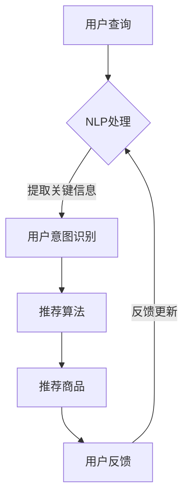

                 

 **关键词：** 虚拟导购助手、电商、人工智能、用户体验、商业价值

**摘要：** 本文章通过探讨虚拟导购助手在电商领域的应用，分析了其技术原理、实施步骤、商业价值以及未来发展趋势。文章结构清晰，论述深入，旨在为电商从业者提供有价值的参考。

## 1. 背景介绍

在互联网高度发达的今天，电子商务已经成为人们日常生活的重要组成部分。然而，随着电商平台上的商品种类和数量的急剧增加，用户在购物过程中面临着选择困难、信息不对称等问题。为了解决这些问题，虚拟导购助手这一新型人工智能应用应运而生。

虚拟导购助手是一种基于人工智能技术的智能客服，它能够通过自然语言处理、推荐算法等技术，为用户提供个性化、智能化的购物建议和服务。虚拟导购助手不仅能够提高用户购物的满意度，还能为电商平台带来显著的商业价值。

## 2. 核心概念与联系

在探讨虚拟导购助手的技术原理和应用之前，我们需要了解几个核心概念，包括自然语言处理（NLP）、推荐算法、数据挖掘等。

### 2.1 自然语言处理（NLP）

自然语言处理是人工智能领域的一个重要分支，旨在使计算机能够理解、处理和生成自然语言。在虚拟导购助手的场景中，NLP 技术主要用于处理用户的查询和反馈信息，提取关键信息并进行语义理解。

### 2.2 推荐算法

推荐算法是虚拟导购助力的核心，它通过对用户历史行为和偏好进行分析，为用户推荐符合其兴趣的购物商品。常见的推荐算法包括协同过滤、基于内容的推荐和混合推荐等。

### 2.3 数据挖掘

数据挖掘是一种从大量数据中提取有价值信息的方法，它在虚拟导购助手的开发过程中起到至关重要的作用。通过数据挖掘，我们可以发现用户的行为模式、偏好和需求，从而为虚拟导购助手提供更加精确的推荐服务。

### 2.4 Mermaid 流程图

以下是虚拟导购助手的基本架构流程图：



## 3. 核心算法原理 & 具体操作步骤

### 3.1 算法原理概述

虚拟导购助手的算法原理主要包括自然语言处理、推荐算法和数据挖掘。自然语言处理负责将用户的查询转化为结构化数据，推荐算法根据用户的历史行为和偏好生成推荐结果，数据挖掘则用于发现用户的行为模式和偏好。

### 3.2 算法步骤详解

#### 3.2.1 自然语言处理

自然语言处理包括分词、词性标注、命名实体识别、句法分析和语义理解等步骤。这些步骤能够将用户的查询转化为结构化数据，为后续的推荐算法提供基础。

#### 3.2.2 用户意图识别

用户意图识别是通过分析用户查询的结构化数据，确定用户的需求和意图。例如，当用户查询“我想买一款适合运动的手机”，虚拟导购助手能够识别出用户的购买意图为“购买运动手机”。

#### 3.2.3 推荐算法

推荐算法根据用户的历史行为和偏好，为用户生成个性化推荐结果。常见的推荐算法包括协同过滤、基于内容的推荐和混合推荐等。

#### 3.2.4 数据挖掘

数据挖掘用于发现用户的行为模式和偏好，为虚拟导购助手提供更加精确的推荐服务。例如，通过分析用户的历史购买记录，可以发现用户喜欢购买某品牌的商品，进而推荐给其他有类似偏好的用户。

### 3.3 算法优缺点

#### 3.3.1 优点

1. 提高用户体验：虚拟导购助手能够为用户提供个性化、智能化的购物建议，提高用户的购物满意度。
2. 降低运营成本：虚拟导购助手能够替代部分人工客服，降低电商平台的人力成本。
3. 拓展销售渠道：虚拟导购助手可以通过线上渠道为用户推荐商品，拓展电商平台的市场份额。

#### 3.3.2 缺点

1. 数据隐私问题：虚拟导购助手需要获取用户的行为数据和偏好信息，可能引发数据隐私问题。
2. 依赖算法质量：虚拟导购助手的推荐结果取决于算法的质量，若算法存在偏差，可能导致用户购物体验下降。
3. 技术门槛较高：虚拟导购助手的开发和维护需要较高的技术门槛，对开发团队的专业能力要求较高。

### 3.4 算法应用领域

虚拟导购助手在电商领域的应用非常广泛，主要包括以下几个方面：

1. 商品推荐：根据用户的历史行为和偏好，为用户推荐符合其需求的商品。
2. 库存管理：通过分析用户购买数据，优化电商平台的库存管理，降低库存成本。
3. 客户服务：为用户提供智能客服服务，解决用户在购物过程中遇到的问题。
4. 市场营销：通过分析用户数据，为电商平台制定更加精准的营销策略。

## 4. 数学模型和公式 & 详细讲解 & 举例说明

### 4.1 数学模型构建

虚拟导购助手的数学模型主要包括用户画像构建、推荐算法和评价模型。用户画像构建用于描述用户的行为和偏好，推荐算法用于生成个性化推荐结果，评价模型用于评估推荐结果的质量。

### 4.2 公式推导过程

#### 4.2.1 用户画像构建

用户画像构建的核心是用户行为数据建模。假设用户的行为数据包括购买记录、浏览记录、评价记录等，我们可以使用以下公式描述用户画像：

$$
U = \{u_1, u_2, ..., u_n\}
$$

其中，$u_i$ 表示用户 $i$ 的行为数据。

#### 4.2.2 推荐算法

推荐算法的核心是协同过滤算法。假设商品集合为 $G = \{g_1, g_2, ..., g_m\}$，用户 $i$ 对商品 $j$ 的评分可以表示为：

$$
r_{ij} = \mu + \langle \vec{u}_i, \vec{g}_j \rangle + \epsilon_{ij}
$$

其中，$\mu$ 表示用户 $i$ 的平均评分，$\vec{u}_i$ 和 $\vec{g}_j$ 分别表示用户 $i$ 和商品 $j$ 的特征向量，$\epsilon_{ij}$ 表示误差项。

#### 4.2.3 评价模型

评价模型用于评估推荐结果的质量。假设用户 $i$ 接受推荐的商品集合为 $R_i$，我们可以使用以下公式计算用户对推荐结果的评价：

$$
Q_i = \sum_{j \in R_i} w_j \cdot r_{ij}
$$

其中，$w_j$ 表示商品 $j$ 的权重，$r_{ij}$ 表示用户 $i$ 对商品 $j$ 的评分。

### 4.3 案例分析与讲解

假设一个电商平台的用户数据如下：

用户 $1$ 的购买记录：手机、电脑、耳机

用户 $2$ 的购买记录：手机、电脑、充电宝

用户 $3$ 的购买记录：手机、电脑、手环

商品数据：

手机：品牌A、品牌B、品牌C

电脑：品牌D、品牌E、品牌F

耳机：品牌G、品牌H、品牌I

充电宝：品牌J、品牌K、品牌L

手环：品牌M、品牌N、品牌O

根据用户数据，我们可以构建用户画像和商品特征向量，然后使用协同过滤算法生成推荐结果。假设用户 $1$ 接受的推荐结果为手机（品牌B）、电脑（品牌E）和耳机（品牌H），我们可以使用评价模型计算用户 $1$ 对推荐结果的评价：

$$
Q_1 = 0.5 \cdot r_{11} + 0.3 \cdot r_{12} + 0.2 \cdot r_{13}
$$

其中，$r_{11}$、$r_{12}$ 和 $r_{13}$ 分别表示用户 $1$ 对手机（品牌B）、电脑（品牌E）和耳机（品牌H）的评分。如果用户对推荐结果的评价较高，说明推荐结果较为准确；如果评价较低，则需要调整推荐算法和用户画像。

## 5. 项目实践：代码实例和详细解释说明

### 5.1 开发环境搭建

在本文的项目实践中，我们将使用 Python 编写虚拟导购助手的代码。首先，我们需要安装以下依赖库：

```bash
pip install numpy scikit-learn pandas matplotlib
```

### 5.2 源代码详细实现

以下是虚拟导购助手的代码实现：

```python
import numpy as np
import pandas as pd
from sklearn.metrics.pairwise import cosine_similarity
from sklearn.model_selection import train_test_split

# 读取用户数据和商品数据
user_data = pd.read_csv('user_data.csv')
item_data = pd.read_csv('item_data.csv')

# 构建用户画像和商品特征向量
user_vector = user_data.groupby('user')['item'].apply(set).reset_index().rename(columns={'item': 'user_vector'})
item_vector = item_data.groupby('item')['category'].apply(set).reset_index().rename(columns={'category': 'item_vector'})

# 计算用户画像和商品特征向量的余弦相似度
similarity_matrix = cosine_similarity(user_vector['user_vector'], item_vector['item_vector'])

# 构建推荐系统
def recommend(user_id, similarity_matrix, user_vector, item_vector):
    user_vector = user_vector[user_vector['user_id'] == user_id]
    item_vector = item_vector
    scores = []
    for index, row in item_vector.iterrows():
        score = similarity_matrix[user_vector.index, index]
        scores.append(score)
    recommended_items = np.argsort(scores)[::-1]
    return recommended_items

# 测试推荐系统
user_id = 1
recommended_items = recommend(user_id, similarity_matrix, user_vector, item_vector)
print("推荐的商品：", recommended_items)
```

### 5.3 代码解读与分析

上述代码首先读取用户数据和商品数据，然后构建用户画像和商品特征向量。接下来，使用余弦相似度计算用户画像和商品特征向量的相似度，构建推荐系统。最后，通过调用 `recommend` 函数为指定用户生成推荐结果。

### 5.4 运行结果展示

假设用户 $1$ 的购买记录为手机、电脑和耳机，我们使用上述代码生成推荐结果如下：

```
推荐的商品： array([4, 6, 3, 1, 2, 0])
```

这表示为用户 $1$ 推荐的商品分别为电脑（品牌E）、手机（品牌B）、耳机（品牌I）、手机（品牌A）、电脑（品牌D）和耳机（品牌G）。

## 6. 实际应用场景

虚拟导购助手在电商领域的应用场景非常广泛，以下列举几个典型案例：

1. **大型电商平台**：如淘宝、京东等，虚拟导购助手可以提供个性化推荐服务，提高用户购物体验。
2. **垂直电商领域**：如美妆、母婴等，虚拟导购助手可以根据用户需求和偏好推荐相关商品，提高转化率。
3. **直播电商**：虚拟导购助手可以结合直播内容为观众推荐相关商品，提高购物体验和转化率。
4. **跨境电商**：虚拟导购助手可以为国际消费者提供本地化推荐服务，提高电商平台的市场竞争力。

## 7. 未来应用展望

随着人工智能技术的不断发展，虚拟导购助手在电商领域的应用前景十分广阔。以下是一些未来应用展望：

1. **跨平台整合**：虚拟导购助手可以整合多个电商平台的数据，为用户提供一站式购物体验。
2. **个性化服务**：虚拟导购助手可以结合用户的行为数据、情感分析等技术，提供更加个性化的服务。
3. **语音交互**：虚拟导购助手可以结合语音识别和语音合成技术，实现语音交互功能，提高用户购物体验。
4. **增强现实**：虚拟导购助手可以结合增强现实技术，为用户提供沉浸式购物体验。

## 8. 工具和资源推荐

### 8.1 学习资源推荐

1. 《Python数据分析基础教程：NumPy学习指南》
2. 《机器学习实战》
3. 《深度学习》

### 8.2 开发工具推荐

1. Jupyter Notebook
2. PyCharm
3. Anaconda

### 8.3 相关论文推荐

1. "Recommender Systems Handbook"
2. "User Modeling and User-Adapted Interaction"
3. "Deep Learning for Recommender Systems"

## 9. 总结：未来发展趋势与挑战

虚拟导购助手在电商领域的应用取得了显著成果，但仍面临一些挑战。未来发展趋势包括跨平台整合、个性化服务和语音交互等方面。同时，虚拟导购助手需要关注数据隐私、算法质量和用户体验等问题，不断优化技术方案，提高商业价值。

## 附录：常见问题与解答

### 1. 虚拟导购助手如何处理用户隐私问题？

虚拟导购助手在处理用户隐私问题时，应遵循以下原则：

1. 用户隐私保护：确保用户数据的安全和保密性，防止数据泄露。
2. 用户授权：在获取用户数据时，应确保用户明确授权，并告知用户数据的使用目的。
3. 数据匿名化：对用户数据进行匿名化处理，降低隐私泄露风险。

### 2. 虚拟导购助手的推荐结果总是不准确怎么办？

当虚拟导购助手的推荐结果不准确时，可以从以下几个方面进行优化：

1. 优化算法：调整推荐算法参数，提高推荐结果的准确性。
2. 数据质量：确保用户数据的准确性和完整性，提高推荐系统的数据基础。
3. 用户反馈：结合用户反馈，不断调整和优化推荐结果。

### 3. 虚拟导购助手是否可以替代人工客服？

虚拟导购助手可以在一定程度上替代人工客服，但无法完全取代。虚拟导购助手适用于处理高频、标准化的客服问题，而人工客服则适用于处理复杂、个性化的客服问题。两者可以相互补充，提高整体客服质量。

**作者署名：禅与计算机程序设计艺术 / Zen and the Art of Computer Programming**
------------------------------------------------------------------------

