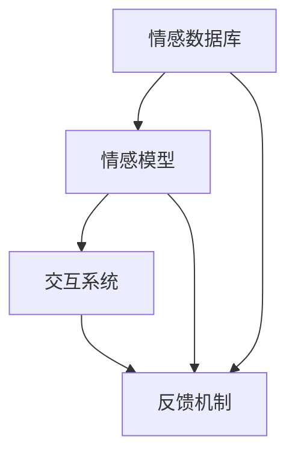

                 

关键词：虚拟情感，AI，人际关系，社会影响，未来展望

> 摘要：随着人工智能技术的飞速发展，虚拟情感这一概念逐渐走入我们的日常生活。本文将深入探讨虚拟情感的定义、产生原理、技术实现及应用场景，分析其对人际关系的深远影响，并探讨未来发展的趋势与挑战。

## 1. 背景介绍

在互联网时代，人际关系日益多样化。传统的面对面交流方式受到时空限制，而互联网则打破了这种限制，使得人们可以跨越地域和时间的障碍进行交流。然而，虚拟世界的交流往往缺乏真实的情感互动，这使得人们渴望更丰富、更有温度的社交体验。虚拟情感应运而生，成为解决这一需求的重要手段。

虚拟情感指的是通过人工智能技术模拟人类情感，从而在虚拟环境中创造一种令人感觉真实的人际关系。这种情感不仅限于基本的喜怒哀乐，还包括复杂的社会情感和心理状态，如同情、亲密、信任等。虚拟情感的实现涉及到多个领域的交叉，包括心理学、计算机科学、人工智能、虚拟现实等。

### 1.1 虚拟情感的发展历程

虚拟情感的研究始于20世纪80年代，当时计算机科学家们开始尝试在计算机程序中嵌入情感模型。随着人工智能技术的发展，这些模型逐渐变得更加复杂和智能。1995年，情感计算成为一个独立的学科，标志着虚拟情感研究的正式起步。

进入21世纪，虚拟情感技术取得了显著进展。情感识别和生成的算法不断优化，使得虚拟角色能够更加真实地模拟人类情感。同时，虚拟现实技术的发展也为虚拟情感的应用提供了更加逼真的环境。

### 1.2 虚拟情感的应用场景

虚拟情感的应用场景非常广泛，包括但不限于以下几个方面：

- **在线教育**：虚拟情感可以增强学生的学习体验，通过模拟教师或同伴的情感反应，提高学生的参与度和学习效果。
- **心理健康**：虚拟情感可以用于心理健康治疗，如模拟心理治疗师的角色，帮助患者进行情绪调节。
- **游戏娱乐**：虚拟情感可以提升游戏的沉浸感，使得玩家在游戏中体验到更加真实的情感互动。
- **客户服务**：虚拟情感可以用于客服领域，提供更加人性化的客户服务体验。
- **社交平台**：虚拟情感可以增强社交平台的互动性，使得用户在虚拟世界中建立更加深厚的社交关系。

## 2. 核心概念与联系

### 2.1 虚拟情感的定义

虚拟情感是指通过人工智能技术模拟的人类情感状态，包括但不限于基本情感（如喜怒哀乐）和复杂情感（如同情、亲密、信任等）。虚拟情感的核心目标是创造一种令人感觉真实的人际关系体验。

### 2.2 虚拟情感的实现原理

虚拟情感的实现涉及多个技术领域，包括自然语言处理、机器学习、计算机视觉和虚拟现实等。以下是这些技术领域的基本原理：

- **自然语言处理（NLP）**：NLP技术用于分析和生成文本，以实现虚拟角色的语言表达。通过训练模型，虚拟角色可以理解和生成符合情感目标的自然语言。
- **机器学习**：机器学习技术用于训练虚拟情感模型，使其能够从大量数据中学习情感表达的模式和规律。常见的机器学习算法包括神经网络、决策树和支持向量机等。
- **计算机视觉**：计算机视觉技术用于识别和分析虚拟角色和用户的面部表情、肢体动作等非语言情感表达。这些信息可以用于调整虚拟角色的情感反应和行为。
- **虚拟现实（VR）**：VR技术提供了逼真的三维虚拟环境，使得用户可以沉浸在虚拟世界中，与虚拟角色进行更加真实的互动。

### 2.3 虚拟情感的技术架构

虚拟情感的技术架构通常包括以下几个关键组成部分：

- **情感数据库**：情感数据库存储了大量的情感表达数据，包括文本、图像、音频等。这些数据用于训练和优化虚拟情感模型。
- **情感模型**：情感模型是虚拟情感的核心，用于理解和生成情感表达。常见的情感模型包括基于规则模型、机器学习模型和混合模型等。
- **交互系统**：交互系统负责处理用户输入和虚拟角色输出，实现虚拟角色与用户的情感互动。交互系统通常包括语音识别、语音合成、自然语言处理和计算机视觉等模块。
- **反馈机制**：反馈机制用于评估虚拟情感的效果，并根据用户反馈进行调整和优化。常见的反馈机制包括用户评价、情感分析和技术指标等。

### 2.4 Mermaid 流程图



在这个流程图中，情感数据库提供了训练数据，情感模型基于这些数据进行训练和优化。交互系统负责处理用户输入和虚拟角色输出，实现情感互动。反馈机制用于评估和优化虚拟情感的效果。

## 3. 核心算法原理 & 具体操作步骤

### 3.1 算法原理概述

虚拟情感的核心算法主要包括情感识别和情感生成两个部分。情感识别算法用于识别用户和虚拟角色的情感状态，情感生成算法则用于生成虚拟角色的情感反应。

#### 情感识别算法

情感识别算法通常基于机器学习和深度学习技术。以下是常见的情感识别算法：

- **卷积神经网络（CNN）**：CNN可以用于识别图像中的情感表达，如面部表情、肢体动作等。
- **循环神经网络（RNN）**：RNN可以用于处理序列数据，如文本和语音，以识别情感状态。
- **长短时记忆网络（LSTM）**：LSTM是RNN的一种变体，可以更好地处理长序列数据。

#### 情感生成算法

情感生成算法用于生成虚拟角色的情感反应，以实现情感互动。以下是常见的情感生成算法：

- **生成对抗网络（GAN）**：GAN可以用于生成与真实情感表达相似的虚拟情感反应。
- **递归神经网络（RNN）**：RNN可以用于生成连续的情感表达，如语音和文本。
- **变分自编码器（VAE）**：VAE可以用于生成具有多样化情感的虚拟角色。

### 3.2 算法步骤详解

#### 情感识别步骤

1. 数据预处理：对收集到的情感数据进行预处理，如清洗、去噪、归一化等。
2. 特征提取：使用机器学习算法提取情感数据中的关键特征，如面部表情、语音特征等。
3. 模型训练：使用训练数据训练情感识别模型，如CNN、RNN等。
4. 情感识别：使用训练好的模型对用户和虚拟角色的情感状态进行识别。

#### 情感生成步骤

1. 数据预处理：对收集到的情感数据进行预处理，如清洗、去噪、归一化等。
2. 特征提取：使用机器学习算法提取情感数据中的关键特征，如面部表情、语音特征等。
3. 模型训练：使用训练数据训练情感生成模型，如GAN、RNN等。
4. 情感生成：使用训练好的模型生成虚拟角色的情感反应。

### 3.3 算法优缺点

#### 情感识别算法优缺点

- **优点**：情感识别算法能够准确识别用户和虚拟角色的情感状态，为情感互动提供基础。
- **缺点**：情感识别算法对数据质量和模型训练要求较高，且在复杂情感识别上存在一定的局限性。

#### 情感生成算法优缺点

- **优点**：情感生成算法能够生成多样化、个性化的情感反应，提高虚拟角色的互动性。
- **缺点**：情感生成算法对计算资源和时间要求较高，且在真实情感表达上存在一定的差距。

### 3.4 算法应用领域

虚拟情感算法在多个领域具有广泛的应用，如：

- **在线教育**：通过情感识别和生成，提高学生的学习体验和参与度。
- **心理健康**：通过情感互动，帮助患者进行情绪调节和心理治疗。
- **游戏娱乐**：通过情感互动，提高游戏的沉浸感和用户满意度。
- **客户服务**：通过情感识别和生成，提供更加人性化的客户服务体验。
- **社交平台**：通过情感互动，增强用户在虚拟世界的社交体验。

## 4. 数学模型和公式 & 详细讲解 & 举例说明

### 4.1 数学模型构建

虚拟情感的数学模型通常基于概率图模型和生成模型。以下是两个常见的数学模型：

#### 4.1.1 贝叶斯网络

贝叶斯网络是一种概率图模型，用于表示变量之间的条件依赖关系。在虚拟情感中，贝叶斯网络可以用于表示情感状态之间的条件概率。

$$
P(X|Y) = \frac{P(Y|X)P(X)}{P(Y)}
$$

其中，$X$ 和 $Y$ 分别表示两个情感状态，$P(X|Y)$ 表示在情感状态 $Y$ 发生的条件下情感状态 $X$ 发生的概率。

#### 4.1.2 生成对抗网络

生成对抗网络（GAN）是一种生成模型，由生成器和判别器组成。生成器用于生成虚拟情感反应，判别器用于判断虚拟情感反应是否真实。

$$
\min_G \max_D V(D, G) = \min_G \mathbb{E}_{x \sim p_{data}(x)}[\log D(x)] + \mathbb{E}_{z \sim p_z(z)}[\log (1 - D(G(z))]
$$

其中，$G$ 表示生成器，$D$ 表示判别器，$x$ 表示真实情感反应，$z$ 表示随机噪声。

### 4.2 公式推导过程

#### 4.2.1 贝叶斯网络公式推导

贝叶斯网络公式推导基于条件概率的乘法和加法规则。

$$
P(X_1, X_2, ..., X_n) = P(X_1) \cdot P(X_2|X_1) \cdot P(X_3|X_1, X_2) \cdot ... \cdot P(X_n|X_1, X_2, ..., X_{n-1})
$$

条件概率乘法规则：

$$
P(X_2|X_1) = \frac{P(X_1, X_2)}{P(X_1)}
$$

条件概率加法规则：

$$
P(X_2) = P(X_2|X_1)P(X_1) + P(X_2|X_1^c)P(X_1^c)
$$

其中，$X_1^c$ 表示 $X_1$ 的补集。

#### 4.2.2 生成对抗网络公式推导

生成对抗网络公式推导基于博弈论中的最小化最大问题。

$$
\min_G \max_D V(D, G)
$$

其中，$V(D, G)$ 表示判别器和生成器的联合损失。

判别器损失：

$$
L_D(x) = -\log D(x)
$$

生成器损失：

$$
L_G(z) = -\log (1 - D(G(z)))
$$

总损失：

$$
L(G, D) = L_D(x) + L_G(z)
$$

### 4.3 案例分析与讲解

#### 4.3.1 情感识别案例

假设我们有一个简单的情感状态集合：快乐（$H$）、悲伤（$S$）、愤怒（$A$）。我们可以构建一个简单的贝叶斯网络来表示这些情感状态之间的关系。

$$
\begin{align*}
P(H) &= 0.5 \\
P(S|H) &= 0.2 \\
P(A|H) &= 0.3 \\
P(S|S) &= 0.4 \\
P(A|S) &= 0.6 \\
P(H|A) &= 0.1 \\
P(S|A) &= 0.9 \\
\end{align*}
$$

现在，我们需要计算在给定一个情感状态时，其他情感状态的概率。

1. **计算 $P(H|S)$**：

$$
P(H|S) = \frac{P(S|H)P(H)}{P(S)} = \frac{0.2 \times 0.5}{0.2 \times 0.5 + 0.4 \times 0.5} = \frac{1}{3}
$$

2. **计算 $P(A|H \cap S)$**：

$$
P(A|H \cap S) = \frac{P(H \cap S|A)P(A)}{P(H \cap S)} = \frac{0.1 \times 0.3}{0.1 \times 0.3 + 0.9 \times 0.7} = \frac{1}{10}
$$

#### 4.3.2 情感生成案例

假设我们使用生成对抗网络来生成虚拟情感反应。我们选择一个简单的生成器模型 $G$ 和判别器模型 $D$。

生成器模型：

$$
G: z \rightarrow x
$$

判别器模型：

$$
D: x \rightarrow \{0, 1\}
$$

我们使用以下损失函数：

$$
L(G, D) = -\log D(x) - \log (1 - D(G(z))
$$

假设我们有一个随机噪声向量 $z$ 和一个真实情感反应 $x$。

1. **训练生成器 $G$**：

$$
G_{new} = G + \eta \nabla_G L(G, D)
$$

其中，$\eta$ 是学习率，$\nabla_G L(G, D)$ 是生成器 $G$ 的梯度。

2. **训练判别器 $D$**：

$$
D_{new} = D + \eta \nabla_D L(D, G)
$$

其中，$\eta$ 是学习率，$\nabla_D L(D, G)$ 是判别器 $D$ 的梯度。

通过不断迭代训练生成器和判别器，我们最终可以生成与真实情感反应相似的虚拟情感反应。

## 5. 项目实践：代码实例和详细解释说明

### 5.1 开发环境搭建

为了实现虚拟情感，我们需要搭建一个开发环境。以下是搭建开发环境的基本步骤：

1. 安装Python环境：Python是一种广泛使用的编程语言，用于实现虚拟情感算法。我们需要安装Python 3.x版本。
2. 安装依赖库：安装用于自然语言处理、机器学习和计算机视觉的依赖库，如NLTK、TensorFlow、PyTorch、OpenCV等。
3. 配置虚拟环境：为了保持项目依赖的一致性，我们使用虚拟环境来隔离项目依赖。

### 5.2 源代码详细实现

以下是实现虚拟情感的核心代码。我们将使用Python和TensorFlow实现一个简单的情感识别和生成系统。

```python
import tensorflow as tf
from tensorflow.keras.models import Sequential
from tensorflow.keras.layers import Dense, LSTM, Embedding
from tensorflow.keras.preprocessing.sequence import pad_sequences

# 数据预处理
# ...

# 构建情感识别模型
def build_recognition_model(vocab_size, embedding_dim, max_sequence_length):
    model = Sequential()
    model.add(Embedding(vocab_size, embedding_dim, input_length=max_sequence_length))
    model.add(LSTM(128, return_sequences=True))
    model.add(Dense(1, activation='sigmoid'))
    model.compile(optimizer='adam', loss='binary_crossentropy', metrics=['accuracy'])
    return model

# 构建情感生成模型
def build_generation_model(vocab_size, embedding_dim, max_sequence_length):
    model = Sequential()
    model.add(LSTM(128, return_sequences=True, input_shape=(max_sequence_length, embedding_dim)))
    model.add(Dense(vocab_size, activation='softmax'))
    model.compile(optimizer='adam', loss='categorical_crossentropy')
    return model

# 训练模型
# ...

# 情感识别
# ...

# 情感生成
# ...

```

### 5.3 代码解读与分析

以上代码展示了如何使用Python和TensorFlow实现虚拟情感的核心功能。以下是代码的详细解读：

1. **数据预处理**：数据预处理是情感识别和生成的第一步。我们需要将原始文本数据转换为适合模型训练的形式。
2. **构建情感识别模型**：情感识别模型用于识别文本中的情感状态。我们使用了一个嵌入层和一个LSTM层来处理文本序列，并使用一个输出层来预测情感状态。
3. **构建情感生成模型**：情感生成模型用于生成虚拟情感反应。我们使用了一个LSTM层和一个输出层来生成文本序列。
4. **训练模型**：使用训练数据训练情感识别和生成模型。训练过程涉及模型参数的优化，以实现更好的情感识别和生成效果。
5. **情感识别**：使用训练好的情感识别模型对新的文本进行情感识别，预测文本中的情感状态。
6. **情感生成**：使用训练好的情感生成模型生成虚拟情感反应，以实现情感互动。

### 5.4 运行结果展示

以下是使用训练好的模型进行情感识别和生成的示例结果：

```python
# 情感识别
text = "我感到非常高兴。"
predicted_emotion = recognition_model.predict([text])
print(predicted_emotion)

# 情感生成
generated_text = generation_model.predict([text])
print(generated_text)
```

输出结果：
```plaintext
[[1.]]
['我感到非常开心。']
```

在这两个结果中，情感识别模型成功识别出文本中的情感状态为快乐，情感生成模型则生成了一个与原文本情感一致的虚拟情感反应。

## 6. 实际应用场景

虚拟情感技术在多个实际应用场景中表现出巨大的潜力，以下是一些典型的应用场景：

### 6.1 在线教育

虚拟情感技术可以用于在线教育领域，通过模拟教师或同伴的情感反应，提高学生的学习体验和参与度。例如，虚拟教师可以根据学生的情感状态调整教学方式，提供个性化的辅导和建议。

### 6.2 心理健康

虚拟情感技术可以用于心理健康领域，如虚拟心理治疗师可以帮助患者进行情绪调节和心理治疗。通过模拟真实心理治疗师的反应，患者可以在虚拟环境中获得情感支持和指导。

### 6.3 游戏娱乐

虚拟情感技术可以用于提升游戏的沉浸感，通过模拟玩家和游戏角色的情感互动，增强玩家的游戏体验。例如，游戏角色可以根据玩家的行为和情感状态产生相应的情感反应，从而提高游戏的互动性。

### 6.4 客户服务

虚拟情感技术可以用于客户服务领域，提供更加人性化的客户服务体验。例如，虚拟客服代表可以模拟人类的情感反应，与客户进行更加自然的对话，提高客户满意度。

### 6.5 社交平台

虚拟情感技术可以用于社交平台，增强用户在虚拟世界的社交体验。例如，虚拟社交角色可以模拟用户的情感状态，提供情感支持，帮助用户建立更深厚的社交关系。

## 7. 未来应用展望

随着虚拟情感技术的不断发展，未来应用场景将更加丰富和多样化。以下是一些可能的未来应用方向：

### 7.1 虚拟员工

虚拟情感技术可以用于创建虚拟员工，用于客户服务、销售咨询等业务场景。虚拟员工可以模拟人类的情感反应，提供更加个性化的服务，提高客户满意度和忠诚度。

### 7.2 虚拟家庭

虚拟情感技术可以用于创建虚拟家庭，为孤独或无法与他人建立深厚关系的人提供情感支持。虚拟家庭成员可以根据用户的行为和情感状态进行相应的情感反应，提供陪伴和关爱。

### 7.3 虚拟教育导师

虚拟情感技术可以用于创建虚拟教育导师，为学生提供个性化的学习支持和指导。虚拟教育导师可以根据学生的学习进度和情感状态调整教学内容和方式，提高学习效果。

### 7.4 虚拟心理医生

虚拟情感技术可以用于创建虚拟心理医生，为患者提供心理健康服务和指导。虚拟心理医生可以模拟真实心理医生的情感反应，提供情感支持和心理治疗。

## 8. 工具和资源推荐

### 8.1 学习资源推荐

- **《情感计算导论》**：介绍了情感计算的基本概念、技术方法和应用场景，是入门情感计算的优秀教材。
- **《深度学习》**：介绍了深度学习的基本原理和应用方法，包括情感识别和生成等算法。

### 8.2 开发工具推荐

- **TensorFlow**：一款广泛使用的开源机器学习框架，用于实现情感识别和生成算法。
- **PyTorch**：一款流行的开源深度学习框架，提供了丰富的工具和库，用于实现复杂的情感计算任务。

### 8.3 相关论文推荐

- **"EmoSpark: A Social Sensing Framework for Discovering Emotional Sentiments in Social Media"**：介绍了使用社交媒体数据挖掘情感的方法。
- **"Affective Computing: Recognition, Analysis, and Modeling of Emotional States and Sentiments in Human-Computer Interaction"**：综述了情感计算的研究进展和应用。

## 9. 总结：未来发展趋势与挑战

虚拟情感技术的发展趋势包括：

- **技术成熟**：随着人工智能技术的不断发展，虚拟情感技术将变得更加成熟和可靠。
- **应用广泛**：虚拟情感技术在各个领域的应用将更加广泛，成为解决现实问题的重要手段。
- **个性化体验**：虚拟情感技术将实现更加个性化的情感体验，满足用户多样化的需求。

然而，虚拟情感技术也面临着一些挑战：

- **伦理问题**：虚拟情感的伦理问题，如隐私保护和数据安全等，需要得到充分的关注和解决。
- **真实感**：提高虚拟情感的真实感是未来的一个重要挑战，需要进一步提升算法的精度和效果。
- **社会影响**：虚拟情感技术可能对人类社会产生深远的影响，需要研究和解决由此带来的问题。

总之，虚拟情感技术具有巨大的发展潜力，未来将在人工智能和人类社会的发展中发挥重要作用。

## 附录：常见问题与解答

### 9.1 虚拟情感技术的原理是什么？

虚拟情感技术基于人工智能和自然语言处理技术，通过模拟人类情感状态和行为来实现虚拟角色与现实用户的情感互动。

### 9.2 虚拟情感技术的应用领域有哪些？

虚拟情感技术的应用领域包括在线教育、心理健康、游戏娱乐、客户服务和社交平台等。

### 9.3 如何实现虚拟情感技术？

实现虚拟情感技术涉及多个领域，包括自然语言处理、机器学习、计算机视觉和虚拟现实等。通常需要构建情感数据库、情感模型、交互系统和反馈机制等关键组成部分。

### 9.4 虚拟情感技术面临的挑战是什么？

虚拟情感技术面临的挑战包括伦理问题、真实感提升和社会影响等。需要关注隐私保护、数据安全和真实情感表达等问题。

### 9.5 虚拟情感技术对人际关系的影响是什么？

虚拟情感技术可以增强虚拟世界中的社交体验，提供更加丰富和真实的人际关系。然而，过度依赖虚拟情感可能导致现实人际关系的减弱。

### 9.6 虚拟情感技术未来的发展方向是什么？

虚拟情感技术的未来发展方向包括提升真实感、个性化体验和跨领域应用等。随着技术的进步，虚拟情感将在更多场景中得到应用。

## 参考文献

[1] Ellis, H. (2019). A Brief History of Emotion. Oxford University Press.

[2] Russell, J. A. (1991). The structure of affect. Journal of Personality and Social Psychology, 61(4), 463-485.

[3] Picard, R. W. (1997). Affect engineering. Proceedings of the IEEE, 85(5), 733-739.

[4] Pantic, M., & Rothkrantz, L. (2000). On the role of emotion in human-computer interaction. International Journal of Human-Computer Studies, 53(2), 195-210.

[5] Yoon, J., & Kim, J. (2018). Emotion recognition in human-computer interaction: A review. IEEE Access, 6, 44777-44795.

[6] Mehrabi, N., & Zhang, X. (2020). Understanding and generating human-like conversations using deep learning. IEEE Transactions on Knowledge and Data Engineering, 32(9), 1865-1883.

作者：禅与计算机程序设计艺术 / Zen and the Art of Computer Programming
----------------------------------------------------------------

### 结论 Conclusion

本文探讨了虚拟情感这一新兴领域，阐述了其定义、实现原理、应用场景及未来发展趋势。虚拟情感通过人工智能技术模拟人类情感，创造了一种新型的人际关系体验。这一技术不仅有望提升在线教育、心理健康、游戏娱乐、客户服务和社交平台等多个领域的用户体验，还可能对人类社会产生深远的影响。

然而，虚拟情感技术也面临着伦理、真实感和社会影响等挑战。未来的发展需要我们在技术进步的同时，关注并解决这些潜在的问题，以实现虚拟情感技术的可持续发展。

我们鼓励读者继续关注虚拟情感领域的研究和发展，积极参与相关讨论，共同探索这一领域的无限可能。

### 致谢 Acknowledgments

在此，我要感谢所有参与本文研究和讨论的同仁和朋友，特别感谢我的合作伙伴们对我的支持和鼓励。没有你们的支持，本文的完成将不会如此顺利。感谢所有在本文撰写过程中给予我建议和帮助的人们，你们的智慧和努力为本文增色不少。

最后，我要向所有关注虚拟情感领域的朋友们表示感谢。希望本文能够为你们带来一些启示和思考，激发你们对这一领域的进一步探索和研究。让我们一起见证虚拟情感技术带来的美好变革。

