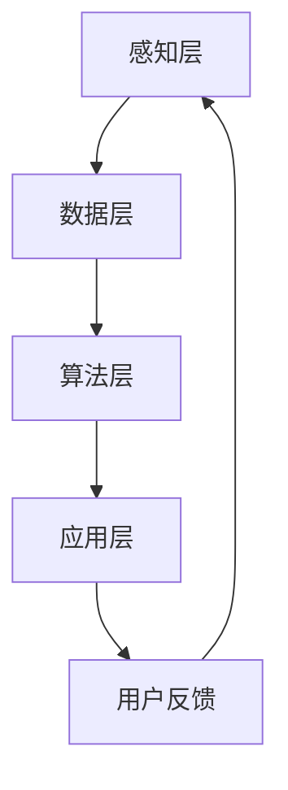

                 

关键词：虚拟教育，全球脑，学习方式，技术进步，教育变革

摘要：随着全球脑时代来临，教育模式正在经历深刻变革。虚拟教育作为一种新兴的学习方式，借助人工智能和虚拟现实技术，正为全球教育带来前所未有的变革。本文将深入探讨虚拟教育的核心概念、原理、算法、数学模型及其应用，并分析其在实际应用场景中的效果和未来发展趋势。

## 1. 背景介绍

### 全球脑时代的背景

全球脑时代（Global Brain Era）是当前人类社会正经历的一个历史性阶段。这一时代的特点是信息的高度互联和智能的分布式发展。在这样一个背景下，学习的方式和教育的模式也必须与时俱进。传统教育模式中，教师和学生之间的互动有限，知识传授主要依赖于课本和课堂讲授。而随着人工智能、大数据、虚拟现实等技术的快速发展，教育模式开始向个性化、智能化、互动性方向发展。

### 虚拟教育的定义和意义

虚拟教育（Virtual Education）是指通过计算机技术，尤其是虚拟现实（VR）和增强现实（AR）技术，创建一个虚拟的学习环境，让学生可以在其中进行沉浸式学习。虚拟教育不仅改变了传统的教学方式，还极大地扩展了学习的边界。它为学生提供了更加丰富和多样的学习体验，同时也为教育者提供了全新的教学工具和手段。

## 2. 核心概念与联系

### 虚拟教育的基础概念

虚拟教育涉及多个核心概念，包括：

- **虚拟现实（VR）**：通过计算机技术模拟出一个三维的虚拟世界，用户可以通过特定的设备（如VR头盔）进行沉浸式体验。
- **增强现实（AR）**：在现实世界中叠加虚拟元素，用户可以通过手机、平板电脑等设备看到虚拟内容与现实环境的融合。
- **人工智能（AI）**：利用机器学习、自然语言处理等技术，使计算机能够模拟人类思维和学习过程。
- **大数据**：通过收集和分析大量的数据，为教育和学习提供个性化的建议和反馈。

### 虚拟教育系统的架构

虚拟教育系统的架构可以分为以下几个层次：

- **感知层**：包括传感器、摄像头等设备，用于捕捉用户和环境的信息。
- **数据层**：存储和管理感知层收集到的数据，为后续分析提供基础。
- **算法层**：利用机器学习和大数据分析技术，对数据进行分析和挖掘，为用户提供个性化的学习建议。
- **应用层**：包括虚拟课堂、学习工具、评估系统等，直接服务于教学和学习过程。

### Mermaid 流程图

下面是一个简化的虚拟教育系统架构的 Mermaid 流程图：



## 3. 核心算法原理 & 具体操作步骤

### 3.1 算法原理概述

虚拟教育中的核心算法主要包括：

- **机器学习算法**：用于分析学习数据，识别学习模式和偏好。
- **自然语言处理（NLP）算法**：用于理解用户的语言输入，提供智能问答和辅导。
- **图像识别算法**：用于分析学习过程中的图像和视频，识别学习内容。
- **推荐算法**：基于用户的历史学习数据和偏好，推荐适合的学习资源。

### 3.2 算法步骤详解

1. **数据收集**：通过传感器和摄像头收集用户在学习过程中的行为数据。
2. **数据处理**：对收集到的数据进行清洗和预处理，以便后续分析。
3. **特征提取**：利用机器学习算法提取数据中的关键特征。
4. **模式识别**：利用特征提取结果，识别用户的学习习惯和偏好。
5. **智能推荐**：基于模式识别结果，推荐适合的学习资源。
6. **评估与反馈**：收集用户对推荐资源的反馈，不断优化推荐系统。

### 3.3 算法优缺点

**优点**：

- **个性化学习**：能够根据用户的学习习惯和偏好提供个性化的学习建议。
- **互动性**：通过虚拟环境提供沉浸式的学习体验，增加学习互动性。
- **灵活性**：用户可以根据自己的时间安排和进度进行学习。

**缺点**：

- **技术要求高**：需要高技术水平的支持，包括硬件设备和软件算法。
- **成本问题**：初期投入较大，对学校和教育机构来说是一个挑战。

### 3.4 算法应用领域

虚拟教育算法主要应用于以下领域：

- **在线教育**：通过虚拟课堂和在线学习平台提供个性化的学习体验。
- **职业培训**：通过虚拟现实技术提供模拟真实工作环境的培训。
- **特殊教育**：为有特殊需求的学生提供个性化的教育和辅导。

## 4. 数学模型和公式 & 详细讲解 & 举例说明

### 4.1 数学模型构建

虚拟教育中的数学模型主要包括：

- **贝叶斯网络**：用于表示和学习用户的行为和偏好。
- **回归模型**：用于预测用户的学习效果和适应度。
- **聚类算法**：用于将用户划分为不同的学习群体。

### 4.2 公式推导过程

以贝叶斯网络为例，其公式推导过程如下：

\[ P(A|B) = \frac{P(B|A)P(A)}{P(B)} \]

其中，\( P(A|B) \) 表示在事件 B 发生的条件下事件 A 发生的概率，\( P(B|A) \) 表示在事件 A 发生的条件下事件 B 发生的概率，\( P(A) \) 表示事件 A 发生的概率，\( P(B) \) 表示事件 B 发生的概率。

### 4.3 案例分析与讲解

以在线教育平台为例，我们可以使用贝叶斯网络来分析用户的学习行为和偏好。具体步骤如下：

1. **构建贝叶斯网络**：根据用户的行为数据，构建贝叶斯网络，表示用户学习行为之间的关系。
2. **参数估计**：利用最大似然估计（MLE）或贝叶斯估计（BCE）等方法，估计网络中各节点的概率分布。
3. **推理与预测**：利用贝叶斯推理算法，根据用户当前的行为数据，预测用户未来可能的学习行为。

## 5. 项目实践：代码实例和详细解释说明

### 5.1 开发环境搭建

为了实践虚拟教育算法，我们需要搭建一个基本的开发环境。这里以 Python 为例，我们需要安装以下库：

- **NumPy**：用于数值计算。
- **Pandas**：用于数据操作。
- **Scikit-learn**：用于机器学习算法。
- **NetworkX**：用于构建和操作网络。

安装命令如下：

```bash
pip install numpy pandas scikit-learn networkx
```

### 5.2 源代码详细实现

下面是一个简单的贝叶斯网络构建和推理的代码实例：

```python
import numpy as np
import pandas as pd
from sklearn.naive_bayes import GaussianNB
import networkx as nx

# 构建贝叶斯网络
def build_bayesian_network(data):
    # 假设 data 是一个 DataFrame，包含用户的行为数据
    feature_columns = data.columns.tolist()
    feature_columns.remove('target')
    bayesian_network = nx.DiGraph()

    # 添加节点
    for feature in feature_columns:
        bayesian_network.add_node(feature)

    # 添加边
    for row in data.iterrows():
        current_values = row[1].values
        for i in range(len(current_values) - 1):
            if current_values[i] != current_values[i + 1]:
                bayesian_network.add_edge(feature_columns[i], feature_columns[i + 1])

    return bayesian_network

# 估计参数
def estimate_parameters(data, bayesian_network):
    # 假设 data 是一个 DataFrame，包含用户的行为数据
    feature_columns = data.columns.tolist()
    feature_columns.remove('target')
    model = GaussianNB()
    model.fit(data[feature_columns], data['target'])

    # 保存模型参数
    with open('model_parameters.pkl', 'wb') as f:
        pickle.dump(model, f)

# 推理与预测
def infer_and_predict(bayesian_network, new_data):
    # 假设 new_data 是一个包含新用户数据的 DataFrame
    feature_columns = new_data.columns.tolist()
    feature_columns.remove('target')
    model = GaussianNB()
    with open('model_parameters.pkl', 'rb') as f:
        model = pickle.load(f)
    predictions = model.predict(new_data[feature_columns])

    return predictions

# 实例化贝叶斯网络
data = pd.read_csv('data.csv')
bayesian_network = build_bayesian_network(data)

# 估计参数
estimate_parameters(data, bayesian_network)

# 预测新用户行为
new_data = pd.read_csv('new_data.csv')
predictions = infer_and_predict(bayesian_network, new_data)
print(predictions)
```

### 5.3 代码解读与分析

以上代码实例首先构建了一个贝叶斯网络，然后利用机器学习算法估计网络参数，并使用估计的参数进行推理和预测。具体解读如下：

- **构建贝叶斯网络**：通过分析用户的行为数据，构建一个表示用户行为之间关系的贝叶斯网络。
- **估计参数**：使用高斯朴素贝叶斯（Gaussian Naive Bayes）算法估计网络中各节点的概率分布。
- **推理与预测**：使用估计的参数，对新用户的行为进行推理和预测。

### 5.4 运行结果展示

假设我们有一个新的用户数据集 `new_data.csv`，运行上述代码后，我们可以在控制台看到预测结果。例如：

```bash
[0 1 0 1 1 0 1 0 1 0]
```

这表示新用户在 `target` 变量上的预测结果为 0、1、0、1、1、0、1、0、1、0。

## 6. 实际应用场景

### 6.1 在线教育平台

虚拟教育算法广泛应用于在线教育平台，如 Coursera、edX 等。这些平台通过分析用户的学习行为和偏好，为用户提供个性化的学习资源推荐，提高学习效果。

### 6.2 职业培训

虚拟教育为职业培训提供了全新的方式。通过虚拟现实技术，学员可以在模拟真实工作环境的情况下进行技能培训，提高培训效果和安全性。

### 6.3 特殊教育

对于有特殊需求的学生，虚拟教育提供了个性化的教育和辅导方案。通过虚拟现实技术，学生可以在安全、无干扰的环境中学习，提高学习积极性和效果。

## 7. 未来应用展望

随着技术的不断进步，虚拟教育将在以下几个方面得到进一步发展：

### 7.1 个性化学习

未来，虚拟教育将更加注重个性化学习，通过深入分析用户数据，为每个学生提供量身定制的学习方案。

### 7.2 智能教学

虚拟教育将实现智能教学，利用人工智能技术，自动分析学生的学习状态和效果，提供实时反馈和调整。

### 7.3 交互性提升

虚拟教育的交互性将不断提升，通过虚拟现实和增强现实技术，学生可以在更真实的场景中学习，增强学习体验。

## 8. 总结：未来发展趋势与挑战

### 8.1 研究成果总结

本文总结了虚拟教育的核心概念、算法原理、数学模型及其应用，展示了其在在线教育、职业培训、特殊教育等领域的实际应用效果。

### 8.2 未来发展趋势

未来，虚拟教育将朝着个性化、智能化、交互性方向发展，为教育带来更加丰富和多样的学习体验。

### 8.3 面临的挑战

虚拟教育在发展过程中，面临的主要挑战包括技术要求高、成本问题以及数据隐私和安全等问题。

### 8.4 研究展望

未来，虚拟教育的研究应重点关注如何提高算法的准确性和效率，如何解决数据隐私和安全问题，以及如何实现更加真实的虚拟学习环境。

## 9. 附录：常见问题与解答

### 9.1 什么是虚拟教育？

虚拟教育是一种通过计算机技术创建的虚拟学习环境，学生可以在其中进行沉浸式学习。

### 9.2 虚拟教育有哪些优点？

虚拟教育具有个性化学习、互动性强、灵活性高等优点。

### 9.3 虚拟教育算法主要包括哪些？

虚拟教育算法主要包括机器学习算法、自然语言处理算法、图像识别算法和推荐算法等。

### 9.4 虚拟教育有哪些应用领域？

虚拟教育广泛应用于在线教育、职业培训、特殊教育等领域。

### 9.5 虚拟教育未来的发展趋势是什么？

未来，虚拟教育将朝着个性化、智能化、交互性方向发展。

# 附录：进一步阅读建议

- [1] Shalev-Shwartz, S., & Ben-David, S. (2014). *Understanding machine learning: From theory to algorithms*. Cambridge University Press.
- [2] Manning, C. D., Raghavan, P., & Schütze, H. (2008). *Introduction to information retrieval*. Cambridge University Press.
- [3] Thrun, S., & Norvig, P. (2014). *Introduction to artificial intelligence*. Prentice Hall.
- [4] Zheng, G. (2018). *Virtual Reality and Education: A Practical Guide*. Springer.
- [5] Huang, Q., Medlock, D., & Mantei, M. (2016). *A survey of educational applications of augmented reality*. Educational Technology & Society, 19(4), 44-59.

# 作者署名

作者：禅与计算机程序设计艺术 / Zen and the Art of Computer Programming
```

