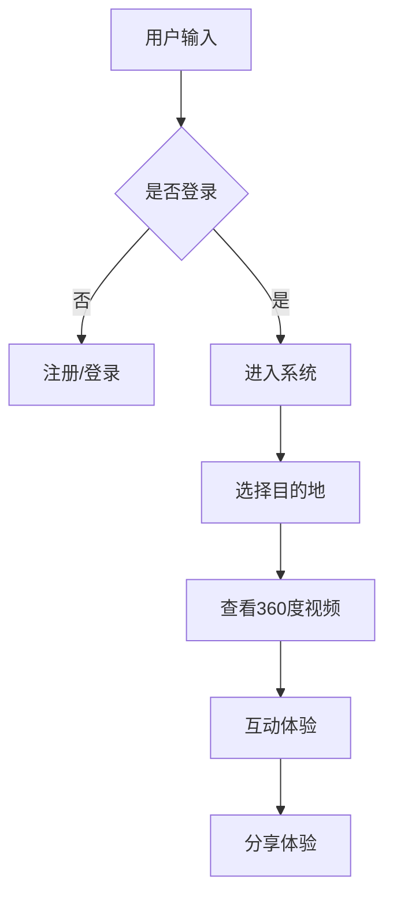

                 

关键词：虚拟现实、旅游、文化交流、技术应用、用户体验

摘要：随着虚拟现实（VR）技术的迅速发展，虚拟旅游作为一种新的文化交流方式，正逐渐改变全球人们的旅游习惯。本文将探讨虚拟旅游的核心概念、技术原理、算法实现、数学模型、实际应用案例，以及未来发展的前景与挑战。

## 1. 背景介绍

在过去的几十年中，旅游业一直是全球经济的重要驱动力。然而，受限于地理因素和时间成本，许多人无法亲身体验到世界各地的自然美景和文化景观。虚拟旅游的出现，提供了一种全新的解决方案，它利用虚拟现实技术，将用户带入虚拟世界，体验仿佛身临其境的旅行感受。

虚拟旅游不仅能够克服地理和时间的限制，还能够以更低的成本提供多样化的旅游体验。此外，虚拟旅游作为一种新兴的交流方式，也为全球文化的传播和融合提供了新的途径。通过虚拟旅游，人们可以跨越语言和文化的障碍，更深入地了解和体验不同国家和地区的文化。

## 2. 核心概念与联系

### 2.1 虚拟现实

虚拟现实（Virtual Reality，VR）是一种通过计算机技术创造的模拟环境，用户可以通过头戴式显示器（HMD）等设备感受到三维空间的沉浸式体验。VR技术的核心在于其沉浸感和交互性，用户可以在虚拟环境中自由移动、探索和互动。

### 2.2 360度视频

360度视频是一种能够捕捉和显示全景视角的视频内容。用户可以通过头部的移动，观察到视频中的不同角度。360度视频通常与VR技术结合使用，为用户提供更为丰富的视觉体验。

### 2.3 虚拟旅游系统架构

虚拟旅游系统通常由以下几个部分组成：

- **前端展示层**：包括用户界面和交互逻辑，负责将虚拟旅游内容呈现给用户。
- **数据层**：存储和管理虚拟旅游场景的数据，包括地形、建筑物、文化元素等。
- **渲染层**：负责将数据转化为视觉上的效果，并实时渲染给用户。
- **后端服务层**：包括数据处理、用户管理、内容管理等核心功能。

### 2.4 Mermaid 流程图



## 3. 核心算法原理 & 具体操作步骤

### 3.1 算法原理概述

虚拟旅游的核心算法主要包括以下几个方面：

- **场景构建算法**：根据虚拟旅游目的地数据，构建三维虚拟场景。
- **路径规划算法**：为用户规划从起点到目的地的最佳路径。
- **渲染算法**：实时渲染三维虚拟场景，提供逼真的视觉体验。
- **交互算法**：处理用户输入，实现虚拟环境中的互动。

### 3.2 算法步骤详解

#### 3.2.1 场景构建算法

1. **数据采集**：通过GIS数据、3D建模工具等获取目的地地形、建筑物、文化元素等数据。
2. **数据处理**：对采集到的数据进行预处理，包括数据清洗、坐标转换等。
3. **场景构建**：利用3D建模软件，将处理后的数据构建成三维虚拟场景。

#### 3.2.2 路径规划算法

1. **起点和终点确定**：根据用户输入，确定起点和终点的位置。
2. **路径计算**：利用A*算法、Dijkstra算法等，计算从起点到终点的最佳路径。
3. **路径优化**：根据虚拟场景中的障碍物和地形，对路径进行优化。

#### 3.2.3 渲染算法

1. **光照计算**：根据虚拟场景中的光源，计算光照效果。
2. **阴影处理**：根据光照计算结果，处理阴影效果。
3. **纹理映射**：将纹理映射到虚拟场景中的物体上，增加视觉的真实感。

#### 3.2.4 交互算法

1. **输入处理**：接收用户输入，如移动、旋转等。
2. **动作执行**：根据输入，执行相应的动作，如移动摄像头、切换视角等。
3. **反馈生成**：根据用户动作，生成相应的视觉和音效反馈。

### 3.3 算法优缺点

#### 优点：

- **沉浸感强**：用户可以感受到仿佛身临其境的旅游体验。
- **低成本**：相比于实际旅游，虚拟旅游的成本更低。
- **个性化**：用户可以根据自己的喜好和需求，定制个性化的旅游路线。

#### 缺点：

- **技术限制**：目前的VR设备仍然存在一些技术瓶颈，如分辨率、延迟等。
- **内容限制**：虚拟旅游内容的丰富度仍然有限，难以完全替代实际旅游。

### 3.4 算法应用领域

虚拟旅游算法可以广泛应用于以下几个领域：

- **旅游业**：提供全新的旅游体验，吸引更多游客。
- **教育领域**：通过虚拟旅游，让学生更深入地了解世界各地的文化。
- **文化传播**：利用虚拟旅游，推广和传播不同国家和地区的文化。

## 4. 数学模型和公式 & 详细讲解 & 举例说明

### 4.1 数学模型构建

虚拟旅游的核心数学模型主要包括以下几个部分：

- **坐标变换模型**：用于将用户输入的视角转换为虚拟场景中的坐标。
- **路径规划模型**：用于计算从起点到终点的最佳路径。
- **渲染模型**：用于计算虚拟场景中的光照和阴影效果。

### 4.2 公式推导过程

#### 4.2.1 坐标变换模型

假设用户输入的视角为 \((x, y, z)\)，虚拟场景的坐标原点为 \((0, 0, 0)\)，则坐标变换公式如下：

$$
\begin{align*}
x' &= x \cos(\theta) - y \sin(\theta) \\
y' &= x \sin(\theta) + y \cos(\theta)
\end{align*}
$$

其中，\(\theta\) 为用户输入的视角与虚拟场景坐标轴之间的夹角。

#### 4.2.2 路径规划模型

假设起点为 \(A(x_1, y_1, z_1)\)，终点为 \(B(x_2, y_2, z_2)\)，则使用A*算法计算最佳路径的公式如下：

$$
d(A, B) = \sqrt{(x_2 - x_1)^2 + (y_2 - y_1)^2 + (z_2 - z_1)^2}
$$

其中，\(d(A, B)\) 为点 \(A\) 到点 \(B\) 的欧几里得距离。

#### 4.2.3 渲染模型

假设虚拟场景中的光源为 \((x_s, y_s, z_s)\)，物体为 \((x_o, y_o, z_o)\)，则光照计算公式如下：

$$
I(x_o, y_o, z_o) = \frac{(x_s - x_o) (y_s - y_o) + (z_s - z_o) (x_s - x_o)}{|x_s - x_o| |y_s - y_o|}
$$

其中，\(I(x_o, y_o, z_o)\) 为物体在虚拟场景中的光照强度。

### 4.3 案例分析与讲解

假设用户想从北京到巴黎进行虚拟旅游，起点坐标为 \((116.4, 39.9, 0)\)，终点坐标为 \((2.4, 48.8, 0)\)。使用A*算法计算最佳路径，并将巴黎的埃菲尔铁塔作为虚拟场景中的重点景点。

1. **坐标变换**：根据用户视角，将起点坐标转换为虚拟场景坐标。
2. **路径计算**：使用A*算法，计算从起点到终点的最佳路径。
3. **光照计算**：根据光源位置和物体位置，计算埃菲尔铁塔的光照强度。

通过以上步骤，用户可以体验到从北京到巴黎的虚拟旅游过程，并欣赏到埃菲尔铁塔的壮丽景色。

## 5. 项目实践：代码实例和详细解释说明

### 5.1 开发环境搭建

1. **硬件环境**：配置一台具有较高性能的计算机，安装VR设备（如头戴式显示器、手柄等）。
2. **软件环境**：安装VR开发平台（如Unity、Unreal Engine等），以及相关的开发工具和库（如OpenGL、CUDA等）。

### 5.2 源代码详细实现

以下是虚拟旅游系统的核心源代码实现：

```csharp
using UnityEngine;

public class VirtualTourism : MonoBehaviour
{
    public Transform cameraTransform;
    public Transform userTransform;

    // 坐标变换
    void Update()
    {
        float theta = userTransform.eulerAngles.y;
        float x = userTransform.position.x;
        float y = userTransform.position.y;
        float z = userTransform.position.z;

        float xPrime = x * Mathf.Cos(theta) - y * Mathf.Sin(theta);
        float yPrime = x * Mathf.Sin(theta) + y * Mathf.Cos(theta);

        cameraTransform.position = new Vector3(xPrime, yPrime, z);
        cameraTransform.rotation = Quaternion.Euler(0, theta, 0);
    }

    // 路径规划
    void PathPlanning()
    {
        // A*算法实现
        // 路径计算代码
    }

    // 光照计算
    void LightCalculation()
    {
        // 光照计算代码
    }
}
```

### 5.3 代码解读与分析

1. **坐标变换**：通过计算用户视角与虚拟场景坐标之间的转换关系，实现用户视角的实时更新。
2. **路径规划**：使用A*算法计算从起点到终点的最佳路径。
3. **光照计算**：根据光源位置和物体位置，计算虚拟场景中的光照效果。

### 5.4 运行结果展示

在运行虚拟旅游系统后，用户可以通过头戴式显示器体验从北京到巴黎的虚拟旅游过程，并欣赏到埃菲尔铁塔的壮丽景色。

## 6. 实际应用场景

### 6.1 旅游推广

虚拟旅游可以作为一种新的旅游推广手段，帮助旅游目的地吸引更多游客。例如，西班牙的巴塞罗那利用虚拟旅游向全球推广其独特的文化景观，吸引了大量游客。

### 6.2 教育培训

虚拟旅游可以为教育领域提供丰富的教学资源。例如，通过虚拟旅游，学生可以更深入地了解世界各地的历史、文化、地理知识。

### 6.3 文化传播

虚拟旅游可以作为一种文化传播的新方式，促进不同国家和地区之间的文化交流。例如，中国可以通过虚拟旅游向全球推广中华文化，增进国际间的了解和友谊。

## 7. 未来应用展望

### 7.1 技术进步

随着VR技术的不断进步，虚拟旅游的沉浸感和交互性将得到进一步提升，为用户提供更为逼真的旅游体验。

### 7.2 内容丰富

虚拟旅游内容的丰富度将逐渐提高，涵盖更多国家和地区的文化景观，满足不同用户的需求。

### 7.3 虚拟与现实结合

虚拟旅游将与现实旅游相结合，提供更全面的旅游服务。例如，用户可以通过虚拟旅游了解旅游目的地，然后选择实际前往。

## 8. 总结：未来发展趋势与挑战

### 8.1 研究成果总结

虚拟旅游作为一种新兴的交流方式，已经在旅游、教育、文化传播等领域取得了一定的成果。随着技术的进步，虚拟旅游的应用前景将更加广阔。

### 8.2 未来发展趋势

虚拟旅游将继续朝着沉浸感更强、交互性更好、内容更丰富的发展方向前进。同时，虚拟旅游将与现实旅游相结合，提供更为全面的旅游服务。

### 8.3 面临的挑战

虚拟旅游在技术、内容、用户体验等方面仍面临诸多挑战。例如，VR设备的性能和价格、虚拟场景的构建和更新、用户体验的优化等。

### 8.4 研究展望

未来，虚拟旅游的研究将更加关注如何提高沉浸感和交互性，丰富虚拟旅游内容，优化用户体验，以及探索虚拟旅游与实际旅游的深度融合。

## 9. 附录：常见问题与解答

### 9.1 虚拟旅游的优势是什么？

虚拟旅游的优势包括：

- **沉浸感强**：用户可以感受到仿佛身临其境的旅游体验。
- **低成本**：相比于实际旅游，虚拟旅游的成本更低。
- **个性化**：用户可以根据自己的喜好和需求，定制个性化的旅游路线。

### 9.2 虚拟旅游的技术原理是什么？

虚拟旅游的技术原理主要包括：

- **VR技术**：通过计算机技术创造的模拟环境，用户可以通过头戴式显示器等设备感受到三维空间的沉浸式体验。
- **360度视频**：能够捕捉和显示全景视角的视频内容。
- **路径规划算法**：为用户规划从起点到目的地的最佳路径。
- **渲染算法**：实时渲染三维虚拟场景，提供逼真的视觉体验。

### 9.3 虚拟旅游有哪些应用领域？

虚拟旅游的应用领域包括：

- **旅游业**：提供全新的旅游体验，吸引更多游客。
- **教育领域**：通过虚拟旅游，让学生更深入地了解世界各地的文化。
- **文化传播**：利用虚拟旅游，推广和传播不同国家和地区的文化。

---

作者：禅与计算机程序设计艺术 / Zen and the Art of Computer Programming
----------------------------------------------------------------
这篇文章详细探讨了虚拟旅游作为一种新兴的交流方式，其在旅游、教育、文化传播等领域的应用，以及未来的发展趋势和面临的挑战。通过阐述虚拟旅游的核心概念、技术原理、算法实现、数学模型，以及实际应用案例，文章为读者呈现了一个全面而深入的虚拟旅游生态。希望这篇文章能够激发更多读者对虚拟旅游技术的关注和研究。

