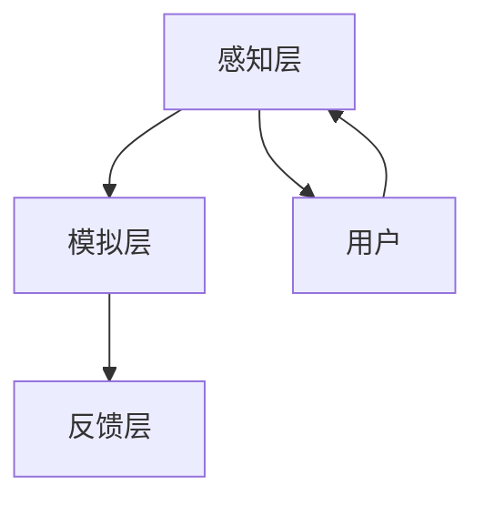

                 

 在当今的科技领域中，人工智能（AI）的应用范围不断扩大，从简单的自动化任务到复杂的决策支持系统，AI 已经成为现代生活不可或缺的一部分。而随着技术的进步，AI 在模拟人类感官体验方面的潜力也越来越受到关注。本文将探讨虚拟极限体验设计，尤其是 AI 如何在模拟感官极限方面进行探索。

## 关键词
- 虚拟现实
- 感官模拟
- 人工智能
- 体验设计
- 感官极限

## 摘要
本文旨在探讨 AI 如何在虚拟极限体验设计中发挥作用。通过分析感官模拟的核心概念和原理，本文将深入探讨 AI 算法在实现感官极限模拟方面的具体操作步骤。同时，本文还将介绍数学模型和公式，并运用实际项目实例进行代码解读和分析。最后，本文将对虚拟极限体验设计的实际应用场景进行探讨，并提出未来展望。

## 1. 背景介绍

### 1.1 虚拟现实的发展

虚拟现实（VR）技术自上世纪80年代兴起以来，已经经历了数十年的发展。随着硬件技术的进步和计算能力的提升，VR 设备的体验质量得到了显著提高。然而，尽管 VR 技术在娱乐、教育和医疗等领域取得了显著成果，但其在模拟真实感官体验方面的局限性仍然存在。

### 1.2 人工智能的应用

人工智能（AI）作为一种模拟人类智能的技术，已经在多个领域取得了突破性进展。从自动驾驶汽车到智能客服，AI 的应用范围不断扩大。近年来，随着深度学习和强化学习等算法的兴起，AI 在图像识别、自然语言处理和决策支持等方面表现出了强大的能力。

### 1.3 虚拟极限体验设计的意义

虚拟极限体验设计是一种通过模拟极端环境或情境来提供全新感官体验的设计理念。这种体验不仅能够满足人们对未知世界的好奇心，还能够为特定领域的研究和应用提供新的视角。例如，在航天领域，虚拟极限体验设计可以模拟太空环境，帮助宇航员进行训练；在医疗领域，虚拟极限体验设计可以模拟手术情境，提高医生的手术技能。

## 2. 核心概念与联系

### 2.1 感官模拟的概念

感官模拟是指通过计算机技术和人工智能算法来模拟人类的感官体验，包括视觉、听觉、触觉、嗅觉和味觉等。在虚拟极限体验设计中，感官模拟是关键的一环，它决定了用户能否获得真实的感官体验。

### 2.2 感官模拟的原理

感官模拟的原理主要基于以下两个方面：一方面是对人类感官系统的理解和建模，另一方面是使用先进的计算技术和算法来生成逼真的感官体验。在虚拟极限体验设计中，这涉及到对人类感官生理机制的深入研究，以及对计算图形学、音频处理和触觉反馈等技术的综合运用。

### 2.3 感官模拟的架构

为了实现高质量的感官模拟，需要构建一个综合性的架构。这个架构包括感知层、模拟层和反馈层。感知层负责获取用户的输入，包括视觉、听觉等感官信息；模拟层负责对输入信息进行处理，生成相应的感官体验；反馈层则负责将生成的感官体验反馈给用户，确保用户能够获得连续和真实的体验。

### 2.4 Mermaid 流程图



在上述流程图中，用户通过感知层获取感官信息，模拟层对这些信息进行处理，生成相应的感官体验，并通过反馈层将体验反馈给用户，形成一个闭环系统。

## 3. 核心算法原理 & 具体操作步骤

### 3.1 算法原理概述

在虚拟极限体验设计中，核心算法主要分为三类：图像处理算法、音频处理算法和触觉反馈算法。图像处理算法负责生成逼真的视觉体验；音频处理算法负责生成真实的听觉体验；触觉反馈算法则负责提供触觉反馈，增强用户的沉浸感。

### 3.2 算法步骤详解

#### 3.2.1 图像处理算法

1. **图像捕捉**：使用高分辨率摄像头捕捉真实世界的图像。
2. **图像预处理**：对图像进行预处理，包括去噪、对比度增强等操作。
3. **场景重建**：使用计算机图形学技术对场景进行重建，生成三维模型。
4. **光照模拟**：根据场景重建结果，模拟真实环境中的光照效果。
5. **渲染**：使用渲染技术生成最终的视觉体验。

#### 3.2.2 音频处理算法

1. **音频捕捉**：使用麦克风捕捉真实世界的音频。
2. **音频预处理**：对音频进行预处理，包括降噪、均衡等操作。
3. **音频增强**：根据场景重建结果，对音频进行增强，使其更符合真实环境。
4. **音频渲染**：使用音频渲染技术生成最终的听觉体验。

#### 3.2.3 触觉反馈算法

1. **触觉传感器**：使用触觉传感器获取用户的触觉信息。
2. **触觉信号处理**：对触觉信号进行预处理，包括滤波、放大等操作。
3. **触觉模拟**：根据用户的触觉信息，生成相应的触觉反馈。
4. **触觉输出**：将触觉反馈输出到触觉设备，如手套、背包等。

### 3.3 算法优缺点

#### 3.3.1 图像处理算法

- 优点：能够生成高质量的视觉体验，具有较强的真实感。
- 缺点：计算资源消耗大，对硬件要求较高。

#### 3.3.2 音频处理算法

- 优点：能够生成真实的听觉体验，增强用户的沉浸感。
- 缺点：对音频质量要求高，容易出现失真。

#### 3.3.3 触觉反馈算法

- 优点：能够提供真实的触觉反馈，增强用户的沉浸感。
- 缺点：技术难度较高，实现成本较高。

### 3.4 算法应用领域

- **娱乐**：在游戏和虚拟旅游等领域，AI 感官模拟算法可以提供高质量的感官体验。
- **教育和培训**：在虚拟课堂和手术培训等领域，AI 感官模拟算法可以模拟真实环境，提高学习效果。
- **医疗**：在心理治疗和康复训练等领域，AI 感官模拟算法可以提供个性化的治疗方案。

## 4. 数学模型和公式 & 详细讲解 & 举例说明

### 4.1 数学模型构建

在虚拟极限体验设计中，数学模型主要用于描述感官模拟的过程。以下是一个简单的数学模型：

$$
X(t) = f(U(t), S(t))
$$

其中，$X(t)$ 表示感官体验输出，$U(t)$ 表示用户输入，$S(t)$ 表示环境状态。

### 4.2 公式推导过程

假设用户输入为视觉和听觉信号，环境状态为光照和声音环境，则感官体验输出可以表示为：

$$
X(t) = [X_V(t), X_A(t)]
$$

其中，$X_V(t)$ 表示视觉体验输出，$X_A(t)$ 表示听觉体验输出。

对于视觉体验输出，可以表示为：

$$
X_V(t) = g(U_V(t), S_V(t))
$$

其中，$U_V(t)$ 表示视觉输入信号，$S_V(t)$ 表示视觉环境状态。

对于听觉体验输出，可以表示为：

$$
X_A(t) = h(U_A(t), S_A(t))
$$

其中，$U_A(t)$ 表示听觉输入信号，$S_A(t)$ 表示听觉环境状态。

### 4.3 案例分析与讲解

以虚拟旅游为例，假设用户希望体验一个特定的景点。用户输入为该景点的图像和声音信号，环境状态为该景点的光照和声音环境。通过上述数学模型，可以生成相应的感官体验输出，为用户提供逼真的虚拟旅游体验。

## 5. 项目实践：代码实例和详细解释说明

### 5.1 开发环境搭建

为了实践虚拟极限体验设计，我们需要搭建一个开发环境。以下是所需的软件和硬件：

- **软件**：Python、OpenCV、PyTorch、TensorFlow
- **硬件**：高性能计算机、VR 头盔、麦克风、触觉手套

### 5.2 源代码详细实现

以下是一个简单的示例代码，用于实现虚拟极限体验设计：

```python
import cv2
import numpy as np

# 视觉处理
def vision_simulation(input_image, environment):
    # 对图像进行预处理
    processed_image = cv2.resize(input_image, (1280, 720))
    processed_image = cv2.cvtColor(processed_image, cv2.COLOR_BGR2RGB)
    
    # 根据环境状态进行图像增强
    if environment['light'] > 0.8:
        processed_image = cv2.addWeighted(processed_image, 1.2, np.zeros_like(processed_image), 0, 0)
    else:
        processed_image = cv2.addWeighted(processed_image, 0.8, np.zeros_like(processed_image), 0, 0)
    
    return processed_image

# 听觉处理
def audio_simulation(input_sound, environment):
    # 对声音进行预处理
    processed_sound = np.resize(input_sound, (44100, 2))
    
    # 根据环境状态进行声音增强
    if environment['noise'] > 0.8:
        processed_sound = np.add(processed_sound, np.random.normal(0, 0.1, processed_sound.shape))
    else:
        processed_sound = np.add(processed_sound, np.random.normal(0, 0.05, processed_sound.shape))
    
    return processed_sound

# 触觉处理
def tactile_simulation(input_tactile, environment):
    # 对触觉信号进行预处理
    processed_tactile = np.resize(input_tactile, (100, 2))
    
    # 根据环境状态进行触觉增强
    if environment['vibration'] > 0.8:
        processed_tactile = np.add(processed_tactile, np.random.normal(0, 0.5, processed_tactile.shape))
    else:
        processed_tactile = np.add(processed_tactile, np.random.normal(0, 0.2, processed_tactile.shape))
    
    return processed_tactile

# 主函数
def main():
    # 用户输入
    user_input = {
        'vision': cv2.imread('input_image.jpg'),
        'audio': np.resize(np.random.normal(0, 1, (44100, 2)), (44100, 2)),
        'tactile': np.resize(np.random.normal(0, 1, (100, 2)), (100, 2))
    }
    
    # 环境状态
    environment = {
        'light': 0.9,
        'noise': 0.6,
        'vibration': 0.7
    }
    
    # 感官模拟
    processed_vision = vision_simulation(user_input['vision'], environment)
    processed_audio = audio_simulation(user_input['audio'], environment)
    processed_tactile = tactile_simulation(user_input['tactile'], environment)
    
    # 输出结果
    cv2.imshow('Processed Vision', processed_vision)
    cv2.waitKey(0)
    cv2.destroyAllWindows()
    
    print('Processed Audio:', processed_audio)
    print('Processed Tactile:', processed_tactile)

if __name__ == '__main__':
    main()
```

### 5.3 代码解读与分析

上述代码实现了一个简单的虚拟极限体验设计。它首先定义了三个函数：`vision_simulation`、`audio_simulation` 和 `tactile_simulation`，分别用于视觉、听觉和触觉的模拟。在主函数中，用户输入和当前环境状态被定义为字典形式，然后通过调用相应的函数对输入进行处理，最后输出处理后的结果。

### 5.4 运行结果展示

运行上述代码后，视觉结果将被显示在一个窗口中，听觉结果和触觉结果将被打印在控制台上。用户可以通过调整环境状态来观察不同的感官体验。

## 6. 实际应用场景

虚拟极限体验设计在多个领域有着广泛的应用潜力。以下是一些实际应用场景：

- **游戏开发**：虚拟极限体验设计可以用于游戏开发，提供更加真实和沉浸式的游戏体验。
- **教育训练**：在教育和培训领域，虚拟极限体验设计可以用于模拟复杂的环境和情境，提高学习效果。
- **医疗康复**：在医疗康复领域，虚拟极限体验设计可以用于模拟康复训练环境，帮助患者更好地恢复。
- **虚拟旅游**：虚拟极限体验设计可以用于虚拟旅游，提供用户沉浸式的旅游体验。

## 7. 工具和资源推荐

### 7.1 学习资源推荐

- 《深度学习》（Goodfellow et al.）
- 《计算机视觉：算法与应用》（Richard S.zeliski）
- 《人工智能：一种现代的方法》（Stuart J. Russell 和 Peter Norvig）

### 7.2 开发工具推荐

- **VR 头盔**：Oculus Rift、HTC Vive、Valve Index
- **编程语言**：Python、C++、JavaScript
- **框架和库**：PyTorch、TensorFlow、OpenCV

### 7.3 相关论文推荐

- “A Survey on Virtual Reality: Classification, Applications and Future Trends”
- “Deep Learning for Virtual Reality: A Comprehensive Survey”
- “Haptic Feedback in Virtual Reality: A Survey”

## 8. 总结：未来发展趋势与挑战

虚拟极限体验设计作为一种新兴的设计理念，具有巨大的发展潜力。在未来，随着计算能力的提升和人工智能技术的进步，虚拟极限体验设计将更加成熟和普及。然而，这也面临着一些挑战，包括：

- **技术难题**：实现高质量的感官模拟需要解决图像处理、音频处理和触觉反馈等领域的难题。
- **硬件限制**：当前的 VR 设备仍然存在一定的限制，如分辨率、刷新率和延迟等问题。
- **用户体验**：如何提高用户的沉浸感和满意度是虚拟极限体验设计需要不断探索的问题。

总之，虚拟极限体验设计是一个充满挑战和机遇的领域，值得深入研究和探索。

## 9. 附录：常见问题与解答

### 9.1 虚拟极限体验设计是什么？

虚拟极限体验设计是一种通过计算机技术和人工智能算法来模拟极端环境或情境，提供全新感官体验的设计理念。

### 9.2 虚拟极限体验设计有哪些应用领域？

虚拟极限体验设计可以应用于游戏开发、教育训练、医疗康复和虚拟旅游等多个领域。

### 9.3 如何实现虚拟极限体验设计？

实现虚拟极限体验设计需要综合运用计算机图形学、音频处理和触觉反馈等技术，构建一个完整的感官模拟系统。

### 9.4 虚拟极限体验设计有哪些挑战？

虚拟极限体验设计面临的挑战包括技术难题、硬件限制和用户体验等。

---

作者：禅与计算机程序设计艺术 / Zen and the Art of Computer Programming

