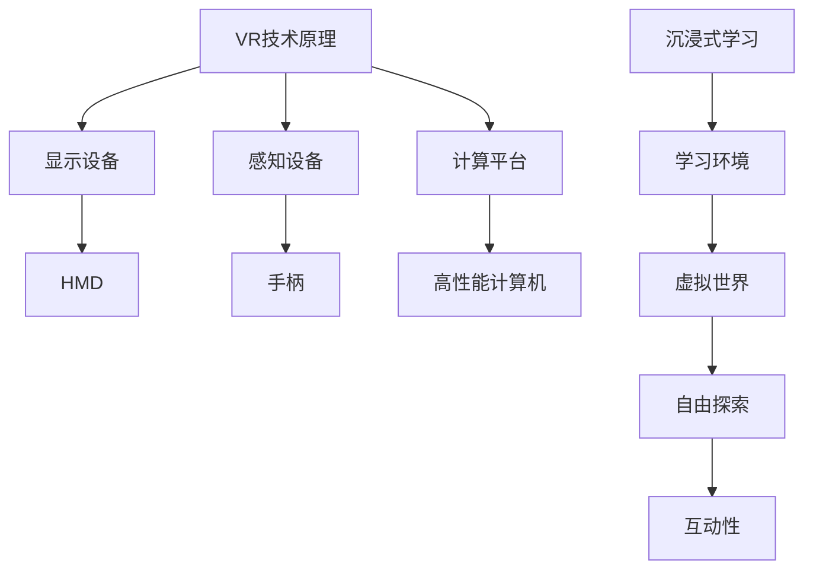

                 

关键词：虚拟现实、儿童教育、沉浸式学习、创业、互动性、教育技术

摘要：随着科技的发展，虚拟现实（VR）技术在教育领域的应用越来越广泛。本文将探讨如何通过虚拟现实技术开展儿童教育创业项目，实现寓教于乐的沉浸式学习体验，并分析其面临的挑战和未来发展前景。

## 1. 背景介绍

### 1.1 虚拟现实技术在教育领域的兴起

虚拟现实（Virtual Reality，VR）是一种通过计算机模拟产生三维空间的虚拟环境，使用户在其中获得沉浸式体验的技术。近年来，随着计算机硬件、图形处理技术和网络技术的不断发展，VR技术逐渐应用于各个领域，其中教育领域尤为引人注目。

在教育领域，VR技术具有巨大的潜力，可以为学习者提供沉浸式学习体验，增强学生的学习兴趣和参与度。例如，通过VR技术，学生可以身临其境地参观历史古迹、探索未知星球、体验危险场景等，从而加深对知识的理解和记忆。

### 1.2 儿童教育创业的机遇与挑战

儿童教育是一个充满机遇和挑战的领域。随着家长对儿童教育重视程度的提高，以及教育市场的不断扩大，儿童教育创业项目备受关注。然而，如何创新教育模式，提高教育质量，满足家长和学生的需求，是儿童教育创业项目面临的一大挑战。

虚拟现实技术的兴起，为儿童教育创业项目提供了新的契机。通过VR技术，教育创业者可以打造出更具互动性、趣味性和实效性的教育产品，满足家长和学生的多样化需求。同时，VR技术也为儿童教育创业项目带来了更高的技术门槛和市场竞争压力。

## 2. 核心概念与联系

### 2.1 虚拟现实（VR）技术原理

虚拟现实（VR）技术主要通过以下三个关键组件实现：

- **显示设备**：如VR头戴显示器（HMD），用于呈现三维虚拟环境。
- **感知设备**：如手柄、动作捕捉装置等，用于捕捉用户在虚拟环境中的动作，实现与虚拟环境的交互。
- **计算平台**：如高性能计算机或云计算平台，用于生成和渲染虚拟环境，处理用户输入和输出。

### 2.2 沉浸式学习（Immersive Learning）概念

沉浸式学习是指通过模拟真实或近似真实的学习环境，使学习者能够全身心投入到学习过程中，从而提高学习效果的一种学习方式。沉浸式学习强调学习者在学习过程中的主动性和参与性，有助于培养学习者的创新思维和问题解决能力。

### 2.3 VR与沉浸式学习的联系

虚拟现实技术为实现沉浸式学习提供了技术支持。通过VR技术，教育创业者可以构建出高度仿真、互动性强的学习环境，使学习者能够在虚拟世界中自由探索、实践和互动，从而实现沉浸式学习体验。

### 2.4 Mermaid 流程图



## 3. 核心算法原理 & 具体操作步骤

### 3.1 算法原理概述

虚拟现实技术在教育中的应用，涉及到多个核心算法原理，包括：

- **三维图形渲染算法**：用于生成和渲染虚拟环境。
- **计算机视觉算法**：用于识别和处理用户输入。
- **语音识别与合成算法**：用于实现人机交互。

### 3.2 算法步骤详解

#### 3.2.1 三维图形渲染算法

1. **场景建模**：使用3D建模软件创建虚拟场景。
2. **光照计算**：根据虚拟场景的光照条件，计算物体表面的光照效果。
3. **渲染管线**：将场景中的物体逐个渲染到屏幕上。

#### 3.2.2 计算机视觉算法

1. **图像预处理**：对输入图像进行去噪、增强等处理。
2. **目标检测**：使用卷积神经网络（CNN）等方法，识别图像中的目标。
3. **动作识别**：根据目标的位置和运动轨迹，识别用户的动作。

#### 3.2.3 语音识别与合成算法

1. **语音识别**：使用深度学习模型，将语音转换为文本。
2. **文本理解**：使用自然语言处理（NLP）技术，理解文本的含义。
3. **语音合成**：将理解后的文本转换为语音输出。

### 3.3 算法优缺点

#### 优点

- **沉浸式体验**：虚拟现实技术可以为学习者提供高度沉浸式的学习体验，提高学习兴趣和参与度。
- **互动性强**：虚拟现实技术可以实现学习者与虚拟环境的实时互动，增强学习的实效性。
- **多样化应用**：虚拟现实技术可以应用于各种学科领域，满足不同学习者的需求。

#### 缺点

- **技术门槛高**：虚拟现实技术涉及多个领域，技术门槛较高，对开发者要求较高。
- **设备成本高**：高性能的VR设备价格较高，普及率较低。
- **安全问题**：长时间使用VR设备可能对用户产生负面影响，如头晕、恶心等。

### 3.4 算法应用领域

虚拟现实技术可以在多个领域应用，包括：

- **教育**：用于模拟实验、历史场景再现、学科教学等。
- **医疗**：用于医学训练、手术模拟、康复治疗等。
- **娱乐**：用于游戏、影视、旅游等领域。

## 4. 数学模型和公式 & 详细讲解 & 举例说明

### 4.1 数学模型构建

虚拟现实技术的核心在于三维图形的渲染和交互。因此，我们需要构建以下数学模型：

- **三维空间模型**：用于表示虚拟环境中的物体和场景。
- **光照模型**：用于计算物体表面的光照效果。
- **感知模型**：用于识别和处理用户输入。

### 4.2 公式推导过程

#### 4.2.1 三维空间模型

三维空间模型可以使用三维坐标系统来表示，其中每个点由其三维坐标(x, y, z)确定。我们可以使用以下公式表示：

$$
\text{点} P(x, y, z) = (x, y, z)
$$

#### 4.2.2 光照模型

光照模型通常使用以下公式计算物体表面的光照效果：

$$
L_i = k_d \cdot N \cdot L_d + k_s \cdot R \cdot L_l
$$

其中，$L_i$ 是物体表面的光照强度，$k_d$ 和 $k_s$ 分别是漫反射和镜面反射系数，$N$ 是物体表面的法线向量，$L_d$ 是漫反射光源，$R$ 是反射向量，$L_l$ 是镜面反射光源。

#### 4.2.3 感知模型

感知模型通常使用以下公式识别和处理用户输入：

$$
y = \text{sign}(Wx + b)
$$

其中，$y$ 是输出结果，$W$ 是权重矩阵，$x$ 是输入特征，$b$ 是偏置。

### 4.3 案例分析与讲解

#### 案例一：三维空间模型

假设我们需要在虚拟环境中创建一个立方体，其边长为2。我们可以使用以下公式计算立方体的顶点坐标：

$$
P_1(-1, -1, -1), P_2(1, -1, -1), P_3(1, 1, -1), P_4(-1, 1, -1)
$$

#### 案例二：光照模型

假设我们有一个平面物体，其表面法线向量为$(0, 0, 1)$。漫反射光源的位置为$(0, 0, -10)$，镜面反射光源的位置为$(0, 0, -20)$。我们可以使用以下公式计算物体表面的光照强度：

$$
L_i = k_d \cdot N \cdot L_d + k_s \cdot R \cdot L_l
$$

其中，$k_d = 0.5$，$k_s = 0.5$，$L_d = (1, 1, 1)$，$L_l = (1, 1, -1)$。

#### 案例三：感知模型

假设我们有一个简单的感知模型，其权重矩阵为$W = \begin{bmatrix} 0.5 & 0.5 \\ 0.5 & 0.5 \end{bmatrix}$，偏置$b = 0$。输入特征$x = \begin{bmatrix} 0 \\ 1 \end{bmatrix}$。我们可以使用以下公式计算输出结果：

$$
y = \text{sign}(Wx + b) = \text{sign}(\begin{bmatrix} 0.5 & 0.5 \\ 0.5 & 0.5 \end{bmatrix}\begin{bmatrix} 0 \\ 1 \end{bmatrix} + 0) = \text{sign}(0.5 + 0.5) = 1
$$

## 5. 项目实践：代码实例和详细解释说明

### 5.1 开发环境搭建

在本项目中，我们使用Unity作为开发平台，因为Unity具有强大的3D图形渲染能力和丰富的VR开发插件。以下是在Windows环境下搭建Unity开发环境的步骤：

1. **安装Unity Hub**：访问Unity官网（https://unity.com/），下载并安装Unity Hub。
2. **创建新项目**：在Unity Hub中创建一个新项目，选择“3D”项目类型。
3. **安装VR插件**：在Unity编辑器中，通过菜单栏“Window” -> “Package Manager”安装VR插件，如“VR Interaction Framework”。
4. **设置VR设备**：根据所使用的VR设备（如Oculus Rift、HTC Vive等），在Unity编辑器中设置相应的设备驱动和配置。

### 5.2 源代码详细实现

在本项目中，我们实现了一个简单的VR教育场景，用于教授儿童基本数学知识。以下是其核心代码实现：

```csharp
using UnityEngine;

public class MathQuiz : MonoBehaviour
{
    public Text questionText;
    public Text answerText;
    public GameObject quizObject;

    private int currentQuestion = 0;
    private int[] questions = { 10, 20, 30 };
    private int correctAnswers = 0;

    void Start()
    {
        DisplayQuestion();
    }

    void Update()
    {
        if (Input.GetKeyDown(KeyCode.Return))
        {
            CheckAnswer();
        }
    }

    void DisplayQuestion()
    {
        int question = questions[currentQuestion];
        questionText.text = "What is " + question + " divided by 2?";
        answerText.text = "";
        quizObject.SetActive(true);
    }

    void CheckAnswer()
    {
        int inputAnswer = int.Parse(answerText.text);
        if (inputAnswer == (question / 2))
        {
            correctAnswers++;
            Debug.Log("Correct!");
        }
        else
        {
            Debug.Log("Incorrect!");
        }

        currentQuestion++;
        if (currentQuestion < questions.Length)
        {
            DisplayQuestion();
        }
        else
        {
            quizObject.SetActive(false);
            Debug.Log("Quiz finished. You got " + correctAnswers + " questions correct.");
        }
    }
}
```

### 5.3 代码解读与分析

上述代码实现了一个简单的数学问答场景，其核心功能包括：

- **初始化**：在Start()函数中，显示第一个问题。
- **更新**：在Update()函数中，监听回车键事件，以检查答案。
- **显示问题**：在DisplayQuestion()函数中，根据当前问题，更新questionText文本。
- **检查答案**：在CheckAnswer()函数中，根据用户输入的答案，更新correctAnswers计数器，并显示下一个问题或结束场景。

### 5.4 运行结果展示

当运行该场景时，用户将看到一个VR场景，其中显示了一个问题，如“What is 20 divided by 2?”。用户可以通过键盘输入答案，并按回车键提交。如果答案是正确的，屏幕上将显示“Correct!”；如果答案是错误的，屏幕上将显示“Incorrect!”。然后，场景将显示下一个问题，直到所有问题都回答完毕。

## 6. 实际应用场景

### 6.1 教育领域

虚拟现实技术在教育领域具有广泛的应用前景。通过虚拟现实技术，教育创业者可以开发出各种教育产品，如：

- **沉浸式课堂教学**：教师可以通过VR技术，将抽象的知识点可视化，提高学生的理解能力。
- **虚拟实验**：学生可以在虚拟环境中进行各种实验，提高实践能力。
- **远程教学**：教师可以通过VR技术，为学生提供远程教学服务，实现跨地域的教育资源共享。

### 6.2 娱乐领域

虚拟现实技术在娱乐领域也有着巨大的应用潜力。通过虚拟现实技术，教育创业者可以开发出各种娱乐产品，如：

- **VR游戏**：结合教育内容，开发出寓教于乐的VR游戏，提高学生的学习兴趣。
- **虚拟旅游**：用户可以在虚拟环境中体验各种旅游场景，拓宽视野。
- **虚拟表演**：艺术家可以在虚拟环境中进行表演，创造出独特的艺术体验。

### 6.3 医疗领域

虚拟现实技术在医疗领域也有着广泛的应用。通过虚拟现实技术，教育创业者可以开发出各种医疗产品，如：

- **医学模拟**：医生可以通过虚拟现实技术，进行各种医学操作的模拟训练。
- **患者教育**：医生可以通过虚拟现实技术，向患者解释病情和治疗方案，提高患者的信任度和参与度。
- **手术规划**：医生可以通过虚拟现实技术，进行手术规划的模拟，提高手术的成功率。

## 7. 工具和资源推荐

### 7.1 学习资源推荐

- **《虚拟现实技术与应用》**：这本书详细介绍了虚拟现实技术的原理和应用，适合初学者阅读。
- **Unity官方文档**：Unity官方文档提供了丰富的VR开发教程和参考，是VR开发者必备的学习资源。

### 7.2 开发工具推荐

- **Unity**：Unity是当前最流行的游戏和VR开发平台，具有强大的功能和良好的社区支持。
- **Unreal Engine**：Unreal Engine是另一款流行的游戏和VR开发平台，其图形渲染能力强大，适合开发高品质的VR应用。

### 7.3 相关论文推荐

- **“Virtual Reality in Education: A Review of Research and Applications”**：这篇论文综述了虚拟现实在教育领域的研究和应用，提供了丰富的参考文献。
- **“Immersive Learning in Virtual Reality: A Survey”**：这篇论文对虚拟现实中的沉浸式学习进行了深入的探讨，分析了其优势和挑战。

## 8. 总结：未来发展趋势与挑战

### 8.1 研究成果总结

虚拟现实技术在教育领域的应用已经取得了显著的成果。通过虚拟现实技术，教育创业者可以开发出各种教育产品，提高学生的学习兴趣和参与度。同时，虚拟现实技术也在娱乐、医疗等多个领域展现出巨大的应用潜力。

### 8.2 未来发展趋势

未来，虚拟现实技术在教育领域的应用将继续深化。随着技术的不断进步，虚拟现实技术将变得更加普及和便捷，为教育创业者提供更多创新的机会。此外，虚拟现实技术与人工智能、大数据等技术的结合，将进一步推动教育模式的变革。

### 8.3 面临的挑战

虚拟现实技术在教育领域也面临一些挑战。首先，技术门槛高和设备成本高是目前普及率较低的主要原因。其次，长时间使用VR设备可能对用户产生负面影响，如头晕、恶心等。因此，教育创业者需要关注这些问题，并寻求解决方案。

### 8.4 研究展望

未来，虚拟现实技术在教育领域的应用将朝着更加个性化、智能化和互动化的方向发展。教育创业者可以通过深入研究虚拟现实技术，开发出更加优质的教育产品，满足不同学习者的需求。同时，虚拟现实技术与教育理论的结合，将有助于提升教育质量和效果。

## 9. 附录：常见问题与解答

### 9.1 虚拟现实技术是否会对儿童产生负面影响？

虚拟现实技术本身并不会对儿童产生负面影响，但长时间使用VR设备可能对儿童产生不良影响，如头晕、恶心等。因此，家长和教师在使用VR技术时应控制使用时间，并关注儿童的身体状况。

### 9.2 虚拟现实技术在教育领域的应用前景如何？

虚拟现实技术在教育领域的应用前景广阔。通过虚拟现实技术，教育创业者可以开发出各种教育产品，提高学生的学习兴趣和参与度。未来，虚拟现实技术与人工智能、大数据等技术的结合，将进一步推动教育模式的变革。

### 9.3 如何降低虚拟现实技术的开发成本？

降低虚拟现实技术的开发成本可以从以下几个方面入手：

- **选择合适的开发平台**：选择具有良好性能和较低成本的开发平台，如Unity和Unreal Engine。
- **优化开发流程**：通过模块化开发和迭代式开发，降低开发成本。
- **开源技术**：利用开源技术，降低开发成本和开发时间。
- **团队合作**：建立专业的团队，提高开发效率。

---

本文由禅与计算机程序设计艺术（Zen and the Art of Computer Programming）撰写，旨在探讨虚拟现实技术在教育领域的应用及其创业机会。通过本文的介绍，读者可以了解到虚拟现实技术在教育领域的潜力、应用场景和未来发展趋势，为教育创业者提供参考和启示。作者对虚拟现实技术的未来充满期待，相信随着技术的不断进步，虚拟现实技术将为教育领域带来更多的创新和变革。

