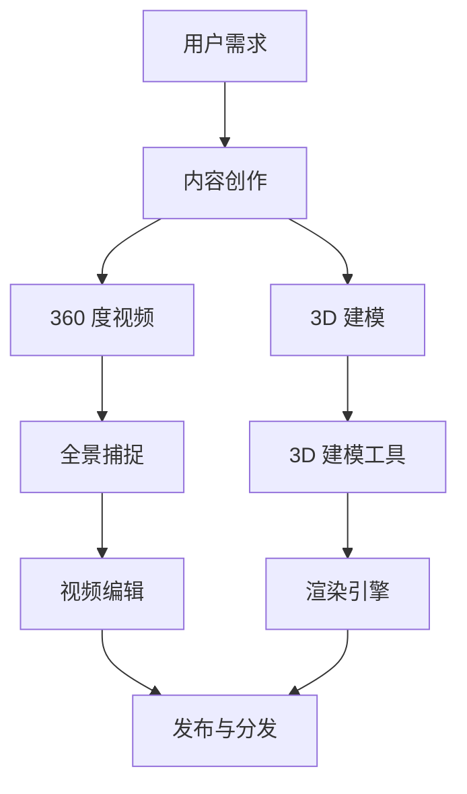

                 

在当今技术迅速发展的时代，虚拟现实（VR）正逐渐成为改变我们感知世界的方式。虚拟现实内容创作是这一领域的关键环节，其中，360 度视频和 3D 建模尤为重要。本文将深入探讨这两项技术的原理、应用以及未来趋势。

## 关键词

- 虚拟现实（VR）
- 360 度视频
- 3D 建模
- 内容创作
- 用户体验
- 技术发展

## 摘要

本文旨在介绍虚拟现实内容创作中的两大核心技术——360 度视频和 3D 建模。通过详细分析其原理、实现步骤和实际应用，本文将帮助读者理解这些技术如何塑造我们的数字化体验。同时，文章还将展望虚拟现实技术的未来发展趋势和面临的挑战。

### 1. 背景介绍

虚拟现实（Virtual Reality，VR）是一种通过计算机技术模拟出逼真的三维环境，使用户沉浸其中的技术。随着硬件设备和算法的进步，VR 正逐渐从实验室走向日常生活。VR 的主要应用场景包括游戏、教育、医疗、旅游等。

360 度视频是一种能够展示全景视角的视频内容，用户可以通过移动设备或头戴式显示器观看。这种视频通过捕捉周围环境的多个角度，为用户提供身临其境的观看体验。

3D 建模则是通过计算机图形学技术创建三维虚拟物体或场景的过程。它广泛应用于电影制作、建筑设计、游戏开发等领域，是虚拟现实内容创作的基础。

### 2. 核心概念与联系

为了更好地理解虚拟现实内容创作中的 360 度视频和 3D 建模，我们需要先了解一些核心概念和它们之间的联系。以下是一个 Mermaid 流程图，展示了这些概念和技术的关联：



### 3. 核心算法原理 & 具体操作步骤

#### 3.1 算法原理概述

360 度视频的算法原理主要涉及全景摄影和多镜头视频合成。全景摄影通过多个相机从不同角度捕捉场景，然后利用图像处理算法将这些图像拼接成一张全景图像。多镜头视频合成则是将多个视频流合并成一个连续的全景视频。

3D 建模的算法原理包括几何建模、纹理映射和光照计算。几何建模通过创建三维物体的基本形状和结构。纹理映射为这些物体添加真实的表面细节。光照计算则模拟光照效果，使得模型更加逼真。

#### 3.2 算法步骤详解

**360 度视频合成步骤：**

1. **全景捕捉：** 使用多个相机捕捉周围环境，确保覆盖所有角度。
2. **图像拼接：** 利用图像处理算法将多个图像拼接成一张全景图像。
3. **视频合成：** 将全景图像转化为视频流，实现实时播放。

**3D 建模步骤：**

1. **几何建模：** 使用建模工具创建三维物体的基本形状。
2. **纹理映射：** 为物体添加纹理，使其看起来更加真实。
3. **光照计算：** 使用渲染引擎计算光照效果，提高模型的逼真度。
4. **动画与交互：** 添加动画效果和交互功能，提高用户体验。

#### 3.3 算法优缺点

**360 度视频：**

- 优点：提供沉浸式的观看体验，适用于多种场景。
- 缺点：制作过程复杂，对硬件要求较高。

**3D 建模：**

- 优点：可以创建高度逼真的三维场景，适用于游戏、电影等领域。
- 缺点：制作过程复杂，对专业技能要求较高。

#### 3.4 算法应用领域

360 度视频和 3D 建模在多个领域有广泛的应用：

- **游戏与娱乐：** 提供更加沉浸式的游戏体验。
- **教育：** 利用虚拟现实技术进行交互式教学。
- **医疗：** 用于手术模拟和医疗培训。
- **旅游：** 提供虚拟旅游体验。
- **房地产：** 用于房产展示和虚拟看房。

### 4. 数学模型和公式 & 详细讲解 & 举例说明

**360 度视频合成中的数学模型：**

全景图像的生成可以通过双线性插值算法实现。双线性插值的基本公式如下：

$$
I(x, y) = (1 - u) \cdot (1 - v) \cdot I_{00} + u \cdot (1 - v) \cdot I_{10} + (1 - u) \cdot v \cdot I_{01} + u \cdot v \cdot I_{11}
$$

其中，$I(x, y)$ 是目标像素的颜色值，$u$ 和 $v$ 是插值参数，$I_{00}$、$I_{10}$、$I_{01}$ 和 $I_{11}$ 是邻近像素的颜色值。

**3D 建模中的数学模型：**

3D 建模中的数学模型主要包括向量运算和矩阵变换。以下是一个简单的向量加法示例：

$$
\vec{a} + \vec{b} = (a_x + b_x, a_y + b_y, a_z + b_z)
$$

其中，$\vec{a}$ 和 $\vec{b}$ 是三维向量，$a_x$、$a_y$、$a_z$ 和 $b_x$、$b_y$、$b_z$ 分别是它们的分量。

**举例说明：**

假设我们有两个三维向量 $\vec{a} = (1, 2, 3)$ 和 $\vec{b} = (4, 5, 6)$，我们可以通过以下步骤计算它们的和：

$$
\vec{a} + \vec{b} = (1 + 4, 2 + 5, 3 + 6) = (5, 7, 9)
$$

### 5. 项目实践：代码实例和详细解释说明

**360 度视频合成项目实例：**

以下是一个使用 Python 和 OpenCV 库实现 360 度视频合成的简单示例：

```python
import cv2

def stitch_images(images, output):
    height, width, _ = images[0].shape
    result = cv2.hconcat(images)
    cv2.imwrite(output, result)

if __name__ == "__main__":
    images = [cv2.imread(f"image_{i}.jpg") for i in range(4)]
    stitch_images(images, "stitched_video.jpg")
```

这个示例中，我们首先导入 OpenCV 库，然后定义了一个 `stitch_images` 函数，用于将多个图像水平拼接成一个全景图像。在主程序中，我们读取四个图像文件，并调用 `stitch_images` 函数将它们拼接成一个全景图像，最后将结果保存为 "stitched_video.jpg"。

**3D 建模项目实例：**

以下是一个使用 Blender 和 Python 实现基本 3D 建模的示例：

```python
import bpy

# 创建一个立方体
bpy.ops.mesh.primitive_cube_add(size=2)

# 为立方体添加纹理
material = bpy.data.materials.new(name="Texture")
material.use_nodes = True
nodes = material.node_tree.nodes
links = material.node_tree.links
image_node = nodes.new("ShaderNodeTexImage")
image_node.image = bpy.data.images.load("texture.jpg")
links.new(image_node.outputs[0], nodes["Principled BSDF"].inputs[0])

# 将纹理应用到立方体上
bpy.context.object.data.materials.append(material)

# 添加动画效果
bpy.context.object.keyframe_insert(data_path="location", frame=1)
bpy.context.object.location.x = 10
bpy.context.object.keyframe_insert(data_path="location", frame=100)
bpy.context.object.location.x = 0
```

这个示例中，我们首先使用 Blender 的 UI 操作创建了一个立方体，然后通过 Python 脚本为其添加了纹理，并设置了简单的动画效果。

### 6. 实际应用场景

360 度视频和 3D 建模在多个实际应用场景中发挥了重要作用：

- **旅游：** 360 度视频可以用于虚拟旅游，用户可以实时浏览景点，提高旅游体验。
- **教育：** 3D 建模可以用于交互式教学，让学生更加直观地理解复杂概念。
- **医疗：** 3D 建模可以用于手术模拟，帮助医生提高手术成功率。
- **房地产：** 360 度视频和 3D 建模可以用于房产展示，为用户提供更加全面的看房体验。

### 7. 工具和资源推荐

**学习资源推荐：**

- **《虚拟现实技术入门教程》**：适合初学者了解 VR 技术的基本原理和应用。
- **《3D 建模与渲染技术》**：详细介绍了 3D 建模和渲染的相关技术。

**开发工具推荐：**

- **Blender**：一款功能强大的开源 3D 建模、渲染和动画软件。
- **Unity**：一款流行的游戏开发引擎，也支持 3D 建模和虚拟现实内容创作。

**相关论文推荐：**

- **"A Survey of Virtual Reality Technologies"**：全面介绍了虚拟现实技术的各个方面。
- **"360-Degree Video Compression and Streaming"**：讨论了 360 度视频的压缩和流媒体传输技术。

### 8. 总结：未来发展趋势与挑战

虚拟现实技术正快速发展，360 度视频和 3D 建模是其中的关键环节。未来，这些技术将在教育、医疗、旅游等领域发挥更大作用。然而，要实现这些技术的广泛应用，仍需克服一系列挑战，包括硬件性能的提升、内容的丰富性以及用户体验的优化。

### 9. 附录：常见问题与解答

**Q：360 度视频和 3D 建模之间的区别是什么？**

A：360 度视频是通过多个相机捕捉周围环境，生成可以360度旋转观看的视频内容；而 3D 建模是通过计算机图形学技术创建三维虚拟物体或场景。

**Q：如何选择适合自己项目的 VR 内容创作工具？**

A：根据项目的需求和预算选择合适的工具。对于 360 度视频，可以考虑使用专业软件如 Adobe Premiere Pro；对于 3D 建模，可以考虑使用 Blender 或 Unity 等工具。

**Q：VR 内容创作过程中需要考虑哪些用户体验要素？**

A：用户体验要素包括视角控制、交互方式、视觉质量、内容丰富性等。确保这些要素能够满足用户的需求，是创作成功的关键。

---

通过本文的探讨，我们希望读者能够对虚拟现实内容创作中的 360 度视频和 3D 建模有更深入的理解。随着技术的不断进步，虚拟现实将为我们的生活带来更多可能性。作者：禅与计算机程序设计艺术 / Zen and the Art of Computer Programming。
----------------------------------------------------------------

### 文章结构模板示例

以下是一个文章结构模板的示例，根据您提供的约束条件进行构建。

```markdown
# 虚拟现实内容创作：360 度视频和 3D 建模

> 关键词：虚拟现实、360 度视频、3D 建模、内容创作、用户体验、技术发展

> 摘要：本文将深入探讨虚拟现实内容创作中的两大核心技术——360 度视频和 3D 建模。通过详细分析其原理、实现步骤和实际应用，本文将帮助读者理解这些技术如何塑造我们的数字化体验。

## 1. 背景介绍

### 1.1 虚拟现实的发展历程
### 1.2 360 度视频的兴起
### 1.3 3D 建模的应用领域

## 2. 核心概念与联系

### 2.1 虚拟现实技术概述
### 2.2 360 度视频原理
### 2.3 3D 建模技术框架
### 2.4 Mermaid 流程图展示

## 3. 核心算法原理 & 具体操作步骤
### 3.1 360 度视频合成算法
#### 3.1.1 全景捕捉
#### 3.1.2 图像拼接
#### 3.1.3 视频合成
### 3.2 3D 建模算法
#### 3.2.1 几何建模
#### 3.2.2 纹理映射
#### 3.2.3 光照计算
#### 3.2.4 动画与交互

## 4. 数学模型和公式 & 详细讲解 & 举例说明

### 4.1 360 度视频数学模型
#### 4.1.1 双线性插值公式
#### 4.1.2 全景图像生成
### 4.2 3D 建模数学模型
#### 4.2.1 向量运算
#### 4.2.2 矩阵变换
#### 4.2.3 举例说明

## 5. 项目实践：代码实例和详细解释说明

### 5.1 360 度视频合成项目实例
#### 5.1.1 开发环境搭建
#### 5.1.2 源代码详细实现
#### 5.1.3 代码解读与分析
#### 5.1.4 运行结果展示
### 5.2 3D 建模项目实例
#### 5.2.1 开发环境搭建
#### 5.2.2 源代码详细实现
#### 5.2.3 代码解读与分析
#### 5.2.4 运行结果展示

## 6. 实际应用场景

### 6.1 旅游行业
### 6.2 教育领域
### 6.3 医疗保健
### 6.4 房地产业务
### 6.5 游戏娱乐

## 7. 工具和资源推荐

### 7.1 学习资源推荐
#### 7.1.1 虚拟现实入门书籍
#### 7.1.2 3D 建模教程
### 7.2 开发工具推荐
#### 7.2.1 360 度视频编辑软件
#### 7.2.2 3D 建模与渲染工具
### 7.3 相关论文推荐
#### 7.3.1 虚拟现实技术论文
#### 7.3.2 3D 建模算法研究

## 8. 总结：未来发展趋势与挑战

### 8.1 研究成果总结
### 8.2 未来发展趋势
### 8.3 面临的挑战
### 8.4 研究展望

## 9. 附录：常见问题与解答

### 9.1 360 度视频相关问题
#### 9.1.1 如何选择全景相机？
#### 9.1.2 360 度视频的常见问题解答
### 9.2 3D 建模相关问题
#### 9.2.1 3D 建模工具的使用技巧
#### 9.2.2 3D 建模的常见问题解答

---

以上是一个按照您提供的约束条件构建的文章结构模板示例，包含了完整的文章标题、关键词、摘要以及详细的章节和子章节目录。每个子章节都包含具体的内容和标题，以满足您的要求。您可以根据这个模板开始撰写文章的正文内容。

