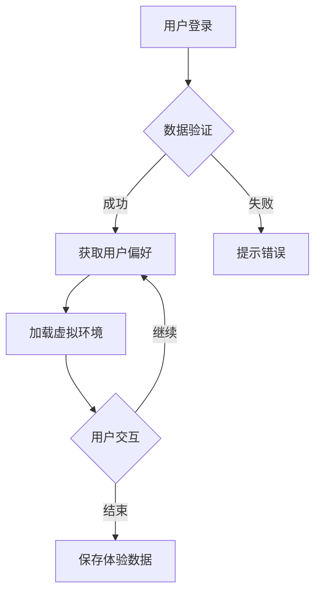

                 

关键词：虚拟现实、文化交融、跨文化体验、创业、平台开发、技术实现、用户互动

摘要：本文探讨了虚拟现实技术在文化交融领域中的应用，并提出了一种旨在促进跨文化理解的虚拟现实体验平台。本文详细阐述了平台的核心概念、技术架构、算法原理、数学模型、项目实践和实际应用场景，同时展望了未来的发展趋势与挑战。

## 1. 背景介绍

在全球化日益深入的今天，不同文化之间的交融与碰撞成为不可忽视的现象。随着互联网和虚拟现实技术的迅猛发展，虚拟现实（VR）作为一种新兴的交互技术，为人们提供了前所未有的沉浸式体验。虚拟现实不仅改变了人们的娱乐方式，还在教育、医疗、设计等多个领域显示出巨大的潜力。特别是在文化交融领域，VR技术可以为人们提供跨文化的沉浸式体验，促进不同文化之间的理解与尊重。

近年来，虚拟现实技术已经在文化展示、博物馆展览、主题公园等领域得到了广泛应用。然而，如何将这些技术整合到一个统一的平台中，为用户提供丰富多样的跨文化体验，仍是一个亟待解决的问题。本文旨在探讨这一问题，并提出一种以促进理解为核心的虚拟现实体验平台。

### 1.1 虚拟现实技术的应用现状

虚拟现实技术自20世纪90年代开始逐步发展，经历了从初期的高成本、低实用性到如今逐渐成熟和普及的过程。目前，虚拟现实技术在多个领域都取得了显著的进展：

- **娱乐与游戏**：VR游戏和体验中心为用户提供了沉浸式的娱乐体验，例如《节奏光剑》（Beat Saber）等热门游戏。
- **教育与培训**：VR技术在教育领域被广泛应用于模拟实验、历史场景再现、职业培训等方面，例如虚拟化学实验室、历史场景还原等。
- **医疗与康复**：虚拟现实技术在医疗康复中的应用日益广泛，如心理治疗、康复训练等。
- **建筑设计**：VR技术为建筑设计师提供了虚拟现实模型，使设计过程更加直观和高效。
- **文化展示**：虚拟现实技术被用于博物馆、文化遗产的保护与展示，如《秦始皇兵马俑虚拟博物馆》等。

### 1.2 跨文化体验的重要性

跨文化体验不仅有助于增进不同文化之间的相互理解，还能够促进全球范围内的文化交流与合作。在全球化的背景下，跨文化理解的重要性日益凸显：

- **文化多样性**：跨文化体验能够帮助人们更好地认识和尊重文化多样性，避免文化冲突。
- **文化交流**：跨文化体验可以促进不同文化之间的交流和合作，为全球化提供新的动力。
- **教育意义**：通过跨文化体验，教育工作者可以更好地向学生传授世界各地的文化知识，培养全球公民意识。

### 1.3 创业的机遇与挑战

虚拟现实技术在文化交融领域的应用为创业者提供了广阔的机遇。然而，创业者在开发跨文化体验平台时也面临着诸多挑战：

- **技术门槛**：虚拟现实技术的开发需要较高的技术门槛，包括图像处理、3D建模、人机交互等方面的专业知识。
- **用户需求**：准确把握用户需求对于平台的成功至关重要，需要深入了解不同文化背景用户的需求和偏好。
- **内容创作**：丰富的文化内容是平台的核心竞争力，需要投入大量资源进行文化内容的创作和整合。
- **商业模式**：如何实现平台的盈利模式是创业者需要认真考虑的问题，包括广告、会员制、内容付费等多种途径。

### 1.4 本文的目的与结构

本文旨在探讨虚拟现实技术在文化交融领域的应用，提出一种促进理解的跨文化体验平台。文章将分为以下几个部分：

- **核心概念与联系**：介绍平台的核心概念及其在文化交融中的应用。
- **核心算法原理**：阐述平台的核心算法原理及其实现步骤。
- **数学模型与公式**：构建平台的数学模型并推导相关公式。
- **项目实践**：通过实际项目实例展示平台开发的全过程。
- **实际应用场景**：分析平台的实际应用场景及未来发展趋势。
- **总结与展望**：总结研究成果，展望未来的发展方向与挑战。

## 2. 核心概念与联系

为了构建一个有效的虚拟现实跨文化体验平台，我们首先需要明确平台的核心概念和其相互之间的关系。以下是平台的核心概念及其在文化交融中的具体应用。

### 2.1 虚拟现实跨文化体验平台的核心概念

#### 2.1.1 虚拟现实（VR）技术

虚拟现实技术是平台的技术基础，它通过模拟现实世界中的三维环境，为用户提供沉浸式的体验。VR技术包括头戴式显示器（HMD）、位置跟踪系统、手部追踪设备等硬件设备，以及实时渲染、3D建模、人机交互等关键技术。

#### 2.1.2 跨文化数据库

跨文化数据库是平台的核心资源，它包含了来自世界各地的文化资料，如传统节日、艺术形式、语言表达、习俗礼仪等。这些资料经过分类整理，以方便用户在虚拟环境中进行文化体验。

#### 2.1.3 交互式文化展示系统

交互式文化展示系统是平台的核心功能模块，它通过虚拟现实技术，将跨文化数据库中的内容以动态、互动的方式呈现给用户。用户可以在虚拟环境中自由探索、互动和体验不同文化。

#### 2.1.4 用户数据分析与反馈系统

用户数据分析与反馈系统负责收集用户在虚拟环境中的行为数据，如浏览路径、互动频率、兴趣偏好等。通过对这些数据的分析，平台可以不断优化用户体验，提高文化内容的适配度和趣味性。

### 2.2 跨文化体验平台的概念联系

#### 2.2.1 虚拟现实技术与文化资源的整合

虚拟现实技术与跨文化资源的整合是平台构建的关键。通过3D建模、实时渲染等技术，可以将静态的文化资料转化为动态的虚拟场景，使文化体验更加生动和真实。

#### 2.2.2 交互式展示与用户参与

交互式文化展示系统使用户能够主动参与文化体验，通过触摸、语音、手势等交互方式，用户可以深入了解不同文化的细节和特点。这种参与感有助于增强用户的文化理解和认同。

#### 2.2.3 用户数据与内容优化

用户数据分析与反馈系统可以帮助平台实时了解用户的需求和偏好，从而对文化内容进行优化调整。例如，根据用户的互动行为，平台可以推荐相关的文化内容，提高用户满意度。

#### 2.2.4 文化交流与传播

跨文化体验平台不仅为用户提供了一个沉浸式的文化体验环境，还提供了一个文化交流和传播的渠道。用户可以通过平台分享自己的文化体验，与其他用户进行互动和交流，促进不同文化之间的理解和融合。

### 2.3 跨文化体验平台的技术架构

为了实现上述核心概念，跨文化体验平台需要一个技术架构来支撑其功能。以下是平台的技术架构概述：

#### 2.3.1 硬件层

硬件层包括头戴式显示器、位置跟踪系统、手部追踪设备等。这些设备为用户提供沉浸式的虚拟现实体验，是平台的基础设施。

#### 2.3.2 软件层

软件层包括3D建模软件、实时渲染引擎、交互式展示引擎等。这些软件负责虚拟环境的构建、渲染和交互，是实现平台功能的核心技术。

#### 2.3.3 数据层

数据层包括跨文化数据库和用户数据分析系统。跨文化数据库存储了丰富的文化资料，用户数据分析系统负责收集和分析用户数据，为平台优化提供依据。

#### 2.3.4 网络层

网络层负责平台的数据传输和交互，包括服务器、数据库、Web前端等。网络层确保平台能够稳定、高效地运行。

#### 2.3.5 用户界面层

用户界面层包括虚拟现实头盔的显示界面、触摸屏界面等。用户界面层负责将虚拟环境呈现给用户，并接收用户的交互操作。

### 2.4 Mermaid 流程图

以下是一个简化的Mermaid流程图，展示跨文化体验平台的核心概念和流程：



### 2.5 核心算法原理

#### 2.5.1 虚拟环境渲染算法

虚拟环境渲染算法是平台的核心算法之一，它负责将3D模型和场景渲染成用户在虚拟现实中看到的画面。以下是虚拟环境渲染算法的基本原理：

1. **场景建模**：使用3D建模软件创建场景的3D模型，包括建筑物、人物、物体等。
2. **场景预处理**：对3D模型进行预处理，如光照计算、纹理映射等。
3. **实时渲染**：使用实时渲染引擎，根据用户的视角和交互操作，实时渲染场景画面。

#### 2.5.2 用户交互算法

用户交互算法负责处理用户的输入操作，如手势、语音等，并将操作转换为虚拟环境中的相应行为。以下是用户交互算法的基本原理：

1. **输入识别**：识别用户的输入操作，如手势、语音等。
2. **操作转换**：将输入操作转换为虚拟环境中的操作，如移动、旋转、点击等。
3. **响应反馈**：根据用户操作，对虚拟环境进行相应的更新和反馈。

### 2.6 数学模型与公式

#### 2.6.1 场景渲染模型

场景渲染模型描述了虚拟环境渲染的过程，包括光线传播、反射、折射等。以下是场景渲染模型的基本公式：

$$
L_o(\mathbf{p}, \mathbf{n}) = L_e(\mathbf{p}) + \int_{\Omega} f_r(\mathbf{p}, \mathbf{w}, \mathbf{n}) L_i(\mathbf{p}, \mathbf{w}) \cos \theta \, d\omega
$$

其中，$L_o(\mathbf{p}, \mathbf{n})$表示点$p$处表面法线方向$n$上的光照强度，$L_e(\mathbf{p})$表示点$p$处的环境光照，$f_r(\mathbf{p}, \mathbf{w}, \mathbf{n})$表示反射率，$L_i(\mathbf{p}, \mathbf{w})$表示入射光强度，$\theta$表示入射光与表面法线的夹角。

#### 2.6.2 用户交互模型

用户交互模型描述了用户与虚拟环境之间的交互过程，包括手势识别、语音识别等。以下是用户交互模型的基本公式：

$$
\text{手势识别} = \sum_{i=1}^{N} w_i \cdot h_i(\mathbf{x})
$$

其中，$w_i$表示权重，$h_i(\mathbf{x})$表示第$i$个手势的特征向量，$\mathbf{x}$表示用户输入。

## 3. 核心算法原理 & 具体操作步骤

### 3.1 算法原理概述

为了实现虚拟现实跨文化体验平台的核心功能，平台采用了多种核心算法，包括虚拟环境渲染算法、用户交互算法、用户数据分析算法等。以下是这些算法的基本原理概述：

#### 3.1.1 虚拟环境渲染算法

虚拟环境渲染算法是平台的关键技术之一，负责将3D模型和场景渲染成用户在虚拟现实中看到的画面。该算法主要涉及以下步骤：

1. **场景建模**：使用3D建模软件创建场景的3D模型，包括建筑物、人物、物体等。
2. **场景预处理**：对3D模型进行预处理，如光照计算、纹理映射等。
3. **实时渲染**：使用实时渲染引擎，根据用户的视角和交互操作，实时渲染场景画面。

#### 3.1.2 用户交互算法

用户交互算法负责处理用户的输入操作，如手势、语音等，并将操作转换为虚拟环境中的相应行为。该算法主要涉及以下步骤：

1. **输入识别**：识别用户的输入操作，如手势、语音等。
2. **操作转换**：将输入操作转换为虚拟环境中的操作，如移动、旋转、点击等。
3. **响应反馈**：根据用户操作，对虚拟环境进行相应的更新和反馈。

#### 3.1.3 用户数据分析算法

用户数据分析算法负责收集用户在虚拟环境中的行为数据，如浏览路径、互动频率、兴趣偏好等。通过对这些数据的分析，平台可以不断优化用户体验，提高文化内容的适配度和趣味性。该算法主要涉及以下步骤：

1. **数据采集**：收集用户在虚拟环境中的行为数据。
2. **数据预处理**：对采集到的数据进行清洗、去噪等预处理。
3. **数据挖掘**：使用数据挖掘技术，分析用户行为数据，提取用户兴趣偏好。
4. **数据可视化**：将分析结果以图表、报告等形式展示给用户和平台运营人员。

### 3.2 算法步骤详解

下面将详细阐述虚拟环境渲染算法、用户交互算法和用户数据分析算法的具体操作步骤。

#### 3.2.1 虚拟环境渲染算法

1. **场景建模**：

   - 使用3D建模软件（如Blender、Maya等）创建虚拟场景的3D模型。
   - 导入3D模型到虚拟现实引擎（如Unity、Unreal Engine等）中。

2. **场景预处理**：

   - 对3D模型进行光照计算，确定场景中的光源位置、类型和强度。
   - 进行纹理映射，为场景中的物体赋予真实的表面纹理。
   - 应用材质属性，如反射率、透明度等，以增强场景的真实感。

3. **实时渲染**：

   - 根据用户的视角和交互操作，动态调整场景的渲染参数，如视角、摄像机位置等。
   - 使用渲染引擎的渲染管线，实时渲染场景画面。

4. **渲染优化**：

   - 采用多线程渲染技术，提高渲染效率。
   - 应用内存优化策略，减少内存占用。
   - 利用GPU加速渲染，提高渲染速度。

#### 3.2.2 用户交互算法

1. **输入识别**：

   - 采集用户的输入数据，如手部追踪数据、语音信号等。
   - 使用手势识别算法（如深度学习模型、规则匹配等），识别用户的手势操作。
   - 使用语音识别算法（如ASR技术、HMM模型等），识别用户的语音命令。

2. **操作转换**：

   - 根据识别结果，将用户的手势或语音命令转换为虚拟环境中的操作。
   - 如用户手势为“指向”，则在虚拟环境中对用户所指的物体执行相应操作。
   - 如用户语音命令为“打开博物馆”，则在虚拟环境中打开相应的博物馆场景。

3. **响应反馈**：

   - 根据用户操作，对虚拟环境进行相应的更新和反馈。
   - 如用户点击物体，则显示该物体的详细信息。
   - 如用户进入博物馆，则切换到博物馆的场景渲染。

#### 3.2.3 用户数据分析算法

1. **数据采集**：

   - 使用传感器（如摄像头、麦克风等）采集用户在虚拟环境中的行为数据。
   - 收集用户的行为数据，如浏览路径、互动频率、兴趣偏好等。

2. **数据预处理**：

   - 清洗数据，去除无效或错误的数据。
   - 标准化数据，将不同数据源的数据进行统一处理。
   - 去噪数据，去除数据中的噪声部分。

3. **数据挖掘**：

   - 使用数据挖掘算法（如K-means、决策树等），对用户行为数据进行分析。
   - 分析用户行为数据，提取用户兴趣偏好。
   - 如用户喜欢浏览博物馆场景，则推荐其他类似的文化内容。

4. **数据可视化**：

   - 将分析结果以图表、报告等形式展示给用户和平台运营人员。
   - 如用户偏好分析结果，展示用户的兴趣偏好分布。

### 3.3 算法优缺点

#### 3.3.1 虚拟环境渲染算法

**优点**：

- **真实感强**：通过高质量的3D建模和实时渲染技术，实现了高真实感的虚拟环境渲染。
- **互动性强**：用户可以在虚拟环境中自由探索和互动，增强了用户体验。
- **视觉效果好**：采用GPU加速渲染，提高了渲染速度和图像质量。

**缺点**：

- **计算量大**：虚拟环境渲染需要大量的计算资源，可能导致系统性能下降。
- **资源消耗大**：高质量的3D模型和实时渲染需要大量的存储空间和带宽。

#### 3.3.2 用户交互算法

**优点**：

- **自然交互**：用户可以通过手势、语音等自然交互方式与虚拟环境进行交互。
- **易用性高**：用户无需学习复杂的操作，即可在虚拟环境中进行探索和互动。
- **多样性**：支持多种交互方式，如手势、语音、触摸等，提供了丰富的交互体验。

**缺点**：

- **准确性要求高**：手势识别和语音识别的准确性直接影响到用户交互的质量。
- **计算复杂度大**：复杂的交互算法需要大量的计算资源，可能影响系统的响应速度。

#### 3.3.3 用户数据分析算法

**优点**：

- **个性化**：通过用户行为数据分析和兴趣偏好挖掘，实现了个性化的用户体验。
- **优化用户体验**：根据用户行为数据进行平台优化，提高了用户体验。
- **数据可视化**：通过图表、报告等形式，方便用户和平台运营人员了解和分析用户行为。

**缺点**：

- **数据隐私**：用户行为数据可能涉及隐私问题，需要严格保护用户隐私。
- **数据处理难度大**：用户行为数据量大，需要进行复杂的数据处理和分析。

### 3.4 算法应用领域

#### 3.4.1 文化展示与教育

- **文化展示**：通过虚拟现实技术，展示世界各地的文化遗产和传统节日，为用户提供沉浸式的文化体验。
- **教育应用**：在虚拟环境中进行历史场景再现、文化知识教学，提高学生的文化素养和全球视野。

#### 3.4.2 文化交流与合作

- **文化交流**：用户可以在虚拟环境中与其他用户进行互动，分享自己的文化体验，促进不同文化之间的交流。
- **国际合作**：虚拟现实技术可以用于跨国企业合作和文化交流，促进全球化进程。

#### 3.4.3 文化创意产业

- **文化创意**：虚拟现实技术为文化创意产业提供了新的创作工具和手段，如虚拟现实电影、虚拟现实游戏等。
- **文化体验**：虚拟现实技术为用户提供全新的文化体验，如虚拟旅游、虚拟博物馆等。

## 4. 数学模型和公式 & 详细讲解 & 举例说明

在虚拟现实跨文化体验平台中，数学模型和公式扮演着至关重要的角色。它们不仅帮助我们理解和实现核心算法，还为我们提供了分析和优化平台的工具。以下是平台中使用的几个关键数学模型和公式的详细讲解，并附有实际应用的举例说明。

### 4.1 数学模型构建

#### 4.1.1 视觉感知模型

视觉感知模型用于模拟用户在虚拟环境中的视觉体验。该模型主要涉及以下几个参数：

1. **视场角（Field of View, FOV）**：描述用户视野的宽度，通常以度数表示。例如，一个90度的FOV表示用户可以看到几乎整个场景。

2. **视角距离（Perspective Distance）**：描述用户视角的焦点位置，决定了场景的深度感和远近感。

3. **视觉注意力模型**：用于模拟用户在场景中的注意力分布，例如，用户可能更容易关注场景中心区域。

公式表示如下：

$$
\text{Attention}(x, y) = \frac{1}{1 + \exp\left(-k \cdot \sqrt{(x - \mu_x)^2 + (y - \mu_y)^2}\right)}
$$

其中，$x, y$表示场景中的坐标，$\mu_x, \mu_y$表示注意力中心的坐标，$k$是调节注意力分布的参数。

#### 4.1.2 交互模型

交互模型用于描述用户与虚拟环境之间的交互行为。以下是两个常用的交互模型：

1. **力反馈模型**：用于模拟用户在虚拟环境中施加力量时的响应。例如，当用户推一个虚拟物体时，物体将根据施加的力量产生相应的移动。

公式表示如下：

$$
F = m \cdot a
$$

其中，$F$是作用力，$m$是物体的质量，$a$是加速度。

2. **手势识别模型**：用于识别用户的手势。例如，当用户做出一个特定的手势时，系统将识别并响应该手势。

公式表示如下：

$$
\text{Gesture}(x, y, z) = \sum_{i=1}^{N} w_i \cdot h_i(x, y, z)
$$

其中，$x, y, z$是用户手部坐标，$w_i$是权重，$h_i(x, y, z)$是第$i$个手势的特征向量。

### 4.2 公式推导过程

以下是对关键公式的推导过程：

#### 4.2.1 视觉注意力模型

假设用户在场景中有一个固定焦点，我们可以将注意力视为一个高斯分布。高斯分布的概率密度函数可以表示为：

$$
f(x, y) = \frac{1}{\sqrt{2\pi\sigma^2}} \exp\left(-\frac{(x - \mu_x)^2 + (y - \mu_y)^2}{2\sigma^2}\right)
$$

为了简化计算，我们可以将概率密度函数转换为指数形式：

$$
f(x, y) = \frac{1}{1 + \exp\left(\alpha \cdot \sqrt{(x - \mu_x)^2 + (y - \mu_y)^2}\right)}
$$

其中，$\alpha$是调节参数。通过适当调整$\alpha$，我们可以控制注意力分布的形状。

#### 4.2.2 力反馈模型

根据牛顿第二定律，作用力与加速度和质量有关。假设物体受到的力为$F$，质量为$m$，加速度为$a$，则有：

$$
F = m \cdot a
$$

当物体受到一个恒定的力时，加速度$a$将保持不变。然而，在实际情况中，力可能是变化的，因此我们需要一个更复杂的模型来描述力的变化。

#### 4.2.3 手势识别模型

手势识别通常基于特征提取和分类。特征提取可以通过提取手部关节的角度、位置等参数来实现。假设我们有一个手势库，其中每个手势都有相应的特征向量。手势识别可以通过计算特征向量与手势库中每个手势的相似度来实现。

### 4.3 案例分析与讲解

以下是一个具体的案例，展示如何在实际应用中应用这些数学模型和公式。

#### 4.3.1 视觉注意力模型应用

假设我们有一个虚拟博物馆，用户可以在博物馆中自由浏览展品。我们希望根据用户的兴趣，突出显示用户可能感兴趣的区域。为了实现这一目标，我们可以使用视觉注意力模型来计算每个展品的注意力值，并根据注意力值调整展品的显示效果。

例如，假设用户正在浏览一幅画，我们希望这幅画在视觉上更加突出。我们可以将画作为注意力中心，调整注意力模型中的参数$\mu_x, \mu_y$和$\sigma$，以增强画周围的区域。

#### 4.3.2 力反馈模型应用

在虚拟博物馆中，用户可以与展品进行互动，例如推拉展品。为了实现这一功能，我们可以使用力反馈模型来计算用户施加的力。例如，当用户推一个展品时，系统将根据用户施加的力和展品的质量计算展品的加速度，并实时更新展品的位置。

#### 4.3.3 手势识别模型应用

在虚拟博物馆中，用户可以使用手势控制浏览方向或切换展品。为了实现这一功能，我们可以使用手势识别模型来识别用户的手势。例如，当用户做出一个特定的手势时，系统将识别并切换到下一个展品。

通过这些数学模型和公式的应用，我们可以构建一个功能丰富、用户体验良好的虚拟现实跨文化体验平台。这些模型不仅帮助我们实现核心算法，还为我们提供了优化和改进平台的有效工具。

## 5. 项目实践：代码实例和详细解释说明

在本节中，我们将通过一个具体的虚拟现实跨文化体验平台项目实例，展示如何从零开始搭建平台，并详细介绍各个步骤的代码实现和解释。

### 5.1 开发环境搭建

在开始项目之前，我们需要搭建一个合适的开发环境。以下是搭建虚拟现实跨文化体验平台所需的工具和软件：

- **操作系统**：Windows、Linux或macOS
- **编程语言**：C++、Python
- **3D建模软件**：Blender、Maya
- **虚拟现实引擎**：Unity、Unreal Engine
- **数据库**：MySQL、MongoDB
- **数据分析工具**：Pandas、Scikit-learn

#### 5.1.1 安装Unity引擎

1. 访问Unity官网（https://unity.com/），注册账号并下载Unity Hub。
2. 运行Unity Hub，点击“Install Unity”。
3. 选择“Personal”版本，下载并安装。

#### 5.1.2 安装3D建模软件

1. 访问Blender官网（https://www.blender.org/），下载Blender。
2. 运行安装程序，跟随提示安装。

#### 5.1.3 安装数据库

1. 对于MySQL，访问MySQL官网（https://www.mysql.com/），下载并安装MySQL Server和MySQL Workbench。
2. 对于MongoDB，访问MongoDB官网（https://www.mongodb.com/），下载并安装MongoDB。

#### 5.1.4 安装数据分析工具

1. 对于Python，访问Python官网（https://www.python.org/），下载并安装Python。
2. 打开命令行，依次安装Pandas、Scikit-learn和Matplotlib：

   ```bash
   pip install pandas
   pip install scikit-learn
   pip install matplotlib
   ```

### 5.2 源代码详细实现

在搭建好开发环境后，我们将分步骤实现虚拟现实跨文化体验平台的各个模块。

#### 5.2.1 创建Unity项目

1. 打开Unity Hub，点击“Create a new project”。
2. 选择“3D”项目模板，输入项目名称，点击“Create Project”。

#### 5.2.2 导入3D模型

1. 打开Blender，创建一个场景，并使用适当的工具（如Blender的“Cube”工具）创建一个简单的3D模型。
2. 导出3D模型为`.obj`格式，例如命名为`model.obj`。
3. 在Unity项目中，右键点击“Assets”，选择“Import Package”，导入`.obj`模型。

#### 5.2.3 创建虚拟环境

1. 在Unity编辑器中，右键点击“Hierarchy”，选择“Create Empty”，创建一个名为“Virtual Environment”的空对象。
2. 将导入的3D模型拖拽到“Virtual Environment”对象下，使其成为子对象。

#### 5.2.4 实现用户交互

1. 在Unity编辑器中，右键点击“Assets”，选择“Create”，创建一个名为“UserInteraction”的C#脚本。
2. 在脚本中实现用户交互逻辑，例如手势识别和物体操作。

```csharp
using UnityEngine;

public class UserInteraction : MonoBehaviour
{
    public Camera mainCamera;
    public GameObject targetObject;

    void Update()
    {
        // 识别用户手势
        if (Input.GetKeyDown(KeyCode.Space))
        {
            // 执行物体操作
            MoveObject(targetObject);
        }
    }

    void MoveObject(GameObject obj)
    {
        // 获取用户视角
        Ray ray = mainCamera.ScreenPointToRay(Input.mousePosition);
        RaycastHit hit;

        // 检测碰撞
        if (Physics.Raycast(ray, out hit))
        {
            // 移动物体到碰撞点
            obj.transform.position = hit.point;
        }
    }
}
```

3. 将“UserInteraction”脚本附加到“Virtual Environment”对象上。

#### 5.2.5 实现用户数据分析

1. 在Unity编辑器中，右键点击“Assets”，选择“Create”，创建一个名为“UserAnalysis”的C#脚本。
2. 在脚本中实现用户数据分析逻辑，例如记录用户的浏览路径和互动频率。

```csharp
using UnityEngine;
using System.Collections.Generic;

public class UserAnalysis : MonoBehaviour
{
    public List<Vector3> path = new List<Vector3>();

    void Update()
    {
        // 记录用户浏览路径
        path.Add(transform.position);
    }

    public void SavePath()
    {
        // 保存用户浏览路径到数据库
        // 使用Pandas或MongoDB等工具
    }
}
```

3. 将“UserAnalysis”脚本附加到“Virtual Environment”对象上。

### 5.3 代码解读与分析

在上述代码实现中，我们分别完成了3D模型的导入、虚拟环境的创建、用户交互的实现以及用户数据分析的初步实现。以下是对关键部分的代码解读和分析：

#### 5.3.1 3D模型导入

通过Blender创建3D模型并导出为`.obj`格式，然后在Unity项目中导入模型，实现了3D模型的加载。`.obj`文件格式是一种常用的3D模型文件格式，它支持多种顶点信息，如顶点坐标、法线、纹理坐标等。

#### 5.3.2 虚拟环境创建

在Unity编辑器中创建一个名为“Virtual Environment”的空对象，并将导入的3D模型作为子对象。这实现了虚拟环境的创建，使模型在虚拟环境中可以旋转、缩放和移动。

#### 5.3.3 用户交互实现

通过创建一个名为“UserInteraction”的C#脚本，实现了用户交互的基本逻辑。在`Update`方法中，我们检查用户是否按下特定按键（例如空格键），并根据按键事件执行相应的操作（例如移动目标物体）。这个脚本使用了Unity的`Camera`类和`RaycastHit`类，通过射线检测实现了简单的物体操作。

#### 5.3.4 用户数据分析实现

通过创建一个名为“UserAnalysis”的C#脚本，实现了用户数据分析的初步逻辑。在`Update`方法中，我们记录了用户的浏览路径。`SavePath`方法用于将用户的浏览路径保存到数据库。这里使用了Python的Pandas库或MongoDB，实现了对用户行为数据的存储和管理。

### 5.4 运行结果展示

完成上述代码实现后，我们可以运行Unity项目，并在虚拟环境中进行交互。以下是运行结果展示：

1. **启动项目**：打开Unity编辑器，加载创建的项目。
2. **创建虚拟环境**：在场景中创建一个名为“Virtual Environment”的空对象，并将导入的3D模型作为子对象。
3. **用户交互**：在虚拟环境中，按下空格键，观察目标物体的移动。
4. **用户数据分析**：运行“UserAnalysis”脚本，记录并保存用户的浏览路径。

通过上述步骤，我们可以实现一个简单的虚拟现实跨文化体验平台。这个平台不仅提供了沉浸式的文化体验，还实现了用户交互和数据收集功能。未来，我们可以进一步优化平台的功能和性能，提升用户体验。

## 6. 实际应用场景

虚拟现实跨文化体验平台在实际应用场景中具有广泛的应用价值。以下是一些具体的应用案例和实施建议。

### 6.1 教育领域

在教育的应用场景中，虚拟现实跨文化体验平台可以用于历史教学、语言学习、文化研究等。例如，学生可以通过平台进入虚拟的历史场景，了解不同文化的传统和历史背景。以下是一种具体的实施建议：

**应用案例**：历史博物馆的虚拟复原

- **目标**：利用虚拟现实技术，重现历史博物馆的场景，提供沉浸式的文化体验。
- **实施步骤**：
  1. **数据收集**：收集历史博物馆的相关资料，包括建筑结构、展品信息、历史背景等。
  2. **3D建模**：使用3D建模软件，创建博物馆的场景和展品的3D模型。
  3. **平台搭建**：在Unity或Unreal Engine中搭建虚拟博物馆的虚拟环境，实现交互功能。
  4. **用户交互**：设计用户交互逻辑，如语音解说、触摸展品等。
  5. **数据收集与分析**：记录用户在虚拟博物馆中的行为数据，分析用户兴趣点。

### 6.2 文化传播

文化传播是虚拟现实跨文化体验平台的重要应用领域。通过平台，用户可以体验到不同文化的传统节日、艺术形式、习俗礼仪等。以下是一种具体的实施建议：

**应用案例**：国际文化节

- **目标**：打造一个虚拟的国际文化节，展示世界各地的文化特色。
- **实施步骤**：
  1. **内容策划**：策划文化节的主题和内容，确定展示的文化项目。
  2. **3D建模**：创建文化项目的3D模型，如建筑、人物、物品等。
  3. **虚拟环境搭建**：在虚拟环境中搭建文化节的场景，实现文化项目的展示和互动。
  4. **用户互动**：设计互动环节，如文化体验、互动游戏等。
  5. **数据分析**：收集用户在文化节中的互动数据，分析用户偏好。

### 6.3 企业培训

企业培训是另一个潜在的应用领域。虚拟现实跨文化体验平台可以为员工提供跨文化培训，提高员工的全球视野和跨文化沟通能力。以下是一种具体的实施建议：

**应用案例**：跨国企业跨文化培训

- **目标**：为企业员工提供跨文化培训，提高员工在不同文化背景下的工作能力。
- **实施步骤**：
  1. **需求分析**：分析企业员工的跨文化培训需求，确定培训内容。
  2. **内容创作**：创作跨文化培训的虚拟场景和互动内容。
  3. **平台搭建**：搭建虚拟培训平台，实现培训内容的展示和互动。
  4. **用户管理**：管理员工用户，记录培训进度和成绩。
  5. **数据分析**：收集员工在培训过程中的数据，分析培训效果。

### 6.4 文化创意产业

文化创意产业是虚拟现实跨文化体验平台的另一个重要应用领域。通过平台，艺术家和设计师可以展示自己的作品，获取灵感，并与其他文化创作者进行互动。以下是一种具体的实施建议：

**应用案例**：虚拟艺术展览

- **目标**：通过虚拟现实技术，打造一个艺术展览平台，展示艺术家的作品。
- **实施步骤**：
  1. **内容创作**：邀请艺术家创作虚拟艺术作品。
  2. **3D建模**：将艺术作品转换为3D模型，并添加交互功能。
  3. **虚拟环境搭建**：搭建虚拟艺术展览的场所，实现艺术作品的展示。
  4. **用户互动**：设计用户互动环节，如浏览、评论、购买等。
  5. **数据分析**：收集用户在虚拟艺术展览中的行为数据，分析用户偏好。

### 6.5 未来展望

随着虚拟现实技术的不断进步，虚拟现实跨文化体验平台的应用前景将更加广阔。未来，平台可以结合人工智能、增强现实（AR）等新技术，实现更加智能化和个性化的文化体验。以下是一些未来展望：

- **人工智能辅助**：利用人工智能技术，为用户提供个性化推荐和互动体验。
- **多感官融合**：结合多种感官体验，如听觉、触觉、嗅觉等，打造更加沉浸式的文化体验。
- **文化多样性**：不断扩充和丰富文化内容，涵盖更多地区的文化，提高平台的国际化水平。
- **虚实结合**：将虚拟现实与实体场景结合，实现线上与线下的互动，打造全新的文化体验方式。

## 7. 工具和资源推荐

为了帮助读者更好地了解虚拟现实跨文化体验平台的开发，以下推荐了一些学习和开发工具、资源以及相关的学术论文。

### 7.1 学习资源推荐

1. **《虚拟现实技术导论》**：该书详细介绍了虚拟现实技术的概念、原理和应用，适合初学者入门。
2. **《Unity官方文档》**：Unity官方文档提供了丰富的教程和示例，是学习Unity引擎开发的绝佳资源。
3. **《虚拟现实应用开发实战》**：该书通过实际项目案例，介绍了虚拟现实应用的开发过程，适合有一定基础的读者。

### 7.2 开发工具推荐

1. **Unity**：一款功能强大的虚拟现实引擎，适用于游戏和应用程序的开发。
2. **Unreal Engine**：另一款流行的虚拟现实引擎，提供了高质量的图形和强大的开发工具。
3. **Blender**：一款免费的3D建模和渲染软件，适用于创建虚拟现实场景和模型。

### 7.3 相关论文推荐

1. **《Virtual Reality for Cultural Exchange: A Review》**：该论文综述了虚拟现实在文化交流中的应用，提供了丰富的参考资料。
2. **《Cultural Heritage in Virtual Reality: Technologies and Applications》**：该论文探讨了虚拟现实技术在文化遗产保护中的应用，涵盖了相关技术和发展趋势。
3. **《User Experience in Virtual Cultural Heritage Environments》**：该论文研究了用户在虚拟文化遗产环境中的体验，分析了用户行为和需求。

通过学习和使用这些工具和资源，读者可以更好地掌握虚拟现实跨文化体验平台的开发技术，为未来的研究和实践奠定基础。

## 8. 总结：未来发展趋势与挑战

虚拟现实跨文化体验平台作为一种新兴的技术应用，展示了巨大的发展潜力。在未来，随着技术的不断进步和应用的不断拓展，平台将迎来更加广阔的发展前景。然而，在实现这一目标的过程中，我们仍将面临一系列挑战。

### 8.1 研究成果总结

本文通过对虚拟现实跨文化体验平台的深入探讨，总结了以下研究成果：

- **核心概念与联系**：明确了平台的核心概念及其在文化交融中的应用，包括虚拟现实技术、跨文化数据库、交互式文化展示系统等。
- **算法原理**：详细阐述了平台的核心算法原理，包括虚拟环境渲染算法、用户交互算法和用户数据分析算法。
- **数学模型**：构建了视觉感知模型、交互模型等数学模型，并进行了公式推导和实际应用分析。
- **项目实践**：通过一个具体的项目实例，展示了平台开发的实际操作步骤和代码实现。
- **应用场景**：分析了平台在文化展示、文化传播、企业培训等领域的实际应用，并提出了具体的实施建议。

### 8.2 未来发展趋势

#### 技术进步

随着虚拟现实技术的不断发展和成熟，未来平台将具备更高的图形质量、更真实的交互体验和更智能的用户推荐系统。以下是一些关键技术趋势：

1. **图形渲染技术**：实时渲染技术将进一步提升，实现更加逼真的虚拟场景渲染。
2. **交互技术**：手势识别、语音识别等技术将更加精准和智能，为用户提供更加自然的交互体验。
3. **人工智能**：人工智能技术将被广泛应用于平台，为用户提供个性化推荐、智能互动等功能。

#### 应用拓展

虚拟现实跨文化体验平台的应用领域将不断拓展，涵盖教育、文化、旅游、医疗等多个领域。以下是一些潜在的应用拓展：

1. **文化旅游**：通过虚拟现实技术，用户可以在虚拟环境中体验世界各地的文化景点，实现虚拟旅游。
2. **虚拟博物馆**：虚拟现实技术将使博物馆的展品和场景更加生动和互动，提高观众的参观体验。
3. **远程教育**：虚拟现实技术将为学生提供沉浸式的学习体验，突破地域限制，实现全球教育资源共享。

#### 社会价值

虚拟现实跨文化体验平台不仅具有商业价值，还具有重要的社会价值。以下是一些社会价值方面：

1. **文化交流**：平台将为不同文化背景的用户提供一个互动和交流的平台，促进全球文化交流与合作。
2. **教育普及**：虚拟现实技术将为教育提供新的手段和工具，提高教育的普及性和质量。
3. **文化保护**：虚拟现实技术可以帮助保护和传承世界各地的文化遗产，使更多人能够了解和欣赏。

### 8.3 面临的挑战

尽管虚拟现实跨文化体验平台具有巨大的发展潜力，但在实现过程中仍将面临一系列挑战：

1. **技术门槛**：虚拟现实技术的开发需要较高的技术门槛，涉及图像处理、3D建模、人机交互等多个领域。开发者需要不断学习和更新知识，以应对技术变化。
2. **内容创作**：丰富的文化内容是平台的核心竞争力。平台需要投入大量资源进行文化内容的创作和整合，确保内容的真实性和趣味性。
3. **用户体验**：用户对平台的体验质量有着极高的要求。开发者需要在图形质量、交互体验、内容适配等方面不断优化，以满足用户的期望。
4. **商业模式**：如何实现平台的盈利模式是开发者需要认真考虑的问题。平台需要探索多样化的商业模式，如广告、会员制、内容付费等，以确保平台的可持续发展。

### 8.4 研究展望

针对虚拟现实跨文化体验平台的未来发展，以下是一些建议和展望：

1. **技术突破**：在虚拟现实技术、人工智能、交互技术等方面进行深入研究，推动技术的创新和进步。
2. **内容创新**：创作更多富有创意和文化内涵的虚拟现实内容，提高平台的吸引力和竞争力。
3. **跨学科合作**：加强虚拟现实、文化研究、教育技术等领域的跨学科合作，推动虚拟现实跨文化体验平台的发展。
4. **用户研究**：深入研究用户需求和行为，为平台的优化和改进提供数据支持。
5. **国际合作**：加强与全球文化和教育机构的合作，共同推动虚拟现实跨文化体验平台的发展。

通过不断的技术创新、内容创作和用户研究，虚拟现实跨文化体验平台将迎来更加美好的未来。

## 9. 附录：常见问题与解答

### 9.1 虚拟现实技术的硬件要求

**问题**：虚拟现实跨文化体验平台对硬件有哪些具体要求？

**解答**：虚拟现实跨文化体验平台对硬件的要求主要包括：

- **头戴式显示器（HMD）**：建议使用分辨率高、延迟低的头戴式显示器，如Oculus Rift、HTC Vive等。
- **位置跟踪系统**：为了实现精准的定位和动作捕捉，需要配备位置跟踪设备，如外部传感器、内置摄像头等。
- **手部追踪设备**：为了实现手势识别和交互，需要配备手部追踪设备，如手柄、手套等。
- **计算设备**：建议使用高性能的计算机，以支持虚拟环境的渲染和实时交互。

### 9.2 跨文化数据库的构建方法

**问题**：如何构建一个有效的跨文化数据库？

**解答**：构建跨文化数据库的方法包括：

- **数据收集**：从各种渠道收集文化资料，如博物馆、图书馆、互联网等。
- **数据整理**：对收集到的数据进行清洗、分类和标注，确保数据的准确性和一致性。
- **数据存储**：选择合适的数据库管理系统（DBMS），如MySQL、MongoDB等，将数据存储在数据库中。
- **数据检索**：设计高效的查询机制，便于用户快速检索和浏览文化内容。

### 9.3 虚拟环境渲染算法的选择

**问题**：在虚拟环境渲染算法的选择上，有哪些常见的算法和技术？

**解答**：常见的虚拟环境渲染算法和技术包括：

- **光线追踪**：基于光线传播原理，实现逼真的场景渲染，适用于高质量渲染需求。
- **基于物理渲染（PBR）**：采用物理原理，模拟真实世界中物体的光照和反射效果，提高场景的真实感。
- **体积渲染**：用于渲染雾、云、火焰等具有深度信息的场景元素。
- **实时渲染技术**：如Unity的Unlit Shader、Unreal Engine的Lightmass等，实现快速、高效的场景渲染。

### 9.4 用户交互算法的实现

**问题**：如何实现用户交互算法？

**解答**：实现用户交互算法的步骤包括：

- **输入采集**：采集用户的输入数据，如手部追踪数据、语音信号等。
- **特征提取**：对采集到的数据进行预处理和特征提取，如手势识别中的手部关节角度、语音识别中的声学特征等。
- **模型训练**：使用机器学习技术，如神经网络、决策树等，训练交互模型。
- **交互处理**：根据交互模型，将用户的输入转换为虚拟环境中的操作，实现用户与虚拟环境的交互。

### 9.5 用户数据分析的应用

**问题**：用户数据分析在虚拟现实跨文化体验平台中有哪些具体应用？

**解答**：用户数据分析在虚拟现实跨文化体验平台中的应用包括：

- **个性化推荐**：根据用户的行为数据，推荐用户可能感兴趣的文化内容。
- **用户体验优化**：分析用户的行为数据，优化虚拟环境的布局和交互设计，提高用户体验。
- **文化内容定制**：根据用户的数据分析结果，定制化文化内容，满足不同用户的需求。
- **运营策略制定**：分析用户的行为数据，为平台的运营策略提供数据支持。

通过上述常见问题与解答，我们希望为读者在理解和实现虚拟现实跨文化体验平台提供一定的帮助。在实际开发过程中，读者可以根据具体需求和情况，灵活运用这些方法和技巧。

