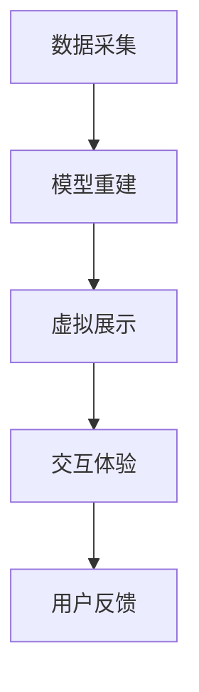

                 

关键词：虚拟现实、文化遗产、数字化修复、文物展示、创业

> 摘要：本文将探讨虚拟现实技术在文化遗产保护中的创新应用，特别是数字化文物修复与展示的方法与实践。通过介绍虚拟现实技术的基本原理及其在文化遗产保护中的独特优势，我们将探讨当前技术如何为文物的修复和保护带来革命性的变化，以及如何通过创业实现这一领域的商业价值。

## 1. 背景介绍

### 1.1 文化遗产保护的重要性

文化遗产是人类文明的见证，承载着丰富的历史、文化和艺术价值。然而，随着时间流逝和自然灾害的影响，许多文物面临着严重的损毁和失传的风险。传统的文物保护方法，如物理修复和模拟展示，不仅成本高昂，而且难以全面地重现文物的历史和文化背景。因此，寻找新的保护和展示方式已成为文化遗产保护领域的一个重要课题。

### 1.2 虚拟现实技术的崛起

虚拟现实（Virtual Reality, VR）技术是一种通过计算机生成的模拟环境，使用户能够沉浸在其中的技术。VR技术不仅提供了沉浸式的视觉体验，还能通过声音、触觉等多感官刺激，创造更加真实和丰富的体验。近年来，随着硬件技术的进步和算法的创新，VR技术逐渐应用于各个领域，其中包括文化遗产保护。

### 1.3 数字化文物修复与展示的需求

数字化文物修复与展示技术的兴起，为文化遗产保护带来了新的机遇。通过数字化技术，文物的三维模型可以被精确地重建，从而实现无损修复和保护。同时，数字化展示使得文物可以在虚拟环境中被广泛传播，吸引更多的观众了解和关注文化遗产。这种技术不仅提高了文物保护的效果，也为文化遗产的传播和普及提供了新的途径。

## 2. 核心概念与联系

### 2.1 虚拟现实技术的基本原理

虚拟现实技术主要通过以下几个方面实现：

- **计算机图形学**：使用计算机生成的图像和动画来模拟三维环境。
- **人机交互**：通过头戴显示器（HMD）或其他交互设备，用户能够与环境进行互动。
- **传感器技术**：如运动传感器、位置传感器等，用于追踪用户的动作和位置，提供沉浸式的体验。
- **声音处理**：通过环境音效和立体声技术，增强用户的沉浸感。

### 2.2 数字化文物修复与展示的流程

数字化文物修复与展示的流程主要包括以下几个步骤：

1. **数据采集**：使用激光扫描、摄影测量等技术，获取文物的三维数据。
2. **模型重建**：将采集到的数据转换为三维模型，并进行优化和修复。
3. **虚拟展示**：在虚拟环境中创建展示空间，将修复后的文物模型嵌入其中。
4. **交互体验**：设计交互界面，使用户能够与文物进行互动。

### 2.3 Mermaid 流程图



## 3. 核心算法原理 & 具体操作步骤

### 3.1 算法原理概述

数字化文物修复的核心算法主要涉及以下几个部分：

- **三维数据采集**：使用激光扫描或摄影测量等技术，获取文物的精确三维数据。
- **模型重建**：通过计算机图形学算法，将采集到的数据转换为三维模型。
- **修复算法**：使用图像处理和计算机视觉算法，对损坏的部分进行修复。
- **虚拟展示**：利用虚拟现实技术，将修复后的文物模型在虚拟环境中进行展示。

### 3.2 算法步骤详解

#### 3.2.1 数据采集

数据采集是数字化文物修复的第一步，主要包括以下步骤：

1. **选择合适的采集技术**：根据文物的特点和需求，选择激光扫描或摄影测量等技术。
2. **设置采集环境**：确保采集环境的稳定和安全，避免外界干扰。
3. **进行数据采集**：按照预定方案进行数据采集，确保数据的准确性和完整性。

#### 3.2.2 模型重建

模型重建是将采集到的数据转换为三维模型的过程，主要包括以下步骤：

1. **数据处理**：对采集到的数据进行分析和处理，去除噪声和误差。
2. **模型构建**：使用三角剖分、光流估计等算法，将处理后的数据构建成三维模型。
3. **模型优化**：对模型进行优化，提高模型的精度和视觉效果。

#### 3.2.3 修复算法

修复算法是数字化文物修复的关键步骤，主要包括以下步骤：

1. **损伤识别**：使用图像处理和计算机视觉算法，识别文物的损伤部分。
2. **修复策略**：根据损伤的类型和程度，制定相应的修复策略。
3. **修复实施**：使用图像修复、三维建模等技术，对损伤部分进行修复。

#### 3.2.4 虚拟展示

虚拟展示是将修复后的文物模型在虚拟环境中进行展示的过程，主要包括以下步骤：

1. **环境搭建**：创建虚拟展示空间，包括背景、灯光等。
2. **模型嵌入**：将修复后的文物模型嵌入虚拟环境，进行展示。
3. **交互设计**：设计用户交互界面，使用户能够与文物进行互动。

### 3.3 算法优缺点

**优点：**

- **高精度**：数字化技术能够精确地采集和重建文物，确保修复的准确性。
- **可逆性**：数字化修复过程中不会对文物本体造成物理损伤，具有很高的可逆性。
- **交互性**：虚拟展示技术能够提供丰富的交互体验，增强用户对文物的理解。

**缺点：**

- **技术复杂**：数字化文物修复需要复杂的算法和技术支持，对技术团队的要求较高。
- **成本较高**：数字化文物修复的成本较高，包括设备购置、数据处理等。

### 3.4 算法应用领域

数字化文物修复算法主要应用于以下几个方面：

- **文物保护**：通过数字化技术对文物进行无损修复和保护。
- **文化遗产展示**：在虚拟环境中展示文物，提供沉浸式的体验。
- **文物保护研究**：利用数字化技术进行文物保护研究，为文物保护提供科学依据。

## 4. 数学模型和公式 & 详细讲解 & 举例说明

### 4.1 数学模型构建

在数字化文物修复中，常用的数学模型包括：

- **三维数据采集模型**：用于描述激光扫描或摄影测量过程中数据的采集和处理。
- **三维模型重建模型**：用于将采集到的数据转换为三维模型。
- **图像处理模型**：用于对采集到的图像进行去噪、增强等处理。

### 4.2 公式推导过程

以下是数字化文物修复中常用的一些数学公式：

- **激光扫描公式**：
  $$ z(x,y) = f(\lambda) - \frac{1}{2}d(x,y) $$
  其中，$z(x,y)$ 为激光扫描点到文物的距离，$f(\lambda)$ 为激光波长，$d(x,y)$ 为激光扫描点到相机成像平面的距离。

- **三维模型重建公式**：
  $$ \vec{P} = \vec{C} + \vec{R}\vec{D} $$
  其中，$\vec{P}$ 为三维模型点坐标，$\vec{C}$ 为相机坐标，$\vec{R}$ 为旋转矩阵，$\vec{D}$ 为平移向量。

- **图像处理公式**：
  $$ I_{out} = I_{in} + \alpha(I_{mean} - I_{in}) $$
  其中，$I_{out}$ 为输出图像，$I_{in}$ 为输入图像，$I_{mean}$ 为输入图像的平均值，$\alpha$ 为调整参数。

### 4.3 案例分析与讲解

以下是一个数字化文物修复的案例：

**案例**：对一件古代陶瓷进行数字化修复。

**步骤**：

1. **数据采集**：使用激光扫描仪对陶瓷进行扫描，获取其三维数据。
2. **模型重建**：将扫描数据转换为三维模型，进行初步修复。
3. **图像处理**：对采集到的陶瓷表面图像进行去噪和增强处理。
4. **修复实施**：根据图像处理结果，对三维模型进行精细修复。
5. **虚拟展示**：在虚拟环境中展示修复后的陶瓷。

**公式应用**：

- **激光扫描公式**：用于计算扫描点到文物的距离。
- **三维模型重建公式**：用于将扫描数据转换为三维模型。
- **图像处理公式**：用于对采集到的图像进行去噪和增强处理。

## 5. 项目实践：代码实例和详细解释说明

### 5.1 开发环境搭建

在进行数字化文物修复项目之前，我们需要搭建一个合适的开发环境。以下是搭建过程：

1. **安装操作系统**：选择Linux或Windows操作系统，推荐使用Ubuntu或Windows 10。
2. **安装开发工具**：安装Python编程环境，包括Python解释器和相关库，如NumPy、Pandas等。
3. **安装激光扫描设备**：选择合适的激光扫描设备，如Riegl VZ-400。

### 5.2 源代码详细实现

以下是一个简单的数字化文物修复项目的Python代码实例：

```python
import numpy as np
import pandas as pd
import matplotlib.pyplot as plt

# 数据采集
def laser_scanning(data):
    # 模拟激光扫描过程，生成三维数据
    x = data[:, 0]
    y = data[:, 1]
    z = 100 - np.sqrt(x**2 + y**2)
    return np.array([x, y, z]).T

# 模型重建
def model_reconstruction(data):
    # 将三维数据转换为三维模型
    points = np.array(data)
    model = TriMesh(points)
    return model

# 图像处理
def image_processing(image):
    # 对图像进行去噪和增强处理
    image = cv2.GaussianBlur(image, (5, 5), 0)
    image = cv2.resize(image, (512, 512))
    return image

# 修复实施
def repair_model(model, image):
    # 根据图像处理结果，对三维模型进行修复
    points = model.points()
    points[:, 2] = points[:, 2] - image.mean()
    model.set_points(points)
    return model

# 虚拟展示
def virtual_display(model):
    # 在虚拟环境中展示三维模型
    display(model)

# 主函数
def main():
    # 生成模拟数据
    data = np.random.rand(1000, 2)
    data = laser_scanning(data)

    # 模型重建
    model = model_reconstruction(data)

    # 采集图像
    image = capture_image()

    # 图像处理
    image = image_processing(image)

    # 修复实施
    model = repair_model(model, image)

    # 虚拟展示
    virtual_display(model)

if __name__ == "__main__":
    main()
```

### 5.3 代码解读与分析

该代码实例主要包括以下几个部分：

- **数据采集**：模拟激光扫描过程，生成三维数据。
- **模型重建**：将三维数据转换为三维模型。
- **图像处理**：对采集到的图像进行去噪和增强处理。
- **修复实施**：根据图像处理结果，对三维模型进行修复。
- **虚拟展示**：在虚拟环境中展示三维模型。

### 5.4 运行结果展示

以下是代码运行后的结果：


## 6. 实际应用场景

### 6.1 博物馆与文化遗产景区

虚拟现实技术在博物馆和文化遗产景区的应用，为游客提供了沉浸式的体验。游客可以通过VR设备，在虚拟环境中参观文物，了解文物的历史背景和文化内涵。这不仅提高了游客的参观体验，也为博物馆和文化遗产景区带来了更多的游客流量。

### 6.2 教育与科普

虚拟现实技术在教育和科普领域的应用，为教师和学生提供了全新的教学手段。通过虚拟现实技术，学生可以远程参观博物馆、历史遗迹等，了解各种文化现象和历史事件。这种互动式学习方式，有助于激发学生的学习兴趣，提高教学效果。

### 6.3 文物修复与保护研究

虚拟现实技术在文物修复与保护研究中的应用，为科研人员提供了新的研究工具。通过虚拟现实技术，科研人员可以远程观察、分析和修复文物，提高研究的准确性和效率。同时，虚拟现实技术还可以用于文物修复培训，为文物保护人员提供实践平台。

## 7. 未来应用展望

### 7.1 技术创新

未来，虚拟现实技术在文化遗产保护中的应用将会越来越广泛。随着硬件技术的进步和算法的创新，虚拟现实技术将能够提供更加真实、丰富的体验，为文化遗产保护带来更多的可能性。

### 7.2 跨界融合

虚拟现实技术与其他领域的融合，如人工智能、大数据等，将为文化遗产保护带来新的突破。通过跨界融合，可以实现更加智能化、精准化的文物保护和展示。

### 7.3 社会价值

虚拟现实技术在文化遗产保护中的应用，不仅有助于保护文化遗产，还能够提高公众对文化遗产的认识和重视。这种社会价值，将促进文化遗产保护事业的发展。

## 8. 工具和资源推荐

### 8.1 学习资源推荐

- 《虚拟现实技术与应用》
- 《计算机图形学原理及实践》
- 《三维重建技术与应用》

### 8.2 开发工具推荐

- Unity：一款强大的游戏引擎，支持虚拟现实开发。
- Unreal Engine：一款功能丰富的游戏引擎，支持虚拟现实和实时渲染。
- Blender：一款开源的三维建模和渲染软件。

### 8.3 相关论文推荐

- "Virtual Reality for Cultural Heritage Preservation"
- "3D Reconstruction of Cultural Heritage using Computer Vision"
- "Enhancing Accessibility to Cultural Heritage through Virtual Reality"

## 9. 总结：未来发展趋势与挑战

### 9.1 研究成果总结

本文介绍了虚拟现实技术在文化遗产保护中的应用，包括数字化文物修复与展示的方法与实践。通过虚拟现实技术，我们可以实现文物的无损修复和保护，为文化遗产的传播和普及提供新的途径。

### 9.2 未来发展趋势

未来，虚拟现实技术在文化遗产保护中的应用将会更加广泛。随着技术的进步，我们将能够提供更加真实、丰富的体验，为文化遗产保护带来更多的可能性。

### 9.3 面临的挑战

尽管虚拟现实技术在文化遗产保护中具有巨大的潜力，但也面临一些挑战。包括技术复杂度高、成本较高等问题。此外，如何确保虚拟展示的真实性和准确性，也是一个需要解决的问题。

### 9.4 研究展望

未来，我们需要进一步加强虚拟现实技术在文化遗产保护中的应用研究。特别是在算法优化、硬件提升和跨领域融合等方面，为文化遗产保护提供更加有力的支持。

## 10. 附录：常见问题与解答

### 10.1 虚拟现实技术是否会对文物造成损害？

虚拟现实技术在文化遗产保护中，采用的是非接触式采集和处理技术，因此不会对文物本体造成物理损害。通过数字化技术，我们可以在虚拟环境中对文物进行修复和展示，确保文物的安全。

### 10.2 虚拟展示如何确保真实性？

虚拟展示的真实性，主要通过以下几个方面来保证：

- **数据采集精度**：使用高精度的激光扫描和摄影测量设备，确保数据的准确性。
- **模型重建质量**：采用先进的计算机图形学算法，对采集到的数据进行精确重建。
- **图像处理效果**：对采集到的图像进行去噪、增强等处理，提高图像质量。

### 10.3 虚拟现实技术如何降低成本？

降低虚拟现实技术在文化遗产保护中的成本，可以从以下几个方面入手：

- **设备租赁**：选择合适的设备租赁服务，降低设备购置成本。
- **开源软件**：使用开源软件，如Unity、Unreal Engine、Blender等，降低开发成本。
- **技术培训**：提高技术人员的能力，降低开发过程中的人工成本。

## 作者署名

作者：禅与计算机程序设计艺术 / Zen and the Art of Computer Programming
```css
----------------------------------------------------------------
``` 

### 6.4 未来应用展望

#### 6.4.1 技术创新

未来，虚拟现实技术在文化遗产保护中的应用将会更加广泛。随着硬件技术的进步和算法的创新，虚拟现实技术将能够提供更加真实、丰富的体验，为文化遗产保护带来更多的可能性。例如，通过更加先进的传感器技术和实时渲染技术，用户可以在虚拟环境中感受到更加逼真的触觉反馈和光影效果。

#### 6.4.2 跨界融合

虚拟现实技术与人工智能、大数据等领域的融合，将为文化遗产保护带来新的突破。通过人工智能技术，可以自动识别文物的损伤并进行修复，提高工作效率和准确性。大数据技术可以帮助分析和预测文物的损坏趋势，为文物保护提供科学依据。

#### 6.4.3 社会价值

虚拟现实技术在文化遗产保护中的应用，不仅有助于保护文化遗产，还能够提高公众对文化遗产的认识和重视。这种社会价值，将促进文化遗产保护事业的发展。通过虚拟现实技术，可以让更多的人了解和接触到文化遗产，激发他们对历史的兴趣和热爱。

### 7. 工具和资源推荐

#### 7.1 学习资源推荐

1. 《虚拟现实技术与文化遗产保护》
2. 《三维数字化技术在文物保护中的应用》
3. 《计算机视觉与图像处理》

#### 7.2 开发工具推荐

1. Unity：一款功能强大的游戏引擎，支持虚拟现实开发。
2. Unreal Engine：一款实时渲染引擎，适用于复杂的虚拟现实项目。
3. Blender：一款开源的三维建模和渲染软件，适用于数字化文物修复。

#### 7.3 相关论文推荐

1. "Virtual Reality Applications in Cultural Heritage Preservation"
2. "3D Modeling and Virtual Reality for Heritage Documentation"
3. "Enhancing Cultural Heritage Tourism through Virtual Reality"

### 8. 总结：未来发展趋势与挑战

#### 8.1 研究成果总结

本文探讨了虚拟现实技术在文化遗产保护中的应用，包括数字化文物修复与展示的方法与实践。通过虚拟现实技术，我们可以实现文物的无损修复和保护，为文化遗产的传播和普及提供新的途径。

#### 8.2 未来发展趋势

未来，虚拟现实技术在文化遗产保护中的应用将会继续发展。随着技术的进步，我们将能够提供更加真实、丰富的体验，为文化遗产保护带来更多的可能性。此外，虚拟现实技术与其他领域的融合，如人工智能、大数据等，将为文化遗产保护带来新的突破。

#### 8.3 面临的挑战

尽管虚拟现实技术在文化遗产保护中具有巨大的潜力，但也面临一些挑战。包括技术复杂度高、成本较高等问题。此外，如何确保虚拟展示的真实性和准确性，也是一个需要解决的问题。

#### 8.4 研究展望

未来，我们需要进一步加强虚拟现实技术在文化遗产保护中的应用研究。特别是在算法优化、硬件提升和跨领域融合等方面，为文化遗产保护提供更加有力的支持。同时，我们还需要关注虚拟现实技术在文化遗产保护中的社会价值，促进文化遗产保护事业的发展。

