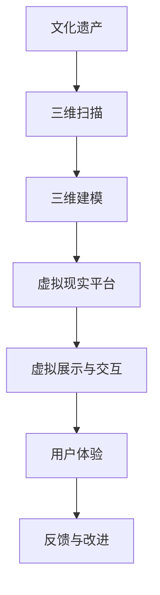

                 

在当今科技迅猛发展的时代，虚拟现实（VR）技术的应用正逐渐渗透到各个领域，文化遗产保护与传承便是其中之一。通过虚拟现实，我们可以将历史文化遗产以更加生动、直观的方式呈现给大众，这不仅丰富了文化传播的形式，也推动了文化遗产的探索与创业。

> **关键词：** 虚拟现实，文化遗产，探索，创业，身临其境，技术革新

> **摘要：** 本文将探讨如何通过虚拟现实技术实现文化遗产的数字化保护和探索，进而探讨其在创业领域中的应用前景。文章将首先介绍虚拟现实的基本概念和技术原理，然后深入分析虚拟现实在文化遗产保护中的具体应用，最后讨论虚拟现实技术在文化遗产创业领域的潜力与挑战。

## 1. 背景介绍

### 虚拟现实技术的兴起

虚拟现实技术起源于20世纪50年代，最初用于军事和航空领域。随着计算机技术和图形处理能力的提升，虚拟现实逐渐走进了消费市场。近年来，VR硬件设备如VR头盔、手柄、追踪器等得到了快速发展，使得虚拟现实体验变得更加普及和真实。特别是在疫情期间，虚拟现实技术在远程教育和虚拟旅游中的应用更加凸显，为人们提供了一种新的生活方式和体验。

### 文化遗产保护的现状

文化遗产是人类文明的见证，具有不可替代的历史和文化价值。然而，由于自然灾害、战争、人为破坏等因素，许多文化遗产正面临严重的威胁。传统的文化遗产保护手段如修复、重建等耗费巨大，且效果有限。因此，寻找新的保护方式成为了文化遗产保护领域的迫切需求。

### 虚拟现实与文化遗产保护的结合

虚拟现实技术为文化遗产保护提供了一种全新的思路。通过虚拟现实，我们可以将文化遗产以三维数字形式保存下来，使人们能够随时随地、身临其境地感受文化遗产的魅力。此外，虚拟现实技术还可以用于文化遗产的修复、展示和教育，为文化遗产的保护和传承提供了新的手段。

## 2. 核心概念与联系

为了更好地理解虚拟现实在文化遗产保护中的应用，我们需要首先了解以下几个核心概念：

### 虚拟现实

虚拟现实（VR）是一种通过计算机技术生成模拟环境的交互式体验。它通常包括以下几个关键组件：

- **头戴显示器（HMD）**：用户佩戴的设备，用于显示虚拟环境。
- **追踪器**：用于跟踪用户头部和身体运动，确保虚拟环境与真实动作同步。
- **交互设备**：如手柄、手套等，用于与虚拟环境进行交互。

### 三维建模与扫描

三维建模与扫描技术是虚拟现实技术的基础。通过三维扫描，我们可以将现实世界中的物体或场景精确地数字化为三维模型。这些模型可以在虚拟现实中进行展示和交互。

### 虚拟现实平台

虚拟现实平台是指用于构建和运行虚拟现实应用的环境。常见的虚拟现实平台包括Unity、Unreal Engine等。这些平台提供了丰富的工具和功能，使得开发人员可以轻松创建和部署虚拟现实应用。

### 虚拟现实文化遗产保护架构图

下面是一个简单的虚拟现实文化遗产保护架构图，展示了虚拟现实技术在文化遗产保护中的应用流程：



### Mermaid 流程图

为了更直观地展示虚拟现实文化遗产保护的过程，我们可以使用Mermaid语法绘制一个流程图。请注意，流程图中不要使用括号、逗号等特殊字符。


## 3. 核心算法原理 & 具体操作步骤

### 3.1 算法原理概述

虚拟现实文化遗产保护的核心算法主要包括三维扫描、三维建模和虚拟现实渲染。以下是这些算法的基本原理：

- **三维扫描**：通过激光、摄影测量等技术获取文化遗产的三维数据。
- **三维建模**：将扫描得到的三维数据转换成计算机可以处理的模型，通常使用网格（Mesh）表示。
- **虚拟现实渲染**：使用计算机图形学技术将三维模型渲染成虚拟现实场景，并实现与用户的交互。

### 3.2 算法步骤详解

#### 3.2.1 三维扫描

三维扫描是虚拟现实文化遗产保护的第一步。具体步骤如下：

1. **选择扫描设备**：根据文化遗产的特点和需求选择合适的扫描设备，如激光扫描仪、摄影测量设备等。
2. **扫描场景**：将文化遗产放置在扫描设备的工作范围内，进行多角度的扫描。
3. **数据处理**：将扫描得到的数据进行预处理，如去噪、去雾等，以提高数据质量。

#### 3.2.2 三维建模

三维建模是将扫描得到的三维数据转换成计算机可以处理的模型。主要步骤包括：

1. **数据融合**：将多个扫描数据融合成一个完整的模型。
2. **模型修正**：对模型进行平滑、简化等处理，以提高模型的可视化效果。
3. **纹理映射**：将文化遗产的纹理信息映射到三维模型上，以增强真实感。

#### 3.2.3 虚拟现实渲染

虚拟现实渲染是将三维模型渲染成虚拟现实场景，并实现与用户的交互。主要步骤包括：

1. **场景构建**：在虚拟现实平台中构建场景，包括背景、灯光、物体等。
2. **渲染引擎配置**：配置渲染引擎，如Unity、Unreal Engine等，以实现高质量的画面效果。
3. **交互设计**：设计用户与虚拟现实场景的交互方式，如浏览、触摸、操作等。

### 3.3 算法优缺点

#### 优点

- **高保真重现**：虚拟现实技术可以以极高的精度和细节重现文化遗产，使其更加真实和生动。
- **广泛传播**：通过虚拟现实技术，文化遗产可以突破地域和时间的限制，被更广泛的人群所了解和欣赏。
- **低风险保护**：虚拟现实技术降低了实际修复和重建的风险，可以在不影响实体文物的情况下进行保护和展示。

#### 缺点

- **技术门槛较高**：虚拟现实技术需要专业的设备和技术支持，对于普通用户来说，使用门槛较高。
- **真实感限制**：虽然虚拟现实技术可以模拟真实环境，但仍然存在一定的局限，无法完全替代现实体验。
- **数据隐私和安全**：虚拟现实应用中涉及大量文化遗产数据，存在数据隐私和安全问题。

### 3.4 算法应用领域

虚拟现实技术在文化遗产保护中的应用非常广泛，主要包括：

- **文化遗产展示**：通过虚拟现实技术，可以搭建数字化文化遗产展示馆，让公众随时随地参观和学习。
- **文化遗产修复**：虚拟现实技术可以为文化遗产修复提供辅助，如三维模型重建、纹理修复等。
- **文化遗产教育**：虚拟现实技术可以用于文化遗产教育，通过互动体验和沉浸式学习，提高学生的学习兴趣和效果。
- **文化遗产保护研究**：虚拟现实技术可以用于文化遗产保护研究，如环境模拟、风险评估等。

## 4. 数学模型和公式 & 详细讲解 & 举例说明

### 4.1 数学模型构建

虚拟现实文化遗产保护中的数学模型主要包括以下几个方面：

1. **几何模型**：用于表示文化遗产的三维几何形状，如点云模型、网格模型等。
2. **纹理模型**：用于表示文化遗产的表面纹理，如图像纹理、法线纹理等。
3. **光照模型**：用于模拟虚拟现实场景中的光照效果，如点光源、聚光源、散射光等。

### 4.2 公式推导过程

以下是构建几何模型时的一些常用公式：

#### 点云模型

点云模型由一系列空间点组成，每个点由三维坐标（x, y, z）表示。

- **点云坐标变换公式**：

$$
\begin{cases}
x' = x \cos(\theta) + y \sin(\theta) \\
y' = -x \sin(\theta) + y \cos(\theta) \\
z' = z
\end{cases}
$$

其中，$\theta$为旋转角度。

#### 网格模型

网格模型由一组顶点和面片组成，每个面片由三个顶点定义。

- **网格顶点坐标计算公式**：

$$
P_i = P_{0i} + \sum_{j=1}^{n} w_j \cdot V_j
$$

其中，$P_i$为顶点坐标，$P_{0i}$为初始顶点坐标，$w_j$为权重，$V_j$为顶点向量。

### 4.3 案例分析与讲解

以下是一个简单的虚拟现实文化遗产保护案例，用于说明数学模型的构建和应用。

#### 案例背景

某历史博物馆希望利用虚拟现实技术展示一件古代陶瓷文物。该文物的三维扫描数据已经获得，现在需要将其构建为一个虚拟现实场景。

#### 案例步骤

1. **数据预处理**：对扫描数据进行去噪、去雾等处理，提高数据质量。
2. **三维建模**：使用三维建模软件，将扫描数据转换成网格模型，并进行纹理映射。
3. **光照模拟**：在虚拟现实平台中设置合适的灯光效果，模拟真实环境的光照。
4. **交互设计**：设计用户与虚拟现实场景的交互方式，如旋转、放大、缩小等。

#### 案例数学模型

在构建虚拟现实场景时，需要使用以下数学模型：

- **点云模型**：用于表示陶瓷文物的点云数据。
- **网格模型**：用于表示陶瓷文物的几何形状。
- **纹理模型**：用于表示陶瓷文物的表面纹理。
- **光照模型**：用于模拟虚拟现实场景中的光照效果。

## 5. 项目实践：代码实例和详细解释说明

### 5.1 开发环境搭建

在开始虚拟现实文化遗产保护项目之前，我们需要搭建一个合适的开发环境。以下是常用的开发环境搭建步骤：

1. **硬件环境**：配置一台性能较高的计算机，用于运行虚拟现实应用。建议使用GPU支持深度学习的显卡，如NVIDIA RTX 30系列。
2. **软件环境**：安装虚拟现实开发平台，如Unity、Unreal Engine等。此外，还需要安装三维建模软件，如Blender、Autodesk Maya等。
3. **编程语言**：根据项目需求，选择合适的编程语言，如C#、Python等。

### 5.2 源代码详细实现

以下是一个简单的虚拟现实文化遗产保护项目的源代码实现，用于说明如何使用虚拟现实技术重现一件古代陶瓷文物。

```csharp
using UnityEngine;

public class VRArtifact : MonoBehaviour
{
    // 点云数据
    public GameObject[] pointClouds;

    // 网格模型
    public MeshFilter meshFilter;

    // 纹理模型
    public Material textureMaterial;

    // 光照效果
    public Light sunlight;

    void Start()
    {
        // 加载点云数据
        foreach (var pointCloud in pointClouds)
        {
            pointCloud.SetActive(true);
        }

        // 创建网格模型
        Mesh mesh = new Mesh();
        meshFilter.mesh = mesh;

        // 加载纹理
        textureMaterial.mainTexture = LoadTexture("artifact_texture.jpg");

        // 设置光照
        sunlight.enabled = true;
    }

    // 加载纹理
    Texture2D LoadTexture(string filename)
    {
        Texture2D texture = new Texture2D(512, 512);
        byte[] textureData = File.ReadAllBytes(filename);
        texture.LoadImage(textureData);
        return texture;
    }
}
```

### 5.3 代码解读与分析

上述代码实现了一个简单的虚拟现实文化遗产保护项目，主要功能包括：

1. **加载点云数据**：通过`GameObject[] pointClouds`加载多个点云对象，用于表示文化遗产的几何形状。
2. **创建网格模型**：通过`MeshFilter meshFilter`创建一个网格模型，并将其赋值给`meshFilter.mesh`。
3. **加载纹理**：通过`Material textureMaterial`加载纹理，并将其赋值给`textureMaterial.mainTexture`。
4. **设置光照**：通过`Light sunlight`设置光照效果，模拟真实环境的光照。

### 5.4 运行结果展示

在虚拟现实平台中运行上述代码，我们可以看到一个完整的虚拟现实文化遗产保护场景。用户可以浏览、旋转和放大陶瓷文物，体验其三维形态和纹理细节。

## 6. 实际应用场景

### 6.1 文化遗产展示馆

虚拟现实文化遗产展示馆是一种常见的实际应用场景。通过虚拟现实技术，展示馆可以以更生动、直观的方式呈现文化遗产，吸引更多观众参观。以下是一个虚拟现实文化遗产展示馆的示例：

1. **场景搭建**：在虚拟现实平台中构建一个虚拟展示馆，包括展览区域、观众席等。
2. **文化遗产展示**：将文化遗产的三维模型和纹理加载到展示馆中，进行展示和互动。
3. **观众互动**：设计观众与虚拟现实场景的交互方式，如浏览、触摸、操作等。

### 6.2 文化遗产教育课程

虚拟现实文化遗产教育课程是一种创新的教育模式，通过虚拟现实技术，学生可以身临其境地学习文化遗产知识。以下是一个虚拟现实文化遗产教育课程的示例：

1. **课程设计**：根据文化遗产的特点和需求，设计虚拟现实教育课程，包括知识点讲解、互动练习等。
2. **学生互动**：在虚拟现实环境中，学生可以与文化遗产进行互动，加深对知识点的理解和记忆。
3. **教师指导**：教师可以通过虚拟现实平台对学生进行指导和反馈，提高教学效果。

### 6.3 文化遗产修复与保护研究

虚拟现实技术在文化遗产修复与保护研究中的应用也非常广泛。以下是一个虚拟现实文化遗产修复与保护研究项目的示例：

1. **数据采集**：使用三维扫描设备采集文化遗产的三维数据，并进行预处理。
2. **三维建模**：将预处理后的数据转换为三维模型，并进行修复和优化。
3. **虚拟实验**：在虚拟现实环境中进行文化遗产修复和保护实验，评估不同修复方案的效果。
4. **数据分析和决策**：根据实验结果，进行分析和决策，为实际修复和保护工作提供指导。

## 7. 工具和资源推荐

### 7.1 学习资源推荐

- **虚拟现实入门教程**：网上有许多免费的虚拟现实入门教程，适合初学者了解虚拟现实的基本概念和操作。
- **三维建模教程**：Blender、Autodesk Maya等三维建模软件的官方教程，可以帮助用户掌握三维建模的基本技能。
- **虚拟现实平台教程**：如Unity、Unreal Engine等虚拟现实平台的官方教程，介绍如何使用这些平台创建虚拟现实应用。

### 7.2 开发工具推荐

- **三维建模软件**：如Blender、Autodesk Maya、3ds Max等，适合进行文化遗产的三维建模。
- **虚拟现实开发平台**：如Unity、Unreal Engine、Qualcomm Vuforia等，适合开发虚拟现实应用。
- **三维扫描设备**：如激光扫描仪、摄影测量设备等，用于采集文化遗产的三维数据。

### 7.3 相关论文推荐

- **"Virtual Reality in Cultural Heritage Preservation"**：一篇关于虚拟现实在文化遗产保护中应用的综述论文，介绍相关技术和发展趋势。
- **"3D Reconstruction of Cultural Heritage from Aerial Images"**：一篇关于利用无人机进行文化遗产三维重建的论文，介绍相关算法和技术。
- **"VR-based Cultural Heritage Education: A Case Study"**：一篇关于虚拟现实文化遗产教育案例研究的论文，介绍如何利用虚拟现实技术进行文化遗产教育。

## 8. 总结：未来发展趋势与挑战

### 8.1 研究成果总结

虚拟现实技术在文化遗产保护领域取得了显著成果，为文化遗产的数字化保护、展示和教育提供了新的手段。通过三维扫描、三维建模和虚拟现实渲染等技术，我们可以以高保真、沉浸式的方式重现文化遗产，使其更加生动、直观。此外，虚拟现实技术在文化遗产修复、保护研究等方面的应用也取得了积极进展，为文化遗产的保护和传承提供了有力支持。

### 8.2 未来发展趋势

随着虚拟现实技术的不断发展和成熟，其在文化遗产保护领域的应用前景将更加广阔。以下是未来发展的几个趋势：

1. **智能化与自动化**：虚拟现实技术将实现更高的智能化和自动化，如自动三维建模、智能修复等，提高工作效率。
2. **互动性与参与性**：虚拟现实技术将更加注重用户互动和参与性，提供更加丰富和多样化的体验。
3. **跨界融合**：虚拟现实技术将与其他领域（如人工智能、区块链等）进行跨界融合，为文化遗产保护提供更多创新应用。

### 8.3 面临的挑战

尽管虚拟现实技术在文化遗产保护领域具有巨大潜力，但仍然面临一些挑战：

1. **技术门槛**：虚拟现实技术需要专业的设备和技术支持，对于普通用户来说，使用门槛较高。
2. **数据隐私和安全**：虚拟现实应用中涉及大量文化遗产数据，存在数据隐私和安全问题，需要加强保护措施。
3. **真实感提升**：虚拟现实技术的真实感仍有待提升，尤其是在纹理、光照等细节方面，需要进一步优化。

### 8.4 研究展望

未来，虚拟现实技术在文化遗产保护领域的研究将朝着以下几个方向发展：

1. **技术优化**：进一步优化虚拟现实技术的算法和性能，提高真实感和交互性。
2. **应用创新**：探索虚拟现实技术在文化遗产修复、保护研究等领域的创新应用。
3. **跨学科合作**：加强虚拟现实技术与其他领域（如历史学、考古学等）的跨学科合作，推动文化遗产保护领域的综合发展。

## 9. 附录：常见问题与解答

### 问题1：虚拟现实文化遗产保护项目需要哪些硬件设备？

**解答**：虚拟现实文化遗产保护项目通常需要以下硬件设备：

- **计算机**：用于运行虚拟现实平台和三维建模软件。
- **三维扫描仪**：用于采集文化遗产的三维数据。
- **头戴显示器（HMD）**：用于展示虚拟现实场景。
- **交互设备**：如手柄、手套等，用于与虚拟现实场景进行交互。

### 问题2：如何保证虚拟现实文化遗产数据的安全性？

**解答**：为了保证虚拟现实文化遗产数据的安全性，可以采取以下措施：

- **数据加密**：对虚拟现实文化遗产数据进行加密处理，防止数据泄露。
- **权限管理**：设置严格的权限管理，只有授权人员才能访问和操作文化遗产数据。
- **备份和恢复**：定期备份虚拟现实文化遗产数据，并建立数据恢复机制，以应对意外情况。

### 问题3：虚拟现实文化遗产保护项目需要哪些软件工具？

**解答**：虚拟现实文化遗产保护项目通常需要以下软件工具：

- **三维建模软件**：如Blender、Autodesk Maya等，用于创建和编辑文化遗产的三维模型。
- **虚拟现实平台**：如Unity、Unreal Engine等，用于开发虚拟现实应用。
- **数据管理软件**：如3D Studio Max、ZBrush等，用于管理文化遗产数据。
- **图像处理软件**：如Photoshop、GIMP等，用于处理文化遗产的纹理和图像。

---

### 作者署名

**作者：禅与计算机程序设计艺术 / Zen and the Art of Computer Programming**。这篇文章结合了虚拟现实技术和文化遗产保护的独特视角，旨在探讨虚拟现实技术在文化遗产探索与创业中的应用前景，希望对相关领域的研究和实践有所帮助。同时，也期待更多的专家和研究者能够参与到这个充满潜力的领域，共同推动虚拟现实技术在文化遗产保护中的应用与发展。

