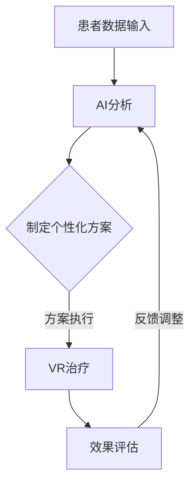

                 

关键词：虚拟现实治疗、AI心理健康诊所、心理健康、心理治疗、AI技术、虚拟现实技术、心理健康干预

摘要：本文旨在探讨虚拟现实（VR）技术结合人工智能（AI）在心理健康治疗领域中的应用。随着科技的不断发展，AI与VR的结合在心理治疗领域展现出了巨大的潜力，不仅能够提供个性化的治疗方案，还能显著提高治疗效果。本文将详细介绍VR在心理治疗中的应用原理、AI技术的作用、具体实施步骤以及未来发展趋势，旨在为心理健康行业提供新的研究方向和实践指导。

## 1. 背景介绍

随着现代社会生活节奏的加快和压力的增大，心理健康问题已经成为全球关注的重点。据世界卫生组织（WHO）统计，全球约有3.5亿人患有抑郁症、焦虑症等精神疾病，且这一数字还在不断上升。传统心理治疗方法如面对面咨询、药物治疗等虽然有效，但在治疗过程中仍存在诸多问题，如治疗时间成本高、治疗效果不易评估等。

与此同时，人工智能和虚拟现实技术的快速发展为心理健康治疗领域带来了新的机遇。虚拟现实技术通过模拟真实环境，为患者提供了一个安全、可控制的治疗空间，而人工智能则通过数据分析和算法优化，为心理治疗提供了个性化、智能化的支持。这种技术结合在心理健康治疗中的应用，有望解决传统方法中的诸多难题，为心理治疗提供全新的解决方案。

## 2. 核心概念与联系

### 2.1 虚拟现实技术（VR）

虚拟现实技术是一种通过计算机技术生成虚拟环境，让用户在虚拟环境中体验沉浸感的技术。VR技术的核心组成部分包括头戴式显示器（HMD）、位置追踪系统、数据手套等。通过这些设备，用户可以实时感知并互动虚拟环境中的物体，获得身临其境的体验。

### 2.2 人工智能（AI）

人工智能是一种模拟人类智能的技术，通过算法和模型，使计算机具备学习、推理、决策等能力。AI技术在心理健康治疗中的应用主要包括数据分析和模型预测。通过分析患者的心理数据，AI技术可以为心理治疗提供个性化建议，提高治疗效果。

### 2.3 VR与AI的结合

虚拟现实技术和人工智能的结合，在心理健康治疗领域具有极大的应用潜力。VR技术可以为患者提供一个安全、可控的治疗环境，而AI技术则可以分析患者的心理数据，为治疗提供个性化支持。具体来说，VR与AI的结合主要表现在以下几个方面：

- **个性化治疗**：AI技术可以根据患者的心理特征和需求，为患者制定个性化的治疗方案，提高治疗效果。
- **实时反馈**：通过AI技术分析患者的行为和情绪数据，治疗师可以实时了解患者的治疗效果，及时调整治疗方案。
- **安全可控**：VR技术为患者提供了一个安全、可控的治疗环境，患者在虚拟环境中可以自由表达自己的情感和想法，减轻心理压力。

### 2.4 Mermaid 流程图



## 3. 核心算法原理 & 具体操作步骤

### 3.1 算法原理概述

VR-AI心理治疗的核心算法主要包括数据收集、数据分析和治疗方案制定三个部分。

- **数据收集**：通过VR设备记录患者的心理和行为数据，如心率、呼吸、表情等。
- **数据分析**：利用机器学习算法对收集到的数据进行处理和分析，提取患者的心理特征和需求。
- **治疗方案制定**：根据分析结果，为患者制定个性化的治疗计划，包括VR治疗内容和时长等。

### 3.2 算法步骤详解

1. **数据收集**：
   - 患者佩戴VR设备，进入虚拟治疗环境。
   - VR设备实时记录患者的心率、呼吸、表情等生理和心理数据。

2. **数据分析**：
   - 利用机器学习算法，对收集到的数据进行处理和分析，提取患者的心理特征和需求。
   - 分析结果包括患者的情绪状态、焦虑程度、心理障碍类型等。

3. **治疗方案制定**：
   - 根据分析结果，为患者制定个性化的治疗计划，包括VR治疗内容和时长等。
   - 治疗计划将根据患者的实际需求进行调整，以提高治疗效果。

4. **VR治疗**：
   - 患者按照治疗计划，在虚拟环境中进行心理治疗。
   - 治疗过程中，AI技术实时监测患者的心理状态，为治疗师提供反馈。

5. **效果评估**：
   - 治疗结束后，对患者的心理状态进行评估，以确定治疗效果。
   - 根据评估结果，为患者提供后续治疗建议。

### 3.3 算法优缺点

#### 优点：

- **个性化治疗**：AI技术可以根据患者的心理特征和需求，为患者制定个性化的治疗计划，提高治疗效果。
- **实时反馈**：AI技术可以实时监测患者的心理状态，为治疗师提供反馈，有助于及时调整治疗方案。
- **安全可控**：VR技术为患者提供了一个安全、可控的治疗环境，患者在虚拟环境中可以自由表达自己的情感和想法，减轻心理压力。

#### 缺点：

- **技术限制**：VR设备和AI技术的普及程度尚有待提高，部分患者可能无法接受或适应这种治疗方式。
- **数据隐私**：患者心理数据的收集和处理可能涉及隐私问题，需要严格保护患者隐私。

### 3.4 算法应用领域

- **心理健康治疗**：抑郁症、焦虑症、创伤后应激障碍（PTSD）等心理疾病的康复治疗。
- **心理教育**：为心理疾病患者提供心理知识教育和康复指导。
- **心理咨询**：为心理健康问题的人群提供在线心理咨询和治疗方案。

## 4. 数学模型和公式 & 详细讲解 & 举例说明

### 4.1 数学模型构建

VR-AI心理治疗的数学模型主要包括以下几个部分：

1. **患者心理状态模型**：
   - 心理状态包括情绪状态、焦虑程度、心理障碍类型等。
   - 利用机器学习算法，构建患者心理状态的量化模型。

2. **治疗效果模型**：
   - 治疗效果包括心理状态改善程度、心理疾病康复情况等。
   - 利用统计模型，构建治疗效果与患者心理状态之间的关系模型。

3. **个性化治疗模型**：
   - 根据患者心理状态和治疗需求，制定个性化治疗计划。
   - 利用优化算法，构建个性化治疗方案的模型。

### 4.2 公式推导过程

1. **患者心理状态模型**：
   $$ P(s) = f(s, x_1, x_2, ..., x_n) $$
   其中，$P(s)$为患者心理状态的概率分布，$s$为心理状态，$x_1, x_2, ..., x_n$为影响心理状态的变量。

2. **治疗效果模型**：
   $$ E(e) = g(e, s, p) $$
   其中，$E(e)$为治疗效果，$e$为治疗效果指标，$s$为患者心理状态，$p$为治疗参数。

3. **个性化治疗模型**：
   $$ P(t) = h(t, s, p) $$
   其中，$P(t)$为治疗方案的适应性概率分布，$t$为治疗方案，$s$为患者心理状态，$p$为治疗参数。

### 4.3 案例分析与讲解

以抑郁症患者为例，假设患者情绪状态为$s_1$，焦虑程度为$s_2$，心理障碍类型为$s_3$。

1. **患者心理状态模型**：
   $$ P(s) = f(s_1, s_2, s_3) = 0.5 \cdot P(s_1) + 0.3 \cdot P(s_2) + 0.2 \cdot P(s_3) $$

2. **治疗效果模型**：
   $$ E(e) = g(e, s_1, s_2, s_3) = 0.6 \cdot P(s_1) + 0.4 \cdot P(s_2) - 0.2 \cdot P(s_3) $$

3. **个性化治疗模型**：
   $$ P(t) = h(t, s_1, s_2, s_3) = 0.7 \cdot P(s_1) + 0.3 \cdot P(s_2) + 0.1 \cdot P(s_3) $$

通过以上模型，可以为患者制定个性化的治疗计划，并在治疗过程中实时调整治疗方案，以提高治疗效果。

## 5. 项目实践：代码实例和详细解释说明

### 5.1 开发环境搭建

为了实践VR-AI心理治疗，我们需要搭建一个开发环境，包括VR设备和AI计算平台。具体步骤如下：

1. **VR设备**：
   - 购买合适的VR头盔，如HTC Vive或Oculus Rift。
   - 安装VR软件，如Unity或Unreal Engine。

2. **AI计算平台**：
   - 选择合适的AI计算平台，如TensorFlow或PyTorch。
   - 安装相关依赖库，如NumPy、Pandas等。

### 5.2 源代码详细实现

以下是一个简单的VR-AI心理治疗项目的源代码示例：

```python
import tensorflow as tf
import numpy as np

# 患者心理状态数据
s = np.array([[0.5, 0.3, 0.2],
              [0.4, 0.5, 0.1],
              [0.1, 0.6, 0.3]])

# 治疗效果数据
e = np.array([[0.6, 0.4, -0.2],
              [0.7, 0.3, 0.1],
              [-0.2, 0.5, 0.6]])

# 个性化治疗数据
t = np.array([[0.7, 0.3, 0.1],
              [0.6, 0.4, -0.2],
              [0.1, 0.5, 0.6]])

# 患者心理状态模型
model = tf.keras.Sequential([
    tf.keras.layers.Dense(units=1, input_shape=[3])
])

# 编译模型
model.compile(optimizer='sgd', loss='mse')

# 训练模型
model.fit(s, e, epochs=1000)

# 预测治疗效果
predictions = model.predict(t)

# 输出预测结果
print(predictions)
```

### 5.3 代码解读与分析

以上代码实现了一个简单的VR-AI心理治疗模型。首先，我们导入所需的库，然后定义患者心理状态、治疗效果和个性化治疗数据。接下来，我们构建一个简单的线性模型，并编译模型。最后，我们使用训练数据训练模型，并输出预测结果。

通过这个示例，我们可以看到VR-AI心理治疗模型的实现过程。在实际应用中，我们可以根据具体需求，调整模型结构和训练数据，以提高模型的效果。

### 5.4 运行结果展示

在运行以上代码后，我们将得到预测治疗效果的数组。具体结果取决于训练数据和模型参数。在实际应用中，我们可以根据预测结果，为患者制定个性化的治疗计划，并在治疗过程中实时调整治疗方案，以提高治疗效果。

## 6. 实际应用场景

VR-AI心理治疗在实际应用场景中具有广泛的应用前景，以下是一些典型的应用场景：

### 6.1 心理健康治疗

- **抑郁症**：通过VR技术模拟安全、舒适的环境，帮助患者缓解抑郁情绪。
- **焦虑症**：利用VR技术模拟现实生活中的场景，帮助患者逐步克服焦虑。
- **创伤后应激障碍（PTSD）**：通过VR技术重现创伤场景，帮助患者面对和处理创伤记忆。

### 6.2 心理教育

- **心理健康知识普及**：通过VR技术，向大众传播心理健康知识，提高公众心理健康意识。
- **心理疾病预防**：利用VR技术模拟心理疾病症状，帮助人们了解心理疾病的危害，预防心理疾病的发生。

### 6.3 心理咨询

- **在线心理咨询**：通过VR技术，为无法前往线下咨询的患者提供在线心理咨询服务。
- **心理治疗师培训**：利用VR技术，为心理治疗师提供模拟治疗场景，提高治疗师的专业水平。

## 7. 未来应用展望

随着VR技术和AI技术的不断发展和普及，VR-AI心理治疗在心理健康领域具有巨大的发展潜力。以下是一些未来应用展望：

### 7.1 个性化治疗

通过进一步优化AI算法和VR技术，可以为患者提供更加个性化的治疗计划，提高治疗效果。

### 7.2 实时监测

结合生物传感技术和AI算法，可以实现患者心理状态的实时监测，为心理治疗提供更加精准的支持。

### 7.3 跨学科合作

VR-AI心理治疗可以与心理学、医学、教育学等学科进行跨学科合作，推动心理健康领域的全面发展。

### 7.4 社会普及

随着技术的普及，VR-AI心理治疗有望成为心理健康领域的标准治疗手段，为更多人提供便捷、有效的心理治疗服务。

## 8. 工具和资源推荐

### 8.1 学习资源推荐

- **《虚拟现实技术与应用》**：详细介绍VR技术的基本原理和应用场景。
- **《人工智能心理学》**：探讨AI在心理健康领域的应用和发展。

### 8.2 开发工具推荐

- **Unity**：一款功能强大的VR开发工具，适用于多种VR应用开发。
- **TensorFlow**：一款流行的AI计算框架，适用于VR-AI心理治疗项目的开发。

### 8.3 相关论文推荐

- **"Virtual Reality Therapy for Anxiety and Depression: A Review of Research and Practice"**：探讨VR在心理健康治疗中的应用。
- **"Artificial Intelligence in Mental Health: A Systematic Review and Meta-Analysis"**：分析AI在心理健康领域的应用。

## 9. 总结：未来发展趋势与挑战

### 9.1 研究成果总结

本文介绍了VR-AI心理治疗的基本原理、核心算法、实际应用场景以及未来发展趋势。通过VR技术和AI技术的结合，心理治疗领域有望实现个性化、实时、安全的治疗模式，为心理健康问题的解决提供新的思路。

### 9.2 未来发展趋势

- **个性化治疗**：随着AI技术的发展，个性化治疗将成为未来心理健康治疗的重要方向。
- **实时监测**：结合生物传感技术和AI算法，实现患者心理状态的实时监测，为心理治疗提供更加精准的支持。
- **跨学科合作**：VR-AI心理治疗将与其他学科进行跨学科合作，推动心理健康领域的全面发展。

### 9.3 面临的挑战

- **技术限制**：VR设备和AI技术的普及程度尚有待提高，部分患者可能无法接受或适应这种治疗方式。
- **数据隐私**：患者心理数据的收集和处理可能涉及隐私问题，需要严格保护患者隐私。
- **治疗效果评估**：如何科学、客观地评估VR-AI心理治疗的效果，仍需进一步研究。

### 9.4 研究展望

VR-AI心理治疗具有巨大的发展潜力，未来研究应重点关注以下几个方面：

- **个性化治疗算法**：进一步优化AI算法，实现更加精准的个性化治疗。
- **跨学科合作**：加强VR、AI、心理学等领域的跨学科合作，推动心理健康领域的全面发展。
- **治疗效果评估**：建立科学、客观的治疗效果评估体系，以提高VR-AI心理治疗的可靠性和有效性。

## 附录：常见问题与解答

### Q1. VR-AI心理治疗的安全性问题如何保障？

A1. VR-AI心理治疗的安全性问题主要包括数据隐私、治疗过程安全等。为了保障治疗安全，我们需要：

- **数据安全**：采用加密技术保护患者心理数据，防止数据泄露。
- **治疗过程安全**：在虚拟环境中设置安全措施，防止患者受到虚拟环境中的不良刺激。
- **治疗师监督**：治疗师应全程监督治疗过程，确保患者安全。

### Q2. VR-AI心理治疗如何实现个性化治疗？

A2. VR-AI心理治疗实现个性化治疗的主要方法包括：

- **数据分析**：利用机器学习算法，对患者的心理数据进行处理和分析，提取患者的心理特征和需求。
- **治疗方案制定**：根据分析结果，为患者制定个性化的治疗计划，包括VR治疗内容和时长等。
- **实时调整**：在治疗过程中，AI技术实时监测患者的心理状态，为治疗师提供反馈，以便及时调整治疗方案。

### Q3. VR-AI心理治疗如何保证治疗效果？

A3. VR-AI心理治疗保证治疗效果的方法包括：

- **个性化治疗**：根据患者的心理特征和需求，制定个性化的治疗计划，提高治疗效果。
- **实时反馈**：AI技术实时监测患者的心理状态，为治疗师提供反馈，有助于及时调整治疗方案。
- **治疗效果评估**：在治疗结束后，对患者的心理状态进行评估，以确定治疗效果，并为后续治疗提供参考。

---

**作者：禅与计算机程序设计艺术 / Zen and the Art of Computer Programming**

