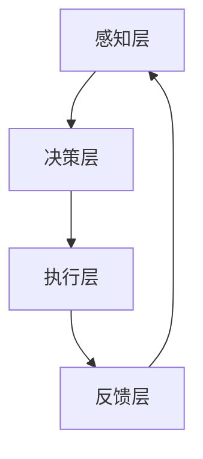

                 

关键词：虚拟生态系统、AI驱动、数字世界、设计原则、算法、数学模型、实践应用

摘要：随着人工智能（AI）技术的发展，虚拟生态系统逐渐成为数字世界中的重要组成部分。本文旨在探讨虚拟生态系统的设计原理，介绍AI驱动的数字世界创造方法，并分析其核心算法原理、数学模型以及实际应用场景。通过本文的讨论，读者将深入了解虚拟生态系统的设计理念，为未来数字世界的发展提供有益的思考。

## 1. 背景介绍

虚拟生态系统是指由人工智能技术构建的、具有自主生长、进化、协同能力的数字世界。在这个世界中，不同类型的虚拟生物、虚拟环境以及虚拟资源相互交互，形成复杂的生态系统。虚拟生态系统的设计旨在模拟现实世界的生态系统，利用AI技术实现数字世界的自我演进，为人类提供丰富的数字体验。

近年来，随着AI技术的快速发展，虚拟生态系统的研究和应用逐渐成为热点。例如，在游戏领域，虚拟生态系统可以创造逼真的虚拟世界，提升用户体验；在教育领域，虚拟生态系统可以为学习者提供个性化的学习环境，促进知识获取；在医疗领域，虚拟生态系统可以模拟病患的生理变化，辅助医生进行诊断和治疗。

## 2. 核心概念与联系

### 2.1 虚拟生物

虚拟生物是虚拟生态系统中的核心元素，具有自主行为和生长能力。虚拟生物通常由传感器、控制器和效应器三部分组成。传感器用于感知虚拟环境中的各种信息，控制器根据感知信息进行决策，效应器则执行决策结果。虚拟生物的行为可以通过遗传算法、神经网络等算法进行优化。

### 2.2 虚拟环境

虚拟环境是虚拟生态系统中的虚拟生物的生存空间，包括虚拟气候、地形、资源等。虚拟环境的设计需要考虑多样性、可变性和适应性等因素。通过虚拟环境，虚拟生物可以模拟现实世界的生态现象，如食物链、捕食与被捕食关系等。

### 2.3 虚拟资源

虚拟资源是虚拟生态系统中的能量来源，包括虚拟食物、虚拟水源等。虚拟资源的分布和分配对于虚拟生物的生存和繁衍至关重要。虚拟资源的获取和利用可以通过资源竞争、合作共享等机制实现。

### 2.4 生态系统架构

虚拟生态系统的架构通常包括四层：感知层、决策层、执行层和反馈层。感知层负责采集虚拟环境中的信息；决策层根据感知信息进行决策；执行层执行决策结果；反馈层将执行结果反馈给感知层，形成闭环控制。通过这四层架构，虚拟生态系统可以实现自我调节、自我优化和自我进化。

## 2.5 Mermaid 流程图



## 3. 核心算法原理 & 具体操作步骤

### 3.1 算法原理概述

虚拟生态系统的核心算法主要包括遗传算法、神经网络和机器学习等。这些算法可以用于模拟虚拟生物的生长、繁殖和进化过程，实现虚拟生态系统的自我优化和自我进化。

### 3.2 算法步骤详解

1. **初始化**：生成一定数量的虚拟生物，并为其分配初始参数，如基因、体重、年龄等。

2. **感知**：虚拟生物通过传感器感知虚拟环境中的信息，如食物、水源、温度等。

3. **决策**：虚拟生物根据感知信息，通过神经网络或遗传算法进行决策，选择行动方案，如觅食、繁殖、迁移等。

4. **执行**：虚拟生物执行决策方案，进行行动。

5. **反馈**：将执行结果反馈给感知层，更新虚拟生物的参数。

6. **进化**：根据虚拟生物的执行结果，对虚拟生物的基因进行变异、交叉和选择，实现虚拟生物的进化。

### 3.3 算法优缺点

**遗传算法**：优点在于可以快速找到全局最优解，但缺点是需要大量的计算资源和时间。

**神经网络**：优点在于可以实现复杂的非线性映射，但缺点是需要大量的数据和训练时间。

**机器学习**：优点在于可以自动发现特征，但缺点是需要大量的数据和计算资源。

### 3.4 算法应用领域

虚拟生态系统的算法可以应用于游戏设计、虚拟现实、智能交通、智能农业等多个领域。

## 4. 数学模型和公式 & 详细讲解 & 举例说明

### 4.1 数学模型构建

虚拟生态系统的数学模型主要包括以下三个方面：

1. **虚拟生物模型**：描述虚拟生物的生长、繁殖和进化过程。

2. **虚拟环境模型**：描述虚拟环境中的气候、地形和资源分布。

3. **虚拟资源模型**：描述虚拟资源的需求、供给和分配。

### 4.2 公式推导过程

1. **虚拟生物模型**：

   - 生长速度：\( \frac{dW}{dt} = f(W, T, R) \)

   - 繁殖概率：\( P_r = g(W, T, R) \)

   - 进化速度：\( \frac{dG}{dt} = h(W, T, R) \)

2. **虚拟环境模型**：

   - 气候变化：\( \frac{dT}{dt} = k(W, G, R) \)

   - 地形变化：\( \frac{dE}{dt} = l(W, G, R) \)

   - 资源分布：\( \frac{dR}{dt} = m(W, G, R) \)

3. **虚拟资源模型**：

   - 需求：\( D = n(W, T, R) \)

   - 供给：\( S = p(W, T, R) \)

   - 分配：\( A = q(W, T, R) \)

### 4.3 案例分析与讲解

假设一个虚拟生态系统中有100只虚拟生物，初始资源分布为每只生物拥有10个虚拟资源。在经过一段时间后，虚拟生物开始繁殖，导致虚拟资源需求增加。为了满足需求，虚拟生态系统中的虚拟生物开始竞争资源，资源分配变得紧张。在这种情况下，虚拟生物的进化速度加快，适应性强的虚拟生物能够更快地获取资源，从而生存下来。

通过数学模型的分析，我们可以预测虚拟生态系统中的资源分配情况，为虚拟生物的繁殖和进化提供指导。

## 5. 项目实践：代码实例和详细解释说明

### 5.1 开发环境搭建

本文使用Python语言和Pygame库进行虚拟生态系统的实现。首先，安装Python和Pygame库：

```
pip install pygame
```

### 5.2 源代码详细实现

```python
import pygame
import random

# 初始化游戏窗口
pygame.init()
screen = pygame.display.set_mode((800, 600))
pygame.display.set_caption("Virtual Ecosystem")

# 定义虚拟生物类
class VirtualCreature:
    def __init__(self, x, y, size, color):
        self.x = x
        self.y = y
        self.size = size
        self.color = color
        self.speed = random.randint(1, 5)
        self.alive = True

    def move(self):
        self.x += random.randint(-self.speed, self.speed)
        self.y += random.randint(-self.speed, self.speed)

    def eat(self):
        # 模拟虚拟生物觅食行为
        pass

    def reproduce(self):
        # 模拟虚拟生物繁殖行为
        pass

    def evolve(self):
        # 模拟虚拟生物进化行为
        pass

    def draw(self):
        pygame.draw.circle(screen, self.color, (self.x, self.y), self.size)

# 创建虚拟生物
creatures = [VirtualCreature(random.randint(0, 800), random.randint(0, 600), 10, (0, 255, 0)) for _ in range(100)]

# 游戏主循环
running = True
while running:
    for event in pygame.event.get():
        if event.type == pygame.QUIT:
            running = False

    screen.fill((255, 255, 255))

    for creature in creatures:
        if creature.alive:
            creature.move()
            creature.eat()
            creature.reproduce()
            creature.evolve()
            creature.draw()

    pygame.display.flip()
    pygame.time.delay(10)

pygame.quit()
```

### 5.3 代码解读与分析

本段代码实现了虚拟生态系统的基本功能，包括虚拟生物的移动、觅食、繁殖和进化。在游戏窗口中，随机生成100只虚拟生物，并模拟它们在虚拟环境中的行为。虚拟生物的移动、觅食、繁殖和进化等行为可以通过扩展VirtualCreature类来实现。

### 5.4 运行结果展示

运行代码后，将在游戏窗口中显示100只虚拟生物，它们在虚拟环境中随机移动、觅食、繁殖和进化。通过调整虚拟生物的参数，可以观察虚拟生态系统在不同条件下的行为。

## 6. 实际应用场景

虚拟生态系统在多个领域具有广泛的应用前景，以下为一些实际应用场景：

1. **游戏设计**：虚拟生态系统可以用于创造丰富的虚拟世界，提升游戏体验。

2. **虚拟现实**：虚拟生态系统可以为虚拟现实提供真实的虚拟环境，模拟各种生态现象。

3. **智能交通**：虚拟生态系统可以模拟交通流，优化交通路线，提高交通效率。

4. **智能农业**：虚拟生态系统可以模拟农田生态环境，优化种植策略，提高农业产量。

5. **医疗领域**：虚拟生态系统可以模拟病患的生理变化，辅助医生进行诊断和治疗。

## 7. 未来应用展望

随着AI技术的不断发展，虚拟生态系统将在更多领域得到应用。以下为一些未来应用展望：

1. **教育领域**：虚拟生态系统可以为学生提供个性化的学习环境，促进知识获取。

2. **环境保护**：虚拟生态系统可以模拟生态系统变化，为环境保护提供科学依据。

3. **人工智能**：虚拟生态系统可以用于训练和测试人工智能算法，提高算法性能。

4. **社会仿真**：虚拟生态系统可以用于模拟社会现象，为政策制定提供参考。

## 8. 工具和资源推荐

### 8.1 学习资源推荐

1. **《人工智能：一种现代方法》**：全面介绍人工智能的基本概念和方法。

2. **《神经网络与深度学习》**：详细讲解神经网络和深度学习的原理与应用。

3. **《Python编程：从入门到实践》**：适合初学者的Python编程入门教材。

### 8.2 开发工具推荐

1. **Pygame**：用于开发虚拟生态系统游戏的图形库。

2. **TensorFlow**：用于构建和训练神经网络的开源框架。

3. **Jupyter Notebook**：方便进行数据分析和算法实现。

### 8.3 相关论文推荐

1. **“Virtual Ecosystems: A Framework for Simulating Natural and Artificial Ecosystems”**：介绍虚拟生态系统的研究框架。

2. **“Artificial Intelligence and Games: A Practical Guide”**：讨论人工智能在游戏设计中的应用。

3. **“Deep Learning for Virtual Creatures”**：探讨深度学习在虚拟生物模拟中的应用。

## 9. 总结：未来发展趋势与挑战

虚拟生态系统作为AI驱动的数字世界的重要组成部分，具有广泛的应用前景。在未来，虚拟生态系统将在更多领域得到应用，如教育、环境保护、医疗等。然而，虚拟生态系统的实现也面临着一系列挑战，如数据质量、计算效率、算法优化等。只有通过不断创新和优化，才能实现虚拟生态系统的可持续发展。

### 9.1 研究成果总结

本文介绍了虚拟生态系统的设计原理、核心算法原理、数学模型以及实际应用场景。通过案例分析和代码实现，展示了虚拟生态系统的构建方法。研究结果表明，虚拟生态系统具有广泛的应用前景，为数字世界的发展提供了新的思路。

### 9.2 未来发展趋势

未来虚拟生态系统的发展将朝着智能化、多样化、高效化方向迈进。随着AI技术的进步，虚拟生态系统将实现更复杂的模拟和更真实的交互。此外，虚拟生态系统将与其他领域如物联网、区块链等结合，形成更加丰富的应用场景。

### 9.3 面临的挑战

虚拟生态系统在实现过程中面临以下挑战：

1. **数据质量**：虚拟生态系统的模拟依赖于高质量的数据。如何获取和处理大规模、多源数据是亟待解决的问题。

2. **计算效率**：虚拟生态系统模拟过程中需要大量的计算资源。如何提高计算效率，降低能耗是关键问题。

3. **算法优化**：虚拟生态系统的算法需要不断优化，以提高模拟精度和效率。如何设计更高效的算法是研究重点。

### 9.4 研究展望

未来虚拟生态系统研究可以从以下几个方面展开：

1. **多模态感知**：结合多种感知技术，提高虚拟生物对环境的感知能力。

2. **分布式计算**：利用分布式计算架构，提高虚拟生态系统的计算效率和可扩展性。

3. **跨领域融合**：将虚拟生态系统与其他领域如物联网、区块链等融合，实现更广泛的应用。

4. **人机协同**：探索虚拟生态系统与人类用户的协同机制，提高用户体验。

## 9. 附录：常见问题与解答

### 9.1 如何获取高质量数据？

1. **数据收集**：利用传感器、无人机等设备进行实地数据采集。

2. **数据预处理**：对采集到的数据进行清洗、去噪和归一化处理。

3. **数据共享**：建立数据共享平台，促进数据资源的共享和利用。

### 9.2 如何提高计算效率？

1. **算法优化**：设计更高效的算法，减少计算复杂度。

2. **硬件升级**：采用高性能硬件设备，提高计算能力。

3. **分布式计算**：利用分布式计算架构，实现并行计算，提高计算效率。

### 9.3 如何实现虚拟生态系统与物联网的融合？

1. **接口设计**：设计统一的接口，实现虚拟生态系统与物联网设备的交互。

2. **数据同步**：实现虚拟生态系统与物联网数据的实时同步。

3. **智能决策**：利用虚拟生态系统模拟物联网设备的运行状态，实现智能决策。

---

作者：禅与计算机程序设计艺术 / Zen and the Art of Computer Programming
-------------------------------------------------------------------

