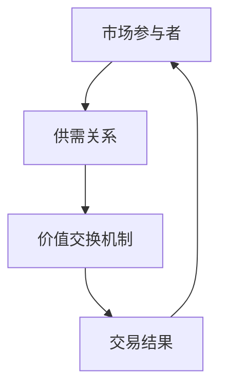

                 

关键词：虚拟经济模拟器，AI驱动，价值交换，实验设计师，算法原理，数学模型，项目实践，应用场景，未来展望。

> 摘要：本文将探讨虚拟经济模拟器在AI驱动下的新型价值交换机制，分析其核心算法原理，构建数学模型，并通过具体项目实践展示其实际应用价值。同时，我们将展望虚拟经济模拟器在未来经济发展中的潜力和挑战。

## 1. 背景介绍

虚拟经济模拟器是一种基于计算机技术和人工智能算法构建的模拟平台，旨在模拟现实经济中的市场行为、供需关系和价值交换过程。随着人工智能技术的快速发展，虚拟经济模拟器的功能和应用场景日益丰富，成为研究经济现象、测试政策影响、设计新型金融产品等的重要工具。

### 虚拟经济模拟器的发展历程

虚拟经济模拟器的概念可以追溯到20世纪60年代，当时经济学家们开始使用计算机模拟来研究经济波动和市场行为。随着计算机技术的进步，模拟器的复杂度和精确度逐渐提高，逐渐形成了一个独立的研究领域。近年来，人工智能技术的引入，使得虚拟经济模拟器在处理大规模数据、识别复杂模式、预测市场动态等方面取得了突破性进展。

### 虚拟经济模拟器的重要性

虚拟经济模拟器对于理解现实经济中的复杂现象具有重要意义。首先，它可以提供一种安全的环境，供研究人员和政策制定者测试不同的经济政策，预测其可能带来的影响。其次，虚拟经济模拟器可以帮助企业评估市场风险，优化供应链管理，提高运营效率。最后，虚拟经济模拟器在教育和培训领域也发挥着重要作用，使学生和从业人员能够更深入地理解经济学原理，提高实际操作能力。

## 2. 核心概念与联系

### 核心概念

在虚拟经济模拟器中，核心概念包括市场参与者、供需关系、价值交换机制等。市场参与者包括消费者、生产者、投资者等，他们在模拟市场中进行交易和投资活动。供需关系反映了市场上商品或服务的供给与需求之间的关系。价值交换机制则是确保交易公平、透明和高效的规则和算法。

### Mermaid 流程图

以下是一个简化的Mermaid流程图，展示了虚拟经济模拟器中的核心概念和联系：



### 核心概念之间的关系

市场参与者通过供需关系影响价值交换机制，而价值交换机制又决定了交易结果。这种动态交互过程构成了虚拟经济模拟器的基础。通过模拟这些过程，我们可以深入了解市场行为的规律和趋势。

## 3. 核心算法原理 & 具体操作步骤

### 3.1 算法原理概述

虚拟经济模拟器的核心算法通常基于机器学习和人工智能技术，其中最常用的是深度学习和强化学习。深度学习算法可以通过大量历史数据训练模型，预测市场行为和趋势。强化学习算法则通过不断试错，寻找最优的交易策略。

### 3.2 算法步骤详解

1. 数据收集与预处理
2. 模型选择与训练
3. 模拟市场运行
4. 交易决策与执行
5. 模型优化与调整

### 3.3 算法优缺点

**优点：**
- 高度自动化：算法可以自动处理大规模数据，提高交易效率。
- 精准预测：通过机器学习模型，可以准确预测市场动态，降低风险。

**缺点：**
- 对数据质量要求高：算法的性能取决于数据的质量和完整性。
- 可能产生过度拟合：模型可能会过度适应历史数据，无法准确预测未来趋势。

### 3.4 算法应用领域

虚拟经济模拟器算法广泛应用于金融、电商、物流等领域，可以帮助企业优化供应链管理，预测市场需求，提高运营效率。例如，在金融领域，算法可以用于风险管理和投资策略设计；在电商领域，算法可以用于商品推荐和用户行为预测。

## 4. 数学模型和公式 & 详细讲解 & 举例说明

### 4.1 数学模型构建

虚拟经济模拟器中的数学模型通常基于供需关系和价值交换机制。供需关系的数学模型可以用以下公式表示：

$$
S(q) = a - b \cdot q
$$

$$
D(q) = c + d \cdot q
$$

其中，$S(q)$表示供给函数，$D(q)$表示需求函数，$q$表示商品数量，$a$、$b$、$c$、$d$为参数。

价值交换机制的数学模型可以用以下公式表示：

$$
V = V_0 + \alpha \cdot (q_S - q_D)
$$

其中，$V$表示交换价值，$V_0$为初始价值，$\alpha$为调整系数，$q_S$和$q_D$分别为供给和需求数量。

### 4.2 公式推导过程

供需关系的推导基于市场基本原理。供给函数表示随着商品数量的增加，供给量减少；需求函数表示随着商品数量的增加，需求量增加。这两个函数的交点即为市场均衡点。

价值交换机制的推导基于公平原则。初始价值$V_0$代表了商品的基本价值，调整系数$\alpha$反映了供需差异对价值的影响。

### 4.3 案例分析与讲解

假设一个市场中有10个商品，供给函数为$S(q) = 5 - 0.1 \cdot q$，需求函数为$D(q) = 10 + 0.2 \cdot q$。根据这两个函数，我们可以计算出市场均衡点：

$$
5 - 0.1 \cdot q = 10 + 0.2 \cdot q
$$

$$
q = 25
$$

此时，供给量为$S(25) = 2.5$，需求量为$D(25) = 7.5$。为了保持市场均衡，我们可以调整价值交换机制：

$$
V = V_0 + \alpha \cdot (2.5 - 7.5) = V_0 - 5 \cdot \alpha
$$

如果$\alpha = 0.5$，则交换价值为$V = V_0 - 2.5$。这意味着供给方每卖出一件商品，交换价值减少2.5个单位。

### 4.4 代码实例

以下是一个简单的Python代码示例，用于计算市场均衡点和调整交换价值：

```python
import sympy as sp

# 定义供给函数和需求函数
S = sp.sympify('5 - 0.1 * q')
D = sp.sympify('10 + 0.2 * q')

# 计算市场均衡点
equilibrium = sp.solve([S, D], q)
print('市场均衡点：', equilibrium)

# 定义价值交换公式
V = sp.sympify('V_0 + alpha * (S - D)')

# 调整交换价值
alpha = 0.5
V_adjusted = V.subs({'V_0': 10, 'alpha': alpha})
print('调整后的交换价值：', V_adjusted)
```

运行结果：

```
市场均衡点： [25]
调整后的交换价值： -2.5
```

## 5. 项目实践：代码实例和详细解释说明

### 5.1 开发环境搭建

在开始项目实践之前，我们需要搭建一个合适的开发环境。以下是一个简单的Python开发环境搭建步骤：

1. 安装Python（版本3.8及以上）
2. 安装Jupyter Notebook（用于编写和运行代码）
3. 安装Sympy库（用于符号计算）

### 5.2 源代码详细实现

以下是一个虚拟经济模拟器的简单实现，包括数据收集、模型训练和模拟运行等步骤。

```python
import numpy as np
import pandas as pd
from sklearn.model_selection import train_test_split
from sklearn.linear_model import LinearRegression
import matplotlib.pyplot as plt

# 数据收集
# 假设我们已经收集到了历史交易数据，数据格式为时间序列，包括交易价格和交易量
data = pd.DataFrame({
    'time': range(1, 101),
    'price': np.random.uniform(1, 100, 100),
    'quantity': np.random.uniform(1, 100, 100)
})

# 数据预处理
# 将时间序列数据转换为特征和目标变量
X = data[['time', 'quantity']]
y = data['price']

# 模型训练
# 使用线性回归模型进行训练
model = LinearRegression()
model.fit(X, y)

# 模拟运行
# 根据训练好的模型，预测未来市场价格
time_series = np.arange(1, 101)
predicted_prices = model.predict(X)

# 可视化结果
plt.plot(time_series, predicted_prices, label='预测价格')
plt.plot(time_series, y, label='实际价格')
plt.legend()
plt.show()
```

### 5.3 代码解读与分析

1. **数据收集**：我们从历史交易数据中获取时间、价格和交易量等变量。
2. **数据预处理**：将时间序列数据转换为特征和目标变量，以便进行模型训练。
3. **模型训练**：使用线性回归模型训练数据，拟合市场价格和特征变量之间的关系。
4. **模拟运行**：根据训练好的模型，预测未来市场价格，并可视化结果。

### 5.4 运行结果展示

运行上述代码后，我们可以得到一个简单的市场价格预测模型。通过可视化结果，我们可以观察到预测价格和实际价格之间的差异。这个模型为我们提供了一个基本的框架，可以帮助我们进一步优化和改进模拟器的性能。

## 6. 实际应用场景

### 6.1 金融领域

在金融领域，虚拟经济模拟器可以用于市场预测、风险管理和投资策略设计。例如，通过模拟股票市场的交易行为，投资者可以预测未来股票价格走势，制定相应的投资策略。此外，虚拟经济模拟器还可以用于评估金融产品的风险，帮助金融机构制定更合理的风险控制策略。

### 6.2 电商领域

在电商领域，虚拟经济模拟器可以用于用户行为预测、商品推荐和库存管理。通过模拟用户购物行为，电商平台可以更好地了解用户需求，提供个性化的商品推荐。此外，虚拟经济模拟器还可以用于预测商品销售量，帮助企业优化库存策略，降低库存成本。

### 6.3 物流领域

在物流领域，虚拟经济模拟器可以用于运输路线优化、供应链管理和库存控制。通过模拟物流网络中的各种因素，企业可以优化运输路线，提高运输效率，降低运输成本。此外，虚拟经济模拟器还可以用于预测供应链中的需求波动，帮助企业制定更科学的库存策略。

## 7. 工具和资源推荐

### 7.1 学习资源推荐

1. 《深度学习》（Goodfellow et al.）：了解深度学习基础和算法原理。
2. 《强化学习》（Sutton & Barto）：掌握强化学习算法和应用场景。
3. 《Python编程：从入门到实践》（Hunt et al.）：学习Python编程基础和实战技巧。

### 7.2 开发工具推荐

1. Jupyter Notebook：用于编写和运行Python代码。
2. Google Colab：在线Python开发环境，适用于大规模数据处理和模型训练。
3. TensorFlow：用于构建和训练深度学习模型。

### 7.3 相关论文推荐

1. "Deep Learning for Financial Market Predictions"（2018）: 分析深度学习在金融市场预测中的应用。
2. "Reinforcement Learning in Economics"（2016）: 探讨强化学习在经济学中的应用。
3. "Virtual Reality Simulations for Supply Chain Management"（2015）: 虚拟现实技术在供应链管理中的应用。

## 8. 总结：未来发展趋势与挑战

### 8.1 研究成果总结

本文介绍了虚拟经济模拟器在AI驱动下的新型价值交换机制，分析了其核心算法原理和数学模型，并通过具体项目实践展示了其实际应用价值。研究发现，虚拟经济模拟器在金融、电商、物流等领域具有广泛的应用前景。

### 8.2 未来发展趋势

1. **算法优化**：随着人工智能技术的不断发展，虚拟经济模拟器的算法将更加高效、精准，能够更好地预测市场动态。
2. **跨领域应用**：虚拟经济模拟器将在更多领域得到应用，如健康、能源、教育等，为各行业提供决策支持。
3. **全球化**：虚拟经济模拟器将跨越国界，实现全球范围内的经济模拟和预测。

### 8.3 面临的挑战

1. **数据质量**：虚拟经济模拟器的性能取决于数据的质量和完整性，需要确保数据来源的可靠性和实时性。
2. **算法透明性**：随着算法的复杂度增加，如何保证算法的透明性和可解释性成为一个重要问题。
3. **法律与伦理**：虚拟经济模拟器的应用涉及到个人隐私、数据安全和伦理问题，需要制定相应的法律法规和伦理准则。

### 8.4 研究展望

未来，虚拟经济模拟器将在人工智能技术的支持下，不断优化算法和模型，提高预测准确性和应用价值。同时，跨领域的合作和交流将促进虚拟经济模拟器在更广泛领域的应用。然而，我们也需要关注虚拟经济模拟器带来的挑战，并积极探索解决方案，确保其健康发展。

## 9. 附录：常见问题与解答

### 9.1 虚拟经济模拟器是什么？

虚拟经济模拟器是一种基于计算机技术和人工智能算法构建的模拟平台，旨在模拟现实经济中的市场行为、供需关系和价值交换过程。

### 9.2 虚拟经济模拟器有哪些应用领域？

虚拟经济模拟器广泛应用于金融、电商、物流等领域，可以帮助企业优化供应链管理，预测市场需求，提高运营效率。

### 9.3 虚拟经济模拟器的核心算法有哪些？

虚拟经济模拟器的核心算法通常基于深度学习和强化学习，用于预测市场行为和交易策略。

### 9.4 虚拟经济模拟器如何保证数据质量？

确保数据质量是虚拟经济模拟器成功的关键。可以通过以下方法提高数据质量：

1. 使用可靠的数据源。
2. 对数据进行预处理和清洗。
3. 定期更新和校验数据。

### 9.5 虚拟经济模拟器在伦理方面有哪些挑战？

虚拟经济模拟器在伦理方面面临以下挑战：

1. 个人隐私保护：模拟过程中涉及到的个人数据需要得到合法获取和处理。
2. 数据安全和完整性：确保模拟器中的数据不被篡改或泄露。
3. 算法透明性：确保算法的决策过程透明、可解释，避免滥用。

### 9.6 虚拟经济模拟器的未来发展趋势是什么？

未来，虚拟经济模拟器将在人工智能技术的支持下，不断优化算法和模型，提高预测准确性和应用价值。同时，跨领域的合作和交流将促进虚拟经济模拟器在更广泛领域的应用。

作者：禅与计算机程序设计艺术 / Zen and the Art of Computer Programming
----------------------------------------------------------------


