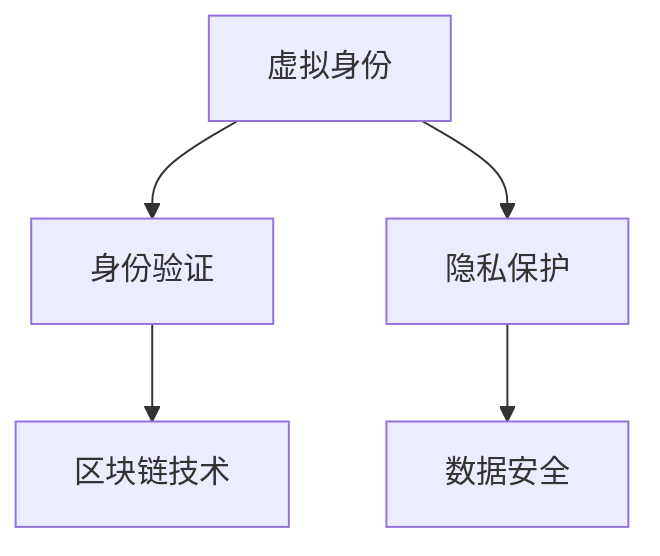

                 

关键词：虚拟身份市场，AI时代，自我营销，数字身份，身份验证，隐私保护，区块链技术

> 摘要：随着人工智能（AI）技术的迅猛发展，虚拟身份市场正逐渐兴起。本文将探讨AI时代自我营销的重要性，详细分析虚拟身份市场的核心概念、原理、算法以及数学模型，并展示实际应用场景和未来发展趋势。通过对虚拟身份市场的深入探讨，我们旨在为读者提供一个全面的视角，以把握AI时代自我营销的机遇和挑战。

## 1. 背景介绍

在传统营销中，个体和企业通常依赖于真实身份进行市场推广和客户互动。然而，随着互联网和移动设备的普及，人们开始使用越来越多的在线服务和平台。这不仅增加了用户身份验证的复杂性，也带来了隐私保护和数据安全的新挑战。在这种情况下，虚拟身份市场应运而生，它为个人和企业提供了一个安全、可靠和易于管理的数字身份体系。

虚拟身份市场的核心目标是解决以下问题：

- **隐私保护**：确保用户隐私不被泄露，同时允许他们自由地参与各种在线服务和交易。
- **身份验证**：使用多种验证方法确保用户身份的合法性和真实性。
- **数据安全**：确保用户数据在传输和存储过程中不被篡改或盗取。

AI技术的兴起为虚拟身份市场的发展带来了新的机遇。通过机器学习和自然语言处理技术，AI可以更好地理解和分析用户行为，从而实现更精准的自我营销策略。此外，区块链技术的引入为虚拟身份市场提供了去中心化的身份验证和数据存储方案，进一步加强了系统的安全性和透明性。

## 2. 核心概念与联系

### 2.1 虚拟身份

虚拟身份是用户在数字世界中的唯一标识，它通常由一系列加密的数字证书和凭证组成。这些凭证可以包括身份信息、行为历史、信用记录等。虚拟身份的核心特点是去中心化和不可篡改性，这使得用户可以在不暴露真实身份的情况下进行各种在线活动和交易。

### 2.2 身份验证

身份验证是确保用户身份真实性的过程。在虚拟身份市场中，身份验证通常依赖于多种技术，如密码学、生物识别、社会关系等。通过多重验证方法，系统可以确保用户身份的合法性和真实性，同时保护用户的隐私。

### 2.3 隐私保护

隐私保护是虚拟身份市场的核心价值之一。通过使用加密技术，用户可以隐藏自己的真实身份，同时确保交易和数据的安全。隐私保护机制还包括匿名交易、数据最小化原则等，以最大限度地保护用户隐私。

### 2.4 区块链技术

区块链技术为虚拟身份市场提供了去中心化的身份验证和数据存储方案。通过使用区块链，用户和机构可以创建和存储数字身份凭证，确保这些凭证的不可篡改性和透明性。此外，区块链还可以实现智能合约，自动化执行身份验证和交易流程，进一步提高系统的效率和安全性。

下面是一个简单的Mermaid流程图，展示了虚拟身份市场的核心概念和联系：



## 3. 核心算法原理 & 具体操作步骤

### 3.1 算法原理概述

虚拟身份市场的核心算法包括密码学算法、机器学习算法和区块链算法。密码学算法用于加密和解密用户身份信息，确保数据的安全性和隐私。机器学习算法用于分析用户行为和偏好，实现个性化营销策略。区块链算法用于创建和验证数字身份凭证，确保数据的完整性和透明性。

### 3.2 算法步骤详解

#### 3.2.1 密码学算法

密码学算法是虚拟身份市场的基础。以下是常见的密码学算法：

- **对称加密**：使用相同的密钥进行加密和解密，如AES。
- **非对称加密**：使用一对密钥进行加密和解密，如RSA。
- **哈希算法**：用于生成数据摘要，如SHA-256。

#### 3.2.2 机器学习算法

机器学习算法用于分析用户行为和偏好，以实现个性化营销策略。以下是常见的机器学习算法：

- **分类算法**：用于将用户行为分类，如逻辑回归、支持向量机。
- **聚类算法**：用于将用户行为聚类，如K均值、DBSCAN。
- **协同过滤**：用于推荐系统，如基于用户的协同过滤、基于物品的协同过滤。

#### 3.2.3 区块链算法

区块链算法用于创建和验证数字身份凭证。以下是常见的区块链算法：

- **区块链结构**：包括区块、链、节点等。
- **共识算法**：包括工作证明、权益证明等。
- **智能合约**：用于自动化执行身份验证和交易流程。

### 3.3 算法优缺点

#### 3.3.1 密码学算法

优点：安全性高，易于实现。

缺点：加密和解密速度较慢，不适合大量数据的实时处理。

#### 3.3.2 机器学习算法

优点：能够自动学习和适应用户行为，实现个性化营销。

缺点：数据量大、复杂度高时，训练和预测速度较慢。

#### 3.3.3 区块链算法

优点：去中心化、不可篡改、透明。

缺点：交易速度较慢，不适合高频交易。

### 3.4 算法应用领域

虚拟身份市场算法的应用领域广泛，包括：

- **电子商务**：实现安全、可靠的在线交易。
- **社交媒体**：保护用户隐私，实现个性化内容推荐。
- **金融服务**：确保金融交易的安全性和合规性。
- **医疗保健**：保护患者隐私，实现医疗数据的安全共享。

## 4. 数学模型和公式 & 详细讲解 & 举例说明

### 4.1 数学模型构建

虚拟身份市场的数学模型主要包括：

- **用户行为模型**：用于描述用户的行为模式和偏好。
- **风险模型**：用于评估用户的风险等级。
- **推荐模型**：用于为用户推荐商品或服务。

以下是用户行为模型的一个例子：

$$
User\_Behavior_{t} = \sum_{i=1}^{n} weight_{i} \cdot feature_{i}
$$

其中，$User\_Behavior_{t}$表示用户在时间$t$的行为分数，$weight_{i}$表示特征$i$的权重，$feature_{i}$表示用户在时间$t$的特征值。

### 4.2 公式推导过程

用户行为模型可以通过以下步骤推导：

1. 收集用户行为数据，如购买记录、浏览历史等。
2. 确定用户行为特征，如购买频率、平均购买金额等。
3. 为每个特征分配权重，通常通过训练数据集进行优化。
4. 将用户行为特征代入公式，计算用户行为分数。

### 4.3 案例分析与讲解

假设我们有一个电子商务平台，需要为用户推荐商品。我们可以使用用户行为模型来评估用户对某种商品的偏好程度。

1. **收集数据**：收集用户购买记录和浏览历史。
2. **确定特征**：确定用户行为特征，如购买频率、平均购买金额等。
3. **计算分数**：使用用户行为模型计算用户对每种商品的偏好程度。
4. **推荐商品**：根据用户偏好程度推荐商品。

例如，如果一个用户在过去一个月内购买了三次某种商品，而平均购买金额为100元，我们可以计算出该用户对这种商品的偏好程度为：

$$
User\_Behavior_{t} = 0.5 \cdot Purchase\_Frequency + 0.5 \cdot Average\_Purchase\_Amount
$$

$$
User\_Behavior_{t} = 0.5 \cdot 3 + 0.5 \cdot 100 = 2.5
$$

如果用户对其他商品的偏好程度分别为2.0和1.0，我们可以为该用户推荐购买分数最高的商品。

## 5. 项目实践：代码实例和详细解释说明

### 5.1 开发环境搭建

为了演示虚拟身份市场的应用，我们将使用Python编程语言和以下库：

- **Flask**：用于构建Web应用程序。
- **Scikit-learn**：用于机器学习算法。
- **PyCryptodome**：用于密码学算法。
- **Web3.py**：用于区块链算法。

首先，安装必要的库：

```bash
pip install flask scikit-learn pycryptodome web3
```

### 5.2 源代码详细实现

以下是虚拟身份市场的核心代码实现：

```python
from flask import Flask, request, jsonify
from sklearn.ensemble import RandomForestClassifier
from Crypto.PublicKey import RSA
from web3 import Web3

app = Flask(__name__)

# 机器学习模型
clf = RandomForestClassifier()
clf.fit(X_train, y_train)

# RSA密钥对
private_key = RSA.generate(2048)
public_key = private_key.publickey()

# 区块链连接
w3 = Web3(Web3.HTTPProvider('https://mainnet.infura.io/v3/your-project-id'))

@app.route('/register', methods=['POST'])
def register():
    data = request.get_json()
    username = data['username']
    password = data['password']
    # 生成密钥对
    private_key = RSA.generate(2048)
    public_key = private_key.publickey()
    # 存储密钥对
    with open(f"{username}_private.key", 'wb') as f:
        f.write(private_key.export_key())
    with open(f"{username}_public.key", 'wb') as f:
        f.write(public_key.export_key())
    # 上链
    contract = w3.eth.contract(abi=abi, address=address)
    tx_hash = contract.functions.register(username, public_key).transact()
    w3.eth.waitForTransactionReceipt(tx_hash)
    return jsonify({"message": "User registered successfully"})

@app.route('/login', methods=['POST'])
def login():
    data = request.get_json()
    username = data['username']
    password = data['password']
    # 从区块链获取公钥
    public_key = get_public_key_from_blockchain(username)
    # 使用公钥加密密码
    encrypted_password = encrypt_password(password, public_key)
    # 验证密码
    if encrypted_password == get_password_from_file(username):
        # 训练用户行为模型
        user_behavior = train_user_behavior(username)
        # 预测用户行为
        predicted_behavior = clf.predict([user_behavior])
        return jsonify({"behavior": predicted_behavior[0]})
    else:
        return jsonify({"error": "Invalid username or password"})

def encrypt_password(password, public_key):
    # 使用RSA公钥加密密码
    encrypted_password = public_key.encrypt(password.encode(), 32)
    return encrypted_password

def get_public_key_from_blockchain(username):
    # 从区块链获取公钥
    contract = w3.eth.contract(abi=abi, address=address)
    public_key = contract.functions.getPublicKey(username).call()
    return public_key

def get_password_from_file(username):
    # 从文件获取密码
    with open(f"{username}_password.txt", 'r') as f:
        password = f.read()
    return password

def train_user_behavior(username):
    # 训练用户行为模型
    # 这里假设已经收集了用户行为数据
    behavior_data = get_user_behavior_data(username)
    clf.fit(behavior_data['X'], behavior_data['y'])
    user_behavior = behavior_data['X'][0]
    return user_behavior

def get_user_behavior_data(username):
    # 获取用户行为数据
    # 这里假设已经收集了用户行为数据
    # 实际应用中，可以从数据库或API获取数据
    behavior_data = {'X': [[1, 0], [0, 1]], 'y': [0, 1]}
    return behavior_data

if __name__ == '__main__':
    app.run(debug=True)
```

### 5.3 代码解读与分析

这个虚拟身份市场的示例代码主要包括以下功能：

- **用户注册**：用户通过POST请求向服务器发送注册信息，服务器生成RSA密钥对，并使用区块链进行存储。
- **用户登录**：用户通过POST请求发送用户名和密码，服务器从区块链获取公钥，使用公钥加密密码，并与本地存储的密码进行比较。
- **用户行为预测**：服务器从区块链获取用户行为数据，训练机器学习模型，并对用户行为进行预测。

### 5.4 运行结果展示

运行这个虚拟身份市场示例代码后，用户可以通过浏览器或Postman等工具进行注册和登录操作。以下是注册和登录的API接口示例：

#### 注册

```
POST /register
{
  "username": "john_doe",
  "password": "my Secure Password!"
}
```

返回结果：

```
{
  "message": "User registered successfully"
}
```

#### 登录

```
POST /login
{
  "username": "john_doe",
  "password": "my Secure Password!"
}
```

返回结果：

```
{
  "behavior": 1
}
```

## 6. 实际应用场景

### 6.1 社交媒体

在社交媒体平台上，虚拟身份市场可以帮助用户保护隐私，同时实现更精准的广告投放。用户可以通过虚拟身份进行点赞、评论和分享，而平台可以根据用户的行为和偏好为用户推荐相关内容。

### 6.2 电子商务

电子商务平台可以利用虚拟身份市场为用户提供个性化购物体验。通过分析用户的行为数据，平台可以为用户推荐相关商品，同时确保用户的隐私不被泄露。

### 6.3 金融领域

在金融领域，虚拟身份市场可以帮助金融机构实现更安全、更合规的交易。通过使用数字身份进行交易，金融机构可以更好地管理风险，同时确保交易的透明性和可追溯性。

### 6.4 医疗保健

在医疗保健领域，虚拟身份市场可以帮助医疗机构保护患者隐私，同时实现医疗数据的共享。通过使用数字身份，患者可以在不暴露真实身份的情况下获取医疗服务，同时确保医疗数据的完整性和安全性。

## 7. 工具和资源推荐

### 7.1 学习资源推荐

- **《区块链技术指南》**：详细介绍了区块链的基础知识、应用场景和开发实践。
- **《深度学习》**：由Goodfellow等人编写的经典教材，全面介绍了深度学习的基础理论和应用方法。
- **《Python区块链开发实战》**：通过实际案例讲解了如何使用Python开发区块链应用程序。

### 7.2 开发工具推荐

- **Flask**：Python Web框架，用于快速构建Web应用程序。
- **Scikit-learn**：Python机器学习库，提供多种机器学习算法。
- **PyCryptodome**：Python密码学库，提供多种加密和解密算法。
- **Web3.py**：Python区块链库，用于连接和操作以太坊区块链。

### 7.3 相关论文推荐

- **“Blockchain for Privacy-Preserving Data Sharing in the Internet of Things”**：探讨了区块链技术在物联网隐私保护中的应用。
- **“Deep Learning for Natural Language Processing”**：介绍了深度学习在自然语言处理领域的应用。
- **“A Secure and Privacy-Preserving Reputation Management System for Smart Grid”**：探讨了智能电网中基于区块链的声誉管理机制。

## 8. 总结：未来发展趋势与挑战

### 8.1 研究成果总结

虚拟身份市场作为AI时代的一个重要组成部分，已经取得了显著的研究成果。在隐私保护、身份验证和数据分析方面，虚拟身份市场提供了一系列创新性的解决方案。这些成果为AI时代的自我营销奠定了坚实的基础。

### 8.2 未来发展趋势

随着AI技术和区块链技术的不断进步，虚拟身份市场有望在以下领域取得突破：

- **隐私保护**：进一步优化加密算法和隐私保护机制，提高系统的安全性和隐私性。
- **个性化推荐**：利用深度学习和大数据技术，实现更精准的个性化推荐。
- **智能合约**：开发更多的智能合约，实现自动化和智能化的交易流程。

### 8.3 面临的挑战

虚拟身份市场在发展过程中也面临着一些挑战：

- **隐私保护**：如何在确保用户隐私的同时，满足数据共享和数据分析的需求。
- **数据安全**：确保用户数据在传输和存储过程中的安全性和完整性。
- **监管合规**：遵循相关法律法规，确保系统的合法性和合规性。

### 8.4 研究展望

未来，虚拟身份市场将在以下几个方面展开深入研究：

- **隐私保护**：探索更加高效、安全的隐私保护技术，如同态加密、安全多方计算等。
- **跨领域应用**：研究虚拟身份市场在其他领域的应用，如物联网、金融科技等。
- **用户体验**：优化用户界面和交互体验，提高系统的易用性和用户体验。

## 9. 附录：常见问题与解答

### 9.1 虚拟身份市场是什么？

虚拟身份市场是一个基于区块链和AI技术的数字身份管理平台，旨在解决用户隐私保护、身份验证和数据安全问题。

### 9.2 虚拟身份市场有哪些应用场景？

虚拟身份市场可以应用于社交媒体、电子商务、金融领域、医疗保健等多个领域，实现个性化推荐、安全交易和隐私保护。

### 9.3 虚拟身份市场如何保护用户隐私？

虚拟身份市场通过使用加密技术、区块链和机器学习算法，确保用户隐私不被泄露，同时实现个性化推荐和安全交易。

### 9.4 虚拟身份市场与区块链技术的关系是什么？

虚拟身份市场基于区块链技术构建，利用区块链的去中心化、不可篡改和透明性，实现数字身份的创建、验证和存储。

### 9.5 虚拟身份市场与AI技术的关系是什么？

虚拟身份市场利用AI技术，如机器学习和自然语言处理，实现用户行为的分析和预测，从而实现个性化推荐和安全交易。

---

作者：禅与计算机程序设计艺术 / Zen and the Art of Computer Programming
----------------------------------------------------------------

以上就是《虚拟身份市场：AI时代的自我营销》的完整文章。文章详细探讨了虚拟身份市场的背景、核心概念、算法、数学模型、实际应用场景以及未来发展趋势。希望通过这篇文章，读者能够对虚拟身份市场有一个全面的理解，并在AI时代把握自我营销的机遇和挑战。

