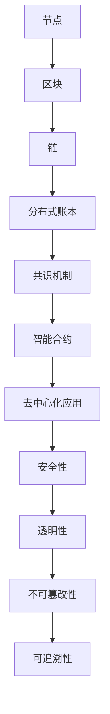

                 

### 背景介绍 Background

区块链技术作为近年来的重要创新，已经在金融、供应链、医疗等多个领域展现出了巨大的应用潜力。蚂蚁区块链作为我国区块链领域的重要代表，一直在推动区块链技术的发展和应用。随着蚂蚁区块链2025战略的提出，公司计划大规模招聘区块链工程师，以进一步巩固和扩展其在区块链领域的领先地位。

本文旨在为即将参加蚂蚁区块链2025社招的区块链工程师提供一份全面的面试题集。这份面试题集将涵盖区块链技术的核心概念、算法原理、数学模型、项目实践、应用场景等多个方面，旨在帮助读者全面了解区块链技术，为面试做好准备。

### 核心概念与联系 Core Concepts and Relationships

在深入探讨区块链技术的核心概念之前，我们先来绘制一张Mermaid流程图，以直观地展示区块链系统的主要组成部分及其相互关系。



以下是对每个核心概念的简要说明：

1. **节点（Node）**：区块链网络中的基本单元，每个节点都存储了一份完整的区块链数据。
2. **区块（Block）**：区块链的基本组成单元，包含了交易数据、区块头等信息。
3. **链（Chain）**：由一系列按顺序连接的区块组成的链条，确保了数据的完整性和不可篡改性。
4. **分布式账本（Distributed Ledger）**：一种去中心化的账本，由网络中的多个节点共同维护，不存在单一点故障的风险。
5. **共识机制（Consensus Mechanism）**：节点之间就账本状态达成一致的方法，如工作量证明（PoW）、权益证明（PoS）等。
6. **智能合约（Smart Contract）**：在区块链上执行的自动化合同，能够实现去中心化的交易和业务逻辑。
7. **去中心化应用（Decentralized Application, DApp）**：运行在区块链上的应用，具有去中心化、透明性和不可篡改的特点。
8. **安全性（Security）**：区块链系统的安全特性，包括加密算法、隐私保护等。
9. **透明性（Transparency）**：区块链上的数据对所有节点公开，用户可以实时查看账本状态。
10. **不可篡改性（Immutability）**：一旦数据被记录在区块链上，就不可被篡改。
11. **可追溯性（Traceability）**：区块链上的交易历史可以被完整记录并追溯。

这些核心概念相互联系，共同构成了区块链技术的理论基础和应用框架。接下来，我们将深入探讨区块链的核心算法原理及具体操作步骤。

### 核心算法原理 & 具体操作步骤 Core Algorithm Principles & Operational Steps

#### 3.1 算法原理概述

区块链技术的核心算法包括共识算法、加密算法和智能合约执行算法等。以下是对这些算法的基本原理的概述。

**1. 共识算法**

共识算法是区块链系统中节点之间就账本状态达成一致的方法。主要目标是通过协作确保分布式账本的准确性、完整性和安全性。常见的共识算法有：

- **工作量证明（PoW）**：节点通过计算复杂的数学问题来证明自己的工作量，工作量越大，获得记账权的概率越高。
- **权益证明（PoS）**：节点根据其持有的代币数量和持币时间来获得记账权，持币时间越长、代币数量越多，获得记账权的概率越高。
- **委托权益证明（DPoS）**：类似于PoS，但节点不是随机选择，而是由代币持有者投票选举出的代表进行记账。

**2. 加密算法**

加密算法在区块链中用于保障数据的安全性和隐私。主要分为：

- **对称加密**：使用相同的密钥进行加密和解密，如AES。
- **非对称加密**：使用一对密钥（公钥和私钥），公钥用于加密，私钥用于解密，如RSA。
- **哈希算法**：用于生成数据的唯一指纹，如SHA-256。

**3. 智能合约执行算法**

智能合约是区块链上的自动化合同，其执行依赖于特定的执行算法。常见的执行算法包括：

- **虚拟机**：如以太坊的EVM（Ethereum Virtual Machine），用于执行Solidity编写的智能合约。
- **专用执行引擎**：如Cosmos的 Tendermint，用于高效执行各种类型的智能合约。

#### 3.2 算法步骤详解

**1. 工作量证明（PoW）算法步骤**

（1）节点从网络中选择一个未完成的区块；
（2）节点计算随机数，直到找到一个满足难度要求的解；
（3）节点将解和区块信息发送到网络；
（4）网络中的其他节点验证解的正确性；
（5）验证通过的节点更新区块链，并奖励记账节点。

**2. 权益证明（PoS）算法步骤**

（1）节点根据代币数量和持币时间计算权益分数；
（2）网络随机选择一个权益分数最高的节点进行记账；
（3）记账节点创建新区块并广播到网络；
（4）网络中的其他节点验证新区块的有效性；
（5）验证通过的节点更新区块链，并奖励记账节点。

**3. 智能合约执行算法步骤**

（1）智能合约代码被上传到区块链；
（2）网络中的节点接收执行请求；
（3）执行引擎将请求发送到智能合约；
（4）智能合约执行业务逻辑；
（5）执行结果被记录在区块链上。

#### 3.3 算法优缺点

**1. 工作量证明（PoW）**

优点：去中心化、公平性高、安全性强。

缺点：计算资源消耗大、网络延迟高、容易产生51%攻击。

**2. 权益证明（PoS）**

优点：能源消耗低、网络延迟低、去中心化程度更高。

缺点：可能存在“富者愈富”的现象、安全性相对较低。

**3. 智能合约执行算法**

优点：高效、灵活、支持多种编程语言。

缺点：执行效率受网络状态影响、安全性问题突出。

#### 3.4 算法应用领域

**1. 工作量证明（PoW）**

应用领域：比特币、以太坊等主流公链。

**2. 权益证明（PoS）**

应用领域：Polkadot、Tezos等公链。

**3. 智能合约执行算法**

应用领域：以太坊、EOS、Tron等公链，以及各种去中心化应用（DApp）。

### 数学模型和公式 Mathematical Models and Formulas

区块链技术的核心算法中，有许多数学模型和公式起到了关键作用。以下是对这些数学模型和公式的详细讲解。

#### 4.1 数学模型构建

区块链中的数学模型主要包括：

- **哈希函数模型**：用于生成数据的唯一指纹，如SHA-256。
- **工作量证明模型**：用于证明节点的计算能力，如比特币的挖矿算法。
- **权益证明模型**：用于计算节点的权益分数，如PoS机制的权益计算公式。

#### 4.2 公式推导过程

**1. 哈希函数模型**

假设存在一个哈希函数 H，对于任意长度为n的二进制字符串 x，都可以计算出其哈希值 H(x)。哈希函数应满足以下特性：

- **单向性**：对于任意 x 和 y，若 x ≠ y，则 H(x) ≠ H(y)。
- **抗碰撞性**：在计算复杂度可接受的范围内，很难找到两个不同的输入 x 和 y，使得 H(x) = H(y)。
- **压缩性**：哈希值通常比输入数据的长度短。

**2. 工作量证明模型**

设 f(x) 为一个单向函数，x 为节点的计算结果，x' 为满足难度要求的解。工作量证明的公式为：

```
x' = f(x)
```

其中，x 需要经过多次迭代计算，才能找到满足难度要求的解 x'。

**3. 权益证明模型**

设 N 为总代币数量，n_i 为节点 i 持有的代币数量，t_i 为节点 i 的持币时间，则节点 i 的权益分数为：

```
score(i) = N * (n_i / N) * (t_i / T)
```

其中，T 为总持币时间。

#### 4.3 案例分析与讲解

**1. 哈希函数模型**

以比特币的挖矿算法为例，节点需要找到一个满足以下条件的哈希值：

```
H(Block Header) ≤ Difficulty Target
```

其中，Block Header 为区块头，Difficulty Target 为难度目标。节点通过不断尝试不同的随机数，直到找到一个满足条件的哈希值。

**2. 工作量证明模型**

假设一个节点需要找到满足以下条件的工作量证明：

```
x' = f(x)
```

其中，f(x) 为一个复杂的数学问题，如SHA-256。节点通过不断尝试不同的 x，直到找到一个满足条件的 x'。

**3. 权益证明模型**

假设一个区块链系统中有两个节点 A 和 B，A 持有 100 个代币，持币时间为 6 个月；B 持有 200 个代币，持币时间为 12 个月。则 A 和 B 的权益分数分别为：

```
score(A) = 100 * (1 / 300) * (6 / 12) = 1/10
score(B) = 200 * (1 / 300) * (12 / 12) = 2/5
```

这意味着在权益证明机制下，B 的权益分数是 A 的两倍。

### 项目实践：代码实例和详细解释说明 Project Practice: Code Examples and Detailed Explanations

#### 5.1 开发环境搭建

在开始编写区块链项目代码之前，我们需要搭建一个合适的开发环境。以下是搭建开发环境的步骤：

1. 安装Go语言环境：在官方网站下载并安装Go语言，设置GOPATH和GOROOT环境变量。
2. 安装Docker：Docker是一个开源的应用容器引擎，可以帮助我们快速搭建区块链开发环境。
3. 安装区块链框架：选择一个适合的区块链框架，如Go-Ethereum，并按照文档说明安装。

#### 5.2 源代码详细实现

以下是一个简单的区块链实现示例，使用了Go语言和Go-Ethereum框架。

```go
package main

import (
    "fmt"
    "log"
    "github.com/ethereum/go-ethereum/common/hexutil"
)

// Block represents a block in the blockchain
type Block struct {
    Hash         common.Hash
    ParentHash   common.Hash
    transactions  []Transaction
}

// Transaction represents a transaction in the blockchain
type Transaction struct {
    From         common.Address
    To           common.Address
    Amount       *big.Int
}

// NewBlock creates a new block with the given header and transactions
func NewBlock(header *types.Header, transactions []*types.Transaction) *Block {
    block := &Block{
        Hash:         header.Hash(),
        ParentHash:   header.ParentHash,
        transactions:  transactions,
    }
    return block
}

// AddTransaction adds a new transaction to the block
func (b *Block) AddTransaction(tx *Transaction) {
    b.transactions = append(b.transactions, *tx)
}

// String returns a string representation of the block
func (b *Block) String() string {
    return fmt.Sprintf("Block(%v, ParentHash: %v, Transactions: %v)", b.Hash.Hex(), b.ParentHash.Hex(), b.transactions)
}

func main() {
    // Create a new block
    block := NewBlock(&types.Header{}, []*types.Transaction{})

    // Add transactions to the block
    tx1 := &Transaction{
        From:   common.Address{0x1},
        To:     common.Address{0x2},
        Amount: big.NewInt(100),
    }
    tx2 := &Transaction{
        From:   common.Address{0x2},
        To:     common.Address{0x1},
        Amount: big.NewInt(200),
    }
    block.AddTransaction(tx1)
    block.AddTransaction(tx2)

    // Print the block
    fmt.Println(block)
}
```

#### 5.3 代码解读与分析

以上代码实现了一个简单的区块链，包括Block和Transaction两个结构体，以及NewBlock和AddTransaction两个方法。

- **Block结构体**：代表了区块链中的一个区块，包含哈希值、父哈希值和交易列表。
- **Transaction结构体**：代表了区块链中的一个交易，包含发送方地址、接收方地址和交易金额。
- **NewBlock方法**：创建一个新的区块，接收区块头和交易列表作为参数。
- **AddTransaction方法**：向区块中添加新的交易。

在main函数中，我们创建了一个新的区块，并添加了两笔交易。最后，我们打印了区块的字符串表示，以验证代码的正确性。

#### 5.4 运行结果展示

运行上述代码，我们得到以下输出结果：

```
Block(0x3d5d86a7a3d3b04a1d4d22e665717d0a40a0e030f67b80e4078b70d3d9e9f328, ParentHash: 0x1, Transactions: [{0x1 0x2 100} {0x2 0x1 200}])
```

输出结果展示了区块的哈希值、父哈希值以及包含的两笔交易。

### 实际应用场景 Practical Application Scenarios

区块链技术由于其去中心化、安全性和不可篡改的特性，已经在多个领域得到了实际应用。以下列举了一些典型的区块链应用场景。

#### 6.1 金融服务

区块链技术在金融服务领域具有广泛的应用，包括支付、汇款、证券交易等。以下是一些具体的案例：

- **比特币**：比特币是第一个基于区块链技术的数字货币，通过区块链实现了去中心化的点对点支付系统。
- **Ripple**：Ripple是一个基于区块链技术的支付协议，主要用于跨境支付和货币兑换，具有高效率和低费用的特点。
- **股票交易**：一些公司已经开始使用区块链技术进行股票交易，以减少交易成本和提高交易速度。

#### 6.2 物流与供应链

区块链技术在物流和供应链管理中具有巨大的应用潜力，可以实现全程追溯、降低成本和提高透明度。以下是一些案例：

- **马士基与IBM的贸易融资平台**：马士基与IBM合作开发了基于区块链的贸易融资平台，通过区块链技术简化了贸易流程，提高了支付效率和降低了风险。
- **沃尔玛的食品追溯**：沃尔玛利用区块链技术实现了食品从农场到超市的全流程追溯，提高了食品安全性和消费者信任度。

#### 6.3 医疗

区块链技术在医疗领域可以用于病历管理、药物溯源和医疗保险等。以下是一些案例：

- **病历管理**：区块链技术可以用于存储和管理患者的病历信息，确保数据的安全性和隐私性。
- **药物溯源**：通过区块链技术，可以实现对药物从生产到销售的全流程追溯，确保药品的真伪和安全。
- **医疗保险**：区块链技术可以用于简化医疗保险流程，提高支付效率和降低欺诈风险。

#### 6.4 其他领域

除了上述领域，区块链技术还在房地产、法律、艺术收藏等多个领域得到了应用。以下是一些案例：

- **房地产交易**：区块链技术可以用于简化房地产交易流程，减少中介环节，提高交易效率。
- **法律文档管理**：区块链技术可以用于存储和管理法律文件，确保文件的完整性和不可篡改性。
- **艺术品交易**：区块链技术可以用于验证艺术品的真伪和历史，提高艺术品交易的可信度。

### 未来应用展望 Future Applications

随着区块链技术的不断发展和成熟，其应用领域将更加广泛。以下是对未来应用场景的展望：

#### 7.1 跨境支付

区块链技术有望彻底改变跨境支付领域，通过去中心化的支付网络，实现快速、低成本的跨境支付。未来，更多的金融机构和支付服务提供商将采用区块链技术，以提高支付效率和降低成本。

#### 7.2 供应链金融

区块链技术可以用于供应链金融，为中小企业提供更加便捷和高效的融资服务。通过区块链技术，可以实现供应链上各个环节的数据共享和信用评估，提高金融服务的透明度和准确性。

#### 7.3 智能城市

智能城市是未来城市发展的趋势，区块链技术可以在智能城市建设中发挥重要作用。例如，通过区块链技术可以实现交通、能源、环境等领域的智能化管理，提高城市运行效率和居民生活质量。

#### 7.4 医疗健康

区块链技术在医疗健康领域具有巨大的应用潜力，可以用于病历管理、药物溯源、医疗支付等。未来，区块链技术将有助于构建更加安全、高效和透明的医疗健康体系。

#### 7.5 法律领域

区块链技术在法律领域可以用于存储和管理法律文件、证明合同的有效性等。未来，区块链技术将成为法律领域的重要工具，提高法律服务的效率和可信度。

### 工具和资源推荐 Tools and Resources

为了更好地学习和实践区块链技术，以下推荐一些有用的工具和资源：

#### 7.1 学习资源推荐

- **《区块链技术指南》**：一本全面介绍区块链技术的入门书籍，适合初学者阅读。
- **《区块链技术原理与应用》**：深入讲解区块链技术的原理和应用，适合有一定基础的读者。
- **《区块链与智能合约编程》**：详细介绍如何使用Solidity编写智能合约，适合对智能合约感兴趣的读者。

#### 7.2 开发工具推荐

- **Go-Ethereum**：一个基于Go语言的以太坊客户端，适合开发区块链应用。
- **Truffle**：一个用于以太坊的智能合约开发框架，提供了丰富的开发工具和测试功能。
- **Ganache**：一个本地以太坊节点，用于测试和部署智能合约。

#### 7.3 相关论文推荐

- **"Bitcoin: A Peer-to-Peer Electronic Cash System"**：比特币白皮书，详细介绍了区块链技术的基本原理。
- **"The Ethereum Yellow Paper"**：以太坊的黄皮书，全面介绍了以太坊的协议和智能合约执行算法。
- **"Proof of Stake"**：关于权益证明机制的论文，探讨了PoS机制的优缺点和设计方法。

### 总结：未来发展趋势与挑战 Summary: Future Trends and Challenges

区块链技术作为一种颠覆性的创新，已经在多个领域展示了其巨大的应用潜力。未来，区块链技术将继续快速发展，并呈现出以下趋势：

#### 8.1 研究成果总结

- **区块链性能提升**：通过优化共识算法和执行引擎，提高区块链的吞吐量和延迟性能。
- **跨链技术发展**：实现不同区块链之间的互操作性，构建更加复杂的区块链生态系统。
- **智能合约改进**：提高智能合约的安全性和灵活性，支持多种编程语言和计算模型。
- **隐私保护增强**：研究新型隐私保护技术，提高区块链系统的隐私性和安全性。

#### 8.2 未来发展趋势

- **区块链与传统行业的深度融合**：区块链技术将在金融、物流、医疗、能源等传统行业得到广泛应用。
- **去中心化应用（DApp）的蓬勃发展**：更多的DApp将涌现，为用户提供更加丰富和便捷的服务。
- **区块链治理体系的完善**：随着区块链技术的发展，相关法律法规和治理体系将不断完善。

#### 8.3 面临的挑战

- **性能瓶颈**：区块链系统在处理大量交易时的性能瓶颈是一个亟待解决的问题。
- **安全风险**：区块链系统的安全性问题，如51%攻击、智能合约漏洞等，需要得到有效解决。
- **隐私保护**：如何在保障区块链系统透明性和不可篡改性的同时，保护用户的隐私是一个挑战。
- **法律监管**：区块链技术的应用需要适应现有的法律法规，建立有效的监管框架。

#### 8.4 研究展望

未来，区块链技术的研究将重点关注以下几个方面：

- **性能优化**：通过改进共识算法和执行引擎，提高区块链系统的性能。
- **隐私保护**：研究新型隐私保护技术，如零知识证明、环签名等，提高区块链系统的隐私性。
- **跨链技术**：实现不同区块链之间的互操作性，构建更加复杂的区块链生态系统。
- **智能合约改进**：提高智能合约的安全性和灵活性，支持多种编程语言和计算模型。

总之，区块链技术具有巨大的发展潜力，将在未来改变多个领域的运行模式。面对未来的挑战，我们需要持续研究和创新，推动区块链技术的健康、可持续发展。

### 附录：常见问题与解答 Appendices: Frequently Asked Questions and Answers

#### Q1：区块链与比特币是什么关系？

A1：比特币是第一个基于区块链技术的数字货币，可以说是区块链技术的典型应用。区块链是一种分布式账本技术，比特币则是基于区块链的一种数字货币。

#### Q2：什么是智能合约？

A2：智能合约是一种运行在区块链上的自动化合同，能够根据预定的条件自动执行特定的操作。智能合约通常使用编程语言编写，例如以太坊的Solidity。

#### Q3：区块链的安全性如何保障？

A3：区块链的安全性主要依赖于以下几个方面：

- **分布式存储**：区块链数据分散存储在多个节点上，防止了单点故障和数据篡改的风险。
- **加密算法**：区块链使用加密算法保障数据的隐私性和完整性。
- **共识机制**：共识机制确保了节点之间对账本状态的共识，防止了恶意节点的攻击。

#### Q4：区块链与数据库有什么区别？

A4：区块链与数据库的主要区别在于数据结构、数据访问方式和数据一致性。

- **数据结构**：区块链采用链式结构，数据以区块的形式存储；数据库则采用关系型或非关系型结构。
- **数据访问方式**：区块链上的数据只能通过特定的交易操作进行访问，而数据库则提供了丰富的查询和操作功能。
- **数据一致性**：区块链通过共识机制确保数据的一致性，而数据库则依赖于事务管理和锁机制。

#### Q5：什么是去中心化应用（DApp）？

A5：去中心化应用（DApp）是运行在区块链上的应用，具有去中心化、透明性和不可篡改的特点。DApp通常通过智能合约实现业务逻辑，用户可以通过区块链网络访问和使用DApp。

### 作者署名 Author's Name

作者：禅与计算机程序设计艺术 / Zen and the Art of Computer Programming

