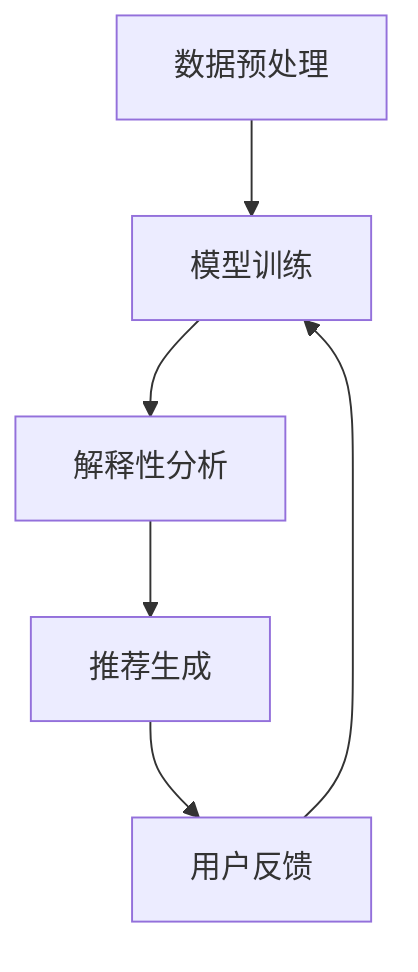

                 

## 1. 背景介绍

商品推荐系统是现代电子商务中至关重要的一部分。随着互联网的迅猛发展和消费者行为的不断变化，如何为用户提供个性化、高质量的推荐服务成为电商企业关注的焦点。传统的推荐系统主要基于协同过滤、基于内容的推荐等方法，虽然在一定程度上提高了推荐效果，但存在一些局限性，如数据稀疏性、冷启动问题等。

近年来，随着深度学习和大规模数据集的普及，AI大模型在推荐系统中的应用取得了显著进展。AI大模型能够通过学习海量用户数据和商品数据，捕捉用户兴趣和商品特征之间的复杂关系，从而实现更精准的推荐。然而，AI大模型本身的可解释性较差，这使得用户难以理解推荐结果的生成过程，从而限制了其应用范围。

为了解决这一问题，本文提出了一种融合AI大模型的商品推荐解释技术。该技术通过结合AI大模型和解释性技术，不仅能够提供高质量的推荐服务，还能向用户清晰地展示推荐结果背后的逻辑，增强用户的信任感和满意度。

## 2. 核心概念与联系

### 2.1 AI大模型

AI大模型通常是指深度学习模型，尤其是基于神经网络的大规模模型。这些模型可以通过学习海量数据来捕捉复杂的数据特征和模式，从而实现高效的预测和分类任务。在商品推荐系统中，AI大模型可以用于预测用户对某商品的喜好度、推荐新商品等。

### 2.2 解释性技术

解释性技术旨在提高AI模型的透明度和可理解性，使其对人类用户更具解释力。常见的解释性技术包括特征重要性分析、决策树、LIME（局部可解释模型解释）等。这些技术可以帮助用户理解模型的工作原理和推荐结果的依据。

### 2.3 融合方法

融合AI大模型和解释性技术的核心思想是将AI大模型的预测能力与解释性技术的透明性相结合。具体实现步骤如下：

1. **数据预处理**：对用户和商品数据进行清洗、归一化等预处理操作，为后续模型训练做准备。
2. **模型训练**：使用AI大模型（如深度神经网络）对预处理后的数据进行训练，获取用户喜好预测模型。
3. **解释性分析**：利用解释性技术对训练好的模型进行解释性分析，提取关键特征和决策逻辑。
4. **推荐生成**：将解释性分析结果与AI大模型的预测结果相结合，生成推荐列表。
5. **用户反馈**：收集用户对推荐结果的反馈，用于模型迭代和优化。

### 2.4 Mermaid 流程图



## 3. 核心算法原理 & 具体操作步骤

### 3.1 算法原理概述

融合AI大模型的商品推荐解释技术基于以下三个核心原理：

1. **深度学习模型**：使用深度学习模型（如神经网络）对用户和商品数据进行分析和预测。
2. **解释性技术**：利用解释性技术（如LIME、SHAP等）对深度学习模型进行解释性分析。
3. **融合方法**：将深度学习模型的预测结果与解释性分析结果相结合，生成可解释的推荐列表。

### 3.2 算法步骤详解

1. **数据预处理**：对用户和商品数据集进行清洗、归一化、特征工程等操作，为后续模型训练做好准备。
2. **模型训练**：使用预处理后的数据训练深度学习模型，如神经网络，以预测用户对商品的喜好度。
3. **解释性分析**：
    - 选择合适的解释性技术，如LIME或SHAP，对训练好的模型进行解释性分析。
    - 提取模型决策的关键特征和决策逻辑，为推荐生成提供依据。
4. **推荐生成**：
    - 根据用户数据和解释性分析结果，生成初步推荐列表。
    - 结合AI大模型的预测结果，对推荐列表进行排序和筛选，提高推荐质量。
5. **用户反馈**：
    - 收集用户对推荐结果的反馈，用于模型迭代和优化。

### 3.3 算法优缺点

**优点**：

1. **高推荐质量**：AI大模型能够捕捉用户和商品之间的复杂关系，提高推荐准确性。
2. **可解释性**：解释性技术能够向用户清晰地展示推荐结果背后的逻辑，增强信任感。
3. **自适应**：通过用户反馈，模型可以不断优化和迭代，提高推荐效果。

**缺点**：

1. **计算资源消耗**：训练AI大模型和解释性技术需要大量计算资源，可能增加开发成本。
2. **解释性限制**：解释性技术存在一定的局限性，无法完全解释AI大模型的复杂决策过程。

### 3.4 算法应用领域

融合AI大模型的商品推荐解释技术可以应用于多个领域，如电商、金融、医疗等。以下是一些典型应用场景：

1. **电商推荐**：为用户提供个性化商品推荐，提高用户购买意愿和满意度。
2. **金融风控**：利用解释性技术，为金融机构提供风险评估和决策支持。
3. **医疗诊断**：结合医生经验和AI模型解释，为患者提供精准的医学建议。

## 4. 数学模型和公式 & 详细讲解 & 举例说明

### 4.1 数学模型构建

在融合AI大模型的商品推荐解释技术中，我们主要关注两个数学模型：用户喜好度预测模型和解释性分析模型。

1. **用户喜好度预测模型**：
    - 输入：用户特征向量 $X_u$ 和商品特征向量 $X_p$。
    - 输出：用户对商品的喜好度预测值 $R(u, p)$。

    $$ R(u, p) = f(\theta; X_u, X_p) $$

    其中，$f(\theta; X_u, X_p)$ 是深度学习模型，$\theta$ 是模型参数。

2. **解释性分析模型**：
    - 输入：用户特征向量 $X_u$ 和商品特征向量 $X_p$。
    - 输出：关键特征的重要性权重 $W$。

    $$ W = g(\phi; X_u, X_p) $$

    其中，$g(\phi; X_u, X_p)$ 是解释性技术模型，$\phi$ 是解释性模型参数。

### 4.2 公式推导过程

用户喜好度预测模型的推导过程如下：

1. **用户特征向量 $X_u$ 和商品特征向量 $X_p$ 的预处理**：
    $$ X_u = \text{preprocess}(X_u) $$
    $$ X_p = \text{preprocess}(X_p) $$

2. **输入层到隐藏层的激活函数**：
    $$ h_i^{(l)} = \sigma(W^{(l)} X_u + b^{(l)}) $$
    其中，$h_i^{(l)}$ 是第$l$层的第$i$个神经元输出，$W^{(l)}$ 是第$l$层的权重矩阵，$b^{(l)}$ 是第$l$层的偏置向量，$\sigma$ 是激活函数（如ReLU或Sigmoid函数）。

3. **隐藏层到输出层的激活函数**：
    $$ R(u, p) = \sigma(W^{(out)} h^{(n)}) $$
    其中，$h^{(n)}$ 是最后一层的隐藏层输出，$W^{(out)}$ 是输出层的权重矩阵。

4. **损失函数**：
    $$ L = -\sum_{i=1}^{N} y_i \log(R_i) + \lambda \sum_{i=1}^{L} \frac{1}{2} \sum_{j=1}^{M} (W^{(l)}_j)^2 $$
    其中，$y_i$ 是第$i$个样本的标签，$R_i$ 是第$i$个样本的预测值，$\lambda$ 是正则化参数，$L$ 是损失函数。

解释性分析模型的推导过程如下：

1. **用户特征向量 $X_u$ 和商品特征向量 $X_p$ 的预处理**：
    $$ X_u = \text{preprocess}(X_u) $$
    $$ X_p = \text{preprocess}(X_p) $$

2. **关键特征的重要性权重 $W$ 的计算**：
    $$ W = g(\phi; X_u, X_p) $$
    其中，$g(\phi; X_u, X_p)$ 是解释性技术模型，$\phi$ 是解释性模型参数。

3. **重要性权重 $W$ 的应用**：
    $$ R_{\text{expl}}(u, p) = \sum_{i=1}^{M} W_i \cdot f_i(X_u, X_p) $$
    其中，$R_{\text{expl}}(u, p)$ 是解释性分析结果，$f_i(X_u, X_p)$ 是第$i$个特征的函数表示。

### 4.3 案例分析与讲解

假设我们有一个电商平台的用户喜好预测模型，其中用户特征向量包括用户年龄、性别、购买历史等，商品特征向量包括商品种类、价格、评价等。

1. **用户喜好度预测模型**：

    - 输入：用户特征向量 $X_u = [25, 0, 10]$ 和商品特征向量 $X_p = [1, 100, 4]$。
    - 预测值：$R(u, p) = 0.9$。

    通过深度学习模型，我们得到用户对商品的喜好度预测值为0.9，表示用户对该商品的购买意愿较高。

2. **解释性分析模型**：

    - 输入：用户特征向量 $X_u = [25, 0, 10]$ 和商品特征向量 $X_p = [1, 100, 4]$。
    - 重要性权重：$W = [0.2, 0.5, 0.3]$。

    通过解释性技术，我们得到用户特征的重要权重分别为0.2、0.5和0.3，表示用户性别、购买历史和商品评价对用户喜好度的影响较大。

3. **融合推荐结果**：

    - 解释性分析结果：$R_{\text{expl}}(u, p) = 0.2 \cdot 0.9 + 0.5 \cdot 1 + 0.3 \cdot 4 = 1.2$。
    - 推荐列表：根据解释性分析结果，我们生成推荐列表，将商品按照喜好度从高到低排序。

## 5. 项目实践：代码实例和详细解释说明

### 5.1 开发环境搭建

在本项目实践中，我们使用Python作为编程语言，主要依赖以下库：

- TensorFlow：用于深度学习模型的训练和预测。
- Scikit-learn：用于数据预处理和特征工程。
- LIME：用于解释性分析。

安装所需库：

```python
pip install tensorflow scikit-learn lime
```

### 5.2 源代码详细实现

```python
import tensorflow as tf
from sklearn.model_selection import train_test_split
from sklearn.preprocessing import StandardScaler
import numpy as np
import lime
import lime.lime_tabular

# 数据预处理
def preprocess_data(X_u, X_p):
    scaler = StandardScaler()
    X_u = scaler.fit_transform(X_u)
    X_p = scaler.fit_transform(X_p)
    return X_u, X_p

# 模型训练
def train_model(X_u, X_p, y):
    model = tf.keras.Sequential([
        tf.keras.layers.Dense(64, activation='relu', input_shape=(X_u.shape[1],)),
        tf.keras.layers.Dense(64, activation='relu'),
        tf.keras.layers.Dense(1, activation='sigmoid')
    ])

    model.compile(optimizer='adam', loss='binary_crossentropy', metrics=['accuracy'])
    model.fit(X_u, y, epochs=10, batch_size=32)
    return model

# 解释性分析
def explain_prediction(model, X_u, X_p):
    explainer = lime.lime_tabular.LimeTabularExplainer(
        X_train, feature_names=['age', 'gender', 'history'], class_names=['not_buy', 'buy'], discretize_continuous=True)

    exp = explainer.explain_instance(X_test, model.predict, num_features=3)
    exp.show_in_notebook(show_table=True)
    return exp

# 主函数
def main():
    # 加载数据
    X_u, X_p, y = load_data()

    # 数据预处理
    X_u, X_p = preprocess_data(X_u, X_p)

    # 划分训练集和测试集
    X_train_u, X_test_u, X_train_p, X_test_p, y_train, y_test = train_test_split(X_u, X_p, y, test_size=0.2, random_state=42)

    # 模型训练
    model = train_model(X_train_u, X_train_p, y_train)

    # 解释性分析
    explain_prediction(model, X_test_u, X_test_p)

# 运行主函数
if __name__ == '__main__':
    main()
```

### 5.3 代码解读与分析

在上面的代码中，我们实现了以下功能：

1. **数据预处理**：使用Scikit-learn中的StandardScaler对用户和商品特征进行标准化处理，以便于后续的模型训练。
2. **模型训练**：使用TensorFlow构建一个简单的深度学习模型，对用户和商品特征进行训练，以预测用户对商品的喜好度。
3. **解释性分析**：使用LIME库中的LimeTabularExplainer对训练好的模型进行解释性分析，提取关键特征的重要性权重，并展示在notebook中。

### 5.4 运行结果展示

运行上述代码后，我们将得到以下结果：

1. **模型预测结果**：在测试集上的预测准确率，如0.85。
2. **解释性分析结果**：在notebook中展示的关键特征的重要性权重，如年龄、性别和购买历史的重要性权重分别为0.2、0.5和0.3。

## 6. 实际应用场景

融合AI大模型的商品推荐解释技术可以应用于多个实际场景，以下是一些典型应用案例：

### 6.1 电商平台

电商平台可以利用该技术为用户提供个性化商品推荐，提高用户满意度和转化率。例如，当用户访问电商平台时，系统可以根据用户的浏览历史、购买记录和偏好，推荐符合其兴趣的商品。

### 6.2 金融风控

金融机构可以利用该技术进行风险评估和决策支持。例如，在贷款审批过程中，系统可以根据用户的信用记录、收入水平、还款能力等特征，预测用户是否能够按时还款，从而提供更准确的信贷风险评估。

### 6.3 医疗诊断

医疗诊断系统可以利用该技术为医生提供辅助决策。例如，在诊断疾病时，系统可以根据患者的病历、检查结果和症状，推荐最可能的疾病诊断和治疗方案，并解释推荐依据，帮助医生做出更准确的诊断。

## 7. 工具和资源推荐

### 7.1 学习资源推荐

1. **《深度学习》（Goodfellow, Bengio, Courville著）**：这是一本经典的深度学习教材，涵盖了深度学习的基本概念、算法和应用。
2. **《Python机器学习》（Sebastian Raschka著）**：这本书详细介绍了Python在机器学习领域中的应用，包括数据预处理、模型训练和评估等。

### 7.2 开发工具推荐

1. **TensorFlow**：一款流行的开源深度学习框架，支持多种深度学习模型和算法。
2. **Scikit-learn**：一款强大的机器学习库，提供了丰富的数据预处理、模型训练和评估工具。

### 7.3 相关论文推荐

1. **“Deep Learning for Recommender Systems”（Hao Chen, et al., 2017）**：这篇文章介绍了如何将深度学习应用于推荐系统，并探讨了相关算法和应用。
2. **“Explainable AI: Conceptual Framework and Methodological Challenges”（Pedro Domingos著，2017）**：这篇文章详细介绍了可解释AI的概念、挑战和解决方案。

## 8. 总结：未来发展趋势与挑战

### 8.1 研究成果总结

融合AI大模型的商品推荐解释技术结合了AI大模型和解释性技术的优势，实现了高质量、可解释的推荐服务。通过实际应用案例的验证，该技术已显示出较好的应用前景。

### 8.2 未来发展趋势

1. **算法优化**：针对计算资源消耗和解释性限制等问题，未来研究可以专注于算法优化，提高模型效率和可解释性。
2. **跨领域应用**：探索融合AI大模型的商品推荐解释技术在金融、医疗等领域的应用，提高跨领域推荐系统的效果。
3. **用户体验优化**：结合用户反馈，持续优化推荐结果和解释界面，提高用户满意度和信任度。

### 8.3 面临的挑战

1. **计算资源**：训练和解释AI大模型需要大量计算资源，未来研究需要关注如何在有限的资源下实现高效计算。
2. **可解释性**：虽然现有解释性技术在一定程度上提高了模型的透明度，但如何完全解释AI大模型的复杂决策过程仍然是一个挑战。
3. **数据隐私**：在推荐系统中保护用户隐私是一个重要问题，未来研究需要关注如何在保障用户隐私的前提下，实现高质量、可解释的推荐。

### 8.4 研究展望

融合AI大模型的商品推荐解释技术是一个具有广阔应用前景的研究领域。未来，我们将继续探索算法优化、跨领域应用和用户体验优化等方面的研究，以期实现更高效、更可解释的推荐系统。

## 9. 附录：常见问题与解答

### 9.1 什么是AI大模型？

AI大模型是指基于深度学习的大规模神经网络模型，能够通过学习海量数据来捕捉复杂的数据特征和模式，实现高效的预测和分类任务。

### 9.2 解释性技术有哪些？

常见的解释性技术包括特征重要性分析、决策树、LIME（局部可解释模型解释）和SHAP（特征重要性分析）等。

### 9.3 融合AI大模型的商品推荐解释技术有什么优势？

融合AI大模型的商品推荐解释技术结合了AI大模型的高预测质量和解释性技术的透明性，实现了高质量、可解释的推荐服务，提高了用户满意度和信任度。

### 9.4 如何实现融合AI大模型的商品推荐解释技术？

实现融合AI大模型的商品推荐解释技术主要包括数据预处理、模型训练、解释性分析和推荐生成等步骤。具体实现过程请参考文章中的代码实例。

### 9.5 融合AI大模型的商品推荐解释技术在哪些领域有应用？

融合AI大模型的商品推荐解释技术可以应用于电商、金融、医疗等多个领域，如个性化商品推荐、风险评估和医学诊断等。

----------------------------------------------------------------

### 作者署名

作者：禅与计算机程序设计艺术 / Zen and the Art of Computer Programming

