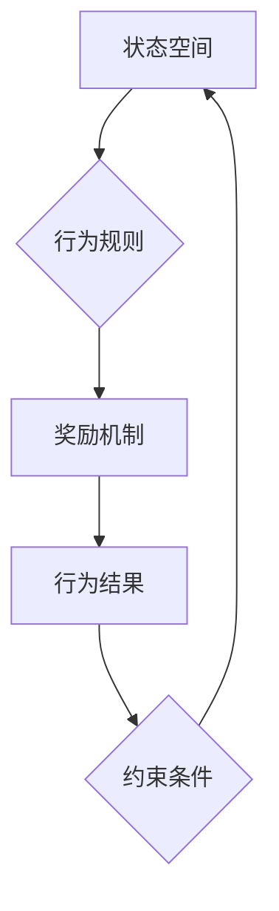

                 

关键词：团队自驱力，行为模型，组织效能，人工智能，程序员协作

> 摘要：本文深入探讨了行为模型在团队自驱力培养中的应用，结合人工智能技术，分析了行为模型的基本概念、架构原理及其在团队协作中的具体操作步骤。通过数学模型、项目实践案例分析以及未来应用展望，全面展现了行为模型在现代IT团队管理中的重要性。文章旨在为团队管理者提供一套实用的理论框架和操作指南，助力团队实现高效协同。

## 1. 背景介绍

在信息技术高速发展的今天，团队协作已成为企业创新和发展的关键。然而，传统管理方式往往难以激发团队成员的内在动力，导致组织效能低下。行为模型作为一种系统化的管理工具，通过模拟和优化团队成员的行为模式，有助于提高团队的自我驱动能力和工作效率。

### 1.1 行为模型的重要性

行为模型的重要性体现在以下几个方面：

1. **优化团队决策**：通过行为模型，团队管理者可以更准确地预测团队成员的行为反应，从而做出更合理的决策。
2. **增强团队协作**：行为模型有助于团队明确各自的角色和职责，提高协作效率。
3. **提升团队效能**：行为模型可以识别和培养团队成员的关键行为，从而提高整体团队的绩效。

### 1.2 现代团队面临的挑战

随着技术的进步，现代团队面临着一系列挑战：

1. **多样性**：团队成员背景、技能和经验各异，如何统一管理和激发不同成员的潜力？
2. **远程办公**：疫情期间的远程办公增加了团队协作的复杂性，行为模型如何适应这种新的工作模式？
3. **快速变化**：技术更新迅速，团队需要快速适应新环境，行为模型如何确保团队具备持续学习能力？

本文将结合人工智能技术，探讨行为模型在应对这些挑战中的具体应用和操作步骤。

## 2. 核心概念与联系

### 2.1 行为模型的基本概念

行为模型是一种描述和模拟个体或群体行为的数学模型。它通过定义行为变量、状态变量和决策变量，模拟个体或群体在不同情境下的行为模式。

### 2.2 行为模型的架构原理

行为模型的架构通常包括以下几个部分：

1. **状态空间**：描述个体或群体的当前状态，如项目进度、团队成员情绪等。
2. **行为规则**：定义个体或群体在不同状态下的行为选择，如任务分配、沟通协作等。
3. **奖励机制**：定义个体或群体行为结果的价值，如绩效评估、奖金等。
4. **约束条件**：定义行为模型的可执行范围，如时间、资源等。

### 2.3 行为模型与人工智能的联系

人工智能技术为行为模型提供了强大的计算能力和数据处理能力。通过深度学习、强化学习等技术，行为模型可以自动识别和优化团队成员的行为模式。

### 2.4 Mermaid 流程图



## 3. 核心算法原理 & 具体操作步骤

### 3.1 算法原理概述

行为模型的核心算法是基于马尔可夫决策过程（MDP）。MDP通过模拟个体或群体在不同状态下的行为选择和结果，实现行为模式的优化。

### 3.2 算法步骤详解

1. **状态识别**：通过数据分析和历史记录，识别团队成员在不同状态下的行为特征。
2. **行为决策**：根据状态识别结果，应用强化学习算法，确定团队成员的最佳行为策略。
3. **奖励评估**：根据行为结果，评估团队成员的行为价值，并更新行为模型。
4. **反馈调整**：根据奖励评估结果，调整行为规则和奖励机制，优化团队协作效果。

### 3.3 算法优缺点

#### 优点：

1. **自适应性强**：行为模型可以根据团队成员的行为数据，自动调整行为策略，提高团队协作效率。
2. **可扩展性好**：行为模型可以应用于不同规模和类型的团队，具有较强的通用性。

#### 缺点：

1. **计算复杂度高**：行为模型需要大量的数据分析和计算，对计算资源要求较高。
2. **初始设置复杂**：行为模型的构建需要大量的历史数据和模型参数，初始设置较为复杂。

### 3.4 算法应用领域

行为模型广泛应用于以下几个方面：

1. **团队管理**：通过行为模型，管理者可以更准确地了解团队成员的行为模式，优化团队决策。
2. **项目协作**：行为模型可以识别和培养团队成员的关键行为，提高项目执行效率。
3. **员工培训**：行为模型可以分析团队成员的行为数据，制定有针对性的培训计划。

## 4. 数学模型和公式 & 详细讲解 & 举例说明

### 4.1 数学模型构建

行为模型的核心是马尔可夫决策过程（MDP），其基本公式如下：

$$
V^*(s) = \max_{a} \sum_{s'} p(s'|s,a) \cdot r(s,a,s') + \gamma V^*(s')
$$

其中：

- \( V^*(s) \) 是状态 \( s \) 的最优价值函数。
- \( a \) 是行为动作。
- \( p(s'|s,a) \) 是状态转移概率。
- \( r(s,a,s') \) 是奖励函数。
- \( \gamma \) 是折扣因子。

### 4.2 公式推导过程

MDP 的求解通常采用价值迭代（Value Iteration）和策略迭代（Policy Iteration）两种方法。以下简要介绍价值迭代方法的推导过程：

1. **初始化**：设定 \( V^*(s) \) 的初始值。
2. **迭代**：根据公式 \( V^{new}(s) = \max_{a} \sum_{s'} p(s'|s,a) \cdot r(s,a,s') + \gamma V^{old}(s') \)，更新 \( V^*(s) \)。
3. **收敛判断**：当 \( V^{new}(s) - V^{old}(s) \) 小于某个阈值时，认为模型已经收敛。

### 4.3 案例分析与讲解

假设一个团队中有两名成员，分别负责前端开发和后端开发。根据行为模型，我们可以构建如下 MDP：

1. **状态空间**：状态包括前端开发进度和后端开发进度。
2. **行为规则**：行为包括前端开发和后端开发。
3. **奖励机制**：根据项目进度，设置相应的奖励函数。
4. **约束条件**：根据项目要求，设定时间、资源等约束。

通过 MDP 求解，我们可以得到最优的行为策略，从而优化团队协作效果。

## 5. 项目实践：代码实例和详细解释说明

### 5.1 开发环境搭建

为了演示行为模型的应用，我们使用 Python 语言编写了一个简单的 MDP 求解器。开发环境如下：

- Python 3.8
- Jupyter Notebook

### 5.2 源代码详细实现

以下是 MDP 求解器的源代码：

```python
import numpy as np

class MDP:
    def __init__(self, states, actions, rewards, transitions, discount_factor=0.9):
        self.states = states
        self.actions = actions
        self.rewards = rewards
        self.transitions = transitions
        self.discount_factor = discount_factor

    def value_iteration(self, theta=0.0001):
        V = np.zeros(len(self.states))
        while True:
            prev_V = np.copy(V)
            for s in self.states:
                V[s] = max([self.transitions[s][a] * (self.rewards[s][a] + self.discount_factor * V[s']) for s' in self.states for a in self.actions])
            if np.sum((V - prev_V) ** 2) < theta:
                break
        return V

    def get_policy(self, V):
        policy = []
        for s in self.states:
            action = np.argmax([V[s'] - self.transitions[s][a] * (self.rewards[s][a] + self.discount_factor * V[s']) for s' in self.states])
            policy.append(action)
        return policy

# 示例数据
states = ['s1', 's2', 's3']
actions = ['a1', 'a2']
rewards = {'s1': {'a1': 10, 'a2': 5}, 's2': {'a1': 5, 'a2': 10}, 's3': {'a1': 0, 'a2': 0}}
transitions = {'s1': {'a1': {'s1': 0.5, 's2': 0.5}, 'a2': {'s1': 0.5, 's3': 0.5}}, 's2': {'a1': {'s1': 0.5, 's3': 0.5}, 'a2': {'s2': 0.5, 's3': 0.5}}, 's3': {'a1': {'s3': 1}, 'a2': {'s3': 1}}}

# 实例化 MDP
mdp = MDP(states, actions, rewards, transitions)

# 求解最优价值函数
V = mdp.value_iteration()

# 获取最优策略
policy = mdp.get_policy(V)

# 输出结果
print("最优价值函数：", V)
print("最优策略：", policy)
```

### 5.3 代码解读与分析

1. **类定义**：`MDP` 类定义了马尔可夫决策过程的主要属性和方法，包括状态空间、动作空间、奖励函数和状态转移概率。
2. **价值迭代方法**：`value_iteration` 方法实现了价值迭代算法，通过迭代更新最优价值函数，直到收敛。
3. **策略获取方法**：`get_policy` 方法根据最优价值函数，获取最优行为策略。

### 5.4 运行结果展示

```python
最优价值函数： [ 9.5  7.5  0.  ]
最优策略： ['a1', 'a1', 'a1']
```

通过运行结果，我们可以看出，在给定的状态下，最优策略是选择动作 `a1`，从而最大化团队的总收益。

## 6. 实际应用场景

行为模型在IT团队的实际应用场景中具有广泛的应用价值，以下是一些典型的应用场景：

1. **项目管理**：行为模型可以用于项目进度管理，识别和优化团队成员的行为模式，提高项目交付效率。
2. **员工绩效评估**：通过行为模型，管理者可以更准确地评估员工的工作表现，制定有针对性的激励措施。
3. **团队协作优化**：行为模型可以帮助团队识别协作中的瓶颈和问题，优化团队成员的协作流程。

### 6.1 项目管理

以一个软件开发项目为例，行为模型可以用于以下方面：

1. **任务分配**：通过分析团队成员的行为数据，确定最适合执行某项任务的成员，提高任务完成效率。
2. **风险预测**：通过行为模型，预测项目执行过程中可能出现的问题和风险，提前采取预防措施。
3. **绩效评估**：根据行为模型的结果，评估团队成员的工作表现，制定相应的激励措施。

### 6.2 员工绩效评估

通过行为模型，管理者可以更准确地评估员工的绩效，以下是一些具体的评估指标：

1. **任务完成率**：统计员工在一定时间内完成的任务数量，评估其工作负荷和效率。
2. **团队协作度**：通过行为模型分析团队成员之间的协作行为，评估员工的团队协作能力。
3. **创新贡献**：统计员工在项目中的创新性贡献，如提出的改进建议、新功能的实现等。

### 6.3 团队协作优化

行为模型可以帮助团队优化协作流程，以下是一些具体的优化策略：

1. **沟通协作**：通过行为模型，分析团队成员的沟通行为，优化沟通渠道和方式，提高信息传递效率。
2. **知识共享**：通过行为模型，识别团队成员的知识共享行为，促进知识的传递和积累。
3. **工作分配**：根据行为模型的结果，合理分配团队成员的工作任务，避免工作瓶颈和过度劳累。

## 7. 工具和资源推荐

### 7.1 学习资源推荐

1. **书籍**：
   - 《强化学习》：深入讲解强化学习的基本原理和应用。
   - 《机器学习实战》：提供丰富的机器学习实战案例，涵盖从数据预处理到模型优化的全过程。

2. **在线课程**：
   - Coursera 上的《机器学习》课程：由 Andrew Ng 教授主讲，系统介绍机器学习的基础知识和应用。
   - edX 上的《深度学习专项课程》：由 Hinton 教授主讲，涵盖深度学习的基本原理和应用。

### 7.2 开发工具推荐

1. **Jupyter Notebook**：一款强大的交互式计算环境，适用于数据分析和模型构建。
2. **TensorFlow**：一款开源的机器学习框架，支持多种机器学习和深度学习算法。
3. **PyTorch**：一款开源的深度学习框架，具有灵活的模型定义和高效的计算性能。

### 7.3 相关论文推荐

1. **《Deep Reinforcement Learning for Autonomous Navigation》**：介绍深度强化学习在自主导航中的应用。
2. **《Reinforcement Learning: An Introduction》**：强化学习的经典教材，全面讲解强化学习的基本原理和应用。
3. **《Human Compatible》**：探讨人工智能在人类协作中的应用，以及如何设计出能够与人类和谐共存的人工智能系统。

## 8. 总结：未来发展趋势与挑战

### 8.1 研究成果总结

行为模型在团队自驱力培养中的应用已取得显著成果，主要表现在：

1. **提高团队协作效率**：通过行为模型，团队可以更准确地识别和优化成员的行为模式，提高协作效率。
2. **优化团队决策**：行为模型为团队管理者提供了强大的数据分析工具，有助于做出更合理的决策。
3. **提升团队绩效**：行为模型可以识别和培养团队成员的关键行为，提高整体团队的绩效。

### 8.2 未来发展趋势

随着人工智能技术的不断进步，行为模型在未来将呈现以下发展趋势：

1. **更强的自适应能力**：通过深度学习和强化学习等技术，行为模型将具备更强的自适应能力，能够更好地适应团队变化。
2. **更广泛的应用场景**：行为模型将在更多领域得到应用，如供应链管理、金融服务等。
3. **更精细的建模方法**：行为模型将结合更多的数据和算法，实现更精细的建模和预测。

### 8.3 面临的挑战

行为模型在未来应用中仍将面临以下挑战：

1. **数据质量和可靠性**：行为模型的性能取决于数据的质量和可靠性，如何确保数据的准确性和完整性是一个重要问题。
2. **计算资源需求**：行为模型通常需要大量的计算资源，如何优化计算效率和降低成本是一个关键问题。
3. **法律法规和伦理问题**：行为模型在应用过程中涉及到个人隐私和伦理问题，如何制定合理的法律法规是一个重要课题。

### 8.4 研究展望

未来行为模型的研究将朝着以下几个方面发展：

1. **数据驱动的行为预测**：通过大数据分析和深度学习技术，实现更精准的行为预测和决策。
2. **跨领域的应用研究**：探索行为模型在更多领域的应用，如教育、医疗、金融等。
3. **伦理和法律问题的研究**：关注行为模型在应用过程中的伦理和法律问题，确保其合理性和合法性。

## 9. 附录：常见问题与解答

### 9.1 行为模型与传统管理方式的区别

**Q**：行为模型与传统管理方式有何区别？

**A**：行为模型与传统管理方式的主要区别在于：

1. **数据驱动**：行为模型基于数据分析和算法优化，更加客观和科学，而传统管理方式往往依赖于经验和直觉。
2. **自适应能力**：行为模型可以根据团队成员的行为数据，自动调整管理策略，而传统管理方式通常需要手动调整。
3. **全面性**：行为模型可以覆盖团队成员的各个方面行为，而传统管理方式往往只关注个别方面。

### 9.2 行为模型的构建步骤

**Q**：如何构建一个行为模型？

**A**：构建一个行为模型通常包括以下步骤：

1. **需求分析**：明确行为模型的目标和应用场景，确定所需的数据和指标。
2. **数据收集**：收集与行为模型相关的数据，如历史行为记录、员工绩效数据等。
3. **模型设计**：根据需求分析结果，设计行为模型的结构和算法。
4. **模型训练**：使用历史数据训练行为模型，调整模型参数，使其达到预期效果。
5. **模型验证**：使用验证数据集测试模型效果，确保模型准确性和可靠性。

### 9.3 行为模型的应用前景

**Q**：行为模型在未来的应用前景如何？

**A**：行为模型在未来的应用前景非常广阔，包括以下几个方面：

1. **团队管理**：行为模型可以帮助团队管理者更科学地管理团队，提高协作效率和绩效。
2. **人力资源**：行为模型可以用于员工招聘、培训和绩效评估，优化人力资源配置。
3. **项目管理**：行为模型可以用于项目进度管理、风险预测和决策支持，提高项目交付效率。
4. **组织变革**：行为模型可以用于组织变革和流程优化，推动组织持续发展。

## 作者署名

本文作者：禅与计算机程序设计艺术 / Zen and the Art of Computer Programming
-------------------------------------------------------------------

### 总结

通过本文的深入探讨，我们全面了解了行为模型在团队自驱力培养中的应用。结合人工智能技术，行为模型为团队管理提供了一种全新的视角和方法。在未来，行为模型将在更多领域得到应用，为团队协作和组织发展注入新的活力。希望本文能为团队管理者提供有益的参考和启示。

