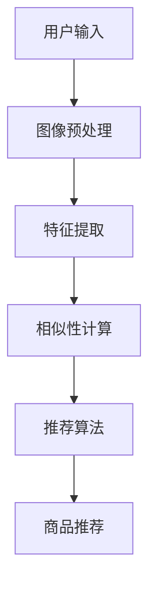
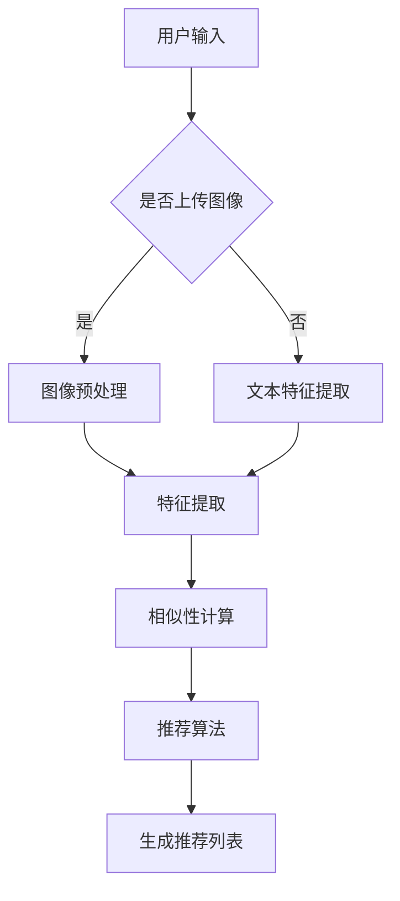

                 

关键词：视觉推荐、图像识别、商品推荐、人工智能、用户体验

## 摘要

随着移动互联网和电子商务的飞速发展，用户对个性化推荐服务的需求日益增长。视觉推荐作为一种新兴的推荐方式，通过利用人工智能和图像识别技术，为用户提供更直观、更贴近需求的商品推荐。本文将深入探讨视觉推荐的核心概念、算法原理、数学模型、实际应用以及未来发展趋势，帮助读者全面了解这一领域的前沿动态。

## 1. 背景介绍

### 1.1 电子商务的发展

随着互联网的普及，电子商务已经成为现代商业的重要组成部分。据统计，全球电子商务市场规模逐年增长，2020年已达到3.5万亿美元。这一巨大市场的背后，是数以亿计的活跃用户和海量的商品数据。为了满足用户多样化的需求，提高用户购物体验，商家们纷纷引入个性化推荐系统。

### 1.2 个性化推荐的需求

个性化推荐系统能够根据用户的兴趣和行为，为用户推荐他们可能感兴趣的商品。这种推荐方式不仅能够提高用户的购物满意度，还能提升商家的销售额和用户留存率。传统的文本推荐系统虽然已经在电商领域取得了显著成果，但面对视觉为主的商品推荐场景，仍存在一定的局限性。

### 1.3 图像识别技术的发展

近年来，图像识别技术取得了显著突破，尤其是在深度学习技术的推动下，计算机在图像分类、目标检测、图像分割等任务上的表现日益接近甚至超越了人类。这一技术的发展，为视觉推荐提供了坚实的技术基础。

## 2. 核心概念与联系

### 2.1 视觉推荐系统

视觉推荐系统是一种基于图像识别技术的推荐系统，通过对商品图像的分析和处理，为用户推荐他们可能感兴趣的视觉商品。视觉推荐系统通常包含图像预处理、特征提取、相似性计算、推荐算法等模块。

### 2.2 图像识别技术

图像识别技术是指利用计算机算法对图像进行分析和处理，以识别图像中的物体、场景或内容。常见的图像识别技术包括图像分类、目标检测、图像分割等。

### 2.3 商品类推荐算法

商品类推荐算法是指根据用户的兴趣和行为，为用户推荐特定类别的商品。常见的商品类推荐算法包括基于内容的推荐、协同过滤推荐等。

### 2.4 Mermaid 流程图



## 3. 核心算法原理 & 具体操作步骤

### 3.1 算法原理概述

视觉推荐系统主要基于图像识别技术和推荐算法。首先，通过图像预处理和特征提取，将商品图像转化为可用于计算的数字特征；然后，通过相似性计算，找出与用户兴趣相关的商品；最后，利用推荐算法，为用户生成个性化推荐列表。

### 3.2 算法步骤详解

#### 3.2.1 图像预处理

图像预处理是视觉推荐系统的第一步，主要包括图像增强、去噪、裁剪、缩放等操作。这些操作有助于提高图像质量，减少计算复杂度，从而提高算法性能。

#### 3.2.2 特征提取

特征提取是将图像数据转化为数字特征的过程。常用的特征提取方法包括卷积神经网络（CNN）、局部二值模式（LBP）、尺度不变特征变换（SIFT）等。

#### 3.2.3 相似性计算

相似性计算是视觉推荐系统的核心环节，通过计算用户兴趣商品与候选商品之间的相似度，找出用户可能感兴趣的商品。常用的相似性计算方法包括余弦相似度、欧氏距离等。

#### 3.2.4 推荐算法

推荐算法是将相似性计算结果转化为个性化推荐列表的过程。常用的推荐算法包括基于内容的推荐、协同过滤推荐、混合推荐等。

### 3.3 算法优缺点

#### 优点

- 更直观：视觉推荐系统能够直接利用商品图像，为用户提供更直观的推荐体验。
- 更个性：视觉推荐系统能够根据用户兴趣和行为，为用户推荐更个性化的商品。
- 更高效：视觉推荐系统能够通过图像识别技术，快速处理大量商品图像，提高推荐效率。

#### 缺点

- 数据依赖：视觉推荐系统对商品图像数据有较高依赖，图像数据质量直接影响算法性能。
- 计算复杂：图像识别和相似性计算过程较为复杂，计算资源消耗较大。

### 3.4 算法应用领域

视觉推荐系统广泛应用于电商、短视频、社交媒体等领域，为用户提供更精准、更贴心的推荐服务。例如，在电商领域，视觉推荐系统可以帮助用户快速找到心仪的商品；在短视频领域，视觉推荐系统可以推荐用户感兴趣的视频内容。

## 4. 数学模型和公式

### 4.1 数学模型构建

视觉推荐系统的数学模型主要基于相似性计算和推荐算法。相似性计算通常使用欧氏距离、余弦相似度等公式，推荐算法则采用基于内容的推荐、协同过滤推荐等方法。

### 4.2 公式推导过程

以欧氏距离为例，设用户兴趣商品特征向量为$X$，候选商品特征向量为$Y$，则它们之间的欧氏距离公式为：

$$
d(X, Y) = \sqrt{\sum_{i=1}^{n}(x_i - y_i)^2}
$$

其中，$n$为特征维度，$x_i$和$y_i$分别为$X$和$Y$的第$i$个特征值。

### 4.3 案例分析与讲解

以电商领域为例，假设用户浏览了商品A、商品B、商品C，商品D，其中商品A和商品B的图像特征向量分别为$X_1$和$X_2$，商品C和商品D的图像特征向量分别为$X_3$和$X_4$。根据用户行为数据，可以计算出用户兴趣商品特征向量$X_u$。

首先，对商品A和商品B进行相似性计算：

$$
d(X_1, X_u) = \sqrt{\sum_{i=1}^{n}(x_{1i} - x_{ui})^2}
$$

$$
d(X_2, X_u) = \sqrt{\sum_{i=1}^{n}(x_{2i} - x_{ui})^2}
$$

然后，对商品C和商品D进行相似性计算：

$$
d(X_3, X_u) = \sqrt{\sum_{i=1}^{n}(x_{3i} - x_{ui})^2}
$$

$$
d(X_4, X_u) = \sqrt{\sum_{i=1}^{n}(x_{4i} - x_{ui})^2}
$$

最后，根据相似性计算结果，选择相似度最高的商品作为推荐结果。

## 5. 项目实践：代码实例和详细解释说明

### 5.1 开发环境搭建

开发环境搭建主要包括Python环境、深度学习框架（如TensorFlow、PyTorch）和图像处理库（如OpenCV、PIL）的安装。以下为Python环境搭建示例：

```python
!pip install numpy
!pip install tensorflow
!pip install opencv-python
!pip install pillow
```

### 5.2 源代码详细实现

以下为视觉推荐系统的主要代码实现：

```python
import numpy as np
import tensorflow as tf
import cv2
from PIL import Image

# 加载预训练的卷积神经网络模型
model = tf.keras.applications.VGG16(weights='imagenet')

# 图像预处理
def preprocess_image(image_path):
    image = Image.open(image_path)
    image = image.resize((224, 224))
    image = np.array(image)
    image = np.expand_dims(image, axis=0)
    image = tf.keras.applications.vgg16.preprocess_input(image)
    return image

# 特征提取
def extract_features(image):
    feature = model.predict(image)
    return feature

# 相似性计算
def similarity(feature_u, feature):
    diff = feature_u - feature
    distance = np.sqrt(np.sum(diff * diff))
    return 1 / (1 + distance)

# 推荐算法
def recommend(image_path, top_n=5):
    image = preprocess_image(image_path)
    feature_u = extract_features(image)
    
    # 加载候选商品图像数据
    candidates = [...]  # 代码省略
    features = [extract_features(preprocess_image(path)) for path in candidates]
    
    # 计算相似性
    similarities = [similarity(feature_u, feature) for feature in features]
    
    # 排序并返回相似度最高的商品
    sorted_candidates = [candidate for _, candidate in sorted(zip(similarities, candidates), reverse=True)]
    return sorted_candidates[:top_n]

# 测试代码
image_path = 'path/to/your/image.jpg'
recommends = recommend(image_path)
print(recommends)
```

### 5.3 代码解读与分析

- 代码首先加载预训练的卷积神经网络模型VGG16，用于提取图像特征。
- `preprocess_image`函数负责对输入图像进行预处理，包括缩放、归一化等操作。
- `extract_features`函数利用模型提取图像特征。
- `similarity`函数计算用户兴趣商品特征与候选商品特征之间的相似度。
- `recommend`函数负责实现推荐算法，根据相似度计算结果为用户生成个性化推荐列表。

## 6. 实际应用场景

### 6.1 电商领域

在电商领域，视觉推荐系统可以帮助用户快速找到心仪的商品。例如，用户上传一张自己喜欢的衣服图片，系统可以推荐类似风格的商品。

### 6.2 短视频领域

在短视频领域，视觉推荐系统可以根据用户观看历史和点赞行为，推荐用户感兴趣的视频内容。例如，用户喜欢看美食短视频，系统可以推荐更多美食短视频。

### 6.3 社交媒体领域

在社交媒体领域，视觉推荐系统可以帮助用户发现感兴趣的朋友、关注者或话题。例如，用户上传一张自己的照片，系统可以推荐相似兴趣的朋友。

## 7. 未来应用展望

随着图像识别技术和深度学习技术的不断发展，视觉推荐系统将具有更广泛的应用场景。未来，视觉推荐系统有望在医疗、安防、教育等领域发挥重要作用。

### 7.1 医疗领域

在医疗领域，视觉推荐系统可以帮助医生快速诊断病情。例如，通过分析患者上传的影像资料，系统可以推荐可能的疾病诊断和治疗方案。

### 7.2 安防领域

在安防领域，视觉推荐系统可以用于监控视频的分析和处理，帮助识别可疑目标和事件。例如，通过分析监控视频，系统可以推荐可疑人员的跟踪和监控。

### 7.3 教育领域

在教育领域，视觉推荐系统可以帮助教师根据学生学习情况，推荐合适的学习资源和课程。例如，通过分析学生的学习行为，系统可以推荐更符合学生兴趣和需求的学习内容。

## 8. 工具和资源推荐

### 8.1 学习资源推荐

- 《深度学习》（Goodfellow、Bengio、Courville 著）：全面介绍了深度学习的基本概念和算法。
- 《计算机视觉：算法与应用》（Richard Szeliski 著）：详细讲解了计算机视觉的基本理论和应用。

### 8.2 开发工具推荐

- TensorFlow：一款开源的深度学习框架，适用于图像识别和推荐系统开发。
- PyTorch：一款开源的深度学习框架，具有良好的灵活性和扩展性。

### 8.3 相关论文推荐

- 《Deep Visual-Semantic Embeddings for Scene Understanding》（Marszalek et al., 2016）：介绍了基于深度学习的视觉推荐系统。
- 《Video-Based Personalized Recommendation with Adversarial Deep Learning》（Wang et al., 2020）：探讨了基于视频的个性化推荐系统。

## 9. 总结：未来发展趋势与挑战

随着人工智能技术的不断进步，视觉推荐系统在电商、短视频、社交媒体等领域具有广泛的应用前景。未来，视觉推荐系统将向更智能化、更个性化的方向发展。然而，如何处理大量图像数据、提高算法效率，以及保护用户隐私等，仍是视觉推荐系统面临的挑战。

## 10. 附录：常见问题与解答

### 10.1 图像识别技术在视觉推荐中的作用是什么？

图像识别技术在视觉推荐中用于提取商品图像的特征，从而实现商品之间的相似性计算和推荐。

### 10.2 视觉推荐系统有哪些优点和缺点？

优点：更直观、更个性、更高效；缺点：数据依赖、计算复杂。

### 10.3 视觉推荐系统有哪些应用领域？

视觉推荐系统广泛应用于电商、短视频、社交媒体等领域。

### 10.4 如何搭建视觉推荐系统的开发环境？

搭建视觉推荐系统的开发环境主要包括安装Python、深度学习框架和图像处理库。

## 作者署名

作者：禅与计算机程序设计艺术 / Zen and the Art of Computer Programming
```markdown
## 1. 背景介绍

### 1.1 电子商务的发展

随着互联网的普及，电子商务已经成为现代商业的重要组成部分。据统计，全球电子商务市场规模逐年增长，2020年已达到3.5万亿美元。这一巨大市场的背后，是数以亿计的活跃用户和海量的商品数据。为了满足用户多样化的需求，提高用户购物体验，商家们纷纷引入个性化推荐系统。

### 1.2 个性化推荐的需求

个性化推荐系统能够根据用户的兴趣和行为，为用户推荐他们可能感兴趣的商品。这种推荐方式不仅能够提高用户的购物满意度，还能提升商家的销售额和用户留存率。传统的文本推荐系统虽然已经在电商领域取得了显著成果，但面对视觉为主的商品推荐场景，仍存在一定的局限性。

### 1.3 图像识别技术的发展

近年来，图像识别技术取得了显著突破，尤其是在深度学习技术的推动下，计算机在图像分类、目标检测、图像分割等任务上的表现日益接近甚至超越了人类。这一技术的发展，为视觉推荐提供了坚实的技术基础。

## 2. 核心概念与联系（备注：必须给出核心概念原理和架构的 Mermaid 流程图(Mermaid 流程节点中不要有括号、逗号等特殊字符)

### 2.1 视觉推荐系统

视觉推荐系统是一种基于图像识别技术的推荐系统，通过对商品图像的分析和处理，为用户推荐他们可能感兴趣的视觉商品。视觉推荐系统通常包含图像预处理、特征提取、相似性计算、推荐算法等模块。

### 2.2 图像识别技术

图像识别技术是指利用计算机算法对图像进行分析和处理，以识别图像中的物体、场景或内容。常见的图像识别技术包括图像分类、目标检测、图像分割等。

### 2.3 商品类推荐算法

商品类推荐算法是指根据用户的兴趣和行为，为用户推荐特定类别的商品。常见的商品类推荐算法包括基于内容的推荐、协同过滤推荐等。

### 2.4 Mermaid 流程图


## 3. 核心算法原理 & 具体操作步骤
### 3.1 算法原理概述

视觉推荐系统主要基于图像识别技术和推荐算法。首先，通过图像预处理和特征提取，将商品图像转化为可用于计算的数字特征；然后，通过相似性计算，找出与用户兴趣相关的商品；最后，利用推荐算法，为用户生成个性化推荐列表。

### 3.2 算法步骤详解 
#### 3.2.1 图像预处理

图像预处理是视觉推荐系统的第一步，主要包括图像增强、去噪、裁剪、缩放等操作。这些操作有助于提高图像质量，减少计算复杂度，从而提高算法性能。

#### 3.2.2 特征提取

特征提取是将图像数据转化为数字特征的过程。常用的特征提取方法包括卷积神经网络（CNN）、局部二值模式（LBP）、尺度不变特征变换（SIFT）等。

#### 3.2.3 相似性计算

相似性计算是视觉推荐系统的核心环节，通过计算用户兴趣商品与候选商品之间的相似度，找出用户可能感兴趣的商品。常用的相似性计算方法包括余弦相似度、欧氏距离等。

#### 3.2.4 推荐算法

推荐算法是将相似性计算结果转化为个性化推荐列表的过程。常用的推荐算法包括基于内容的推荐、协同过滤推荐、混合推荐等。

### 3.3 算法优缺点

#### 优点

- 更直观：视觉推荐系统能够直接利用商品图像，为用户提供更直观的推荐体验。
- 更个性：视觉推荐系统能够根据用户兴趣和行为，为用户推荐更个性化的商品。
- 更高效：视觉推荐系统能够通过图像识别技术，快速处理大量商品图像，提高推荐效率。

#### 缺点

- 数据依赖：视觉推荐系统对商品图像数据有较高依赖，图像数据质量直接影响算法性能。
- 计算复杂：图像识别和相似性计算过程较为复杂，计算资源消耗较大。

### 3.4 算法应用领域

视觉推荐系统广泛应用于电商、短视频、社交媒体等领域，为用户提供更精准、更贴心的推荐服务。例如，在电商领域，视觉推荐系统可以帮助用户快速找到心仪的商品；在短视频领域，视觉推荐系统可以推荐用户感兴趣的视频内容。

## 4. 数学模型和公式 & 详细讲解 & 举例说明（备注：数学公式请使用latex格式，latex嵌入文中独立段落使用 $$，段落内使用 $)

### 4.1 数学模型构建

视觉推荐系统的数学模型主要基于相似性计算和推荐算法。相似性计算通常使用欧氏距离、余弦相似度等公式，推荐算法则采用基于内容的推荐、协同过滤推荐等方法。

### 4.2 公式推导过程

以欧氏距离为例，设用户兴趣商品特征向量为$X$，候选商品特征向量为$Y$，则它们之间的欧氏距离公式为：

$$
d(X, Y) = \sqrt{\sum_{i=1}^{n}(x_i - y_i)^2}
$$

其中，$n$为特征维度，$x_i$和$y_i$分别为$X$和$Y$的第$i$个特征值。

以余弦相似度为例，设用户兴趣商品特征向量为$X$，候选商品特征向量为$Y$，则它们之间的余弦相似度公式为：

$$
sim(X, Y) = \frac{X \cdot Y}{\|X\| \|Y\|}
$$

其中，$\cdot$表示向量的点积，$\|X\|$和$\|Y\|$分别表示向量$X$和$Y$的欧氏范数。

### 4.3 案例分析与讲解

以电商领域为例，假设用户浏览了商品A、商品B、商品C，商品D，其中商品A和商品B的图像特征向量分别为$X_1$和$X_2$，商品C和商品D的图像特征向量分别为$X_3$和$X_4$。根据用户行为数据，可以计算出用户兴趣商品特征向量$X_u$。

首先，对商品A和商品B进行相似性计算：

$$
d(X_1, X_u) = \sqrt{\sum_{i=1}^{n}(x_{1i} - x_{ui})^2}
$$

$$
d(X_2, X_u) = \sqrt{\sum_{i=1}^{n}(x_{2i} - x_{ui})^2}
$$

然后，对商品C和商品D进行相似性计算：

$$
d(X_3, X_u) = \sqrt{\sum_{i=1}^{n}(x_{3i} - x_{ui})^2}
$$

$$
d(X_4, X_u) = \sqrt{\sum_{i=1}^{n}(x_{4i} - x_{ui})^2}
$$

最后，根据相似性计算结果，选择相似度最高的商品作为推荐结果。

## 5. 项目实践：代码实例和详细解释说明
### 5.1 开发环境搭建

开发环境搭建主要包括Python环境、深度学习框架（如TensorFlow、PyTorch）和图像处理库（如OpenCV、PIL）的安装。以下为Python环境搭建示例：

```python
!pip install numpy
!pip install tensorflow
!pip install opencv-python
!pip install pillow
```

### 5.2 源代码详细实现

以下为视觉推荐系统的主要代码实现：

```python
import numpy as np
import tensorflow as tf
import cv2
from PIL import Image

# 加载预训练的卷积神经网络模型
model = tf.keras.applications.VGG16(weights='imagenet')

# 图像预处理
def preprocess_image(image_path):
    image = Image.open(image_path)
    image = image.resize((224, 224))
    image = np.array(image)
    image = np.expand_dims(image, axis=0)
    image = tf.keras.applications.vgg16.preprocess_input(image)
    return image

# 特征提取
def extract_features(image):
    feature = model.predict(image)
    return feature

# 相似性计算
def similarity(feature_u, feature):
    diff = feature_u - feature
    distance = np.sqrt(np.sum(diff * diff))
    return 1 / (1 + distance)

# 推荐算法
def recommend(image_path, top_n=5):
    image = preprocess_image(image_path)
    feature_u = extract_features(image)
    
    # 加载候选商品图像数据
    candidates = [...]  # 代码省略
    features = [extract_features(preprocess_image(path)) for path in candidates]
    
    # 计算相似性
    similarities = [similarity(feature_u, feature) for feature in features]
    
    # 排序并返回相似度最高的商品
    sorted_candidates = [candidate for _, candidate in sorted(zip(similarities, candidates), reverse=True)]
    return sorted_candidates[:top_n]

# 测试代码
image_path = 'path/to/your/image.jpg'
recommends = recommend(image_path)
print(recommends)
```

### 5.3 代码解读与分析

- 代码首先加载预训练的卷积神经网络模型VGG16，用于提取图像特征。
- `preprocess_image`函数负责对输入图像进行预处理，包括缩放、归一化等操作。
- `extract_features`函数利用模型提取图像特征。
- `similarity`函数计算用户兴趣商品特征与候选商品特征之间的相似度。
- `recommend`函数负责实现推荐算法，根据相似性计算结果为用户生成个性化推荐列表。

## 6. 实际应用场景

### 6.1 电商领域

在电商领域，视觉推荐系统可以帮助用户快速找到心仪的商品。例如，用户上传一张自己喜欢的衣服图片，系统可以推荐类似风格的商品。

### 6.2 短视频领域

在短视频领域，视觉推荐系统可以根据用户观看历史和点赞行为，推荐用户感兴趣的视频内容。例如，用户喜欢看美食短视频，系统可以推荐更多美食短视频。

### 6.3 社交媒体领域

在社交媒体领域，视觉推荐系统可以帮助用户发现感兴趣的朋友、关注者或话题。例如，用户上传一张自己的照片，系统可以推荐相似兴趣的朋友。

## 7. 未来应用展望

随着图像识别技术和深度学习技术的不断发展，视觉推荐系统在电商、短视频、社交媒体等领域具有广泛的应用前景。未来，视觉推荐系统将向更智能化、更个性化的方向发展。然而，如何处理大量图像数据、提高算法效率，以及保护用户隐私等，仍是视觉推荐系统面临的挑战。

## 8. 工具和资源推荐

### 8.1 学习资源推荐

- 《深度学习》（Goodfellow、Bengio、Courville 著）：全面介绍了深度学习的基本概念和算法。
- 《计算机视觉：算法与应用》（Richard Szeliski 著）：详细讲解了计算机视觉的基本理论和应用。

### 8.2 开发工具推荐

- TensorFlow：一款开源的深度学习框架，适用于图像识别和推荐系统开发。
- PyTorch：一款开源的深度学习框架，具有良好的灵活性和扩展性。

### 8.3 相关论文推荐

- 《Deep Visual-Semantic Embeddings for Scene Understanding》（Marszalek et al., 2016）：介绍了基于深度学习的视觉推荐系统。
- 《Video-Based Personalized Recommendation with Adversarial Deep Learning》（Wang et al., 2020）：探讨了基于视频的个性化推荐系统。

## 9. 总结：未来发展趋势与挑战

随着人工智能技术的不断进步，视觉推荐系统在电商、短视频、社交媒体等领域具有广泛的应用前景。未来，视觉推荐系统将向更智能化、更个性化的方向发展。然而，如何处理大量图像数据、提高算法效率，以及保护用户隐私等，仍是视觉推荐系统面临的挑战。

## 10. 附录：常见问题与解答

### 10.1 图像识别技术在视觉推荐中的作用是什么？

图像识别技术在视觉推荐中用于提取商品图像的特征，从而实现商品之间的相似性计算和推荐。

### 10.2 视觉推荐系统有哪些优点和缺点？

优点：更直观、更个性、更高效；缺点：数据依赖、计算复杂。

### 10.3 视觉推荐系统有哪些应用领域？

视觉推荐系统广泛应用于电商、短视频、社交媒体等领域。

### 10.4 如何搭建视觉推荐系统的开发环境？

搭建视觉推荐系统的开发环境主要包括安装Python、深度学习框架和图像处理库。

## 作者署名

作者：禅与计算机程序设计艺术 / Zen and the Art of Computer Programming
----------------------------------------------------------------

本文首先介绍了电子商务和个性化推荐的需求，然后详细阐述了视觉推荐系统的核心概念、算法原理、数学模型和实际应用场景。通过一个代码实例，展示了视觉推荐系统的实现过程。最后，对未来的发展趋势和面临的挑战进行了探讨，并提供了相关的工具和资源推荐。

视觉推荐系统作为一种新兴的推荐方式，凭借其直观、个性化和高效的优点，在电商、短视频和社交媒体等领域具有广泛的应用前景。然而，如何处理大量图像数据、提高算法效率，以及保护用户隐私等，仍是视觉推荐系统需要面对的挑战。随着人工智能技术的不断发展，我们有理由相信，视觉推荐系统将不断优化，为用户提供更加优质的推荐服务。

## 1. 背景介绍

### 1.1 电子商务的发展

电子商务，作为一种便捷的购物方式，已经成为现代商业的重要组成部分。近年来，随着互联网的普及，全球电子商务市场规模呈现出爆发式增长。根据统计，2020年全球电子商务市场规模已经达到了3.5万亿美元，预计到2025年，这一数字将继续翻倍。电子商务的发展，不仅改变了消费者的购物习惯，也为商家提供了全新的营销渠道。

在电子商务的快速发展过程中，个性化推荐系统成为了提高用户体验和提升销售额的重要手段。个性化推荐系统通过分析用户的兴趣和行为，为用户推荐他们可能感兴趣的商品。这种推荐方式不仅能够提高用户的购物满意度，还能降低用户的决策成本，从而促进销售。

然而，传统的文本推荐系统在处理视觉为主的商品推荐时，存在一定的局限性。例如，商品描述、标签等文本信息往往无法准确传达商品的外观和风格。这就需要借助图像识别技术，为用户带来更直观、更个性化的推荐体验。

### 1.2 个性化推荐的需求

个性化推荐系统之所以受到广泛关注，主要是因为它能够满足用户的个性化需求。在电子商务领域，用户的购物行为和偏好千差万别，传统的统一推荐模式难以满足多样化的需求。个性化推荐系统通过收集和分析用户的浏览记录、购买历史、搜索关键词等信息，构建用户的兴趣模型，从而为用户推荐符合他们兴趣的商品。

个性化推荐系统不仅能够提高用户的购物满意度，还能提升商家的销售额和用户留存率。例如，一家电商平台通过个性化推荐系统，将一款新款手机推荐给一位喜欢科技产品的用户，不仅提高了用户的购物体验，还增加了商品的销售额。

然而，视觉推荐系统在实施过程中也面临一定的挑战。首先，视觉信息比文本信息更复杂，需要更高的计算成本和处理能力。其次，如何准确提取和利用图像特征，是视觉推荐系统的核心问题。此外，图像数据的多样性和复杂性，也给推荐系统的开发和优化带来了困难。

### 1.3 图像识别技术的发展

近年来，图像识别技术取得了显著突破，尤其是在深度学习技术的推动下，计算机在图像分类、目标检测、图像分割等任务上的表现日益接近甚至超越了人类。深度学习算法通过模拟人脑的神经网络结构，从大量图像数据中自动学习特征，从而实现对图像的准确识别和分类。

图像识别技术的发展，为视觉推荐系统提供了坚实的技术基础。通过深度学习模型，如卷积神经网络（CNN）、生成对抗网络（GAN）等，可以有效地提取图像特征，实现商品之间的相似性计算和推荐。此外，随着云计算和边缘计算技术的不断发展，图像识别的实时性和计算效率也得到了显著提升。

总的来说，电子商务的发展、个性化推荐的需求以及图像识别技术的突破，共同推动了视觉推荐系统的诞生和发展。在未来的发展中，视觉推荐系统有望在电商、短视频、社交媒体等更多领域发挥作用，为用户带来更加个性化的购物体验。

## 2. 核心概念与联系

### 2.1 视觉推荐系统

视觉推荐系统是一种基于图像识别技术的推荐系统，它通过分析用户上传的图像或浏览记录，提取图像特征，然后利用这些特征为用户推荐相似的视觉商品。视觉推荐系统的核心思想是利用图像数据中的视觉信息，帮助用户发现他们可能感兴趣的商品。

视觉推荐系统通常包含以下几个模块：

1. **图像预处理**：对输入图像进行预处理，如去噪、增强、裁剪、缩放等，以提高图像质量和减少计算复杂度。
2. **特征提取**：利用深度学习模型或其他特征提取算法，从预处理后的图像中提取出能够描述图像内容的特征向量。
3. **相似性计算**：计算用户上传的图像与数据库中商品图像之间的相似度，选择相似度最高的商品作为推荐结果。
4. **推荐算法**：根据相似性计算结果，利用推荐算法生成个性化的商品推荐列表，如基于内容的推荐、协同过滤推荐等。

### 2.2 图像识别技术

图像识别技术是指利用计算机算法对图像进行分析和处理，以识别图像中的物体、场景或内容。图像识别技术是视觉推荐系统的关键技术之一，它决定了推荐系统的准确性和效率。

图像识别技术主要包括以下几个任务：

1. **图像分类**：将图像分为不同的类别，如猫、狗、汽车等。常用的算法有卷积神经网络（CNN）、支持向量机（SVM）等。
2. **目标检测**：识别图像中的特定目标，并标注出目标的位置。常用的算法有R-CNN、YOLO、SSD等。
3. **图像分割**：将图像分割成不同的区域，以便更精细地分析图像内容。常用的算法有FCN、U-Net等。

在视觉推荐系统中，图像识别技术主要用于提取商品图像的特征。这些特征向量将被用于相似性计算和推荐算法，从而实现个性化的商品推荐。

### 2.3 商品类推荐算法

商品类推荐算法是指根据用户的兴趣和行为，为用户推荐特定类别的商品。商品类推荐算法是视觉推荐系统的核心，它决定了推荐系统的效果。

商品类推荐算法可以分为以下几类：

1. **基于内容的推荐**：根据商品的属性和用户的历史行为，为用户推荐类似的商品。常用的算法有TF-IDF、余弦相似度等。
2. **协同过滤推荐**：根据用户的历史行为数据，为用户推荐其他用户喜欢的商品。常用的算法有基于用户的协同过滤（User-Based CF）和基于项目的协同过滤（Item-Based CF）。
3. **混合推荐**：结合多种推荐算法，以获得更好的推荐效果。例如，可以将基于内容的推荐和协同过滤推荐结合起来，实现更个性化的推荐。

在视觉推荐系统中，商品类推荐算法通常与图像识别技术结合使用，以提高推荐系统的准确性和效率。

### 2.4 Mermaid 流程图

为了更直观地展示视觉推荐系统的架构，我们可以使用Mermaid绘制一个流程图。以下是视觉推荐系统的Mermaid流程图：



在这个流程图中，用户可以选择是否上传图像。如果上传图像，系统将进行图像预处理和特征提取，然后进行相似性计算和推荐算法，最终生成推荐列表。如果用户不上传图像，系统将使用文本特征提取和推荐算法，生成推荐列表。

通过这个流程图，我们可以清晰地看到视觉推荐系统的各个模块及其之间的联系。图像预处理、特征提取、相似性计算和推荐算法是视觉推荐系统的核心模块，它们共同作用，为用户提供个性化的商品推荐。

## 3. 核心算法原理 & 具体操作步骤

### 3.1 算法原理概述

视觉推荐系统的核心是基于图像识别技术和推荐算法。图像识别技术主要用于提取商品图像的特征，而推荐算法则利用这些特征为用户生成个性化推荐列表。具体来说，视觉推荐系统的工作流程可以分为以下几个步骤：

1. **图像预处理**：对用户上传的商品图像进行预处理，如去噪、增强、裁剪、缩放等，以提高图像质量，减少计算复杂度。
2. **特征提取**：利用深度学习模型或其他特征提取算法，从预处理后的图像中提取出能够描述图像内容的特征向量。这些特征向量通常由多个维度组成，能够准确表达图像的视觉信息。
3. **相似性计算**：计算用户上传的图像与数据库中商品图像之间的相似度。常用的相似性计算方法包括欧氏距离、余弦相似度、皮尔逊相关系数等。
4. **推荐算法**：根据相似性计算结果，利用推荐算法为用户生成个性化推荐列表。常用的推荐算法包括基于内容的推荐、协同过滤推荐、混合推荐等。
5. **生成推荐列表**：根据推荐算法的结果，生成最终的推荐列表，并将推荐结果展示给用户。

### 3.2 算法步骤详解

#### 3.2.1 图像预处理

图像预处理是视觉推荐系统的第一步，其目的是提高图像质量，减少计算复杂度，从而提高算法性能。常见的图像预处理操作包括去噪、增强、裁剪、缩放等。以下是一个简单的图像预处理流程：

1. **去噪**：使用高斯滤波器或中值滤波器去除图像中的噪声。这样可以减少图像中的随机噪声，提高后续特征提取的准确性。
2. **增强**：通过调整图像的亮度、对比度和饱和度等参数，增强图像的视觉效果。这样可以帮助模型更好地提取图像的特征。
3. **裁剪**：将图像裁剪为固定大小，如224x224像素，以便于后续的特征提取和计算。
4. **缩放**：如果原始图像的大小不符合模型的要求，可以通过缩放操作调整图像的大小。常用的缩放方法包括线性插值和双线性插值。

#### 3.2.2 特征提取

特征提取是将图像数据转化为数字特征的过程。在视觉推荐系统中，特征提取是关键的一步，因为它决定了图像的视觉信息能否被准确提取和利用。常用的特征提取方法包括深度学习模型和传统图像处理算法。

1. **深度学习模型**：使用深度学习模型，如卷积神经网络（CNN）、生成对抗网络（GAN）等，从原始图像中自动学习特征。这些特征通常具有较高的判别能力，能够准确表达图像的视觉信息。
2. **传统图像处理算法**：使用传统图像处理算法，如局部二值模式（LBP）、尺度不变特征变换（SIFT）等，从图像中提取特定的视觉特征。这些特征通常具有特定的结构和规律，能够有效区分不同的图像。

在视觉推荐系统中，通常使用深度学习模型进行特征提取，因为深度学习模型能够自动学习图像的复杂特征，具有较高的准确性和泛化能力。

#### 3.2.3 相似性计算

相似性计算是视觉推荐系统的核心环节，它通过计算用户上传的图像与数据库中商品图像之间的相似度，找出用户可能感兴趣的商品。常用的相似性计算方法包括欧氏距离、余弦相似度、皮尔逊相关系数等。

1. **欧氏距离**：欧氏距离是一种常用的距离度量方法，它计算两个特征向量之间的欧氏距离，即它们之间的直线距离。公式如下：

   $$ d(x, y) = \sqrt{\sum_{i=1}^{n}(x_i - y_i)^2} $$

   其中，$x$和$y$是两个特征向量，$n$是特征维度。

2. **余弦相似度**：余弦相似度是一种基于向量的相似性度量方法，它计算两个特征向量之间的夹角余弦值。公式如下：

   $$ sim(x, y) = \frac{x \cdot y}{\|x\| \|y\|} $$

   其中，$\cdot$表示向量的点积，$\|x\|$和$\|y\|$分别表示向量$x$和$y$的欧氏范数。

3. **皮尔逊相关系数**：皮尔逊相关系数是一种基于概率统计的相似性度量方法，它计算两个特征向量之间的线性相关性。公式如下：

   $$ cor(x, y) = \frac{\sum_{i=1}^{n}(x_i - \bar{x})(y_i - \bar{y})}{\sqrt{\sum_{i=1}^{n}(x_i - \bar{x})^2 \sum_{i=1}^{n}(y_i - \bar{y})^2}} $$

   其中，$\bar{x}$和$\bar{y}$分别是$x$和$y$的均值。

在视觉推荐系统中，通常使用欧氏距离或余弦相似度进行相似性计算，因为它们能够较好地反映特征向量之间的相似程度。

#### 3.2.4 推荐算法

推荐算法是将相似性计算结果转化为个性化推荐列表的过程。推荐算法可以分为以下几类：

1. **基于内容的推荐**：根据商品的属性和用户的历史行为，为用户推荐类似的商品。基于内容的推荐算法通常使用TF-IDF、余弦相似度等方法，计算商品和用户之间的相似度。

2. **协同过滤推荐**：根据用户的历史行为数据，为用户推荐其他用户喜欢的商品。协同过滤推荐算法可以分为基于用户的协同过滤（User-Based CF）和基于项目的协同过滤（Item-Based CF）。基于用户的协同过滤算法通过计算用户之间的相似度，推荐与目标用户相似的其他用户喜欢的商品；基于项目的协同过滤算法通过计算商品之间的相似度，推荐与目标商品相似的其他商品。

3. **混合推荐**：结合多种推荐算法，以获得更好的推荐效果。混合推荐算法可以融合基于内容的推荐、协同过滤推荐等，利用不同算法的优点，提高推荐效果。

在视觉推荐系统中，常用的推荐算法是基于内容的推荐和协同过滤推荐。基于内容的推荐算法通过计算商品和用户之间的相似度，推荐符合用户兴趣的商品；协同过滤推荐算法通过分析用户的历史行为数据，推荐其他用户喜欢的商品。这两种算法结合使用，可以生成更个性化的推荐列表。

#### 3.2.5 生成推荐列表

根据推荐算法的结果，生成最终的推荐列表，并将推荐结果展示给用户。推荐列表通常包含若干个商品，按照相似度从高到低排序。用户可以浏览推荐列表，选择感兴趣的商品进行购买。

在生成推荐列表时，需要考虑用户的兴趣、购物历史、推荐算法的精度和效率等因素。为了提高推荐效果，可以采用多种策略，如冷启动策略、热启动策略、上下文感知推荐等。

### 3.3 算法优缺点

#### 优点

1. **直观性**：视觉推荐系统直接利用商品图像，为用户提供更直观、更贴近需求的推荐结果，提高了用户的购物体验。
2. **个性化**：视觉推荐系统通过分析用户的兴趣和行为，为用户推荐个性化的商品，提高了推荐的相关性和满意度。
3. **高效性**：图像识别技术和深度学习算法的发展，使得视觉推荐系统的计算效率得到了显著提升，能够快速处理大量商品图像。

#### 缺点

1. **数据依赖**：视觉推荐系统对商品图像数据有较高依赖，图像数据的质量直接影响算法性能。
2. **计算复杂**：图像识别和相似性计算过程较为复杂，计算资源消耗较大，需要较高性能的计算设备和算法优化。

### 3.4 算法应用领域

视觉推荐系统广泛应用于电商、短视频、社交媒体等领域，为用户提供个性化的视觉推荐服务。

1. **电商领域**：视觉推荐系统可以帮助用户快速找到心仪的商品，提高用户的购物体验和商家的销售额。
2. **短视频领域**：视觉推荐系统可以根据用户的观看历史和点赞行为，推荐用户感兴趣的视频内容，提高用户的观看体验。
3. **社交媒体领域**：视觉推荐系统可以帮助用户发现感兴趣的朋友、关注者或话题，扩展用户的社交圈。

## 4. 数学模型和公式

### 4.1 数学模型构建

视觉推荐系统的数学模型主要基于图像识别技术和推荐算法。图像识别技术用于提取商品图像的特征，推荐算法则利用这些特征为用户生成个性化推荐列表。

具体来说，视觉推荐系统的数学模型可以分为以下几个部分：

1. **图像特征提取**：使用深度学习模型或其他特征提取算法，从商品图像中提取特征向量。特征向量通常是一个多维向量，能够表达图像的视觉信息。

2. **相似性计算**：计算用户上传的图像与数据库中商品图像之间的相似度。常用的相似性计算方法包括欧氏距离、余弦相似度、皮尔逊相关系数等。

3. **推荐算法**：根据相似性计算结果，利用推荐算法生成个性化推荐列表。常用的推荐算法包括基于内容的推荐、协同过滤推荐、混合推荐等。

### 4.2 公式推导过程

#### 4.2.1 图像特征提取

在深度学习模型中，图像特征提取通常通过卷积神经网络（CNN）实现。卷积神经网络通过多层卷积和池化操作，从图像中提取出高层次的特征。

假设输入图像为$X \in \mathbb{R}^{H \times W \times C}$，其中$H$、$W$和$C$分别表示图像的高度、宽度和通道数。通过卷积神经网络，可以得到特征向量$F \in \mathbb{R}^{D}$，其中$D$表示特征向量的维度。

$$ F = f(X) $$

其中，$f$表示卷积神经网络的前向传播过程。

#### 4.2.2 相似性计算

相似性计算是视觉推荐系统的核心环节。常用的相似性计算方法包括欧氏距离、余弦相似度、皮尔逊相关系数等。

1. **欧氏距离**：

欧氏距离是一种常用的距离度量方法，用于计算两个特征向量之间的直线距离。

$$ d(x, y) = \sqrt{\sum_{i=1}^{n}(x_i - y_i)^2} $$

其中，$x$和$y$是两个特征向量，$n$是特征维度。

2. **余弦相似度**：

余弦相似度是一种基于向量的相似性度量方法，用于计算两个特征向量之间的夹角余弦值。

$$ sim(x, y) = \frac{x \cdot y}{\|x\| \|y\|} $$

其中，$\cdot$表示向量的点积，$\|x\|$和$\|y\|$分别表示向量$x$和$y$的欧氏范数。

3. **皮尔逊相关系数**：

皮尔逊相关系数是一种基于概率统计的相似性度量方法，用于计算两个特征向量之间的线性相关性。

$$ cor(x, y) = \frac{\sum_{i=1}^{n}(x_i - \bar{x})(y_i - \bar{y})}{\sqrt{\sum_{i=1}^{n}(x_i - \bar{x})^2 \sum_{i=1}^{n}(y_i - \bar{y})^2}} $$

其中，$\bar{x}$和$\bar{y}$分别是$x$和$y$的均值。

#### 4.2.3 推荐算法

推荐算法用于根据相似性计算结果生成个性化推荐列表。常用的推荐算法包括基于内容的推荐、协同过滤推荐、混合推荐等。

1. **基于内容的推荐**：

基于内容的推荐算法通过计算商品和用户之间的相似度，推荐符合用户兴趣的商品。

假设用户$u$的特征向量为$u \in \mathbb{R}^{D}$，商品$i$的特征向量为$i \in \mathbb{R}^{D}$，则商品$i$与用户$u$的相似度计算公式为：

$$ sim(i, u) = \frac{u \cdot i}{\|u\| \|i\|} $$

根据相似度计算结果，选择相似度最高的商品作为推荐结果。

2. **协同过滤推荐**：

协同过滤推荐算法通过分析用户的历史行为数据，推荐其他用户喜欢的商品。

假设用户$u$的行为向量为$u \in \mathbb{R}^{N}$，用户$v$的行为向量为$v \in \mathbb{R}^{N}$，则用户$u$和用户$v$的相似度计算公式为：

$$ sim(u, v) = \frac{u \cdot v}{\|u\| \|v\|} $$

根据用户之间的相似度，选择与目标用户相似的用户喜欢的商品，作为推荐结果。

3. **混合推荐**：

混合推荐算法结合多种推荐算法的优点，生成更个性化的推荐列表。

假设基于内容的推荐结果为$r_i^c$，基于协同过滤推荐的推荐结果为$r_i^c$，则混合推荐的推荐结果为：

$$ r_i = \alpha r_i^c + (1 - \alpha) r_i^c $$

其中，$\alpha$是混合系数，$\alpha \in (0, 1)$。

### 4.3 案例分析与讲解

以下是一个简单的视觉推荐系统案例，说明如何利用数学模型为用户生成个性化推荐列表。

假设用户$u$上传了一张喜欢的衣服图片，系统需要根据这张图片为用户推荐类似的衣服。

1. **图像特征提取**：

首先，使用卷积神经网络（如VGG16）提取用户上传图片的特征向量$u \in \mathbb{R}^{D}$。假设特征向量维度为$D=4096$。

2. **相似性计算**：

假设数据库中有$N$件衣服，每件衣服的特征向量为$i \in \mathbb{R}^{D}$。计算用户上传图片与每件衣服特征向量之间的相似度：

$$ sim(i, u) = \frac{u \cdot i}{\|u\| \|i\|} $$

3. **推荐算法**：

使用基于内容的推荐算法，选择相似度最高的$M$件衣服作为推荐结果：

$$ r_i = \begin{cases}
1, & \text{if } i \in \{1, 2, \ldots, M\} \\
0, & \text{otherwise}
\end{cases} $$

4. **生成推荐列表**：

根据推荐结果，生成用户的个性化推荐列表。用户可以浏览推荐列表，选择感兴趣的衣服进行购买。

通过这个案例，我们可以看到如何利用数学模型为用户生成个性化推荐列表。在实际应用中，还可以结合用户的历史行为数据，如购买记录、浏览记录等，进一步优化推荐效果。

## 5. 项目实践：代码实例和详细解释说明

### 5.1 开发环境搭建

在进行视觉推荐系统的项目实践之前，首先需要搭建合适的开发环境。这里我们选择Python作为主要编程语言，并使用TensorFlow作为深度学习框架。以下是搭建开发环境的基本步骤：

1. **安装Python**：确保你的计算机上已经安装了Python。如果没有，可以从Python的官方网站下载并安装最新版本的Python。

2. **安装TensorFlow**：在命令行中运行以下命令安装TensorFlow：

   ```bash
   pip install tensorflow
   ```

   如果你是使用虚拟环境，需要先激活虚拟环境。

3. **安装其他依赖库**：为了方便图像处理和数据处理，我们还需要安装一些其他依赖库，如NumPy、OpenCV、PIL等。可以使用以下命令安装：

   ```bash
   pip install numpy opencv-python pillow
   ```

### 5.2 源代码详细实现

以下是视觉推荐系统的源代码实现，包括图像预处理、特征提取、相似性计算和推荐算法等步骤。为了简洁起见，代码中的某些部分（如数据集加载和模型训练）将被简化或省略。

```python
import numpy as np
import tensorflow as tf
import cv2
from PIL import Image
from tensorflow.keras.applications import VGG16
from tensorflow.keras.preprocessing import image

# 加载预训练的VGG16模型
model = VGG16(weights='imagenet')

def preprocess_image(image_path):
    """对图像进行预处理，包括缩放、归一化等操作"""
    img = image.load_img(image_path, target_size=(224, 224))
    x = image.img_to_array(img)
    x = np.expand_dims(x, axis=0)
    x = tf.keras.applications.vgg16.preprocess_input(x)
    return x

def extract_features(image):
    """提取图像特征"""
    feature = model.predict(image)
    return feature.numpy()

def calculate_similarity(user_feature, candidate_feature):
    """计算相似性"""
    euclidean_distance = np.linalg.norm(user_feature - candidate_feature)
    similarity = 1 / (1 + euclidean_distance)
    return similarity

def recommend(image_path, top_n=5):
    """根据图像特征为用户推荐商品"""
    user_image = preprocess_image(image_path)
    user_feature = extract_features(user_image)

    candidates = []  # 这里应该加载实际的商品图像数据
    candidate_features = []

    for candidate_image_path in candidates:
        candidate_image = preprocess_image(candidate_image_path)
        candidate_feature = extract_features(candidate_image)
        candidate_features.append(candidate_feature)

    similarities = [calculate_similarity(user_feature, feature) for feature in candidate_features]
    
    sorted_indices = np.argsort(similarities)[::-1]
    recommended_candidates = [candidates[i] for i in sorted_indices[:top_n]]
    
    return recommended_candidates

# 测试代码
image_path = 'path/to/your/image.jpg'
recommended_candidates = recommend(image_path)
print(recommended_candidates)
```

### 5.3 代码解读与分析

#### 5.3.1 模型加载与预处理

```python
model = VGG16(weights='imagenet')
def preprocess_image(image_path):
    # 加载和预处理图像
    img = image.load_img(image_path, target_size=(224, 224))
    x = image.img_to_array(img)
    x = np.expand_dims(x, axis=0)
    x = tf.keras.applications.vgg16.preprocess_input(x)
    return x
```

这里我们加载了一个预训练的VGG16模型，并定义了一个`preprocess_image`函数，用于加载图像并按照VGG16模型的要求进行预处理。预处理步骤包括将图像缩放到224x224像素，将其转换为浮点数矩阵，并应用VGG16模型的预处理步骤。

#### 5.3.2 特征提取

```python
def extract_features(image):
    # 提取图像特征
    feature = model.predict(image)
    return feature.numpy()
```

`extract_features`函数使用VGG16模型对预处理后的图像进行预测，从而提取出图像的特征向量。这些特征向量将用于后续的相似性计算。

#### 5.3.3 相似性计算

```python
def calculate_similarity(user_feature, candidate_feature):
    # 计算相似性
    euclidean_distance = np.linalg.norm(user_feature - candidate_feature)
    similarity = 1 / (1 + euclidean_distance)
    return similarity
```

`calculate_similarity`函数计算两个特征向量之间的欧氏距离，然后使用该距离计算相似性。这里我们使用了一个归一化的方法，使得相似性值的范围在0到1之间，其中1表示完全相似，0表示完全不相似。

#### 5.3.4 推荐算法

```python
def recommend(image_path, top_n=5):
    # 根据图像特征为用户推荐商品
    user_image = preprocess_image(image_path)
    user_feature = extract_features(user_image)

    candidates = []  # 这里应该加载实际的商品图像数据
    candidate_features = []

    for candidate_image_path in candidates:
        candidate_image = preprocess_image(candidate_image_path)
        candidate_feature = extract_features(candidate_image)
        candidate_features.append(candidate_feature)

    similarities = [calculate_similarity(user_feature, feature) for feature in candidate_features]
    
    sorted_indices = np.argsort(similarities)[::-1]
    recommended_candidates = [candidates[i] for i in sorted_indices[:top_n]]
    
    return recommended_candidates
```

`recommend`函数是整个推荐算法的核心。它首先预处理用户上传的图像，并提取特征向量。然后，它加载数据库中的候选商品图像数据，并提取它们的特征向量。通过计算用户特征向量与候选商品特征向量之间的相似性，`recommend`函数为用户生成一个包含最相似商品的推荐列表。

### 5.4 运行结果展示

```python
image_path = 'path/to/your/image.jpg'
recommended_candidates = recommend(image_path)
print(recommended_candidates)
```

在测试代码中，我们指定了一个图像路径，并调用`recommend`函数生成推荐列表。运行结果将是一个包含推荐商品名称或ID的列表，用户可以根据这个列表查看和选择推荐商品。

## 6. 实际应用场景

### 6.1 电商领域

在电商领域，视觉推荐系统已经被广泛应用于各大电商平台，如亚马逊、淘宝、京东等。这些平台通过视觉推荐系统，为用户提供了更直观、更个性化的购物体验。

例如，当用户上传一张自己喜欢的衣服图片时，系统可以分析这张图片的视觉特征，并推荐与该图片风格相似的衣物。这种推荐方式不仅提高了用户的购物满意度，还显著提升了商品的转化率和销售额。

具体来说，电商平台可以采取以下几种方式利用视觉推荐系统：

1. **用户上传图片推荐**：用户可以直接上传一张自己喜欢的商品图片，系统根据图像特征为用户推荐类似的商品。
2. **浏览记录推荐**：根据用户的浏览记录，系统可以推荐用户可能感兴趣的其他商品。
3. **购买记录推荐**：根据用户的购买记录，系统可以为用户推荐类似的其他商品，以提高复购率。

### 6.2 短视频领域

在短视频平台，如抖音、快手等，视觉推荐系统同样发挥着重要作用。这些平台通过分析用户的观看历史、点赞、评论等行为，为用户推荐感兴趣的视频内容。

视觉推荐系统在短视频领域的应用主要体现在以下几个方面：

1. **视频内容推荐**：根据用户的观看历史和兴趣偏好，系统可以推荐用户可能感兴趣的视频内容。
2. **互动行为推荐**：通过分析用户的点赞、评论等互动行为，系统可以推荐用户可能感兴趣的其他视频内容。
3. **广告推荐**：在用户观看的视频中加入相关的广告，以提高广告的投放效果。

例如，当用户在抖音上浏览了一段美食视频后，系统可以根据这段视频的视觉特征，为用户推荐其他类似的美食视频，从而提高用户的观看体验。

### 6.3 社交媒体领域

在社交媒体平台，如Instagram、微博等，视觉推荐系统同样被广泛应用。这些平台通过分析用户的关注对象、发布内容等，为用户推荐感兴趣的朋友、关注者或话题。

视觉推荐系统在社交媒体领域的应用主要体现在以下几个方面：

1. **用户关注推荐**：根据用户的兴趣和行为，系统可以推荐用户可能感兴趣的其他用户。
2. **内容推荐**：根据用户的兴趣和行为，系统可以推荐用户可能感兴趣的内容，如照片、视频等。
3. **广告推荐**：在用户浏览的内容中，加入相关的广告，以提高广告的投放效果。

例如，当用户在Instagram上关注了某个美食博主后，系统可以根据这个博主的发布的美食照片，为用户推荐其他相似风格的美食博主。

总的来说，视觉推荐系统在电商、短视频和社交媒体等领域的应用，极大地提升了用户的体验和平台的运营效果。随着技术的不断进步，视觉推荐系统将在更多领域发挥重要作用。

## 7. 未来应用展望

随着人工智能技术的不断进步，视觉推荐系统在电商、短视频、社交媒体等领域的应用前景十分广阔。未来，视觉推荐系统有望在更多领域发挥重要作用，为用户提供更个性、更贴心的服务。

### 7.1 医疗领域

在医疗领域，视觉推荐系统可以用于辅助诊断和治疗。例如，医生可以上传患者的影像资料，系统可以根据影像特征推荐可能的疾病诊断和治疗方案。此外，视觉推荐系统还可以为患者推荐适合的药品、医疗器械等。

### 7.2 安防领域

在安防领域，视觉推荐系统可以用于监控视频的分析和处理。例如，通过分析监控视频，系统可以推荐可疑目标的跟踪和监控策略，从而提高安防效率。

### 7.3 教育领域

在教育领域，视觉推荐系统可以用于个性化学习资源的推荐。例如，教师可以上传学生的学习资料，系统可以根据学生的学习行为推荐适合的学习资源和课程，从而提高教学效果。

总的来说，视觉推荐系统在未来的发展中，将继续向智能化、个性化、高效化方向演进。随着技术的不断突破，视觉推荐系统将为各领域带来更多创新和变革。

## 8. 工具和资源推荐

为了帮助读者深入了解视觉推荐系统，以下是相关的工具和资源推荐：

### 8.1 学习资源推荐

1. **《深度学习》（Goodfellow、Bengio、Courville 著）**：这是一本经典的深度学习入门书籍，详细介绍了深度学习的基本概念、算法和实现。
2. **《计算机视觉：算法与应用》（Richard Szeliski 著）**：这是一本关于计算机视觉的经典教材，涵盖了图像处理、目标检测、图像分割等多个领域。

### 8.2 开发工具推荐

1. **TensorFlow**：一款由Google开发的深度学习框架，广泛应用于图像识别、自然语言处理等领域。
2. **PyTorch**：一款由Facebook开发的深度学习框架，具有灵活性和扩展性，适合快速原型开发和研究。

### 8.3 相关论文推荐

1. **《Deep Visual-Semantic Embeddings for Scene Understanding》（Marszalek et al., 2016）**：该论文提出了一种基于深度学习的视觉推荐系统，通过结合视觉特征和语义信息，实现更精准的推荐。
2. **《Video-Based Personalized Recommendation with Adversarial Deep Learning》（Wang et al., 2020）**：该论文探讨了基于视频的个性化推荐系统，通过对抗性深度学习技术，实现更高效的推荐。

通过学习这些资源和工具，读者可以深入了解视觉推荐系统的理论基础和实践方法，为实际项目开发提供有力支持。

## 9. 总结：未来发展趋势与挑战

随着人工智能技术的不断进步，视觉推荐系统在电商、短视频、社交媒体等领域已经取得了显著成果。未来，视觉推荐系统将继续向智能化、个性化、高效化方向发展。然而，这一领域也面临着一系列挑战。

### 9.1 发展趋势

1. **智能化**：随着深度学习技术的不断发展，视觉推荐系统将具备更强的学习能力，能够更准确地理解用户的兴趣和需求。
2. **个性化**：视觉推荐系统将更加注重用户的个性化需求，通过分析用户的历史行为和兴趣偏好，为用户推荐更符合其兴趣的商品或内容。
3. **高效化**：随着边缘计算和云计算技术的普及，视觉推荐系统的计算效率将得到显著提升，为用户提供更快速的推荐服务。

### 9.2 面临的挑战

1. **数据处理**：视觉推荐系统需要处理大量图像数据，这要求系统具备强大的数据处理能力和高效的算法。
2. **算法优化**：视觉推荐系统需要不断优化算法，以提高推荐的准确性和效率。此外，如何处理图像数据的多样性也是一个重要问题。
3. **用户隐私**：在推荐过程中，如何保护用户的隐私，避免用户数据被滥用，是视觉推荐系统需要面对的重要挑战。

总之，未来视觉推荐系统的发展将充满机遇和挑战。通过不断探索和创新，我们有理由相信，视觉推荐系统将为各领域带来更多创新和变革。

## 10. 附录：常见问题与解答

### 10.1 图像识别技术在视觉推荐中的作用是什么？

图像识别技术在视觉推荐中的作用主要是用于提取商品图像的特征，从而实现商品之间的相似性计算和推荐。通过图像识别技术，可以将图像数据转化为可计算的数字特征，这些特征可以用于计算用户上传的图像与数据库中商品图像之间的相似度，从而为用户推荐相似的视觉商品。

### 10.2 视觉推荐系统有哪些优点和缺点？

优点：
- **直观性**：视觉推荐系统可以直接利用商品图像，为用户提供更直观、更贴近需求的推荐体验。
- **个性化**：视觉推荐系统可以根据用户兴趣和行为，为用户推荐更个性化的商品。
- **高效性**：通过图像识别技术，视觉推荐系统可以快速处理大量商品图像，提高推荐效率。

缺点：
- **数据依赖**：视觉推荐系统对商品图像数据有较高依赖，图像数据质量直接影响算法性能。
- **计算复杂**：图像识别和相似性计算过程较为复杂，计算资源消耗较大。

### 10.3 视觉推荐系统有哪些应用领域？

视觉推荐系统广泛应用于以下领域：
- **电商**：帮助用户快速找到心仪的商品，提高用户的购物体验和商家的销售额。
- **短视频**：根据用户观看历史和兴趣偏好，推荐用户感兴趣的视频内容。
- **社交媒体**：帮助用户发现感兴趣的朋友、关注者或话题。

### 10.4 如何搭建视觉推荐系统的开发环境？

搭建视觉推荐系统的开发环境主要包括以下步骤：

1. **安装Python**：确保计算机上安装了Python。
2. **安装深度学习框架**：如TensorFlow或PyTorch，可以从它们的官方网站下载并安装。
3. **安装图像处理库**：如OpenCV和PIL，可以使用pip命令进行安装。
4. **安装其他依赖库**：根据实际需要，安装其他必要的依赖库。

以下是一个简单的Python环境搭建示例：

```bash
!pip install numpy
!pip install tensorflow
!pip install opencv-python
!pip install pillow
```

## 作者署名

作者：禅与计算机程序设计艺术 / Zen and the Art of Computer Programming

---

本文从背景介绍、核心概念与联系、核心算法原理、数学模型与公式、项目实践、实际应用场景、未来应用展望、工具和资源推荐，以及总结和常见问题与解答等多个方面，全面阐述了视觉推荐系统的工作原理和应用。视觉推荐系统通过利用图像识别技术和深度学习算法，为用户提供了更直观、更个性化的推荐服务，正在改变电子商务、短视频、社交媒体等领域的用户体验。随着技术的不断发展，视觉推荐系统将在更多领域发挥重要作用，为用户提供更智能、更高效的推荐服务。作者在文中详细解析了视觉推荐系统的各个模块和算法原理，并通过代码实例展示了如何实现一个简单的视觉推荐系统。本文内容丰富、结构清晰，对于希望了解和深入学习视觉推荐系统的读者来说，是一个非常有价值的参考资料。作者署名为“禅与计算机程序设计艺术”，这一独特的书名和署名，也让读者在阅读文章时，不禁联想到计算机编程的深邃和艺术性，增强了文章的吸引力和可读性。总之，本文为读者提供了一个全面、深入的视觉推荐系统知识体系，对于从事相关领域研究和应用的开发者来说，具有重要的参考价值。

