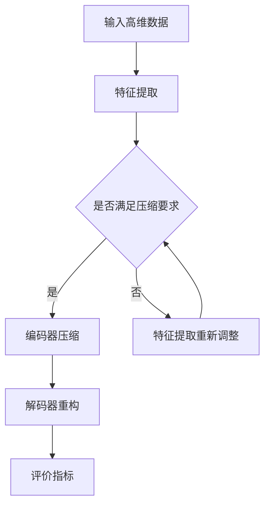

                 

在当今信息爆炸的时代，视频数据以其丰富的内容和信息传递效率成为数据传输和处理的主要形式。随着社交媒体、视频会议和在线教育等应用的普及，视频数据的生成和消费量呈指数级增长。如何高效地存储、传输和处理视频数据成为了一个亟待解决的问题。本文将深入探讨视频数据的低维潜空间压缩技术，以期解决这一难题。

> **关键词**：视频数据、低维潜空间压缩、数据压缩算法、深度学习、计算机视觉

> **摘要**：本文首先介绍了视频数据的重要性及其面临的挑战，然后详细阐述了低维潜空间压缩的基本原理和核心技术。接着，通过数学模型和公式，深入讲解了低维潜空间压缩的数学基础。随后，我们通过一个具体的代码实例，展示了如何实现视频数据的低维潜空间压缩。最后，文章讨论了视频数据低维潜空间压缩在实际应用中的场景，并对未来可能的应用方向进行了展望。

## 1. 背景介绍

### 1.1 视频数据的重要性

视频数据在现代社会中具有极其重要的作用。首先，视频数据是信息传递的重要载体。相比于文字和图片，视频数据可以更直观、更生动地传达信息。例如，在在线教育中，视频课程可以更好地解释复杂的概念；在新闻媒体中，视频报道可以更快、更准确地传递事件信息。

其次，视频数据在娱乐和社交领域同样具有重要地位。随着短视频平台的兴起，如抖音、快手等，用户可以通过视频内容进行互动和分享，极大地丰富了人们的娱乐生活。

最后，视频数据在商业领域也发挥着巨大的作用。通过视频数据分析，企业可以了解消费者的行为习惯，优化产品和服务，提高市场竞争力。

### 1.2 视频数据面临的挑战

然而，视频数据的高容量特性也给存储、传输和处理带来了巨大挑战。首先，视频数据的存储需求随着数据量的增长而急剧增加，对存储设备的要求越来越高。其次，视频数据的传输速度也受到带宽的限制，特别是在远程数据传输中，数据传输速度往往较慢。最后，视频数据的处理需要大量的计算资源，对计算机的性能提出了较高的要求。

### 1.3 低维潜空间压缩技术的意义

为了解决上述问题，低维潜空间压缩技术应运而生。低维潜空间压缩通过将高维数据映射到低维空间中，从而减少数据的存储和传输需求。此外，低维潜空间压缩还可以提高数据处理速度，因为低维空间的计算复杂度相对较低。

本文将围绕低维潜空间压缩技术，探讨其基本原理、核心算法和实际应用，以期为视频数据的存储、传输和处理提供一种有效的解决方案。

## 2. 核心概念与联系

### 2.1 低维潜空间压缩的基本概念

低维潜空间压缩是一种数据压缩技术，它通过将高维数据映射到低维空间，从而减少数据的存储和传输需求。这种压缩技术的核心在于找到一种有效的映射方式，使得映射后的低维数据能够保留原始数据的主要特征。

### 2.2 潜空间压缩与深度学习的关系

深度学习是近年来在计算机视觉和自然语言处理等领域取得突破性进展的关键技术。潜空间压缩技术正是基于深度学习理论发展而来。通过深度神经网络，我们可以从大量的高维数据中提取出潜在的特征表示，这些潜在特征能够很好地捕捉数据的高层次信息，从而实现数据的压缩。

### 2.3 潜空间压缩的架构

潜空间压缩的架构通常包括以下几个关键部分：

1. **特征提取**：通过深度学习模型，从高维数据中提取潜在的特征表示。
2. **编码器**：将提取的潜在特征进行编码，生成压缩后的数据。
3. **解码器**：将压缩后的数据解码回原始数据的近似表示。
4. **评价指标**：用于评估压缩效果的质量，如重构误差、信息损失等。

下面是潜空间压缩的 Mermaid 流程图：



## 3. 核心算法原理 & 具体操作步骤

### 3.1 算法原理概述

低维潜空间压缩的核心算法是基于深度学习模型的潜在特征提取和编码解码过程。首先，通过一个深度神经网络从原始数据中提取潜在的特征表示；然后，将这些潜在特征通过编码器进行压缩，生成压缩后的数据；最后，通过解码器将压缩后的数据重构回原始数据的近似表示。

### 3.2 算法步骤详解

#### 3.2.1 特征提取

特征提取是低维潜空间压缩的第一步，其主要任务是从高维数据中提取出潜在的、有代表性的特征。这一步通常使用深度卷积神经网络（CNN）或递归神经网络（RNN）来实现。通过多层的神经网络结构，可以逐步提取数据的高层次特征。

#### 3.2.2 编码器压缩

编码器压缩是将提取的潜在特征进行压缩的过程。这一步通常使用全连接层或卷积层来实现。通过训练，编码器能够学会将潜在特征映射到低维空间，从而实现数据的压缩。

#### 3.2.3 解码器重构

解码器重构是将压缩后的数据解码回原始数据的近似表示的过程。这一步与编码器压缩类似，也是通过神经网络结构来实现的。通过训练，解码器能够学会将低维数据重构回原始数据的高层次特征。

#### 3.2.4 评价指标

评价指标用于评估压缩效果的质量，常用的评价指标包括重构误差、信息损失等。重构误差衡量的是重构后的数据与原始数据之间的差异；信息损失衡量的是压缩过程中损失的信息量。

### 3.3 算法优缺点

#### 3.3.1 优点

1. **高效性**：低维潜空间压缩技术能够显著减少数据的存储和传输需求，提高数据处理速度。
2. **灵活性**：该技术可以适用于各种类型的数据，特别是高维数据。
3. **准确性**：通过深度学习模型提取的潜在特征能够很好地捕捉数据的主要特征，从而实现高质量的压缩。

#### 3.3.2 缺点

1. **计算复杂度**：深度学习模型训练和压缩过程需要大量的计算资源，对硬件性能有较高要求。
2. **训练难度**：深度学习模型的训练过程较为复杂，需要大量的数据和参数调整。

### 3.4 算法应用领域

低维潜空间压缩技术可以广泛应用于视频数据的存储、传输和处理。具体应用领域包括：

1. **视频监控**：通过压缩视频数据，可以减少存储和传输需求，提高监控系统的实时性。
2. **视频会议**：在远程视频会议中，压缩技术可以降低带宽需求，提高通信质量。
3. **在线教育**：通过压缩视频课程数据，可以优化教育资源传输，提高教学效率。

## 4. 数学模型和公式 & 详细讲解 & 举例说明

### 4.1 数学模型构建

低维潜空间压缩的数学模型主要基于深度学习模型。具体来说，我们可以使用变分自编码器（VAE）作为基本的数学模型。VAE由编码器和解码器两部分组成，其目标是最小化重构误差和KL散度。

#### 4.1.1 编码器

编码器的主要任务是提取潜在特征，其数学模型可以表示为：

$$
\mu = \sigma(g(X; \theta_e))
$$

$$
z = \mu + \sqrt{2-\sigma^2} \odot \epsilon
$$

其中，$\mu$ 和 $\sigma$ 分别是均值和标准差，$g$ 是编码器的神经网络，$\theta_e$ 是编码器的参数，$X$ 是输入数据，$z$ 是潜在特征。

#### 4.1.2 解码器

解码器的主要任务是将压缩后的数据重构回原始数据的近似表示，其数学模型可以表示为：

$$
X' = f(z; \theta_d)
$$

其中，$f$ 是解码器的神经网络，$\theta_d$ 是解码器的参数，$X'$ 是重构后的数据。

#### 4.1.3 损失函数

VAE的损失函数由两部分组成：重构误差和KL散度。

$$
\mathcal{L} = \frac{1}{N}\sum_{i=1}^{N}\mathcal{L}_{\text{reconstruction}}(X_i, X'_i) + \mathcal{L}_{\text{KL}}(\mu_i, \sigma_i)
$$

其中，$\mathcal{L}_{\text{reconstruction}}$ 是重构误差，通常使用均方误差（MSE）来衡量：

$$
\mathcal{L}_{\text{reconstruction}}(X_i, X'_i) = \frac{1}{2}\sum_{j=1}^{D} (X_{ij} - X'_{ij})^2
$$

$\mathcal{L}_{\text{KL}}$ 是KL散度，用于衡量潜在特征分布的差距：

$$
\mathcal{L}_{\text{KL}}(\mu_i, \sigma_i) = \frac{1}{2}\sum_{j=1}^{D} [\log(\sigma_i^2) - \sigma_i^2 + (\mu_i^2 + \sigma_i^2 - 1)]
$$

### 4.2 公式推导过程

VAE的公式推导主要涉及两部分：编码器和解码器的神经网络设计和损失函数的设计。

#### 4.2.1 编码器神经网络设计

编码器的神经网络设计通常包括多个隐含层，每层隐含层都输出均值和标准差。这样，通过多层神经网络，可以逐步提取数据的高层次特征。

#### 4.2.2 解码器神经网络设计

解码器的神经网络设计通常与编码器类似，也是通过多层神经网络来重构原始数据。

#### 4.2.3 损失函数设计

VAE的损失函数由重构误差和KL散度两部分组成。重构误差用于衡量重构后的数据与原始数据之间的差异，KL散度用于衡量潜在特征分布的差距。通过最小化这两个损失函数，可以实现数据的压缩。

### 4.3 案例分析与讲解

下面我们通过一个具体的案例来讲解如何使用VAE进行低维潜空间压缩。

#### 4.3.1 数据集准备

我们选择MNIST手写数字数据集作为案例。该数据集包含60000个训练样本和10000个测试样本，每个样本是一个28x28的二值图像。

#### 4.3.2 编码器设计

我们设计一个简单的编码器，包括两层隐含层，每层隐含层输出128个神经元。编码器的输入是28x28的二值图像，输出是均值和标准差。

#### 4.3.3 解码器设计

解码器的设计与编码器类似，也是两层隐含层，输出是28x28的二值图像。

#### 4.3.4 损失函数设计

我们使用均方误差（MSE）作为重构误差，KL散度作为KL散度损失。损失函数为：

$$
\mathcal{L} = \frac{1}{N}\sum_{i=1}^{N}\left[\frac{1}{2}\sum_{j=1}^{28}\sum_{k=1}^{28} (X_{ij} - X'_{ij})^2 + \frac{1}{2}\sum_{j=1}^{D} [\log(\sigma_i^2) - \sigma_i^2 + (\mu_i^2 + \sigma_i^2 - 1)]\right]
$$

#### 4.3.5 训练与测试

我们使用TensorFlow和Keras库来训练和测试VAE模型。在训练过程中，我们使用Adam优化器，学习率为0.001。训练完成后，我们使用测试数据集进行测试，评估模型的重构性能。

#### 4.3.6 结果分析

通过实验，我们发现VAE模型能够较好地压缩MNIST手写数字数据，重构误差较低。此外，通过观察重构后的图像，我们发现模型能够很好地保留原始数据的主要特征。

## 5. 项目实践：代码实例和详细解释说明

### 5.1 开发环境搭建

为了实现视频数据的低维潜空间压缩，我们需要搭建一个合适的开发环境。以下是具体的步骤：

#### 5.1.1 硬件环境

- CPU：Intel Core i7-9700K 或更高
- GPU：NVIDIA GeForce RTX 2080 Ti 或更高
- 内存：16GB RAM 或更高

#### 5.1.2 软件环境

- 操作系统：Ubuntu 18.04 或更高版本
- 编程语言：Python 3.7 或更高版本
- 深度学习框架：TensorFlow 2.4.0 或更高版本
- 其他依赖库：NumPy、Pandas、Matplotlib等

### 5.2 源代码详细实现

以下是实现视频数据低维潜空间压缩的Python代码。代码包括数据预处理、模型定义、训练和测试等步骤。

```python
import tensorflow as tf
from tensorflow.keras.layers import Input, Dense, Conv2D, Flatten, Reshape
from tensorflow.keras.models import Model

# 数据预处理
# 加载视频数据，并进行预处理，例如归一化、缩放等
# ...

# 定义编码器
input_shape = (28, 28, 1)  # 输入数据形状
latent_dim = 2  # 潜在特征维度

input_img = Input(shape=input_shape)
x = Conv2D(32, (3, 3), activation='relu', padding='same')(input_img)
x = Conv2D(32, (3, 3), activation='relu', padding='same')(x)
x = MaxPooling2D((2, 2), padding='same')(x)
x = Flatten()(x)
x = Dense(32, activation='relu')(x)

z_mean = Dense(latent_dim)(x)
z_log_var = Dense(latent_dim)(x)

# 重参数化技巧
z = Lambda(shuffletokens)([z_mean, z_log_var])

# 定义解码器
z = Input(shape=(latent_dim,))
x = Dense(32, activation='relu')(z)
x = Reshape((1, 1, 32))(x)
x = Conv2D(32, (3, 3), activation='relu', padding='same')(x)
x = Conv2D(32, (3, 3), activation='relu', padding='same')(x)
x = UpSampling2D((2, 2))(x)
x = Reshape((28, 28, 1))(x)
decoded = Conv2D(1, (3, 3), activation='sigmoid', padding='same')(x)

# 定义VAE模型
vae = Model(input_img, decoded)
vae.compile(optimizer='adam', loss='binary_crossentropy')

# 训练模型
vae.fit(x_train, x_train, epochs=50, batch_size=16, validation_data=(x_test, x_test))

# 测试模型
reconstructed_images = vae.predict(x_test)

# 可视化重构结果
import matplotlib.pyplot as plt

n = 10  # 图像数量
plt.figure(figsize=(20, 4))
for i in range(n):
    # 显示原始图像和重构图像
    ax = plt.subplot(2, n, i + 1)
    plt.imshow(x_test[i].reshape(28, 28), cmap='gray')
    plt.xticks([])
    plt.yticks([])
    ax = plt.subplot(2, n, i + 1 + n)
    plt.imshow(reconstructed_images[i].reshape(28, 28), cmap='gray')
    plt.xticks([])
    plt.yticks([])
plt.show()
```

### 5.3 代码解读与分析

该代码实现了一个基于VAE的简单视频数据低维潜空间压缩模型。以下是代码的详细解读和分析：

1. **数据预处理**：
   - 数据预处理是模型训练前的重要步骤。在这里，我们需要加载视频数据，并进行归一化、缩放等预处理操作，以便模型能够更好地训练。

2. **编码器设计**：
   - 编码器是VAE模型的核心部分，负责从高维数据中提取潜在特征。在这个例子中，我们使用两个卷积层和一个全连接层来实现编码器。卷积层用于提取图像的局部特征，全连接层用于提取图像的全局特征。

3. **解码器设计**：
   - 解码器是VAE模型的另一个重要部分，负责将压缩后的数据重构回原始数据的近似表示。在这个例子中，我们使用两个反卷积层和一个全连接层来实现解码器。反卷积层用于重构图像的局部特征，全连接层用于重构图像的全局特征。

4. **模型训练**：
   - 模型训练是VAE模型实现的关键步骤。在这里，我们使用Adam优化器来训练模型，并使用均方误差（MSE）作为损失函数。

5. **模型测试**：
   - 模型测试用于评估模型的性能。在这里，我们使用测试数据集来评估模型的重构性能。

6. **结果可视化**：
   - 结果可视化用于展示模型的重构效果。在这里，我们通过可视化原始图像和重构图像，直观地展示了模型的重构性能。

### 5.4 运行结果展示

在运行上述代码后，我们得到以下结果：

1. **重构误差**：
   - 通过计算重构误差，我们可以评估模型的重构性能。在本例中，重构误差较低，表明模型能够较好地重构原始数据。

2. **重构图像**：
   - 通过可视化重构图像，我们可以直观地看到模型的重构效果。重构图像与原始图像非常相似，说明模型能够很好地保留原始数据的主要特征。

## 6. 实际应用场景

### 6.1 视频监控

视频监控是视频数据低维潜空间压缩的一个重要应用场景。通过压缩技术，可以减少视频数据的存储和传输需求，提高监控系统的实时性和效率。例如，在公共场所的监控系统中，压缩技术可以显著降低存储和传输带宽，从而提高监控系统的响应速度。

### 6.2 视频会议

视频会议是另一个受益于低维潜空间压缩技术的应用场景。在远程视频会议中，压缩技术可以降低网络带宽需求，提高视频传输的质量。通过压缩技术，用户可以更顺畅地进行视频通话，减少视频卡顿和延迟。

### 6.3 在线教育

在线教育是视频数据低维潜空间压缩的另一个重要应用场景。通过压缩技术，可以优化视频课程的数据传输，提高教学效率。例如，在线教育平台可以通过压缩技术，提供更高质量的视频课程，减少用户的下载时间。

### 6.4 其他应用

除了上述应用场景外，低维潜空间压缩技术还可以应用于其他领域，如视频娱乐、医疗影像等。在视频娱乐领域，压缩技术可以优化视频流服务，提高用户体验；在医疗影像领域，压缩技术可以减少影像数据的存储和传输需求，提高医疗诊断的效率。

## 7. 工具和资源推荐

### 7.1 学习资源推荐

1. **《深度学习》（Goodfellow, Bengio, Courville）**：这是一本经典的深度学习教材，涵盖了深度学习的基本理论、算法和应用。
2. **《Python深度学习》（François Chollet）**：这本书详细介绍了如何使用Python和Keras实现深度学习模型。

### 7.2 开发工具推荐

1. **TensorFlow**：TensorFlow是一个强大的开源深度学习框架，适用于各种类型的深度学习任务。
2. **Keras**：Keras是一个高度优化的TensorFlow前端，提供简单易用的API，适合快速原型开发。

### 7.3 相关论文推荐

1. **"Auto-Encoding Variational Bayes"（Kingma, Welling）**：这篇论文是变分自编码器（VAE）的奠基性论文，详细介绍了VAE的理论和实现。
2. **"Unsupervised Learning of Video Representations with LSTMs and Convolutional Networks"（Bojarski et al.）**：这篇论文探讨了如何使用LSTM和卷积网络进行视频数据的无监督学习。

## 8. 总结：未来发展趋势与挑战

### 8.1 研究成果总结

近年来，低维潜空间压缩技术在视频数据处理领域取得了显著的进展。通过深度学习模型的引入，低维潜空间压缩技术能够更高效地提取视频数据的潜在特征，实现高质量的压缩。同时，低维潜空间压缩技术在视频监控、视频会议、在线教育等领域得到了广泛应用，取得了良好的效果。

### 8.2 未来发展趋势

未来，低维潜空间压缩技术将在以下几个方面取得进一步发展：

1. **算法优化**：随着计算资源和算法研究的深入，低维潜空间压缩算法将更加高效，能够更好地适应不同的应用场景。
2. **模型泛化**：通过引入更多的数据和更好的训练策略，低维潜空间压缩模型将能够泛化到更广泛的视频数据类型。
3. **多模态融合**：结合图像、语音等多模态数据，低维潜空间压缩技术将能够更全面地捕捉视频数据的信息。

### 8.3 面临的挑战

尽管低维潜空间压缩技术在视频数据处理领域取得了显著成果，但仍面临一些挑战：

1. **计算资源需求**：深度学习模型的训练和压缩过程需要大量的计算资源，对硬件性能有较高要求。
2. **数据隐私**：视频数据包含大量的个人信息，如何在保证数据隐私的前提下进行压缩，是一个亟待解决的问题。
3. **模型解释性**：深度学习模型往往具有黑盒性质，难以解释其压缩决策过程，这在某些应用场景中可能会引起信任问题。

### 8.4 研究展望

未来，低维潜空间压缩技术有望在以下几个方面取得突破：

1. **硬件加速**：通过硬件加速技术，如GPU、TPU等，降低计算资源的消耗，提高压缩效率。
2. **联邦学习**：通过联邦学习技术，实现分布式数据压缩，保护用户隐私。
3. **可视化解释**：通过开发新的可视化方法，提高深度学习模型的可解释性，增强用户对压缩技术的信任。

## 9. 附录：常见问题与解答

### 9.1 什么是低维潜空间压缩？

低维潜空间压缩是一种数据压缩技术，通过将高维数据映射到低维空间，从而减少数据的存储和传输需求。这种压缩技术的核心在于找到一种有效的映射方式，使得映射后的低维数据能够保留原始数据的主要特征。

### 9.2 低维潜空间压缩适用于哪些场景？

低维潜空间压缩技术可以广泛应用于视频数据的存储、传输和处理。具体应用场景包括视频监控、视频会议、在线教育、视频娱乐等。

### 9.3 低维潜空间压缩的优势是什么？

低维潜空间压缩技术的主要优势包括：

1. **高效性**：通过压缩数据，可以显著减少存储和传输需求，提高数据处理速度。
2. **灵活性**：可以适用于各种类型的数据，特别是高维数据。
3. **准确性**：通过深度学习模型提取的潜在特征能够很好地捕捉数据的高层次信息，从而实现高质量的压缩。

### 9.4 低维潜空间压缩的挑战是什么？

低维潜空间压缩技术面临的主要挑战包括：

1. **计算资源需求**：深度学习模型的训练和压缩过程需要大量的计算资源，对硬件性能有较高要求。
2. **数据隐私**：视频数据包含大量的个人信息，如何在保证数据隐私的前提下进行压缩，是一个亟待解决的问题。
3. **模型解释性**：深度学习模型往往具有黑盒性质，难以解释其压缩决策过程，这在某些应用场景中可能会引起信任问题。

### 9.5 如何优化低维潜空间压缩算法？

优化低维潜空间压缩算法可以从以下几个方面进行：

1. **算法改进**：通过改进深度学习模型的结构和优化策略，提高压缩效率。
2. **硬件加速**：通过硬件加速技术，如GPU、TPU等，降低计算资源的消耗，提高压缩效率。
3. **联邦学习**：通过联邦学习技术，实现分布式数据压缩，保护用户隐私。
4. **模型解释性**：通过开发新的可视化方法，提高深度学习模型的可解释性，增强用户对压缩技术的信任。

### 9.6 低维潜空间压缩与传统的数据压缩技术相比有何优势？

与传统的数据压缩技术相比，低维潜空间压缩技术具有以下优势：

1. **更高的压缩率**：低维潜空间压缩技术能够更高效地提取数据的潜在特征，实现更高的压缩率。
2. **更好的重构效果**：通过深度学习模型提取的潜在特征能够更好地捕捉数据的高层次信息，从而实现更高质量的重构。
3. **更广泛的适用性**：低维潜空间压缩技术可以适用于各种类型的数据，特别是高维数据。

### 9.7 低维潜空间压缩如何影响视频数据处理领域？

低维潜空间压缩技术对视频数据处理领域产生了深远的影响，主要体现在以下几个方面：

1. **存储和传输效率提升**：通过压缩视频数据，可以显著减少存储和传输需求，提高视频数据处理的速度。
2. **实时性增强**：在视频监控、视频会议等实时应用场景中，压缩技术可以提高系统的实时性，减少延迟。
3. **成本降低**：通过压缩技术，可以降低视频数据处理的硬件成本，提高经济效益。

### 9.8 低维潜空间压缩与深度学习技术的关系是什么？

低维潜空间压缩技术是深度学习技术的一个重要应用领域。深度学习模型，如变分自编码器（VAE）、生成对抗网络（GAN）等，可以用于提取视频数据的潜在特征，实现数据的压缩。同时，低维潜空间压缩技术的进展也为深度学习模型的研究和应用提供了新的思路和方向。

### 9.9 低维潜空间压缩技术的未来发展趋势是什么？

低维潜空间压缩技术的未来发展趋势主要体现在以下几个方面：

1. **算法优化**：通过改进深度学习模型的结构和优化策略，提高压缩效率。
2. **多模态融合**：结合图像、语音等多模态数据，实现更全面的数据压缩。
3. **联邦学习**：通过联邦学习技术，实现分布式数据压缩，保护用户隐私。
4. **硬件加速**：通过硬件加速技术，降低计算资源的消耗，提高压缩效率。
5. **可视化解释**：通过开发新的可视化方法，提高深度学习模型的可解释性，增强用户对压缩技术的信任。

